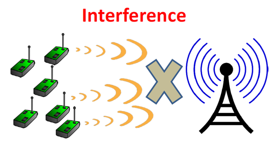
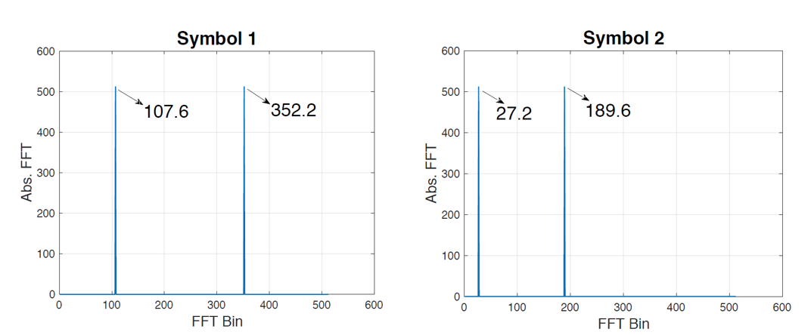
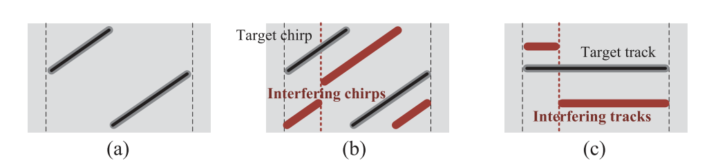
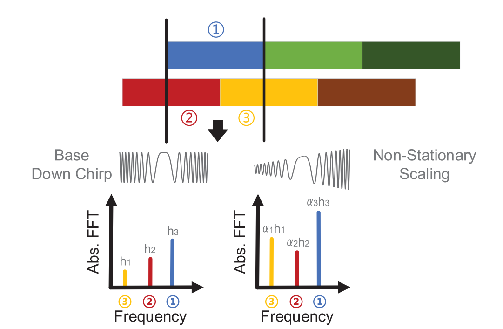

# Concurrent Transmission and Collision Decoding

As introduced earlier, existing LoRa network nodes employ the ALOHA-based data transmission mechanism, which inevitably leads to packet collisions. How severe are these collisions, and how do they impact network performance?

Let us first consider the following question: Can current LoRa networks reliably support large-scale, ubiquitous IoT deployments? In a paper presented at MobiCom ’19 [1], researchers provided a negative answer. Specifically, the authors proposed a metric named *bitflux*, defined as the network throughput required per unit area to support application execution. Using this metric, they quantified the network demands of representative IoT systems—such as Zebranet and GreenOrbs—and compared them against the connectivity capacity of existing LoRa networks. Their analysis concluded that “current LoRa technology cannot fully satisfy the connectivity requirements of large-scale IoT systems.” This highlights that enhancing network capacity—specifically, supporting higher concurrency—is an essential step for LoRa to transition from research to practical deployment.

Figure. Illustration of LoRa signal collision

How, then, can network capacity be improved? Due to LoRa’s long-range transmission capability and star-topology architecture, a single LoRa gateway typically serves thousands of IoT nodes across several square kilometers. Such massive-scale connectivity inherently results in severe packet collisions within LoRa networks. On one hand, collisions cause data corruption and packet loss, wasting scarce channel resources. On the other hand, retransmissions triggered by collisions significantly drain node battery power, thereby severely compromising the operational lifetime of low-power IoT nodes. Therefore, effectively resolving packet collisions in LoRa networks would substantially improve transmission performance and enable LoRa to meet the connectivity demands of most IoT applications.

In wireless networking, strategies for handling packet collisions fall into two broad categories: (i) *collision avoidance*, where scheduling algorithms prevent multiple nodes from simultaneously occupying the same channel; and (ii) *collision cancellation*, where collided packets are separated and recovered post-collision using time-domain or frequency-domain signal features.

Traditional wireless protocols—such as IEEE 802.11—typically adopt collision-avoidance mechanisms: before transmission, nodes sense the channel, and upon detecting occupancy, perform randomized backoff. However, for LoRa nodes, reliable channel-state sensing is extremely difficult due to LoRa’s long transmission range and wide-area coverage. Moreover, carrier-sense mechanisms are impractical under LoRa’s very low signal-to-noise ratio (SNR) conditions: conventional energy-detection-based carrier sensing fails because LoRa signals may reside *below* the noise floor, making detection unreliable. Furthermore, continuous channel sensing increases node energy consumption, shortening operational lifetime. To address these challenges, researchers from Nanyang Technological University proposed the LMAC protocol [2], leveraging LoRa chips’ Channel Activity Detection (CAD) module in conjunction with LoRa gateways to achieve distributed channel-state monitoring. LMAC is the first CSMA protocol deployed in LoRa networks. It exploits the CAD module’s ability to detect LoRa signals with extremely low energy overhead and introduces a globally maintained channel-state table at the gateway. Experiments demonstrate that LMAC improves LoRa’s practical network throughput by up to 2.2×, significantly enhancing its connectivity performance.  
Note that, due to LoRa nodes’ large communication coverage, dense node deployments may substantially degrade network efficiency when using CSMA/CA-like protocols—readers are encouraged to analyze this theoretically. Additionally, hidden-terminal and exposed-terminal effects may further degrade performance.

The second category of collision-resolution techniques employs *collision cancellation*: separating and reconstructing individual collided LoRa packets based on their signal characteristics. Following this principle, researchers have proposed various collision-decoding methods. For instance, Choir [3] exploits hardware-induced frequency offsets across different transmitters to separate collided packets.

Figure. Choir separates collided signals using hardware-specific frequency offsets

During demodulation, packets from distinct nodes exhibit minute but distinguishable frequency offsets. These offsets allow mapping LoRa-encoded symbols to their respective transmitting nodes, thereby enabling collision decoding. Using Choir to decode collided signals in the network yields up to a 6.84× improvement in overall LoRa network throughput.

Figure. Choir resolves collisions using subtle peak-frequency differences

Beyond frequency-domain separation, other works exploit time-domain features—specifically, the differential arrival times of packets at the gateway—to disentangle collided symbols. mLoRa [4] is a representative example leveraging time-domain signal characteristics for collision cancellation. When multiple packets arrive sequentially at the gateway and collide, the initial segment of the composite received signal remains uncorrupted and can be correctly decoded. From this clean segment, one symbol from one of the colliding packets is identified and reconstructed; subtracting its contribution from the composite signal reveals another clean segment. This process iterates until all collided packets are fully separated.

Figure. mLoRa collision-decoding illustration

FTrack [5], proposed in 2019, also exploits inter-packet arrival-time differences—but differs by directly analyzing spectral features and leveraging temporal continuity of signals in the spectrogram to distinguish packets originating from different nodes. Collectively, these methods extract diverse signal features to effectively increase LoRa’s practical throughput. However, they share a critical limitation: all require relatively high SNR (SNR > 0). Under low-SNR conditions (SNR < 0), accurately estimating minute frequency offsets, identifying clean time-domain segments, or isolating collided packets in time-frequency representations becomes extremely challenging. Consequently, these methods fail in low-SNR scenarios—precisely the regime common in real-world LoRa deployments, where signal power often falls *below* the noise floor. Thus, their applicability in practical LoRa systems remains constrained.

Figure. FTrack collision-decoding illustration

To better address LoRa packet-collision challenges, our research group has conducted the following work:

1) To enable collision separation under low-SNR conditions, we proposed CoLoRa [6]—a method that separates collided signals based on *peak-ratio features in the frequency domain*. Specifically, at the receiver, we employ a set of reception windows deliberately misaligned with the collided packets, such that each encoded symbol is split across two adjacent windows. We then perform standard LoRa demodulation on each window and apply Fourier transforms to convert each symbol into two adjacent spectral peaks. Due to the properties of the Fourier transform, the heights of these peaks are proportional to the symbol’s duration within the respective window. For each symbol, we compute the ratio of the two peak heights as its distinguishing feature. This ratio depends solely on the relative timing offset between the symbol and the window boundaries; symbols from the same packet yield identical ratios, whereas symbols from different packets produce distinctly different ratios. Leveraging this property, we cluster and separate collided symbols via peak-height ratios, achieving collision decoding. Crucially, this approach exploits LoRa’s energy-concentration property during demodulation, transforming fragile time-domain features into robust frequency-domain peak features—enabling reliable collision separation even at extremely low SNR.

Figure. CoLoRa collision-decoding illustration

2) To further enhance the LoRa receiver’s collision-decoding capability and relax constraints on reception-window selection, we proposed NScale [7]—a collision-decoding protocol enabling arbitrary reception windows. NScale explicitly models the energy-distribution characteristics of LoRa symbols: symbols from different packets occupy distinct energy-distribution intervals within a given window. Prior to demodulation, NScale applies non-uniform amplitude scaling to the windowed signal. By comparing peak-height changes before and after scaling, it infers each symbol’s positional distribution within the window. Finally, exploiting the unique time-of-arrival signatures of different packets, NScale completes collision separation and decoding. Figure 13-1 illustrates NScale’s core idea.

Figure. NScale collision-decoding illustration

3) The above collision-decoding approaches rely on offline signal analysis and thus cannot perform *real-time* decoding. To address this, we propose Pyramid [8]—a streaming algorithm model enabling real-time LoRa collision decoding. Pyramid similarly exploits arrival-time differences and signal strength, but performs standard LoRa demodulation at finer granularity. Crucially, instead of discarding intermediate results, it records *all spectral peaks*. Theoretically, peak height is proportional to the symbol’s duration within the window; continuously applying this operation yields a triangular trajectory for each symbol’s peak heights. Collided signals thus produce overlapping “pyramids” in the peak-trajectory space. Pyramids belonging to the same packet appear at regular intervals, with inter-peak spacing exactly equal to one symbol duration. Classifying these peaks accordingly achieves collision separation. This scheme requires no special packet alignment, enabling simple, repetitive processing. Pyramid’s implementation is open-sourced at [https://github.com/jkadbear/gr-lora](https://github.com/jkadbear/gr-lora).

Collectively, existing research efforts in both collision avoidance and collision cancellation have increased LoRa gateways’ concurrent-reception capability by over an order of magnitude—without requiring additional hardware—thereby dramatically improving practical network throughput and enabling connectivity for increasingly large-scale IoT systems.

Figure. Pyramid collision-decoding illustration

## References
1. Ghena B, Adkins J, Shangguan L, et al. Challenge: Unlicensed LPWANs are not yet the path to ubiquitous connectivity. The 25th Annual International Conference on Mobile Computing and Networking. 2019: 1–12.

2. Gamage A, Liando J C, Gu C, et al. LMAC: Efficient carrier-sense multiple access for LoRa. Proceedings of ACM MobiCom. 2020: 1–13.

3. Eletreby R, Zhang D, Kumar S, et al. Empowering low-power wide area networks in urban settings. Proceedings of ACM SIGCOMM. 2017: 309–321.

4. Wang X, Kong L, He L, et al. MLoRa: A multi-packet reception protocol in LoRa networks. IEEE 27th IEEE ICNP. 2019: 1–11.

5. Xia X, Zheng Y, Gu T. FTrack: Parallel decoding for LoRa transmissions. Proceedings of ACM SenSys. 2019: 192–204.

6. Tong S, Xu Z, Wang J. CoLoRa: Enabling Multi-Packet Reception in LoRa. Proceedings of IEEE INFOCOM. 2020: 2303–2311.

7. Tong S, Wang J, Liu Y. Combating packet collisions using non-stationary signal scaling in LPWANs. Proceedings of ACM MobiSys. 2020: 234–246.

8. Xu, Zhenqiang, Xie, Pengjin, and Wang, Jiliang. Pyramid: Real-Time LoRa Collision Decoding with Peak Tracking. Proceedings of IEEE INFOCOM. 2021.