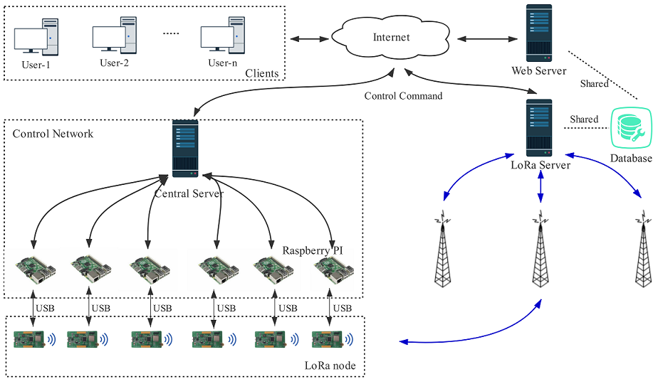
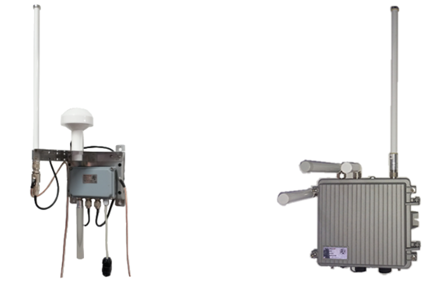
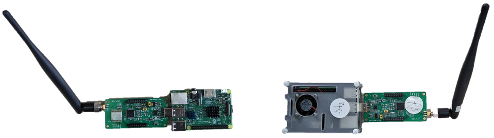
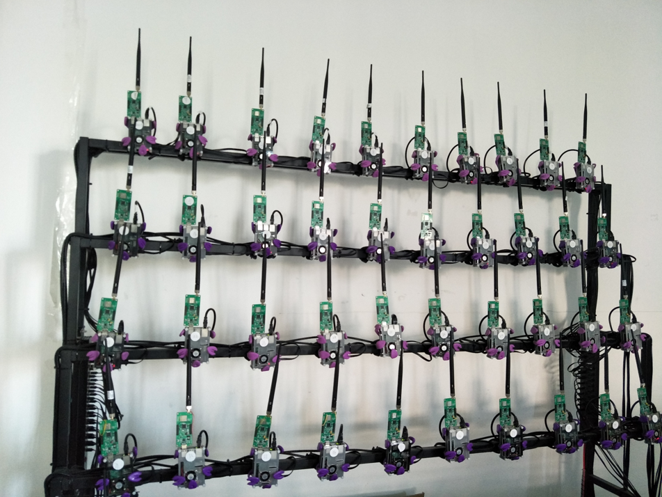
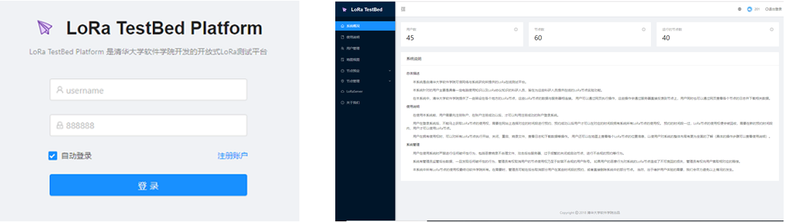

# LoRa Testbed

## Background
In LoRa research, network performance testing is essential. Due to the large-scale nature of LoRa networks, experimental setup can be cumbersome. A critical requirement is establishing an appropriate test infrastructure. In our prior research on wireless sensor networks, we experienced this challenge firsthand: without a well-designed test infrastructure, development becomes exceptionally difficult.

This issue is even more pronounced in Low-Power Wide-Area Network (LPWAN) LoRa research. Currently, most researchers overlook it; consequently, experiments—including those reported in cutting-edge research and academic publications—are often inefficient, incomplete, and inconvenient, resulting in relatively small-scale deployments.

Typically, efficient experimentation requires satisfying at least the following conditions:  
1) The ability to update firmware on nodes at any time;  
2) Effective collection of node data;  
3) Convenient deployment and visualization of data.

Many performance and metric measurements in LoRa research require extensive repetition and large-scale deployments. Although these mechanical, repeatable operations are conceptually simple, they incur substantial labor costs and waste significant human effort.

Therefore, a platform enabling rigorous, transparent, and reproducible evaluation of scientific theories, computational tools, and emerging technologies is critically important—and constructing a testbed is one such approach.

In Internet research, scholars have developed numerous classic testbed systems—for example, the wireless sensor network testbeds [MoteLab](https://syrah.eecs.harvard.edu/files/syrah/files/motelab-spots05.pdf)[2], [FlockLab](https://gitlab.ethz.ch/tec/public/flocklab/wikis/home)[17], and [INDRIYA2](https://web.archive.org/web/20070912105942/http://pdos.csail.mit.edu:80/roofnet/doku.php)[4]; the 802.11b/g testbed [Roofnet](https://web.archive.org/web/20070912105942/http://pdos.csail.mit.edu:80/roofnet/doku.php)[3]; as well as [OpenChirp](https://users.ece.cmu.edu/~agr/resources/publications/openchirp-smart-edge-17.pdf) and the [LoRa platform](https://lora.aliosthings.io) integrated into Alibaba’s AliOS Things.

<!-- ## LoRa Testbed -->
The LoRa testbed was originally conceived to enable convenient and rapid operation and experimentation with LoRa devices. Considering LoRa’s long-range communication characteristics, the testbed must support mobility—not being confined to a fixed location. To facilitate control and data acquisition from LoRa nodes, we designed a Raspberry Pi–based control architecture for LoRa nodes.

Existing LoRa networks feature extremely low data rates, making over-the-air reprogramming infeasible. Yet, evaluating different protocols on LoRa nodes necessitates frequent firmware updates.

We first adopted an out-of-band (OOB) control scheme—using alternative communication media such as Wi-Fi or 4G to carry control messages for managing the LoRa testbed. However, this approach suffers from the need for additional power and network infrastructure—conditions rarely available in outdoor environments.

Hence, we also developed an online reprogramming system based on LoRa signals, enabling firmware updates directly over the LoRa network—further eliminating dependencies on external power and network connectivity.

**Implemented Capabilities**

* Flash new firmware  
* Power on, power off, and reboot LoRa nodes  
* Batch execution of the above operations  
* Remote reprogramming of LoRa nodes  
* Real-time data acquisition  
* Data visualization  
* Data export and download  

## LoRa Testbed Architecture Design

The LoRa testbed architecture is illustrated below:

<center>

</center>

<center>
<div style="color:orange; border-bottom: 1px solid #d9d9d9;
display: inline-block;
color: #999;
padding: 2px;">Figure. Testbed architecture design</div>
</center>

The testbed platform consists of three main components:

- **LoRa Component Stack**: Comprising LoRa nodes, gateways, and servers, implementing LoRa-specific protocols.

  Blue arrows indicate communication flows. LoRa nodes are deployed at various locations across campus. Several gateways are also deployed indoors, enabling formation of a functional LoRa network for experimentation. Each LoRa node connects to a Raspberry Pi–based edge node. All Raspberry Pi edge nodes communicate with a central server via out-of-band channels (e.g., cellular networks). Thus, the central server can dispatch commands to individual edge nodes for node control and collect data from them. Importantly, control and data collection operate independently of the LoRa network’s performance—ensuring continued manageability and diagnostic capability even if the LoRa network itself encounters issues.

- **Control Platform**: Two distinct control schemes are implemented to accommodate different application scenarios.

  As shown in the architecture diagram (lower-left), the first scheme is our custom control network: the central server receives instructions from the web server and forwards them to Raspberry Pi systems. Since each Raspberry Pi connects to its associated LoRa node via USB, it relays commands to the node—achieving remote node control.  
  Because LoRa supports bidirectional communication, we also implemented an autonomous firmware update system that leverages the LoRa network itself for program updates. This system operates independently of external power or network infrastructure, making it suitable for outdoor deployment.

- **Client System**:  

  Clients connect to the web server over the network to perform operations. We provide an intuitive user interface. Data sharing between the web server and the LoRa server is achieved through a shared database.

### LoRa Components

- **Server**  
  The LoRa service imposes no special hardware requirements on the server; thus, further details are omitted.

- **Gateway**  
  We primarily use two types of LoRa gateways, shown below.  
  <!-- [Gateway 1](http://risinghf.com/#/product-details?product_id=18&lang=zh) and [Gateway 2](http://risinghf.com/#/product-details?product_id=2&lang=zh) (images sourced from [here](http://risinghf.com)): -->

  <center>
  
  </center>

  <center>
  <div style="color:orange; border-bottom: 1px solid #d9d9d9;
  display: inline-block;
  color: #999;
  padding: 2px;">Figure. Gateway devices</div>
  </center>

  Both gateways employ ARM Cortex-A53 processors running at 1.2 GHz. Their differences lie in enclosure design and auxiliary features—for instance, Gateway 2 supports battery power and offers additional interfaces. Currently, the testbed includes three Gateway 1 units and two Gateway 2 units.

- **Nodes**  
  The testbed provides two node variants, differing primarily in MCU, RF transceiver, and peripheral sensors—and also in physical packaging, optimized respectively for indoor and outdoor deployment.

  <center>
  
  </center>

  <center>
  <div style="color:orange; border-bottom: 1px solid #d9d9d9;
  display: inline-block;
  color: #999;
  padding: 2px;">Figure. Outdoor and indoor nodes</div>
  </center>

  Node 1 uses the SX1268 RF transceiver, STM32L083 MCU, and integrates GPS, temperature/humidity, and motion sensors. Node 2 employs the SX1278 RF transceiver, STM32L53 MCU, and includes a serial interface.

  Node 1 has been further encapsulated for waterproofing and moisture resistance and equipped with a solar panel to enable long-term outdoor operation, as shown below:

  <center>
  
  </center>

  <center>
  <div style="color:orange; border-bottom: 1px solid #d9d9d9;
  display: inline-block;
  color: #999;
  padding: 2px;">Figure. Encapsulated outdoor node</div>
  </center>

  For Node 2, we establish a serial connection with a Raspberry Pi to confer mobility and remote controllability—typically used indoors, as shown below:

  <center>
  
  </center>

  <center>
  <div style="color:orange; border-bottom: 1px solid #d9d9d9;
  display: inline-block;
  color: #999;
  padding: 2px;">Figure. Encapsulated indoor testbed node</div>
  </center>

### Control Platform

As previously introduced, we designed two control systems: the Raspberry Pi management system and the node-based over-the-air (OTA) firmware update system.

* **Raspberry Pi Management System**  
  **LoRa Node Control**: Control relies on serial communication between the Raspberry Pi and LoRa nodes. To enable node responsiveness to commands (e.g., flashing, powering on/off), a bootloader must be implemented on each node.  
  **Raspberry Pi–to–Central Server Connectivity**: In Wi-Fi–enabled environments, we use Wi-Fi. In Wi-Fi–denied settings, both Raspberry Pis and LoRa nodes are equipped with cellular modems. Additionally, to support real-time node control and log collection, we established dedicated one-to-one network connections between each Raspberry Pi and the central server for data transmission.

* **Autonomous Firmware Update System**  
  We adopt a delta-updating strategy for OTA firmware updates on LoRa nodes, comprising two modules: an update generation module and a node-side local update module. The update generation module analyzes ELF binaries of old and new firmware versions to produce compact delta update files. The LoRa server then delivers these files to target nodes via gateways. Upon verifying file integrity, each node jumps to its In-Application Programming (IAP) routine to apply the update; upon completion, execution resumes in the user application.

  > Consider how remote reprogramming can be practically realized on ultra-low-power LoRa devices operating under severely constrained bandwidth—a nontrivial technical challenge.

### Client System

We provide a simple, intuitive graphical interface for client-side interaction.

## LoRa Testbed Deployment Status

**Gateways**  
Initially, we deployed three Gateways of Type 1, as shown in the gateway deployment map below.

<center>

</center>

<center>
<div style="color:orange; border-bottom: 1px solid #d9d9d9;
display: inline-block;
color: #999;
padding: 2px;">Figure. Gateway deployment layout</div>
</center>

From top to bottom, these are Gateway 2, Gateway 1, and Gateway 3, mounted at heights of 36 m, 18 m, and 12 m, respectively.  
All gateways operate in the CN470 frequency band. Each runs Raspbian OS on a Raspberry Pi 3 Model B with the latest firmware. Both gateways are equipped with 3 dBi gain antennas.

**Nodes**  
Some test locations suffer from poor signal coverage; therefore, spreading factor (SF) is typically set to either 7 (maximum data rate) or 12 (maximum range), with channel bandwidth fixed at 125 kHz.

Node deployment is categorized into outdoor and indoor configurations—termed the *Outdoor Testbed* and *Indoor Testbed*, respectively.

* **Outdoor Testbed**: Initially deployed with ~50 nodes, including both stationary and mobile units.  
  Below shows the geographic positions and physical deployment of nine stationary nodes.

  <center>
  
  </center>

  <center>
  <div style="color:orange; border-bottom: 1px solid #d9d9d9;
  display: inline-block;
  color: #999;
  padding: 2px;">Figure. Outdoor node deployment</div>
  </center>

* **Indoor Testbed**: Consists of 50 nodes, as shown below.

  <center>
  
  </center>

  <center>
  <div style="color:orange; border-bottom: 1px solid #d9d9d9;
  display: inline-block;
  color: #999;
  padding: 2px;">Figure. Indoor testbed</div>
  </center>

  Each node connects to a dedicated Raspberry Pi via serial interface; each Raspberry Pi connects to an Ethernet switch for IP address assignment.

## LoRa Testbed User Guide

Access the testbed homepage at [http://thulpwan.top](http://thulpwan.top).

1. **Registration**  

    <center>
    
    </center>

    <center>
    <div style="color:orange; border-bottom: 1px solid #d9d9d9;
    display: inline-block;
    color: #999;
    padding: 2px;">Figure. Registration page</div>
    </center>

    After registration, wait for email confirmation containing your account credentials before logging in.

2. **Login**  

    <center>
    
    </center>

    <center>
    <div style="color:orange; border-bottom: 1px solid #d9d9d9;
    display: inline-block;
    color: #999;
    padding: 2px;">Figure. Login and operational interface</div>
    </center>

    Log in using the provided username and password to access the homepage.

3. **Operation**  
    Further usage instructions are available in the **User Guide** section of the sidebar menu on the homepage.

## Control Platform Implementation

* **Raspberry Pi Management System**  
  Implemented using a frontend–backend separation architecture.

  1. **Frontend**  
     Built with Ant Design Pro—a React-based solution scaffolded by Umi.  
     This framework is straightforward to deploy: simply navigate to the installation directory and execute  

     ```
     npm install
     npm start
     ```

     to launch the application.  

     During development, each page corresponds to a JavaScript file in the framework. Page rendering is handled by the `render()` function, which returns a DOM fragment inserted into the designated UI region. Developers may pass parameters to dynamically control rendering behavior—enabling conditional UI presentation.  
     Key frontend pages include: **System Overview**, **User Guide**, **Map View**, **Node Reservation**, **Node Management**, **LoRaServer**, and **About Us**.

  2. **Backend**  
     Implemented using Java with the Spring, SpringMVC, and MyBatis frameworks (collectively known as the SSM stack). Project construction is managed via Maven, with Spring, SpringMVC, and MyBatis integrated through `pom.xml`.

## References

[1] https://en.wikipedia.org/wiki/Testbed

[2] Werner-Allen, Geoffrey, Patrick Swieskowski, and Matt Welsh. "Motelab: A wireless sensor network testbed." Proceedings of the 4th international symposium on Information processing in sensor networks. IEEE Press, 2005.

[3] Aguayo, Daniel, et al. "Link-level measurements from an 802.11 b mesh network." ACM SIGCOMM Computer Communication Review. Vol. 34. No. 4. ACM, 2004.

[4] Doddavenkatappa, Manjunath, Mun Choon Chan, and Akkihebbal L. Ananda. "Indriya: A low-cost, 3D wireless sensor network testbed." International conference on testbeds and research infrastructures. Springer, Berlin, Heidelberg, 2011.

[5] Yousuf, Asif M., Edward M. Rochester, and Majid Ghaderi. "A low-cost LoRaWAN testbed for IoT: Implementation and measurements." 2018 IEEE 4th World Forum on Internet of Things (WF-IoT). IEEE, 2018.

[6] Navarro-Ortiz, Jorge, et al. "A LoRaWAN testbed design for supporting critical situations: prototype and evaluation." Wireless Communications and Mobile Computing 2019 (2019).

[7] Trüb, Roman, et al. "Demo Abstract: A Testbed for Long-Range LoRa Communication." 2019 18th ACM/IEEE International Conference on Information Processing in Sensor Networks (IPSN). IEEE, 2019.

[8] Marais, Jaco M., Reza Malekian, and Adnan M. Abu-Mahfouz. "LoRa and LoRaWAN testbeds: A review." 2017 Ieee Africon. IEEE, 2017.

[9] Bankov, Dmitry, Evgeny Khorov, and Andrey Lyakhov. "On the limits of LoRaWAN channel access." 2016 International Conference on Engineering and Telecommunication (EnT). IEEE, 2016.

[10] Petajajarvi, Juha, et al. "On the coverage of LPWANs: range evaluation and channel attenuation model for LoRa technology." 2015 14th International Conference on ITS Telecommunications (ITST). IEEE, 2015.

[11] Cenedese, Angelo, et al. "Padova smart city: An urban internet of things experimentation." Proceeding of IEEE International Symposium on a World of Wireless, Mobile and Multimedia Networks 2014. IEEE, 2014.

[12] Wendt, Thomas, Franziska Volk, and Elke Mackensen. "A benchmark survey of long range (LoRaTM) spread-spectrum-communication at 2.45 GHz for safety applications." 2015 IEEE 16th Annual Wireless and Microwave Technology Conference (WAMICON). IEEE, 2015.

[13] Radcliffe, Peter J., et al. "Usability of LoRaWAN technology in a central business district." 2017 IEEE 85th Vehicular Technology Conference (VTC Spring). IEEE, 2017.

[14] P. Neumann, J. Montavont, , and T. Nol, “Indoor deployment of lowpower  
wide area networks (LPWAN): A LoRaWAN case study,” in Proc.  
IEEE Wireless and Mobile Computing, Networking and Communications,2016.

[15] Q. Zhou, K. Zheng, L. Hou, J. Xing, and R. Xu, “X-LoRa: An Open Source LPWA Network,” http://arxiv.org/abs/1812.09012, 2019.

[16] HELPER: Heterogeneous Efficient Low Power Radio for Enabling Ad Hoc Emergency Public Safety Networks.

[17] Roman Lim, Federico Ferrari, Marco Zimmerling, Christoph Walser, Philipp  
Sommer, and Jan Beutel. 2013. FlockLab: a testbed for distributed, synchronized  
tracing and profiling of wireless embedded systems. In Proceedings of the 12th  
international conference on Information processing in sensor networks. ACM, 153–166.

[18] Anne-Sophie Tonneau, Nathalie Mitton, and Julien Vandaele. 2014. A survey  
on (mobile) wireless sensor network experimentation testbeds. In International  
Conference on Distributed Computing in Sensor Systems (DCOSS). IEEE, 263–268.

[19] Fargas, Bernat Carbonés, and Martin Nordal Petersen. "GPS-free geolocation using LoRa in low-power WANs." 2017 global internet of things summit (Giots). IEEE, 2017.