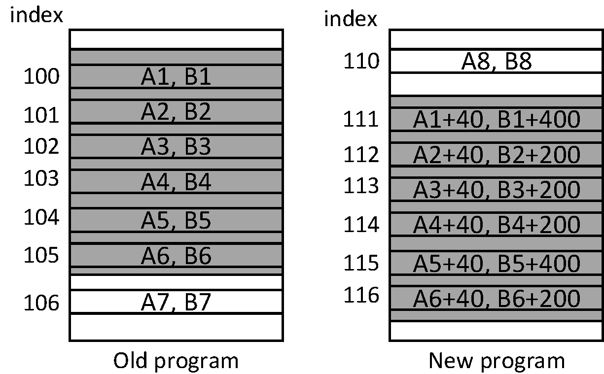
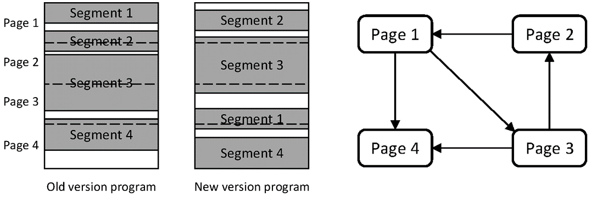

# Remote Firmware Updates for LoRa Devices

Leveraging the long-range communication capability of LoRa, LoRa devices are typically deployed across large outdoor areas.  
In such scenarios, performing firmware updates and maintenance on these devices becomes highly challenging.  
Manually collecting all networked devices and re-flashing them individually incurs substantial labor and time costs.  
Thus, remote firmware update capability is a critical feature in IoT systems. Here, we implement a LoRa-based remote update system, comprising three main phases: update package generation, network transmission of the update package, and application of the update package to perform firmware replacement.

## Update Package Generation

Coming soon...

## Content Update

Coming soon...

## Update Transmission

Coming soon...

## Automatic Update

Coming soon...

<!-- LoRa networks exhibit very low transmission rates, and devices are often battery-powered, imposing stringent energy-efficiency requirements. Consequently, it is essential to minimize the total volume of data transmitted and reduce consumption of network resources—ensuring that the update process does not excessively deplete limited resources. Incremental updates represent the most common approach. By identifying identical segments between the new and old firmware binaries, incremental updates eliminate redundant data transmission. Typically, differential algorithms compute byte-level differences between two binary files and generate an edit script indicating where to copy segments from the old firmware and where to insert new segments. However, beyond simple code additions or deletions, shifts in function and data addresses also introduce significant binary-level divergence. Relying solely on standard differential algorithms thus yields suboptimal compression. Therefore, numerous works aim to eliminate address offsets of functions and data to further reduce update package size.

We have designed and implemented a complete over-the-air (OTA) update system tailored for low-power wide-area networks (LPWANs).

**Differential Algorithm**

A differential algorithm computes differences between two binary sequences and generates a compact representation of those differences—typically an edit script instructing the device how to reconstruct the new firmware from the old. An edit script generally consists of the following instructions:

* `COPY <n> <old address> <new address>` — Copy `n` bytes from address `<old address>` in the old firmware to address `<new address>` in the new firmware.
* `ADD <n> <new address> <data>` — Insert `<data>` (of length `n`) at address `<new address>` in the new firmware.

Additional instructions may be introduced to further compress the edit script, such as:

* `INSERT <new address> <byte>` — Insert a single byte at `<new address>`.
* `PAD <new address> <value> <n>` — Fill `n` consecutive bytes starting at `<new address>` with the constant value `<value>`.

However, `COPY` and `ADD` constitute the most fundamental and widely used instructions. Correspondingly, various differential algorithms exist depending on the instruction set employed.

When only `COPY` and `ADD` instructions are used—and when these instructions appear sequentially—the destination address `<new address>` can be omitted. This is because the current write position in the new firmware can be derived cumulatively from the lengths of all preceding instructions. Thus, `COPY` simplifies to `COPY <n> <old address>`, and `ADD` simplifies to `ADD <n> <data>`.

Given typical firmware sizes ranging from 64 KB to 16 MB, three bytes suffice to encode both `<n>` and the instruction type; likewise, three bytes suffice for `<old address>`. Hence, a `COPY` instruction occupies six bytes, while an `ADD` instruction occupies `n + 3` bytes. Under this encoding, the minimal-length edit script can be computed via dynamic programming as follows:

Let `oldPro` and `newPro` denote the old and new firmware binaries, respectively. Define `cost[i]` as the minimal total instruction length required to construct the first `i` bytes (`newPro[0:i]`) of the new firmware, and `script[i]` as the last instruction used in that optimal construction. Clearly, `cost[i] ≤ cost[i+1]`. For `i = 1`, the optimal choice is a single `ADD` instruction, yielding `cost[1] = 4`.

Assume `cost[j]` and `script[j]` are known for all `j ≤ k`. To compute `cost[k+1]`, consider two cases for `script[k+1]`:

* If `script[k+1]` is an `ADD` instruction:
  - If `script[k]` is also an `ADD`, increment its length field by 1, giving `cost[k+1] = cost[k] + 1`.
  - If `script[k]` is a `COPY`, append a new `ADD` instruction, giving `cost[k+1] = cost[k] + 4`.

* If `script[k+1]` is a `COPY` instruction:
  - Find the longest suffix of `newPro[0:k+1]` matching a substring of `oldPro`, i.e., find integers `r` and `p` such that `oldPro[r:r+p] == newPro[k+1−p:k+1]`. Then `script[k+1]` is `COPY p r`, and `cost[k+1] = cost[k+1−p] + 6`.

Select the case yielding the smaller `cost[k+1]`. Iterating this recurrence yields both the minimal edit script length and the final instruction. Backtracking through `script[·]` then recovers the full edit script.

Pseudocode for the algorithm is as follows:
```
function generateEditScript(old,new){
    cost <- []
    script <- []
    script[0] <- (ADD, 1, 0, new[0:1])
}
``` -->


<!-- **Enhancing Code Similarity**

Across different firmware versions, identical functions and data structures often shift in memory due to insertions or deletions elsewhere in the code—a phenomenon known as **address offset**. Such shifts prevent differential algorithms from aligning semantically identical code regions during byte-by-byte comparison, thereby inflating update package size. Address offset mitigation is therefore crucial for minimizing update overhead.

One effective mitigation strategy separates all references to function or data addresses from the executable code itself, partitioning the original binary into two components: a **relocation table** and **relocatable code**. These components are processed separately. The relocation table records every address reference—including its location within the binary and the referenced address—using the following structure:

```c
typedef struct {
    uint32_t offset; // Offset of this reference within the binary
    uint32_t addr;   // Referenced address
} rel_t;
```

Given bounded firmware size, `offset` can typically be compressed to 2 bytes. Relocatable code is derived by zeroing out all address-reference fields in the original binary. Differential computation applied to relocatable code yields significantly smaller edit scripts than direct binary differencing; the reduction usually exceeds the size of the relocation table itself. The principle is illustrated below:

<center>

</center>

<center>
<div style="color:orange; border-bottom: 1px solid #d9d9d9;
display: inline-block;
color: #999;
padding: 2px;">Figure. Relocation example</div>
</center>

Suppose a code segment appears identically in both old and new firmware, but `m (= 3)` address references within it change between versions. Direct binary differencing yields `m+1 (= 4)` `COPY` instructions (6 bytes each) and `m (= 3)` `ADD` instructions (7 bytes each), totaling `13m + 6 (= 45)` bytes. In contrast, differencing the relocatable code yields only one `COPY` instruction (6 bytes); additionally, the relocation table must store `m (= 3)` updated entries (6 bytes each), totaling `6m + 6 (= 24)` bytes. Thus, relocation reduces update size by `7m (= 21)` bytes.

To further minimize transmission overhead, the device retains the old relocation table locally, and only the *difference* between old and new relocation tables—not the entire new table—is transmitted. Unlike program binaries, relocation table entries contain `offset` and `addr` fields whose values differ meaningfully across versions; simple value-matching differential algorithms are ineffective.

To match relocation entries across versions, we leverage the output of the relocatable-code differencing step: for each matched code segment, we compute the relative offset of each relocation entry and compare symbol names of referenced functions or data. Identical symbols strongly indicate corresponding relocation entries. Using this method, we partition the new relocation table into *matched* and *unmatched* subsets. For matched entries, we compute deltas `d_offset = new.offset − old.offset` and `d_addr = new.addr − old.addr`, record their index `index` in the old table, and group results as triples `(index, d_offset, d_addr)`. Identical `(d_offset, d_addr)` pairs are aggregated into the following hierarchical format:

```
<d_offset> <n_addr>
    <d_addr> <n_index>
        <index, n>...<index, n>
        ...
    <d_addr> <n_index>
        <index, n>...<index, n>
        ...
    ...
<d_offset> <n_addr>
    ...
```

An illustrative example follows:

<center>

</center>

<center>
<div style="color:orange; border-bottom: 1px solid #d9d9d9;
display: inline-block;
color: #999;
padding: 2px;">Figure. Differential example</div>
</center>

Resulting in:
```
    <40> <2>
        <200> <2>
            <101 3> <105 1>
        <400> <2>
            <100 1> <104 1>
```

The final update package comprises this structured relocation delta, the unmatched relocation entries, and the edit script. The device first applies the relocation delta to reconstruct the new relocation table, then uses the edit script together with the updated relocation table to reconstruct the new firmware image.

## Update Transmission

After generating the update package, it must be delivered to all target devices. In wireless sensor networks, multi-hop protocols such as Deluge or Trickle are commonly used. However, LoRa networks typically adopt a star topology—devices communicate directly with gateways—and LoRaWAN prohibits device-to-device communication, rendering multi-hop protocols unsuitable. In single-gateway (broadcast) deployments, rateless coding or other retransmission-based broadcast protocols may be employed. In multi-gateway deployments, inter-gateway signal collisions may occur; the simplest mitigation is to partition end-devices into groups, assigning each group to a distinct gateway operating on non-overlapping channels.

## Device Update

Upon receiving and verifying the update package, the device jumps to the update routine to apply the firmware update. When sufficient flash memory is available, a straightforward approach is to locate a free region, first reconstruct the new relocation table using the relocation delta and the old relocation table, then generate the new relocatable code using the edit script, resolve all function and data addresses using the new relocation table, and finally copy the resulting firmware image into the original program region before jumping to execute it.

However, when flash capacity is severely constrained—insufficient to hold both old and new firmware images plus relocation tables—this approach fails. Instead, in-place updating within the original program region becomes necessary. This introduces a critical challenge: as the update routine writes newly generated firmware segments into flash, they overwrite portions of the old firmware; yet subsequent steps may require copying those overwritten segments elsewhere. Therefore, the order of new-segment generation must be carefully scheduled so that later-generated segments do not depend on already-overwritten old-segment data.

Most flash memories require erasure and writing in page-sized units. Thus, data dependencies among pages can be modeled as a directed graph, as shown below:

<center>

</center>

<center>
<div style="color:orange; border-bottom: 1px solid #d9d9d9;
display: inline-block;
color: #999;
padding: 2px;">Figure. Page dependency example</div>
</center>

If a `COPY` instruction copies data from page `j` to page `i`, then page `i` depends on page `j`. From the edit script, we construct a directed graph $G =(V,E)$, where vertices `V` represent flash pages and a directed edge $(u,v)$ indicates that page `v` depends on page `u`. A page `u` with zero out-degree is not depended upon by any other page; hence, it may be safely updated without risk of overwriting needed data. After updating page `u`, we remove `u` and all incident edges from the graph and recursively search for another zero-out-degree node. If graph `G` is acyclic, such a node always exists, enabling safe in-place update completion.

If `G` contains cycles, circular dependencies exist among pages. To break a cycle, data from one page `u` must be temporarily saved elsewhere. Specifically, we introduce a virtual node `u'`, redirect all outgoing edges from `u` to `u'`, and then update page `u`. Given tight flash constraints, we seek the smallest set of nodes whose removal eliminates all cycles—i.e., a minimum feedback vertex set. Using depth-first search, we identify all cycles $P=\{C_1,C_2,...C_n\}$ in `G`; let $S_i=\{C_{i1},C_{i2},...,C_{ik}\}$ denote the set of cycles containing vertex `i`, and $S_i \subseteq P$. To disrupt all cycles, we must select the smallest collection of sets from $\{S_1,S_2,...,S_m\}$ whose union covers the entire cycle set `P`. This is the classic NP-hard Set Cover problem; computing the optimal solution is computationally infeasible on resource-constrained devices. Practical alternatives include precomputing near-optimal solutions on the server using approximation algorithms and embedding them in the update package, or deploying lightweight greedy algorithms on-device—accepting slightly higher flash usage for reduced computational overhead. Once all pages are updated, the update routine jumps to the new firmware image to complete the process. -->

<!-- [TODO] Reorganize automatic update into a dedicated chapter.

* Autonomous Update System

  1. **Update File Generation**  
     Our update file generation method builds upon R2, enhanced with relocation-table-based mitigation of address-shift effects across firmware versions. By modifying linker parameters (e.g., adding `--emit_relocs` in MDK5), we extract relocation information from the ELF file, yielding a relocation table listing all relocated locations and their resolved addresses. Using this table, we zero-out all relocated addresses in the binary image, then apply a modified RMTD differential algorithm to compute the minimal edit script. This script contains only two instruction types:  
     `ADD <n> <byte 1...byte n>` — Append `n` bytes with content `byte1 ... byte n`;  
     `COPY <n> <addr>` — Copy `n` bytes from address `<addr>` in the old firmware.  
     Destination addresses are omitted because sequential instruction execution allows cumulative address derivation from prior instructions.  
     Differencing the modified binary drastically reduces edit script size. However, the relocation table must still be included in the update file for address resolution. To minimize size, we transmit only the *difference* between old and new relocation tables—not the full new table. Since linkers assign addresses deterministically, many relocation entries exhibit identical `(d_offset, d_addr)` deltas; we exploit this by grouping entries sharing the same deltas. Unmatched entries are appended directly. Finally, we compute and append a CRC checksum for integrity verification.

  2. **Update File Transmission**  
     Server and device communicate update files via a fixed FPort. The server ingests the update file, segments it into packets, and enqueues them for downlink transmission. Upon receiving the first FPort message, the device switches to Class C mode for continuous reception. Packet loss triggers a notification to the server, prompting queue adjustment and retransmission. Upon full reception, the device validates the CRC; if correct, control transfers to the update routine.

  3. **Device Firmware Update**  
     Firmware update proceeds in two phases: relocation table reconstruction and user-program reconstruction.  
     The new relocation table is assembled by applying computed deltas to matched entries from the old table and merging in unmatched entries.  
     The user program is reconstructed instruction-by-instruction: `ADD` inserts data from the update file; `COPY` fetches data from the old firmware; resolved addresses are patched using the new relocation table.  
     With ample flash, the new program is synthesized non-destructively; under tight constraints, in-place update requires careful scheduling to avoid overwriting data needed later. Leveraging flash’s page-erase constraint, we construct a dependency graph from all `COPY` instructions. If acyclic, a safe update sequence exists; if cyclic, one page per cycle is temporarily buffered (in RAM or spare flash) to break the cycle. Our implementation greedily selects the least-referenced page for update; if referenced by others, it is backed up first. After update, corresponding graph edges are removed, and the process repeats. This out-of-order page update eliminates the need to store two full firmware images simultaneously—greatly reducing flash footprint—and minimizes erase/write operations and associated energy consumption. -->