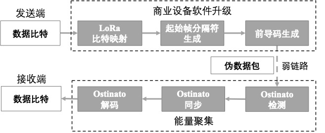
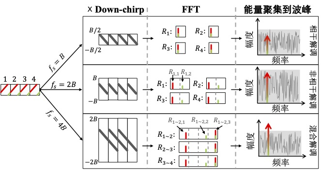
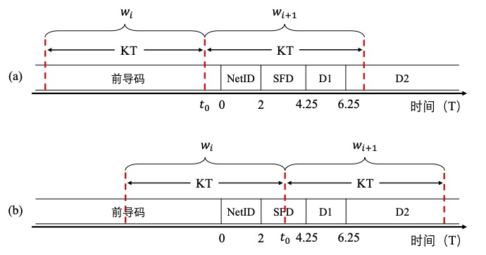

# Weak-Signal Decoding

LPWAN devices can be deployed in diverse environments, such as densely built urban areas, cluttered indoor settings, and highly enclosed underground spaces.  
In these environments, severe obstructions, multipath effects, and interference are common.  
Consequently, the link quality of LPWAN devices may be poor—or even result in disconnection from gateways—leading to unpredictable network coverage holes.  
A straightforward solution is to deploy additional gateways to improve coverage.  
However, due to environmental complexity and variability, adding gateways is costly and technically challenging.  
We introduce a novel method—named Ostinato [?]—that enables weak-link communication and enhances the practical coverage of commercial LoRa networks.  
Unlike prior approaches, Ostinato operates directly on a single LoRa node and a single LoRa gateway, requiring no collaboration from other nodes or gateways.  
The core idea of Ostinato is to transform the original LoRa packet into a pseudo-packet exhibiting a repeated symbol pattern, then aggregate energy across multiple repeated symbols at the receiver to enhance interference resilience. This method operates on commercial LoRa nodes without any hardware modification.  
By adjusting the number of repeated symbols used for energy aggregation, the method adapts to varying degrees of weak-link conditions across different environments.

## Design of the Weak-Signal Decoding Method

To apply this idea to real-world LoRa networks, we address the following key challenges in Ostinato’s design:

### Repeated Symbol Generation  
The first step is to convert the original packet into a pseudo-packet containing repeated symbols.  
The challenge lies in resolving the following issues on commercial LoRa devices:  

(1) How to specify the byte sequence transmitted by a commercial LoRa device so that chirp symbols in the payload exhibit repetition;  

(2) Some symbols are correlated with others and cannot be fully controlled—for example, symbols containing parity bits;  

(3) Certain symbols are uncontrollable—for instance, the start-of-frame delimiter (SFD), whose chirp pattern remains fixed for all packets regardless of input data.  

To address these, we rely on reverse-engineering results of the LoRa physical layer to precisely generate repeated symbols.  
For other symbols—such as parity symbols—we infer their positions and avoid using them when constructing repeated symbols.  
For the uncontrollable SFD symbols, we synthesize virtual SFDs with repetitive properties using symbols from the payload to enable packet synchronization.

### Symbol Energy Aggregation  
At the receiver, packet detection, synchronization, and decoding must function under weak-link conditions. The key challenge is how to effectively aggregate energy across multiple repeated symbols by exploiting LoRa symbol characteristics.  
Ostinato’s intuitive idea is to use multiple down-chirps during de-chirping to convert repeated up-chirp symbols into longer single-frequency signals, thereby concentrating more symbol energy to yield higher peaks in the frequency domain.  
However, we observe non-negligible phase offsets among these repeated chirp symbols, preventing effective energy concentration across multiple chirps.  
Hence, this method introduces a hybrid demodulation technique that adaptively applies coherent and incoherent demodulation per symbol, significantly improving receiver sensitivity with minimal computational overhead.

By solving both the repeated-symbol generation and symbol-energy-aggregation challenges, Ostinato enables weak-link communication using only a single LoRa node and a single LoRa gateway.  
We implemented Ostinato on a software-defined radio (SDR) gateway, providing real-time decoding capability for weak-link packets without relying on collaboration among multiple nodes or gateways.  
Experimental results show that Ostinato improves reception sensitivity by $8.5$ dB over standard LoRa and extends coverage range by a factor of $2.88$ compared to LoRa.

## Pseudo-Packet Generation  

An Ostinato data symbol consists of $K$ chirp symbols.  
To generate a pseudo-packet, a chirp symbol must be repeatedly transmitted $K$ times on a commercial LoRa device.  
We need to control the input data bits based on LoRa physical-layer insights to produce the desired symbol repetition pattern.  
Below, we carefully review the LoRa encoding process to identify the achievable control granularity.

The figure above illustrates the LoRa encoding process for parameters SF7 and CR $=\frac{4}{5}$, showing the progressive transformation of the raw data byte stream into chirp symbols, left to right.  
$x_i = x_i^8x_i^7x_i^6x_i^5x_i^4x_i^3x_i^2x_i^1 (i=1, 2, \cdots)$ denotes the $i$-th input data byte, where $x_i^j$ represents the $j$-th bit of $x_i$ (with $x_i^1$ being the LSB).  
The first encoding step is whitening, which adds randomness by XORing each raw data byte $x_i$ with a predefined whitening byte $W_i$; $y_i = x_i \oplus W_i$ denotes the resulting whitened byte.  
Next, parity bits are appended—in our example, with coding rate $\frac{4}{5}$, only one parity bit is added.  
The third byte in the figure, shown in blue $y_3$, is split into high and low nibbles; the LoRa encoder computes separate parity bits for each, denoted $y_3^1\oplus y_3^2\oplus y_3^3\oplus y_3^4$ and $y_3^5\oplus y_3^6\oplus y_3^7\oplus y_3^8$.  
Each LoRa symbol carries SF bits, and the codeword length after parity addition is $\frac{4}{CR}=5$ bits.  
Thus, LoRa applies diagonal interleaving to the current codeword, as illustrated in the middle portion of the figure.  
This yields a sequence $\{z_1 = y_4^1y_3^5y_3^1y_2^5y_2^1y_1^5y_1^1, z_2, z_3, z_4, z_5\}$ whose elements are each $7$ bits wide, representing the values after parity addition and interleaving.  
Finally, after Gray coding, the output directly determines the starting frequency value $s_i$ of the chirp symbol—for example, $0$ corresponds to the reference up-chirp.  
In our example, five symbols contain $5\times \text{SF} = 35$ bits, corresponding to $35\times \frac{4}{5} = 3.5$ bytes before parity addition.  
It is evident that data bits and parity bits are organized in blocks: $s_1, s_2, s_3, s_4$ corresponds to data bits, while $s_5$ corresponds to parity bits.  
Therefore, $s_1, s_2, s_3, s_4$ can be fully controlled by modifying the input data and is suitable for constructing repeated symbols.  
If $s_1 = s_2 = s_3 = s_4 = s$ is required, reversing the process shown in the figure yields the byte sequence $x_i$ needed to drive the LoRa chip to transmit the pseudo-packet.

Similar to the payload, Ostinato’s preamble and SFD must also contain repeated chirp symbols to enable packet detection and high-precision synchronization under low SNR.  
Since the preamble itself comprises a sequence of repeated reference up-chirps, generating the Ostinato preamble is relatively straightforward.  
We simply extend the preamble length from $N_p$ to $K\cdot N_p$, where $N_p$ is the number of preamble symbols in standard LoRa.  
This extension can be achieved by modifying the preamble-length parameter in the LoRa driver.

LoRa primarily uses reference up-chirp symbols in the preamble and reference down-chirp symbols in the SFD for synchronization.  
Similarly, if Ostinato contains $K\cdot N_p$ reference down-chirps, up-down synchronization becomes feasible.  
In standard LoRa, the SFD contains only $2.25$ reference down-chirps—fewer than the $K$ reference down-chirps required for Ostinato packet synchronization when the repetition factor is $K>2$.  
Yet the SFD portion remains fixed regardless of transmitted data, making it impossible to directly obtain $K\cdot N_p$ reference down-chirps from a valid LoRa packet.  
Because LoRa chips do not support SFD customization, we propose a method to extend the SFD using payload symbols.  
It involves two steps:  
(1) Since all payload symbols are up-chirps, some up-chirps must be converted into down-chirps;  
(2) We must generate $K$ consecutive and identical data symbols.

Step 1 leverages the IQ-inversion capability of commercial LoRa chips.  
LoRa chips support packet-level IQ inversion via register RegInvertIQ (0x33), flipping all up-chirp symbols into down-chirp signals—and vice versa.  
Figure (a) shows a typical LoRa packet in the time–frequency domain; (d) shows its IQ-inverted version.  
Simply inverting the entire packet to create down-chirps is insufficient to meet pseudo-packet generation requirements.  
Fortunately, we find that LoRa supports symbol-level frequency-hopping (FH) functionality.  
The FH interface is provided via an interrupt handler; experimental testing identifies the handler’s invocation points as positions ①, ②, ③, ④, and ⑤ in the figure $\cdots$.  
These positions lie precisely at symbol boundaries; modifying registers RegFrMsb (0x06), RegFrMid (0x07), and RegFrLsb (0x08) inside the interrupt handler affects the carrier frequency used for subsequent chirp symbols.  
Because the FH interrupt granularity reaches the symbol level, we achieve symbol-level frequency hopping within a packet.  
In Ostinato, we use the interrupt handler to modify RegInvertIQ (0x33) to realize symbol-level chirp inversion.  
Figures (b) and (c) respectively show packets transmitted after triggering inversion at positions ① and ②.  
By applying IQ inversion at positions ②, ③, ④, and ⑤ $\cdots$, we construct the required down-chirp symbols starting from the third data symbol of the original LoRa packet.

Step 2 attempts to exploit parity bits to generate more consecutive identical symbols.  
Since parity bits cannot be arbitrarily controlled, modifying data bits alone yields at most four consecutive identical data symbols.  
Careful examination of the encoding process reveals opportunities to set parity symbols equal to data symbols.  
If a data byte matches the whitening byte, their XOR yields an all-zero sequence; feeding this into Hamming coding and interleaving still produces an all-zero sequence (including all-zero parity bits); thus, Gray coding outputs identical symbols.  
For example, if we configure transmission parameters to implicit mode with CRC disabled, and transmit the whitening sequence itself, the payload emitted by a commercial LoRa device will consist entirely of chirp symbols encoding “$1$”.  
Using this method, parity bits can be effectively leveraged to assist construction of $K$ consecutive repeated reference down-chirp symbols—i.e., Ostinato’s SFD.

## Symbol Energy Aggregation  

To correctly detect the preamble and demodulate data symbols, we must aggregate energy across multiple repeated symbols to obtain higher FFT peaks.  
Before introducing hybrid demodulation, we first explain why conventional coherent and incoherent demodulation are unsuitable for energy aggregation across repeated symbols.

**Coherent Demodulation:**  
LoRa demodulates a single symbol via de-chirping: it first multiplies the symbol by a reference down-chirp, then applies FFT to obtain a peak bin indicating the starting frequency.  
The intuitive demodulation approach for an Ostinato packet is to extend the de-chirp operation to $K$ down-chirps.  
As shown in the top part of the figure, an Ostinato symbol of duration $K=4$ sampled at rate $f_s=B$ is multiplied by $4$ consecutive reference down-chirps; FFT is applied to each segment separately to yield the FFT output $R_i(i=1,2,3,4)$ representing the $i$-th symbol; finally, all $R_i$ are summed in the complex domain to obtain the Ostinato symbol’s de-chirp result:  
$$
     R^{c} = \sum_{i=1}^{K}R_i
$$  
We seek the peak location, i.e., $\arg\max_{index} |R^c|$.  
However, we observe that energy cannot be effectively aggregated due to phase discontinuities.  
Chirp segments with differing phase offsets interfere destructively, distorting FFT peaks—potentially driving the peak below the noise floor.

**Incoherent Demodulation:**  
The best way to overcome phase offsets is to estimate and compensate for them prior to coherent demodulation.  
Yet Ostinato typically operates over low-quality links, where accurate phase-offset estimation is difficult under low SNR.  
An alternative is to exhaustively search possible phase offsets from $0$ to $2\pi$, selecting the peak with maximum energy as the result.  
This incurs substantial computational overhead—especially when $K$ is large.  
Thus, a better approach is to sum the magnitudes of FFT outputs from each chirp segment, aggregating symbol energy incoherently.  
Incoherent demodulation means aggregating symbol energy while ignoring phase.  
To perform incoherent demodulation, we first upsample the signal to sampling rate $2B$, separating signals with different phases into distinct peaks in the frequency domain, as shown in the middle part of the figure.  
Then we multiply the upsampled signal by a down-chirp sampled at $2B$.  
Upsampling expands the FFT output’s frequency range to $[0,2B)$.  
Incoherent energy aggregation across all repeated symbols is expressed as:  
$$
     R^{nc} = \sum_{i=1}^{K}(|R_{i,1}|+|R_{i,2}|)
$$  
where $R_{i,1}$($R_{i,2}$) denotes the left (right) half of the FFT result for the $i$-th symbol.  
The distance between the red and green peaks in the figure is fixed at $B$.  
When summing FFT magnitudes, peaks remain undistorted.  
The demodulated output is $\arg\max_{index} |R^{nc}|$.

**Hybrid Demodulation:**  
The drawback of incoherent demodulation is that it aggregates noise energy from different chirp segments as well.  
In coherent demodulation, although noise energy also aggregates, its accumulation is less severe because noise phases are random—unlike incoherent aggregation.  
In other words, incoherent demodulation incurs SNR loss.  
To reduce this loss, we propose a hybrid demodulation method.  
Its core idea is: (1) coherently aggregate chirp segments with zero phase offset to suppress noise summation, and (2) incoherently aggregate segments with unknown and unpredictable phase offsets to minimize computational overhead.  
For example, in the preceding figure, the green portion of the first symbol and the red portion of the second symbol are temporally contiguous, forming a complete reference up-chirp; thus, they share no phase offset and should be coherently superimposed.  
To aggregate all contiguous symbol segments, we employ a down-chirp group wider than the $2B$ bandwidth for de-chirping and extend the demodulation window length to cover two symbols: $2T$.  
Multiplying two consecutive repeated symbols with corresponding portions of the down-chirp group yields three peaks spaced by $B$.  
As shown in the bottom part of the preceding figure, to avoid peak aliasing, we must further upsample the signal to $4B$.  
The hybrid demodulation process is expressed as:  
$$
     R^{hb} = |R_{1\sim 2,1}| + \sum_{i=1}^{K-1}|R_{i\sim i+1,3}| + |R_{K-1\sim K,2}|
$$  
where $R_{i\sim i+1,j}$ denotes the $j$-th portion of the de-chirped result for the $i$-th and $i+1$-th symbols.  
Hybrid demodulation avoids phase-discontinuity effects, effectively concentrates energy from all repeated symbols, and aggregates less noise than pure incoherent demodulation.  
The Ostinato receiver adopts hybrid demodulation.

The demodulation gain of Ostinato over standard LoRa can be roughly estimated using the following symbol SNR expression:  
$$
    \frac{E_S}{N_0} = \frac{S}{N}\cdot \frac{T_S}{T_{Samp}}
$$  
where $\frac{S}{N}$ is the time-domain SNR, $T_S$ is the chirp symbol duration, and $T_{Samp}$ is the sampling interval.  
From this equation, doubling $K$ doubles $T_S$, implying a $10\log_{10}(2) = 3$ dB improvement in $\frac{E_S}{N_0}$.  
This gain represents the theoretical maximum under ideal conditions; in practice, it is typically slightly lower. Experimental results also show that the gain varies slightly across different spreading factors (SF).

## Detection and Synchronization  

The first step for the Ostinato receiver is preamble detection—i.e., detecting the presence of a weak-signal packet.  
Standard LoRa preamble detection uses a de-chirp window of length $T$ and slides it with step size $T$.  
If a LoRa packet contains $N_p$ preamble symbols, at least $N_p - 1$ peaks at the same frequency bin should appear across $N_p$ consecutive de-chirp windows.  
For Ostinato preamble detection, we extend both the window length and step size to $KT$.  
Within each window, hybrid demodulation extracts peaks.  
For a packet with $KN_p$ chirp symbols as preamble, when the window is misaligned with the preamble’s start, exactly $N_p+1$ windows cover the preamble.  
However, due to misalignment, the numbers of up-chirps in the first and last windows are fewer than $K$.  
Thus, observing at least $N_p-1$ consecutive peaks indicates the presence of an Ostinato packet.

Synchronization aims to locate the exact start time of the data symbols.  
Upon completion of detection, the window’s stop position typically does not align with the end of the preamble.  
We leverage the $K$ down-chirps in the Ostinato SFD for synchronization.  
Before applying the up-down alignment shown in the figure above, we must estimate the target range because the possible window offset in Ostinato ($KT$) exceeds that in standard LoRa ($T$).  
We denote the end timestamp of the preamble as the origin $0$.  
As shown in (a), the detection process stops at detection window $w_{i+1}$, because the preamble portion in $w_{i+1}$ is much smaller than that in $KT$ and fails to generate a significant peak under low SNR.  
The start timestamp of detection window $w_{i+1}$ is $t_0$.  
$D1$ represents the first two data symbols that cannot be individually inverted.  
$D2$ denotes the remaining data symbols containing the Ostinato SFD.  
(b) shows another scenario where the preamble portion in $w_{i}$ is sufficiently large to produce a detectable peak under hybrid demodulation.  
The Ostinato receiver detects the peak in $w_{i}$ but fails to detect the corresponding preamble peak in $w_{i+1}$.  
These two cases indicate that if either $w_{i}$ or $w_{i+1}$ contains only a partial preamble, detection stops at $t_0$.  
Hence, we have:  
$$
    t_0 - KT \leq 0 \leq t_0 + KT
$$

The Ostinato SFD starts at $D2$, meaning the target timestamp is $t_{target} = 6.25 T$.  
When detection stops, the demodulation window halts at $t_0$.  
The range of $t_{target}$ relative to $t_0$ can be estimated as:  
$$
    t_0 - KT + 6.25T \leq t_{target}\leq t_0 + KT + 6.25T
$$  
Therefore, given the possible range $[t_0 - KT + 6.25T, t_0 + KT + 6.25T]$, we search $2K+1$ windows with step size $T$.  
The window covering all $K$ down-chirps in the Ostinato SFD yields the highest peak.  
We then apply the Ostinato variant of up-down synchronization to determine the precise $t_{target}$.

## References  
1. Z. Xu, P. Xie, J. Wang and Y. Liu, "Ostinato: Combating LoRa Weak Links in Real Deployments," 2022 IEEE 30th International Conference on Network Protocols (ICNP), Lexington, KY, USA, 2022, pp. 1-11, doi: 10.1109/ICNP55882.2022.9940369.