# 什么是MQTT

## MQTT概述

MQTT（Message Queuing Telemetry Transport，消息队列遥测传输协议），是一种基于发布/订阅（publish/subscribe）模式的轻量级通讯协议。该协议构建于TCP/IP协议上，由IBM在1999年发布。MQTT最大优点在于，可以以极少的代码和有限的带宽，为连接远程设备提供实时可靠的消息服务。作为一种低开销、低带宽占用的即时通讯协议，使其在物联网、小型设备、移动应用等方面有较广泛的应用。

MQTT协议设计主要服从以下原则：

- （1）精简，只保留必要的功能；
- （2）采用发布/订阅（Pub/Sub）模式，允许用户动态创建主题；
- （3）考虑低带宽、高延迟、连接不稳定等因素；
- （4）不对客户端计算能力做额外要求；
- （5）提供服务质量管理；
- （6）不对传输数据的类型与格式做额外要求，保持灵活性。

> Ref: https://blog.csdn.net/aa1215018028/article/details/84888096

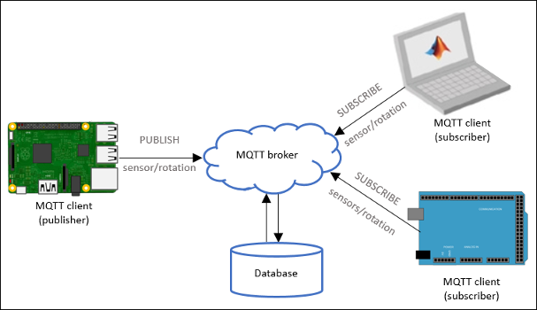
<center>
<div style="color:orange; border-bottom: 1px solid #d9d9d9;
display: inline-block;
color: #999;
padding: 2px;">图. MQTT协议基本架构</div>
</center>

上图展示了MQTT协议的基本架构，可以看到MQTT的基本架构与传统基于客户端/服务器的通信协议类似，也包括作为客户端的MQTT client和作为服务器的MQTT broker两部分。但与传统客户端、服务器之间请求/回答的消息同步模式不同，MQTT采用发布/订阅的模式，从而解耦了消息发布者（Publisher）和消息订阅者（Subscriber）之间的关系。这么做的好处是发布者和订阅者之间不需要建立直接的联系，发布者只需要将消息发布到MQTT broker，由broker负责数据存储和广播，从而降低了连接建立的开销及对通信信道的要求。举一个更直观的例子，你打电话给朋友，一直要等到朋友接电话了才能够开始交流，是一个典型的同步请求/回答的场景；而给一个好友邮件列表发电子邮件就不一样，你发完电子邮件该干嘛干嘛，好友们到有空了去查看邮件就是了，是一个典型的异步发布/订阅的场景。由于以上特性，MQTT协议已成为 IoT 通信的标准之一，在各类物联网应用中被广泛使用。

> Ref: http://dataguild.org/?p=6817

## 几个重要概念

在继续介绍MQTT协议具体工作流程之前，我们来看一下MQTT协议中的几个重要概念：

- 发布者（Publisher）：数据提供者，通常是传感器或其他可以产生数据的设备。
- 订阅者（Subscriber）：数据接收者，通过指定接收主题名，可以从服务器接收特定的数据。注意：消息的发布者和订阅者都是客户端，消息发布者同时也可以是消息订阅者。
- 消息代理/服务器（Broker）：接受来自客户端的网络连接，处理来自客户端的订阅和退订请求；接收发布者发布的应用信息，并向订阅的客户转发这些消息。此外，服务器通常还与数据库连接，实现数据的汇聚和存储。
- 订阅（Subscription）：订阅包含主题筛选器（Topic Filter）和最大服务质量（QoS）。订阅会与一个会话（Session）关联。一个会话可以包含多个订阅。每一个会话中的每个订阅都有一个不同的主题筛选器。
- 会话（Session）：每个客户端与服务器建立连接后就是一个会话，客户端和服务器之间有状态交互。会话存在于一个网络之间，也可能在客户端和服务器之间跨越多个连续的网络连接。
- 主题名（Topic Name）：连接到一个应用程序消息的标签，该标签与服务器的订阅相匹配。服务器会将消息发送给订阅所匹配标签的每个客户端。
- 主题筛选器（Topic Filter）：一个对主题名通配符筛选器，在订阅表达式中使用，表示订阅所匹配到的多个主题。
- 负载（Payload）：消息订阅者所具体接收的内容。 

## MQTT协议数据包结构

在MQTT协议中，一个MQTT数据包由：固定头（Fixed header）、可变头（Variable header）、消息体（payload）三部分构成。MQTT数据包结构如下：

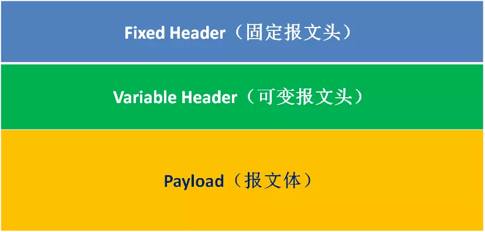
<center>
<div style="color:orange; border-bottom: 1px solid #d9d9d9;
display: inline-block;
color: #999;
padding: 2px;">图. MQTT协议数据包结构</div>
</center>

（1）固定头（Fixed header）。存在于所有MQTT数据包中，表示数据包类型及数据包的分组类标识。

（2）可变头（Variable header）。存在于部分MQTT数据包中，数据包类型决定了可变头是否存在及其具体内容。

（3）消息体（Payload）。存在于部分MQTT数据包中，表示客户端收到的具体内容。

**固定头**

固定头存在于所有MQTT数据包中，其结构如下：
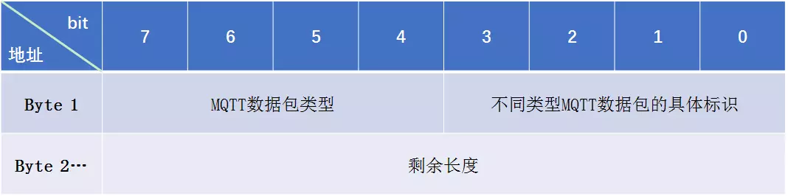
<center>
<div style="color:orange; border-bottom: 1px solid #d9d9d9;
display: inline-block;
color: #999;
padding: 2px;">图. MQTT数据包固定头结构</div>
</center>

固定头中第一字节的7-4位表明数据包类型，MQTT协议规定了包括“连接请求”、“发布确认”、“订阅确认”等15种不同类型的数据包。第一字节剩余的4个比特位为数据包的标识位，分别标识了以下三种信息：

- （1）DUP (1 bit)：发布消息的副本。用来在保证消息的可靠传输，如果设置为1，则在下面的变长中增加MessageId，并且需要回复确认，以保证消息传输完成，但不能用于检测消息重复发送。

- （2）QoS (2 bits)：发布消息的服务质量，即：保证消息传递的次数

    |内容|QoS|含义|
    |-------|-------|-------|
    |00|QoS 0|最多一次，即：<=1|
    |01|QoS 1|至少一次，即：>=1|
    |10|QoS 2|恰好一次，即：=1|
    |11|-|预留|

- （3）RETAIN (1 bit)：发布保留标识，表示服务器要保留这次推送的信息，如果有新的订阅者出现，就把这消息推送给它，如果设有那么推送至当前订阅者后释放。

固定头的第二字节用来保存变长头部和消息体的总大小的，但不是直接保存的。这一字节是可以扩展，其保存机制：前7位用于保存长度，后一部用做标识。当最后一位为1时，表示长度不足，需要使用二个字节继续保存。

**可变头**

MQTT数据包中包含一个可变头，它驻位于固定的头和负载之间。可变头的内容因数据包类型而不同，较常的应用是作为包的标识。

**Payload消息体**

Payload消息体位MQTT数据包的第三部分，包含CONNECT、SUBSCRIBE、SUBACK、UNSUBSCRIBE四种类型的消息：

- （1）CONNECT：消息体内容主要是：客户端的ClientID、订阅的Topic、Message以及用户名和密码。
- （2）SUBSCRIBE：消息体内容是一系列的要订阅的主题以及QoS。
- （3）SUBACK：消息体内容是服务器对于SUBSCRIBE所申请的主题及QoS进行确认和回复。
- （4）UNSUBSCRIBE：消息体内容是要订阅的主题。

> Ref: https://www.jianshu.com/p/de88edf8e023

## MQTT通信流程

MQTT根据支持的服务质量(Quality of Service)不同，客户端与服务器之间的通信流程也不同。MQTT支持三种QoS，分别是0、1、2。级别越高，交互越复杂，越能保证正确性和到达率，但是开销也更大。

QoS 0 是MQTT所有支持的服务质量中最基本、也是最简单的一种，它提供一种尽力而为的服务，即消息发送者确保有数据产生时向服务器发送消息，但是遇到意外导致传输失败时并不会重传。

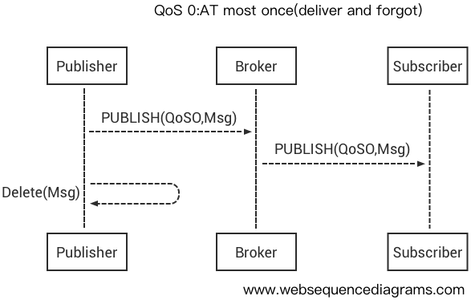
<center>
<div style="color:orange; border-bottom: 1px solid #d9d9d9;
display: inline-block;
color: #999;
padding: 2px;">图. QoS 0下通信流程</div>
</center>

QoS 1 在 Qos 0 的基础上增加了消息确认和重传机制，因此可以保证发布者发布的数据可以被服务器推送至少一次。在这种模式下，如果存在网络延时、确认包丢失等不确定因素，当然可能造成消息的重复推送。

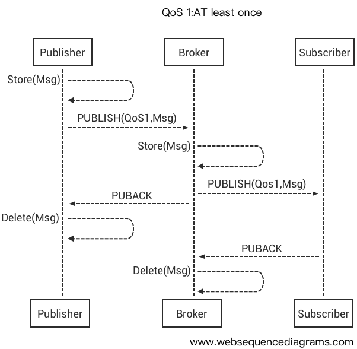
<center>
<div style="color:orange; border-bottom: 1px solid #d9d9d9;
display: inline-block;
color: #999;
padding: 2px;">图. QoS 1下通信流程</div>
</center>

QoS 2 可以保证发布饿着的数据包被所有订阅者恰好接收一次。保证这种语义肯定会减少并发或者增加延时，因此只适合用于不能接受丢包或者重复消息的应用场景。

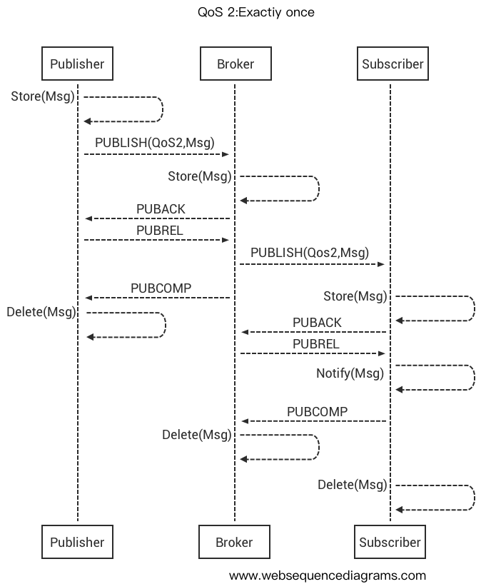
<center>
<div style="color:orange; border-bottom: 1px solid #d9d9d9;
display: inline-block;
color: #999;
padding: 2px;">图. QoS 2下通信流程</div>
</center>

> Ref: https://emqx-enterprise-docs-en.readthedocs.io/en/latest/mqtt.html

# 为什么选择MQTT

MQTT 以其简单、轻量、灵活的特点，受到了 IoT 开发人员的青睐，在实际 IoT 系统中得到了广泛应用。轻量级的 MQTT 协议可在严重受限的设备硬件和高延迟/带宽有限的网络上实现，它的灵活性使得为 IoT 设备和服务的多样化应用场景提供支持成为可能。

为了了解为什么 MQTT 如此适合 IoT 开发场景，我们首先来分析一下为什么其他流行网络协议未在 IoT 中得到成功应用。

## HTTP

在互联网时代，大多数开发人员已经熟悉 HTTP Web 服务。那么为什么不让 IoT 设备连接到 Web 服务？设备可采用 HTTP 请求的形式发送其数据，并采用 HTTP 响应的形式从系统接收更新，但这种请求和响应模式存在一些严重的局限性：

- （1）==HTTP 是一种同步协议，客户端需要等待服务器响应==。在 IoT 领域，设备的能耗、数量以及网络低可靠、高延迟的特点都使得上述同步通信成为问题。异步消息协议更适合 IoT 应用程序。传感器发送读数，让网络确定将其传送到目标设备和服务的最佳路线和时间。
- （2）==HTTP 是单向的，客户端必须发起连接才能获取数据==。在 IoT 应用程序中，设备或传感器通常是客户端，这意味着它们无法被动地接收来自网络的命令。
- （3）==HTTP 是一种 1-1 协议==。客户端发出请求，服务器进行响应。将消息传送到网络上的所有设备上，不但很困难，而且成本很高，而这是 IoT 应用程序中的一种常见使用情况。
- （4）==HTTP 是一种有许多标头和规则的重量级协议==。这意味着除了内容负载外，由协议规定的包头、传输规则等会带来许多额外负载，因此不适合于受限的网络。

出于上述原因，不仅仅在物联网场景中，实际上大部分高性能、可扩展的系统也都使用异步消息总线来进行内部数据交换，而不使用 Web 服务。

> Ref: https://www.ibm.com/developerworks/cn/iot/iot-mqtt-why-good-for-iot/index.html?_blank

## XMPP

可扩展消息与存在协议 (Extensible Messaging and Presence Protocol, XMPP) 是一种以XML为基础的开放式即时通信协议。作为一种对等即时消息 (IM) 协议，XMPP高度依赖于支持 IM 用例的特性，比如存在状态和介质连接。与 MQTT 相比，它在设备和网络上需要的资源都要多得多。

XMPP网络是基于服务器的（即客户端之间彼此不直接交谈），所有通过XMPP通信的用户都需要预先绑定一个服务器。Jabber识别符（JID）是用户登录时所使用的账号，看起来通常像一个电子邮件地址，如someone@example.com：前半部分为用户名，后半部分为XMPP服务器域名，两个字段以@符号区隔。

举个例子，假设朱丽叶（juliet@capulet.com）想和罗密欧（romeo@montague.net）通话，他们两人的账号分别在Capulet.com及Montague.net的服务器上。当朱丽叶输入消息并按下发送钮之后，一连串的事件就发生了：

1. 朱丽叶的XMPP客户端将她的消息发送到Capulet.com XMPP服务器。
2. Capulet.com XMPP服务器打开与Montague.net XMPP服务器的连接。
3. Montague.net XMPP服务器将消息寄送给罗密欧。如果他当前不在在线，那么存储消息以待稍后寄送。


XMPP协议允许通信的双方来自不同的服务器供应商，而他们彼此传讯时，不须拥有对方服务器的账号，也不须成为对方业者的会员。但XMPP协议也存在问题，首要的就是==数据负载太重==，随着通常超过70％的XMPP协议的服务器的数据流量的存在和近60％的被重复转发。其次是==二进制数据传输受限==，XMPP传输单一的XML文件，因此要透过XMPP传输二进制数据，需先将二进制数据以Base64编码。

> Ref: https://en.wikipedia.org/wiki/XMPP

MQTT以其体量轻、灵活性高、消息模式为发布/订阅等特点，解决上述协议应用在 IoT 场景中所遇到的问题。并且 MQTT 对传输内容的格式不做额外要求，因此用户可以根据自己的应用需求设计或更改 MQTT payload的数据格式。

# MQTT服务器搭建

MQTT 服务器，即 MQTT broker，负责接收用户发送的应用数据，向订阅者转发消息，并将汇聚数据将其存储到云端数据库中。

我们使用 mosquitto 搭建MQTT服务器，mosquitto 是由 Eclipse 开发的一款开源 MQTT broker，它可以提供轻量级的消息推送/订阅服务。mosquitto提供了丰富的API，开发者可以很方便地在 mosquitto 代码的基础上进行个性化定制。

## 编译安装

下载[mosquitto源码](https://mosquitto.org/download/)，解压后编译安装。(以下流程在Ubuntu 19.04测试通过)

```shell
tar zxvf mosquitto-1.6.7.tar.gz
cd mosquitto-1.6.7
make
sudo make install
```

**安装过程中可能出现的问题**

(1) 编译找不到openssl/ssl.h

```shell
sudo apt-get install openssl
sudo apt-get install libssl-dev
```

(2) 编译过程找不到ares.h

```shell
sudo apt-get install libc-ares-dev
```

(3) 编译过程找不到uuid/uuid.h

```shell
sudo apt-get install uuid-dev
```

(4) make: g++：命令未找到  

```shell
# 安装g++编译器
sudo apt-get install g++
```

完成安装后，在命令行验证其功能：

打开三个终端，分别作为服务器、订阅者和发布者。

- 一号终端作为服务器，执行`mosquitto`，可以看到输出如下：


<center>
<div style="color:orange; border-bottom: 1px solid #d9d9d9;
display: inline-block;
color: #999;
padding: 2px;">图. 一号终端输出</div>
</center>

默认情况下，mosquitto 服务器监听1883端口。

- 二号终端作为订阅者，执行`mosquitto_sub -t "my_topic"`，表示订阅主题`"my_topic"`，当有发布者发布该主题的内容时，服务器会将内容推送至二号终端并显示（二号终端在刚启动时无输出）：


<center>
<div style="color:orange; border-bottom: 1px solid #d9d9d9;
display: inline-block;
color: #999;
padding: 2px;">图. 二号终端输出</div>
</center>

在二号终端启动后，一号终端（服务器）会相应的输出，提示来自订阅者的连接

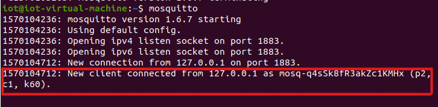
<center>
<div style="color:orange; border-bottom: 1px solid #d9d9d9;
display: inline-block;
color: #999;
padding: 2px;">图. 订阅者连接到服务器后，一号终端的输出</div>
</center>

- 三号终端作为发布者，执行`mosquitto_pub -t "my_topic" -m "Test Message"`，表示发布主题为`"my_topic"`、内容为`"Test Message"`的信息。默认配置下，发布者使用QoS0模式，因此完成数据发送后即结束进程。

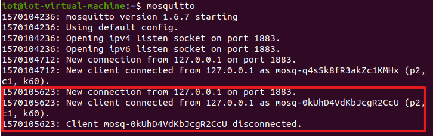
<center>
<div style="color:orange; border-bottom: 1px solid #d9d9d9;
display: inline-block;
color: #999;
padding: 2px;">图. 一号终端输出</div>
</center>

上图为一号终端（服务器）的输出，可以看到发布者“连接-传输-断开连接”的过程。


<center>
<div style="color:orange; border-bottom: 1px solid #d9d9d9;
display: inline-block;
color: #999;
padding: 2px;">图. 二号终端输出</div>
</center>

上图为二号终端输出，可以看到发布者发布的内容已经通过服务器推送至二号终端（订阅者）。

**运行过程中可能出现的问题**

(1) 使用过程中找不到libmosquitto.so.1：`error while loading shared libraries: libmosquitto.so.1: cannot open shared object file: No such file or directory`

解决方法：修改libmosquitto.so位置

```shell
# 创建链接
sudo ln -s /usr/local/lib/libmosquitto.so.1 /usr/lib/libmosquitto.so.1
# 更新动态链接库
sudo ldconfig
```

## 增加用户认证功能

初始状态的 mosquitto 不支持用户认证，即任意设备都可以向服务器订阅或发布消息。出于数据安全性考虑，我们需要在现有 mosquitto 的基础上增加用户认证功能，使只有通过合法认证的用户才可以订阅或发布消息。

我们使用 GitHub 上的一个开源 Mosquitto 认证插件。首先下载[Mosquitto认证插件](https://github.com/jpmens/mosquitto-auth-plug)，解压后配置：

```shell
tar zxvf mosquitto-auth-plug-0.1.3.tar.gz
cd mosquitto-auth-plug-0.1.3/
# 基于初始配置文件进行配置
cp config.mk.in config.mk
```

在config.mk中，除了`BACKEND_MYSQL`这一行是`yes`，其余行都是`no`。`MOSQUITTO_SRC`一行输入`mosquitto`的源码路径，即安装步骤中 mosquitto 的解压路径（例如`MOSQUITTO_SRC = /home/iot//Document/mosquitto-1.6.7`）。在`OPENSSLDIR`一行输入`openssl`的路径，可用`openssl version -a`查看`openssl`路径（例如`OPENSSLDIR = /usr/lib/ssl`）。

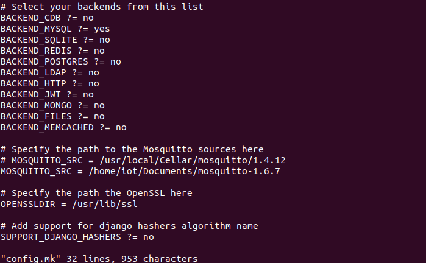
<center>
<div style="color:orange; border-bottom: 1px solid #d9d9d9;
display: inline-block;
color: #999;
padding: 2px;">图. Mosquitto 认证插件配置</div>
</center>

编译 mosquitto-auth-plug，将编译生成的动态库 auth-plug.so 移动到 mosquitto 的安装目录（/etc/mosquitto/）中：

```shell
cd mosquitto-auth-plug-0.1.3/
make
sudo cp auth-plug.so /etc/mosquitto/
```

**安装过程中可能出现的问题**
(1) mysql未安装 `mysql.h: No such file or directory #include <mysql.h>`

```shell
# 安装mysql
sudo apt-get install mysql-server
sudo apt install mysql-client
sudo apt install libmysqlclient-dev
```

(2) 函数参数类型冲突`error: conflicting types for 'mosquitto_auth_psk_key_get'`

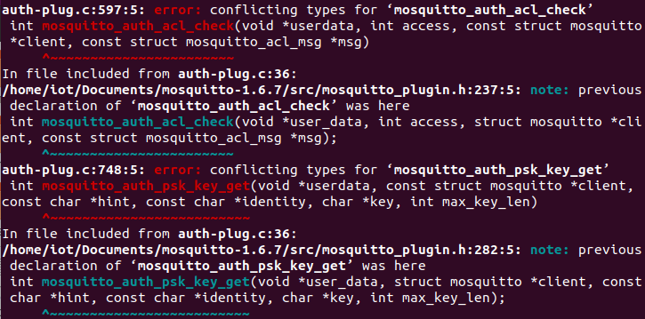

错误原因：函数声明中参数`struct mosquitto *client`前有`const`，但在函数实现中没有`const`，较低版本的g++会在编译时报错。

解决方案：提高g++版本，或直接修改源码，在函数实现中加上`const`。

配置 mosquitto ，使用户认证插件生效。可以在mosquitto插件目录中配置文件的基础上直接修改，然后将配置文件复制到mosquitto的配置目录（/etc/mosquitto/）中：

```shell
cd mosquitto-auth-plug-0.1.3/
sudo cp examples/mosquitto-mysql.conf /etc/mosquitto/mosquitto.conf
```

修改/etc/mosquitto/mosquitto.conf，具体修改配置如下：

```shell
auth_plugin /etc/mosquitto/auth-plug.so          # 认证插件动态库位置
auth_opt_backends mysql                          # 插件支持的服务
#auth_opt_cdbname pwdb.cdb
auth_opt_host localhost                          # 数据库IP
auth_opt_port 3306                               # 数据库端口
auth_opt_dbname mqtt_user                        # 数据库名称
auth_opt_user root                               # 数据库用户名
auth_opt_pass 12345                              # 数据库密码
auth_opt_userquery SELECT pw FROM users WHERE username = '%s'   # 用户认证查询语句
auth_opt_superquery SELECT IFNULL(COUNT(*), 0) FROM users WHERE username = ' %s' AND super = 1                                            # 超级用户查询语句
auth_opt_aclquery SELECT topic FROM acls WHERE username = '%s'    # 话题查询语句
```

所有的用户信息都将以表的形式存储在MySQL数据库中。在mysql中创建名为mqtt_user的数据库，并将[mysql.sql](https://raw.githubusercontent.com/549642238/private_IoT_platform/master/mysql.sql)导入：

```shell
mysql -P 3306 -u root -p mqtt_user<~/mysql.sql
```

导入后可以看到数据库中有以下表：

```shell
mysql> show tables;
+---------------------+
| Tables_in_mqtt_user |
+---------------------+
| acls                |
| recorddata          |
| users               |
+---------------------+
3 rows in set (0.00 sec)
```

在`mysql.sql`中，我们向`users`表插入了一条用户名为`iot`，密码为`12345`的数据：

```shell
mysql> select * from users;
+----+----------+---------------------------------------------------------------------+-------+
| id | username | pw                                                                  | super |
+----+----------+---------------------------------------------------------------------+-------+
|  1 | iot      | PBKDF2$sha256$901$3sa15aTb0ikHlLDy$7lthK1OnUyWL5oFXHMoFNEocp6oqyT+p |     0 |
+----+----------+---------------------------------------------------------------------+-------+
1 row in set (0.00 sec)
```


<!-- MySQL新增用户：

```shell
mysql> CREATE USER 'iot'@'%' IDENTIFIED BY '11789';
Query OK, 0 rows affected (0.00 sec)
```

MySQL创建数据库：

```shell
mysql> create database mqtt_user default charset utf8 collate utf8_general_ci;
Query OK, 1 row affected (0.00 sec)
``` -->

完成配置后，我们再来测试一下 mosquitto 是否具备了用户认证能力。

同样打开三个终端，在一号终端执行`mosquitto -c /etc/mosquitto/mosquitto.conf -v`：

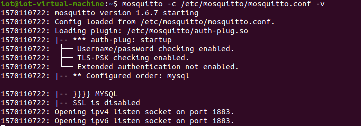
<center>
<div style="color:orange; border-bottom: 1px solid #d9d9d9;
display: inline-block;
color: #999;
padding: 2px;">图. 配置认证后，一号终端输出</div>
</center>

二号终端执行`mosquitto_sub -t "mytopic" -u iot -P 12345`

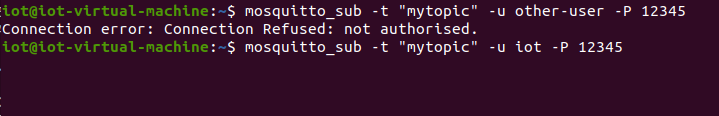

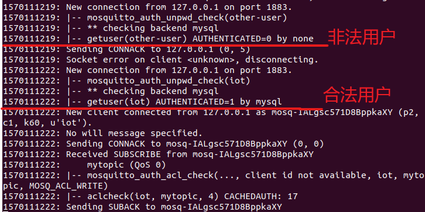
<center>
<div style="color:orange; border-bottom: 1px solid #d9d9d9;
display: inline-block;
color: #999;
padding: 2px;">图. 只有通过认证的合法用户才可以订阅</div>
</center>

如上图所示，只有通过认证的合法用户才可以向服务发起订阅请求。

三号终端执行`mosquitto_pub -m "Test Message" -t "mytopic" -u iot -P 12345`。 同样，也只有当用户名和密码通过服务器认证，三号终端发布的消息才会被服务器接收并广播给订阅者。

到此为止，只要对mqtt_user数据库内的表进行增删改就可以达到用户、话题的管理效果。

## 数据持久化

到目前为止，服务器仅仅扮演了一个转发数据的代理的角色，最主要的数据存储功能还没有实现。因此我们需要为服务器增加数据持久化功能，令服务器将接收到的数据保存到数据库中。

mosquitto 没有提供数据持久化的接口，但我们可以通过修改源码，将收到的数据存入 MySQL 数据库。mosquitto使用C语言，因此在下面的步骤中我们将涉及C语言的数据库操作，有不熟悉的同学可以先学习一下 [MySQL C语言API](https://dev.mysql.com/doc/refman/5.5/en/c-api-function-overview.html)。

在 `mosquitto-1.6.7/src` 目录新建 `diy_data_process.h` 和 `diy_data_process.c` 文件，用于在服务器端进行数据持久化操作。首先是连接数据库：

在 `diy_data_process.h` 导入 `mysql.h` 头文件，并声明连接数据库所需要的参数。

```C
#include "mysql/mysql.h"

// 数据库连接参数
#define DBhost "localhost"              // 数据库IP
#define DBuser "root"                   // 数据库用户名
#define DBpass "12345"                  // 数据库密码
#define DBdb "mqtt_user"                // 数据库名称

// 函数声明
int connectDB();
```

在 `diy_data_process.c` 中实现连接数据库函数，最关键的一步是调用`mysql_real_connect()` 建立数据库操作句柄`mysqlDataStore`与数据库之间的关联。

```C
MYSQL mysqlDataStore;                            // 数据库操作句柄

int connectDB(){
    char c = 1;
    mysql_library_init(0, NULL, NULL);
    mysql_init(&mysqlDataStore);
    mysql_options(&mysqlDataStore, MYSQL_OPT_RECONNECT, (char*)&c);
    if (!mysql_real_connect(&mysqlDataStore,DBhost,DBuser,DBpass,DBdb,0,NULL,0)){
        printf("%s", mysql_error(&mysqlDataStore));
        return -1;
    }else {
        return 0;
    }
}
```

断开数据库连接函数，实现如下：

```C
void disconnectDB(){
    mysql_close(&mysqlDataStore);
    mysql_library_end();
}
```

上述数据库连接/断开函数需要在`mosquitto.c`中被调用，具体代码如下:

```C
extern MYSQL mysqlDataStore;

int main(int argc, char *argv[])
{
    if(connectDB() != 0){					// 连接用户数据存储数据库
        printf("Connect database error.\n");
        exit(0);
    }
    /* Other Codes */
    disconnectDB();					        // 断开用户数据存储数据库
    return rc;
}
```

接下来我们考虑如何解析服务器收到的数据包，提取其内容并存入数据库。mqtt 数据包的内容部分可以使用 JSON 键值对的形式打包数据，这样做的优点是: 确定每个数据归属于哪个属性, 防止数据被错误地归属到其他的属性中, 保证信息的准确性。

JSON (JavaScript Object Notation) 是一种轻量级的数据交换格式，易于人阅读和编写，同时也易于机器解析和生成。但是在C语言中，没有 JSON 对应的内建数据结构，因此我们需要导入 CJSON。 CJSON 是C语言写的一个开源的 JSON 解析库，用起来比较简单、方便。CJSON 的源码可以[从网络直接下载](http://sourceforge.net/projects/cjson/)，在test.c文件中有很多使用的例子，如果不明白使用方法可以看看cJSON.h和cJSON.c，不是太深奥。实际上使用一个双链表来记录JSON数据，然后对这个双链表进行增删改查等操作。下载 CJSON 后，将`CJSON.h`和`CJSON.c`复制到`mosquitto-1.6.7/src` 目录下，并在`diy_data_process.h` 中 include 头文件`CJSON.h`。

接下来实现数据包内容解析和存储功能。在`diy_data_process.c` 中新建函数 `recordData()`:

```C
/** 解析数据包内容，并存入数据库
 * content     数据包内容，以字符数组的形式保存在内存中
 * username    发布者用户名
 * topic       主题
 */
void recordData(const char* content, const char* username, const char* topic){
    // 结构化数据包内容（字符数组 -> JSON 结构体）
    cJSON* pJson = cJSON_Parse(content);
    if(NULL != pJson){
        int itemNumber = 19;
        // 自定义属性数组
        char items[19][15]  = {"time", "temperature", "soil_humidity", "humidity", "pm25", "light", "accelerometer", "gyro", "co2", "voice", "sound", "diy_funcA", "diy_funcB", "led", "relay", "motor", "display", "buzzer", "speaker"};
        char data[200];
        strcpy(data, "{");
        char dataItem[120];
        // 从 JSON 结构体中提取上述各属性的值
        int i=0;
        for(i=0;i<itemNumber;i++){
            extractItem(pJson, dataItem, items[i]);
            // 若该属性值非空，添加至data字符串，稍后存入数据库
            if(strcmp(dataItem, "NULL") !=0 ){
                strcat(strcat(strcat(strcat(strcat(data, "\""),items[i]),"\":\""),dataItem),"\",");
            }
        }
        int len = strlen(data);
        data[len-1] = '}';
        data[len] = '\0';
        // 以字符串形式将数据包内容存入数据库
        char sql[300];
        mysql_ping(&mysqlDataStore);
        strcat(strcat(strcat(strcat(strcpy(sql, "INSERT INTO recorddata(username, data, date) VALUES('"),username),"','"),data),"',NOW())");
        mysql_query(&mysqlDataStore, sql);
    }
    cJSON_Delete(pJson);
}
```

接下来我们在`mosquitto/src/handle_publish.c`中调用上面实现的`recordData()`函数，`handle_publish.c`的作用是处理发布者发送的数据包。在`int handle__publish(struct mosquitto_db *db, struct mosquitto *context)`中添加以下代码

```C
/* After checking for topic access */
recordData((char*)payload.ptr, (char*)context->username, (char*)topic); // 使用自定义数据处理库
```

`payload`是 mosquitto 中定义的存储数据包内容的结构体，有兴趣的同学可以自行查阅源码。注意调用上述函数前，在`mosquitto_broker.h`中引入头文件`diy_data_process.h`。

最后，在`mosquitto/src/Makefile`中添加以下代码，使得我们新增的文件被编译到项目中：

```shell
OBJS =	cJSON.o \
		diy_data_process.o \

cJSON.o : cJSON.c cJSON.h
	${CROSS_COMPILE}${CC} $(BROKER_CFLAGS) -c $< -o $@

diy_data_process.o : diy_data_process.c diy_data_process.h
	${CROSS_COMPILE}${CC} $(BROKER_CFLAGS) -c $< -o $@
```

最后编译我们修改后的代码，并重新安装：

```shell
cd mosquitto-1.6.7/
make clean
make
sudo make install
```

**编译过程中可能出现的问题**
(1) `undefined reference to 'mysql_server_end'` 或 `undefined reference to 'mysql_init'`

这是因为编译器找不到mysql_init,mysql_close等的具体实现。虽然我们包括了正确的头文件，但是我们在编译的时候还是要连接确定的库。对于一些常用的函数的实现，gcc编译器会自动去连接一些常用库，这样我们就没有必要自己去指定了。但某些版本的gcc编译器无法识别 MySQL 的库，因此我们需要手动包含一下：

将`libmysqlclient.a`文件复制到`/mosquitto-1.6.7/lib`目录下，修改`/mosquitto-1.6.7/config.mk`，将原编译指令改成如下内容：

```shell
# Line 151
ifneq ($(or $(findstring $(UNAME),FreeBSD), $(findstring $(UNAME),OpenBSD), $(findstring $(UNAME),NetBSD)),)
	BROKER_LDADD:=$(BROKER_LDADD) -lm
else
	BROKER_LDADD:=$(BROKER_LDADD) -ldl -lm  ../lib/libmysqlclient.a -lz -lpthread ../lib/libmosquitto.so.${SOVERSION}
endif
```

我们使用两个终端分别作为服务器和发布者，测试我们数据持久化代码的功能。一号终端执行

```shell
mosquitto -c /etc/mosquitto/mosquitto.conf -v
```

二号终端执行

```shell
mosquitto_pub -m "{\"nodeID\":10001, \"humidity\":12.5}" -t "mytopic" -u iot -P 12345
```

可以看到`mqtt_user`数据库的`recorddata`表中新增了如下数据：

```shell
mysql> select * from recorddata;
+----------+---------------------+----------------------+
| username | date                | data                 |
+----------+---------------------+----------------------+
| iot      | 2019-10-04 21:57:08 | {"humidity":"12.50"} |
+----------+---------------------+----------------------+
1 row in set (0.00 sec)
```

证明数据插入成功，数据持久化功能正常。

# MQTT安卓开发

## 添加依赖

在项目根目录下的build.gradle中添加：

```java
repositories {
    maven {
        url "https://repo.eclipse.org/content/repositories/paho-releases/"
    }
}
```

然后在app目录下的build.gradle中添加：

```java
dependencies {
    implementation 'org.eclipse.paho:org.eclipse.paho.android.service:1.1.1'
    implementation 'org.eclipse.paho:org.eclipse.paho.client.mqttv3:1.1.1'
}
```

注意：上述依赖编译需要 Android Studio 能够访问 `dl.google.com`，因此需要提前配置计算机能够访问谷歌网站。

## 声明权限

在AndroidManifest.xml中添加：

```xml
<uses-permission android:name="android.permission.WAKE_LOCK" />
<uses-permission android:name="android.permission.WRITE_EXTERNAL_STORAGE" />
<uses-permission android:name="android.permission.ACCESS_NETWORK_STATE" />
<uses-permission android:name="android.permission.READ_PHONE_STATE" />
<uses-permission android:name="android.permission.READ_EXTERNAL_STORAGE" />
<uses-permission android:name="android.permission.INTERNET" />
```

## 开启服务

同样是在AndroidManifest.xml中添加：

```xml
<!-- Mqtt服务 -->
<service android:name="org.eclipse.paho.android.service.MqttService" />
```

## 具体实现

我们可以把MQTTD的配置放入Service中去，所以需要创建一个Service，Android studio中可以快捷创建Service，具体操作是`File→New→Service→Service`。

这样会自动在AndroidManifest.xml声明该服务，如果你是通过创建Java类的方式创建服务的，千万别忘了在AndroidManifest.xml中进行声明。

下面是Service的代码：
