# 物联网开发

当我们在谈论物联网开发时我们在谈论什么？

谈论的前提是明晰物联网系统的架构，我们可以大致将物联网系统拆解为：

- 服务端
- 设备端
- 用户端

服务端提供数据的存储、访问、分析等功能，我们此处所指既包含阿里云物联网平台这样的平台级软件，也包含特定云端应用。

设备端提供应用数据收集、具体操作执行等功能，包括手机、手环、传感器节点等具有计算能力的实际物联网设备。

用户端提供与用户的交互功能，如数据展示、发送指令等，既包括 Web 应用也包括移动端 APP。

服务端和用户端开发与通常的互联网开发类似，因此可以说物联网开发的关键和特别之处便在于设备端的开发。
手机在设备端中算是一个特殊的存在，移动端开发属于另一个长篇故事，读者可以自行探索，我们按下不表。

下面关于物联网的开发将着重于介绍其他大部分设备端的开发。

事实上，下面介绍的几个硬件开发平台中，除了树莓派外，其他均可以认为是嵌入式开发。
制作实际嵌入式产品肯定是还有很多外围电路的，是需要画 PCB 板的，但在原型开发阶段我们可以使用厂商封装好的开发板。

## 1. 设备端开发平台

物联网的硬件是非常丰富的，除了五花八门的传感器，控制器方面也有非常多选择，下面我们列出几个主流的硬件开发平台以供参考。

### 1.1. STM32

STM32  是 ST（STMicroelectronics，意法半导体） 公司设计的基于 ARM Cortex-M 内核的 32 位 MCU（微控制器）系列 ，自带了各种常用通信接口，比如 USART、 I2C、 SPI 等，可接很多的传感器，可以控制很多的设备，使用非常广泛。
现实生活中，我们接触到的很多电器产品都有 STM32 的身影，比如智能手环，微型四轴飞行器，平衡车、移动POS机，智能电饭锅，3D 打印机等等。

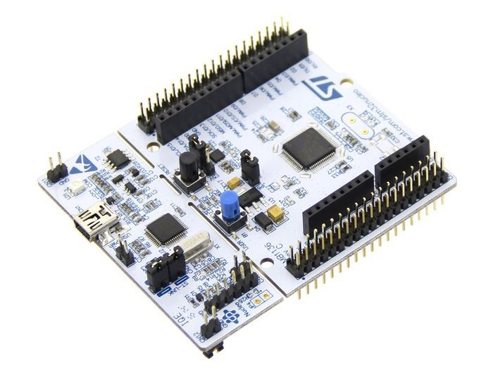

### 1.2. Arduino

不论是 IoT 的初学者还是老手，相信大家都听说过 Arduino。
2005年，意大利北部小镇伊夫雷亚（Ivrea）一家高科技设计学校的老师Massimo Banzi（国内创客把他亲切地称为“板子大叔”），为了能给学生们提供一种便宜、好用的微控制器平台，与当时在这所学校做访问学者的西班牙籍芯片工程师David Cuartielles合作设计了最初的Arduino控制板。
随后Arduino便开始迅速地在欧洲流行起来，并且逐渐将春风吹到了世界各地。

Arduino 作为一款便捷灵活、方便上手的开源电子原型平台，包含硬件部分（各种型号的 Arduino 开发板）和软件部分。

**Arduino硬件部分**：由微控制器（MCU）、闪存（Flash）以及一组通用输入/输出接口（GPIO）等构成。
只是一个最小系统，是用作评估，或者搭建原型用的，如果你把他当作是玩具，也是没问题的。
几乎所有的单片机开发板，你都可以把他当作是“玩具”，因为从硬件构成上讲，和Arduino开发板没有区别。

**Arduino软件部分**：本质是一个C++编程框架，你可以用他开发多种系列/型号的单片机，常见的如AVR/STM32/MSP430/ESP8266。

Arduino的优势在于社区的强大和众多类库资源。
时至今日，Arduino已经成为Github最多的开源硬件项目框架，其资源和影响力已经让Github都加上了Arduino语言分类。
Arduino 在现实中有着非常多的应用，甚至还被用在了卫星上 [ArduSat](https://www.kickstarter.com/projects/575960623/ardusat-your-arduino-experiment-in-space/description) 。

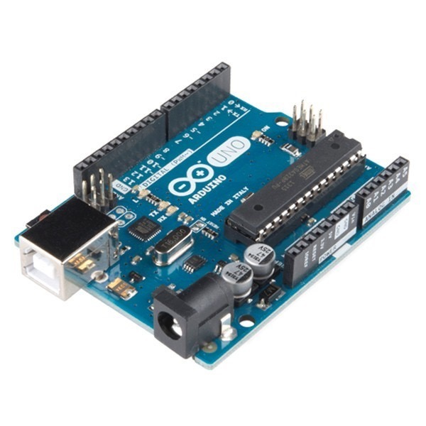

Arduino的特点：1. 开放性：所有的电路图纸和源代码都公开，任何人都可以修改使用；2. 易用性：采用C++面对对象语言，把所有和底层驱动有关的代码都封装成库，用户只需要简单的逻辑判断和数据处理就可以；3. 可扩展性：丰富的扩展板可以和主板层叠，根据具体需求选用。

总得来说，Arduino更适合DIY、想法验证、快速制造产品原型之类的用途。
用于生产则不太合适，因为它的运行效率较低，无调试功能支持，无原生定时器抽象(必须借助库函数实现，如果同时使用多个定时器会变的非常混乱，失去了Arduino开发简洁的优势)，不适于高速、高实时性、高效率、高资源要求的项目和产品。

### 1.3. ESP系列

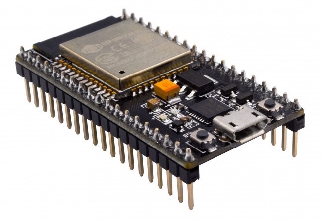

ESP系列芯片是我国乐鑫（Espressif Systems）公司设计和生产的物联网MCU，性能强悍，物美价廉。

乐鑫的ESP8266芯片广泛被用于ESP8266 Wi-Fi模块，它是一款具有完整的TCP/IP堆栈和单片机功能的芯片，内置一个Tensilica L106 32-bit RISC处理器(80MHz)，最大时钟速度为160MHz，同时内置了iBus、dBus和AHB接口。
可以使用高达16MB的外部SPI闪存。
ESP8266EX支持14个无线信道和2.4GHz的接收器和发射器。
在Wi-Fi(72.2Mbps)方面，ESP8266EX实现了TCP/IP和完整的802.11 b/g/n WLAN MAC协议(2个虚拟Wi-Fi接口)。

ESP32芯片集成了Wi-Fi和双模式蓝牙，是ESP8266EX的一个升级版。
根据型号差异，ESP32包含一个或两个低功耗Xtensa®32位LX6微处理器，最大时钟速度240MHz(通常是160 MHz)和Xtensa RAM / ROM，本地内存和JTAG接口。
与ESP8266EX不同，ESP32具有不同大小的嵌入式闪存，支持多个外部QSPI闪存和SRAM芯片(最多16MB)。
ESP32的无线功能和ESP8266EX一样，但是增加了一个平衡和收发两用开关。
与ESP8266EX芯片相比，另一个改进是ESP32嵌入了一个RTC时钟，实现了TCP/IP和完整的802.11 b/g/n Wi-Fi MAC协议(4个虚拟Wi-Fi接口)，数据速率可达150mbps，支持旧蓝牙协议和低功耗蓝牙协议。
ESP32芯片集成了丰富的硬件外设，包括电容式触摸传感器、霍尔传感器、低噪声传感放大器，SD卡接口、以太网接口、高速SDIO／SPI、UART、I2S和I2C等。

ESP系列的芯片通常都自带了Wi-Fi和蓝牙模块，这对于物联网通信而言是个先天的优势。

### 1.4. 树莓派等众多派

树莓派（Raspberry Pi, RPI）由英国树莓派基金会开发，是为学习计算机编程教育而设计的一款“卡片机”。
Raspberry（树莓）源于对微型计算机以水果为基础命名的传统，如苹果机。
Pi（派）代表“Python”，因为 Python 是第一个移植到树莓派上运行的程序。

麻雀虽小五脏俱全，树莓派虽然只有信用卡大小，但音频、视频功能都有，接上显示屏和键鼠完全可以认为是一台小型 PC。
树莓派板子上提供的两行排针还可以用来对底层硬件进行操作，这对于嵌入式设备的开发是很有帮助的。

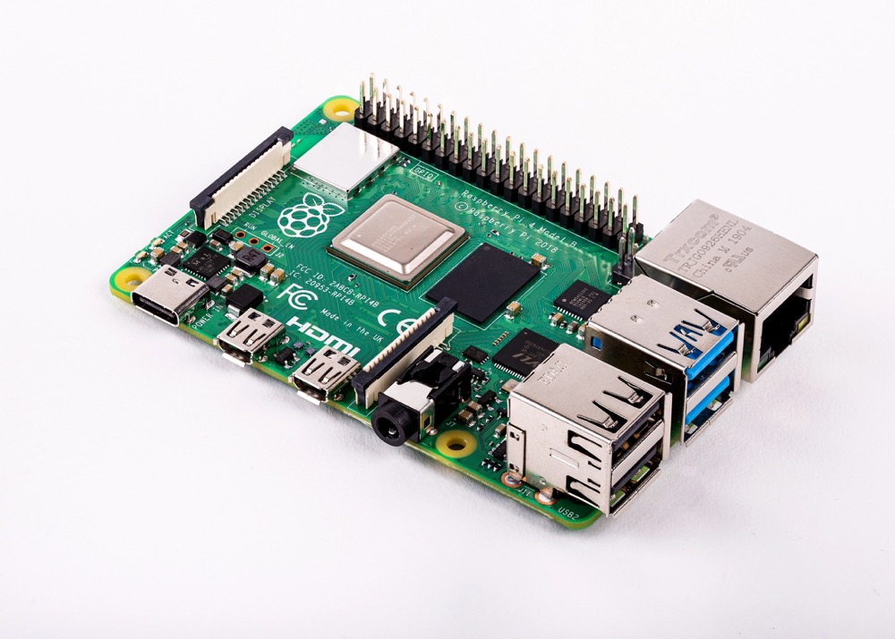

官方操作系统 Raspbian：

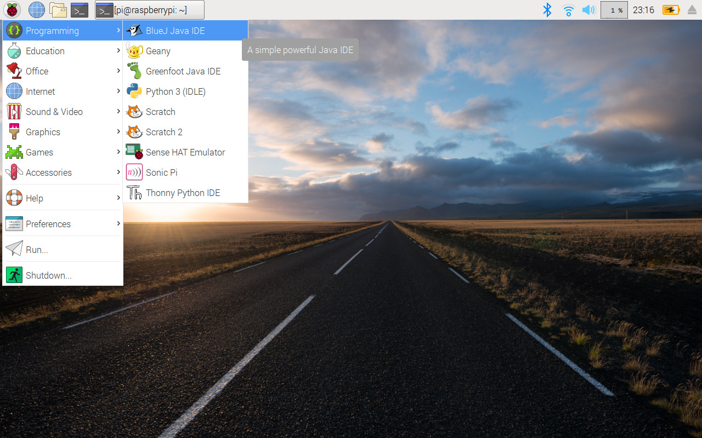

2019 年 6 月底，树莓派 4 发布，处理器升级为 1.5 GHz 的博通 BCM2711，增大了板载内存容量（1/2/4 GB），蓝牙升级为 5.0，拥有 2 个 USB 2.0 接口，2 个 USB 3.0 接口，电源也采用了较新的 USB Type-C 接口，参考价格：400 人民币。

树莓派可以实现很多有意思且实际的应用，如作为家庭影音媒体中心、私人小型服务器，还可以制作一个魔镜。

其他一些类树莓派产品如香橙派、荔枝派、香蕉派等，读者可以自行探索。


## 2. 嵌入式设备端开发环境——PlatformIO

### 2.1. Why PlatformIO

关于开发环境，有的人喜欢用命令行+Vim，有的人喜欢IDE图形界面，也有的人根本不关心开发环境觉得人生苦短只想写Python。

物联网的开发由于嵌入式硬件的不同，各厂商都提供了相应于自家产品的一套开发环境，例如 STM32 的 Keil（只支持 Windows），Arduino 的 Arduino IDE，乐鑫公司的 ESP 工具链。
这些五花八门的工具或 IDE 在用户体验上不尽如人意，且使用一家产品就得新熟悉一个开发环境，极大地增加了学习成本、阻碍了生产力的提高。
针对某一个单片机或开发板开发环境复杂的配置过程，如交叉编译链工具下载、安装和配置，也是嵌入式开发的世界让很多人望而却步的主要原因。
于是 **PlatformIO** （下称 **PIO**）出现了。


PIO 致力于提供一个统一的跨平台的开发环境，营造一个用于物联网开发的开源生态系统。
由于它初始只提供命令行接口，因此可以很容易地集成到各主流 IDE 中。
目前还支持远程单元测试和固件更新。

**PIO 特点**

- 环境易配置或零配置，开发者可以集中精力在应用开发上
- 统一的开发环境与调试器
- 支持 650+ 嵌入式开发板，30+ 开发平台，15+ 框架
- 用户体验上乘

### 2.2. PIO 安装

PIO本身是一个命令行程序，我们可以选用我们认为合适的其他工具来配合PIO进行开发。
在此，我们选用官方推荐的VSCode。

VSCode作为当下十分盛行的文本编辑器，拥有非常丰富且易于安装的插件库。
我们下载安装VSCode后点击左侧边栏的插件图标并搜索`PlatformIO IDE`，点击安装即可。
在安装成功后PIO会启动一个内嵌的主界面，包含新建工程、导入工程、下载库等按键选项。

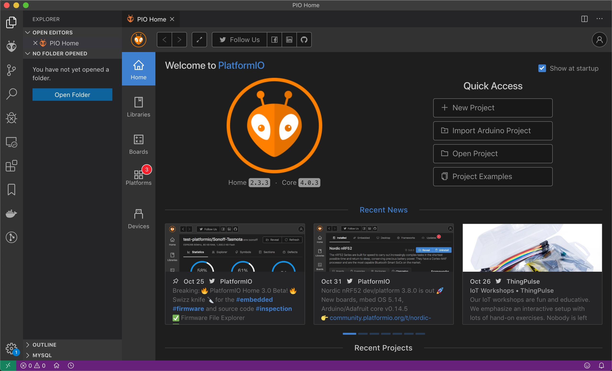

### 2.3. PIO 实践1：Hello World

物联网开发，要有“物”也要有“网”。
上面所介绍的平台都可以用来进行开发，而我们提到 ESP 系列一个天生的优势便是直接集成了 - 和蓝牙，因此我们以 ESP32 开发板为例介绍 [PlO 的使用](https://docs.platformio.org/en/latest/tutorials/espressif32/arduino_debugging_unit_testing.html#tutorial-espressif32-arduino-debugging-unit-testing)。


新建工程，Board选择ESP32-DevKitC，Framework选择Arduino。
在main.cpp中写入如下代码

~~~c++
#include <Arduino.h>
void setup()
{
    Serial.begin(9600);
}
void loop()
{
    Serial.println("Hello world!");
    delay(1000);
}
~~~

由于当前 PIO 的 Arduino platform release 版没有支持最新版 ESP32，可以使用 [staging version](https://docs.platformio.org/en/latest/platforms/espressif32.html#using-arduino-framework-with-staging-version) 来解决 Hello World 无法正常运行的问题。

即修改 `platformio.ini`参数为 `platform = https://github.com/platformio/platform-espressif32.git#feature/stage`


点击左侧PIO图标，在Project Tasks中选择Build来编译该项目。
通过USB数据线连接ESP32开发板，主机应能识别串口，若不能则需要安装相应驱动并修改platformio.ini中的参数monitor_port。
点击Project Tasks中的Upload，下方将显示程序烧录进度。
再点击Project Tasks中的Monitor，我们将看到下方数据窗口输出“Hello World！”。


更多例子可以参考官方提供的 PIO 下 ESP32 开发[样例代码](https://docs.platformio.org/en/latest/platforms/espressif32.html?utm_source=github&utm_medium=arduino-esp32#examples)。

### 2.4. PIO 实践2：蓝牙连接

在 `main.cpp` 中写入如下代码：

```cpp
#include <Arduino.h>
#include <BLEDevice.h>
#include <BLEUtils.h>
#include <BLEServer.h>

#define SERVICE_UUID        "4fafc201-1fb5-459e-8fcc-c5c9c331914b"
#define CHARACTERISTIC_UUID "beb5483e-36e1-4688-b7f5-ea07361b26a8"

class MyCallbacks: public BLECharacteristicCallbacks {
    void onWrite(BLECharacteristic *pCharacteristic) {
      std::string value = pCharacteristic->getValue();
      if (value.length() > 0) {
        Serial.print("\r\nNew value: ");
        for (int i = 0; i < value.length(); i++)
          Serial.print(value[i]);
        Serial.println();
      }
    }
};

void setup() {
    Serial.begin(115200);

    BLEDevice::init("ESP32 BLE example");
    BLEServer *pServer = BLEDevice::createServer();
    BLEService *pService = pServer->createService(SERVICE_UUID);
    BLECharacteristic *pCharacteristic = pService->createCharacteristic(
                                            CHARACTERISTIC_UUID,
                                            BLECharacteristic::PROPERTY_READ |
                                            BLECharacteristic::PROPERTY_WRITE
                                        );

    pCharacteristic->setCallbacks(new MyCallbacks());

    pCharacteristic->setValue("Hello World");
    pService->start();

    BLEAdvertising *pAdvertising = pServer->getAdvertising();
    pAdvertising->start();
}

void loop() {
    delay(2000);
}
```

依次点击 `Build`、 `Upload`、 `Monitor` 来运行和观察串口输出。

我们在手机上安装 `nRF Connect` 这个 APP，打开后扫描可以看到有一个名为“ESP32 BLE Example”的 BLE 外围设备。我们连接蓝牙并任意写入一些值，这些值由蓝牙协议传输并串口输出给主机。

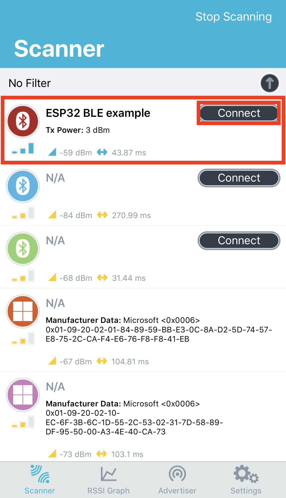

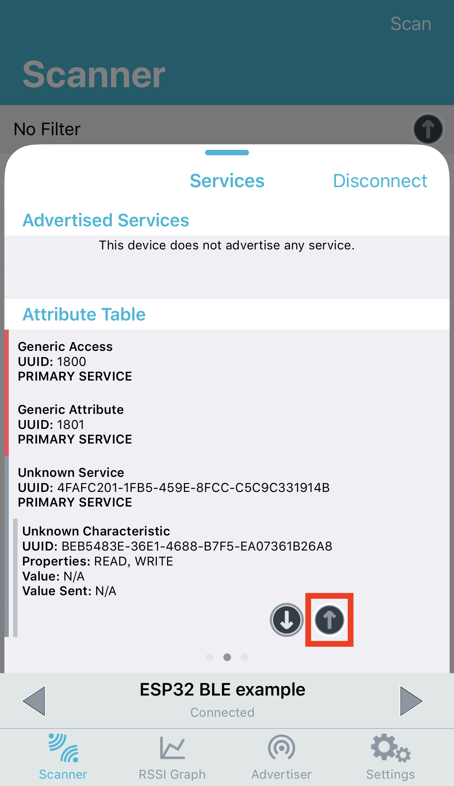

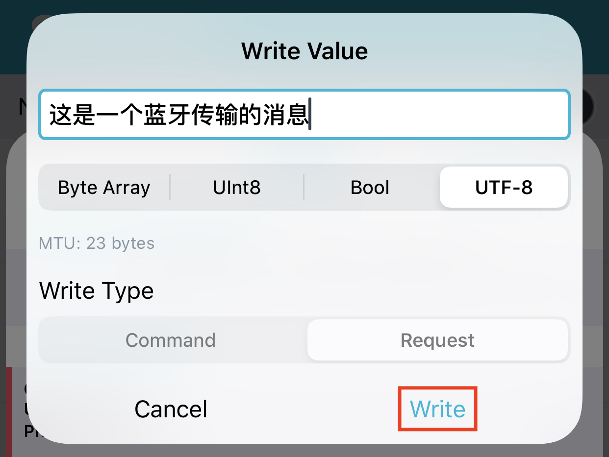

在 PlatformIO 的 Monitor 里可以看到传输的值。

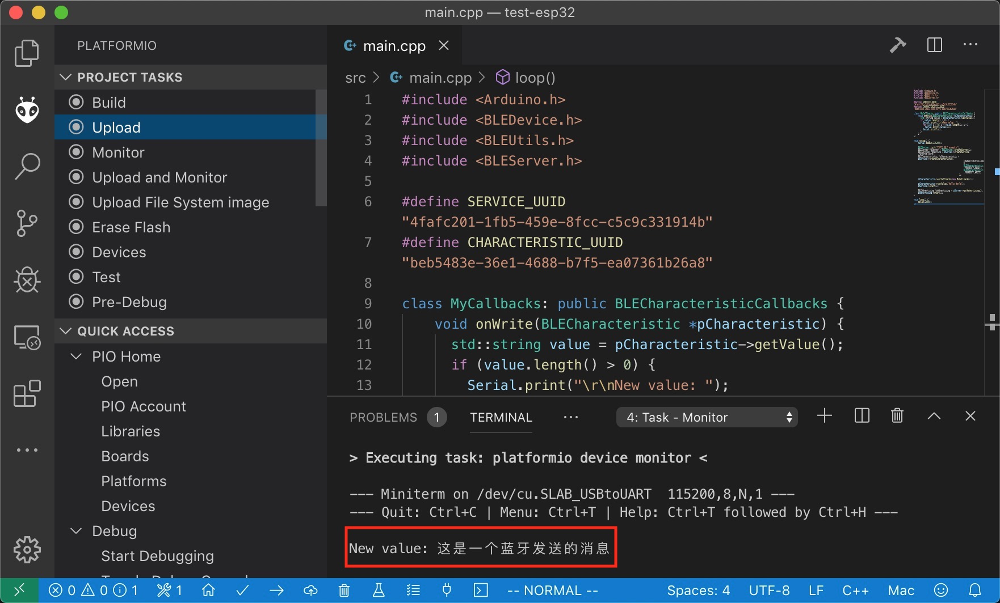

### 2.5. PIO 实践3：Wi-Fi 连接

这个例程将结合 ESP32 自带的触摸传感器来介绍 ESP32 的 Wi-Fi 功能。在 `main.cpp` 中写入如下代码并烧录运行，注意修改 Wi-Fi 的 ssid 和 password，以及 host IP。该代码首先尝试连接 Wi-Fi，在连接成功后每 500 ms 检测一次触摸 GPIO4 上触摸传感器的值，若小于阈值则发送一个 HTTP 请求。

```cpp
#include <WiFi.h>

const char* ssid     = "ssid";
const char* password = "password";

void setup()
{
    Serial.begin(115200);
    delay(10);

    // We start by connecting to a WiFi network
    Serial.println();
    Serial.print("Connecting to ");
    Serial.println(ssid);

    WiFi.begin(ssid, password);

    while (WiFi.status() != WL_CONNECTED) {
        delay(500);
        Serial.print(".");
    }

    Serial.println("");
    Serial.println("WiFi connected");
    Serial.println("IP address: ");
    Serial.println(WiFi.localIP());
}

const int threshold = 30;
const int pin = 4;
const int http_port = 8080;
const char* host = "192.168.10.2";

void loop()
{
    delay(500);
    Serial.println(touchRead(pin));
    if (touchRead(pin) < threshold) {
        Serial.print("connecting to ");
        Serial.println(host);

        // Use WiFiClient class to create TCP connections
        WiFiClient client;
        if (!client.connect(host, http_port)) {
            Serial.println("connection failed");
            return;
        }

        // This will send the request to the server
        client.print(String("GET /") + " HTTP/1.1\r\n" +
                    "Host: " + host + "\r\n" +
                    "Connection: close\r\n\r\n");

        client.stop();
        Serial.println("closing connection");
    }
}
```

我们另外编写如下 Python 脚步 `server.py` 以启动一个简单的 HTTP server。

```python
#!/usr/bin/env python3
from http.server import BaseHTTPRequestHandler, HTTPServer

cnt = 0

class S(BaseHTTPRequestHandler):
    def do_GET(self):
        global cnt
        cnt = cnt + 1
        print("Don't touch me!!!", cnt)

def run(server_class=HTTPServer, handler_class=S, port=8080):
    server_address = ('', port)
    httpd = server_class(server_address, handler_class)
    try:
        httpd.serve_forever()
    except KeyboardInterrupt:
        pass
    httpd.server_close()

if __name__ == '__main__':
    run()
```

运行 `server.py`，将 ESP32 上电。如果我们这时用手指捏住 ESP32的 GPIO4 引脚，我们将看到终端输出“Don't touch me”字样。

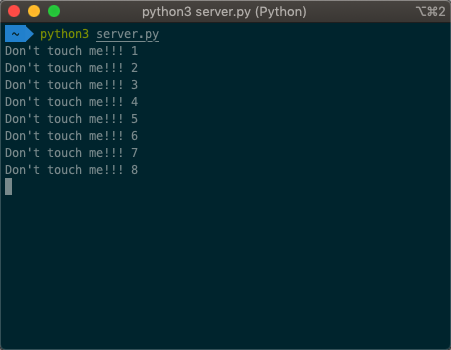
