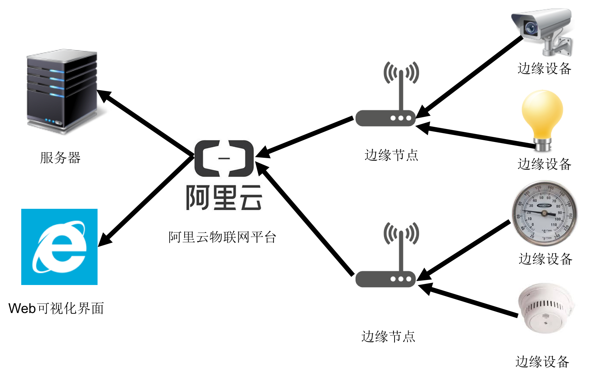

# 阿里云物联网平台介绍

阿里云物联网平台是阿里巴巴公司推出的专业物联网服务平台，其提供的详尽的文档和清晰的管理界面非常适合刚刚接触物联网平台的初学者，对物联网系统架构、管理等有一个整体上的把握。

[阿里云物联网平台文档](https://help.aliyun.com/product/30520.html?spm=a2c4g.11186623.6.540.6c533f69OVkLwL)

[阿里云物联网管理平台可视化界面](https://iot.console.aliyun.com/lk/summary) （需要注册阿里云账户后才能使用）

## 基于阿里云物联网平台的物联网系统架构

基于阿里云物联网平台的物联网系统架构图如上图所示，整个系统可大致分为4层架构：

1. 边缘设备：物联网系统中的数据生产者，通常为传感器，一般认为没有计算能力。

2. 边缘节点：边缘节点对下收集边缘设备产生的数据，对上将数据转发给物联网平台，通常为网关，具有数据转发和路由功能，同时具备一定的计算能力，边缘计算就在边缘节点上发生。

3. 物联网平台：一个集管理、控制、部署等多个功能于一体的平台。

4. 应用层：利用物联网平台提供的服务，可以在网页端的可视化界面查看平台运行情况，并通过平台发送管理指令，也可以利用平台提供的接口实现自己的应用，在服务器上进行数据的后续处理等。

## 物联网平台的搭建

具体的搭建流程参考文档：[平台搭建快速入门](https://help.aliyun.com/document_detail/73705.html?spm=a2c4g.11186623.6.554.e71e3f69rHJbYz)

搭建的大致流程可分为以下几步：

1. 定义产品。“产品”是阿里云物联网平台中的一个专有名词，指的是平台管理的物理实体（这里不用“设备”一词，是因为“设备”也是专有名词）的一个抽象，类似于面向对象编程中“类”的概念，比如“温度计”或者“摄像头”，指的并不是一个具体的温度计或摄像头，而是一种类型。在阿里云物联网平台中，产品分为两类：网关和设备，其中网关对应边缘节点，设备对应边缘设备，搭建物联网平台需要定义至少这两种产品，根据实际需要，类型为“设备”的产品一般会有多种，对应多种不同的边缘设备。
2. 定义设备。“设备”是阿里云物联网平台中的一个专有名词，指的是平台管理的具体物理实体，类似于面向对象编程中“实例”的概念，因此一个产品可以对应一个或许多设备，说明这些设备均属于同一类型。
3. 定义物模型。“物模型”是阿里云物联网平台中的一个专有名词，指的是产品对应的数据模型。为特定产品定义物模型，相当于规定了该产品对应的设备要发送数据的类型、发送数据的格式等。
4. 连接平台与设备。连接分为两种：第一种是将边缘节点接入平台，第二种是将边缘设备连接到边缘节点。在边缘节点接入平台中，需要下载并安装阿里云平台的程序包[[Link Kit SDK](https://code.aliyun.com/linkkit/c-sdk/repository/archive.zip?ref=v3.0.1)]并开启服务。边缘设备连接到边缘节点具体参考文档：[设备接入](https://help.aliyun.com/document_detail/103247.html?spm=a2c4g.11186623.6.568.22b14144Icl0Jb)，里面涉及到“驱动”的概念。
5. 驱动开发。“驱动”是阿里云物联网平台中的一个专有名词，指的是一种实现边缘设备和边缘节点连接的程序。由于边缘设备多种多样，为了将边缘设备接入边缘节点，需要为不同类型的边缘设备开发不同的驱动程序。驱动开发参考文档：[驱动开发](https://help.aliyun.com/document_detail/104444.html?spm=a2c4g.11186623.6.576.3c368f08jee9gK)
6. 部署。

以上步骤完成后，就可以在阿里云提供的可视化管理界面上查看各种信息了。

## 基于物联网平台的应用开发

利用阿里云物联网平台进行应用开发，需要了解该平台提供的各种程序接口，参考文档：[云端API](https://help.aliyun.com/document_detail/69893.html?spm=a2c4g.11186623.6.686.34ee53c7yiogre)

API的具体使用方式可以阿里云的[OpenAPI Explorer](https://api.aliyun.com/?spm=a2c4g.11186623.cwnn_jpze.545.67507eb7gXSFvi#/)，在其中有详细的调用说明和示例。