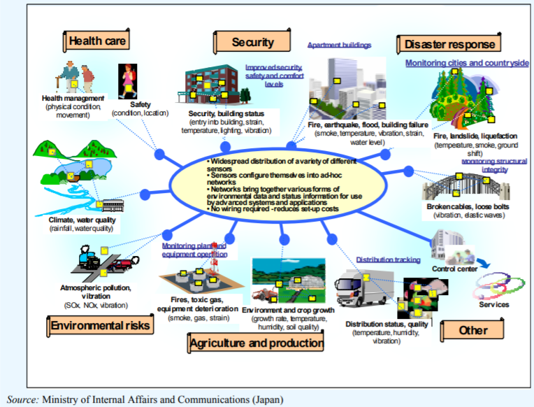
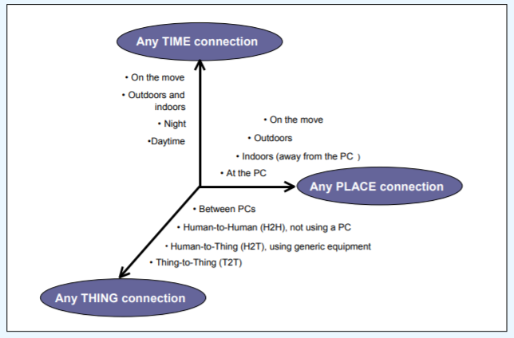
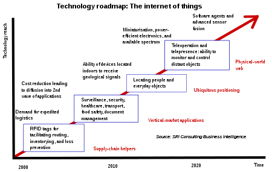
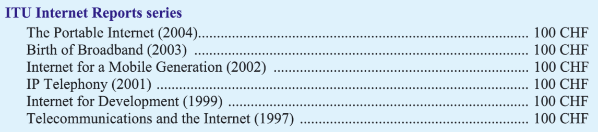

# 物联网发展历史

物联网其实到目前为止也没有一个精确的定义，一般来说，我们认为物联网是传统的互联网向物理世界的一个延伸。通过连接物理世界，使得网络能够更好的为人类服务。维基百科上的定义为
>“The Internet of things (IoT) is the extension of Internet connectivity into physical devices and everyday objects. Embedded with electronics, Internet connectivity, and other forms of hardware (such as sensors), these devices can communicate and interact with others over the Internet, and they can be remotely monitored and controlled.”

简单而言，通过物联网，各种不同的设备都能够互相连接起来，这些设备能够感知物理世界、互相交流和沟通，连接起来提供不同的服务。

物联网能够广泛用在生产和生活的各个方面，产生了如智慧家庭 smart home, 智慧城市 smart city, 智慧农业 smart agriculture, 智慧医疗 smart medical and healthcare, 环境保护 environmental monitoring等一系列相关的应用场景。如果探索物联网的发展历史的话，物联网包含的很多不同的技术其实能够追溯到很久以前。比如最早的感知物理世界的设备是传感器，几乎所有的传感器都能够通过将外界物理世界的信号转化为电信号（通常是电压信号），从而来精确的感知外部世界。比如温度传感器就能够通过将温度信号转为电压信号来感知温度的变化（这里还要说明的是还没有一种能够直接测量温度的传感器，都是通过间接的方法来获取）。比如大家都很关注的气体传感器（pm2.5，甲醛等），都是通过光化学或者电化学的方法将气体的含量转化为电压信号，通过电压信号的高低来表示气体浓度。传感器的出现使得物理世界可以数字化，极大了促进了生产和生活，因此传感器成为了物联网的基础，不过还不是完整的物联网，一开始传感器的出现还并没有网络的概念，仅仅是物理世界的数字化。1991年，XEROX Palo Alto Research Center（施乐研究中心）的Mark Weiser提出了Ubiquitous Computing的概念，系统能够通过无处不在的计算，提高计算的随时随地的可用性(availability)，降低计算的可见性（visibility）来提供服务，通俗的来说，就是在让技术在不知不觉中提供服务。
> “the most profound technologies are those that disappear. They weave themselves into the fabric of everyday life until they are indistinguishable from it.”  --Mark Weiser

而要在不知不觉中提供无所不在的服务，是以信息的互联和对设备的控制为基础的，这些也就描绘出了物联网的基本蓝图。

图. 普适计算与物联网

说到物联网的发展，我们得提一下无线传感网（wireless sensor networks）的发展。当时伯克利大学的一个研究小组要在一个海岛上做一个生态监测的实验，小岛并没有其他的网络支持可以用，通过多个不同的小型的无线传感器网络节点，这些节点上面有传感器能够感知外部世界的环境，同时这些节点能够互相通信，以自组网的方式构成网络并完成通信、数据处理和任务分发等等工作。传感网的出现拓展了传统的传感器的使用范围，将传感器向物理世界进行了延伸。也拓展了传统网络的概念，不再需要专用的网络设施，网络节点自组织通信构成网络。

无线传感器网络的出现，就引起了大家的大量关注，并由此产生了大量的研究工作。无线传感器网络受到了各方面的重视，希望能够将无线传感器网络用在森林监控、城市监控、环境监控等。无线传感网也成为了当时研究的热点，出现了一大批杰出的研究人员。后来无线传感网的直接应用较少，但是无线传感器网络研究过程中出现了一系列技术，比如低功耗技术、自组网技术等，却成为了现在物联网应用的基础。
 在当时，还有一个重要的应用场景就是RFID的应用，当时研究人员对物联网还有另外一个方向的发展愿景，朝着物流网络的方向进行发展，通过RFID的应用提高物流的效率，基于当时的互联网、无线通信、RFID技术和EPC标准等，实现全球物品的实时信息共享网络。

通过上述技术的出现和给人们带来的美好愿景，物联网技术和传感网技术在2003年一度成为了非常有前景的技术，还被评为了未来改变人们生活的十大技术。

在2005年，国际电信联盟（ITU Internet reports 2005）更是以The Internet of Things作为标题报道了物联网，这可能也是物联网第一次在ITU官方正式报告中出现。这个报告的信息量很大，推荐大家都可以去阅读一下。里面的很多信息到现在为止依然受用，不过要注意这个报告是在2005年形成的。这个报告中指出了，最终每一个颗粒和尘埃都可以被标记和联网，这样的技术能够连接每一个设备，能够使得看起来静态不变的物体能够变成动态和具备智能。虚拟世界里面能够映射物理世界，每一个物体都有其地址，使得人和物体之间能够交流，同时物体和物体之间也能够交流。
> In this way, the “virtual world” would “map” the “real world”, given that everything in our physical environment would have its own identity (a passport of sorts) in virtual cyberspace. This will enable communication and interaction between people and things, and between things, on a staggering scale。

这个在2005年的报告已经为物联网提供了基本的定义，也畅想了物联网应用的美好前景。

图. 网络连接的三个维度

物联网为传统网络提供了一个新的维度. Source. ITU Internet report 2005: The Internet of things.

 

图. 走向万物互联

> ITU Internet report：https://www.itu.int/net/wsis/tunis/newsroom/stats/The-Internet-of-Things-2005.pdf

2009年，时任美国总统奥巴马与美国工商界领袖举行了一次圆桌会议，在这次会议上，IBM首次提出了“智慧地球”的概念，将计算机技术应用到各行各业，将感知功能嵌入到工业生产的方方面面。IBM前首席执行官郭士纳曾提出一个重要的观点，认为计算模式每隔15年发生一次变革。这一判断像摩尔定律一样准确，人们把它称为“十五年周期定律”。1965年前后发生的变革以大型机为标志，1980年前后以个人计算机的普及为标志，而1995年前后则发生了互联网革命。每一次这样的技术变革都引起企业间、产业间甚至国家间竞争格局的重大动荡和变化。同样的是在2009年，温家宝总理在无锡视察时提出了“感知中国”，物联网被正式列为国家的五大新兴战略产业之一，并写入了政府工作报告，物联网在中国也从此受到了前所未有的关注。

在ITU报告中，描述了一个对物联网应用进行畅想的例子，在一个技术报告中展现了一个有技术、爱情、浪漫等不同元素的未来应用畅想故事。

> But what does it all mean in a concrete sense for a citizen of the future? Let us imagine for a moment a day in the life of Rosa, a 23-year-old student from Spain, in the year 2020. Rosa has just quarrelled with her boyfriend and needs a little time to herself. She decides to drive secretly to the French Alps in her smart Toyota to spend a weekend at a ski resort. Before her trip, Rosa plans to go shopping. But it seems she must have her car checked – the RFID sensor system in the car has alerted her of possible tyre failure caused by under-inflation. The RFID sensor system is required by road safety legislation adopted many years back. Rosa drives to the nearest Toyota maintenance centre. As she passes through the gates, a diagnostic tool using sensors and radio technology conducts a comprehensive check of her car and asks her to proceed to a specialized maintenance terminal. The terminal is equipped with fully automated robotic arms and Rosa confidently leaves her beloved car behind in order to get some coffee. The “Orange Wall” beverage machine knows all about Rosa’s love of ice coffee and pours it out after Rosa waves her internet watch for a secure payment.

> When she gets back, a brand new pair of rear tyres has already been installed. RFID tags integrated in the new tyres store such information as each tyre’s unique identification, manufacturer, date and place of replacement, and information about the car. In addition, like all tyres, they come equipped with sensors to monitor pressure, temperature and deformation. Any discrepancies will be reported to the intelligent dashboard control system. As a complimentary service, the garage offers to cover Rosa’s Toyota with a special coat of nano glazing for corrosion protection and dirt resistance. The robotic guide then prompts Rosa on the privacy-related options associated with the new tyres. The information stored in her car's control system is intended for maintenance purposes but can be read at different points of the car journey where RFID readers are available. However, since Rosa does not want anyone to know (especially her boyfriend) where she is heading, such information is too sensitive to be left unprotected. She therefore chooses to have the privacy option turned on to prevent unauthorized tracking. Finally, Rosa is able to attend to her shopping. She drives to the nearest mall. She wants to buy a new snowboard jacket with embedded media player. She is particularly concerned about catching a cold (since her exams are coming up) and luckily, the new multimedia jacket also comes equipped with weather-adjusting features. The resort she is heading towards also uses network of wireless sensors to monitor the possibility of avalanches, so she feels both healthy and safe. At the French-Spanish border, there is no need to stop, as Rosa’s car contains information on her driver’s licence and passport, which is automatically transmitted to the minimal border control installations. Suddenly, Rosa gets a video-call on her sunglasses. She pulls over and sees her boyfriend who begs to be forgiven and asks if she wants to spend the weekend together. Her spirits rise and, on impulse, she gives a speech command to the navigation system to disable the privacy protection, so that her boyfriend’s car might find her location and aim directly for it. Even in a world that is full of smart interconnected things, it is human feelings that continue to rule.

推荐大家都能够读一读这个故事，感受一个理工男对物联网的应用畅想。在现在看来，这是一个不那么科幻的科幻故事。如果你够细心的话会发现，这个形成于十多年前的报告中提到的很多技术似乎正在慢慢走向现实。

近些年来，物联网技术结合工业生产出现了工业物联网或者工业互联网的概念，体现了物联网技术的广泛潜力，同时物联网和人工智能AI+IoT的结合也成为了产业的重要发展目标，有不少的公司开始以AI+IoT为主打的方向，也有很多行业通过物联网和工业相结合，提高生产效率。

在这些繁华的背后，我们抛开应用五花八门的畅想，来透过现象看到物联网本质，来理解物联网技术。

物联网中，一般我们认为包含感知层、连接层、网络层、应用层。感知层主要来进行物理世界的感知，通过一些专用的传感器设备，现有的研究前言中也发现了即使不用专用的传感器，也能够实现感知的目的，比如利用物体不同的位置和人的动作对无线信号的影响，通过分析无线信号的变化就能够实现对物体的定位和人的行为的感知。连接层是指如何将大量的物理设备接入网络，这里面可以有传统网络技术比如WiFi等，也需要解决物联网应用场景下新的问题，比如物联网中要支持大量计算能力比较低的设备的连接，需要支持低功耗的连接、远距离的连接和并发的大量连接等。网络层是指如何将物联网中的数据和指令等传输到指定的地方，这里面既包括了传统的互联网应用的基本架构，也出现了物联网领域大量设备连接起来之后新的特征，比如群智感知应用等。应用层是指基于前面三层基础上的物联网应用的实现，在物联网数据的基础之上，构建物联网的应用需要应用到不同维度的信息和结合不同的技术，比如人工智能算法的处理、大数据分析技术。

以我们经常可以看到的一个智慧家庭应用来说，我们来看看物联网是如何工作的。早上起床后家里的窗帘自动感应到用户的起床行为并将窗帘自动打开，同时根据天气预报情况和室外环境情况决定是否要打开窗户，保证用户的舒适。同时窗户和空调经过通信后，确定空调打开的方式温度。与此同时，用户家里的智能电表跟数以万计的其他用户家庭的智能电表一样，将用户的用电数据传输到电网中心进行计费，用户离开家后，同时空调还可以提供远程控制的功能，用户可以通过手机APP来控制空调。
这里面涉及到了很多技术，比如如何准确的判断人的状态，如何保护隐私，如何有效的实现设备互联，如何有效的实现大规模设备的远距离连接，如何实现自组网机制，如何传输、存储收集到的大量数据，如何利用大量的数据以及如何在人工智能的基础上实现智能化的应用需求，希望能够一一的与大家探讨。

纸上得来终觉浅，绝知此事要躬行。

<!-- 

图. 物联网发展路线图

 -->

<!-- # 问题和争论

# 应用
# 隐私和安全 -->