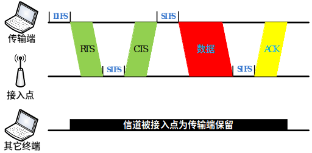

# Wi-Fi无线局域网

如今无线局域网Wi-Fi是人们日常生活中访问因特网的重要手段之一，它可以通过一个或多个体积很小的接入点，为一定区域内的（家庭、校园、餐厅、机场等）众多用户提供因特网访问服务。在IEEE为无线局域网制定IEEE 802.11规范之前，存在许多不同的无线局域网标准，这样的缺点是用户在A区域（例如餐厅）上网需要在电脑上安装一种类型的网卡，当他回到B区域（例如办公室）则需要为电脑更换另一种类型的网卡。除了浪费时间和硬件成本外，在不同协议覆盖重叠区域内，无线信号的干扰降低了网络访问的性能。因此为了规范和统一无线局域网的行为，从上世纪90年代至今IEEE制定了802.11系列协议。

## 1. IEEE 802.11协议简史

如表1所示，不同的IEEE 802.11协议的差异主要体现在使用频段、调制模式、信道差分等物理层技术。IEEE 802.11协议中典型的使用频段有两个，其一是2.4—2.485GHz公共频段，其二是5.1—5.8GHz高频频段。由于2.4—2.485GHz是公共频段，微波炉、无绳电话和无线传感器网络也使用这个频段，因此信号噪声和干扰可能会稍大。5.1—5.8GHz高频段的传输主要受制于视线传输和多径传播效应，一般用于在室内环境中，其覆盖范围要稍小。不同的调制模式决定了不同的传输带宽，在噪声较高或无线连接较弱的环境中可减小每个信号区间内的传输速率来保证无误传输。下面我们来归纳一下802.11协议族不同协议类型物理层的主要特点。

**表1  IEEE 802.11协议对比**

IEEE 802.11协议 | 发布时间 | 频宽（GHz） | 最大带宽 | 调制模式
-------|-------|-------|-------|-------
IEEE 802.11-1997 | 1997.6 | 2.4—2.485 | 2Mbps | DSSS
IEEE 802.11a | 1999.9 |5.1—5.8|54Mbps|OFDM
IEEE 802.11b|1999.9|2.4—2.485|11Mbps|DSSS
IEEE 802.11g|2003.6|2.4—2.485|54Mbps|DSSS或OFDM
IEEE 802.11n|2009.10|2.4—2.485或5.1—5.8|100Mbps|OFDM
IEEE 802.11ac|2014.1|5|866.7Mbps|OFDM

- (1) 1997年6月发布的IEEE 802.11-1997协议采用直接序列扩频（Direct Sequence Spread Spectrum，简称DSSS）技术，使用2.4-2.485 GHz频段，可支持传输带宽为1Mbps和2Mbps。

- (2) 1999年9月同时发布了IEEE 802.11a和IEEE 802.11b协议。IEEE 802.11a协议采用正交频分多路复用（Orthogonal Frequency Division Multiplexing，简称OFDM）技术，使用5.1-5.8 GHz相对较高的频段，带宽可达到54Mbps。由于802.11a使用高频频段，其室内覆盖范围要略小。IEEE 802.11b协议采用高速直接序列扩频（High Rate-DSSS，简称HR-DSSS）技术，使用2.4-2.485GHz频段，带宽可达到11Mbps。从IEEE 802.11a和IEEE 802.11b协议的特点可见，两者是相互不兼容的。

- (3) 2003年6月发布的IEEE 802.11g协议采用了和IEEE 802.11a相同的OFDM技术，保持了其54Mbps的最大传输带宽。同时802.11g使用和802.11b相同的2.4—2.485GHz频段，并且兼容IEEE 802.11b的设备，但兼容802.11b设备会降低802.11g网络的传输带宽。

- (4) 2009年10月发布的IEEE 802.11n协议除了采用OFDM技术，还采用多天线多输入多输出（MIMO）技术，其带宽可达到100Mbps。同时IEEE 802.11n可选择使用2.4-2.485GHz和5.1-5.8GHz两个频段。

- (5) 2014年1月发布的IEEE 802.11ac协议支持多用户的多天线多输入多输出技术，相较IEEE 802.11n，能够提供更宽的射频带宽（提升至160MHz），更高密度的编码（高达256QAM），是IEEE 802.11n潜在的继任者。

尽管在物理层使用的技术有很大差异，这一系列IEEE 802.11协议的上层架构和链路访问协议是相同的。例如MAC层都使用带冲突预防的载波监听多路访问（Carrier Sense Multiple Access/Collision Avoidance，简称CSMA/CA）技术，数据链路层数据帧结构相同以及它们都支持基站和自组织两种组网模式。下面我们将一一介绍这些共性。

看完刚才这一些内容和一大堆的名词，大家是不是感觉有点晕，不要紧，下面的几个章节中大家会自己动手来实现上面的很多方法，通过自己动手来深入了解这一些通信的基础概念。

## 2. IEEE 802.11架构

在IEEE 802.11的架构中，最重要的组成部分是由一个基站（在IEEE 802.11中被称为接入点）和多个无线网络用户组成的基本服务组（Basic Service Set，简称BSS）。如图2所示，每个圆形的区域表示一个基本服务组。每个接入点通过有线网络互联设备（交换机或者路由器）连入上层公共网络中。我们平时耳熟能详的“无线路由器”将接入点和路由器两者的功能结合为一体。在一个家庭中，可能有笔记本电脑，台式机，掌上电脑等多种无线网络设备，而往往网络运营商只为每个家庭提供一条有线宽带连接。这时按照IEEE 802.11的架构，我们将“无线路由器”通过有线连接方式与宽带网络相连，家庭中所有的无线网络设备皆可通过它访问上层网络。

图. 无线局域网WLAN架构

<!-- 图2. 无线局域网WLAN架构 -->

在IEEE 802.11中，每个无线网络用户都需要与一个接入点相关联才能获取上层网络的数据。接入点有哪些参数呢？以IEEE 802.11b/g协议为例，每个接入点的管理者会为其指定一个或多个服务集标识符（Service Set Identifier，简称SSID）。如果使用Windows操作系统，在“控制面板”->“网络连接”->“无线网络连接”图标上点击右键出现选择菜单，然后点击其中的“查看可用无线网络”选项，那么可为用户提供无线连接服务的接入点的SSID都会被列出来。同时接入点管理者还会为其指定一个频段作为通信信道。IEEE 802.11b/g使用2.4-2.485 GHz频段传输数据，对于这85MHz的频宽，802.11b/g将其分为11个部分相互重叠的信道。任何两个不相互重叠的信道中间需要相隔4个或4个以上其它信道。例如信道1、6和11是3条互相不重叠的信道，如果在一间教室内有3个接入点，则IEEE 802.11b/g信道分配模式可以保证这3个接入点之间的信号互不干扰，但如果有多于3个的接入点，例如存在一个使用信道9的接入点，它会对使用信道6和信道11的接入点造成干扰。

对于特定无线网络用户来说，其所在位置可能被多个Wi-Fi接入点覆盖，通常它只能选择其中之一建立连接并交换数据。那么无线网络用户是如何与特定Wi-Fi接入点建立关联呢？首先每个接入点会周期性的向周围广播“识别帧”，其中包含了接入点的MAC地址和SSID。然后无线网络用户通过一段时间内收集的“识别帧”信息确定可提供服务的接入点的集合。最后无线网络用户向其中一个接入点发送关联请求从而建立连接。这里的一个问题是：无线网络用户如何从备选接入点集合中选择最优的接入点作为关联点。这种策略在IEEE 802.11协议中并没有明文规定，它是由IEEE 802.11协议的硬件制造商或者无线网络管理软件开发者决定的。一种常见的做法是将通信链路质量最好的接入点作为关联接入点，但可能存在的问题就是：例如在相邻的两个教室A，B中各有一个接入点，且教室A中无线网络用户数量远多于教室B中的数量。由于无线信号强度衰减特性，教室A中的用户只会与教室A中的接入点关联。但是众多用户与教室A的接入点关联降低了每个用户的带宽，反而可能不如与信号强度稍差但关联用户较少的教室B的接入点关联。

上面建立关联的方式被称为被动扫描。另一种模式是主动扫描模式，其工作原理是：当无线网络用户寻找潜在可提供服务的接入点时，它主动向周围广播一个“探测帧”。收到“探测帧”的接入点进行响应，返回一个“回应帧”。然后无线网络用户再根据所有“回应帧”的信息选取一个接入点关联。

IEEE 802.11协议的另一种架构模式是自组织网络，这种模式下不需要类似基站的基础设施，每个无线网络用户既是数据交互的终端也作为数据传输过程中的路由。由于没有一个类似基站这样集中收发数据的管理者，每条数据传输路径是当数据传输需求出现时动态形成的。这种网络架构可结合基站式架构，用于无线设备相对集中且有限Wi-Fi接入点无法覆盖整个区域的情况。例如：在一个大会议室中，无线网络用户可能达到数百上千人，我们可以在会议室的四角各放置一个接入点，这样部分用户可直接通过接入点访问上层网络，更多的用户通过自组织网络相互连接起来，间接通过其它用户的中继访问网络。

## 3. IEEE 802.11介质访问控制协议

由于每个Wi-Fi接入点可能会关联多个无线网络用户，并且在一定区域内可能存在多个接入点，因此两个或更多用户可能在同一时间使用相同的信道传输数据。此时由于无线连接会相互干扰，更容易导致数据包的丢失，因此需要多用户信道访问协议来控制用户对信道的访问。IEEE 802.11协议中使用带冲突避免的载波监听多路访问（Carrier Sense Multiple Access/Collision Avoidance，简称CSMA/CA）协议。CSMA是指用户在发送数据之前先监听信道，如果信道被占用则不发送数据。CSMA/CA是指即使侦听到信道为空，也为了避免冲突而等待一小段随机时间后再发送数据帧。虽然以太网介质访问控制协议也使用了CSMA技术，但其细节与IEEE 802.11协议的介质访问控制协议还是有所不同。首先由于无线信号干扰问题所造成数据传输出错概率较大，因此IEEE 802.11协议中要求建立数据链路层确认/重传机制。然而以太网中有线连接的传输出错概率较小，其并没有强制要求数据链路层建立确认/重传机制。再者是以太网使用带冲突检测的载波监听多路访问（Carrier Sense Multiple Access/Collision Detected，简称CSMA/CD）协议，其原理是：当用户监听到信道为空时立即发送数据，并且在发送数据的同时监听信道，如果此时它检测到了和其它用户的数据传输信号发生了冲突，则立刻停止传输并随机等待一小段时间后重新传输。802.11协议使用CSMA/CA而不使用CSMA/CD主要有两个原因：

- (1)冲突侦测需要全双工（发送数据的同时也可以接收数据）的信道。而对于无线传输信号来说往往发送信号的能量远高于接收到的信号的能量，建立能侦测冲突的硬件代价是很高的。

- (2)即使无线信道是全双工的，但是由于无线信号衰减特性和隐藏终端问题，硬件还是不能侦听到全部可能的冲突。

在IEEE 802.11协议中，一旦无线网络用户开始传输数据帧，直到整个帧传输完成，传输过程才会停止。在多用户访问环境中，由于无法使用CSMA/CD机制，无计划的传输整个帧带来的冲突会导致整体传输性能的下降。尤其当数据帧的长度相对较长时，冲突的概率会大大增加。为了降低传输冲突的概率，IEEE 802.11协议采用的CSMA/CA机制采取了一系列尽量避免冲突的措施。

IEEE 802.11介质访问控制协议提供了一种可选的机制来消除“隐藏终端”问题。如图7-2所示，有两个无线网络用户A、B和一个基站。用户A、B都在接入点的信号覆盖范围内，但两个用户都位于彼此的信号覆盖范围之外，因此它们是典型的“隐藏终端”关系。当用户A传输数据时，由于用户B无法侦听到A的传输信号，根据CSMA/CA机制，当B侦测到当前信道空闲时，等待DIFS后也开始传输数据。如果此时A仍未结束其传输过程，则会造成在接入点处的信号冲突。

为了消除“隐藏终端”的影响，IEEE 802.11允许某个用户使用“控制帧”RTS（Request to Send）和CTS（Clear to Send）在传输数据帧之前和接入点通信，令接入点只为其保留信道的使用权。如图3所示，当传输端有数据帧要发送时，它先向接入点发送RTS帧，RTS中包含了传输数据帧和确认帧总共可能需要的时间。当接入点收到传输端的RTS帧，它等待SIFS后广播一个CTS帧作为回应。CTS帧的作用有二：其一是为传输端提供了信道的使用权；另外也防止其他用户在传输端发送数据和接收确认帧这段时间内进行传输。

图. RTS和CTS控制帧示意图

<!-- 图 3 RTS和CTS控制帧示意图 -->

使用RTS和CTS帧从以下两个方面提升了无线传输的性能：

- (1) 由于无线网络用户在传输数据之前需要与接入点通信，使其只为当前用户保留信道的使用权，在这段时间内其它任何与接入点相关联的用户不会与接入点进行数据交换，从而消除了“隐藏终端”问题。
- (2) 由于RTS和CTS帧的长度非常短，即使RTS或CTS有冲突发生，其代价也非常小。一旦RTS和CTS成功传达，那么数据帧和确认帧的传输就不再会有冲突发生。

虽然使用RTS和CTS帧可以减少冲突，不难看出也会增加传输延时和降低信道利用率。因此RTS和DTS机制往往被用于冲突发生概率较高的情景中，例如：无线网络用户每次都需要传输较长数据帧，每个数据帧的传输时间较长，增加了冲突发生的概率。
