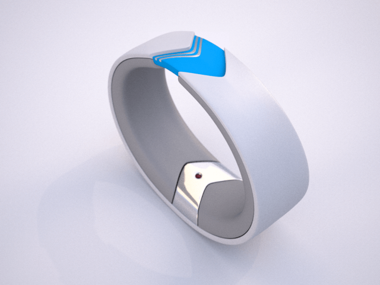

# 蓝牙

## 1. 蓝牙协议起源

蓝牙(Bluetooth)的名字来源于10世纪丹麦国王Harald Blatand－英译为Harold Bluetooth。1994年，瑞典爱立信公司研发一种新型的短距无线通信技术，致力于为个人操作空间（personal operating space, POS）内相互通信的无线通信设备提供通信标准。POS一般是指用户附近10米左右的空间范围，在这个范围内用户可以是固定的，也可以是移动的。在行业协会筹备阶段,需要一个极具有表现力的名字来命名这项高新技术。行业组织人员，在经过一夜关于欧洲历史和未来无线技术发展的讨论后，有些人认为用Blatand国王的名字命名再合适不过了。Blatand国王将现在的挪威，瑞典和丹麦统一起来；就如同这项即将面世的技术，技术将被定义为允许不同工业领域之间的协调工作，例如计算、手机和汽车行业之间的工作，名字于是就这么定下来了。蓝牙标志最初是在商业协会宣布成立的时候由Scandinavian公司设计的。标志保留了名字的传统特色，包含了古北欧字母“H”，看上去非常类似一个星号和一个“B”，在标志上仔细看两者都能看到。

图. 蓝牙Logo

<!-- 图4. 蓝牙Logo -->

蓝牙技术由蓝牙特别兴趣小组(Bluetooth Special Interest Group)的组织来维护的。该组织成立于1998年，成员包括爱立信、IBM、Intel、东芝和诺基亚等国际通信巨头。1998年3月，蓝牙技术成为IEEE 802.15.1标准。蓝牙技术的物理层采用跳频扩频结合的调制技术，频段范围是2.402GHz-2.480GHz，通信速率一般能达到1Mbps左右。在蓝牙通信中，蓝牙设备有两种可能的角色，分别为主设备和从设备。同一个蓝牙设备可以在这两种角色之间转换。一个主蓝牙设备可以最多同时和7个从设备通信。在任意时刻，主设备单元可以向从设备单元中的任何一个发送信息也可以用广播方式实现同时向多个从设备发送信息。蓝牙通信的版本也到了蓝牙5.0，速率已经超过了100Mbps，能够适应现在的不同网络应用的需求。同时针对不同的网络应用场景，蓝牙还提出了低功耗版本BLE，以针对物联网应用中低功耗网络连接的需求。

## 2. 蓝牙协议发展

蓝牙技术的出台立刻引起全世界的关注，曾被美国《网络计算》杂志评为“十年来十大热门新技术”之一，被寄予厚望，作为取代有线连接的手段，“结束线缆噩梦”，让人们真正的“随心而动”。事实上，蓝牙技术的确也广泛的使用在移动设备（手机，PDA）、个人电脑与无线外围设备（如图7-2，蓝牙耳机、蓝牙鼠标、蓝牙键盘等、GPS设备、医疗设备、以及游戏平台（ps3，wii）等各种不同的领域。

蓝牙一开始并未如人们期望的那样成为个域网事实上的标准。随着IEEE 802.11技术的兴起，蓝牙从新世纪初频频遇到尴尬，仅在耳机、鼠标、车载语音系统等小范围市场内取得成功。究其原因，从市场来看，主要有芯片价格高、模块小型化安装成本高、天线设计和组装困难等问题。从技术上来看，蓝牙技术的建立连接时间长、功耗高、安全性不高也为人所诟病。正当蓝牙技术已经快要被人遗忘的时候，移动互联网和物联网的快速发展拯救了蓝牙短距无线通信技术。智能手机正在以前所未有的速度普及，基于安卓(Android)操作系统的智能手机零售价很快能低到600元人民币。这就意味者全世界绝大多数的人马上就会拥有智能手机，基于智能手机的移动应用其市场前景不可限量。蓝牙技术已经是智能手机和平板电脑标准配置的功能。如果说智能手机的外设和应用是未来的发展趋势，在运动、健身、健康和医疗领域存在着极为广阔的应用前景的话，蓝牙技术作为连接手机和外设的标准手段，一定会有爆炸性的市场机会。蓝牙技术联盟首席营销官卓文泰(Suke Jawanda)说，蓝牙技术目前的成员达到16,000家成员和每天具有蓝牙技术产品的出货量达到五百万部，蓝牙技术重获新生。

目前，智能手机外设是一个新的研究热点，运动巨头Nike公司提出的FuelBand腕带，4个MIT学生发明的Amiigo智能腕带等。以Amiigo为例，如图5所示，它可以记录和测量日常生活中的运动量（比如跑步赶上公交车、从超市拎回大包小包等日常生活中随时随地获得的运动量），以此激励和启发人们生活得更有活力。Amiigo测量的时间、卡路里、步数、体温等数据可以通过蓝牙技术传送到智能手机上。你打开iphone或者Android智能手机的Amiigo App应用，便可以了解到自己的身体状况、运动量以及和目标的差距。用户还可以以社区的形式与好友进行分享。

图. Amiigo运动智能腕带

<!-- 图5 Amiigo运动智能腕带 -->

## 3. 蓝牙4.0

蓝牙4.0是Bluetooth SIG于2010年7月7日推出的新的规范，是传统蓝牙的升级版本，包含高速蓝牙、经典蓝牙和低功耗蓝牙三种模式，分别应对数据交换与传输、信息沟通与设备连接、低带宽设备连接为主的不同应用需求。

**表2  传统蓝牙和低功耗蓝牙的技术对比**

技术规范|传统蓝牙|低功耗蓝牙
-------------|------------|-------------
无线电频率|2.4GHz|2.4GHz
理论通信距离|100米|＞100米
空中数据率|1-3Mbps|1Mbps
支持活跃从设备数|7|未定义（理论最大值为232）
延迟|100毫秒|6毫秒
安全性|64/128-bit|128-bit AES
语音能力|有|无
耗电量|1W（参考值）|0.01W-0.5W（依赖使用情况）
峰值电流消耗|＜30mA|＜15mA
主要用途|移动电话，游戏机，耳机，立体声音频流，智能家庭设备，汽车和PC等|手机，游戏机，手表，体育健身，医疗设备，汽车，家用电子，可穿戴设备等

随着蓝牙技术由手机、游戏、耳机、便携电脑和汽车等传统应用领域向物联网、医疗等新领域的扩展，对低功耗的要求会越来越高。从表2中传统蓝牙和蓝牙4.0的技术对比，可以看到低功耗蓝牙（Bluetooth Low Energy，BLE）使得传统蓝牙的功耗大幅降低，极大地适应了物联网发展的需求。
