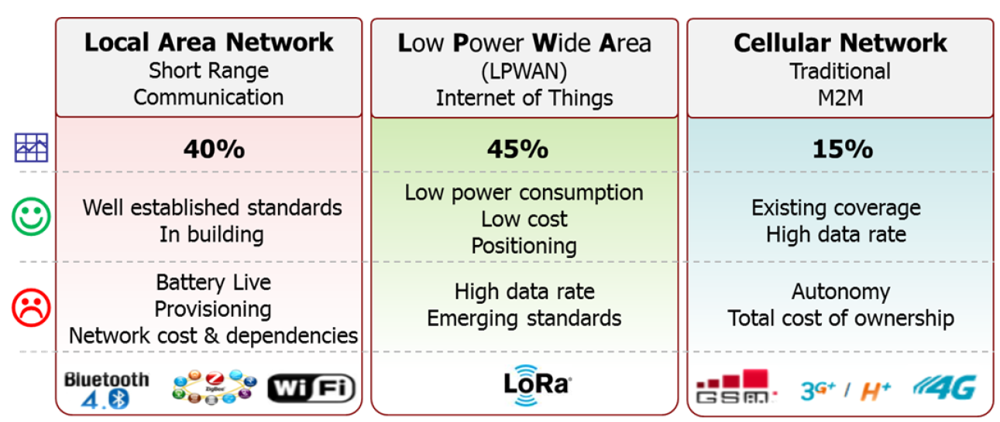
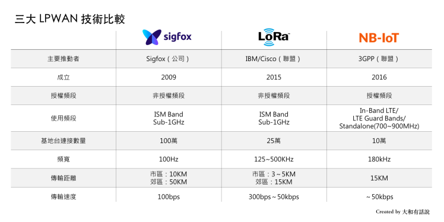
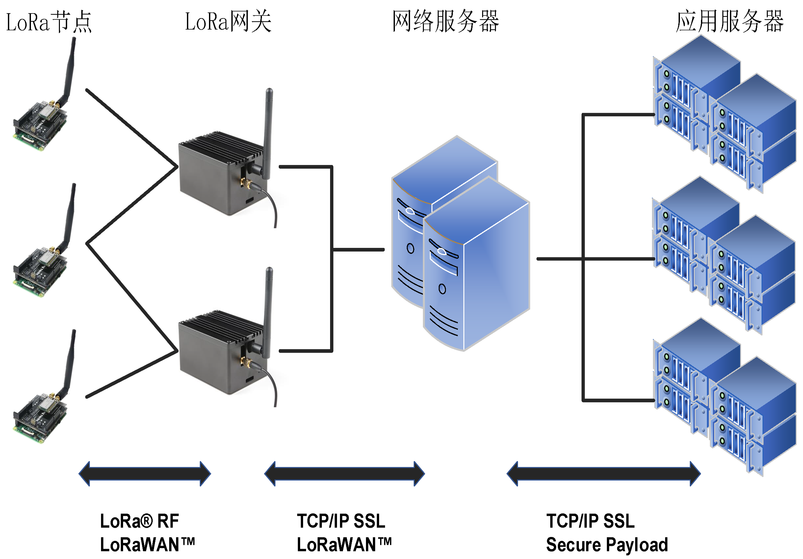
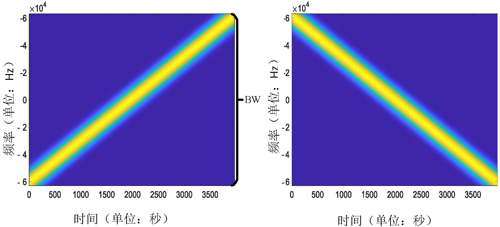
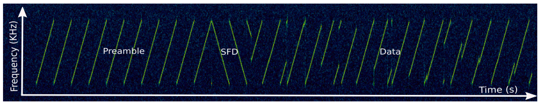
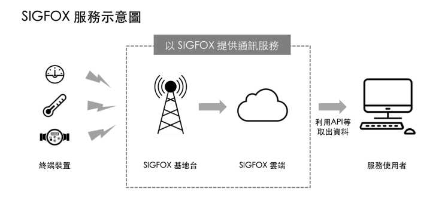

# 低功耗广域网

近年来，随着物联网技术的蓬勃发展，物联网系统被大量应用在资源管理、生产监控、环境监测等多个方面。
在典型的物联网系统中，节点需要具有环境感知和信息共享的能力。
物联网系统通过信息共享实现有用数据的汇聚，进而达到深度分析和智能决策的目标。

鉴于信息共享在物联网系统中的重要地位，目前有大量学者致力于研究如何为物联网系统提供高效的数据传输方式。
在早期的研究中，主要有三种技术为物联网系统提供数据传输服务。

- 一是短距离无线网，代表技术包括蓝牙、ZigBee、Z-Wave 等。
这类技术通常对功耗要求低，但其传输覆盖范围小、传输速率受限，因此应用范围极其有限。
- 二是传统无线局域网，即 IEEE 802.11 协议族所规定的一系列协议。
这类技术虽然覆盖范围较短距离无线网有所提升，通常情况下可以覆盖几十米到数百米。
但对于像智能牧业、环境监测等动辄数十公里范围的室外应用场景来说，传统无线局域网技术变得不再适用。
并且，传统无线局域网技术作为一种高能耗的传输技术，其在物联网场景中的应用范围也非常有限。
- 三是蜂窝网络，包括 GSM、LTE 等技术。
由于蜂窝网络通信距离远且基站等基础设施完备，因此能够很好地解决物联网系统中通信覆盖范围的问题。
但是蜂窝网络对设备接入有着复杂的规定，不同的移动网络运营商有着不同的接入认证要求，这极大限制了物联网设备接入蜂窝网络的能力。
此外蜂窝网络中，接入设备的能量消耗大、复杂性高、接入模块成本高，因此对于通常由电池进行驱动、且需要大量部署的物联网节点，蜂窝网络接入方式显得不再适合。

图. LPWAN与传统无线网络技术比较

针对上述已有技术在具体物联网应用中存在的不足，学者们提出了一类针对大规模物联网应用场景的连接技术，称为低功耗广域网(Low Power Wide Area Networks， LPWAN)。
LPWAN兼具短距离无线网络低功耗和蜂窝网络超大覆盖范围的优点，覆盖范围广、通信能耗低且吞吐量小。
因此对于分布在大范围区域内的低功耗物联网设备来说，LPWAN是最佳的连接选择。
在 LPWAN 网络中，这些物联网设备可以随意部署或移动，因此 LPWAN 可以满足智能城市中的诸多应用，如智能化计量，家庭自动化，可穿戴电子，物流，环境监测等。这些应用需要交换数据量少，交换的频率也不高。
LPWA 应用场景包括但不限于智能交通、工厂、农业、采矿等领域。
由于 LPWAN 具有传统的蜂窝网络和传统无线技术所不具备的特点（相比于蜂窝网络来说功耗更低，相比于传统无线网覆盖更广），因此对 LPWAN 的研究在满足特定物联网应用方面具有非常重要的意义。
自提出以来，LPWAN在工业、农业、交通运输业得到广泛应用，截至目前，有超过四分之一的物联网设备通过 LPWAN 技术接入网。

现有的LPWAN技术，按工作频段不同，主要可以分为授权频段（License Band）和非授权频段（Unlicense Band）两类 [1]。

- 采用授权频段技术的为3GPP（3rd Generation Partnership Project）主导的NB-IoT（Narrow Band IoT），其采用现有的3G/4G网路，主要投入为电信营运商及相关设备厂商。
- 至于非授权频段，就呈现了遍地开花的状况，大部分不属于电信领域的ICT厂商，都会选择投入这边，主要的代表技术正是SIGFOX与LoRa。
它们都采用了ISM频段（Industrial Scientific Medical Band），这是一种各国开放给工业、科学及医学机构使用的频段。
它们无须许可证及费用，只需要遵守一定的发射功率（一般低于1W），不要对其他频段造成干扰即可。

以下分别简述LPWAN三大技术：LoRa、SIGFOX、NB-IoT。

图. 三类LPWAN技术比较

## 1. LoRa技术简介

“LoRa是什么？”

要想准确地回答这一问题，绝非一件易事。
因为LoRa这个词所指代的并非一件单一的事物，恰恰相反，它包含了至少三层概念：

- 狭义上的LoRa指的是一种物理层的信号调制方式：它基于线性扩频技术（Chirp Spreading Spectrum，CSS），将射频信号调制为具有不同起始频率的chirp符号，以此编码不同的数据。
- 从系统角度看，LoRa也指由终端节点、网关、网络服务器、应用服务器所组成的一种网络系统架构：LoRa定义了不同设备在系统中的分工与作用，规定了数据在系统中流动与汇聚的方式。
- 从应用角度看，LoRa为物联网应用提供了一种低成本、低功耗、远距离的数据传输服务：LoRa在使用10mW射频输出功率的情况下，可以提供超过25km视线传输距离，从而支持大量广域低功耗物联网应用。

为了帮助读者建立对LoRa完整的认识，本节剩余部分将从LoRa应用、LoRa系统架构、LoRa物理层调制技术三个方面，自顶向下地对LoRa进行介绍。

### 1.1. LoRa应用

LoRa作为目前广泛使用的低功耗广域网技术(LPWAN)，为低功耗物联网设备提供了可靠的连接方案。
如下图所示，相比于Wi-Fi、蓝牙、ZigBee等传统无线局域网，LoRa可以实现更远距离的通信，有效扩展了网络的覆盖范围；
而相比于移动蜂窝网络，LoRa具有更低的硬件部署成本和更长的节点使用寿命，单个LoRa节点可以在电池供电的情况下连续工作数年。
LoRa具有低数据率、远距离和低功耗的性质，因此非常适合与室外的传感器及其他物联网设备进行通信或数据交互。

图. LPWAN与其他无线通信技术对比

考虑到LoRa在覆盖距离、部署成本等方面的巨大优势，近年来LoRa在全球范围内进行了大量的应用部署，在水质监测、火灾预警、智慧路灯等众多物联网场景中都可以看到LoRa的身影。例如在北美的Apana项目中，工程人员将LoRa通信模块与传统的水质传感器进行连接，从而使用户可以数十公里外远程监控饮用水在输送过程中的水质变化情况。而在荷兰的KPN项目中，工程人员通过广泛部署LoRa网关，实现在荷兰全域范围内的LoRa网络全覆盖，为智慧运输、智能农业、智慧路灯等具体应用提供了通信支持。

### 1.2. LoRa架构

LoRa也指一种由节点、网关及服务器所组成的网络系统架构，各部分的关系如下图所示。
LoRa节点与网关之间采用单跳直接连接，这一阶段的物理层使用线性扩频调制，MAC层通常使用LoRaWAN协议。
网关收到数据包后，对数据包信号进行解码，并将解码结果通过蜂窝或有线网络传输给网络服务器，这一阶段使用传统的TCP/IP进行传输，同时网络服务器与网关之间的交互仍然遵守LoRaWAN协议。
网络服务器汇总多个网关的数据，过滤重复的数据包，执行安全检查，并根据内容将数据发送至不同的应用服务器，供用户读取和使用，这一阶段也使用TCP/IP和SSL进行传输和加密。

图. LoRa网络架构

可以看到LoRa网络的系统架构主要由LoRaWAN定义，因此本节剩余部分将详细介绍LoRaWAN协议的内容。

**LoRaWAN**

LoRaWAN是由LoRa联盟在LoRa物理层编码技术的基础上提出的MAC层协议，由LoRa联盟负责维护。LoRaWAN规范1.0版本于2015年6月发布。LoRaWAN协议主要规定了节点与网关、网关与服务器之间的连接规范，确定了LoRa网络的星型拓扑结构。受LoRa节点成本和能耗的限制，现有的LoRaWAN协议基本采用纯ALOHA机制，即节点在发送数据前不进行载波侦听，而是随机选择时间进行发送。一方面，LoRaWAN协议的简单性有助于降低节点能耗，延长节点的使用寿命；但另一方面，过于简单的介质访问控制机制也加剧了LoRa网络的信号冲突问题。

LoRaWAN定义了网络的通信协议和系统架构，还负责管理所有设备的通信频率，数据速率和功率。
在LoRaWAN的控制下，网络中的所有设备可以是异步的，并在只有可用数据时进行传输。
针对不同的应用场景，LoRaWAN定义了三种节点运行模式，分别是Class A（ALL）、Class B（Beacon）、Class C（Continuously Listening）：

- Class A模式主要提供低功耗上行连接，处于Class A模式的节点可以在任意时间发起上行传输，并只在传输结束时打开两个下行接收窗口，此时接收来自网关ACK。Class A模式下，网关无法主动连接到节点，当无数据传输时，节点处于休眠状态，因此该模式下节点能耗最低。
- Class B模式提供节点与网关的周期性连接，该模式下网关节点周期性向节点广播信标帧，保持节点与网关的时间同步。
- Class C模式提供节点与网关的持续性连接，该模式下节点始终处于唤醒状态，因此能耗最高。
  三种网络模式中，Class A是所有LoRa网络都必须支持的模式，也是最常用的网络模式。

图. LoRaWAN Class A,B,C

### 1.3. LoRa物理层
LoRa物理层使用线性扩频技术，即通过信号调频，将信号调制为频率随时间线性变化的chirp符号。
根据频率随时间变化的趋势不同，chirp符号可以分为up-chirp和down-chirp，如下图所示。
up-chirp从最低频率开始，随时间增加逐渐上升至最高频率。而down-chirp则与之相反，从最高频率逐渐下降至最低频率。
LoRa定义最高频率和最低频率之间的差值为LoRa带宽，记作$BW$。
chirp符号天然具有抗噪声、抗多径和抗多普勒效应等特点，因此LoRa信号可以支持远距离传输，在超低信噪比情况下也能被正常解码。

图. LoRa Chirp符号时频图，左为up-chirp，右为down-chirp

LoRa通过对基准up-chirp做循环频移来编码不同的数据。
上图中，基准up-chirp的最低频率为$-\frac{BW}{2}$，最高频率为$\frac{BW}{2}$，信号长度为$T$。
因此其频率可以表示为$f(t)=kt-\frac{BW}{2}$，其中$k=\frac{BW}{T}$表示扫频梯度。
由此，基准up-chirp可以表示为：

$$
C(t)=e^{j2\pi(-\frac{BW}{2}+\frac{k}{2}t)t}
$$

当需要编码数据时，LoRa首先令基准up-chirp乘上一个固定频率的偏移分量，偏移后的信号可以表示为$C(t)e^{j2\pi ft}$。
随后，LoRa将所有频率高于$\frac{BW}{2}$的信号段循环频移至$-\frac{BW}{2}$频率处，频移后的信号如下图(e)所示。
LoRa定义了N种不同的偏移频率，因此通过对一个基准up-chirp进行循环频移，最多可以编码$SF=log_2N$比特数据。

LoRa数据解码由频率解扩频和傅里叶变换两个步骤组成。
对于一个收到的数据包，LoRa首先令数据包中每个编码的up-chirp与基准down-chirp相乘。
与up-chirp类似，基准down-chirp可以表示为：

$$
C^*(t)=e^{j2\pi(\frac{BW}{2}-\frac{k}{2}t)t}
$$

显然$C^*(t)$是$C(t)$的共轭，因此编码up-chirp与基准down-chirp相乘的结果是一个单频信号，其频率等于编码up-chirp的频率偏移量：
$$
C^*(t)\times C(t)e^{j2\pi ft}=e^{j2\pi ft}
$$
随后，LoRa对得到的单频信号进行傅里叶变换，将时域信号转化为频域波峰，波峰的下标即对应信号编码的数据，LoRa解码流程如下图所示。

图. LoRa物理层解码示意图，左为基准up-chirp，右为编码后的up-chirp：第一行为信号时间-频率图，第二行为down-chirp前的时域信号，第三行为乘down-chirp后的时域信号，第四行为傅里叶变换结果

LoRa数据包的结构如下图所示，一个典型的LoRa数据包包括4个部分：$S_{pre}$个前导码(Preamble)，2个强制同步字(Mandatory Sync Word， MSW)，2.25个起始帧分界符(Start Frame Delimiter， SFD)和若干编码up-chirp(Data Payload)。
前导码由连续的基准up-chirp组成，主要用于数据包的检测和同步；
强制同步字编码了数据包的网络号信息，接收端根据该信息判断是否接收当前数据包；
起始帧分界符标志着数据段的开始，在分界符之后，就是连续的编码up-chirp。

图. LoRa数据包结构

## 2. SIGFOX技术简介

SIGFOX是由2009年创立的法国公司SIGFOX所开发，该厂商从2012年开始推展IoT无线服务业务。

与其他LPWAN技术相较，SIGFOX是传输速率最低的技术，速度仅100bits/s，且每个装置一天最多只能发送140个数据包，每个数据包最大的容量为12bytes。 由于降低了资讯传输量，因此就能大幅节省了物联网装置的能量消耗。 因此，SIGFOX非常适用于水表、电表、路灯控制这类流量回报频率每小时低于一次的应用。

以SIGFOX的智慧水表应用为例，基本上水表装置仅上传数据，不接收信息。因此在没有数据需要传送的时候，水表装置就处于休眠状态，因此一颗三号电池就能够使用十年。

SIGFOX最大的特色在于建立一个全球共同的IoT网路，再透过各地特许的网路营运商SNO（SIGFOX Network Operator）提供服务，原则上单一地区由单一业者负责（例如，台湾特许营运商为UnaBiz）。

从下图可知，SIGFOX所提供的服务并非仅有网络连线，客户也可以选择SIGFOX云端服务。
这么一来，企业便无须担心网路与资料储存空间等基础设施的建构，可以更专注于IoT服务的开发。

图. SIGFOX网络架构

随着LPWAN竞争越来越激烈，SIGFOX现阶段最重要的目标莫过于基站的建设。目前全球已有32国推动SIGFOX网络的部署，如法国、英国、西班牙、德国、荷兰、美国等。

SIGFOX技术虽然不像LoRa有许多ICT大厂投入、也不如NB-IoT获得市场广泛注意，但由于SIGFOX上游技术**IP免费授权的策略**，吸引了许多厂商加入SIGFOX生态系，包含上游的晶片、模组制造、系统整合、专业代工设计与生产、平台服务等等。目前SIGFOX已有71个设备制造伙伴、49个IoT平台供应商、8家晶片供应商、15个模组厂商、30家软体与设计服务业者，以及4个育成/创投业者。 其中晶片供应商包括德州仪器(TI)、意法半导体(ST)、芯科(Silicon Labs)、安森美(On-Semi)、恩智浦(NXP)、Ethertronics、Microchip与云创通讯(M2Comm) []。

## 3. NB-IoT技术简介

虽然与SIGFOX、LoRa等其他LPWAN技术相比，NB-IoT技术发展起步较晚。
不过，由于它是由国际电信标准制定组织3GPP所支持，针对IoT所打造的电信级网路，对于网路传输品质、数据安全都有更高的保障，再加上建置成本较低，电信商不用大幅更改现行的4G LTE电信网路架构，就能快速部署，因而备受各国电信商所支持。

在应用领域方面，由于NB-IoT采用电信级的网路，服务品质有保障，因此更适合高价货物的追踪，或是与消费者有直接关联的应用。
例如，家中老人或者病人的健康照护就很适合采用NB-IoT，但工业控制、智慧制造、智慧农业等应用就不太适合。

NB-IoT技术在全球获得三大电信设备商诺基亚（Nokia）、爱立信（Ericsson）、华为支持，并在亚洲、欧洲、美洲等区域已开通实验网，到2018年全球有超过30家营运商投入营运，通过运营商服务摸索市场可接受的商业模式。

## 4. 小结

LPWAN的特性在于低功耗、长距离、低传输量、低成本。 然而，LPWAN也并非万能，无法取代所有无线的传输应用，例如有高速传输需求或实时性的应用就需要仰赖其他传输技术。

而以LPWAN现有的三大技术LoRa、SIGFOX、NB-IoT的竞争态势来看，这三大技术不论在功耗、传输距离、应用场域上各有擅长，因此很难说谁会被谁取代。
在未来几年中，这三项技术更可能会依不同的应用场域来做交叉应用。
例如，虽然NB-IoT备受看好，有不需重新部署基站的特性，产业链也与现有的电信网路产业一致，但NB-IoT的每一个节点都需要安装SIM卡收费，以智慧家庭应用为例，若每一台电视、冰箱、洗衣机等电器用品都要单独计费，也会增加商业成本。
因此要充分利用物联网中不同的协议，例如可以在区域内先采取LoRa、SIGFOX这类非授权频段的通讯协议，待数据汇聚到一个点后，再一起以NB-IoT、LTM将数据传输出去。

## 5. 参考文献

- Martin C. Bor, Utz Roedig, Thiemo Voigt, and Juan M. Alonso. Do lora low-power wide-area networks scale? In Proceedings of ACM MSWiM, 2016.
- Silvia Demetri, Marco Zúñiga, Gian Pietro Picco, Fernando Kuipers, Lorenzo Bruzzone, and Thomas Telkamp. Automated estimation of link quality for lora: a remote sensing approach. In Proceedings of ACM IPSN, 2019.
- Jansen Christian Liando, Amalinda Gamage, Agustinus W. Tengourtius, and Mo Li. Known and unknown facts of lora: Experiences from a large-scale measurement study. ACM Transactions on Sensor Networks (TOSN), 2019.
- LoRa Alliance. What is lorawan:a technical overview of lora and lorawan. White Paper, 2018.
- U. Raza, P. Kulkarni and M. Sooriyabandara, Low Power Wide Area Networks: An Overview, in IEEE Communications Surveys & Tutorials, vol. 19, no. 2, pp. 855-873, Secondquarter 2017.
- 萬物聯網，淺談IoT低功耗廣域網路趨勢：LoRa、SIGFOX、NB-IoT, https://dahetalk.com
