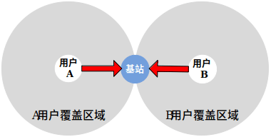

# 物联网连接技术

从上世纪90年代起，随着网络技术的普及与发展，互联网渐渐成为人类生活和工作中最主要也是最重要的信息交互平台，例如百度、Google搜索引擎，淘宝、eBay网上购物，优酷、YouTube在线视频分享等重要网络应用已经与人们的日常生活密不可分。移动手机的接入也逐步已经超越了传统的PC接入数量。对于物联网的到来，物联网的设备接入将会进一步极大的增大连接的数量。因此，如何将大量的物联网设备连接入网将是物联网中要解决的第一个重要问题。如何解决物联网中“最后一公里”难题，如何将物联网设备稳定、高速地接入物联网中首要解决的问题。

物联网的接入既可以使用已有的接入技术，包括已有的有线和无线（WiFi）的接入技术，同时物联网应用也有新的特点，也产生了很多新的无线连接方式。下面我们就先来介绍常见的物联网设备的连接方式，这些也是大家在进行物联网设计和物联网设备接入的时候可以首先考虑的连接技术。同时，我们也投过现象看到本质，了解这一系列接入技术背后的基本原理。
这一部分中，我们主要介绍物联网无线接入技术。无线网络消除了有线网络对接入设备的位置限制，同时也节省了相应的光纤、电缆等有线传输设施的成本。
物联网要做到世界上任何物体皆有址可循，大到油轮、火车、飞机，小到温度\湿度\压力传感器、微处理器、微控制器都将被连成一个整体，从而有效地将物理世界和信息世界连接起来，从信息的采集与处理，到决策的制定和执行均需要在网络中高效、准确地完成，移动设备之间的直接互联固然重要，而可靠、方便快捷的信息传输手段和覆盖范围较广无线网络也势必扮演重要的角色。

## 1. 基本组成元素

无线网络包含了一系列无线通讯协议。例如Wi-Fi（Wireless Fidelity） 、WiMAX（Worldwide Interoperability for Microwave Access）和3G协议等。为了更准确地区别不同协议的特性，我们要先明确一些组成无线网络的基本元素：

- 无线网络节点：
无线网络节点是指具备无线通讯能力，并可将无线通讯信号转化为有效信息的终端设备。例如：装有Wi-Fi无线模块的台式机、笔记本电脑或PDA，装有3G通讯模块的手机和装有CC2420无线通讯模块的传感器。
- 无线连接：
无线连接是指无线网络用户与基站或者无线网络用户之间用以传输数据的通路。相对于有线网络中的电缆、光缆、同轴双股线等物理实体连接介质，无线连接主要通过无线电波、光波或声波作为传输载体。不同无线连接技术提供了不同的数据传输速率和传输距离。
- 基站：
基站事实上也是一个无线网络节点甚至用户，它的特殊性在于它的职责是将一些无线网络用户连接到更大网络（一般称为公网，比如校园网、因特网或者电话网），所以一般认为基站是能与公网以较高带宽直接交换数据的“超级”节点。无线网络用户通过基站接收和发送数据包，基站将用户的数据包转发给它所属的上层网络，并将上层网络的数据包转发给指定的无线网络用户。根据不同的无线连接协议，相应基站的名称和覆盖范围是不同的，例如：Wi-Fi的基站被称为接入点（Access Point），它的覆盖范围一般是几十米；蜂窝电话网的基站被称为蜂窝塔（Cell Tower），在城市中它的覆盖范围约为几公里，而在空旷的平地中其覆盖范围可达到几十公里。只有在基站的覆盖范围内，用户才可能通过它进行数据交互【1】。

这里值得注意的是，无线用户除了通过基站接入网络的有中心结构模式（Infrastructure Mode），还可以通过无中心（Infrastructureless Mode）自组织的方式形成自组网（Ad-hoc Networks）。它的特点是无需基站和上层网络支持，用户自身具备网络地址指派、路由选择以及类似域名解析等功能。例如：无线传感器网络就是一种典型的自组网。在无线传感网络中，每个传感器都有一个独一无二的标识符（ID），且每个传感器既是数据的产生者，也是数据的转发者，可以认为是无线领域的对等网（Peer-to-Peer）。

## 2. 技术特点

- 信号强度衰减：
即使是在空旷的区域，随着传输距离的增长，无线电波信号强度随传送者和接收者之间的距离增加而下降，因此传输距离有限。而有线传输介质，例如：电缆、光纤，信号衰减随距离增长的幅度较小，可支持较长距离传输。
- 非视线传输：
除了无线电波自身的衰减特性，外界环境对无线电信号也有很大影响。如果发送者和接收者之间的传输路径是部分被阻挡的，我们称这样的无线连接为非视线传输。阻挡物可能是室内的墙壁、门，室外的高层建筑物、树、山峰，雨天、大雾等。非视线环境下，由于阻挡物的存在，无线电信号可能会被吸收或者迅速衰减。
- 同频信号干扰：
相同无线频段的传输信号之间会造成干扰。例如：802.15.4协议和802.11b协议都使用2.4GHz～2.485GHz这个频段，因此如果在一个有802.11b接入点覆盖的环境内部署的基于802.15.4协议的传感器网络，由于彼此之间的信号干扰导致信道信噪比降低，从而造成传输速率变慢。除了相同频段信号之间的干扰，外部环境的电磁噪声（汽车启动、近高压电线等）也会对信号接收造成干扰。
- 多径传播干扰：
多径传播是电磁波在传输的过程中，由于阻挡物可能造成折射和反射，导致传输者和接收者之间有多条不同长度的信号传播路径。沿不同路径传播的无线电波在接收端相互干扰，造成接收端的混乱。
- 隐藏终端问题
由于以上无线连接的特点，无线用户访问信道时可能会出现有线信道访问中不存在的问题。其中典型的一个就是“隐藏终端”（Hidden Terminal）现象。如图 1所示，A和B分别代表两个无线网络用户，它们都通过同一个基站和上层网络进行数据交互。从图中用户A和用户B各自无线信号的覆盖范围可看出，用户B在用户A的传输范围之外。因此，用户B无法侦听到用户A是否在向基站传输数据，同理用户A也不知道用户B是否在向基站传输数据。从这个意义上来说用户A和用户B是相互“隐藏”的。在此情况下，用户A和用户B可能同时向基站传输数据，而由于A和B的无线信号相互干扰，谁的信号都不能被基站正确地解析和完整地接收。
- 设备共存：
如今众多新兴技术的兴起，使频谱资源更加紧张，众多不同通信体制（如WiFi和Zigbee）设备之间也形成了干扰，设备之间如何“共存”成为了物联网时代需要迫切解决的重要问题。

图. “隐藏终端”现象

<!-- 图 1  “隐藏终端”现象 -->

<!-- 1. 无线物联世界 -->

注意，上面每一种无线通信特点，都是物联网中要解决和面对的重要问题，物联网研究中出现了大量的方法来针对物联网无线应用的不同特点，大家也可以思考在实际网络中会碰到什么样子的问题以及如何来解决。

无线接入技术经历了几十年的发展，如今具备Wi-Fi、蓝牙、ZigBee等无线智能设备广泛应用于人们的生活中。事实上，大家要看到的是，每一种技术都有他出现的特定的研究背景和特定的原因，其中很难说出哪一种就比另外的一种好，哪一种就全面战胜另外一种，每一种技术都有其适应的应用场景。下面我们就具体来看这些协议都是如何工作的，都是如何使得我们网络能够连接起来的。

## 3. 参考文献

- [1] James F Kurose, Keith W. Ross. Computer Networking: A Top-Down Approach Featuring the Internet. Pearson Education.
- [2] S. Katti, S. Gollakota, and D. Katabi. Embracing wireless interference: Analog network coding. In Proceedings of ACM SIGCOMM, Aug. 2007.
- [3] Viveck R. Cadambe, and Syed Ali Jafar. Interference Alignment and Degrees of Freedom of the K-User Interference Channel. IEEE Transactions on Information Theory, Vol. 54, No. 8, August 2008. pp:3425-3441.
- [4] Jung Il Choi, Mayank Jain, Kannan Srinivasan, Philip Levis and Sachin Katti. Achieving single channel, full duplex wireless communication.  Proceedings of the sixteenth annual international conference on Mobile computing and networking, Mobicom 2010. Page 1-12.
- [5] Practical, Real-time, Full-Duplex Wireless. Mayank Jain, Jung Il Choi, Taemin Kim, Dinesh Bharadia, Kannan Srinivasan, Siddharth Seth, Philip Levis, Sachin Katti, Prasun Sinha. Proceedings of the 17th annual international conference on Mobile computing and networking. Mobicom 2011. Page 301-312.

