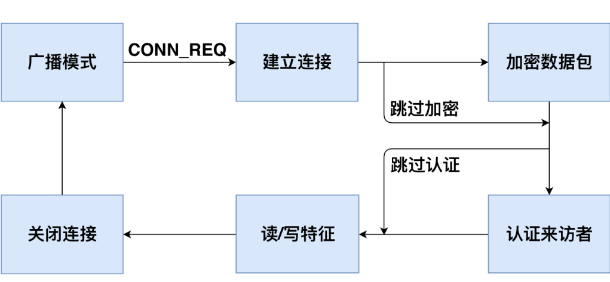
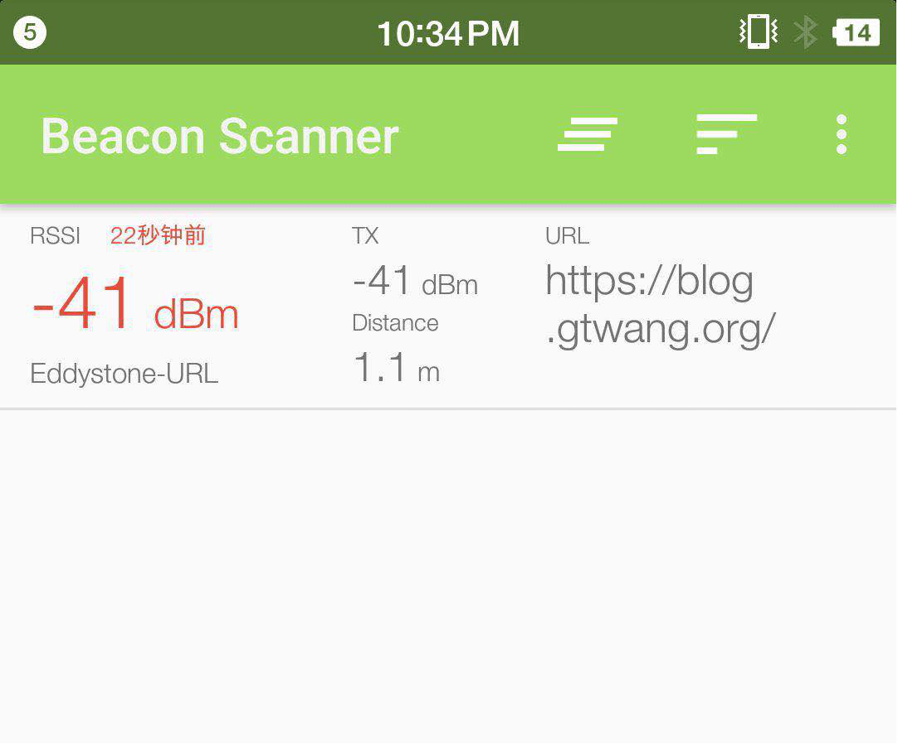

# 蓝牙实验
## 1. BLE简介

蓝牙（Bluetooth®）是一种无线技术标准，可实现固定设备、移动设备和个人之间的短距离数据交换（使用2.4—2.485GHz的ISM波段的UHF无线电波）。低功耗蓝牙（Bluetooth Low Energy，简称BLE）是蓝牙4.0引进的一种新模式，旨在医疗保健产品，可穿戴设备，智能家居等新兴应用。相较经典蓝牙，低功耗蓝牙在保持同等通信范围的同时显著降低功耗和成本。

一般来说，传统蓝牙被用于蓝牙耳机、蓝牙音箱、蓝牙鼠标等需要高频稳定传输数据的场合，而低功耗蓝牙常常被用于智能手环、智能手表、医疗保健设备如智能心率计等设备中。这些设备数据传输量较少，频率较低。使用低功耗蓝牙可以大幅增加他们的待机时间。

由于低功耗蓝牙在传统蓝牙的基础上大幅简化了其通信和数据访问控制流程，其安全性也相对较弱。近年来也出现了许多关于低功耗蓝牙设备的安全问题。

## 2. BLE工作流程

总的来说，在一次完整的BLE通信中，必须有两个角色，中央设备和外围设备。外围设备通常是数据的持有者，例如智能手环，智能门锁等设备。中央设备是数据的请求者，例如手机，平板电脑等设备。中央设备与外围设备建立连接，通过发送请求读写其中的数据来实现数据同步，或发送控制指令来改变该设备的工作状态。

图2.1展示了BLE设备完成一次通信的工作流程。通常来说，一个外围设备开始工作后，会不断向周围发送不定向的广播数据包，以便中央设备发现它。收到广播包的中央设备可以向该外围设备发送一个连接请求来建立一个BLE连接。收到请求后，外围设备与中央设备会协商一个共同的跳频序列并建立连接。随后，中央设备和外围设备可以使用此跳频序列进行传输数据包。连接建立后，中央设备可以选择加密通信数据或是进行认证过程，以便访问外围设备中具有加密或认证要求的数据。然后，中央设备可以发送读/写请求来访问外围设备中的数据。如果中央设备满足被请求数据的加密和认证要求，则外围设备将执行相应的操作并响应请求的数据。完成数据通信后，外围设备或中央设备可以关闭连接，外围设备返回广播状态。
在之后的章节中，我们将详细介绍每一个流程的具体细节。


<center>
<div style="color:orange; border-bottom: 1px solid #d9d9d9;
display: inline-block;
color: #999;
padding: 2px;">图. BLE设备的工作流程</div>
</center>
<!-- 图2.1  BLE设备的工作流程 -->

### 2.1  广播模式

BLE使用与经典蓝牙技术相同的频谱范围（2.400-2.4835 GHz ISM频段）进行通信。经典蓝牙使用79个1-MHz频道，而BLE使用40个2-MHz频道[35]。 当外围设备开始工作后，它会在第37，38和39信道中不断发送广播包，以便中央设备发现它并与其建立连接。广播包中包含外围设备的MAC地址，制造商相关信息和该设备的可连接性。可连接性表示该设备是否接受连接请求。可连接性可以在BLE配置中设置，即通用访问配置文件（Generic Access Profile, 简称GAP[36]）。 大多数BLE设备都是可连接的，因为它们需要建立连接来进行数据同步或接受控制指令。

如图2.2所示，在BLE通信范围内，所有中央设备都可以接收到外围设备发送的广播包。通常来说，中央设备可以通过广播包中包含的MAC地址和制造商相关信息来分辨不同的外围设备，从而选择建立连接的目标。一旦一个中央设备和外围设备之间建立了连接，该外围设备将停止广播，其他中央设备也无法与该外围设备建立连接。


<center>
<div style="color:orange; border-bottom: 1px solid #d9d9d9;
display: inline-block;
color: #999;
padding: 2px;">图. 广播模式的网络拓扑</div>
</center>
<!-- 图2.2  广播模式的网络拓扑 -->

### 2.2  建立连接

中央设备在接收到广播包之后，可以向外围设备发送连接请求数据包以建立连接。与传统蓝牙一样，BLE使用跳频技术在剩下37个信道中传输数据。要让外围设备和中央设备能够准确地收到对方的信息，双方必须协商共同的跳频序列来传输数据。中央设备会发送带有跳频参数的连接请求（CONN_REQ数据包），包括跳频间隔，跳频增量，MAC地址和初始化CRC。外围设备收到CONN_REQ数据包后，会根据其中参数计算跳频序列。然后外围设备进入连接状态并停止广播。中央设备和外围设备根据相同的跳频序列，到相同的信道中传输数据包。跳频技术保证了一个区域内不同BLE设备的通信不会相互干扰，提高了BLE的稳定性（如图2.3所示）。


<center>
<div style="color:orange; border-bottom: 1px solid #d9d9d9;
display: inline-block;
color: #999;
padding: 2px;">图. BLE跳频技术示意图</div>
</center>
<!-- 图2.3 BLE跳频技术示意图 -->

为了保持连接，中央设备和外围设备应该在没有数据传输时向对方发送空的心跳包。如果中央设备或外围设备在一定时间内没有接收到任何心跳包时（例如，传输信道受到干扰或发送者停止发送心跳包），连接将被关闭，随后外围设备重新开始广播。

### 2.3  加密数据包

BLE协议提供了数据加密以防止数据窃听。要进行数据加密，中央设备首先向外围设备发送加密请求包（LL_ENC_REQ）。如果外围设备接受该加密请求，它会回复一个LL_ENC_RSP数据包。否则，它会响应一个LL _REJECT_IND数据包以拒绝加密请求。如果外围设备接受了加密请求，则中央设备和外围设备会开始协商一个公共的加密密钥。生成加密密钥的过程被称为配对。
由于BLE通常由具有有限输入输出能力的设备使用，这使得通过用户输入来生成加密密钥变得十分困难。因此，针对具有不同能力的设备，BLE提供了以下几种配对的方法。

- Just Works：两个设备通过在没有用户授权的情况下交换无线数据包来协商加密密钥，用户不需要在两个设备上进行确认。这种情况对两种设备都没有特殊的能力要求。
- Numeric Comparison：两个设备协商生成一个6位数的数字，并展示在两个设备上供用户对比确认。在该配对方法中，双方设备必须都具有输出能力。用户可以确认哪两个设备正在配对，然后用户可以单击智能手环以确认配对。
- Passkey Entry: 一个设备（例如，外围设备）随机生成并展示一个6位数的数字。用户记录该数字并将其输入另一设备（例如，中央设备）。加密密钥将根据6位数字在两个设备中本地生成。因此，即使配对过程被窃听，攻击者无法知道这6位数字，也无法得到密钥。在该配对方法中，一个设备必须拥有输出能力，另一个则必须拥有输入能力。
- Out-of-band（简称OOB配对方法）：两个设备使用诸如NFC之类的带外信道与一些附加信息交互。这些信息将用作密钥生成的输入。在此配对方法中，两个设备都必须支持带外数据配对。
  

在配对过程中，中央设备和外围设备首先交换其输入和输出能力。输入和输出能力表示这两个设备是否具有让用户进行输入信息的键盘，和给用户输出信息的展示屏等。然后中央设备和外围设备根据双方的输入和输出能力选择具有最高安全级别的配对方法。配对后，中央设备和外围设备开始使用密钥加密传输数据。如果中央设备和外围设备已经配对，则它们不需要在之后的连接中再次配对。

### 2.4  身份认证

BLE协议中，身份认证的目的是验证中央设备的合法性。与数据加密不同，BLE规范[37]中没有提供任何身份认证的方法，而是建议BLE设备制造商在应用层实现身份认证过程。与Web应用程序中的身份认证机制相同，中央设备和外围设备应首先协商一个认证凭证（如Web应用中的用户名和密码）。在之后的连接中，中央设备可以使用此认证凭证来表明自身的身份。

由于生产厂商的不同，不同的BLE设备可能实现了不同的身份认证方法。例如，在智能手环Mi Band 1中，智能手环和智能手机在第一次连接中协商一个随机字符串作为认证凭证。在之后的连接中，智能手机应将此认证凭证写入智能手环中进行身份认证；在某款智能门锁中，智能门锁和智能手机在第一次连接中生成一个随机密钥作为认证凭证。在之后的连接中，智能手环首先向智能手机发送一个随机字符串。智能手机使用事先生成的认证凭证对字符串进行签名，然后将签名后的字符串发送给智能手环。智能手环将检查签名后数据是否与认证凭证相对应（如图2.4所示）。


<center>
<div style="color:orange; border-bottom: 1px solid #d9d9d9;
display: inline-block;
color: #999;
padding: 2px;">图. 某智能门锁的认证过程</div>
</center>
<!-- 图2.4  某智能门锁的认证过程 -->

### 2.5  读写数据

在外围设备中，数据被存储在通用属性配置文件（Generic Attribute Profile, 简称GATT[38]）中。GATT定义了一个数据存储结构（如图2.5所示），在这个结构中，特征是数据存储的最小单位。每个特征都包含以下属性：

- UUID：特征的唯一标识符。
- Handle：特征的访问地址。
- Properties：此特征允许的操作类型。它可以是只读（read only），只写（write only）或读写（read/write）。
- Secure：此特征的访问权限控制。 它可以是没有任何权限要求（No Security，NS），要求中央设备与外围设备进行了加密（Encryption Required，ER），要求中央设备通过了身份认证（Authentication Required，AR）或既要求加密也要求认证（Encryption and Authentication Required，EA）。如果特征要求数据加密，则中央设备必须数据加密才能读取或写入此特征。如果特征要求身份认证，则中央设备必须通过认证才能访问此特征。
- Value：存储在特征中的数据。


<center>
<div style="color:orange; border-bottom: 1px solid #d9d9d9;
display: inline-block;
color: #999;
padding: 2px;">图. GATT定义的数据存储结构</div>
</center>
<!-- 图2.5  GATT定义的数据存储结构 -->

特征是外围设备中数据存储的基本单位。每个特征由设备生产厂商给予其含义。例如，在智能手环中，电池信息，活动数据，步数，心率存储在不同的特征中。表2.1列出了一些示例特征。任何连接到一个外围设备的中央设备可以直接读取特征列表的Handle，UUID和Properties，而Value则由Secure字段保护。

表2.1  GATT特征实例

Handle|UUID|Properties|Secure|Value
----------|----------|----------|----------|----------
0x01|UUID1|read only|NS|2
0x02|UUID2|write only|NS|0x180A
0x03|UUID3|read/write|ER|36.43
0x04|UUID4|read/write|AR|0
0x05|UUID5|read/write|EA|22

如果一个特征是可读的（Properties字段是read only或read/write），则中央设备可以向外围设备发送读请求包（如图2.6所示），包括opcode操作码和目标特征的handle。如果该设备满足了特征的Secure字段中的要求，则外围设备将响应特征的Value值。如果一个特征是可写的（Properties字段是write only或read/write），则中央设备可以发送写请求包（如图2.7所示)，包括opcode操作码，目标特征handle和欲写入的值。如果该设备满足特征的Secure字段中的要求，外围设备将使用写数据包中的新值更新目标特征中的Value值。以智能手环为例，智能手机发送读请求以获取智能手环上测量的数据，并发送写请求以修改手环的工作状态来控制智能手环。


<center>
<div style="color:orange; border-bottom: 1px solid #d9d9d9;
display: inline-block;
color: #999;
padding: 2px;">图. 读数据包格式</div>
</center>
<!-- 图2.6  读数据包格式 -->


<center>
<div style="color:orange; border-bottom: 1px solid #d9d9d9;
display: inline-block;
color: #999;
padding: 2px;">图. 写数据包格式</div>
</center>
<!-- 图2.7  写数据包格式 -->

表2.2展示了外围设备对于不同中央设备的读/写请求的返回结果。如果特写征在Secure字段中没有任何要求（NS），则它会回应所有设备的读写请求。如果某个特征要求加密（ER或EA），则只会为进行了数据加密的设备返回结果，但对未加密的设备会返回错误代码Encryption Insufficient。对于认证要求则与加密类似。

表2.2  BLE特征的访问控制

安全要求|未加密未认证|已加密未认证|未加密已认证|已加密已认证
-----------|-----------|-----------|-----------|-----------
NS|返回结果|返回结果|返回结果|返回结果
ER|错误码|返回结果|错误码|返回结果
AR|未知结果|未知结果|返回结果|返回结果
EA|错误码|未知结果|错误码|返回结果

## 3. BLE安全

### 3.1. BLE嗅探

BLE嗅探原理：BLE通信内容包含广播包和连接数据包。由于广播包在公开的广播信道传输，在通信范围内任何人都可以接收到这些广播包。因此，BLE嗅探一般指嗅探连接数据包。BLE连接数据包在跳频信道中传输，如果不知道跳频序列则无法嗅探。但由于所有的跳频参数都在建立连接时主机发出的连接请求中，只要获取到这个包，嗅探工具就能够计算出跳频序列，进而在跳频信道中获取连接数据包。因此，BLE嗅探工具要求在主机和从机建立连接前开始嗅探。

常用的BLE嗅探工具有以下几种：

- 使用智能手机或蓝牙适配器进行嗅探：成本低、只能嗅探到广播包、信息不太全面
- 使用USB Dongle进行嗅探：成本较低、能监听广播包和通信包、只能监听低功耗蓝牙、只能在windows系统下使用
- 使用Ubertooth one进行嗅探：支持所有版本蓝牙监听、支持数据加解密等高级功能

### 3.2. BLE通信伪造

伪造广播数据包：由于BLE通信中中央设备通过接受到的广播包来区分不同的外围设备，如果一个攻击设备使用某个外围设备的广播包进行广播，那么中央设备可能会将这个攻击设备误认为外围设备，与攻击设备进行连接。

伪造通信数据包：由于BLE通信中外围设备接受任何中央设备的连接请求，因此攻击设备可以主动向外围设备发起连接，访问其中的数据。

## 4. 蓝牙连接实验

### 4.1. 实验一：搜索附近的BLE设备，制作一个beacons节点

**实验内容：**

让同学们动手搜索附近的蓝牙设备，理解BLE设备的广播模式，并自己动手制作一个能够广播的BLE节点。

**知识介绍：**

Beacons是使用蓝牙4.0（BLE）技术发射信号的小设备。利用BLE的广播信道，发送不定向数据，大小为128bit，有效范围为几米，工作时间可达三年

iBeacon和Eddystone都是beacons的数据格式标准。iBeacon是苹果提出的，时间最早；Eddystone是谷歌提出的，功能最强。

**实验步骤：**

- (1) 使用智能手机下载APP（IOS：lightblue；Android：BLE Debugger），并使用APP搜索附近的BLE设备，理解广播包的各个参数。


<center>
<div style="color:orange; border-bottom: 1px solid #d9d9d9;
display: inline-block;
color: #999;
padding: 2px;">图. APP使用界面</div>
</center>

- (2) 利用linux系统中的bluez协议栈，将电脑制作成一个发射BLE广播包的beacons节点。linux系统执行以下命令：
  
    ```shell
    $hciconfig hci0 up  					              #开启蓝牙网卡
    $hcitool -i hci0 cmd 0x08 0x000A 01 			       #开启广播模式
    $hcitool -i hci0 cmd 0x08 0x0008 1a 02 01 06 03 03 aa fe 12 16 aa fe 10 00 03 62 6C 6F 67 2E 67 74 77 61 6E 67 01 00 00 00 00 00	#定制广播内容
    ```

- (3) 手机下载eBeacon或Eddystone validator软件，查看beacons节点状态


<center>
<div style="color:orange; border-bottom: 1px solid #d9d9d9;
display: inline-block;
color: #999;
padding: 2px;">图. beacons节点状态</div>
</center>

### 4.2. 实验二：理解BLE设备通信流程和嗅探方法

**实验内容：**

使用手机与小米手环通信，使用USB Dongle监听通信。让同学们理解BLE设备的通信流程，同时掌握嗅探工具的使用方法。

**知识介绍：**

BLE嗅探常用工具：

- USB Dongle：芯片厂商为了方便开发者能够方便的调试通信，将芯片集成为USB模块。
- nRF51822：为嗅探低功耗蓝牙而设计的一款 USB Dongle

**实验步骤：**

- (1) 给每个同学发一个USB Dongle，并让他们在电脑上安装嗅探器驱动和wireshark。
- (2) 助教使智能手环进入广播阶段，让每个同学使用USB Dongle开始监听，并锁定目标小米手环。


<center>
<div style="color:orange; border-bottom: 1px solid #d9d9d9;
display: inline-block;
color: #999;
padding: 2px;">图. 锁定目标设备</div>
</center>

- (3) 助教使用手机连接智能手环，并进行一些操作。使用wireshark的数据包给同学们讲解BLE的广播、建立连接、身份认证和特征读写的详细过程。


<center>
<div style="color:orange; border-bottom: 1px solid #d9d9d9;
display: inline-block;
color: #999;
padding: 2px;">图. 设备的广播模式和建立连接过程</div>
</center>

- (4) 助教在手环中读写一些信息，让同学们在wireshark中找到这些信息。

<!-- 图2.3 设备读写数据过程 -->

### 4.3. 实验三：窃听智能门锁密码

**实验内容：**

使用脚本模拟智能门锁开锁过程，让同学们使用usb dongle嗅探门锁密码，体会BLE攻击的具体过程。

**规则描述：**

- (1) 假设你周围有个使用低功耗蓝牙控制的智能门锁，该门锁的主人会不定时发送解锁密钥来开门。尝试使用蓝牙嗅探技术，获取门锁密钥，攻破大门！
- (2) 门锁MAC地址未知，该门锁会在广播模式和连接模式不断切换。密钥格式为：KEY{xxxxxx}，祝你好运！

**实验步骤：**

- (1) 助教使用gate.py脚本和bleno模拟的门锁开始解锁过程，同学们使用USB Dongle嗅探并截获门锁密钥。
- (2) 游戏结束后，助教给同学们复盘，并讲解嗅探过程的常见问题。

### 4.4. 实验四：设计一个BLE设备

**实验内容：**

让同学们自己制作BLE中央设备和外围设备，深入理解BLE通信流程和伪造通信原理。（可以专门开一节课让同学们展示他们设计的设备）

**实验要求：**

设计一个蓝牙设备，思考它的业务逻辑，根据业务逻辑构造该设备的广播包与连接数据包。并实现与该设备交互的连接脚本。（推荐bleno+bluepy实现）

完成作业后，交付设备与脚本源代码和说明文档。文档中说明该设备的功能和业务流程。

**举例：**

小明使用nodejs实现了一个温度传感器。该传感器具有用户身份认证功能、存储温度功能和改变显示单位功能。建立连接后，该设备要求用户在身份认证handle写入一串预设字符串，否则不能读写温度和单位的数据。通过验证后，用户可以读取温度的handle，设备会根据单位计算并返回结果。用户还可以向单位handle写入数据改变温度显示单位（摄氏度、华氏度等。）

**参考实现：**
https://github.com/noble/bleno/tree/master/examples
