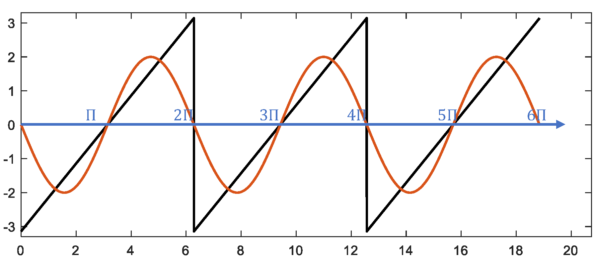
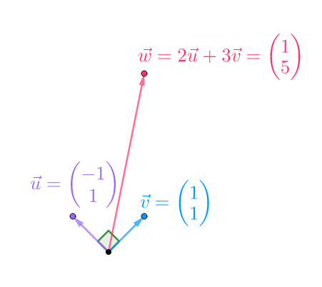
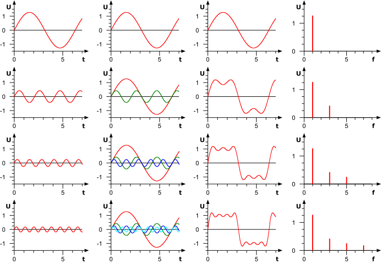
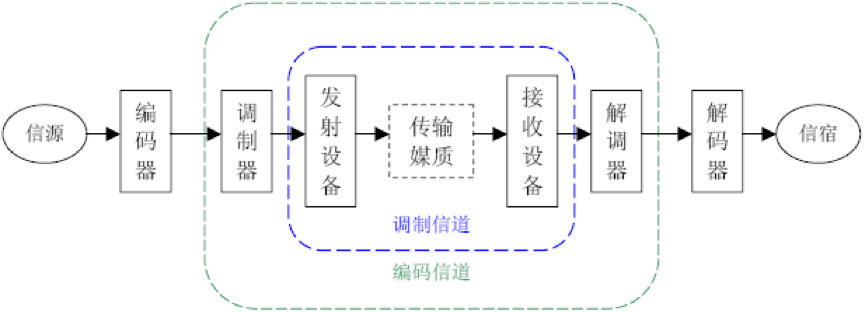
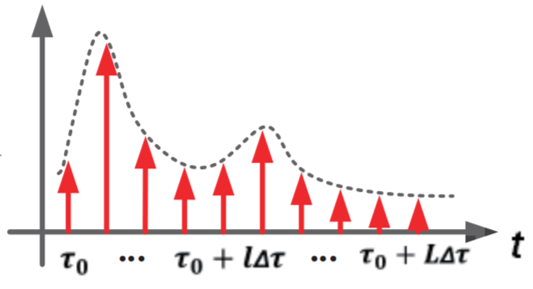
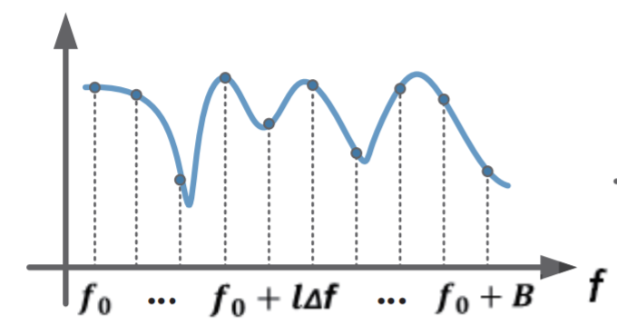

# 物联网基础概念

## 1. 采样和量化

为了介绍清楚无线传输的基础以及在上面发展出来的各种技术，我们先来介绍无线通信的基本原理。无线通信的基本思想就是利用无线电磁波或者无线信号来调制和传输信息。比如最简单的场景中，我们可以产生一个固定频率的无线信号，通过有信号来代表1，没有信号来代表0，来传输信号。由于产生和控制无线电磁型号需要比较复杂的过程，在几年前我在计划该课程的时候一直苦恼怎么让大家很直观的理解其中的技术，最好还能够实际动手试试。现在市面上有能够让我们进行信号处理的设备，但是我觉得还可以做得更直接更好，利用我们的智能手机就能完成这一系列工作。这一个课程中主要利用声波信号来模拟无线信号，声波信号可以很方便的产生，利用普通的智能手机就能够产生、发射和接收声波信号，同时声波信号也易于处理，很好的可视化，同时声波信号的处理和大部分无线信号的处理过程都比较类似，有利于我们理解无线处理的过程。本课程后面的材料中如果没有特殊声明，都讲会使用声波信号来模拟物联网连接过程中的各种技术，请同学们也自己动手来多尝试一下。

在介绍声波信号的处理之前，我们先来理解一下声波信号的基本特征。一般来说，人可以听到的声波范围大概为20Hz到20KHz中间，因此现在大部分手机声音采样率为44100，对应到能够处理的最大声音频率为22KHz左右。超过20KHz的声波我们经常叫做超声波。

### 1.1 声波的生成、发送和接收

这一部分对应了无线数据发送的时候的生成、发送和接收。在无线数据发送的过程中，这里每一部分都对应了很多的操作。我们先介绍声波的一些基本知识，然后通过声波的基本知识介绍数据发送和接收的过程。

对于一个最简单的声波信号，可以为一个简单的正弦信号，下图展示的一个频率为1KHz的正弦声波信号，大家可以将这段声音播放出来看看。


<center>
<div style="color:orange; border-bottom: 1px solid #d9d9d9;
display: inline-block;
color: #999;
padding: 2px;">图. 1KHz正弦声波信号信号</div>
</center>

为了产生这段声音，我们只需要在Matlab执行如下的操作并将文件保存下来就可以。

```matlab
Fs = 44100;                             % 采样频率
T = 4;                                  % 时间长度
n = Fs*T;                               % 采样点数
f = 1000;                               % 声音频率
y = sin(2*pi*f*T*linspace(0,1,n+1));    % 产生声音
sound(y,Fs)                             % 播放声音
audiowrite('sound.wav',y,Fs);           % 保存声音
```

声音是一种机械波，有物体的震动引起了空气的震动，从而能够传播声音。因此出现了超声波洗龙虾、超声波洗牙。

关于Matlab的主要语法，有过任意编程语言经验的人应该都不会感觉到复杂，请大家自行学习。

日常生活中我们能看到的信号大部分都是模拟信号，我们能看到的风雨雷电，我们听到的声音，看到的图片等，要将这些信息存入到电脑中间，需要经过一系列的处理，其中有几个重要的步骤就是采样和量化。无线通信是无线电磁信号为基础的。我们在这一章节中为了方便理解，针对声音信号来进行研究。

### 1.2 模拟信号到数字信号

这是信号处理中的关键一步，因为网络通信尤其是无线通信的时候，利用的都是物理信号（如电磁信号），因此通信过程中的重要一步就是将模拟信号转成数字信号。


<center>
<div style="color:orange; border-bottom: 1px solid #d9d9d9;
display: inline-block;
color: #999;
padding: 2px;">图. 通信过程</div>
</center>

如果真实存在着一个1KHz的声波信号，我们需要接收和处理这个信号的话，先要对信号进行采样和量化，这实际上也是所有计算机处理数据和信号的基础。计算机中将所有模拟信号转化为数字信号是通过采样和量化来实现的。具体来说，通过将模拟信号转化为电信号（通常为电压信号），然后通过将电压量化转成数字信号。在声音信号的处理中，我们首先依赖的是麦克风。麦克风能够将模拟的声音信号转化为电压信号，简单来说，麦克风上有一个可以随着声音振动而振动的薄膜，薄膜振动引起了产生电压的不断变化，因此电压的变化就代表了声音信号的变化。


<center>
<div style="color:orange; border-bottom: 1px solid #d9d9d9;
display: inline-block;
color: #999;
padding: 2px;">图. 麦克风原理</div>
</center>

不过大家要注意的是，这个时候电压在时间和大小上依然是连续的，也就是说任意的电压值都是有可能的，很显然，这样大数据在电脑上是无法保存的，保存的大小是无穷大。为了保存这样的数据，我们先要对数据进行处理。第一个处理就是连续的信号转化为离散的信号。这一步是通过采样来实现的。采样是指计算机设备定时的对信号电压进行采集，采样解决了连续信号到离散信号的问题，可是采样后的电压值仍然没有办法直接保存，因为电压值在可能的取值范围内是连续的，为了解决这个问题，就需要量化。量化简单的来说就是将无限的连续的电压取值转化为有限的离散的电压取值，这样采样后的结果就能够保存。我们平时说的模拟/数字转换器（Analog to Digital Converter，即ADC，与之对应的是数/模转换器,即DAC）其实也就是干的这样的事情。

具体这个事情是怎么来实现的呢，我们首先通过简单的仿真实验来进行情况说明，然后我们再通过实际的信号让大家体会这一过程。假设存在一个正弦的声音信号，频率为5Hz，理想情况下这个信号是一个正弦波，这个信号在matlab下可以如下产生和画图出来。注意，matlab下产生的已经是离散的信号了。

```matlab
%% 信号的产生过程
%% 产生一个频率为1000、时长为1s的信号；
t = 0:1/200:1; % 1s内2000个采样点
f = 5; % 频率f=1000
y = sin(2*pi*f*t);
plot(t, y);
```


<center>
<div style="color:orange; border-bottom: 1px solid #d9d9d9;
display: inline-block;
color: #999;
padding: 2px;">图. 信号时域图</div>
</center>

注意这里面有几个小的问题，当我们将信号频率稍微做一些修改好，画出来的图将变成下面这个样子。

```matlab
%% 信号的产生过程
%% 产生一个频率为100、时长为1s的信号；
t = 0:1/200:1; % 1s内150个采样点
f = 100; % 频率f=1000
y = sin(2*pi*f*t);
plot(t, y);
```


<center>
<div style="color:orange; border-bottom: 1px solid #d9d9d9;
display: inline-block;
color: #999;
padding: 2px;">图. 采样率不足</div>
</center>

注意这个图已经完全不是我们想象中的正弦图像了，大家想想看看这个是什么原因。

这里面有几个很有趣的问题，是不是连续的信号就无法用离散的信号表示出来，连续的信号是不是就得用无穷多的离散信号来表达？这里牵涉到了信号采样中的一个重要问题，我们将这个问题更加具体化，假设信号中的最大频率为f，那么应该以多大的采样频率对信号进行采样合理呢，显然不可能无限大的采样频率，这样在计算机上无法处理，实际上也非常不经济。这个问题也就变为信号的频率为f，那么最少的采样频率为多少。

奈奎斯特采样定律告诉我们，对于这样的情形，需要的采样频率为2*f。采样过程所应遵循的规律，又称取样定理、抽样定理。采样定理说明采样频率与信号频谱之间的关系，是连续信号的基本依据。

我们来看一个更加有意思的例子，如果信号的采样频率设置得不对会怎么样？

```matlab
%% 信号的产生过程
%% 信号的产生过程
%% 产生一个频率为100、时长为1s的信号；
t = 0:1/10000:1; % 1s内10000个采样点
f = 401; % 频率f=1000
y = sin(2*pi*f*t);
plot(t, y);
```

这个例子中，信号是400Hz的，理论上来说，信号是如下这个样子的：


<center>
<div style="color:orange; border-bottom: 1px solid #d9d9d9;
display: inline-block;
color: #999;
padding: 2px;">图. 400Hz信号</div>
</center>

```matlab
%% 信号的产生过程
%% 产生一个频率为100、时长为1s的信号；
t = 0:1/402:1; % 1s内2000个采样点
f = 401; % 频率f=1000
y = sin(2*pi*f*t);
plot(t, y);
```

大家可以先来想象一下这个采样出来的结果会是怎么样的。


<center>
<div style="color:orange; border-bottom: 1px solid #d9d9d9;
display: inline-block;
color: #999;
padding: 2px;">图. 低采样频率</div>
</center>

**思考：**

1. 为什么会出现这样的结果。
2. 如果频率为f，采样频率为fs，那么混叠后的频率将会是多少，这样会对通信产生什么影响。
3. 用于演示混叠现象的经典例子之一是所谓的“车轮效应”。在影片里当马车越走越快时，马车车轮似乎越走越慢，然后甚至朝反方向运转。为什么？

### 1.3 量化

在数字信号处理领域，量化指将信号的连续取值（或者大量可能的离散取值）近似为有限多个（或较少的）离散值的过程。量化主要应用于从连续信号到数字信号的转换中。连续信号经过采样成为离散信号，离散信号经过量化即成为数字信号。注意离散信号通常情况下并不需要经过量化的过程，但可能在值域上并不离散，还是需要经过量化的过程 。信号的采样和量化通常都是由ADC实现的。

例如8位的ADC可以将标称输入电压范围内的模拟电压信号转换为8位的数字信号。

**思考：** 多少位不同的电压值？


<center>
<div style="color:orange; border-bottom: 1px solid #d9d9d9;
display: inline-block;
color: #999;
padding: 2px;">图. 量化效果图</div>
</center>


<center>
<div style="color:orange; border-bottom: 1px solid #d9d9d9;
display: inline-block;
color: #999;
padding: 2px;">图. 量化效果</div>
</center>

> The simplest way to quantize a signal is to choose the digital amplitude value closest to the original analog amplitude. This example shows the original analog signal (green), the quantized signal (black dots), the signal reconstructed from the quantized signal (yellow) and the difference between the original signal and the reconstructed signal (red). The difference between the original signal and the reconstructed signal is the quantization error and, in this simple quantization scheme, is a deterministic function of the input signal.

为了进一步说明这种四舍五入方法，这里以3 位(3 bit)的二进制数码进行量化的过程为例，如图4-9所示。


<center>
<div style="color:orange; border-bottom: 1px solid #d9d9d9;
display: inline-block;
color: #999;
padding: 2px;">图4-9. 示意图</div>
</center>

上图中，输入信号是一个模拟信号，采样点为A～L，幅值范围为0～9，采样值、量化和编码的结果如表4-3所示。


<center>
<div style="color:orange; border-bottom: 1px solid #d9d9d9;
display: inline-block;
color: #999;
padding: 2px;">表4-3. 采样值、 量化和编码的结果</div>
</center>

> ref: https://baijiahao.baidu.com/s?id=1614627981206121506&wfr=spider&for=pc

可见量化的过程中，输出的信号和原信号是有一定的区别的，这个区别就是量化噪声。我们通常说的高保真，其中有一个重要步骤采取足够多的量化位数，保证量化噪声足够小，量化出来的信号足够接近原始信号，当然其中带来的代价就是存储和处理的开销变大。大家可以去网易音乐上看看高保真音乐的，他后面以后一个码率，这一个码率跟量化是直接相关的。思考：大家想想那个码率都跟什么因素相关。

按照量化级的划分方式分，有均匀量化和非均匀量化。

**思考：** 为什么有这两种量化的方式？

- 均匀量化：ADC输入动态范围被均匀地划分为$2^n$份。

- 非均匀量化：ADC输入动态范围的划分不均匀，一般用类似指数的曲线进行量化。

非均匀量化是针对均匀量化提出的，因为一般的语音信号中，绝大部分是小幅度的信号，且人耳听觉遵循指数规律。为了保证关心的信号能够被更精确的还原，我们应该将更多的bit用于表示小信号。

**思考**：

假设要将最大频率为8KHz的唱歌的信号转成数字信号，量化bit为8bit，则产生的信号码率至少是多少？1min的信号大小是多少？

到了这里，我们来看一个真实的采样和量化的例子，这也是我们整个数据处理实验的开始。这个实验在手机上就能实现，我们来看看手机上如何进行声音的采样和量化。

在做实验之前，你需要准备好一个手机（安卓和苹果手机都可以），并配置好基本的开发环境，如果你还不太熟悉，参见平台搭建章节。


安装好了之后，可以启动第一个声音记录的小程序。仔细看这个小程序，跟大家学习过的网络传输的过程是类似的，前面有一个ADC不断的将声音信号转化成为数字信号，这个数字信号是存储在一个buffer里面的，需要我们讲buffer中的数据不断的读取出来然后保存成声音信号。类似于网络中的数据处理，网卡有一个很重要的功能就是将物理信号转化为数字信号，然后也是需要我们将网络收到的数据从buffer中读取出来。事实上这一个例子也展示了大多数需要用到ADC转化的功能，数据被转换并且保存在一个buffer中，然后对buffer中的数据进行处理。当然进一步来看的话，这个buffer中的数据如何处理也是有不同的手段的，有一些是需要轮询，不断的取看buffer中是否有数据，有一些是基于中断，一旦有数据就会产生一个中断通知进行数据处理，这两种处理方法都可以实现非阻塞模式，即用户无需在这个地方等待buffer内容。还有一种是阻塞模式，用户需要等待buffer内容，当buffer中有数据时才能够继续往下处理。几种模式各有优缺点，这也是数据处理中，尤其是通信和与硬件打交道的数据处理中经常要面临的问题。如果数据处理不及时，数据就会被覆盖导致丢失，这个问题在网络传输中也会遇到。

这里面通过这一个小的程序我们想介绍几个概念，这也是平时大家在网络学习的过程中容易忽视的概念，因为网络学习中我们很难有机会从最底层开始接触到基础的信号处理。在启动录音的过程中，需要设置几个参数，第一个就是采样率，目前设置的是44100Hz，基本能够将人能听到的声音录下来。一个是量化的bit位数，这里设置的是16位，即每一个采样点用16bit来量化。另外一个是声道数量，目前选择的是双声道，即有两路数据。声音编码的格式采用的是PCM格式，这也是一种最基础的声音编码方法，与我们常见的mp3等格式不同，那些格式需要将声音文件进行进一步的编码。这个数据文件也是我们后面会要用到的数据的基础格式。

**思考：** 那么2.4GHz信号是否需要4.8GHz的采样频率，也就是意味着1s之内有4.8GHz的数据？

## 2. 傅里叶分析

前面的研究我们可以看出，正弦信号是具备很好的属性，我们都很熟悉，也很好处理的。可是实际中有一个问题，不是每一个信号都是正弦信号，那如何处理这些信号呢。研究中我们有一个方法，可以把一个未知的问题转化为已知的问题，那么一个很自然的想法就是，能不能将一个未知的不好处理的信号转化为已知的好处理的信号。傅里叶分析就是实现这种转换的一个有力工具！傅里叶分析的最基本的作用就是建立信号在时域和频域之间的转换关系，从而一些在时域上难以解决的问题，可以变换到频域进行分析，反之亦然。
<!-- 那么傅里叶变换是怎么得到的呢。我们先不看这么复杂的过程，先来看一个简单的例子。 -->

### 2.1 傅里叶级数

傅里叶级数源于一个对周期函数进行分解的猜想：十七世纪中叶，拉格朗日等数学家发现，某些周期函数可以由三角函数的和来表示。如下面例子所示，对于一个周期为$2\pi$的锯齿形波，通过不断叠加具有不同的周期的三角函数，我们可以使叠加结果逐渐逼近原本的锯齿形波。我们使用MATLAB仿真来更加直观地理解这一过程：

```matlab
%% 原始信号：周期为2pi的锯齿形波
fs = 1e3;
t = 0:1/fs:6*pi;
y = -pi + mod(t,2*pi);
figure;
    plot(t,y,'color','black','linewidth',1.5);
```


<center>
<div style="color:orange; border-bottom: 1px solid #d9d9d9;
display: inline-block;
color: #999;
padding: 2px;">图. MATLAB产生周期2pi的锯齿波</div>
</center>
<!-- <center>图. MATLAB产生周期2pi的锯齿波</center> -->

<!-- 接下来，我们使用三角函数对生成的这个锯齿波进行拟合。锯齿波的最小周期为$2\pi$，因此我们首先使用具有相同最小周期的正弦波$\sin(x)$，观察其对锯齿波的拟合情况： -->

```matlab
%% 使用最小周期为2pi的基础正弦波sin(x)拟合锯齿波
z = -2*sin(t);
hold on
    plot(t,z,'linewidth',1.5);
    plot([0,6.5*pi],[0 0],'color','blue','linewidth',1.5);
    xlim([0,6.6*pi]);
    ylim([-3.3 3.3]);
    box on
```


<center>
<div style="color:orange; border-bottom: 1px solid #d9d9d9;
display: inline-block;
color: #999;
padding: 2px;">图. 一阶拟合结果</div>
</center>
<!-- <center>图. 一阶拟合结果</center> -->

<!-- $\sin(x)$与锯齿波周期完全一致 ($\sin(x)$的系数$a=-2$，三角函数的系数将在后文中说明，此处暂不讨论)。比较$a\sin(x)$和锯齿波$y(x)$的大小，发现在$0$到$\pi$的区间内，$a\sin(x)-y(x)$先正后负，且在之后的每一段长度为$\pi$的区间中，$a\sin(x)$和$y(x)$都满足这一规律。因此，我们在$a\sin(x)$的基础上叠加一个周期为$\pi$且输出值先负后正的正弦信号$\sin(2x)$，用于补偿一阶拟合与锯齿波的差异： -->

```matlab
%% 叠加最小周期为pi的基础正弦波sin(2x)做二阶拟合
z = -2*sin(t) - sin(2*t);
hold on
    plot(t,z,'linewidth',1.5);
    plot([0,6.5*pi],[0 0],'color','blue','linewidth',1.5);
    xlim([0,6.6*pi]);
    ylim([-3.3 3.3]);
    box on
```


<center>
<div style="color:orange; border-bottom: 1px solid #d9d9d9;
display: inline-block;
color: #999;
padding: 2px;">图. 二阶拟合结果</div>
</center>
<!-- <center>图. 二阶拟合结果</center> -->

继续叠加与锯齿波具有相同周期的三角函数 (即$\sin(nx)$，其中$n\in \mathbb{R}$)，使拟合的结果不断地逼近初始的锯齿形波：

```matlab
%% 不同阶数三角函数叠加结果示意
figure;
z = -2*sin(t) - sin(2*t) - 2/3*sin(3*t);
subplot(2,2,1);fplot(t,y,z);
title('三阶拟合');

z = -2*sin(t) - sin(2*t) - 2/3*sin(3*t) - 1/2*sin(4*t);
subplot(2,2,2);fplot(t,y,z);
title('四阶拟合');

z = -2*sin(t) - sin(2*t) - 2/3*sin(3*t) - 1/2*sin(4*t) - 2/5*sin(5*t);
subplot(2,2,3);fplot(t,y,z);
title('五阶拟合');

z = -2*sin(t) - sin(2*t) - 2/3*sin(3*t) - 1/2*sin(4*t) - 2/5*sin(5*t) - 1/3*sin(6*t);
subplot(2,2,4);fplot(t,y,z);
title('六阶拟合');

function fplot(t,y,z)
hold on;
    plot(t,y,'color','black','linewidth',1.5);
    plot(t,z,'linewidth',1.5);
    plot([0,6.5*pi],[0 0],'color','b','linewidth',1.5);
    xlim([0,6.6*pi]);
    ylim([-3.3 3.3]);
    box on;
end
```


<center>
<div style="color:orange; border-bottom: 1px solid #d9d9d9;
display: inline-block;
color: #999;
padding: 2px;">图. 锯齿形波三阶到六阶拟合结果</div>
</center>
<!-- <center>图. 锯齿形波三到六阶拟合结果</center> -->

从上面的例子可以看到，为了拟合一个周期函数，我们需要使用多种不同周期的三角函数，调整他们的振幅并叠加。那么，给定任意一个周期函数，是否都能将其表示为三角函数和的形式？如果可以表示，则每个用于叠加的三角函数周期是多少？函数振幅又是多少？

傅里叶针对上述问题进行研究，设计出了无穷级数形式的周期函数展开方法，后人称该周期函数展开方法为傅里叶级数（Fourier Series）。傅里叶宣称，任何周期函数（无论连续与否）皆可用傅里叶级数表示。傅里叶级数给出了周期函数展开成三角函数的理论证明，确定了展开式中各项的周期和振幅。但在级数使用范围这一问题上，傅里叶的结论并不准确，德国数学家狄利克雷证明了某些情况下的周期函数无法用傅里叶级数表示，并率先给出了周期函数可展开成傅里叶级数的条件，即狄利克雷条件：
<!-- 他考虑单变量周期函数形成的向量空间，并以无限多个余弦和正弦函数构成单范正交集，由此设计出无穷级数形式的展开式，后人称为傅里叶级数(Fourier series)。 -->

1. 此函数必须是有界的(bounded)，即对于任意$x$，$|f(x)|<M$，$M$是一正实数；
2. 在任意区间内，除了有限个不连续点，$f(x)$必须是连续函数；
3. 在任意区间内，$f(x)$必须仅包含有限个极值；
4. 在一周期内，$|f(x)|$的积分必须收敛。

尽管适用性限定于满足迪利克雷条件的函数，傅里叶级数现今已然是应用数学的基本工具，在信号处理、图像处理、计量经济、震动分析、声学、光学等领域都有广泛的应用。

本文剩余部分将介绍傅里叶级数的具体内容，探究其将周期函数分解为三角函数和的过程。

从上文的分析中我们知道，傅里叶级数分解周期函数，本质上只需要解决两个问题：
**1. 周期函数的分解结果应该包含哪些项？**
**2. 每一项的系数分别是多少？**

首先回答第一个问题：
遵循从特殊到一般的规律，我们先考虑一种特殊的函数——常数函数。对于常数函数，相隔任意位置取值的结果都相同，因此根据周期函数的定义，常数函数是周期函数且周期可以是任意实数。常数本身已经是最简的形式，因此，对常数函数进行分解，结果应该只包含唯一的常数项。更一般的，对任意一个包含常数分量的周期函数，其分解结果中一定包含一个常数项。

接下来我们考虑，除常数项外，周期函数的分解结果还应该包含哪些项？
<!-- 如何用$sin(x)$和$cos(x)$进行分解，考虑以下几个问题：
**(1). 分解结果中是否同时含有$sin(x)$和$cos(x)$？** -->
我们知道三角函数包括$\sin(x)$和$\cos(x)$，其中$\sin(x)$是奇函数，而$\cos(x)$是偶函数。如果分别用$f_{odd}(x)$和$f_{even}(x)$分别表示奇函数和偶函数，则函数运算的奇偶性可以表示为：

$$
f_{odd} = f_{odd} \pm f_{odd}\\
f_{even} = f_{even} \pm f_{even}
$$

即奇函数与奇函数相加减只能得到奇函数，偶函数与偶函数相加减只能得到偶函数。而任意函数$f(x)$，都可以被表示为：

$$
f(x) = \frac{f(x)+f(-x)}{2} + \frac{f(x)-f(-x)}{2}
$$

显然$f(x)+f(-x)$是偶函数，而$f(x)-f(-x)$是奇函数，因此可以得到结论：对任意函数$f(x)$（无论奇偶）进行分解，其结果一定同时包含奇函数和偶函数。因此，单独使用$\sin(x)$或$\cos(x)$都无法表示所有的周期函数分解结果，分解一个一般的周期函数，一定需要同时使用$\sin(x)$和$\cos(x)$。

<!-- **(2). 如何保证三角函数组合的周期与输入函数的周期相同？** -->

我们现在已经知道，周期函数的分解结果一定同时包含$\sin(x)$项和$\cos(x)$项，接下来需要确定每个三角函数项的周期应该是多少？显然，当分解一个周期为$T$的函数时，如果能够保证每个分解分量的周期都为$T$，那么他们相加结果的周期一定等于$T$。对三角函数而言，周期为$T$的三角函数都可以表示为：$sin(\frac{2\pi n}{T}x)$或$cos(\frac{2\pi n}{T}x)$，其中$n\in \mathbb{N}$。因此，如果已知输入函数的周期$T$，则使用$sin(\frac{2\pi n}{T}x)$或$cos(\frac{2\pi n}{T}x)$进行加减，一定能保证组合的结果与输入函数的周期相同。

通过以上分析，我们可以得到，当分解一个周期函数，其分解结果应该满足以下三点：

- 有常数项
- 同时包含$sin(x)$和$cos(x)$ （奇函数和偶函数可以组合出任意函数）
- 所有分量，最小周期都为$T$或$T$的整数分之一

故给定一个周期为$T$的函数$f(x)$，其三角函数分解的结果可以表示为：

$$
f(x)=C+\sum_{n=1}^{\infty}\left(a_{n} \cos \left(\frac{2 \pi n}{T} x\right)+b_{n} \sin \left(\frac{2 \pi n}{T} x\right)\right), C \in \mathbb{R}
$$

通过上面的式子，我们用一组最基础的三角函数，实现了对任意周期函数的表示。

接下来解决第二个问题：如何确定上式中各分解项的系数？

<!-- $$
C\quad a_n\quad b_n
$$ -->

在上面的求和式中，除系数外的其他部分（即$cos(\frac{2 \pi n}{T} x)$和$sin(\frac{2 \pi n}{T} x)$）不会随$f(x)$的不同而变化，而常数项$C$也可以认为是在$1$的基础上针对不同$f(x)$进行缩放的结果。因此，我们可以把

$$
\{1,cos(\frac{2 \pi n}{T} x),sin(\frac{2 \pi n}{T} x)\}
$$

视作一组基底，而把系数$\{C\; a_n\; b_n\}$视为$f(x)$在这组基底下的坐标。有了这个结论之后，我们再来看如何求坐标。

我们先看个向量的例子，假设$\vec{u}$和$\vec{v}$是两个相互正交的向量基底（即$\vec{u} \cdot \vec{v} = 0$），则任意向量$\vec{w}$可以通过$\vec{u}$和$\vec{v}$的线性组合得到：

$$
\vec{w}=a \vec{u}+b \vec{v}
$$

例如当$a=2, b=3$时，$\vec{w}$的图示为


<center>
<div style="color:orange; border-bottom: 1px solid #d9d9d9;
display: inline-block;
color: #999;
padding: 2px;">图. 正交基示意</div>
</center>
<!-- <center>图. 正交基示意</center> -->

显然，在这种情况下，对任意$\vec{w}$，正交基的系数（$a$或$b$）等于$\vec{w}$在该正交基上的投影除以该正交基的长度，即：

$$
a = \frac{\vec{w} \cdot \vec{u}}{\vec{u} \cdot \vec{u}}=\frac{(1,5) \cdot(-1,1)}{(-1,1) \cdot(-1,1)}=2
$$

我们将上述结论推广到三角函数基中（即$sin(nt)$和$cos(nt)$），在无限维的希尔伯特空间中，函数向量的点积可以定义：

$$
\overrightarrow{f(x)} \cdot \overrightarrow{g(x)}=\int_{0}^{T} f(x) g(x) d x
$$

其中，$f(x)$是函数向量，$g(x)$是基，$T$是$f(x)$的周期。那么，对于我们之前分析的三角函数基底

$$
\{1,\cos(\frac{2 \pi n}{T} x),\sin(\frac{2 \pi n}{T} x)\}
$$

显然该集合中的任意两基底互相正交：

$$
\overrightarrow{\sin} (\frac{2 \pi n}{T} x) \cdot \overrightarrow{\cos} (\frac{2 \pi n}{T} x)=\int_{0}^{T} \sin (\frac{2 \pi n}{T} x) \cdot \cos (\frac{2 \pi n}{T} x) d t=0
$$

既然是正交基，那么根据刚才的分析，$f(x)$在这组基底下的坐标等于：

$$
a_{n}=\frac{\int_{0}^{T} f(x) \cos \left(\frac{2 \pi n}{T} x\right) d x}{\int_{0}^{T} \cos ^{2}\left(\frac{2 \pi n}{T} x\right) d x}=\frac{2}{T} \int_{0}^{T} f(x) \cos \left(\frac{2 \pi n}{T} x\right) d x
$$

$$
b_{n}=\frac{\int_{0}^{T} f(x) \sin \left(\frac{2 \pi n}{T} x\right) d x}{\int_{0}^{T} \sin ^{2}\left(\frac{2 \pi n}{T} x\right) d x}=\frac{2}{T} \int_{0}^{T} f(x) \sin \left(\frac{2 \pi n}{T} x\right) d x
$$

$$
C =\frac{\int_{0}^{T} f(x) d x}{\int_{0}^{T} d x}=\frac{1}{T} \int_{0}^{T} f(x) d x
$$

最终我们可以得到

$$
f(x)=\frac{a_{0}}{2}+\sum_{n=1}^{\infty}\left(a_{n} \cos \left(\frac{2 \pi n x}{T}\right)+b_{n} \sin \left(\frac{2 \pi n x}{T}\right)\right)
$$

其中：

$$
{a_{n}=\frac{2}{T} \int_{x_{0}}^{x_{0}+T} f(x) \cdot \cos \left(\frac{2 \pi n x}{T}\right) d x, n \in\{0\} \bigcup \mathbb{N}}
$$

$$
{b_{n}=\frac{2}{T} \int_{x_{0}}^{x_{0}+T} f(x) \cdot \sin \left(\frac{2 \pi n x}{T}\right) d x, n \in \mathbb{N}}
$$

此外，根据欧拉公式：$e^{jx}=\cos(x)+j\sin(x)$和$e^{-jx}=\cos(x)-j\sin(x)$，我们可以得到

$$
\cos(x) = \frac{e^{jx}+e^{-jx}}{2} \qquad
\sin(x) = \frac{e^{jx}-e^{-jx}}{2}
$$

代入到用正余弦表示的傅里叶级数展开式中，我们就得到了傅里叶级数的复数表达式：

$$
f(x) = \frac{a_0}{2}+\sum_{n=1}^{\infty}(\frac{a_n+b_n}{2}\cdot e^{jx}+\frac{a_n-b_n}{2}\cdot e^{-jx})
$$


至此，给定任意一个满足迪利克雷条件的周期函数，我们都能将其转化为三角函数的线性组合，并且可以准确求出对于每一阶三角函数，对应的傅里叶系数(Fourier Coefficient)应该是多少。

接下来，我们用一个例子，带大家更直观地理解傅里叶级数的计算过程。考虑我们有一个周期为$2\pi$的方波，现在需要将其展开为三角函数表示的无穷级数形式。
首先使用MATLAB构造周期为$2\pi$的方波函数：

```matlab
%% 方波的傅里叶级数展开
% 构造周期为2pi的方波
fs = 1e3;
t = 0:1/fs:6*pi;
y = square(t,50);
figure;
    plot(t,y,'color','black','linewidth',1.5);
    ylim([-2 2]);
```


<center>
<div style="color:orange; border-bottom: 1px solid #d9d9d9;
display: inline-block;
color: #999;
padding: 2px;">图. MATLAB构造周期为2pi的矩形波</div>
</center>

根据傅里叶级数，我们可以计算每一阶三角函数对应的傅里叶系数：

$$
\begin{aligned}
    a_{n} &= \frac{1}{\pi} \int_{0}^{2\pi} f(x) \cdot \cos (n x) d x \\
    &= \frac{1}{\pi} \int_{0}^{\pi} 1 \cdot \cos (n x) d x + \frac{1}{\pi} \int_{\pi}^{2\pi} -1 \cdot \cos \left(n x\right) dx.
\end{aligned}
$$

类似的，

$$
\begin{aligned}
b_{n}&=\frac{1}{\pi} \int_{0}^{2\pi} f(x) \cdot \sin \left(n x\right) d x \\
&= \frac{1}{\pi} \int_{0}^{\pi} 1 \cdot \sin \left(n x\right) d x + \frac{1}{\pi} \int_{\pi}^{2\pi} -1 \cdot \sin \left(n x\right) dx.
\end{aligned}
$$

因此，我们可以使用上面的式子，在MATLAB中计算展开成无穷级数后，各阶三角函数的傅里叶系数：

```matlab
% 计算傅里叶系数
z = zeros(1,length(y));
syms x;
for i = 1:2:11
    % cos(nx)的傅里叶系数
    Fx1 = 1*cos(i*x);
    Fx2 = -1*cos(i*x);
    an = 1/pi*double(int(Fx1,x,0,pi)) + 1/pi*double(int(Fx2,x,pi,2*pi));
    % sin(nx)的傅里叶系数
    Fx1 = 1*sin(i*x);
    Fx2 = -1*sin(i*x);
    bn = 1/pi*double(int(Fx1,x,0,pi)) + 1/pi*double(int(Fx2,x,pi,2*pi));

    z = z + an*cos(i*t) + bn*sin(i*t);
    % 绘图
    subplot(3,2,ceil(i/2));hold on
        plot(t,y,'color','black','linewidth',1.5);
        plot(t,z,'color','b','linewidth',1.5);
        ylim([-2 2]);
end
```


<center>
<div style="color:orange; border-bottom: 1px solid #d9d9d9;
display: inline-block;
color: #999;
padding: 2px;">图. 矩形波傅里叶级数展开</div>
</center>

### 2.2 傅里叶变换

使用傅里叶级数，我们可以将任意满足迪利克雷条件的周期函数，展开成正弦信号和余弦信号的和。由于展开式中的每一个正弦和余弦分量仅包含单一的频率，因此我们可以进而从中提取信号中各频率分量的强度——即信号频谱。至此，我们利用傅里叶级数，最终实现了信号从时域到频域的转换。


<center>
<div style="color:orange; border-bottom: 1px solid #d9d9d9;
display: inline-block;
color: #999;
padding: 2px;">图. 傅里叶级数实现信号从时域到频域的转换</div>
</center>

但是，傅里叶级数仅仅适用于满足迪利克雷条件的周期函数，对于更一般的非周期函数，我们又该如何将它从时域转换到频域呢？为了解决这一问题，傅里叶公爵在傅立级数的基础上进一步提出了傅里叶变换(Fourier Transform)的方法，用于实现非周期的一般信号在时域和频域之间的变换。

在傅里叶级数中，输入的信号必须是周期信号，时域信号的周期$T_0$决定了频域上相邻两个输出之间的距离，即$\delta f = \frac{1}{T_0}$。当输入信号的周期不断增大，得到频域输出之间的距离随之不断减少。当周期$T_0$不断增加直至趋近于$\infty$，此时周期信号退化为非周期性的一般时域信号，而该信号对应的频域输出距离此时也趋近于$0$，即非周期的时域信号对应一连续的频域输出。


<center>
<div style="color:orange; border-bottom: 1px solid #d9d9d9;
display: inline-block;
color: #999;
padding: 2px;">图. 从傅里叶级数到傅里叶变换</div>
</center>

讲到这，我们先暂停一会，花一点时间思考：频域连续究竟意味着什么？在之前介绍傅里叶级数的时候，我们说过傅里叶级数源于一个“使用三角函数对周期函数进行分解”的猜想。在分解一个周期为$T$、且满足迪利克雷条件的函数时，我们所作的工作是选取以$T$为周期的正余弦函数做为基底，计算目标函数在各个基底上的投影。由于基底的频率是离散的($n\times\delta f = \frac{n}{T}$)，因此频域的输出也是离散的。参考这一过程，当某个函数$f(x)$的频域输出为连续值，说明要分解$f(x)$，需要使用所有频率的正余弦做为基底（而不仅仅是周期为$T$的正余弦函数），因此$f(x)$的分解可以表示为：

$$
f(x)=\sum_{n=-\infty}^{\infty} c_{n} \cdot e^{i \frac{2 \pi n x}{T}} \Longrightarrow f(x)=\int_{-\infty}^{\infty} F(\omega) e^{i \omega x} d \omega
$$

其中，$F(\omega)$表示频率$\omega$处的傅里叶系数，参考复数形式傅里叶级数中求系数的方法，当$T\rightarrow\infty$，可以得到频率$\omega$处的系数$F(\omega)$：

$$
{c_{n}=\frac{1}{T} \int_{x_{0}}^{x_{0}+T} f(x) \cdot e^{-i \frac{2 \pi n x}{T}} d x} \Rightarrow F(\omega)=\frac{1}{2 \pi} \int_{-\infty}^{\infty} f(x) e^{-i \omega x} d x
$$

显然$F(\omega)$就是$f(x)$对应到频域上的输出，从$f(x)$到$F(\omega)$的过程就是傅里叶变换(Fourier Transform, FT)。反之，从$F(\omega)$到$f(x)$的过程称为傅里叶逆变换(Inverse Fourier Transform, IFT)。显然，和傅里叶级数一样，能进行傅里叶变换的时域信号必须满足迪利克雷条件。

### 2.3 离散傅里叶变换

傅里叶变换要求的输入是连续信号，而如我们在第一节所讨论的，计算机可以处理的信号只能是通过采样得到的离散信号。因此，在傅里叶变换的基础上，我们提出了离散傅里叶变换（Discrete Fourier Transform, DFT），它可以将离散的时域采样信号变换到。对于$N$点序列$\{x[n]\}_{0 \leq n<N}$，它的DFT为

$$
\hat{x}[k]=\sum_{n=0}^{N-1} e^{-i \frac{2 \pi}{N} n k} x[n] \quad k=0,1, \ldots, N-1
$$

DFT的逆变换（IDFT）为：

$$
x[n]=\frac{1}{N} \sum_{k=0}^{N-1} e^{i \frac{2 \pi}{N} n k} \hat{x}[k] \quad n=0,1, \ldots, N-1
$$

实际上，DFT和IDFT变换式中和式前面的归一化系数并不重要。在上面的定义中，DFT和IDFT前的系数分别为1和$\frac{1}{N}$，有时会将这两个系数都改成$\frac{1}{\sqrt{N}}$。

DFT虽然可以计算有限时间内的频谱，但它的计算复杂度是$O(n^2)$的，计算量过大，限制了在实际中的应用。下面我们介绍的FFT算法可以把DFT的计算复杂度降为$O(n\log n)$，从而将傅里叶变换推往实用。

### 2.4 快速傅里叶变换 (FFT)

在20世纪60年代中期，一种称之为快速傅里叶变换（Fast Fourier Transform, FFT）的算法被引入，它是快速计算序列的离散傅里叶变换（DFT）或其逆变换的方法。这一算法在1965年被库利（Cooley）和图基（Tukey）独立地发现，其实它也有相当长的历史。事实上，这一算法在高斯的手稿中已能找到。之所以使得它成为重要的近代发现是由于FFT被证明是非常适合于高效的数字实现，并且它将计算变换所需要的时间减少了几个数量级。有了这一算法，在利用离散时间傅里叶级数和变换中许多有趣而过去认为不切实际的想法突然变得实际起来，并且使离散时间信号于系统分析技术的发展加速向前迈进。

傅里叶分析将信号从原始域（通常是时间或空间）转换到频域的表示或者逆过来转换。FFT会通过把DFT矩阵分解为稀疏（大多为零）因子之积来快速计算此类变换。因此，它能够将计算DFT的复杂度从只用DFT定义计算需要的 $O(n^{2})$，降低到 $O(n\log n)$，其中 $n$ 为数据大小。

快速傅里叶变换广泛的应用于工程、科学和数学领域。这里的基本思想在1965年才得到普及，但早在1805年就已推导出来。1994年美国数学家吉尔伯特·斯特朗把FFT描述为“我们一生中最重要的数值算法”，它还被IEEE科学与工程计算期刊列入20世纪十大算法。

**FFT的一个应用：大数乘法**

在学习程序设计课程的时候，我们都写过大数乘法，其实现是模拟手工列竖式计算，计算复杂度为$O(n^{2})$。通过FFT，我们可以将大数乘法的复杂度变为$O(n\log n)$。

设$A$和$B$是两个很大的数，$C=A\cdot B$。把这两个数写成多项式的形式，（不足位数补前导零）

$$
A(x)=\sum_{i=0}^{n-1}a_i x^i \qquad
B(x)=\sum_{i=0}^{n-1}b_i x^i
$$

以下对$A$的叙述对$B$同理。其中$a_0, a_1, \cdots, a_{n−1}$分别表示$A$的第一位、第二位……第$n$位。这样我们就能用一个向量$(a_0, a_1, \cdots ,a_{n−1})$来表示$A$，这种表示方法叫做系数表示法，当$x$取10时就是我们常用的十进制。

我们知道多项式除了有系数表示法，还有点值表示法（拉格朗日插值），$n$个点可以唯一确定一个多项式。例如当我们知道$(0, A(0)), (1, A(1)), \cdots, (n-1, A(n-1))$这些点时，$A$也就是已知的。

下面我们考虑这样一种计算方法

1. 将$A, B$的系数表示变为点值表示。
2. 计算点值表示的乘积，即$(0, C(0)), \cdots, (n-1, C(n-1))=(0, A(0)\cdot B(0)), \cdots, (n-1, A(n-1)\cdot B(n-1))$
3. $C$的点值表示已经确定了$C$，将其转化为系数表示即求得对应大数乘积。

步骤2的复杂度为$O(n)$，但步骤1和3的朴素算法复杂度是$O(n^{2})$，看似没有降低总体的复杂度，但这个思路给了我们优化它的可能。

观察大数的多项式表示，其实是一个求和，而DFT也是一个求和。如果$x$取为DFT里对应各频率的单位复根（点值表示法的取点是任意的，我们可以在复平面上任取$n$个点），那么“将$A$的系数表示变为点值表示”这一操作等价于“求解$A$的离散傅里叶变换”，点值表示化为系数表示则对应于逆傅里叶变换。由于FFT的存在，步骤1和3的算法复杂度都变成了$O(n\log n)$，于是总体计算大数乘法的时间复杂度也变成了$O(n\log n)$。

<!-- ### 2.5 离散时间傅里叶变换
### 2.6 拉普拉斯变换
### 2.7 Z变换
### 2.8 短时傅里叶变换 (STFT)
### 2.9 小波变换
### 2.10 线性时不变系统 -->

## 3. 信道

信道又被称为通道、频道和波道，是信号在通信系统中传输的通道，由信号从发射端传输到接收端所经过的传输媒质所构成。广义的信道定义除了包括传输媒质，还包括传输信号的相关设备。
在学习这一部分的过程中，我们始终要围绕着下面的问题：
什么是信道，怎么样来表示这个信道。
信号传输里面两个重要的事情，就是如何表示信号（调制），以及如何表示信道（传输的影响）。传输最终要做的事情就是通过接收到的信号，还原出发送的信号。

**狭义信道**

按照传输媒质来划分，可以分为有线信道、无线信道和存储信道三类。值得注意的是，磁带、磁盘等数据存储媒质也可以被看作是一种通信信道。将数据写入存储媒质的过程即等效于发射机将信号传输到信道的过程，将数据从存储媒质读出的过程即等效于接收机从信道接收信号的过程。

**广义信道**

按照信道功能进行划分，可以分为调制信道和编码信道两类。

调制信道是指信号从调制器的输出端传输到解调器的输入端经过的部分。对于调制和解调的研究者来说，信号在调制信道上经过的传输媒质和变换设备都对信号做出了某种形式的变换，研究者只关心这些变换的输入和输出的关系，并不关心实现这一系列变换的具体物理过程。这一系列变换的输入与输出之间的关系，通常用多端口时变网络作为调制信道的数学模型进行描述。

编码信道是指数字信号由编码器输出端传输到译码器输入端经过的部分。对于编译码的研究者来说，编码器输出的数字序列经过编码信道上的一系列变换之后，在译码器的输入端成为另一组数字序列，研究者只关心这两组数字序列之间的变换关系，而并不关心这一系列变换发生的具体物理过程，甚至并不关心信号在调制信道上的具体变化。编码器输出的数字序列与到译码器输入的数字序列之间的关系，通常用多端口网络的转移概率作为编码信道的数学模型进行描述。

<!--  -->

<center>
<div style="color:orange; border-bottom: 1px solid #d9d9d9;
display: inline-block;
color: #999;
padding: 2px;">图. 信道示意</div>
</center>

### 3.1 信道状态信息

在无线通信中，信道状态信息（Channel State Information，CSI）指一个通信链路的已知信道信息。CSI描述了一个信号如何从发送端传播到接收端以及相应影响，如散射、衰落和能量随距离的衰减，即信道估计。运用CSI可以依据当前信道状态实行自适应传输，这对多天线系统中实现高速率的可靠通信十分重要。

CSI可以分为瞬时CSI（Instantaneous CSI）和统计CSI（Statistical CSI）。瞬时CSI意味着当前信道状态已知，因此可以调整发射信号来优化接收信号以达到空间复用或减少比特错误率。统计CSI意味着信道的统计特性已知，如衰落分布的类型、平均信道增益、空间相关性等，这些信息也能用来进行传输优化。

在某些快衰落系统中，信道状态在symbol级别都会发生极速的变化，此时只用统计CSI是有意义的。另一方面，在慢衰落系统中，可以在合理精度内得到瞬时CSI估计，在该估计过时前仍可被用来进行传输适应。

<!-- TODO 举例 -->

### 3.2 信道冲击响应

<!-- TODO 加个图 -->


<center>
<div style="color:orange; border-bottom: 1px solid #d9d9d9;
display: inline-block;
color: #999;
padding: 2px;">图. 信道响应示意图，图中代表了单位信号经过信道后产生了不同的延迟和衰减。</div>
</center>

信道冲击响应（Channel Impulse Response，CIR），顾名思义，即当输入一个单位脉冲信号时，信道输出端的响应输出信号。

通信信道会对经过的信号产生作用（例如减弱，改变频率等），不同的信道作用效果不一样。因为任何输入信号都可以分解成单位脉冲信号的线性叠加，研究信道对单位脉冲信号的响应是有意义的。对于一个线性系统，输出信号可以用输出端对单位脉冲信号的响应的线性叠加表示。信道冲击响应反映了信道的基本特性。

事实上，信道我们就可以看做一个滤波器，这个滤波器的参数通常我们用$h$来表示，这个参数如上图所示。
如果我们知道了这个信道参数，也就是信道冲击响应的话，那么对于任意输入信号，我们也能够计算出对应的经过信道后的变化。严格的说，对于信号$x$,经过信道后的结果为$y=x\times h1$ 其中$\times$表示卷积。在数据传输中，实际上重要的一个过程就是通过接收到的$y$和测量的$h$，计算传输的$x$。这其中带来了另外一个重要的问题就是如何来计算信道冲击响应。
当然理想情况下，我们可以在发送端发送一个冲击，然后在接收端测量这一冲击，通过这个方法来计算信道参数。实际上，发送一个理想的冲击信号是很困难的，因此实际上我们可以通过发送已知的其他信号来测量信道冲击相应，比如数据发送过程中的preamble，我们就可以利用来计算信道冲击相应。在实际计算中，我们还可以将时域上的信道冲击响应转化为频率，如下图所示。这样实际上我们比较输入信号和输出信号的频域特征，我们就可以计算出相应频域上的冲击响应，从而计算出相应的时域上的参数。

<center>
<div style="color:orange; border-bottom: 1px solid #d9d9d9;
display: inline-block;
color: #999;
padding: 2px;">图. 信道响应示意图，图中代表了单位信号经过信道后不同频率的影响。此图和上图时域上的响应是等价的，一个是时间上的表示，一个是频率上的表示，两者可以互相转化。这个参数也是大量定位和感知工作的信息来源，例如信道冲击相应，我们可以计算不同多径路径和直接视距路径LOS。</div>
</center>

### 3.3 信噪比

信噪比（Signal-to-noise ratio，SNR or S/N）用于衡量信号强度与背景噪声强度的关系，定义为信号功率与噪声功率之比。


$$
SNR = \frac{P_{signal}}{P_{noise}} = \frac{A^2_{signal}}{A^2_{noise}}
$$

SNR常使用分贝（dB）作为单位。

$$
SNR(dB) = 10\log_{10} \left(\frac{P_{signal}}{P_{noise}}\right) = 20\log_{10} \left(\frac{A_{signal}}{A_{noise}}\right)
$$

其中，$P_{signal}$为信号功率，$P_{noise}$为噪声功率，$A_{signal}$为信号振幅，$A_{noise}$为噪声振幅。

MATLAB提供了`awgn`函数用于向目标信号按规定的信噪比加入高斯白噪声，调用示例如下：

~~~matlab
fs = 100; % sampling frequency
t = 0:1/fs:1;
x = sin(2*pi*4*t);
% Add white Gaussian noise to signal
% snr = 10dB
y = awgn(x, 10, 'measured');
plot(t, [x, y]);
legend('Original Signal', 'Signal with AWGN');
~~~


<!-- **因为物联网的主要通信技术为无线通信，下面介绍一些无线通信相关的基础观念。** -->

### 3.4 多径效应

由于电磁信号所处环境的不同，传播过程中出现折射、反射、漫射、衍射等等现象，在接收端收到了来自多条路径的信号，分为视距路径（Line of Sight）和非视距路径（Not Line of Sight）。多径效应对无线系统有很大影响，常用的解决技术有时域均衡、正交频分复用（OFDM）、Rake接收机、分集接收技术等。


<center>
<div style="color:orange; border-bottom: 1px solid #d9d9d9;
display: inline-block;
color: #999;
padding: 2px;">图. 多径示意图</div>
</center>


### 3.5 信号衰落

在无线通信领域，衰落（Fading）是指由于信道的变化导致接收信号的幅度发生随机变化的现象，即信号衰落。导致信号衰落的信道被称作衰落信道。衰落可按时间、空间、频率，三个角度来分类。

**时间衰落**

在时间上，分为慢衰落和快衰落。慢衰落描述的是信号幅度的长期变化，是传播环境在较长时间、较大范围内发生变化的结果，因此又被称为长期衰落、大尺度衰落。快衰落则描述了信号幅度的瞬时变化，与多径传播有关，又被称为短期衰落、小尺度衰落。慢衰落是快衰落的中值。

**空间衰落**

在空间上，分为瑞利衰落和莱斯衰落。瑞利衰落适用于从发射机到接收机不存在直射信号的情况；相反，莱斯衰落适用于发射机到接收机存在直射路径的情况。

**频率衰落**

在频率上，分为平坦性衰落和选择性衰落。相干带宽是描述时延扩展的指标，是表征多径信道特性的一个重要参数。它是指某一特定的频率范围，在该频率范围内的任意两个频率分量都具有很强的幅度相关性，即在相干带宽范围内，多径信道具有恒定的增益和线性相位。通常，相干带宽近似等于最大多径时延的倒数。从频域看，如果相干带宽小于发送信道的带宽，则该信道特性会导致接收信号波形产生频率选择性衰落，即某些频率成分信号的幅值可以增强，而另外一些频率成分信号的幅值会被削弱。当信号带宽远小于相干带宽时，所有的信号频率呈现出一样的强度衰落，称之为平坦性衰落。

<!-- TODO 加图 -->

## 4. 滤波

在信号处理(Signal Processing, SP)领域，“滤波”是最古老、也是最经典的话题之一。“滤波”最早出现在模拟电路系统，电子工程师使用模拟滤波器(Analog Filter)消除信号的异常波动，使信号更加平滑。而在计算机领域，我们讨论更多的是“数字滤波”，即对离散的采样信号进行滤波，达到消除特定频率信号分量的目的。

数字滤波器脱胎于模拟滤波器，两者的目标是类似的，都是在信号处理的过程中消除某些频率的信号分量（如低频信号中的高频噪声）。但模拟滤波器的作用对象是连续信号，而数字滤波器处理的是离散的采样点，因此两者在具体实现上有很大的不同。模拟滤波器通常由电容、电感等模拟电子器件组成，主要依仗器件的物理特性实现滤波效果。而数字滤波器则由软件或者数字芯片实现，使用特定的算法对离散采样信号进行处理。在本文中，我们主要讨论数字滤波器的原理及实现方式。


<center>
<div style="color:orange; border-bottom: 1px solid #d9d9d9;
display: inline-block;
color: #999;
padding: 2px;">图. 模拟滤波器与数字滤波器示意</div>
</center>

上图展示了模拟滤波器和数字滤波器效果示意，可以看到通过滤波处理后，原本因包含噪声而抖动的信号包络变得平滑。根据傅里叶级数，任何信号都可以看作多个不同频率信号的叠加。因此如果我们将输入信号看作低频的原始信号与高频噪声的叠加，则通过滤波器后，输入信号中的高频噪声被完全过滤了，在输出中只剩下低频的原始信号。由此可得到滤波器的定义：滤波器是指能够容许某些频率的信号分量通过，但减弱（或阻止）另一些频率分量的信号处理模块。

根据通过信号频率的不同，我们将滤波器分为低通、高通、带通和带阻四种类型：

- 低通滤波器：允许信号中的低频或直流分量通过，抑制高频分量或干扰和噪声。
- 高通滤波器：允许信号中的高频分量通过，抑制低频或直流分量。
- 带通滤波器：允许一定频段的信号通过，抑制低于或高于该频段的信号、干扰和噪声。
- 带阻滤波器：抑制一定频段内的信号，允许该频段以外的信号通过。

接下来，我们以一个简单的低通滤波器为例，说明滤波器的工作原理：

使用滑动窗口对输入的数据计算滑动平均，就是一个最简单的低通滤波器模型。考虑一组长度有限的非零输入，滤波器首先确定一个长度固定的滑动窗口。以下表中的数据为例，我们使用一个长度为5的滑动窗口，计算某桥梁在五分钟的跨度内，每分钟通过汽车数量的平均值。表格的第二列是每分钟实际通过汽车数，所以滑动平均操作就是从第5个数开始，计算这个数与其前4个数的平均值（如下表第三列的27），该平均值就是滑动平均算法的第一个输出。然后移动滑动窗口，计算下一个数与其前4个数的平均值（如下表第三列的第二个输出40.4）。以此类推，直至所有输入的数都参与过平均值计算。


<center>
<div style="color:orange; border-bottom: 1px solid #d9d9d9;
display: inline-block;
color: #999;
padding: 2px;">图. 平均计算过程</div>
</center>

MATLAB提供了`movmean()`函数用于计算滑动平均：

`M = movmean(A,k)` 返回由局部 `k` 个数据点的均值组成的数组，其中每个均值是基于 `A` 的相邻元素的长度为 `k` 的移动窗口计算得出。当 `k` 为奇数时，窗口以当前位置的元素为中心。当 `k` 为偶数时，窗口以当前元素及其前一个元素为中心。当没有足够的元素填满窗口时，窗口将自动在端点处截断。当窗口被截断时，只根据窗口内的元素计算平均值。`M` 与 `A` 的大小相同。

`movmean()`的第`n`个输出对应的窗口默认以第`n`个输入为中心，我们也可以指定第`n`个窗口在输入序列中的具体位置。`M = movmean(A,[kb kf])` 通过长度为 `kb+kf+1` 的窗口计算均值，其中包括当前位置的元素、后面的 `kb` 个元素和前面的 `kf` 个元素。

```matlab
% computes a moving average by sliding a window of length len_win.
din = [10 22 24 42 37 77 89 22 63 9 0 0 0 0];
len_win = 5;
dout = movmean(din,len_win);
% the kth output uses the kth input as the center of the window
dout = dout(ceil(len_win/2):end);
disp(dout);
% Display the Result of Slide Average
figure; hold on
plot(len_win + (0:length(dout)-1),dout,'-o');
plot(1:length(din),din,'-o');
xlim([1 len_win+length(dout)-1]);
```

使用滑动窗口计算平均的结果如下图所示，在输入数据中原本存在许多突变的点，这些点在滑动平均操作后都变得更加平滑了。考虑在时间序列中，突变的点对应高频的信号，因此滑动平均操作可以消除输入序列中的高频分量。通过滑动平均操作，我们实现了过滤高频分量、保留低频分量的目标，即实现了一个简单的低通滤波器。


<center>
<div style="color:orange; border-bottom: 1px solid #d9d9d9;
display: inline-block;
color: #999;
padding: 2px;">图. 滑动窗口计算平均的结果</div>
</center>

在上面的这个例子中，直到输入前五个点后，滑动窗口才在**时刻5**输出了第一个滑动平均的结果，即

$$
y_{avg}(5) = \frac{1}{5}[x(1)+x(2)+x(3)+x(4)+x(5)]
$$

对于更一般的情况，**时刻n**的输出$y_{avg}(n)$，我们可以将其表示为：

$$
y_{avg}(n) = \frac{1}{5}[x(n-4)+x(n-3)+x(n-2)+x(n-1)+x(n)]=\frac{1}{5}\sum_{k=n-4}^{n}x(k)
$$

从上式可以看出，每个滑动窗口内的平均计算，可以理解为对窗口内所有输入值求和后再除以窗口长度（如下图所示）。


<center>
<div style="color:orange; border-bottom: 1px solid #d9d9d9;
display: inline-block;
color: #999;
padding: 2px;">图. 求和后平均</div>
</center>

如果我们根据乘法分配律，将乘系数的操作移到求和之前，在滑动窗口内的平均计算就变成了对输入数据的加权求和。只不过在这个例子中，所有输入的权重都是相同的（即$\frac{1}{5}$）。


<center>
<div style="color:orange; border-bottom: 1px solid #d9d9d9;
display: inline-block;
color: #999;
padding: 2px;">图. 加权求和</div>
</center>

在实际的滤波器中，对输入数据加权求和时，每个输入的权重并不一定都要相同，即我们可以为窗口中不同的数据指派不同的权重。如果我们用$h(k)$表示窗口中第k个输入$x(n-k)$的权重，则**时刻n**的输出$y(n)$可以表示为：

$$
y(n)=h(4)x(n-4)+h(3)x(n-3)+h(2)x(n-2)+h(1)x(n-1)+h(0)x(n)=\sum_{k=0}^4h(k)x(n-k)
$$

更一般的，如果我们使用的滑动窗口的长度为$M$，则时刻n的输出为：

$$
y(n)=\sum_{k=0}^{M}h(k)x(n-k)
$$

我们称上述加权的系数为滤波器系数（Filter Coefficients）。在后面的介绍中我们会了解到，正是滤波器系数$h(k)$和窗口长度$M$共同决定了滤波器的最终工作效果。接下来，我们先来看看我们通过滑动平均实现的低通滤波器实际工作效果究竟如何。

为了简化后面的计算过程，我们直接观察连续信号滑动平均的结果。设输入信号为$x(t)$，滑动窗口的长度为$T_w$，则对其进行滑动平均后输出$y(t)$可以表示为：

$$
y(t)=\frac{1}{T_{w}} \int_{t-T_{w} / 2}^{t+T_{w} / 2} x(t) d t
$$

对于初始条件为零的系统，其频率响应函数$H(\omega)$等于输出$y(t)$和输入$x(t)$的傅里叶变换结果$Y(\omega)$,$X(\omega)$之比，即

$$
H(\omega)=\frac{Y(\omega)}{X(\omega)}
$$

设输入函数$x(t) = cos(\omega t) = cos(2\pi ft)$，则$x(t)$傅里叶变换的结果$X(\omega)=FFT(x(t))=1$，而$y(t)$傅里叶变换的结果：

$$
Y(\omega)=\frac{\sin \omega T_{w} / 2}{\omega T_{w} / 2}=\frac{\left|\sin \pi f T_{w}\right|}{\pi f T_{w}}
$$

因此频率响应函数为：

$$
|H(\omega)|=\left|\frac{Y(\omega)}{X(\omega)}\right|=\frac{|Y(\omega)|}{1}=\frac{\left|\sin \omega T_{w} / 2\right|}{\omega T_{w} / 2}
$$

显然$H(\omega)$是一个sinc函数。接下来，我们来看看滑动平均滤波器的截止频率$f_{co}$是多少。

规定滤波器的截止增益为-3db，即衰减倍率为0.707，根据$sinc(x)$特性曲线，求解$sinc(x)=0.707$，可得$x = 1.3917$。代入到$H(w)$中，可得$x=\frac{\omega T_{w}}{2}=\pi f_{c o} T_{w}=1.3917$，即

$$
T_w = \frac{0.443}{f_{co}}
$$

其中$T_w$为平均宽度，采样率已知的情况下，$T_w$的大小取决于窗口中采样点的数量$T_w = \frac{N}{f_s}$。由此，滑动平均滤波的点数与截止频率之间的关系可以表达为：

$$
f_{co} = 0.443\times \frac{f_s}{N}
$$

<!-- MATLAB仿真，观察滑动平均滤波的脉冲响应 -->
我们还可以使用MATLAB仿真，观察滑动平均滤波器的脉冲响应。理想情况下，脉冲信号包含所有频率的谐波分量，因此我们使用滑动平均滤波器对脉冲信号进行滤波，然后对滤波器的输出做傅里叶变换，在频域上观察滤波器的滤波效果：

```matlab
%% 滑动平均滤波的脉冲响应
% 构造单位脉冲信号
din = zeros(1,1e4);
din(5e3) = 1;
figure;plot(din);
% 脉冲信号包含所有频率的谐波分量
z = fft(din,100*length(din));
figure;
    plot(abs(z));
% 使用滑动平均滤波器对脉冲信号滤波
len_win = 5;
dout = movmean(din,len_win);
% 对滤波后结果做傅里叶变换，在频域上观察滤波效果
z = fft(dout,100*length(dout));
hold on
    plot(abs(z));
% 调整滑动窗口的大小
len_win = 15;
dout = movmean(din,len_win);
z = fft(dout,100*length(dout));
    plot(abs(z));
xlabel('Frequency');
ylabel('abs. FFT');
grid on;
grid minor
box on
```


<center>
<div style="color:orange; border-bottom: 1px solid #d9d9d9;
display: inline-block;
color: #999;
padding: 2px;">图. 不同窗口长度下，滑动平均滤波器的脉冲响应</div>
</center>

通过滑动平均滤波，低频信号分量被保留下来，而高频分量得到了有效的抑制。由于滤波保留的低频信号包含正频率和负频率，而绘图时只绘制了$[0,f_s]$部分的频谱，因此波峰在图中被分成了两半。

**(FIR的脉冲响应就是它的滤波器系数)**

到现在，我们已经知道滤波器的基本工作方式，是使用滑动窗口对输入信号依次加权求，窗口的大小以及滤波器系数直接决定最终的滤波效果。现在的问题是，给定滤波要求，对任意一组输入，我们要如何确定窗口长度$M$和滤波器系数$h(k)$？

仔细观察滑动窗口内加权求和的计算操作，我们可以发现上述求和过程实际上是输入向量$x(n)$与系数向量$h(k)$的卷积！即：

$$
y(n)=\sum_{k=0}^{M}h(k)x(n-k)=h(k)*x(n)
$$

这一发现有很重要的意义！因为我们知道对于傅里叶变换和逆傅里叶变换这一类线性系统，在一个域上的卷积等于变换到另一个域上的点乘。


因此，令时域信号与滤波器系数做卷积，其效果等价于：使用滤波器系数$h(n)$做DFT的结果$H(m)$，在频域上直接与目标信号做点乘滤波。理想情况下，我们希望$H(m)$在我们希望的频率处值为$1$，而在我们希望过滤掉的频率处值为$0$。而实际上，我们在上面例子中所描述的简单低通滤波器与理想情况相距甚远。回想一下，我们在上文所描述的滤波器，使用一个长度为5的滑动窗口，滤波器系数全部设为$\frac{1}{5}$，即$h(k)=[\frac{1}{5} \frac{1}{5} \frac{1}{5} \frac{1}{5} \frac{1}{5}]$。对这样一个系数向量做DFT，显然我们将在频域上得到一个以频率0为中心、由一个主瓣和若干旁瓣共同组成的类sinc波（如下图实线所示），这与我们期望的理想滤波器（虚线所示）相差甚远。


<center>
<div style="color:orange; border-bottom: 1px solid #d9d9d9;
display: inline-block;
color: #999;
padding: 2px;">图. 滑动平均在频域上的效果</div>
</center>

这样的低通滤波器，显然无法完全消除所有高于频率阈值的信号分量，同时也会导致低于阈值的有效信号发生变形。


<center>
<div style="color:orange; border-bottom: 1px solid #d9d9d9;
display: inline-block;
color: #999;
padding: 2px;">图. 非完美滤波器效果</div>
</center>

上图可以看到，由于窗口长度和滤波器系数选择的不合理（全部都是$\frac{1}{5}$），简单低通滤波器的滤波效果并不理想。那么，我们要如何确定窗口长度$M$和滤波器系数$h(k)$，使得滤波器的效果尽可能好呢？

一个直观的想法是先在频域上构造理想波形，即构造频域上的矩形波，在目标频率范围为1，其他频率处为0。然后对频域构造的结果做逆傅里叶变换，得到我们想要的滤波器系数。但这个想法要付诸实际，还面临着一个挑战：频域上，理想滤波器在除目标频率范围外的所有频率处都为0，因此其长度为无限长，经过逆傅里叶变换后，得到时域的滤波器系数也将会是无限长的。但考虑到实际信号处理中使用的都是有限长度信号，因此理想滤波器在实际中无法实现。


<center>
<div style="color:orange; border-bottom: 1px solid #d9d9d9;
display: inline-block;
color: #999;
padding: 2px;">图. 理想低通滤波器要求无限长度的滤波器系数向量</div>
</center>

在继续介绍滤波器实现之前，我们先来明确一组等价的概念：滤波器长度=滑动窗口长度=滤波抽头长度=滤波器系数向量长度，这几个看似不同的说法经常出现在各种与滤波器相关的资料中，但他们所表达的含义是一样的。给定一组真实信号输入，显然滤波器的长度是有限的。且考虑长度为n的滤波器会抽除输入信号头部n个数据点，因此滤波器长度应该要远小于输入信号的长度。

实际滤波时，我们通常对理想滤波器逆傅里叶变换截取一段有限长度的结果，用作滤波器系数。如下图所示，随着滤波器系数长度的增加，其傅里叶变换的结果约接近理想滤波器。同时，我们也发现DFT结果中，接近频率阈值处存在振幅抖动，这就是我们常说的吉布斯效应。为了消除吉布斯效应，并使通频带外信号得到更好的抑制，学者们提出了许多不同的加窗策略，这又是另一个非常有趣的主题，有兴趣的同学可以在课后自行了解。


<center>
<div style="color:orange; border-bottom: 1px solid #d9d9d9;
display: inline-block;
color: #999;
padding: 2px;">图. 不同窗口长度</div>
</center>


<!-- 滤波器（Filter），顾名思义，是对波进行过滤的器件。广义上，任何对信号中特定频率做出改变的系统都可以称之为滤波器，因而滤波器有着极为丰富的含义，从Wikipedia上涉及各领域的长长的滤波器词条列表可窥见一斑。

下文所讨论的滤波器将限于信号处理领域。 -->

除了上面介绍的简单滤波器之外，滤波器有很多不同的种类。现有对滤波器的分类有很多重叠，因此很难对滤波器进行简单的层次分类。各种不同的角度包括：

- 线性或非线性
- 时变或时不变
- 因果或非因果
- 模拟或数字
- 离散或连续
- 有限脉冲响应类型（FIR）或者无限脉冲响应类型（IIR）
- ...

在信号处理中，通常情况下滤波器用于选择/去除一些频率/频段，因此可以认为是一个频率选择器。按所通过信号的频段不同，信号处理常用的滤波器可以分为低通、高通、带通和带阻滤波器：

- 低通滤波器（low-pass filter, LPF）：它允许信号中的低频或直流分量通过，抑制高频分量或干扰和噪声。
- 高通滤波器（high-pass filter, HPF）：它允许信号中的高频分量通过，抑制低频或直流分量。
- 带通滤波器（band-pass filter, BPF）：它允许一定频段的信号通过，抑制低于或高于该频段的信号、干扰和噪声。
- 带阻滤波器（band-stop filter, BSF）：它抑制一定频段内的信号，允许该频段以外的信号通过。

<!-- 一个理想滤波器可让某一频带的信号完全通过，并将其余频率范围的信号完全滤除，其中信号完全通过的频率范围称为通带(passband)，而信号完全滤除的频率范围称为阻带(stopband)。理想的滤波器在通带增益为1阻带增益为0。非理想滤波器在通带与阻带之间无法瞬间切换，其衰减程度(增益)随频率连续变化，因此有过渡带(transition band)的存在，而且阻带的增益也无法达到0。


 -->

最后，请大家利用MATLAB自带的`filter()`函数，尝试对输入信号进行滤波：

```matlab
fs = 100; % sampling frequency
t = 0:1/fs:1;
x = sin(2*pi*4*t);
y = awgn(x, 10, 'measured'); % snr = 10dB

windowSize = 5;
b = (1/windowSize)*ones(1,windowSize);
a = 1;
z = filter(b,a,y);

plot(t, [y; z]);
legend('Input Data','Filtered Data')
```


<center>
<div style="color:orange; border-bottom: 1px solid #d9d9d9;
display: inline-block;
color: #999;
padding: 2px;">图. MATLAB低通滤波效果</div>
</center>


**思考**

1. 移动平均计算看似简单，但是却是一个十分耗时的计算，尤其平均点数较多后格外明显。请思考是否有办法提高移动平均计算的效率？
2. 如何在低通滤波器的基础上，实现高通滤波器、带通滤波器、带阻滤波器？

## 参考

1. Zheng Yang, Zimu Zhou, and Yunhao Liu. 2013. From RSSI to CSI: Indoor localization via channel response. *ACM Comput. Surv.* 46, 2, Article 25 (December 2013), 32 pages. DOI: https://doi.org/10.1145/2543581.2543592
2. 《古今数学思想（第三册）》第28章
3. 《信号与系统（第二版）》第3、4、5章
4. 《离散时间信号处理（第三版）》第7章
5. [Wikipedia/Communication_channel](https://zh.wikipedia.org/wiki/Communication_channel)
6. [Wikipedia/Multipath](https://en.wikipedia.org/wiki/Multipath_propagation)
7. [Wikipedia/Fading](https://zh.wikipedia.org/wiki/Fading)
8. [Wikipedia/Channel_state_information](https://en.wikipedia.org/wiki/Channel_state_information)
9. [Wikipedia/Fast_Fourier_transform](https://zh.wikipedia.org/wiki/Fast_Fourier_transform)
10. [Wikipedia/Fourier_transform](https://en.wikipedia.org/wiki/Fourier_transform)
11. [Wikibooks/Fading_Channels](https://en.wikibooks.org/wiki/Communication_Systems/Fading_Channels)
12. [Wikipedia/Filter](https://en.wikipedia.org/wiki/Filter)
13. [Wikipedia/Filter_(signal_processing)](https://en.wikipedia.org/wiki/Filter_(signal_processing))
14. [百度百科/相干带宽](https://baike.baidu.com/item/相干带宽)
15. [百度百科/滤波器](https://baike.baidu.com/item/滤波器)
16. Understanding Digital Signal Processing, Third Edition, Richard G. Lyons, Pearson Education
17. 滑动平均滤波的截止频率与平均点数计算, https://www.cnblogs.com/pingwen/p/6670675.html
