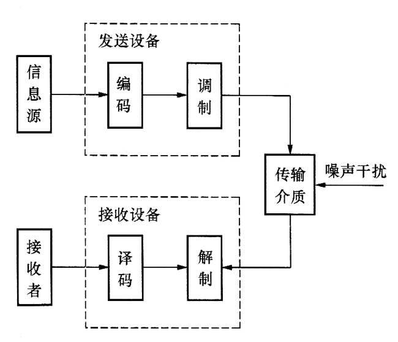
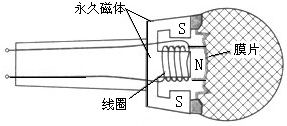
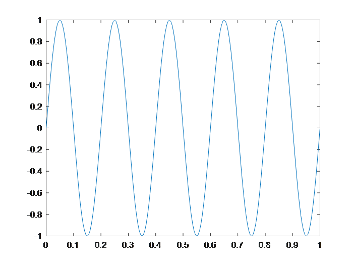
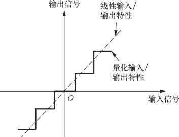
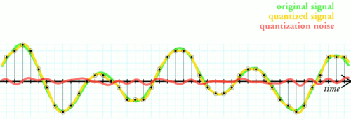
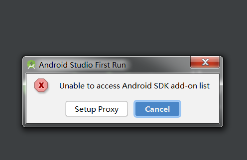

# 采样和量化

为了介绍清楚无线传输的基础以及在上面发展出来的各种技术，我们先来介绍无线通信的基本原理。无线通信的基本思想就是利用无线电磁波或者无线信号来调制和传输信息。比如最简单的场景中，我们可以产生一个固定频率的无线信号，通过有信号来代表1，没有信号来代表0，来传输信号。由于产生和控制无线电磁型号需要比较复杂的过程，要深入理解其中技术的奥妙，最好还能够实际动手试试。

现在市面上有能够让我们进行信号处理的设备，但是我觉得还可以做得更好，最好能够更加直观的让大家看到信号，更加直接的处理和分析信号。因此我计划在这一整套课程中，都利用我们的智能手机就能完成物联网传输通信和感知这一系列工作。利用声波信号来模拟无线信号，声波信号可以很方便的产生，利用普通的智能手机就能够产生、发射和接收声波信号，同时声波信号也易于处理，很好的可视化，同时声波信号的处理和大部分无线信号的处理过程都比较类似，有利于我们理解无线处理的过程。本课程后面的材料中如果没有特殊声明，都讲会使用声波信号来模拟物联网连接过程中的各种技术，请同学们也自己动手来多尝试一下。

在介绍声波信号的处理之前，我们先来理解一下声波信号的基本特征。一般来说，人可以听到的声波范围大概为20Hz到20KHz中间，因此现在大部分手机声音采样率为44100，对应到能够处理的最大声音频率为22KHz左右。超过20KHz的声波我们经常叫做超声波。

## 1. 声波的生成、发送和接收

这一部分对应了无线数据发送的时候的生成、发送和接收。在无线数据发送的过程中，这里每一部分都对应了很多的操作。我们先介绍声波的一些基本知识，然后通过声波的基本知识介绍数据发送和接收的过程。

对于一个最简单的声波信号，可以为一个简单的正弦信号，下图展示的一个频率为1KHz的正弦声波信号，大家可以用MATLAB的$sound()$函数将这段声音播放出来看看。


<center>
<div style="color:orange; border-bottom: 1px solid #d9d9d9;
display: inline-block;
color: #999;
padding: 2px;">图. 1KHz正弦声波信号信号</div>
</center>

为了产生这段声音，我们只需要在Matlab执行如下的操作并将文件保存下来就可以。

```matlab
Fs = 44100;                             % 采样频率
T = 4;                                  % 时间长度
n = Fs*T;                               % 采样点数
f = 1000;                               % 声音频率
y = sin(2*pi*f*T*linspace(0,1,n+1));    % 产生声音
sound(y,Fs)                             % 播放声音
audiowrite('sound.wav',y,Fs);           % 保存声音
```

声音是一种机械波，有物体的震动引起了空气的震动，从而能够传播声音。以上代码部分大部分功能都能够通过代码本身看出来意思，可以转化成任意的其他语言来实现。关于Matlab的主要语法，请大家自行学习。

日常生活中我们能看到的信号大部分都是模拟信号，我们能看到的风雨雷电，我们听到的声音，看到的图片等，要将这些信息存入到电脑中间，需要经过一系列的处理，其中有几个重要的步骤就是采样和量化。无线通信是无线电磁信号为基础的。我们在这一章节中为了方便理解，针对声音信号来进行研究。

## 2. 模拟信号到数字信号

这是信号处理中的关键一步，因为网络通信尤其是无线通信的时候，利用的都是物理信号（如电磁信号），因此通信过程中的重要一步就是将模拟信号转成数字信号。


<center>
<div style="color:orange; border-bottom: 1px solid #d9d9d9;
display: inline-block;
color: #999;
padding: 2px;">图. 通信过程</div>
</center>

如果真实存在着一个1KHz的声波信号，我们需要接收和处理这个信号的话，先要对信号进行采样和量化，这实际上也是所有计算机处理数据和信号的基础。计算机中将所有模拟信号转化为数字信号是通过采样和量化来实现的。具体来说，通过将模拟信号转化为电信号（通常为电压信号），然后通过将电压量化转成数字信号。在声音信号的处理中，我们首先依赖的是麦克风。麦克风能够将模拟的声音信号转化为电压信号，简单来说，麦克风上有一个可以随着声音振动而振动的薄膜，薄膜振动引起了产生电压的不断变化，因此电压的变化就代表了声音信号的变化。


<center>
<div style="color:orange; border-bottom: 1px solid #d9d9d9;
display: inline-block;
color: #999;
padding: 2px;">图. 麦克风原理</div>
</center>

不过大家要注意的是，这个时候电压信号依然是连续的，也就是说任意的电压值都是有可能的，很显然，这样大数据在电脑上是无法保存的，保存数据的大小是无穷大。为了保存这样的数据，我们先要对数据进行处理。第一个处理就是连续的信号转化为离散的信号。这一步是通过采样来实现的。采样是指计算机设备定时的对信号电压进行采集，采样解决了连续信号到离散信号的问题，可是采样后的电压值仍然没有办法直接保存，因为电压值在可能的取值范围内是连续的，为了解决这个问题，就需要量化。量化简单的来说就是将无限的连续的电压取值转化为有限的离散的电压取值，这样采样后的结果就能够保存。我们平时说的模拟/数字转换器（Analog to Digital Converter，即ADC，与之对应的是数/模转换器,即DAC）其实也就是干的这样的事情。

具体这个事情是怎么来实现的呢，我们首先通过简单的仿真实验来进行情况说明，然后我们再通过实际的信号让大家体会这一过程。假设存在一个正弦的声音信号，频率为5Hz，理想情况下这个信号是一个正弦波，这个信号在matlab下可以如下产生和画图出来。注意，matlab下产生的已经是离散的信号了。

```matlab
%% 信号的产生过程
%% 产生一个频率为1000、时长为1s的信号；
t = 0:1/200:1; % 1s内200个采样点
f = 5; % 频率f=5
y = sin(2*pi*f*t);
plot(t, y);
```


<center>
<div style="color:orange; border-bottom: 1px solid #d9d9d9;
display: inline-block;
color: #999;
padding: 2px;">图. 信号时域图</div>
</center>

注意这里面有几个小的问题，当我们将信号频率稍微做一些修改后，信号的时域图像就变成下图所示的样子

```matlab
%% 信号的产生过程
%% 产生一个频率为100、时长为1s的信号；
t = 0:1/200:1;  % 1s内200个采样点
f = 100;        % 频率f=100
y = sin(2*pi*f*t);
plot(t, y);
```


<center>
<div style="color:orange; border-bottom: 1px solid #d9d9d9;
display: inline-block;
color: #999;
padding: 2px;">图. 采样率不足</div>
</center>

注意这个图已经完全不是我们想象中的正弦图像了，大家想想看看这个是什么原因。

这里面有几个很有趣的问题，是不是连续的信号就无法用离散的信号表示出来，连续的信号是不是就得用无穷多的离散信号来表达？这里牵涉到了信号采样中的一个重要问题，我们将这个问题更加具体化，假设信号中的最大频率为f，那么应该以多大的采样频率对信号进行采样合理呢，显然不可能无限大的采样频率，这样在计算机上无法处理，实际上也非常不经济。这个问题也就变为信号的频率为f，那么最少的采样频率为多少。

奈奎斯特采样定律告诉我们，对于这样的情形，需要的采样频率为2*f。采样过程所应遵循的规律，又称取样定理、抽样定理。采样定理说明采样频率与信号频谱之间的关系，是连续信号的基本依据。

我们来看一个更加有意思的例子，如果信号的采样频率设置得不对会怎么样？

```matlab
%% 信号的产生过程
%% 产生一个频率为100、时长为1s的信号；
t = 0:1/10000:1;    % 1s内10000个采样点
f = 401;            % 频率f=401
y = sin(2*pi*f*t);
plot(t, y);
```

这个例子中，信号是400Hz的，理论上来说，信号是如下这个样子的：


<center>
<div style="color:orange; border-bottom: 1px solid #d9d9d9;
display: inline-block;
color: #999;
padding: 2px;">图. 400Hz信号</div>
</center>

```matlab
%% 信号的产生过程
%% 产生一个频率为100、时长为1s的信号；
t = 0:1/402:1;  % 1s内402个采样点
f = 401;        % 频率f=401
y = sin(2*pi*f*t);
plot(t, y);
```

大家可以先来想象一下这个采样出来的结果会是怎么样的。


<center>
<div style="color:orange; border-bottom: 1px solid #d9d9d9;
display: inline-block;
color: #999;
padding: 2px;">图. 低采样频率</div>
</center>

**思考：**

1. 为什么会出现这样的结果。
2. 如果频率为f，采样频率为fs，那么混叠后的频率将会是多少，这样会对通信产生什么影响。
3. 用于演示混叠现象的经典例子之一是所谓的“车轮效应”。在影片里当马车越走越快时，马车车轮似乎越走越慢，然后甚至朝反方向运转。为什么？

## 3. 量化

在数字信号处理领域，量化指将信号的连续取值（或者大量可能的离散取值）近似为有限多个（或较少的）离散值的过程。量化主要应用于从连续信号到数字信号的转换中。连续信号经过采样成为离散信号，离散信号经过量化即成为数字信号。注意离散信号通常情况下并不需要经过量化的过程，但可能在值域上并不离散，还是需要经过量化的过程 。信号的采样和量化通常都是由ADC实现的。

例如8位的ADC可以将标称输入电压范围内的模拟电压信号转换为8位的数字信号。

**思考：** 多少位不同的电压值？


<center>
<div style="color:orange; border-bottom: 1px solid #d9d9d9;
display: inline-block;
color: #999;
padding: 2px;">图. 量化效果图</div>
</center>

<!-- 
<center>
<div style="color:orange; border-bottom: 1px solid #d9d9d9;
display: inline-block;
color: #999;
padding: 2px;">图. 量化效果</div>
</center> -->

> The simplest way to quantize a signal is to choose the digital amplitude value closest to the original analog amplitude. This example shows the original analog signal (green), the quantized signal (black dots), the signal reconstructed from the quantized signal (yellow) and the difference between the original signal and the reconstructed signal (red). The difference between the original signal and the reconstructed signal is the quantization error and, in this simple quantization scheme, is a deterministic function of the input signal.

为了进一步说明量化的过程，这里以3 位(3 bit)的二进制数码进行量化的过程为例，如下图所示。


<center>
<div style="color:orange; border-bottom: 1px solid #d9d9d9;
display: inline-block;
color: #999;
padding: 2px;">图. 量化示意图</div>
</center>

上图中，输入信号是一个模拟信号，采样点为A～L，幅值范围为0～9，采样值、量化和编码的结果如下表所示。


<center>
<div style="color:orange; border-bottom: 1px solid #d9d9d9;
display: inline-block;
color: #999;
padding: 2px;">表. 采样值、 量化和编码的结果</div>
</center>

<!-- > ref: https://baijiahao.baidu.com/s?id=1614627981206121506&wfr=spider&for=pc -->

可见量化的过程中，输出的信号和原信号是有一定的区别的，这个区别就是量化噪声。我们通常说的高保真，其中有一个重要步骤采取足够多的量化位数，保证量化噪声足够小，量化出来的信号足够接近原始信号，当然其中带来的代价就是存储和处理的开销变大。大家可以去网易音乐上看看高保真音乐的，他后面以后一个码率，这一个码率跟量化是直接相关的。思考：大家想想那个码率都跟什么因素相关。

按照量化级的划分方式分，有均匀量化和非均匀量化。

**思考：** 为什么有这两种量化的方式？

- 均匀量化：ADC输入动态范围被均匀地划分为$2^n$份。

- 非均匀量化：ADC输入动态范围的划分不均匀，一般用类似指数的曲线进行量化。

非均匀量化是针对均匀量化提出的，因为一般的语音信号中，绝大部分是小幅度的信号，且人耳听觉遵循指数规律。为了保证关心的信号能够被更精确的还原，我们应该将更多的bit用于表示小信号。

**思考**：

假设要将最大频率为8KHz的唱歌的信号转成数字信号，量化bit为8bit，则产生的信号码率至少是多少？1min的信号大小是多少？

## 4. 声音的采样和量化

到了这里，我们来看一个真实的采样和量化的例子，这也是我们整个数据处理实验的开始。这个实验在手机上就能实现，我们来看看手机上如何进行声音的采样和量化。

在做实验之前，你需要准备好一个手机（安卓和苹果手机都可以），并配置好基本的开发环境，如果你还不太熟悉，参见 **3.1 Android平台搭建** 章节。

<!--  -->

实现3.1所展示的代码后，可以启动第一个声音记录的小程序。截取其中录制声音的关键代码，仔细看下面代码，其思想和大家学习过的网络传输的过程是类似的。

```java
 //文件输出流
OutputStream os = new FileOutputStream(file);
BufferedOutputStream bos = new BufferedOutputStream(os);
DataOutputStream dos = new DataOutputStream(bos);

//获取在当前采样和信道参数下，每次读取到的数据buffer的大小
bufferSize = AudioRecord.getMinBufferSize(SamplingRate, channelConfiguration, audioEncoding);
//建立audioRecord实例
AudioRecord audioRecord = new AudioRecord(MediaRecorder.AudioSource.MIC, SamplingRate, channelConfiguration, audioEncoding, bufferSize);

//设置用来承接从audiorecord实例中获取的原始数据的数组
byte[] buffer = new byte[bufferSize];
//启动audioRecord
audioRecord.startRecording();

//设置正在录音的参数isRecording为true
isRecording = true;
//只要isRecording为true就一直从audioRecord读出数据，并写入文件输出流。
//当停止按钮被按下，isRecording会变为false，循环停止
while (isRecording) {
    int bufferReadResult = audioRecord.read(buffer, 0, bufferSize);
    for (int i = 0; i < bufferReadResult; i++) {
            dos.write(buffer[i]);
    }
}
//停止audioRecord，关闭输出流
audioRecord.stop();
dos.close();
```

首先有一个ADC不断的将声音信号转化成为数字信号，这个数字信号是存储在一个buffer里面的，需要我们从buffer中将数据不断的读取出来然后保存成一定格式的声音信号。这个过程类似网络的数据处理，网络数据首先通过网卡的处理。网卡有一个很重要的功能就是将物理信号转化为数字信号。然后回忆一下在网络编程中（如果还没有实践过就想象一下实际电脑上网络功能的实现方法），我们需要将收到的数据从buffer中读取出来。这一个例子也展示了大多数ADC转化的功能，数据被转换并且保存在一个buffer中，然后对buffer中的数据进行处理。当然进一步来看的话，这个buffer中的数据如何处理也是有不同的手段的，有一些是需要轮询，不断的取看buffer中是否有数据，有一些是基于中断，一旦有数据就会产生一个中断通知进行数据处理，这两种处理方法都可以实现非阻塞模式，即用户无需在这个地方等待buffer内容。还有一种是阻塞模式，用户需要等待buffer内容，当buffer中有数据时才能够继续往下处理。几种模式各有优缺点，这也是数据处理中，尤其是通信和与硬件打交道的数据处理中经常要面临的问题。如果数据处理不及时，数据就会被覆盖导致丢失，这个问题在网络传输中也会遇到。

将数据读取出来之后，我们就有了采样和量化过后的数据，这才是真实计算机能够处理的数据，注意原始的声音我们是保存不下来的。

另外我们还想通过这一部分代码介绍几个重要概念，这也是平时大家在网络学习的过程中容易忽视的概念，因为网络学习中我们很难有机会从最底层开始接触到基础的信号处理。在启动录音的过程中，需要设置几个参数，第一个就是采样率，目前设置的是44100Hz（到前面看看这个采样率对实际恢复数据的影响，就理解为什么这个参数很重要了），能够将人耳能听到的声音和人说话的声音录下来（思考一下人耳能听到的声音和人说话的声音大概范围应该是多少）。一个是量化的bit位数，这里设置的是16位，即每一个采样点用16bit来量化。另外一个是声道数量，目前选择的是双声道，即有两路数据。声音编码的格式采用的是PCM格式，这也是一种最基础的声音编码方法。这个数据文件也是我们后面会要用到的数据的基础格式。

**思考：** 那么2.4GHz信号是否需要4.8GHz的采样频率，也就是意味着1s之内有4.8GHz的数据？

## 4. 参考文献

1. 《古今数学思想（第三册）》第28章
2. 《信号与系统（第二版）》第3、4、5章
3. 《离散时间信号处理（第三版）》第7章
