[TOC]

# 滤波

## 1. 滤波定义

在信号处理领域，“滤波”是最古老、也是最经典的话题之一。“滤波”最早出现在模拟电路系统，电子工程师使用模拟滤波器(Analog Filter)消除信号的异常波动，使信号更加平滑。而在计算机领域，我们讨论更多的是“数字滤波”，即对离散的采样信号进行滤波，达到消除特定频率信号分量的目的。本部分内容中不会对模拟滤波器来具体进行介绍，感兴趣的同学们可以自行查看相关的资料，想一想电容电感的特性，以及怎么利用电容电感电阻来处理信号。

数字滤波器脱胎于模拟滤波器，两者的目标是类似的，都是在信号处理的过程中消除某些频率的信号分量（如低频信号中的高频噪声）。但模拟滤波器的作用对象是连续信号，而数字滤波器处理的是离散的采样点，因此两者在具体实现上有很大的不同。模拟滤波器通常由电容、电感等模拟电子器件组成，主要依仗器件的物理特性实现滤波效果。而数字滤波器则由软件或者数字芯片实现，使用特定的算法对离散采样信号进行处理。在本文中，我们主要讨论数字滤波器的原理及实现方式。

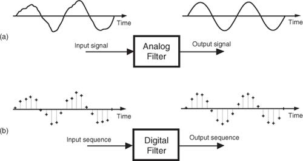
<center>
<div style="color:orange; border-bottom: 1px solid #d9d9d9;
display: inline-block;
color: #999;
padding: 2px;">图. 模拟滤波器与数字滤波器示意</div>
</center>

上图展示了模拟滤波器和数字滤波器效果示意，可以看到通过滤波处理后，原本因包含噪声而抖动的信号包络变得平滑。根据傅里叶变换之前的学习，我们知道任何信号都可以看作多个不同频率信号的叠加（时刻要牢记这一点，这对你理解信号非常重要，不管看到什么信号，你就理解为一系列不同频率的周期信号的叠加）。因此如果我们将输入信号看作低频的原始信号与高频噪声的叠加，则通过滤波器后，输入信号中的高频噪声被完全过滤了，在输出中只剩下低频的原始信号。由此可得到滤波器的作用：滤波器是指能够容许某些频率的信号分量通过，但减弱（或阻止）另一些频率分量的信号处理模块。

根据通过信号频率的不同，我们将滤波器分为低通、高通、带通和带阻四种类型（从名字上也能看出来几种滤波器的作用）：

- 低通滤波器：允许信号中的低频或直流分量通过，抑制高频分量或干扰和噪声。
- 高通滤波器：允许信号中的高频分量通过，抑制低频或直流分量。
- 带通滤波器：允许一定频段的信号通过，抑制低于或高于该频段的信号、干扰和噪声。
- 带阻滤波器：抑制一定频段内的信号，允许该频段以外的信号通过。

## 2. 简单低通滤波器

接下来，我们以一个简单的低通滤波器为例，说明滤波器的工作原理：

事实上，这个滤波器大家都用过，就是使用滑动窗口对输入的数据计算滑动平均。这是一个最简单的低通滤波器模型，以前我们都直观上知道这样的滑动平均滤波器能够滤掉毛刺，使数据更加平滑，看起来是起到了滤波的作用。我们结合着滑动滤波，

- [ ] 要思考两个问题：1）为什么滑动平均是滤波，为什么能够滤掉高频。2）滑动平均滤波的性能怎么样，还有没有比滑动平均更好的滤波方法。（这个地方要重点阐释清楚），从滑动滤波出发，以FFT频域时域为基础，解释清楚滤波这个事情，同时介绍好典型的滤波器及其特点。满足大部分需要使用滤波器的人的需求。

  

  考虑一组长度有限的非零输入，滤波器首先确定一个长度固定的滑动窗口。以下表中的数据为例，我们使用一个长度为5的滑动窗口，计算某桥梁在五分钟的跨度内，每分钟通过汽车数量的平均值。表格的第二列是每分钟实际通过汽车数，所以滑动平均操作就是从第5个数开始，计算这个数与其前4个数的平均值（如下表第三列的27），该平均值就是滑动平均算法的第一个输出。然后移动滑动窗口，计算下一个数与其前4个数的平均值（如下表第三列的第二个输出40.4）。以此类推，直至所有输入的数都参与过平均值计算。

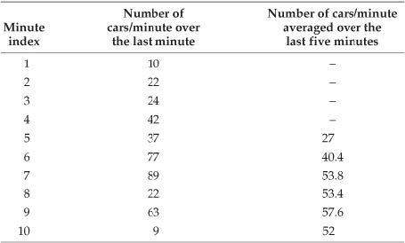
<center>
<div style="color:orange; border-bottom: 1px solid #d9d9d9;
display: inline-block;
color: #999;
padding: 2px;">图. 平均计算过程</div>
</center>

MATLAB提供了`movmean()`函数用于计算滑动平均：

`M = movmean(A,k)` 返回由局部 `k` 个数据点的均值组成的数组，其中每个均值是基于 `A` 的相邻元素的长度为 `k` 的移动窗口计算得出。当 `k` 为奇数时，窗口以当前位置的元素为中心。当 `k` 为偶数时，窗口以当前元素及其前一个元素为中心。当没有足够的元素填满窗口时，窗口将自动在端点处截断。当窗口被截断时，只根据窗口内的元素计算平均值。`M` 与 `A` 的大小相同。

`movmean()`的第`n`个输出对应的窗口默认以第`n`个输入为中心，我们也可以指定第`n`个窗口在输入序列中的具体位置。`M = movmean(A,[kb kf])` 通过长度为 `kb+kf+1` 的窗口计算均值，其中包括当前位置的元素、后面的 `kb` 个元素和前面的 `kf` 个元素。

```matlab
% computes a moving average by sliding a window of length len_win.
din = [10 22 24 42 37 77 89 22 63 9 0 0 0 0];
len_win = 5;
dout = movmean(din,len_win);
% the kth output uses the kth input as the center of the window
dout = dout(ceil(len_win/2):end);
disp(dout);
% Display the Result of Slide Average
figure; hold on
plot(len_win + (0:length(dout)-1),dout,'-o');
plot(1:length(din),din,'-o');
xlim([1 len_win+length(dout)-1]);
```

使用滑动窗口计算平均的结果如下图所示，在输入数据中原本存在许多突变的点，这些点在滑动平均操作后都变得更加平滑了。直观上看，考虑在时间序列中，突变的点对应高频的信号，因此滑动平均操作可以消除输入序列中的高频分量。通过滑动平均操作，我们实现了过滤高频分量、保留低频分量的目标，即实现了一个简单的低通滤波器。

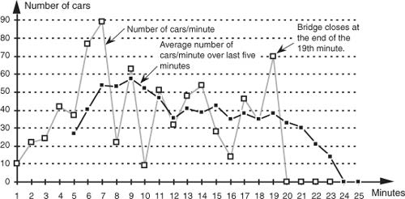
<center>
<div style="color:orange; border-bottom: 1px solid #d9d9d9;
display: inline-block;
color: #999;
padding: 2px;">图. 滑动窗口计算平均的结果</div>
</center>

在上面的这个例子中，直到输入前五个点后，滑动窗口才在**时刻5**输出了第一个滑动平均的结果，即

$$
y_{avg}(5) = \frac{1}{5}[x(1)+x(2)+x(3)+x(4)+x(5)]
$$

对于更一般的情况，**时刻n**的输出$y_{avg}(n)$，我们可以将其表示为：

$$
y_{avg}(n) = \frac{1}{5}[x(n-4)+x(n-3)+x(n-2)+x(n-1)+x(n)]=\frac{1}{5}\sum_{k=n-4}^{n}x(k)
$$

从上式可以看出，每个滑动窗口内的平均计算，可以理解为对窗口内所有输入值求和后再除以窗口长度（如下图所示）。

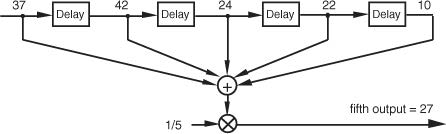
<center>
<div style="color:orange; border-bottom: 1px solid #d9d9d9;
display: inline-block;
color: #999;
padding: 2px;">图. 求和后平均</div>
</center>

如果我们根据乘法分配律，将乘系数的操作移到求和之前，在滑动窗口内的平均计算就变成了对输入数据的加权求和。只不过在这个例子中，所有输入的权重都是相同的（即$\frac{1}{5}$）。

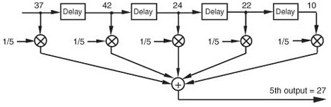
<center>
<div style="color:orange; border-bottom: 1px solid #d9d9d9;
display: inline-block;
color: #999;
padding: 2px;">图. 加权求和</div>
</center>

## 3. 加权平均滤波

在实际的滤波器中，对输入数据加权求和时，每个输入的权重并不一定都要相同，即我们可以为窗口中不同的数据指派不同的权重。如果我们用$h(k)$表示窗口中第k个输入$x(n-k)$的权重，则**时刻n**的输出$y(n)$可以表示为：

$$
y(n)=h(4)x(n-4)+h(3)x(n-3)+h(2)x(n-2)+h(1)x(n-1)+h(0)x(n)=\sum_{k=0}^4h(k)x(n-k)
$$

更一般的，如果我们使用的滑动窗口的长度为$M$，则时刻n的输出为：

$$
y(n)=\sum_{k=0}^{M}h(k)x(n-k)
$$

我们称上述加权的系数为滤波器系数（Filter Coefficients）。在后面的介绍中我们会了解到，正是滤波器系数$h(k)$和窗口长度$M$共同决定了滤波器的最终工作效果。接下来，我们先来看看我们通过滑动平均实现的低通滤波器实际工作效果究竟如何。

为了简化后面的计算过程，我们直接观察连续信号滑动平均的结果。设输入信号为$x(t)$，滑动窗口的长度为$T_w$，则对其进行滑动平均后输出$y(t)$可以表示为：

$$
y(t)=\frac{1}{T_{w}} \int_{t-T_{w} / 2}^{t+T_{w} / 2} x(t) d t
$$

对于初始条件为零的系统，其频率响应函数$H(\omega)$等于输出$y(t)$和输入$x(t)$的傅里叶变换结果$Y(\omega)$,$X(\omega)$之比，即

$$
H(\omega)=\frac{Y(\omega)}{X(\omega)}
$$

设输入函数$x(t) = cos(\omega t) = cos(2\pi ft)$，则$x(t)$傅里叶变换的结果$X(\omega)=FFT(x(t))=1$，而$y(t)$傅里叶变换的结果：

$$
Y(\omega)=\frac{\sin \omega T_{w} / 2}{\omega T_{w} / 2}=\frac{\left|\sin \pi f T_{w}\right|}{\pi f T_{w}}
$$

因此频率响应函数为：

$$
|H(\omega)|=\left|\frac{Y(\omega)}{X(\omega)}\right|=\frac{|Y(\omega)|}{1}=\frac{\left|\sin \omega T_{w} / 2\right|}{\omega T_{w} / 2}
$$

显然$H(\omega)$是一个sinc函数。接下来，我们来看看滑动平均滤波器的截止频率$f_{co}$是多少。

规定滤波器的截止增益为-3db，即衰减倍率为0.707，根据$sinc(x)$特性曲线，求解$sinc(x)=0.707$，可得$x = 1.3917$。代入到$H(w)$中，可得$x=\frac{\omega T_{w}}{2}=\pi f_{c o} T_{w}=1.3917$，即

$$
T_w = \frac{0.443}{f_{co}}
$$

其中$T_w$为平均宽度，采样率已知的情况下，$T_w$的大小取决于窗口中采样点的数量$T_w = \frac{N}{f_s}$。由此，滑动平均滤波的点数与截止频率之间的关系可以表达为：

$$
f_{co} = 0.443\times \frac{f_s}{N}
$$

<!-- MATLAB仿真，观察滑动平均滤波的脉冲响应 -->
我们还可以使用MATLAB仿真，观察滑动平均滤波器的脉冲响应。理想情况下，脉冲信号包含所有频率的谐波分量，因此我们使用滑动平均滤波器对脉冲信号进行滤波，然后对滤波器的输出做傅里叶变换，在频域上观察滤波器的滤波效果：

```matlab
%% 滑动平均滤波的脉冲响应
% 构造单位脉冲信号
din = zeros(1,1e4);
din(5e3) = 1;
figure;plot(din);
% 脉冲信号包含所有频率的谐波分量
z = fft(din,100*length(din));
figure;
    plot(abs(z));
% 使用滑动平均滤波器对脉冲信号滤波
len_win = 5;
dout = movmean(din,len_win);
% 对滤波后结果做傅里叶变换，在频域上观察滤波效果
z = fft(dout,100*length(dout));
hold on
    plot(abs(z));
% 调整滑动窗口的大小
len_win = 15;
dout = movmean(din,len_win);
z = fft(dout,100*length(dout));
    plot(abs(z));
xlabel('Frequency');
ylabel('abs. FFT');
grid on;
grid minor
box on
```


<center>
<div style="color:orange; border-bottom: 1px solid #d9d9d9;
display: inline-block;
color: #999;
padding: 2px;">图. 不同窗口长度下，滑动平均滤波器的脉冲响应</div>
</center>

通过滑动平均滤波，低频信号分量被保留下来，而高频分量得到了有效的抑制。由于滤波保留的低频信号包含正频率和负频率，而绘图时只绘制了$[0,f_s]$部分的频谱，因此波峰在图中被分成了两半。

**(FIR的脉冲响应就是它的滤波器系数)**

到现在，我们已经知道滤波器的基本工作方式，是使用滑动窗口对输入信号依次加权求，窗口的大小以及滤波器系数直接决定最终的滤波效果。现在的问题是，给定滤波要求，对任意一组输入，我们要如何确定窗口长度$M$和滤波器系数$h(k)$？

仔细观察滑动窗口内加权求和的计算操作，我们可以发现上述求和过程实际上是输入向量$x(n)$与系数向量$h(k)$的卷积！即：

$$
y(n)=\sum_{k=0}^{M}h(k)x(n-k)=h(k)*x(n)
$$

这一发现有很重要的意义！因为我们知道对于傅里叶变换和逆傅里叶变换这一类线性系统，在一个域上的卷积等于变换到另一个域上的点乘。

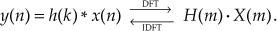

因此，令时域信号与滤波器系数做卷积，其效果等价于：使用滤波器系数$h(n)$做DFT的结果$H(m)$，在频域上直接与目标信号做点乘滤波。理想情况下，我们希望$H(m)$在我们希望的频率处值为$1$，而在我们希望过滤掉的频率处值为$0$。而实际上，我们在上面例子中所描述的简单低通滤波器与理想情况相距甚远。回想一下，我们在上文所描述的滤波器，使用一个长度为5的滑动窗口，滤波器系数全部设为$\frac{1}{5}$，即$h(k)=[\frac{1}{5} \frac{1}{5} \frac{1}{5} \frac{1}{5} \frac{1}{5}]$。对这样一个系数向量做DFT，显然我们将在频域上得到一个以频率0为中心、由一个主瓣和若干旁瓣共同组成的类sinc波（如下图实线所示），这与我们期望的理想滤波器（虚线所示）相差甚远。

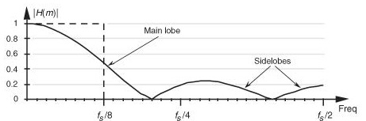
<center>
<div style="color:orange; border-bottom: 1px solid #d9d9d9;
display: inline-block;
color: #999;
padding: 2px;">图. 滑动平均在频域上的效果</div>
</center>

这样的低通滤波器，显然无法完全消除所有高于频率阈值的信号分量，同时也会导致低于阈值的有效信号发生变形。

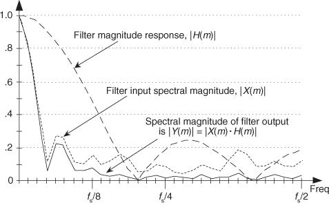
<center>
<div style="color:orange; border-bottom: 1px solid #d9d9d9;
display: inline-block;
color: #999;
padding: 2px;">图. 非完美滤波器效果</div>
</center>

上图可以看到，由于窗口长度和滤波器系数选择的不合理（全部都是$\frac{1}{5}$），简单低通滤波器的滤波效果并不理想。那么，我们要如何确定窗口长度$M$和滤波器系数$h(k)$，使得滤波器的效果尽可能好呢？

一个直观的想法是先在频域上构造理想波形，即构造频域上的矩形波，在目标频率范围为1，其他频率处为0。然后对频域构造的结果做逆傅里叶变换，得到我们想要的滤波器系数。但这个想法要付诸实际，还面临着一个挑战：频域上，理想滤波器在除目标频率范围外的所有频率处都为0，因此其长度为无限长，经过逆傅里叶变换后，得到时域的滤波器系数也将会是无限长的。但考虑到实际信号处理中使用的都是有限长度信号，因此理想滤波器在实际中无法实现。

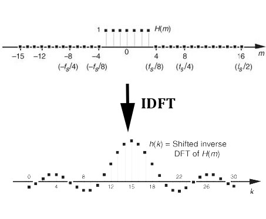
<center>
<div style="color:orange; border-bottom: 1px solid #d9d9d9;
display: inline-block;
color: #999;
padding: 2px;">图. 理想低通滤波器要求无限长度的滤波器系数向量</div>
</center>

在继续介绍滤波器实现之前，我们先来明确一组等价的概念：滤波器长度=滑动窗口长度=滤波抽头长度=滤波器系数向量长度，这几个看似不同的说法经常出现在各种与滤波器相关的资料中，但他们所表达的含义是一样的。给定一组真实信号输入，显然滤波器的长度是有限的。且考虑长度为n的滤波器会抽除输入信号头部n个数据点，因此滤波器长度应该要远小于输入信号的长度。

实际滤波时，我们通常对理想滤波器逆傅里叶变换截取一段有限长度的结果，用作滤波器系数。如下图所示，随着滤波器系数长度的增加，其傅里叶变换的结果约接近理想滤波器。同时，我们也发现DFT结果中，接近频率阈值处存在振幅抖动，这就是我们常说的吉布斯效应。为了消除吉布斯效应，并使通频带外信号得到更好的抑制，学者们提出了许多不同的加窗策略，这又是另一个非常有趣的主题，有兴趣的同学可以在课后自行了解。

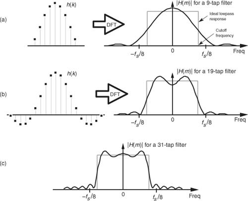
<center>
<div style="color:orange; border-bottom: 1px solid #d9d9d9;
display: inline-block;
color: #999;
padding: 2px;">图. 不同窗口长度</div>
</center>

<!-- 滤波器（Filter），顾名思义，是对波进行过滤的器件。广义上，任何对信号中特定频率做出改变的系统都可以称之为滤波器，因而滤波器有着极为丰富的含义，从Wikipedia上涉及各领域的长长的滤波器词条列表可窥见一斑。

下文所讨论的滤波器将限于信号处理领域。 -->

除了上面介绍的简单滤波器之外，滤波器有很多不同的种类。现有对滤波器的分类有很多重叠，因此很难对滤波器进行简单的层次分类。各种不同的角度包括：

- 线性或非线性
- 时变或时不变
- 因果或非因果
- 模拟或数字
- 离散或连续
- 有限脉冲响应类型（FIR）或者无限脉冲响应类型（IIR）
- ...

在信号处理中，通常情况下滤波器用于选择/去除一些频率/频段，因此可以认为是一个频率选择器。按所通过信号的频段不同，信号处理常用的滤波器可以分为低通、高通、带通和带阻滤波器：

- 低通滤波器（low-pass filter, LPF）：它允许信号中的低频或直流分量通过，抑制高频分量或干扰和噪声。
- 高通滤波器（high-pass filter, HPF）：它允许信号中的高频分量通过，抑制低频或直流分量。
- 带通滤波器（band-pass filter, BPF）：它允许一定频段的信号通过，抑制低于或高于该频段的信号、干扰和噪声。
- 带阻滤波器（band-stop filter, BSF）：它抑制一定频段内的信号，允许该频段以外的信号通过。

<!-- 一个理想滤波器可让某一频带的信号完全通过，并将其余频率范围的信号完全滤除，其中信号完全通过的频率范围称为通带(passband)，而信号完全滤除的频率范围称为阻带(stopband)。理想的滤波器在通带增益为1阻带增益为0。非理想滤波器在通带与阻带之间无法瞬间切换，其衰减程度(增益)随频率连续变化，因此有过渡带(transition band)的存在，而且阻带的增益也无法达到0。


 -->

最后，请大家利用MATLAB自带的`filter()`函数，尝试对输入信号进行滤波：

```matlab
fs = 100; % sampling frequency
t = 0:1/fs:1;
x = sin(2*pi*4*t);
y = awgn(x, 10, 'measured'); % snr = 10dB

windowSize = 5;
b = (1/windowSize)*ones(1,windowSize);
a = 1;
z = filter(b,a,y);

plot(t, [y; z]);
legend('Input Data','Filtered Data')
```

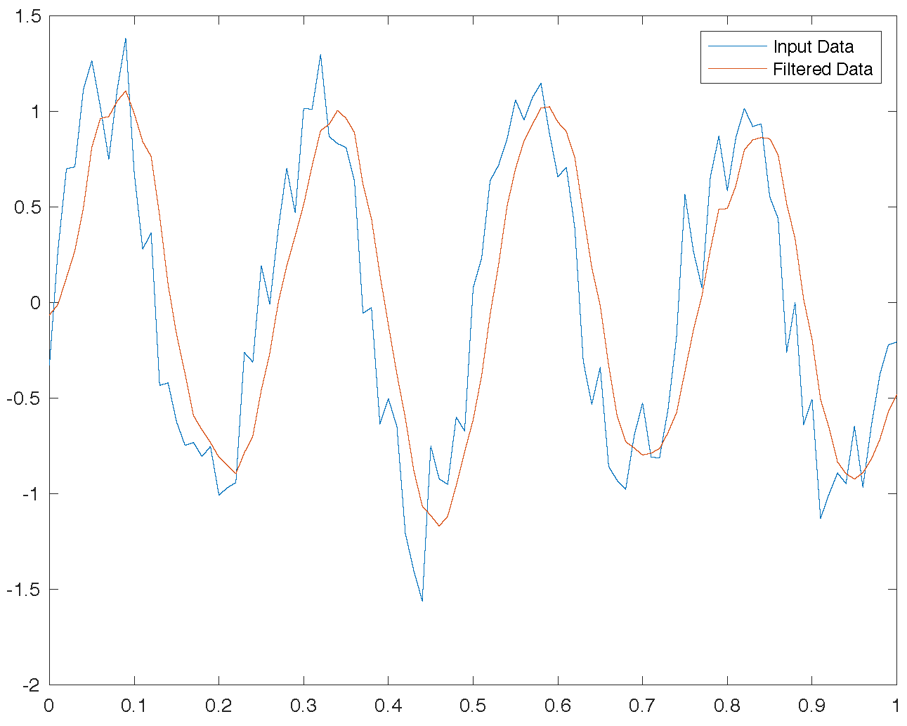
<center>
<div style="color:orange; border-bottom: 1px solid #d9d9d9;
display: inline-block;
color: #999;
padding: 2px;">图. MATLAB低通滤波效果</div>
</center>

**思考**

1. 移动平均计算看似简单，但是却是一个十分耗时的计算，尤其平均点数较多后格外明显。请思考是否有办法提高移动平均计算的效率？
2. 如何在低通滤波器的基础上，实现高通滤波器、带通滤波器、带阻滤波器？

## 4. 参考文献

1. [Wikipedia/Filter](https://en.wikipedia.org/wiki/Filter)
2. [Wikipedia/Filter_(signal_processing)](https://en.wikipedia.org/wiki/Filter_(signal_processing))
3. [百度百科/相干带宽](https://baike.baidu.com/item/相干带宽)
4. [百度百科/滤波器](https://baike.baidu.com/item/滤波器)
5. Understanding Digital Signal Processing, Third Edition, Richard G. Lyons, Pearson Education
6. 滑动平均滤波的截止频率与平均点数计算, https://www.cnblogs.com/pingwen/p/6670675.html
