# Wi-Fi 感知

## 1. 简介

  Wi-Fi雷达系统2.0是一款用于无线感知的科研与教学平台，其包含信号分析与人体移动检测两个部分。信号分析模块可以帮助科研人员和学生实时采集、观察、记录无线信号特征（CSI与RSSI），从而发现影响信号变化的因素，促进创新研究与应用；人体移动检测作为无线感知的一个典型应用，可以帮助学生了解和学习WiFi雷达技术的应用，启发学生创新性思维。 

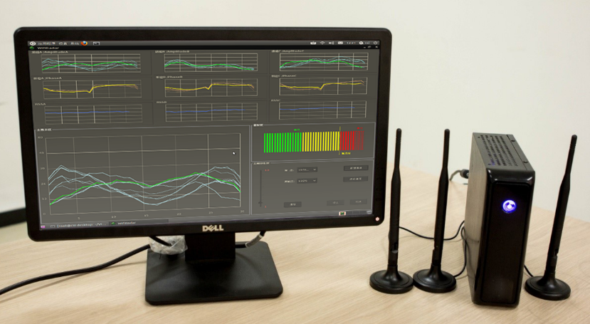

图. Wi-Fi雷达系统与界面

  Wi-Fi雷达2.0在WiFi雷达1.0的基础上增加了CSI相位处理模块，可以提供鲁棒的CSI相位信息；支持显示全部三根天线的CSI信息；支持实时控制采样频率；支持在多台接收机上进行远程分布式环境感知实验。

## 2. 系统环境与程序启动

  Wi-Fi雷达系统由后台程序（数据产生和发送）和前台程序（数据显示与采集）两部分组成。后台程序需要运行在装有发射天线的微型计算机上。前台程序需要运行在任何装有java虚拟机并且与微型计算机在同一局域网内的设备上。以下将详细叙述启动系统的全部流程。

### 启动后台程序

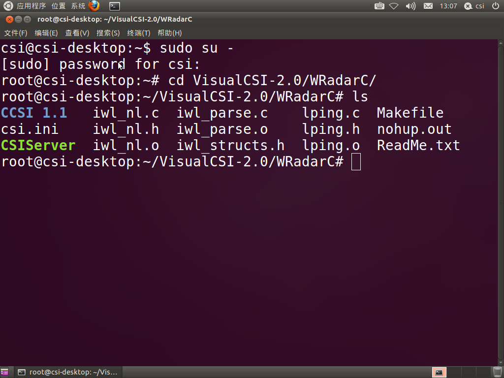 

图 2. 系统运行命令

1. 打开系统终端

2. 切换到root权限  

      `$su root`

3. 输入系统密码： **123456**

4. 进入VisualCSI—2.0/WRadarC目录

    `$cd Desktop/VisualCSI-2.0/WRadarC`

5. 配置系统参数

    `$vi csi.ini` 

6. 运行后台程序

    `$./CSIServer`  

* * *

##### 注：csi.ini 文件内容解释

  PingMS=1000      //ICMP数据包发送时间间隔，以毫秒为单位

  Packets=0        //发送ICMP数据包个数，如果为零则表示无穷多

  APIP=192.168.1.1    //连接的AP地址

  FrontIP=192.168.1.105  //前台界面的IP地址(先用ifconfig查看地址)  

* * *

### 启动前台程序

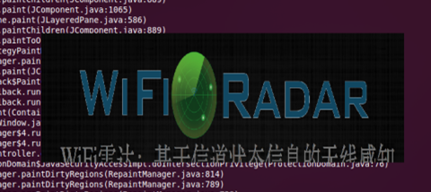

图 3. 系统启动界面

1. 进入VisualCSI-2.0文件夹

    `$cd Desktop/VisualCSI-2.0/` 

2. 运行VisualCSI.jar程序

    `$java -jar VisualCSI.jar`  

  此时会看到弹出VisualCSI启动窗口“WIFI Radar”界面，如图3。 

## 实时可视化系统使用说明

  WiFi雷达数据实时可视化显示子系统可以分为两个部分：

    1. 信号特征实时管理

    2. 人体检测警报

  其中信号特征包含物理层的信道状态信息（CSI）和链路层的无线信号强度（RSS）。同时我们将WiFi雷达的前端程序分成如图4所示的7个功能区。下文将会按顺序依次介绍每个功能区的设计意图和使用方法。

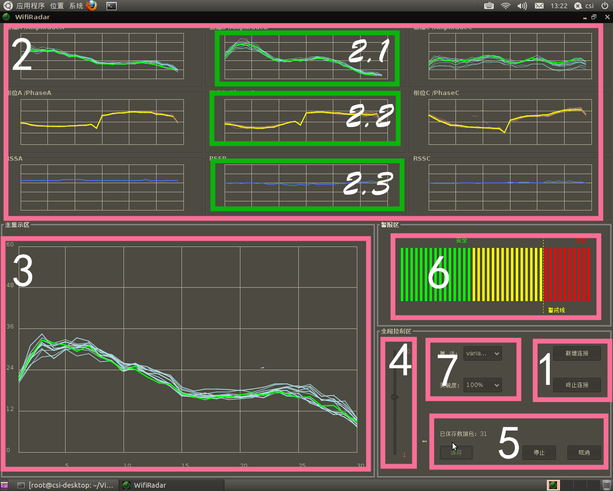

图 4. Wi-Fi雷达系统界面

### 信号特征实时管理

#### 新建连接（框1）

1.  点击右下角的“新建连接”，弹出“新建连接”对话框。
2.  “服务器IP地址”中填写运行后台程序的设备IP地址（miniPC的无线IP地址）。
3.  “本机IP地址”中填写运行前台程序的设备IP地址。**（目前有bug，两个地址请都输入ifconfig显示的apip）**
4.  点击“确定”，进入运行界面，如图5所示。

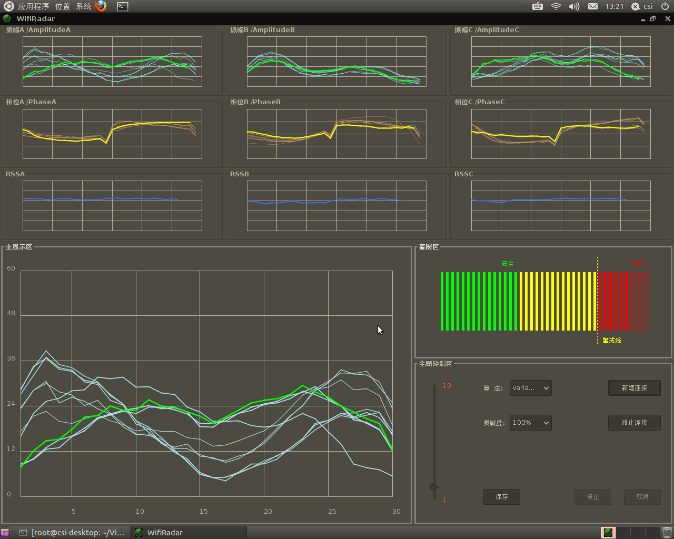

图 5. 连接成功后运行时画面

#### 信号特征实时显示（框2）

1.  图4中框2内从左到右三列小窗口分别为三根不同接收天线A、B和C的无线信道信息。
2.  其中每一列中从上到下三个小窗口（例如图4中2.1、2.2和2.3框）分别实时显示该天线的振幅值，相位和RSS值。
3.  CSIAm和CSIPh窗口中横坐标是30个不同频率的子载波，纵坐标是相应子载波幅度/相位。在本程序中我们设置固定时间窗为10，即保留最近的10组CSI数据用以构成CSI矩阵，也即窗口内同时显示最近10个CSI向量值，线条最粗，亮度最高的一条表示最新的CSI子载波向量；线条较细、亮度较低的则表示同一时间窗内的历史数据。
4.  RSSI窗口的横坐标是时间，纵坐标是RSSI值。用户可以通过观察RSSI值在窗口内的游动情况获知无线信号能量变化。

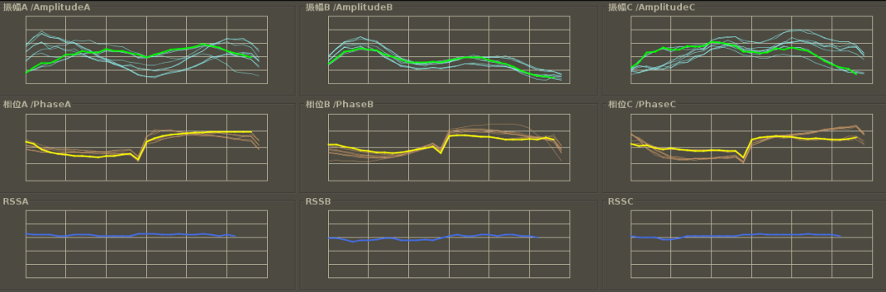

图 6. 信号特征显示区

#### 信号特征放大显示（框3）

  点击框2中每个小窗口，该窗口内的信号特征信息便会在框3显示区中放大显示(如图7所示)。用户可以更加清晰地、实时地观测每个子载波或者时刻信号特征信息变化情况。

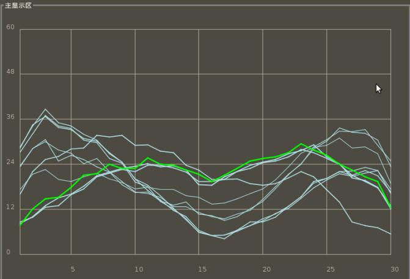

图 7. 信号放大显示区

#### 发包频率调节（框4）

1.  滑动图4框4中的频率调节杆，可以调节后台程序ICMP发包速率。以满足用户观察不同频率下信号特征变化的使用需求。
2.  如图8所示，频率调节杆的数值可调节范围为1~10，分别对应发包频率1Hz~10Hz。

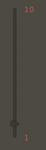

图 8. 频率调节区

#### 保存数据（框5）

1.  3.2和3.3中描述的功能虽然可以让用户实时观测信号特征变化情况，进行直观、定性的变化监测，但是但是对于数据的深度分析和定量计算则显得力不从心。为此图4中框5区域提供了信号特征数据保存功能（如图9所示）。

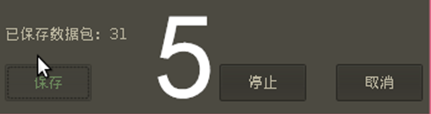

图 9. 信号数据保存

2.  在建立好连接的基础上，点击保存按钮，则前台程序开始记录数据。同时保存按钮上方实时显示已经记录下的数据包的数量。此时，系统从已连接状态转移到正在保存状态。
3.  当已保存的数据包足以满足实验需求的数量时，点击停止按钮，则本次数据保存操作结束，相应数据会保存到VisualCSI-2.0/data目录下，并以当前时间为规则自动命名。同时系统从正在保存状态回归到已连接状态。需注意如果仅仅点击保存而没有在适当时间停止保存，则本次保存的数据无法成功写入文件。
4.  如果在保存的过程中，由于各种原因希望抛弃本次数据，可以点击取消按钮，结束本次保存操作并回到普通的已连接状态。
5.  保存的数据文件每一行存储着三根接受天线上的CSI信息和RSS信息，其格式如下：

<table>
   <tbody><tr>
      <td>天线1</td>
      <td>天线2</td>
      <td>天线3</td>
      <td colspan="2">天线1，子载波1</td>
      <td colspan="2">天线1，子载波2</td>
      <td>…</td>
      <td colspan="2">天线i，子载波j</td>
      <td>…</td>
      <td colspan="2">天线3，子载波30</td>
   </tr>
   <tr>
      <td>RSS</td>
      <td>RSS</td>
      <td>RSS</td>
      <td>实部</td>
      <td>虚部</td>
      <td>实部</td>
      <td>虚部</td>
      <td></td>
      <td>实部</td>
      <td>虚部</td>
      <td></td>
      <td>实部</td>
      <td>虚部</td>
   </tr>
</tbody></table>

### 人体检测报警

  人体检测警报功能包括：警报指示区和检测参数选择。

#### 警报指示区（框6）

  3.2和3.3中描述的功能虽然可以让用户实时观测信号特征变化情况，进行直观、定性的变化分析，但是如果需要对数据进行深度分析和定量计算则不能仅仅依赖上述功能区。

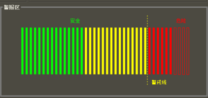

图 10. 警报指示区

	如图4中框6所示，警报指示区分为是三个界别：安全（绿色）、预警（黄色）、警报（红色）。当环境中无人存在的时候或环境十分平稳、无人移动时，指示水平将会处于安全水平；当环境中有细微异动则指示水平将会达到预警水平，该状态需要引起管理人员的注意，但并不能明确说明有人体在检测区域内移动，很可能是环境噪音或者移动物体在检测边缘移动。当指示水平突破警戒线时则说明确实有人在检测区域内移动，此刻系统进行异常报警（如图10所示）。当移动人体离开检测区域后，指示水平将回到警报水平以下。

#### 检测参数选择（框7）

  本系统集成了两种人体检测算法，即基于信号振幅值方差和基于振幅均值的人体检测技术。老师和学生可以在框7中进行不同的算法选择，以观测不同算法下人体检测性能。对于基于CSI的人体检测，高检测率意味着检测系统对环境变化很敏感，检测区域相对较广。为了降低检测系统敏感度，控制检测区域范围与消除不必要的误报情况，满足不同的应用需求，用户可以选择不同的检测率，系统会根据用户的选择自动调整检测阈值。

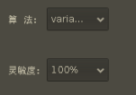

图 11. 检测算法控制区

## 算法设计与应用实例

  下面以人员发现与定位作为典型应用，帮助老师和学生理解WiFi雷达系统的使用。人员发现可用于安防系统，对非法人员的入侵采取报警或其它相应措施。本例仅用于演示如何使用本系统来实现简易的人员发现功能。该演示算法过于简单，在准确性和鲁棒性上都存在提高空间。使用者应当基于系统提供的CSI数据，自行设计算法，以实现特定的功能。

  原始数据采集后，首先需要将其处理成实验所需的格式。就本实验而言，需要从复数形式的CSI信息中提取出信号的幅度与相位，作为CSI数据的特征值。30组实部与虚部对应了30个CSI值，因此在处理过后可以分别得到30个幅度与30个相位。

  为了观察时域上的信号变化情况，WiFi雷达采用振幅方差信息来判断周围环境状态的稳定性，从而实现人员发现。WiFi雷达在完成数据处理后，将数据包的载波振幅存入缓冲区（时间窗口）中。缓冲区被设置为存放30个数据包的信息。缓冲区内的载波振幅信息可以用一个30*30的矩阵进行表示，如图12所示。

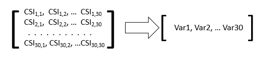

图 12. CSI矩阵计算方差示意图

然后系统会从矩阵中的每一列求出各个载波振幅的方差，得到一段时间内的表征信号波动程度的30维方差向量，如图12所示。当室内处于无人的状态时，理想状况下该向量应该趋于0向量，而当有人进入时，由于CSI信号发生较大的波动，各个载波的方差也会出现较大的变化。一旦系统检测到在某段时间内载波方差出现连续的较大波动，就会认为有入侵者闯入。

  由于受环境噪音的影响，载波方差在无人的情况并非为零，且方差波动较大。为了消除环境噪音对于人体检测的干扰，WiFi雷达采用如下机制：以t为时间窗口，取t与t+1相邻前后两次的方差，通过数学方法找到衡量前后两次方差差别的数值，该值可以表征方差的稳定性。在本算法中，采取的是两次方差之间的欧氏距离。理论上，当相邻的CSI信息很稳定时，I值结果应改为0，当I值数值越大，说明两次CSI信息波动越大。

  接下来通过实际试验，可得到表征CSI稳定程度的I值在不同状况下的取值范围。Wi-Fi雷达系统大致可以将I值区间划分为三个波动范围，来表征室内的不同安全程度。

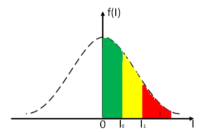

图 13. 静态环境下I值概率密度分布曲线

  如图13所示，当房间中无人时，受残余噪音影响，I值的概率密度曲线近似呈高斯分布。当I值处于图中绿色部分时，房间可以被认为处于绝对安全状态；图中的黄色部分，可以被认为是一个警告范围（I0~I1），或是不可预测的噪音影响或轻微异动的影响，此刻房间中的情况需要引起重视；而当房间中有人运动时，I值将超越红色预警阈值I1，此刻WiFi雷达系统将发出入侵警报。

  针对不同的实际情况，I值的警戒值（I0、I1）需要进行不同的定义，这种对阈值的可调整设计主要是考虑到不同安全需求等级的室内需要的程序灵敏度不同。否则如果仅有相同的一组阈值设置，在环境噪声本身较大或者安全需求等级较低的实验环境中很容易出现误报或者漏报的情况，给实验操作带来不便。

  因此Wi-Fi雷达设计了逐渐升高的三种阈值，用来代表逐渐降低的三种灵敏度。这样在不同的环境中，用户可以灵活选择适合自己需求的检测性能。

  以上就是基于振幅方差的WiFi雷达人体移动检测算法设计与实现过程。老师和同学可以参考以上分析和设计方法来分别实现具有创新性的室内Wi-Fi雷达人体检测和定位算法。  

## 注：

本实验平台中所有密码均设置为**123456** 

**转载自：http://tns.thss.tsinghua.edu.cn/wifiradar/wifiradar.html**