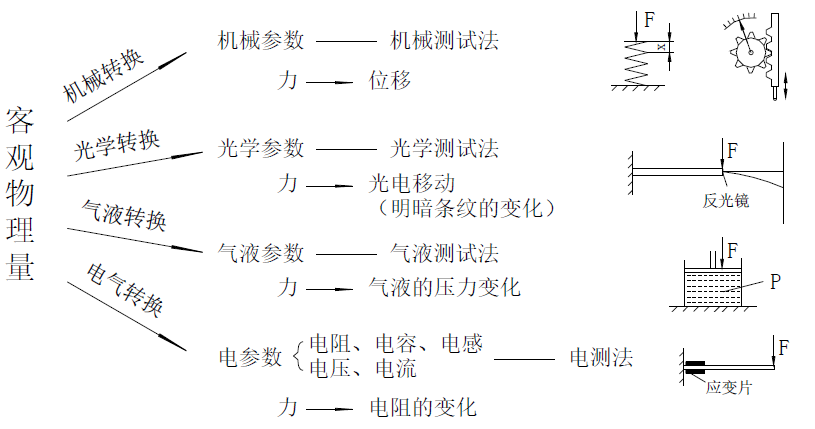
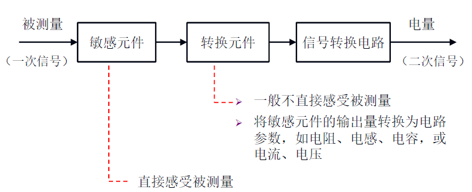
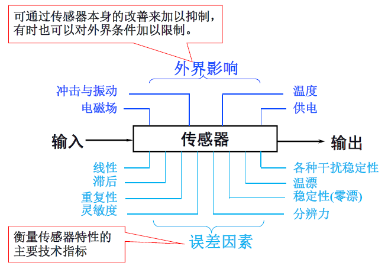

# 物联网传感器感知准备

## 1. 感知技术基本概念

物联网感知技术是利用传感器元件，将外界环境刺激转化为可被存储和传输的信息数据的技术。

物联网传感技术的核心是传感器，根据国家标准（GB7665-2005 ）的定义：传感器是指能够感受规定的被测量并按照一定规律转换成可用输出信号的器件或装置。传感器通常具有以下四个方面的特征：

1. 传感器是测量装置，能完成检测任务
2. 输入量是某一被测量，可能是物理量、化学量、生物量等
3. 输出量是某一物理量，这种量要便于传输、转换、处理、显示等等，这种量可以是气、光、电等物理量，但主要是电物理量
4. 输出输入有对应关系，且应有一定的精确程度。

传感器的本质是感受被测量的信息，并将感受到的信息，按一定规律变换成为电信号或其他所需形式的信息输出，以满足信息的传输、处理、存储、显示、记录和控制等要求。以力的测量为例，物体受到的力即为一种典型的客观物理量，它无法被直接观测或记录。因此，需要通过转换技术，变换为可被测量和记录的值。

图. 客观物理量转换

如上图所示，通过机械转换，物体表面压力可以被转化为位移量，后者可以由标尺轻易地测量出来。同理，通过光学、气液或电气转换，压力也可以被转化为光电移动、气液压力和电阻等量，从而被测量和记录。

## 2. 传感器组成

如下图所示，传感器一般由敏感元件、转换元件、信号转换电路三部分组成。其中敏感元件是指直接感受测量信息，并输出与被测量信息成确定关系的某一物理量的元件；转换元件是指以敏感元件的输出为输入，把输入数据转化为电路信息的元件。

图. 传感器组成

传感器的分类方法有很多，下面介绍几种常见的分类方法：

根据**输入物理量**分为：压力传感器、温湿度传感器、位移传感器、加速度传感器等。

根据**工作原理**分为：电阻式传感器、电容式传感器、电感式传感器、磁电式传感器、压电式传感器、光电式传感器等。

根据**输出信号的性质**分为：模拟式传感器和数字式传感器。

具体的分类说明及例子如下图所示：

图. 传感器分类

## 3. 传感器基本特性

传感器特性主要是指输出与输入之间的关系：

- 当输入量为常量，或变化极慢时，这一关系称为静态特性；
- 当输入量随时间较快地变化时，这一关系称为动态特性。

传感器输出与输入关系可用微分方程来描述。理论上，将微分方程中的一阶及以上的微分项取为零时，即得到静态特性。因此，传感器的静态特性只是动态特性的一个特例。

此外，根据影响因素不同，传感器的特性还可以分为内部特性和外部特性，前者主要体现为传感器的误差特性，是衡量传感器好坏的主要指标；后者体现为传感器对外界影响的敏感程度。

图. 传感器的误差因素和外界影响

## 4. 传感器的技术性能指标

现在我们已经了解了传感器的基本功能、组成原理以及传感器的基本功能特性。那么，对于特定的一个传感器，我们该如何评价它的优劣以及性能呢？

通常来说，任意一个传感器都具有量程、灵敏度、精度等基本指标，具有不同参数的传感器适用于不同的应用场景，用户应该根据需求选择合适的传感器参数。除基本参数外，传感器还具有环境参数指标、可靠性指标和其他指标，这些指标体现了传感器受环境的影响程度及工作可靠性。对传感器各项技术性能指标的具体说明如下图所示：

图. 传感器的技术性能指标

## 5. 传感器技术的发展方向

**(1) 发现新现象，开发新材料**
传感器的工作机理是基于各种效应和定律，由此启发人们进一步探索具有新效应的敏感功能材料，并以此研制出具有新原理的新型物性型传感器件，这是发展高性能、多功能、低成本和小型化传感器的重要途径。

结构型传感器发展得较早，目前日趋成熟。结构型传感器，一般说它的结构复杂，体积偏大，价格偏高。物性型传感器大致与之相反，具有不少诱人的优点，加之过去发展也不够。世界各国都在物性型传感器方面投入大量人力、物力加强研究，从而使它成为一个值得注意的发展动向。

传感器材料是传感器技术的重要基础，由于材料科学的进步，人们在制造时，可任意控制它们的成分，从而设计制造出用于各种传感器的功能材料。用复杂材料来制造性能更加良好的传感器是今后的发展方向之一。目前使用的新型传感器材料主要包括：（1）半导体敏感材料（2）陶瓷材料（3）磁性材料（4）智能材料等几大类。

**(2) 集成化、微型化、多功能化**
为同时测量几种不同被测参数，可将几种不同的传感器元件复合在一起，作成集成块。例如一种温、气、湿三功能陶瓷传感器已经研制成功。

把多个功能不同的传感元件集成在一起，除可同时进行多种参数的测量外，还可对这些参数的测量结果进行综合处理和评价，可反映出被测系统的整体状态。

同一功能的多元件并列化，即将同一类型的单个传感元件用集成工艺在同一平面上排列起来，如CCD图像传感器。多功能一体化，即将传感器与放大、运算以及温度补偿等环节一体化，组装成一个器件。

**(3) 仿生传感器**
生物传感器系统亦称生物芯片，它是继大规模集成电路之后的又一次具有深远意义的科技革命。生物芯片的效率可能是传统检测手段的成百、上千倍。

生物芯片不仅能模拟人的嗅觉（如电子鼻）、视觉（如电子眼）、听觉、味觉、触觉等，还能实现某些动物的特异功能（例如海豚的声纳导航测距，蝙蝠的超声波定位，犬类极灵敏的嗅觉，信鸽的方向识别，昆虫的复眼）

**(4)智能传感器（smart sensor）**
智能传感器指具有判断能力、学习能力的传感器。它事实上是一种带微处理器的传感器，具有检测、判断和信息处理功能。

**(5) 无线网络化（wireless networked）**
网络传感器是包含数字传感器、网络接口和处理单元的新一代智能传感器。一个典型无线传感网节点的工作过程如下：

被测模拟量→传感器→数字化→微处理器→测量结果→网络

无线传感器网络的主要组成部分就是一个个的传感器节点。每一个节点都是一个可以进行快速运算的微型计算机，它们将传感器收集到的信息转化成为数字信号，进行编码，然后通过节点与节点之间自行建立的无线网络发送给具有更大处理能力的服务器。

通过无线传感网，可实现各传感器之间、传感器与执行器之间、传感器与系统之间的数据交换及资源共享，在更换传感器时无须进行标定和校准，最终做到“即插即用”。

## 6. 参考文献

- 赵燕.《传感器原理及应用》. 北京大学出版社
- https://zh.wikipedia.org/wiki/传感器
- 传感器类型 https://www.te.com.cn/chn-zh/products/sensors.html
