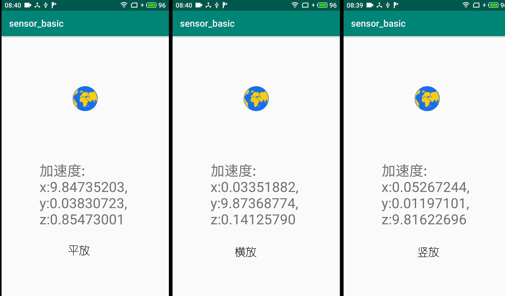

# 安卓传感器开发实验的准备

传感器是物联网感知层的核心组成部分，通过调用传感器，我们可以从环境中感知各种类型的信息。为了使读者更直观地理解传感器的功能与特点，设计了基于安卓手机的传感器调用实验使同学们能够有直观的感受，也为未来的开发打下基础。

## 1. 手机传感器

现代智能手机为了实现多样化的功能，往往配备了大量的传感器，本节先向大家简要介绍智能手机中常用的几种传感器


<center>
<div style="color:orange; border-bottom: 1px solid #d9d9d9;
display: inline-block;
color: #999;
padding: 2px;">图. 智能手机中常见的传感器</div>
</center>

### 1.1. 光线感应器（Ambient Light Sensor）

光线传感器根据环境入射光线调整手机屏幕的亮度。在明亮的户外，屏幕会自动调到最亮的状态；而当在黑暗环境里，屏幕亮度会相应降低。

### 1.2. 距离感应器（Proximity Sensor）

距离传感器由一个红外LED灯和一个红外辐射探测器组成。距离传感器位于手机听筒的附近，其工作原理是：红外LED灯发送红外光，经物体反射后，被红外辐射探测器接收，根据收发延时计算传感器到物体的距离。

<!--实际应用：通话中防止误操作，在通话时，当耳朵接近距离传感器，传感器接到信号后随即通过把显示屏关闭，从而防止用户在通话过程中，误触到屏幕影响通话。-->

### 1.3. 重力传感器

重力传感器，通过压电效应来实现。重力传感器内部包含一块重物和一块压电片。当传感器受到来自某一方向的压力，与压力方向正交的另外两个方向将产生一定电压。根据电压大小，即可计受力方向的压力大小。

<!--切换横屏与直屏方向，在一些游戏中也可以通过重力传感器来实现更丰富的交互控制，比如平衡球、赛车游戏等。-->

### 1.4. 加速度传感器

加速度传感器的原理与重力传感器类似，当物体由加速度发生速度变化时，传感器由于惯性产生沿运动方向的压力，根据压力可以反推出加速度的大小。加速度传感器是多个维度测算的，主要测算一些瞬时加速或减速的动作。

<!--最典型的就是计步器功能了，加速度传感器可以检测交流信号以及物体的振动。人在走动的时候会产生一定规律性的振动，而加速度传感器可以检测振动的过零点，从而计算出人所走的步或跑步所走的步数，从而计算出人所移动的位移，并且利用一定的公式可以计算出卡路里的消耗。-->


### 1.5. 指纹传感器

指纹传感器的主要功能是实现指纹自动采集，市场上的指纹传感器主要分为两类：光学指纹传感器和半导体指纹传感器。前者利用光的折射和反射原理，根据反射光线的明暗还原手指表面凹凸不平的纹路；后者使用电容或电感元件，根据凹接触点和凸接触点电容/电感数值的不同，还原手指表面纹理。

<!--光学指纹传感器：主要是利用光的折射和反射原理，光从底部射向三棱镜，并经棱镜射出，射出的光线在手指表面指纹凹凸不平的线纹上折射的角度及反射回去的光线明暗就会不一样。CMOS或者CCD的光学器件就会收集到不同明暗程度的图片信息，就完成指纹的采集。-->

<!--半导体指纹传感器：这类传感器，无论是电容式或是电感式，其原理类似，在一块集成有成千上万半导体器件的“平板”上，手指贴在其上与其构成了电容（电感）的另一面，由于手指平面凸凹不平，凸点处和凹点处接触平板的实际距离大小就不一样，形成的电容/电感数值也就不一样，设备根据这个原理将采集到的不同的数值汇总，也就完成了指纹的采集。-->

### 1.6. 陀螺仪传感器（Gyroscope）

<!--陀螺仪传感器是一个简单易用的基于自由空间移动和手势的定位和控制系统，它原本是运用到直升机模型上；还记得当时iPhone 4刚推出时的杀手级应用么？没错它就是陀螺仪。平时手机里标配的都是三轴陀螺仪，可追踪6个方向的位移变化。日常我们玩的一些射击或赛车游戏都需要用到这种陀螺仪，很多应用也借助陀螺仪传感器来工作，例如3D拍照、全景导航等。-->

目前手机中常用的陀螺仪传感器是三轴陀螺仪，可追踪6个方向的位移变化。

### 1.7. 磁场传感器（MagneTIsm Sensor）

磁场传感器是利用磁阻来测量平面磁场，从而检测出磁场强度以及方向位置。一般用在常见的指南针或是地图导航中，帮助手机用户实现准确定位。

### 1.8. GPS位置传感器

GPS模块主要作用是通过天线来接收到卫星的坐标信息帮用户定位。
<!--随着4G网络普及，GPS被应用在更多场景，比如与智能硬件配合实现远程定位监控，或是设备丢失后定位查找。这里需要分清一个概念，手机一般标配的是A-GPS，所谓A-GPS是在接收导航卫星信号的基础上通过移动网络更快速的定位，比普通的GPS更先进一些。-->

### 1.9. 气压传感器

当气压发生变化时，电阻或电容的测算数值都发生改变，根据这一特性，可以通过测算电阻或电容监测气压变化。根据感应元件不同，气压传感器可以分为变容式气压传感器和变阻式气压传感器。
<!--一般GPS能计算出你的位置，但对于一些高度上的变化是需要气压传感器来测算。安装了气压传感器的手机能测算你一天上了多少个楼层，或是用于室内定位等，而内部的气压传感器主要是测试设备封闭程度。-->

### 1.10. 温度传感器

手机中常用的温度传感器是用于检测手机电池的温度变化，根据电池温度对手机工作模式进行调整。同时，利用手机的温度传感器也可以看出手机的发热程度。
<!--扩展功能方面，温度传感器也能检测外界空气中的温度变化，甚至是用户当前的体温。-->

### 1.11. 霍尔传感器

霍尔传感器与磁场传感器类似，霍尔传感器可以将变化的磁场转化为输出电压，从而在导体两端产生电势差。霍尔传感器常用于实现手机保护套功能，当合上保护套时手机会自动锁屏，打开保护套之后设备又会自动解锁。

## 2. 安卓传感器开发

Android系统提供了对传感器的支持，只要手机配备了相应的传感器硬件，我们就可以通过代码读取传感器的数值，从而获取手机外部的状态，例如手机的摆放状态、外界的磁场、温度和压力等等。

针对市场上常见的大部分传感器，Android系统都提供了相应的调用接口，因此对开发者来说，传感器开发十分简单：只需要注册监听器，接收回调的数据即可。下面以手机自带的加速度传感器为例，详细介绍传感器的开发步骤。

### 2.1 加速度传感器的开发与使用

- **第一步**： 获取传感器管理对象SensorManager 实例，SensorManager 是系统所有传感器的管理器，安卓中所有对传感的调用都要通过SensorManager 完成。

```java
private final SensorManager mSensorManager;
// 在onCreate()中获取SensorManager实例
@Override
protected void onCreate(Bundle savedInstanceState) {
    ...
    mSensorManager = (SensorManager) getSystemService(Context.SENSOR_SERVICE);
    ...
}
```

利用SensorManager还可以搜索当前手机上安装的全部传感器列表：

```java
List<Sensor> deviceSensors = sensorManager.getSensorList(Sensor.TYPE_ALL);
```

- **第二步**： 从SensorManager中获取传感器目标传感器实例(本例中为TYPE_ACCELEROMETER:加速度传感器)

```java
private final Sensor mAccelerometer;
// 在onCreate()中获取SensorManager实例
@Override
protected void onCreate(Bundle savedInstanceState) {
    ...
    mAccelerometer = mSensorManager.getDefaultSensor(Sensor.TYPE_ACCELEROMETER);
    ...
}
```

除了可以加速度传感器之外，我们还可以用相同的方法获取其他类型的传感器，如：
>Sensor.TYPE_ORIENTATION：方向传感器
Sensor.TYPE_GYROSCOPE：陀螺仪传感器
Sensor.TYPE_MAGNETIC_FIELD：磁场传感器
Sensor.TYPE_GRAVITY：重力传感器
Sensor.TYPE_LINEAR_ACCELERATION：线性加速度传感器
Sensor.TYPE_AMBIENT_TEMPERATURE：温度传感器
Sensor.TYPE_LIGHT：光传感器
Sensor.TYPE_PRESSURE：压力传感器

- **第三步**: 为传感器注册监听器，监听传感器传回的数据。注意此处应该在`onResume()`函数中注册监听，因为`onResume()`函数调用后对应的Activity才会被切换到前台。过早注册监听器将使传感器过早的处于工作状态，既浪费电池电量，又可能造成传感器的竞争使用。

```java
private final TestSensorListener mSensorListener;
// 在onCreate()中初始化监听器，监听器在第四步中重写
@Override
protected void onCreate(Bundle savedInstanceState) {
    ...
    mSensorListener = new TestSensorListener();
    ...
}

// 在onResume()中注册监听器
@Override
protected void onResume() {
    super.onResume();
    mSensorManager.registerListener(mSensorListener, mAccelerometer, SensorManager.SENSOR_DELAY_UI);
}
```

附上`registerListener(SensorEventListener listener, Sensor sensor,int samplingPeriodUs)`函数的三个参数说明：

listener：监听传感器时间的监听器，该监听器需要实现SensorEventListener接口

sensor：传感器对象

samplingPeriodUs：指定获取传感器频率，一共有如下几种：

>SensorManager.SENSOR_DELAY_FASTEST：最快，延迟最小，同时也最消耗资源，一般只有特别依赖传感器的应用使用该频率，否则不推荐。
SensorManager.SENSOR_DELAY_GAME：适合游戏的频率，一般有实时性要求的应用适合使用这种频率。
SensorManager.SENSOR_DELAY_NORMAL：正常频率，一般对实时性要求不高的应用适合使用这种频率。
SensorManager.SENSOR_DELAY_UI：适合普通应用的频率，这种模式比较省电，而且系统开销小，但延迟大，因此只适合普通小程序使用。

此外还需要注意，当Activity被停止或被切到后台时（即当`onPause()`被调用时），需要销毁之前注册的监听器，释放传感器资源。

```java
@Override
protected void onPause() {
    super.onPause();
    // 注销监听函数
    mSensorManager.unregisterListener(mSensorListener);
}
```

- **第四步**: 重写监听器，自定义回调函数，当传感器读数发生变化时将变化后的读数显示出来。传感器底层驱动所做的工作是读传感器芯片上的寄存器，因此`onSensorChanged()`函数的触发条件是传感器芯片寄存器中的数据发生变化。

```java
class TestSensorListener implements SensorEventListener {
    @Override
    public void onSensorChanged(SensorEvent event) {
        // 读取加速度传感器数值，values数组0,1,2分别对应x,y,z轴的加速度
        Log.i(TAG, "onSensorChanged: " + event.values[0] + ", " + event.values[1] + ", " + event.values[2]);
    }

    @Override
    public void onAccuracyChanged(Sensor sensor, int accuracy) {
        Log.i(TAG, "onAccuracyChanged");
    }

}
```

加速度传感器实验程序的运行结果如下图所示，可以发现沿垂直地心方向总是存在一个重力加速度。


<center>
<div style="color:orange; border-bottom: 1px solid #d9d9d9;
display: inline-block;
color: #999;
padding: 2px;">图. 加速度传感器实验效果</div>
</center>
