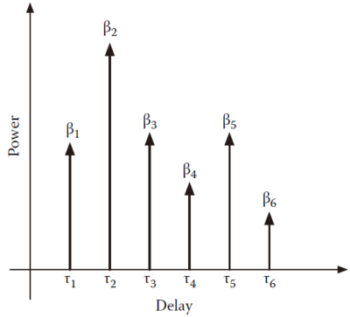
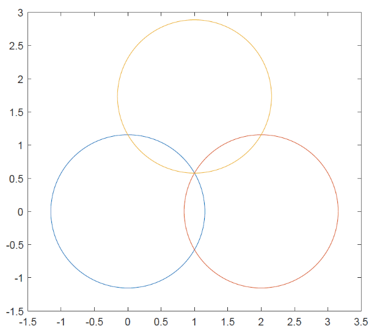
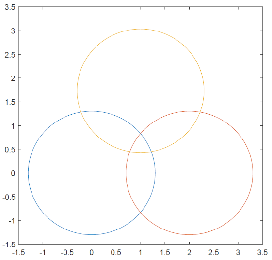
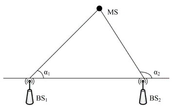

# 定位技术的调研和准备

## 1. 基于信号分布特征定位

基于信号分布特征的定位方法，主要是利用信号的某些特征在空间中的分布特点而实现的匹配定位方法。目前最常用的信号分布定位算法是利用Wi-Fi指纹进行定位。本节剩余部分将首先介绍Wi-Fi指纹定位技术，随后给出信号分布定位的声音实现，最后结合当下研究热点，介绍机器学习技术在信号分布定位方法中的应用。

### 1.1. Wi-Fi指纹定位

Wi-Fi信号的分布特征常被用于在室内场景中定位，利用Wi-Fi信号特征定位无需额外部署硬件设备，是一个非常节省成本的方法。

Wi-Fi指纹定位的核心思想，是把实际环境中的位置和某种“指纹”联系起来，一个位置对应一个独特的指纹。这个指纹可以是单维或多维的，比如从某个特定位置的信号中提取指纹，那么指纹可以是这个信号的一个特征或多个特征（最常见的是信号强度）。

根据定位目标收发信号的行为不同，Wi-Fi指纹定位可以分为远程定位和自身定位两类：如果待定位设备是在发送信号，由一些固定的接收设备感知待定位设备的信号或信息然后给它定位，这种方式常常叫做远程定位或者网络定位。如果是待定位设备接收一些固定的发送设备的信号或信息，然后根据这些检测到的特征来估计自身的位置，这种方式可称为自身定位。在这两种方式中，都需要把感知到的信号特征拿去匹配一个数据库中的信号特征，这个过程可以看作一个模式识别的问题。

位置指纹的具体内容多种多样，任何与位置相关的特征都能被用来做为位置指纹。比如某个位置上无线信号的多径特征、某个位置上是否能检测到接入点或基站、某个位置上接收到来自基站信号的RSS、某个位置上通信往返时间或延迟，这些都能作为一个位置指纹，或者也可以将其组合起来作为位置指纹。

下面我们介绍两种最常用的信号特征：无线信号多径特征和接收信号强度。

**多径特征**

电磁波在空间中传播时，可以在光滑的平面（比如建筑物的墙壁、地板）上进行反射，遇到锐利的边缘会发生衍射，遇到小型的物体（比如树叶）会发生散射。发射源发出的信号可以通过多条路径传播到同一位置，因此在一个位置上会接收到多路信号的叠加，每条传播路径有不同的能量强度和时延。时延取决于信号传播的距离，强度取决于距离和具体的传播情况（反射、衍射等）。每条到达接收器的射线称为一个多径分量，信道的多径特征指的是这一组信号强度和时延。多径特征也称作功率时延分布，图1是一个典型的功率时延分布的例子，其中有6个有效的多径分量。

图1. 功率时延分布

如果信号的带宽足够大（比如使用直接序列扩频技术或者超宽带技术），那么在接收器上可以分解和处理各个多径分量。某个位置上得到的多径特征取决于实际的环境，是独特的，因此能够被用来作为位置指纹。

**接收信号强度（RSS）**

信号的RSS或者接收功率取决于接收器的位置。很多通信系统需要RSS信息用来感知链路的质量，实现切换，适应传输速率等功能。RSS不受信号带宽的影响，没必要高的带宽（大多数通信方式的信号带宽都比较窄），因此RSS是一个很受欢迎的信号特征，并广泛应用于定位中。

假设有一个固定的信号发射源，在离它不同距离的位置上的平均RSS的衰减（in db）和距离的对数成正比，在最简单的情况下，RSS可以表示为：

$$
RSS = A − 10 n lg(r)
$$

其中，$A$是信号传输1m远时接收信号的功率，$n$为传播因子，取决于环境和频率。RSS可以被用来计算移动设备与AP（或基站）之间的距离，但这个距离的误差可能会很大，因为RSS的变动范围可能会很大（注意上面的公式中RSS指的是某个距离的可能RSS的平均），这是由实际环境的影响造成的（称为阴影衰落）。

如果一个移动设备能接收到来自多个发射源的信号，或者固定的多个基站都能感知到同一个移动设备，那么我们可以使用来自多个发射源或者多个接收器的RSS组成一个RSS向量，作为和位置相联系的指纹。这个就是典型的WiFi位置指纹。大多数WiFi的网卡可以测得来自多个AP的RSS（可能是依次测量）。现在在大多数室内场景，移动设备常常可以检测到多个AP，因此使用来自多个AP的RSS作为位置指纹是有意义的。

<!-- 在WiFi网络中，AP常常要发送一个beacon帧，包含了一些网络信息、服务组ID（无线网络的名字）、支持的传输速率，以及一些其它的系统信息。这个beacon帧是用在WiFi中的很多的控制帧之一，它大约100ms发送一次，RSS通常是使用这个beacon帧来测量的。beacon帧是未加密的，所以即使是一个封闭的网络（移动设备未能连接上）也能用来定位。beacon帧接近于周期性地被发送，但并不是完全周期性的，当检测到传输媒介阻塞的时候需要延迟发送，一旦检测到不阻塞的时候就发送，下一次发送还是会在之前预计的100ms时刻，即使离上一次发送还不足100ms。更进一步，如果AP工作在多个信道上，为了避免冲突，在测量RSS之前，移动设备必须花时间扫描各个信道。 -->

获取到位置指纹信息后，我们就可以利用位置指纹进行定位。位置指纹定位通常有两个阶段：离线阶段和在线阶段。在离线阶段，为了采集各个位置上的指纹，构建一个数据库，需要在指定的区域进行繁琐的勘测，采集好的数据有时也称为训练集。在在线阶段，系统将估计待定位的移动设备的位置。

**离线阶段**

位置和指纹的对应关系的建立通常在离线阶段进行。通常会将目标地理区域分成若干个矩形网格，在每一个网格点上，通过一段时间的数据采样（5到15分钟，大约每秒采集一次）得到来自各个AP的平均RSS，采集的时候移动设备可能有不同的朝向和角度。除了平均RSS，我们也可以记录RSS样本的分布（或者其他的一些统计参数，比如标准差）作为指纹。

借助采集结果，这些网格点坐标和对应的指纹就组成一个数据库，这个过程有时称为标注阶段（calibration phase），这个指纹数据库有时也称为无线电地图（radio map）。通常情况下，物理世界中的位置点转换到信号空间中后，会呈现一些没有规律的模式。有些信号向量即使在物理空间中离得很远，在信号空间中却有可能很近。

> 思考： 指纹在信号空间分布的不规律性会对定位造成哪些挑战？

**在线阶段**

当进入在线阶段，一个移动设备处于这个地理区域之中，但是不知道它的具体位置。假设这个移动设备测量到了来自各个AP的RSS，RSS向量的测量值$r$被传输到网络中。要确定移动设备的位置，就是要找到在指纹库中找到和$r$最匹配的指纹$\rho$。一旦找到了最佳的匹配，那么移动设备的位置就被估计为这个最佳匹配的指纹所对应的位置。

根据向量$r$和$\rho$的匹配规则不同，基于位置指纹的定位可以分成两种类型。一种是确定性的算法，其核心是比较信号特征（比如向量$r$）和存在指纹库中的预先计算出来的统计值。另一种是是概率性的算法，计算信号特征属于某个分布（存储在指纹库中）的可能性。

**总结**

Wi-Fi几乎无处不在的可用性使其成为一个很有吸引力的定位方法（无需额外的硬件花费），位置指纹法由于其原理的简单、实现难度低，成为了室内定位的主要选择。然而位置指纹法需要很繁琐的数据采集工作，并且可能需要随着环境的变化而经常更新。此外，由于无线电传播的复杂多变，位置指纹的收集本身也不是容易的问题。一些测量、分析和仿真已经表明可以采取一些经验的方法来减少指纹采集的工作量。如果对定位精度的要求不高，诸如子区域定位或位置指纹的有机构建等其他方法可以用来减少指纹采集的工作量。
<!--
尽管仅使用WiFi的位置指纹法已经被证明是室内精确定位的可行方案，但是随着新技术的出现和具有附近感测能力的智能手机的普及，最终的解决方案可能是使用多种定位技术进行融合的方案。在接下来的几年中，可能可以使用近场通信、智能手机中的加速度计、以及可能的来自蓝牙信号，作为附加参数来改善定位精度，同时保持合理的成本。 -->

### 1.2. 基于声音信号强度分布的定位方法

借助信号分布特征定位的思想，在声音系统中也可以利用声音信号的强度分布特征来定位。本节主要介绍了方法Solo中相关工作的内容。

首先，我们思考：是否可以利用声音信号实现基于指纹的定位方法呢？答案是肯定的。我们观察扬声器播放的单频率声音信号，可以发现：不同频率声音信号在传播过程中，其发散的程度是不同的，高频声音信号传播的方向性更强，低频声音信号在传播中更容易发散。因此，可以利用不同频率声音信号的传播特点实现定位。

现有的声音定位方法通常可以利用单个音箱和手机实现一维测距。考虑与音箱某个距离L的圆周，如果对手机进行一维测距的结果为L，则可以确定手机处于该圆周上。如果结合上文所述的声音信号在声场中的分布规律，即在圆周上与音箱夹角不同角度处接收的信号强度不同这一性质，即可根据手机接收到的信号的强度信息，确定手机与音箱的夹角，即确定了手机在圆周上的位置。这是利用声音信号强度分布实现手机定位的基本思路。

Solo将问题从确定手机的具体位置简化为：在距离音箱30厘米处设定一个边长为15cm的3×3的网格，每个网格是边长是5cm。Solo利用声音信号，对手机处于网格的位置进行的分类。这样就将定位问题简化为一个对手机所在位置的9分类问题。

对于声音信号，如前文所述，Solo在商业扬声器和麦克风常见的20Hz到20kHz工作频段中选择10个频率的正弦声音信号进行混合，作为Solo工作所使用的声音信号。同时，Solo实现了现有的一维测距工作来测量扬声器到手机的距离。手机接收到声音信号后，按前文所述进行带通滤波以分离10个不同频率的声音信号，并分别求出信号的强度$s_1…s_{10}$。我们以频率最低的信号强度作为基准，其他频率的信号强度均除以该信号的强度，求得9个强度比$i_1…i_9$。此时我们得到了9个强度比和扬声器到手机的距离这10个参数。

训练过程中，Solo将上述10个参数作为输入，手机所处的网格位置作为结果，训练一个具有单层隐藏层的人工神经网络。神经网络的结构示意图如图2-8，其中d代表扬声器到手机的距离，$i_1…i_m$代表m个信号强度比（实验中m=9），$p_1…p_n$代表输出的n类结果的概率（实验中n=9，表示3×3方格的9分类）。测试过程与训练过程类似，首先采集每个测量点的声音信号数据，求出9个强度比和距离。随后利用该神经网络模型对这10个参数进行分析，对手机采样时所处的网格位置进行分类和预测。训练集数据和测试集数据的采样位置如图2-9所示。其中训练集采样位置是均匀分布在每个网格内的4个点，测试集采样位置是每个网格内随机生成坐标的3个点。该神经网络模型的输出结果是一个长度为9的向量，向量的每个元素介于0和1之间，表示手机处于该网格内的概率。我们最终将采用概率最高的结果作为对手机位置分类的结果。

### 1.3. 机器学习在信号分布特征定位中的应用

虽然Solo只是一个证明基于信号强度分布进行定位的可行性的定性方法，但是Solo中对定位的实现思路值得我们认真审视。对信号分布特征的匹配，其实质是通过某些特征，对目标点的位置进行分类或回归的过程。而分类模型和回归模型的本质的一样的，分类模型是回归模型的离散化输出。因此，对信号进行特征匹配的方法就是基于信号分布特征的定位方法的核心。而机器学习是目前流行的一种特征匹配方法。

如果我们重新考虑基于指纹的定位方法的基本思想，我们发现，其基本思想就是对定位空间进行了分割，本质上就是对定位空间根据某种标准（通常是信号的某种特征）进行了类别的划分。定位空间的每个网格，即为该分类方法中的一个类别。而定位的过程，即是对目标位置进行分类的过程。

当我们用分类的思想对定位方法进行抽象后，我们可以发现，基于指纹的定位方法的核心过程为“确定分类方式-特征提取-训练分类器-测试数据”。显然，机器学习是实现该过程的一种有效的方法。例如Solo，将定位空间划分为3\*3的网格，这就确定了分类的方式：将空间划分为3\*3共9个类别。接下来，为了提取用于分类的声音信号的特征，Solo测量了每个网格内4个采样位置上10个频率信号的强度信息。随后利用这些信息训练了神经网络，该神经网络就是一个分类器。最后，对目标位置的定位，即为利用该分类器对目标位置进行分类并获得结果。

同样的，如果我们使用其他的机器学习技术，例如支持向量机等，同样可以得到类似的结果。我们甚至可以将多种分类器结合起来，以提高分类的准确率，从而提高定位精度。但是利用分类器实现定位也存在缺点，一个显而易见的问题在于，其定位的精度依赖于分类的精细程度，分类越精细（例如选择几何尺寸更小的网格），其定位的分辨能力越高，训练和建模的复杂程度也越高（因为基于指纹的方法需要在每个网格采集数据进行训练和建模）。

如果我们想在降低训练和建模的复杂程度的同时，得到具体的定位目标点的坐标，那么线性回归是另一种选择。回归指研究一组随机变量(Y1 ，Y2 ，…，Yi)和另一组(X1，X2，…，Xk)变量之间关系的统计分析方法，又称多重回归分析。通常Y1，Y2，…，Yi是因变量，X1、X2，…，Xk是自变量。回到二维定位中，对于Solo，如果利用回归代替神经网络来实现定位，其本质就是研究10个频率信号强度与目标位置坐标(x, y)的关系的统计分析方法。

这里我们不详细介绍如何利用回归分析实现定位，因为其解决问题的思想于分类的方法基本相同，主要的区别在于利用回归模型代替了分类器，得到的结果也从分类结果变为目标点的坐标。同样的，对于回归分析，针对不同的应用场景和数据，可以使用不同的回归模型来得到更好的结果。例如，对于存在某些对定位结果影响较大的参数时，可以使用岭回归代替线性回归。

## 2. 三边定位

<!-- 基于距离测量是一种基本的定位方法，其原理也非常直观和符合直觉。一种最基本的基于距离测量的定位方法是三边定位。 -->

三边定位的基本思想是：假设空间中存在三个用于定位的信标。对于待测的定位点，可以测量该定位点到三个信标的距离。从信标处考虑，所有到信标指定距离的点，组成了一个以信标为圆心、半径为指定距离的圆。那么，根据定位点到三个信标的距离，即可分别确定三个定位圆。而这三个定位圆的交点，即为对待定位点的定位结果。

<!--  -->

图2. 三边定位示意图（理论）

如图所示，如果三个信标的坐标分别为(0, 0)、(2, 0)和(1, 1.732)。对于定位点，如果定位点到三个信标的距离均为1.155，则以三个信标为圆心分别做圆，三个圆交于一点。则该点即为对定位点的定位结果。

假设待求的定位点坐标为(x, y)，n个信标中第i个信标的坐标为(x_i,y_i)，定位点到第i个信标的距离为d_i，则根据图1，有如下方程成立：

$$
\begin{cases}
    (x-x_1)^2+(y-y_1)^2=d_1^2\\
    \vdots\\
    (x-x_n)^2+(y-y_n)^2=d_n^2
\end{cases}
$$

求解上式，即可求得定位点的坐标(x, y)。

图3. 三边定位示意图（实际）

但是通常来说，信标的定位圆并不会刚好交于一点。实际的测量结果通常如图所示。因此，在计算时，我们需要对其进行近似求解。常见方法有加权法、最小二乘法、质心法等。如果我们使用最小二乘法进行计算，需要在前面理论的基础上进一步进行计算。在式1的基础上，我们将前n-1个方程减去第n个方程，得到线性化方程：$AX=b$。其中：

$$
A=\left[
    \begin{matrix}
        2(x_1-x_n) & 2(y_1-y_n)\\
        2(x_{n-1}-x_n) & 2(y-{n-1}-y_n)
    \end{matrix}
\right],
$$

$$
b=\left[
    \begin{matrix}
        x_1^2-x_n^2+y_1^2-y_n^2+d_n^2-d_1^2\\
        x_{n-1}^2-x_n^2+y_{n-1}^2-y_n^2+d_n^2-d_{n-1}^2
    \end{matrix}
\right]
$$

则，利用最小二乘法可以解得：

$$
X=(A^TA)^{-1}A^Tb
$$

相关代码如下（./code/trilateration.m）

~~~matlab
nodeNumber = 3;   %定位信标的数量
nodeList = [0, 0; 2, 0; 1, 1.732];   %三个定位信标的坐标
disList = [1.155, 1.155, 1.155];    %定位目标点到三个定位信标的距离

A = [];
B = [];
xn = nodeList(nodeNumber, 1);
yn = nodeList(nodeNumber, 2);
dn = disList(nodeNumber);
for i=1:nodeNumber-1
    xi = nodeList(i, 1);
    yi = nodeList(i, 2);
    di = disList(i);
    A = [A; 2 * (xi - xn), 2 * (yi - yn)];
    B = [B; xi * xi + yi *yi - xn * xn - yn * yn + dn * dn - di * di];
end    %计算线性方程组的参数A和B

X = inv(A'*A)*A'*B   %根据最小二乘法公式计算结果X
~~~

代码中，nodeList表示信标的位置坐标，nodeNumber表示信标的数量，disList表示定位点到各信标的距离。则分别求得A和B以后，根据式2即可求得定位点的坐标X。

在实际应用中，我们需要根据实际情况选择更合适的方法，代替最小二乘法实现位置的近似计算，实现更高的定位精度。对于某些近似方法，可能无法实现对方程的直接求解，或是直接求解方程很困难，此时可以使用数值方法进行近似求解，常见的方法有梯度下降法等。

## 3. 到达角定位

基于信号到达角度（Angle Of Arrival，AOA）的定位算法是一种常见的无线定位算法。其核心思想是通过某些硬件设备感知发射节点信号的到达方向，计算接收节点和锚节点之间的相对方位或角度，然后再利用三角测量法或其他方式计算出未知节点的位置。

图4. 到达角定位原理

如图4所示，测量基站位置已知，来自基站的信号到达被定为节点时的到达角度$\alpha_1$和$\alpha_2$，以基站为起点形成的射线必经过被测节点，因此两条射线的交点即为节点的位置。

