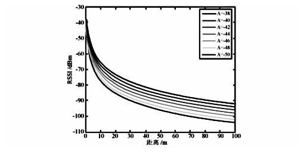
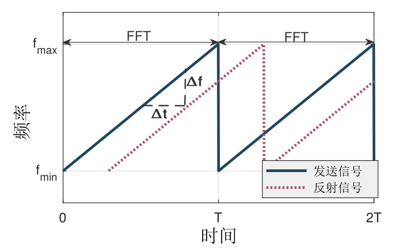

# 无线测距技术调研和准备等

## 1. 基于信号强度测距

### 1.1. 接收信号强度定义

接收信号强度（Received Signal Strength，RSS），有时也称接收信号强度指示（Received Signal Strength Indication，RSSI），是无线传输层用来判定链接质量的重要指标，传输层根据RSS判断是否增大发送端的发送强度。

通常情况下，能量强度用功率表示，单位是瓦特（W）。但无线信号能量较弱，通常在毫瓦（mW）级别。因此普遍的做法是将信号的能量以1mW为基准，以对数形式指示信号强度，单位为dBm(Decibel-milliwatts)：分贝毫瓦。所以在无线信号中，1mW就是0dBm，能量小于1mW的信号RSSI为负数，能量大于1mW的信号RSSI为正数。

$dB$是一个纯计数单位，$dB = 10\lg X$，可以轻易把一个很大/很小的数表示出来。
上面的$dBm$是一个带有量纲（毫瓦）的两个功率的比值的表示方法，是一个表示功率绝对值的单位，其计算公式为：$10\lg(功率值/1mW)$。

例如：如果发射功率为$1mW$，按$dBm$单位进行折算后的值应为：$10 \lg 1mW/1mW = 0dBm$；对于$40W$的功率,则$10 \lg(40W/1mW)=46dBm$。

最常用的$2W＝33dBm$，$20W＝43dBm$。$dBm$与$dBm$之间的差值就可以用$dB$来表示。比如$46dBm-43dBm=3dB$，表示$40W$功率是$20W$功率的$2$倍。

### 1.2. RSSI测距原理

理解RSSI的定义和单位后，我们再来看看RSSI的影响因素。通常，RSSI受发送功率、路径衰减、接收增益和系统处理增益四个元素影响。其计算公式可以表示为：

$$
RSSI = txPower + pathloss + rxGain + SystemGain
$$

其中发送功率、接收增益、系统增益都是定值，而路径衰减在理想情况下与传播距离直接相关。因此无线信号的发射功率和接收功率之间的关系可以用下式表示

$$
PR = \frac{PT}{r^n}
$$

$PR$是无线信号的接收功率，$PT$是无线信号的发射功率，$r$是收发单元之间的距离，$n$是传播因子，数值大小取决于无线信号传播的环境（该公式为远场近似，$r$很小时不成立）。

对上式两边取对数可得:

$$
10\lg(PR) = A - 10n\lg(r)
$$

由于发送功率已知，$A$可以看作信号传输1m远时接收信号的功率。上式左部$10\lg(PR)$是接收信号功率转换为dBm的表达式，因此可以直接写成下面的表达形式

$$
PR（in\quad dBm）=A-10n\lg(r)
$$

上式中可以得到常数$A$和$n$的数值决定了接收信号强度和信号传输距离的关系，因此我们接下来分析这两个常数对信号传输距离的影响。
先假定$n$不变，使$A$变化，可以得到如下图所示的关系曲线图。

图. n不变，A变化时接收信号强度与传输距离关系图

从上图可以观察到，若信号传播因子n为定值，无线信号在近场传播时强度快速衰减，远距离时信号呈缓慢线性衰减。而当发射信号功率增加时，增加的传播距离近似为发射信号功率增加量和曲线在平缓阶段的斜率的比值。

接下来我们分析当$A$不变，取不同的$n$，RSSI与信号传播距离的关系。

图. A不变，n变化时接收信号强度与传输距离关系图

如上图所示。当$n$取值越小时，信号在传播过程衰减越小，信号可以传播较远的距离。从上图还可以看到，良好的传播因子特性（$n$越小）或增加发射信号功率都能增加信号传播距离。传播因子主要取决于无线信号在空气中的衰减、反射、多径效应等干扰，如果干扰较小的话，传播因子n值越小，信号传播距离越远，无线信号的传播曲线越接近于理论曲线，基于RSSI的测距就会越精确。

### 1.3. RSSI测距实现

利用RSSI测距必须事先知道A值和n值，A值为无线收发节点相距1m时接收节点接收无线信号强度值，n值是无线信号的传播因子，这两个值都是经验值，和具体使用的硬件节点和无线信号传播的环境密切相关，所以测距前必须在应用环境中把两个经验值标定好，标定的准确与否，直接关系到测距定位的精度。

此外，如果无线节点系统应用在室外的话，野外的气象条件变化对无线信号的传输也会产生影响。在野外主要考虑的气象条件因素是温度和湿度变化，经过实验验证，温度和湿度条件变化对无线信号传输的影响是没有规律的，但影响效果不明显，可以采取均值或前后测量值加权等方法将其影响消除。

利用RSSI测距时，要避免RSSI的不稳定性，使RSSI值越精确的体现无线信号的传输距离，通过设计各种滤波器使RSSI的值平滑。
最常用也是较容易实现的两种滤波器形式是平均值和加权滤波器，其中平均值滤波器是最基本的滤波形式，但是它需要收发节点之间进行多次数据传输；

## 2. 飞行时间测距

### 2.1. 飞行时间定义

飞行时间（TOF，Time of Flight），指某个粒子、声波或电磁波在某种介质内穿过一段距离所用的时间。已知信号在介质中传播速度的情况下，使用飞行时间可以估算出信号经过的距离。

发送端和接收端的精确时间同步，是测量信号飞行时间的前提。因此如何解决时钟同步问题，是飞行时间测距工作的一个重点，也是难点。传统网络工作中提出了多种网络时间同步机制，例如网络时间协议（Network Time Protocol, NTP)，它也是互联网的时间同步机制。此外，GPS技术也能为不同设备提供全局时间同步，它的原理是在GPS卫星上运行一个高精度的铯原子钟，GPS客户机通过接收卫星发送的伪随机序列，实现与卫星时钟的同步。

现有的时间同步方法在实际使用中仍存在较大的局限性。例如NTP协议主要针对静态网络，并且需要频繁交换消息来不断校准时钟频率偏移带来的误差。此外，NTP协议通常只能达到毫秒级的精度，因此无法满足高精度测距等应用场景的需求。GPS能使设备以纳秒级精度与世界标准时间UTC同步，但GPS受环境遮挡影响大，只适用于室外空旷无遮挡的环境。且GPS设备成本昂贵，功耗也较大，因此无法适用于低功耗物联网节点。

在发送端和接收端时间同步的前提下，接收端就可以记录发送端在哪一时刻开始传输；随后，在收到信号的第一时间，接收端记录信号到达时刻的时间戳；最后，利用接收时间戳减去发送时刻即可得到信号飞行时间。

### 2.2. 利用TOA实现

TOA（Time Of Arrival），指信号到达时间，即飞行时间。使用$d$表示发送端到接收端的距离，$c$表示信号的传播速度（例如声速），$t$表示测量得到的飞行时间，那么可以得到：

$$
	d = c\times t
$$

这一方法要求能准确获知信号发送时间，即要求发送端和接收端之间进行严格的时间同步。

### 2.3. 利用信号反射实现

由于直接TOA测距，同步发送端和接收端时间存在困难，因此有方法提出令接收端和发送段为同一设备，从而在计算飞行时间时避免收发机的时间同步。

一种常见的做法是令测距对象作为反射体，直接反射传输的信号。这种方法要求反射体具有一定的体积，并且收发机能在全双工模式工作，即发送信号的同时能接收来自目标对象反射的信号。

令一种方法是利用两个设备分别作为发送端和接收端：发送端于时刻$𝑡_0$发送信号，接收端收到信号后，等待时间$\Delta 𝑡$后返回同样的波，发送端记录收到回复的时刻$𝑡_1$，从而得到距离距离：$𝑑=(𝑣(t_1-t_0-\Delta t))/2$。这种方法既不要求接收端和发送端时钟同步，也不需要设备具有全双工功能。但实际实现时，由于设备软硬件调度、延迟等不确定因素，接收端很难控制等待时间恰好为$\Delta t$，因此实际测得的距离也存在较大误差。

### 2.4. 利用波速差实现

考虑到发送端和接收端时钟不同步问题带来的飞行时间误差，有研究工作提出通过利用波速差解决同步问题。

一个很简单的例子是，我们可以令发送端同时发送一道电磁波和声波，然后在接收端记录电磁波的到达时刻$𝑡_𝑟$和声波到达时刻$𝑡_𝑠$。则根据这两个不同的到达时刻，可以计算出发送端与接收端之间的距离：

$$
d = \frac{v_r\times v_s \times(t_s-t_r)}{v_r-v_s}
$$

由于$𝑣_𝑟=3\times 10^8 m/s$远大于$𝑣_𝑠=340m/s$，因此距离计算式可简化为：$𝑑=𝑣_𝑠\times (𝑡_𝑠-𝑡_𝑟)$

加权滤波器只需要两次RSSI测量数据，虽然要求数据少，但是也会保证RSSI值的变化平滑。

## 3. FMCW测距

FMCW（Frequency Modulated Continuous Wave，调频连续波）是一种在高精度雷达测距中使用的技术。
FMCW基本原理为发射高频连续波，利用反射信号与发射信号混频得到的频率偏移来进行TOF的测量。

图. FMCW信号

如图所示，FMCW所用为一种专门调制的chirp信号，其信号频率周期性地随时间递增（从$f_{min}$到$f_{max}$）或递减（从$f_{max}$到$f_{min}$）。
一个频率变换周期为$T$的递增FMCW信号$R(t)$可以表示为：
$$
R(t) = \cos\left(2\pi\left(f_{min} + \frac{B}{2T}t\right)t\right)
$$

式中$B=f_{max}– f_{min}$表示频率变化的带宽。
由于反射回来的信号和原始信号的频率差值$\Delta f$，和信号的传输时间$\Delta t$有线性变化关系，因此可以将对TOF的测量转换为对信号频率变化的测量。
假设接收端和发送端之间的距离为$d$，因为传输时间$\Delta t$是往返的总时间，那么可以得到：
$$
d = \frac{c\Delta t}{2}
$$

同时，根据图中的三角函数关系，可以得到：

$$
\Delta t = \frac{T}{B}\Delta f
$$

结合上面的两个式子，可以计算出距离$d$为：

$$
d = \frac{cT}{2B}\Delta f
$$

因此，最终可以利用接收信号和发送信号的频率差值实现测距。

## 5. 参考文献
- RSSI测距原理及公式：http://www.elecfans.com/baike/wuxian/20171120582385.html
- iBeacon测距及稳定程序的实现：refined-x.com/2019/03/30/微信小程序iBeacon测距及稳定程序的实现/
- https://en.wikipedia.org/wiki/Received_signal_strength_indication
