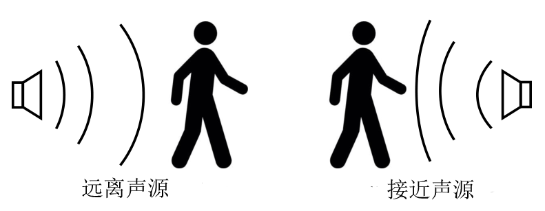
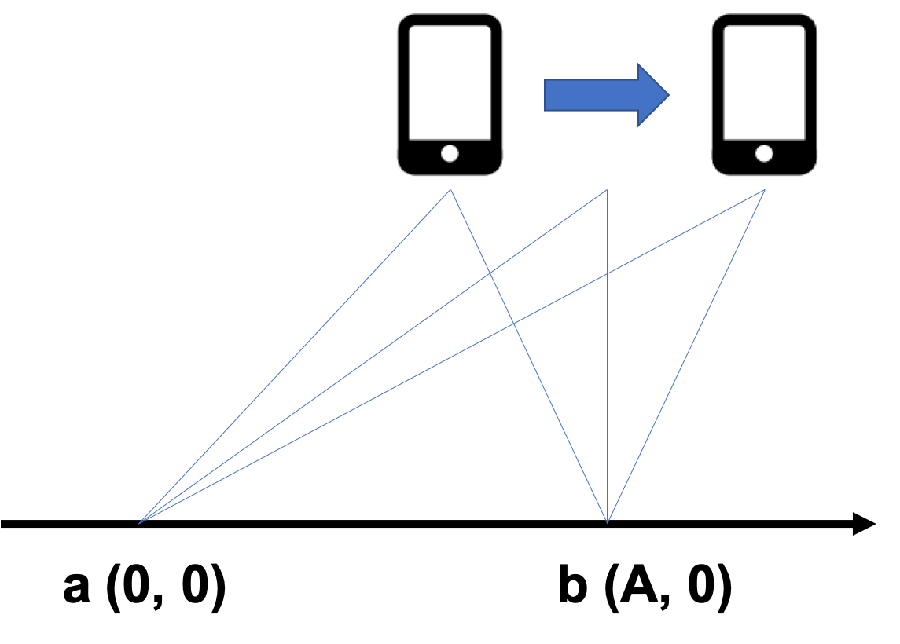
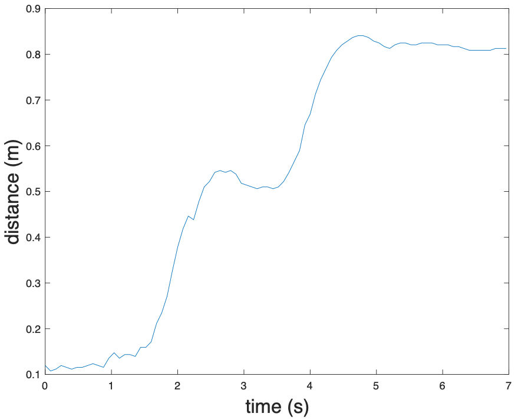
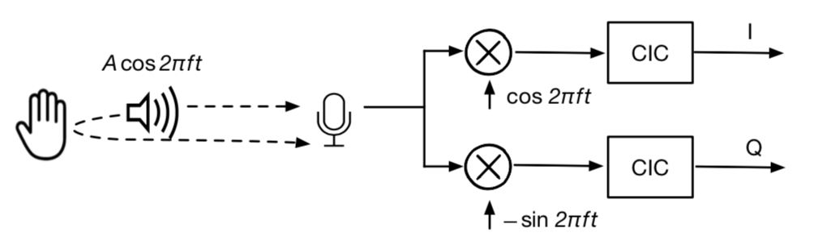
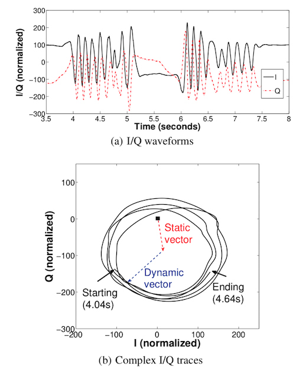

# 追踪技术调研和准备等

基于距离变化量的位置追踪，是利用目标移动引起的到信标的距离变化实现的追踪方法。不同于基于距离测量的定位方法，基于距离变化的追踪方法一般不直接测量距离变化，而是通过距离变化导致的信号频率、相位等信息的变化来间接测量的。常见的基于距离变化量的位置追踪方法有：基于多普勒效应的追踪方法、基于FMCW的追踪方法、基于相位变化的追踪方法。

## 1. 基于多普勒效应的追踪方法

### 1.1. 多普勒效应

多普勒效应是指接收信号的频率或者波长因为信号源和观测者的相对运动而产生变化。


<center>
<div style="color:orange; border-bottom: 1px solid #d9d9d9;
display: inline-block;
color: #999;
padding: 2px;">图. 多普勒效应</div>
</center>


### 1.2. 多普勒追踪实现

根据多普勒效应，我们可以测量一个移动的目标的速度。
以声音信号为例，假设声源持续地发送声音信号，持有移动设备的接收者处于移动状态。
如上图所示，当用户远离或者接近声源时，由于多普勒效应，接收到的声音信号频率将发生变化。
若接收者远离声源，接收的声音信号频率将减小；
若接收者接近声源，接收的声音信号频率将增加，因此可以计算接收者相对声源的运动速度v为：
$$
v = \frac{\Delta F}{F_0}c
$$

式中$F_0$表示原始的信号频率，$\Delta F$表示由于多普勒效应产生的频率变化，c表示空气中的声速。
由于速度对时间的积分等于位移，因此通过计算出速度并进行积分，我们就可以得到目标设备运动的距离。在目标初始位置我们已经知道的情况下，可以计算得目标的最终位置，从而实现对目标的定位追踪。

接收者一段时间的运动距离可以计算为$d = \int_0^{T} v dt$。
因此，给定初始位置的情况下，可以对移动设备进行追踪。
基于多普勒效应的追踪系统核心步骤在于计算频率的偏移$\Delta F$。
一般来说，得到$\Delta F$的方法是将接收到的声音信号做短时离散傅里叶变换（STFT）。
这样一来我们就能得到该信号的时频图。
如果原始信号的频率是固定的，那么通过计算原始信号频率和在某一时刻接收到的信号频率的差，就能得到频率偏移$\Delta F$。
STFT是一种基于滑动窗口的傅里叶变换方法，它的原理是一个滑动窗口在原信号上移动，对每个窗口内的信号做傅里叶变换，这样就可以得到该窗口时间范围内，信号的频域信息和频率偏移。
假设窗口的长度是$L_w$，采样率为$F_s$, 那么频率精度$D_F$就可以用如下公式计算得出:

$$
D_F =  \frac{F_s}{L_w}
$$

如果我们知道了原始信号的频率$F_0$和声速$c$，我们就可以计算出这种方法在速度上的精度。

$$
D_v  =  \frac{D_F}{F_0}c
$$

一般来说，越短的窗口在时域上效果越好，而在频域上效果较差。
长窗口频域上效果好，但是时域上效果差（时延比较高）。

有很多基于多普勒效应进行测距和定位的系统 ：
The Magic Carpet能够利用多普勒雷达来监测使用者在一块“魔毯”上的运动。
AAMouse 实现了对手机的实时定位追踪。
通过使用AAMouse，用户可以将手机当成空间鼠标来使用。
它的原理是通过计算接收到的声音信号的频率偏移，根据多普勒效应计算出移动速度，再通过积分算出移动距离。
在初始点已知的情况下，AAMouse可以对手机进行实时的定位和追踪。
Swadloon 能够测量手机相对于声源的方向和位置。
它需要持续发出恒定频率声音信号的声源。
用户需要以一个恒定的速度将手机在一个很小的范围内移动（通常是用户用手去移动这个手机）。
同时Swadloon还假定用户以一个固定的模式去移动手机（比如沿着一个矩形移动），通过计算频率偏移，就能得出手机相对于声源的位置。


## 2. 基于FMCW的追踪方法

### 2.1. CAT 原理

基于FMCW信号的追踪方法，其核心理论是利用FMCW信号频率和时间的关系，通过傅里叶变换计算接收信号的频率，再利用频率计算信号的传播时间的变化，从而计算目标的移动情况。
基于FMCW信号进行追踪的原理与FMCW测距相同，只是在追踪的应用中我们不要求收发设备进行精确同步，具体细节可参见FMCW测距一章。

追踪和定位的一个核心区别在于，追踪的结果通常是目标设备的运动信息，需要结合目标设备的初始位置，才能计算出设备实时的位置信息。
那么如何获取目标的初始位置呢？
常用的办法是要求设备进行一系列指定的运动，并根据追踪结果，结合已知的几何关系进行计算。

CAT采用的方法如下：首先，我们在定位空间中布置两个扬声器a和b，两个扬声器的坐标分别为a(0, 0)和b（A, 0）。


<center>
<div style="color:orange; border-bottom: 1px solid #d9d9d9;
display: inline-block;
color: #999;
padding: 2px;">图. 初始位置估计</div>
</center>

当用户手持手机沿着平行于x轴的方向移动时，当手机的横坐标小于A时，手机接收到的扬声器a的信号的多普勒效应显示手机是远离a的，扬声器b的信号的多普勒效应显示手机是接近b的。
当手机的横坐标大于A时，手机接收到的扬声器a和b的信号的多普勒效应均显示手机是远离扬声器的。
两种现象的转折点即为手机所处位置横坐标为A的时刻t。
那么，我们就可以根据该时刻手机与两扬声器的几何关系计算手机在该时刻t的位置。根据计算出的TDOA信息$\Delta D$，以及手机、扬声器a和b构成的直角三角形的几何关系，我们可以得到以下方程：
$$
\begin{cases}
D_a-D_b=\Delta D \\
D_a^2-D_b^2=A^2
\end{cases}
$$

求解该方程，我们就可以获得时刻t手机与两个扬声器a和b的距离$D_a$和$D_b$。

当定位空间中存在多个扬声器时，我们可以利用该原理计算一个最优位置。假设空间中存在三个扬声器，其坐标分别为$(x_1, y_1)$、$(x_2, y_2)$、$(x_3, y_3)$，时刻t手机的坐标为(x, y)，手机到三个扬声器的距离分别为$D_1, D_2, D_3$，TDOA分别为$\Delta D_{12}, \Delta D_{23}, \Delta D_{13}$。那么，假设代价函数F为：

$$
F=(\sqrt{(x-x_1)^2+(y-y_1)^2}-\sqrt{(x-x_2)^2+(y-y_2)^2}-\Delta D_{12})^2+(\sqrt{(x-x_1)^2+(y-y_1)^2}-\sqrt{(x-x_3)^2+(y-y_3)^2}-\Delta D_{13})^2+(\sqrt{(x-x_2)^2+(y-y_2)^2}-\sqrt{(x-x_3)^2+(y-y_3)^2}-\Delta D_{23})^2
$$

可以使用梯度下降法求解代价函数F取最小值时的x和y的值。当代价函数F取最小值时，(x, y)即为该条件下手机的最优位置。

### 2.2. FMCW追踪声音实现

**实验场景**

一个手机A发送时长约7s的声音信号，另一个手机B做远离手机A的直线运动并录下声音存储为[`fmcw_receive.wav`](https://cloud.tsinghua.edu.cn/f/de14bca7c3454bc88ac8/?dl=1)。

发送声音信号的格式为88个chirp信号，每两个chirp信号之间有与chirp信号等长的空白间隔。
chirp频率自18kHz线性增加到20.5kHz，持续时间40ms。
采样率为48kHz。

由于我们的收发机之间没有同步（没有用反射信号），因此通过FMCW得到的不是绝对距离。
但通过计算出的“绝对距离”，我们可以得到手机B相对于A的距离变化。

**代码实现**

首先我们要检测信号的起始位置，通过correlation可以得到大致位置。
因为我们在此不要求精准同步，一个粗糙的起始位置已能满足需求。
根据起始位置start，我们可构造一个pseudo-transmitted信号，该信号由相同的chirp和空白间隔组成。
将pseudo-transmitted信号和接收信号相乘并逐chirp做傅里叶变换，我们可以得到峰值对应的$\Delta f$序列。
通过FMCW频率差公式即可推出距离。

注意我们的声音实现中没有采用发射信号，因此距离$d$为：

$$
d = \frac{cT}{B}\Delta f
$$

其中$c$为声速，$T$为chirp周期，$B$为chirp扫频带宽。

~~~matlab
%% 发送信号生成
fs = 48000;
T = 0.04;
f0 = 18000; % start freq
f1 = 20500; % end freq
t = 0:1/fs:T;
data = chirp(t, f0, T, f1, 'linear');
output = [];
for i = 1:88
    output = [output, data, zeros(1,1921)];
end

%% 接收信号读取，并滤波
[mydata,fs] = audioread('fmcw_receive.wav');
mydata = mydata(:,1);

hd = design(fdesign.bandpass('N,F3dB1,F3dB2',6,17000,23000,fs),'butter');
mydata = filter(hd,mydata);
figure;
plot(mydata);

%% 生成pseudo-transmitted信号
pseudo_T = [];
for i = 1:88
    pseudo_T = [pseudo_T,data,zeros(1,T*fs+1)];
end

% fmcw信号的起始位置在start处
% 若start有偏差会造成什么影响？
start = 38750;
pseudo_T = [zeros(1,start),pseudo_T];
[n,~] = size(mydata);
[~,m] = size(pseudo_T);
pseudo_T = [pseudo_T,zeros(1,n-m)];

s = pseudo_T.*mydata';

len = (T*fs+1)*2; % chirp信号及其后空白的长度之和
% 做快速傅里叶变换时补零的长度。
% 在数据后补零可以使的采样点增多，频率分辨率提高。
% 可以自行尝试不同的补零长度对于计算结果的影响。
fftlen = 1024*64;

%% 计算每个chirp信号所对应的频率偏移
idxs = zeros(88, 1);
for i = start:len:start+len*87
    FFT_out = abs(fft(s(i:i+len/2),fftlen));
    [~, idx] = max(abs(FFT_out(1:round(fftlen/2))));
    idxs(round((i-start)/len)+1) = idx;
end

%% 依据频率差公式计算出距离
start_idx = 0;
delta_distance = (idxs-start_idx)*fs/fftlen*340*T/(f1-f0);

%% 画出距离的变化
figure;
plot((0:87)*2*T, delta_distance);
xlabel('time (s)', 'FontSize', 18);
ylabel('distance (m)', 'FontSize', 18);
~~~
最后得到的结果为


<center>
<div style="color:orange; border-bottom: 1px solid #d9d9d9;
display: inline-block;
color: #999;
padding: 2px;">图. FMCW测距结果</div>
</center>

我们可以看到，手机B先是移动了约40cm，停了1秒钟后又移动了约30cm。

## 3. 基于信号相位变化的追踪方法

### 3.1. LLAP (Low-Latency Acoustic Phase)

参考代码：https://github.com/Samsonsjarkal/LLAP/blob/master/llap/Control/RangeFinder.cpp

<!-- ### 方法介绍 -->

​        本文利用发射的声音信号在被测物体上反射，并分析反射信号的相位来对物体进行追踪。现在介绍的方法适用于一维追踪，可以通过增多发射声音信号的设备来实现二维或三维的追踪，原理相同。

​        首先从单一频率的信号开始分析。设发射信号为$A\cos(2\pi ft)$，$A$为信号幅度，$f$为信号频率。为了声音信号对人耳的干扰尽可能小，信号频率应在人耳听力范围的边界或者边界以外，该方法中的信号频率在$17kHz$以上；另外，生活中常见的声音采集设备（如录音机、手机等）采样率为$48kHz$，为了满足奈奎斯特-香农采样定律，发射信号的频率不能超过$24kHz$，在该方法中，选取的信号频率范围为$17kHz\sim 23kHz$。

​         信号经过被测物体的反射，设接收到的信号为$2A'_p\cos(2\pi ft - 2\pi fd_p(t)/c-\theta p)$，$2A'_p$为反射信号的幅度，$d_p(t)$为被测物体随时间变化的相对位移，$c$为声速，因此$2\pi fd_p(t)/c$一项表示由于物体运动带来的相位偏移，$\theta_p$是由于硬件的延迟、反射带来的半波损失等造成的相位偏移，这部分认为是常量，不随时间变化。为了在信号中提取$d_p(t)$，该方法采用$I/Q$调制解调的方式，在反射信号中消去含有频率为$f$的项：

$$
2A'_p\cos(2\pi ft - 2\pi fd_p(t)/c-\theta p) * cos(2\pi ft) = \\ A'_p\cos(-2\pi fd_p(t)/c - \theta_p) + A'_p\cos(4\pi ft -2\pi fd_p(t)/c - \theta_p)
$$

<!-- $A'_p\cos(-2\pi fd_p(t)/c - \theta_p) + A'_p\cos(4\pi ft -2\pi fd_p(t)/c - \theta_p)$ -->

​        通过对反射信号乘$\cos(2\pi ft)$可以得到一个低频分量和高频分量相加的结果，因此将处理结果通过低通滤波器可以得到$I$路信号$I_p(t)=A'_p\cos(-2\pi fd_p(t)/c - \theta_p)$；类似地，通过对反射信号乘$-\sin(2\pi ft)$并通过低通滤波器可以得到$Q$路信号$Q_p(t)=A'_p\sin(-2\pi fd_p(t)/c - \theta_p)$。利用$I/Q$两路信号可以得到反射信号的瞬时相位$-2\pi fd_p(t)/c - \theta_p$。在该方法中，低通滤波器采用级联积分梳滤波器(Cascaded Integrator Comb Filter, CIC Filter)，该滤波器的原理参考[CIC Filter]([https://en.wikipedia.org/wiki/Cascaded_integrator%E2%80%93comb_filter](https://en.wikipedia.org/wiki/Cascaded_integrator–comb_filter))

​        该方法中给出的上述处理过程的图示如下：

​        声音发射设备发射声音信号后，接收到的信号实际上不仅仅包含从被测物体上反射的信号，还包含直接从麦克风到扬声器的信号（自己发射自己接收）以及从周围的静态物体上反射的信号，其中只有被测物体反射的信号随时间变化（假设周围环境中只有一个运动的物体，即被测物体），称之为动态分量；其余接收到的信号称为静态分量。为了将这两个信号分量分离开，该方法采用局部极值检测算法 (Local Extreme Value Detection, LEVD)，分别对$I/Q$信号处理。以$I$路为例，在$I$路信号中交替找到局部最大值和最小值（相邻的局部极值一个是最大值，一个是最小值，还需要满足两者之差大于某个设定的阈值），并将相邻极值的平均值当做这一段信号的静态分量，从原信号中减去静态分量得到动态分量。下图为该方法中举的例子：

​        

​        (a)图中为$I/Q$两路信号值随时间的变化，(b)图中把$I/Q$信号在$4.04s$到$4.64s$的一段画在复平面上。从(b)图中可以看出在这段时间内信号的相位不断变化，动态分量围绕静态分量的终点转了几个圈，每转一圈代表相位变化$2\pi$，即运动了一个波长（在声音信号为$18kHz$频率、声速为$343m/s$时，波长约为$1.9cm$）。由于静态分量的存在，这些圆圈的圆心不在原点，而是在静态分量的终点，寻找$I/Q$两路信号的相邻极大极小值是为了在复平面上找到圆圈的位置，$I$路相邻极值（对应圆圈最左边和最右边的点）的平均值作为静态分量终点的$I$轴坐标估计，$Q$路相邻极值（对应圆圈最上边和最下边的点）的平均值作为静态分量终点的$Q$轴坐标估计。

​        信号的实际传输过程还可能受到多径效应的影响。对于没有经过被测物体反射的多径信号，是静态分量的一部分，已经通过LEVD算法消除了。而对于经过被测物体反射的多径信号，经过麦克风接收后实际形成的是多个反射信号叠加的结果（每个反射信号的相位一般都不相同，因为经历的反射路径长度通常是不同的）。这样在反射信号中实际上就包含不止一个动态分量，且每个动态分量的相位通常不同，而上述方法只能分析出所有动态分量叠加之后的向量，这个向量对应的相位往往没有意义。

​        为了解决多径效应的问题，需要将发射信号从单一频率信号改为多频率复合信号。对于同一条多径效应中的反射路径，不同频率的信号波长不同，反映在相位上也就不同。通过对多个频率和合理选取使得这些频率的信号互相正交，以便$I/Q$调制解调时可以提取单一频率的反射信号，对多个频率分别计算对应的动态分量（实际上是多个动态分量的叠加）。在一段短暂的时间内（该方法中取$10ms$）可以认为被测物体的运动速度保持不变，因此位移线性变化，也即相位线性变化，为了归一化将这一段时间的初始相位从所有相位中减去，得到的相位画在时刻-相位图像上应该是一条经过原点的直线，可以通过线性规划的方法拟合出直线的斜率，并根据误差的大小排除某个频率的信号误差过大的情况。

**代码说明**

*GenerateSound.m*

本程序用于生成待发送的声音信号，对声音信号的参数说明如下

```matlab
sampleFreq = 48000;     %采样率，单位Hz
dF = 350;               %相邻两个频率成分的频率差，单位Hz
pathN = 10;             %频率成分数
baseF = 17000;          %信号的最低频率，单位Hz
durSec = 300;           %声音信号持续时间，单位s
A = 1;                  %幅度
```

生成的声音信号文件为**sample.wav**，位于与代码同级目录下。

*AnalyseSound.m*

本程序实现LLAP的主要算法

```matlab
soundFile = "" % 待分析的声音文件名
```

程序运行结果为一张图像，描绘根据分析结果绘制的位移图像

### 3.2. 基于采样点的定位和测距方法

本节主要介绍了该方法Vernier: Accurate and Fast Acoustic Motion Tracking Using Mobile Devices中的相关工作内容。

基于信号相位变化的追踪方法，其关键在于如何计算接受信号的相位变化。经典的测定相位变化的方法，其对相位的计算精度受限于信号的采样率。而声音信号的采样率又受到硬件和软件的双重限制，例如常见的音频文件采样率为44.1kHz或48kHz，常见的手机麦克风录音的采样率不大于48kHz。因此，通常来说，很难通过提高信号采样率来提高定位精度。

如果可以通过其他方法提高信号相位变化的分辨率，即可在信号采样率固定不变的前提下，提高基于相位变化的追踪方法的精度。

**游标卡尺的原理**

首先，我们考虑一个类似的间接提高分辨率的例子：游标卡尺。游标卡尺是一种用于精确测量长度的工具。一般而言，游标卡尺由两部分构成，一部分是主尺，另一部分是可滑动的游标，可以在主尺上自由滑动。主尺和游标上都有刻度，但是二者的刻度间距稍有不同。主尺的刻度一般都是整毫米的，而游标上的刻度一般与主尺上的刻度往往有着一个微小的差距（如0.9mm）。


<center>
<div style="color:orange; border-bottom: 1px solid #d9d9d9;
display: inline-block;
color: #999;
padding: 2px;">图. 游标卡尺示意图</div>
</center>

对于常见的游标卡尺，其主尺刻度间隔为1mm，游标上的刻度间隔为0.9mm。如果我们要测量的距离为r，那么我们可以得到：

$$
r-r'+0.9x=1.0x
$$

其中，r’表示对r进行向下取整的结果，x表示游标的第多少个刻度，能够与主尺上的刻度互相对齐。经整理，得到：

$$
r-r'=0.1x
$$

由于游标每向右移动了一个刻度，其与主尺上的刻度上的差距就增加了0.1 mm。因此，利用这个原理就可以对长度进行更精确地测量。值得指出的是，游标卡尺的测量精度本质上并不是由游标和主尺上的刻度差值决定的，而是由二者的最大公约数决定的。

**信号相位变化的测定**

接下来，我们介绍一种类似游标卡尺原理的信号相位变化的测定方法。

首先定义几个变量：

LMP（Local Max Prefix）：在一个信号采样窗口中，我们规定第一个采样点的LMP为0。从第二个采样点开始，如果某一个点的值（就是该采样点的信号强度），既大于它的前一个值，又大于它的后一个值，那么这个点的LMP值为它的前一个点的LMP值加1，否则该点的LMP值等于其前一个点的LMP值。

LMPS（Local Max Prefix Sum）：LMPS是在一个窗口中，所有采样点的LMP的和。

假定在时间t1和时间t2两个时刻，录音设备取得两个等长时间窗口的音频数据w1和w2。每个窗口中有恰好有p个周期的声音信号，这p个周期的信号刚好对应着q个采样点。w1和w2两个时间窗口的数据的LMPS分别为L1和L2。则这两个窗口所经历的相位变化为 Δφ =（L2-L1）2π / q。位置变化为 $\Delta d = \lambda \Delta \phi - c (t_2 - t_1)/2\pi$，其中c是声音在空气中的传播速度。


<center>
<div style="color:orange; border-bottom: 1px solid #d9d9d9;
display: inline-block;
color: #999;
padding: 2px;">图. LMP和LMPS示意图</div>
</center>

如图所示，在一个时间窗口内，p = 3，q = 13。则该窗口内信号各采样点的LMP如图所示，信号的LMPS为26。


<center>
<div style="color:orange; border-bottom: 1px solid #d9d9d9;
display: inline-block;
color: #999;
padding: 2px;">图. Vernier测量相位变化示意图</div>
</center>

当信号相位变化 $\frac{2\pi}{q}$ 时，LMPS增加1。
也就是说，当p = 3、q = 13时，每当LMPS增加1，我们就可以说，信号的相位变换增加了 $\frac{2\pi}{13}$ ，距离变化了 $\frac{\lambda}{13}$ 。

接下来，我们介绍该算法的实现。

首先，我们需要一个计算窗口信号的LMP和LMPS的函数。（代码见./code/getLMPS.m）

~~~matlab
function [ lmps ] = getLMPS( y )  %输入是窗口信号的强度，输出的该窗口信号的lmps
lmp = 0;
lmps = 0;
for i=2:length(y)-1   %计算除首尾的采样点的lmp
    if y(i)>y(i-1) && y(i)>y(i+1)
        lmp = lmp + 1;
    end  %如果该采样点是局部最大值，则lmp+1
    lmps = lmps +lmp;  %lmps是所有采样点的lmp的和
end
lmps = lmps + lmp;   %最后一个采样点的lmp一定与倒数第二个相同
~~~

该函数将计算某个窗口信号的LMPS值。然后通过比较信号的LMPS值的变化，我们就可以计算信号相位的变化情况。（代码见./code/vernier.m）

~~~matlab
pi = 3.14;  %常量pi

x1 = 0: 6*pi/13: 6*pi;   %正弦信号的采样位置，p=3，q=13
y1 = sin(x1);  %该正弦信号所有采样点的信号强度

d = 2*pi/13;   %信号的相位偏移
x2 = d: 6*pi/13: 6*pi+d;    %经过偏移的正弦信号的采样位置
y2 = sin(x2);    %经过偏移的正弦信号的采样点的信号强度

lmps1 = getLMPS(y1)  %计算原信号的lmps
lmps2 = getLMPS(y2)  %计算偏移信号的lmps
~~~

运行结果如下：

~~~matlab
lmps1 =
    26
lmps2 =
    27
~~~

代码执行的结果与前面推导的一致。

如果信号的相位偏移量小于2π/q，那么结果如何？为了验证这点，我们修改代码中的信号偏移量：

~~~matlab
d = pi/13;   %信号的相位偏移，该偏移小于2π/q
~~~

则代码的运行结果如下：

~~~matlab
lmps1 =
    26
lmps2 =
    26
~~~

从运行结果可以看出，如果信号的相位偏移量小于2π/q，我们就无法通过该方法分辨出这个相位偏移量。这说明，理论上$2\pi/q$就是该方法的最小相位分辨率。


## 5. 参考文献
- J. Paradiso, C. Abler, K. Hsiao, and M. Reynolds. 1997. magic carpet: physical sensing for immersive environments. In Proceedings of ACM CHI.
- K. Kalgaonkar and B. Raj. 2009. One-handed gesture recognition using ultrasonic Doppler sonar. In Proceedings of IEEE Acoustics, Speech and Signal Processing
- S.P Tarzia, R.P. Dick, P.A Dinda, and G. Memik. 2009. Sonarbased measurement of user presence and attention. In Proceedings of ACM UbiComp.
- Sangki Yun, Yi-Chao Chen, and Lili Qiu. 2015. Turning a Mobile Device into a Mouse in the Air. In Proceedings of ACM MobiSys.
- Wenchao Huang, Yan Xiong, Xiang-Yang Li, Hao Lin, XuFei Mao, Panlong Yang, Yunhao Liu, and Xingfu Wang. 2015. Swadloon: Direction Finding and Indoor Localization Using Acoustic Signal by Shaking Smartphones. IEEE Transactions on Mobile Computing 14, 10 (2015), 2145-2157.
- Wei Wang, Alex X. Liu, and Ke Sun. 2016. Device-free Gesture Tracking Using Acoustic Signals. In Proceedings of ACM MOBICOM.
