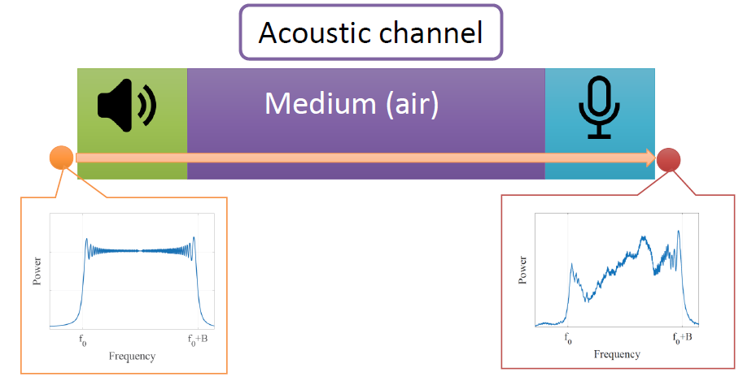
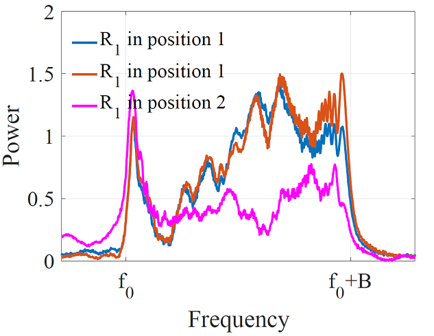

# 设备身份识别相关技术准备
随着物联网技术的发展，设备之间通信的安全性显得越来越重要。保证物联网设备通信安全，最重要的一步就是进行准确的设备身份识别。由于物联网设备通常是部署在局部网络中，在公网中并不具备一个固定的ID，无法使用传统的基于公钥系统的秘钥交换方法。不需要可信第三方的秘钥交换方法，如Diffie–Hellman方法不提供通讯双方身份验证的服务，使得这类方法极易受到中间人攻击。

当两个从未进行过会话的陌生移动设备要开启一个临时的加密会话时，如何验证彼此身份的合法性是解决物联网通信安全的重要问题。

## 1. 硬件的频率选择特性
世界上没有两个一模一样的树叶，也没有两台一模一样的设备。不同的设备之间，即便是同一型号同一批次的产品，在硬件结构上总会有多多少少的不同。

大量的观察发现，信号发送和接收设备的硬件特性往往表现在频率选择特性上。同一个硬件设备对不同频率的信号的响应不同，会使得某些频率的信号增强，另外一些频率的信号减弱。不同的硬件设备所加强和减弱的频率因其各自的硬件结构不同而各不相同。

用于声音信号的发送和接收的扬声器和麦克风也同样具有这种硬件特性。声音信道对声音信号有着明显的频率选择特性。一个标准的chirp信号在时频图和频域图中分别如下图所示。在时频图中，chirp信号表现为一个扫频信号，在频域图中，chirp信号在其带宽范围内呈现出能量值大致相当的现象。

图. 标准chirp信号

当这个标准chirp信号经过声音信道之后，即由扬声器发送、通过空气介质、并通过麦克风被接收设备收到之后，在时频图和频域图中如下图所示。观察发现，在时频图中仍然是一个扫频信号，与上图中标准chirp差异不大。但在频域图中，在chirp信号带宽范围内各个频率上的能量值呈现出参差不齐的现象。

图. 通过声音信号之后的chirp信号

这是由于声音信道对声音信号的频率选择特性所造成的。声音信道由扬声器、声音传播介质、以及接收端的麦克风组成。这三者对对声音信号都存在频率选择特性。扬声器和麦克风是由于硬件的不完美性对不同频率的增强和减弱的效果不同。声音传播介质由于多径路径的存在，来自多个路径的声音信号会在接收端产生干涉的现象，某些频率的信号刚好处于干涉相长的状态，而另一些处于干涉相消的装态，从而使得干涉相长的频率增强，干涉相消的频率减弱。下图所示是整个声音信道对声音信号的频率选择特性。

图. 声音信道对声音信号的频率选择特性

为了进一步探索频率选择特性是否足以区分出不同的设备、或不同的通信信道。我们首先固定一个声音发射源，将两个不同的接收设备分别放在同一个位置进行了一组实验。下图中展示了当发送设备和多径环境相同时，不同的接收设备对声音信号的频率选择特性。其中，蓝线和红线是设备1在位置1进行两次相同录音的结果。黄线是设备2在位置1录音的结果。观察发现，同一个设备的前后两次结果非常接近，而不同设备之间的差异很大。这个现象说明，我们可以使用声音信号的频率选择特性来区分不同的设备。

图. 不同硬件设备对声音信号的频率选择特性不同

另外，我们还探索了当设备位置改变（声音传播介质的多径环境改变）时频率选择特性的变化。我们将设备1在位置2录音的结果（下图中紫红色线）与两次在位置1录音的结果（下图中蓝色和红色线）进行比较，发现当设备位置发生变化，信道的频率选择特性也发生较大的变化。这说明当同一个设备的位置发生变化，它将无法再次通过频率选择特性的验证。这个特性使得设备认证之间的安全性得到更好的保障，使得设备在每次会话前都需要进行重新进行认证，有效抵抗中间人的攻击。

图. 不同传播路径对声音信号的频率选择特性不同

当频率选择特性可以帮助设备做身份认证，两个陌生设备在初次相遇需要进行安全的通信时，可以通过设备邻近性的验证来确定彼此的合法性。并记住当前会话信道对声音信号特有的频率选择特性，利用此对后续通信的对象进行身份的识别。