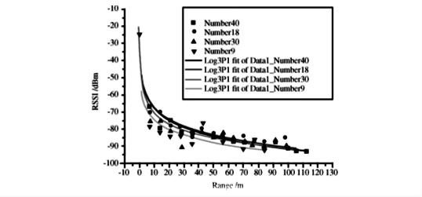

# 信号强度测距

## 1. 接收信号强度

接收信号强度（Received Signal Strength，RSS），有时也称接收信号强度指示（Received Signal Strength Indication，RSSI），是无线传输层用来判定链接质量的重要指标，传输层根据RSS判断是否增大发送端的发送强度。

通常情况下，能量强度用功率表示，单位是瓦特（W）。但无线信号能量较弱，通常在毫瓦（mW）级别。因此普遍的做法是将信号的能量以1mW为基准，以对数形式指示信号强度，单位为dBm(Decibel-milliwatts)：分贝毫瓦。所以在无线信号中，1mW就是0dBm，能量小于1mW的信号RSSI为负数，能量大于1mW的信号RSSI为正数。

$dB$是一个纯计数单位，$dB = 10\lg X$，可以轻易把一个很大/很小的数表示出来。
上面的$dBm$是一个带有量纲（毫瓦）的两个功率的比值的表示方法，是一个表示功率绝对值的单位，其计算公式为：$10\lg(功率值/1mW)$。

例如：如果发射功率为$1mW$，按$dBm$单位进行折算后的值应为：$10 \lg 1mW/1mW = 0dBm$；对于$40W$的功率,则$10 \lg(40W/1mW)=46dBm$。

最常用的$2W＝33dBm$，$20W＝43dBm$。$dBm$与$dBm$之间的差值就可以用$dB$来表示。比如$46dBm-43dBm=3dB$，表示$40W$功率是$20W$功率的$2$倍。

## 2. RSSI测距原理

理解RSSI的定义和单位后，我们再来看看RSSI的影响因素。通常，RSSI受发送功率、路径衰减、接收增益和系统处理增益四个元素影响。其计算公式可以表示为：

$$
RSSI = txPower + pathloss + rxGain + SystemGain
$$

其中发送功率、接收增益、系统增益都是定值，而路径衰减在理想情况下与传播距离直接相关。因此无线信号的发射功率和接收功率之间的关系可以用下式表示

$$
PR = \frac{PT}{r^n}
$$

$PR$是无线信号的接收功率，$PT$是无线信号的发射功率，$r$是收发单元之间的距离，$n$是传播因子，数值大小取决于无线信号传播的环境（该公式为远场近似，$r$很小时不成立）。

对上式两边取对数可得:

$$
10\lg(PR) = A - 10n\lg(r)
$$

由于发送功率已知，$A$可以看作信号传输1m远时接收信号的功率。上式左部$10\lg(PR)$是接收信号功率转换为dBm的表达式，因此可以直接写成下面的表达形式

$$
PR（in\quad dBm）=A-10n\lg(r)
$$

上式中可以得到常数$A$和$n$的数值决定了接收信号强度和信号传输距离的关系，因此我们接下来分析这两个常数对信号传输距离的影响。
先假定$n$不变，使$A$变化，可以得到如下图所示的关系曲线图。

图. n不变，A变化时接收信号强度与传输距离关系图

从上图可以观察到，若信号传播因子n为定值，无线信号在近场传播时强度快速衰减，远距离时信号呈缓慢线性衰减。而当发射信号功率增加时，增加的传播距离近似为发射信号功率增加量和曲线在平缓阶段的斜率的比值。

接下来我们分析当$A$不变，取不同的$n$，RSSI与信号传播距离的关系。

图. A不变，n变化时接收信号强度与传输距离关系图

如上图所示。当$n$取值越小时，信号在传播过程衰减越小，信号可以传播较远的距离。从上图还可以看到，良好的传播因子特性（$n$越小）或增加发射信号功率都能增加信号传播距离。传播因子主要取决于无线信号在空气中的衰减、反射、多径效应等干扰，如果干扰较小的话，传播因子n值越小，信号传播距离越远，无线信号的传播曲线越接近于理论曲线，基于RSSI的测距就会越精确。

## 3. RSSI测距

利用RSSI测距必须事先知道A值和n值，A值为无线收发节点相距1m时接收节点接收无线信号强度值，n值是无线信号的传播因子，这两个值都是经验值，和具体使用的硬件节点和无线信号传播的环境密切相关，所以测距前必须在应用环境中把两个经验值标定好，标定的准确与否，直接关系到测距定位的精度。

此外，如果无线节点系统应用在室外的话，野外的气象条件变化对无线信号的传输也会产生影响。在野外主要考虑的气象条件因素是温度和湿度变化，经过实验验证，温度和湿度条件变化对无线信号传输的影响是没有规律的，但影响效果不明显，可以采取均值或前后测量值加权等方法将其影响消除。

利用RSSI测距时，要避免RSSI的不稳定性，使RSSI值越精确的体现无线信号的传输距离，通过设计各种滤波器使RSSI的值平滑。
最常用也是较容易实现的两种滤波器形式是平均值和加权滤波器，其中平均值滤波器是最基本的滤波形式，但是它需要收发节点之间进行多次数据传输；
加权滤波器只需要两次RSSI测量数据，虽然要求数据少，但是也会保证RSSI值的变化平滑。

## 4. 参考文献

1. RSSI测距原理及公式：http://www.elecfans.com/baike/wuxian/20171120582385.html
2. iBeacon测距及稳定程序的实现：refined-x.com/2019/03/30/微信小程序iBeacon测距及稳定程序的实现/
3. https://en.wikipedia.org/wiki/Received_signal_strength_indication
