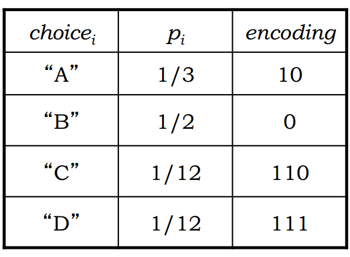
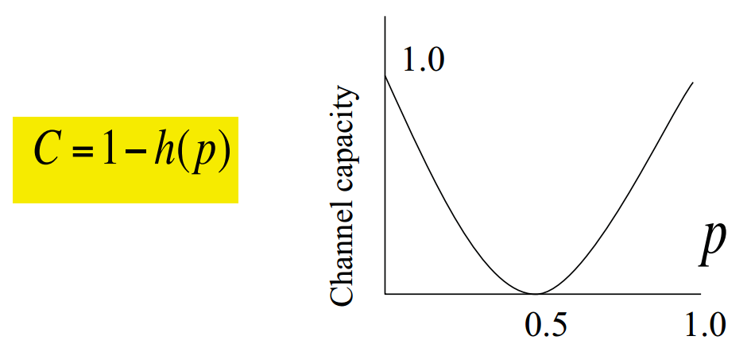
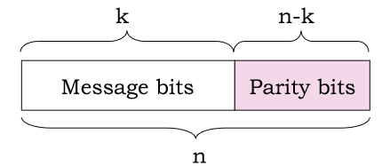
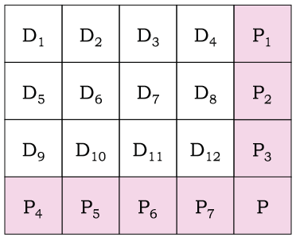
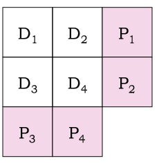
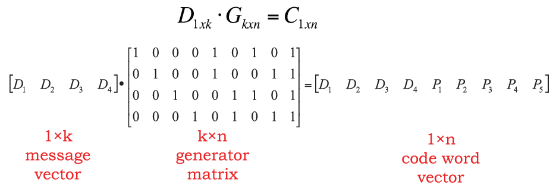

#链路模型及网络容量
在讲到网络冲突处理之前，我们先想来说一下网络里面的链路以及链路对网络容量的影响。在讲这些之前，我们的前人其实给我们建立了一套非常坚实的理论基础。

##1. 信息如何来度量 

先从一个较远的故事出发。既然网络传输的本质是传输信息，那么有一个关键的问题是我们怎么来衡量信息的多少？

假设有一个变量，S，S可以有很多取值，那么当我们知道变量取值$S=s_i$ 时，我们能够获取的信息量有多少呢，这个信息量可以表示为$I(S=s_i) = log_2(1/P(s_i))$,其中$P(S_i)$是$S=s_i$的概率。

根据这个公式我们其实能够看出来，$P(s_i)$越小，这里面的信息量是越大的。也是符合我们只觉得，如果一个事件发生的概率越小，那么实际上我们知道这个时间发生的时候信息量就很大了。比如说你去买一个彩票，知道了中奖的号码，肯定比你知道明天是不是下雨的信息量是有更大的。同时如果P(s_i)=1的话，我们可以看到信息量为0。也就是说如果这个事情肯定发生的话，那么知道这个事情发生也就没啥信息量了。

考虑S可以取值0和1，$P(s_i = 0) = P(s_i = 1) = 0.5$。那么知道s_i取值后的信息量就是1,即为1个bit的信息量。

> "Information is the resolution of uncertainty”. -Shannon

需要注意的就是，一个低的概率代表着一个高的信息量。但是一个高的信息量，并不代表一个更加有意义的信息量。一般情况下，可以将这个信息量理解为结果的不确定性。

在此基础上，我们来看一个信息传输中的一个重要概念，信息熵（entropy）。
简单的来说，信息熵H(S)可以理解为知道S结果后期望获得的信息量：

$$H(s)= \sum_{i=1}^N P_s(s_i )I(S=s_i) =\sum_{i=1}^N P_s(s_i )log_2(\frac{1}{P_s(s_i))})$$

当所有的概率都相等的时候，那么这个信息熵可以计算为$H(S) = log_2 N$。这个也是能够得到的最大的信息熵。（想想为什么？）

考虑一个抛硬币的游戏，如果正面和反面的概率相同的话，不难计算出每一次抛硬币的信息熵为1. 
信息熵（bit表示）就代表着知道一个变量的结果后带来的信息，从另外一个角度来看，这也是表示这次结果所必须的bit数量，是我们需要用到的bit的lower bound。也就是在信息通信的过程中，我们必须用这么多的bit来表示这个信息。如果所用的bit比这个少的话，那么信息就表达的不完整。如果我们用的bit比这个信息熵多的话，那么信息就有冗余和浪费。
请大家注意，这个就是所有编码理论里面最重要的标准。就是这么一个公式，就奠定了所有编码方法的最优解，所有编码方法都是朝着这个方向来进行努力的。

我们来看一个例子，假设我们要传输数据可能出现4个结果A B C D，如果这4中结果的概率相同，那么很显然，这4种结果需要用2个bit来表示，如果我们要传输1000次这样的结果，那么就需要2000个bit。但是，换一种情况我们来考虑，如果这四种情况出现的概率不相同呢，比如A（1/3）,B(1/2), C(1/12), D(1/12)呢，这个时候我们可以计算出信息熵为1.626bits。这也就是意味着如果我们要传输一次结果，所需要的bit为1.626，并不需要2个bit了。也就是说在这样的情况下，我们理论上可以设计一个编码，使得传输一次信息只需要1.626bits。

> 思考：大家可以想想怎么样去设计这样的编码呢？

一个最直观的想法就是用更短的序列去编码出现概率更大的结果。

 

 
 

 
图1. 编码概率和对应的长度

 

大家可以计算一下，在这种情况下期望的bit长度是多少？

这个编码的方法就是哈夫曼编码， 在计算机数据处理中，霍夫曼编码使用变长编码表对源符号（如文件中的一个字母）进行编码，其中变长编码表是通过一种评估来源符号出现机率的方法得到的，出现机率高的字母使用较短的编码，反之出现机率低的则使用较长的编码，这便使编码之后的字符串的平均长度、期望值降低，从而达到无损压缩数据的目的。

例如，在英文中，e的出现机率最高，而z的出现概率则最低。当利用霍夫曼编码对一篇英文进行压缩时，e极有可能用一个比特来表示，而z则可能花去25个比特（不是26）。用普通的表示方法时，每个英文字母均占用一个字节，即8个比特。二者相比，e使用了一般编码的1/8的长度，z则使用了3倍多。倘若我们能实现对于英文中各个字母出现概率的较准确的估算，就可以大幅度提高无损压缩的比例。

###1.1 发现的过程：
1951年，霍夫曼和他在MIT信息论的同学得选择是完成学期报告还是期末考试。导师罗伯特·法诺出的学期报告题目是，查找最有效的二进制编码。由于无法证明哪个已有编码是最有效的，霍夫曼放弃对已有编码的研究，转向新的探索，最终发现了基于有序频率二叉树编码的想法，并很快证明了这个方法是最有效的。霍夫曼使用自底向上的方法构建二叉树，避免了次优算法香农-范诺编码的最大弊端──自顶向下构建树。
1952年于论文《一种构建极小多余编码的方法》（A Method for the Construction of Minimum-Redundancy Codes）中发表了这个编码方法。

##2. 信道能传多少数据
知道了如何编码之后，我们来看第二个问题，一个信道到底能传输多少数据。我们再来看看另外一个定义：互信息Mutual Information。
$I(X; Y) = H(X) – H(X|Y)$
从上面的公式可以看出来，互信息就是当我们知道Y的情况下X的不确定性减少的程度。
如果把X看作传输中发出的数据，Y看作传输中收到的数据，那么互信息就是表示了当我们收到Y的情况下对X的不确定性减少的多少。简单的来看，对于一个很好的信道，当我们知道Y的时候，对X的不确定减少应该是最多的。如果对于一个很差的信道，当我们收到Y的时候，对X的不确定性减少应该是很少的。

假设对于一个信道，发送0,1数据，0和1的概率相等，同时接收端收到0->1或者1->0的概率为p，即每一个bit出错的概率为p，计算I(X; Y). 信道的容量可以表示为$C= max{H(Y) – H(Y|X)}$。 

 

 
 

 
图2. 错误率与网络容量的关系

 

信道容量的计算为我们给出了信道传输的上限，不管用什么样的传输方法，是不可能超出这个上限的。那么一个很自然的问题就是，在真实数据传输的时候，我们如何接近并达到信道容量。

##3. 线性编码(Linear Block Code)

原始数据k bits，编码成n bits，通过线性转换的方式将k bits的数据转化为n bits的编码，一般表示为(n, k)，编码效率为k/n。有时候写作(n, k, d)，d是两个编码之间的最小哈明距离。

 

 
 

 
图3. linear block coding示意图

 

这个编码的转换一般是通过
$$ C= D*G $$
实现的，其中D是k位的输入原始数据，G是一个转换矩阵，C是转换后的结果。

请看下面一个例子的编码分别的纠错、检错能力是多少。

 

 
 

 
图4. linear block coding例子

 

其中D为原始的数据，P为编码后加上的bit，注意在组成n位的数据后，数据的顺序并不重要，只要能确定好编码的规则和每一位代表的意思就可以。
$$ (n, k, d) = rc/(rc + r + c + 1) $$

如果使用这样的编码方式，对于(n, k)编码，如果我们要检测出一位的错误，k应该满足如下的条件
$2^{n-k} \geq n + 1$。思考为什么，在实际情况中如何实现这种编码方式。
如果在实际情况中要检测出m位的错误呢？

 
 Hamming Code")
 
 

 
图5. (7, 4, 3) Hamming Code 例子

 

实际上，对于如下的4bit的编码方式，

 

 

可以用矩阵的方法表示为

 

 
在这个matrix的转化方法中，$C$为$[D_1 D_2 D_3 D_4 P_1 P_2 P_3 P_4 P_5]$。

> 思考：这个例子中G如何设置，这个例子中的纠错能力如何。