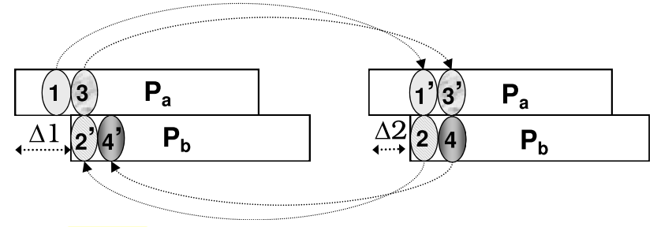
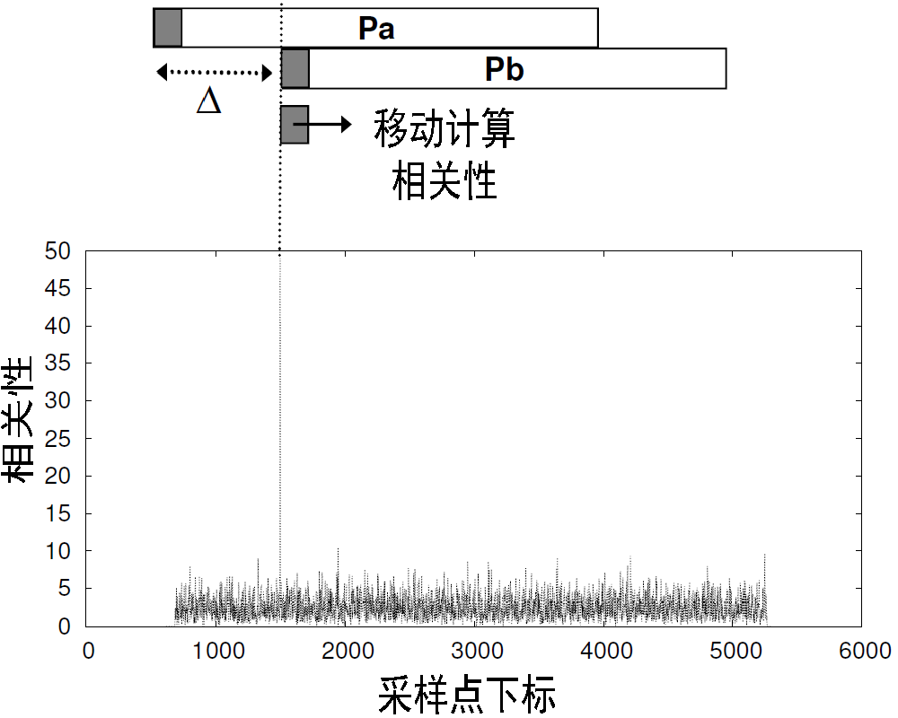
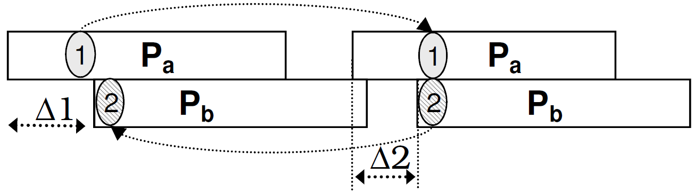
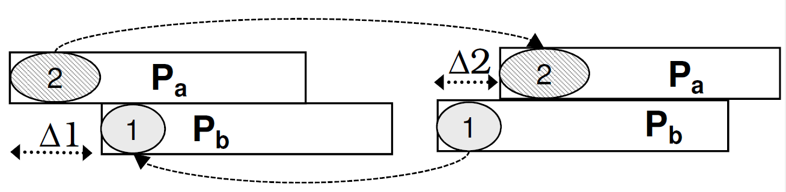

# ZigZag声音实现

冲突解码是网络传输过程中的一个重要功能，ZigZag作为一种积极的冲突消除算法，它利用冲突信号本身，对每一个受损的数据包进行还原和解码，从而有效地避免了CSMA、RTS/CTS等消极的冲突避免算法对网络吞吐率的影响。

ZigZag算法的实现基于802.11协议的两点性质：其一，对于未被确认的数据包，发送端将在计时器超时后进行重传；其二，重传数据包在发送前需要经过一段随机的时间延迟。若数据包$P_a$和数据包$P_b$在首次传输和重传时均发生冲突，由于随机重传延时的存在，$P_a$和$P_b$在两次冲突中将具有不同的时间错位（即下图中$\Delta 1\neq \Delta 2$）。因此，在$P_a$或$P_b$中一定存在这样一段信号，它在一次冲突中与其他数据包互相干扰，而在另一次冲突中则完全不受其他数据包的影响（如下图中的信号段$1$和$1'$）。
 
 
 

 
图1. ZigZag冲突消除过程示意

 

 
ZigZag核心就是利用这一信号段，迭代地消除冲突数据包之间的干扰，最终还原出每一个冲突的数据包。如图1所示，$P_a$中的信号段1在第一次冲突中未受干扰，因此ZigZag首先从第一次冲突中提取信号段$1$，并在第二次冲突的相同位置构造并消去这段信号，从而还原出属于$P_b$的信号段$2$。信号段$2$和信号段$1$一样，也是在一次冲突中有干扰，而在另一次冲突中无干扰。因此，ZigZag可以重复迭代上述消去与还原的过程，直至$P_a$和$P_b$都被完整地还原。

## 1. ZigZag实现步骤

本节将带领读者，深入ZigZag算法的实现细节，讨论其在实际实现过程中存在的挑战。

通过用两段混合在一起的声音来模拟两个冲突的数据，我们来看如何使用冲突解码的方法来还原出来原来的声音，实验中将使用MATLAB和声音冲突信号模拟真实的冲突消除过程。

### 1.1 数据包检测

解码冲突数据包之前，ZigZag需要检测每个数据包的准确开始时间，从而计算冲突数据包的时间错位，并启动冲突消除流程的第一段信号段。ZigZag的数据包检测依赖于Wi-Fi数据包固定的前导码（preamble）结构：所有Wi-Fi数据包都以一段结构相同的前导码为开头，因此ZigZag可以通过计算收到的信号与理想前导码的相关性，检测数据包的开头。如下图所示，ZigZag逐采样点移动理想前导码信号，计算其与收到的信号的相关性。当理想前导码与真实数据包完全对齐时，相关性结果将出现波峰。此时，通过搜索波峰出现的位置，ZigZag可以最终准确地检测每个冲突数据包的到达时间。

 

 
图2. 利用信号相关性进行数据包检测

 

**计算相关性** :设收到的信号为$y(t)$，考虑信号传播过程中，存在冲突和信道噪声，$y(t)$可以表示为：

$$
y(t)=y_S (t)+y_I (t)+w(t)
$$

其中$y_S (t)$ 为发送端发送的信号，$y_I (t)$ 为冲突干扰信号，$w(t)$为信道噪声。对收到信号$y(t)$进行离散化采样，可以得到：

$$
y[k]=y_S [k]+y_I [k]+w[k]
$$

接着，接收端构造理想前导码信号$s[k]$，并逐采样点移动$s[k]$与收到信号$y[k]$进行匹配。对每一次匹配，接收端从y[k]中截取长度与$s[k]$相同的信号段$y[\Delta+k]$，计算$s[k]$与$y[\Delta+k]$的相关性。对两个长度相同的复数向量A和B，其相关性等于A的转置与B逐点相乘后求和，即：

$$
Corr(A,B)=\sum_{k=1}^L A^* [k]\times B[k]
$$

因此，理想前导码$s[k]$与收到信号$y[k]$的每一次匹配可以表示为：

$$
  \Gamma[\Delta] = \sum_{k=1}^L s^*[k]\times y[\Delta+k]\\
  = \sum_{k=1}^L s^*[k]\times (y_S[\Delta+k]+y_I[\Delta+k]+w[\Delta+k])
$$

其中$\Delta$表示收到信号与理想前导码匹配时的采样点偏移，$s^*[k]$ 表示$s[k]$的转置。考虑$s[k]$与$y_I[k]$、$w[k]$不相关，其点乘、求和后的结果可忽略不计，从而有：

$$
\Gamma[\Delta] = \sum_{k=1}^L s^*[k]\times (y_S[\Delta+k])+\sum_{k=1}^L s^*[k]\times (y_I[\Delta+k]+w[\Delta+k])\\
    \approx \sum_{k=1}^L s^*[k]\times (y_S[\Delta+k])
$$

当且仅当$\Delta$使得理想前导码与收到数据包的开头完全对齐时，有：

$$
    \Gamma[\Delta] = \sum_{k=1}^L s^*[k]\times (s[k]e^{j2\pi \delta ft})\\
    = \sum_{k=1}^L |s[k]|\times e^{j2\pi \delta ft}
$$

其中$\delta f$为收发端的中心频率偏差(CFO)，若不考虑CFO，则当$s[k]$与$y[k]$完全对齐时，相关性出现波峰，波峰高度等于报头信号能量。但由于实际信号中CFO的存在，$e^{j2\pi \delta ft}$ 在累加过程中符号连续变化。此时，即使$s[k]$与$y[k]$完全对齐，累加结果也不出现波峰。ZigZag在节点加入网络时估计其CFO，并在计算相关性时对CFO进行补偿消除。

接下来，我们通过实验，更深刻地理解上述数据包检测过程。由于射频信号的需要通过专业设备进行生成和提取，本书使用声音信号对射频信号进行模拟。

我们首先使用两个不同的声源同时向接收端的麦克风播放声音，从而在接收端形成冲突。为了精确地检测数据包的到达时间，我们仿照Wi-Fi数据包的结构，在每段声音之前附加一段格式固定的前导声波。随后，我们在接收端重新构造一段与前导声波格式相同的理想前导信号，并通过逐采样点计算理想前导信号与收到信号的相关性，估计数据包的准确到达时间。

MATLAB提供了$dot()$函数，可以用于计算两个相同长度向量的相关性：

~~~matlab
C = dot(A,B)
C = dot(A,B,dim)
~~~

$C = dot(A,B)$ 返回 A 和 B 的标量点积:
- 如果 A 和 B 是向量，则它们的长度必须相同。
- 如果 A 和 B 为矩阵或多维数组，则它们必须具有相同大小。该函数计算对应向量沿大小不等于 1 的第一个数组维度的叉积。

以下为通过计算相关性进行数据包检测的实现代码，使用一个长度固定的信号截取窗口，著采样点移动窗口起点，截取收到的信号与理想前导信号计算相关性。当相关性达到设定的阈值，则记录当前检测到的数据包的起始采样点编号。数据包检测函数最终返回每个冲突数据包准确的起始采样点。

~~~matlab
function dout = pktDetect(datain, ideal_preamble, threshold)
%PKTDETECT using correlation for packet detection
%   Detailed explanation goes here
  len_data = length(datain);
  len_preamble = length(ideal_preamble);
  dout = [];
  for i = 1:len_data - len_preamble
    corr_set = datain(i + (1:len_preamble));
    c = dot(corr_set,ideal_preamble);
    if c > threshold
        dout = [dout; i];
    end
  end
end
~~~

### 1.2 冲突消除

本节以两数据包冲突为例，介绍如何使用ZigZag算法实现冲突消除，并从冲突信号中还原出两个原始的数据包。

对于两数据包的信号冲突，ZigZag冲突消除算法要求接收端收取时间错位相异的两组冲突信号。利用上一节介绍的数据包检测方法，我们可以获得每次冲突时、每个数据包的准确到达时间。根据冲突数据包的准确到达时间，ZigZag提取出第一段可以用于解码的信号段$BootChunk$。$BootChunk$需要满足两点特征，即在第一次冲突中为interference-free，而在第二次冲突中与另一数据包完全重叠。考虑在首次冲突和重传冲突中，两个数据包的到达顺序可能相同也可能不同，我们需要对两种情况分别设计$BootChunk$提取方法。通过比较冲突尾部interference-free信号段的内容，我们可以很容易地判断出两个数据包在两次冲突中到达的顺序是否相同。

 
 

 
图3. 冲突数据包到达顺序相同

 

 
 

 
图4. 冲突数据包到达顺序不同

 

若两个数据包在两次冲突中到达顺序相同（如上方第一幅图），则$BootChunk$信号段就是$P_a$在两次冲突中interference-free段的差值，$BootChunk$长度等于$\Delta 1 - \Delta 2$。我们首先通过计算相关性，获得每个数据包的到达时间。对每次冲突，计算冲突头部interference-free信号段的长度，两段interference-free信号段长度的差值即为$BootChunk$的长度。最后直接从较长的interference-free信号段中提取$BootChunk$的内容。具体实现如下：

~~~matlab
function dout = singleOrderBootChunk(datain1,datain2)
%SINGLEORDERBOOTCHUNK Summary of this function goes here
%   Detailed explanation goes here
    pktList_1 = pktDetect(datain1);
    delta_1 = pktList_1(2) - pktList_1(1);
    
    pktList_2 = pktDetect(datain2);
    delta_2 = pktList_2(2) - pktList_2(1);
    
    len_boot_chunk = abs(delta_1 - delta_2);
    if delta_1 > delta_2
        start_boot_chunk = pktList_1(1) + delta_2;
        dout = datain1(start_boot_chunk + (1:len_boot_chunk));
    else
        start_boot_chunk = pktList_2(1) + delta_1;
        dout = datain2(start_boot_chunk + (1:len_boot_chunk));
    end
end
~~~

若两个数据包在两次冲突中到达顺序不同（如上方第二幅图），则$BootChunk$信号段就是$P_a$在两次冲突中interference-free段的和，$BootChunk$长度等于$\Delta 1 + \Delta 2$。我们首先获得每个数据包的到达时间，根据到达时间提取每次冲突头部的interference-free信号段。冲突数据包的两次到达顺序不同，两段interference-free信号段分别属于两个不同的数据包，且都满足$BootChunk$的条件，即在一次冲突中无干扰，在另一次冲突中有干扰。取任意一段interference-free信号，对齐到另一次冲突的相同位置并消去，则可以得到长度为$\Delta 1 + \Delta 2$的完整$BootChunk$。
具体实现如下：

~~~matlab
function dout = flippedOrderBootChunk(datain1,datain2)
%FLIPPEDORDERBOOTCHUNK Summary of this function goes here
%   Detailed explanation goes here
    pktList_1 = pktDetect(datain1);
    pktList_2 = pktDetect(datain2);
    
    free_chunk_1 = datain1(pktList_1(1):pktList_1(2)-1);
    len_chunk_1 = length(free_chunk_1);
    free_chunk_2 = datain2(pktList_2(1):pktList_2(2)-1);
    inter_chunk = datain2(pktList_2(2)+(0:len_chunk_1-1));
    dout = free_chunk_2 + (inter_chunk - free_chunk_1);
end
~~~

最后，使用$BootChunk$迭代地消去已知信号，得到新的$BootChunk$，直至还原出两个完整的冲突数据包。

~~~matlab
function dout = zDecoder(datain1,datain2)
%ZDECODER Summary of this function goes here
%   Detailed explanation goes here
    pktList_1 = pktDetect(datain1);
    pktList_2 = pktDetect(datain2);
    
    if isFlippedOrder(datain1, datain2)
        boot_chunk = flippedOrderBootChunk(datain1,datain2);
        out_pkt1 = datain1(pktList_1(1):pktList_1(2)-1);
        out_pkt2 = boot_chunk;
    else
        boot_chunk = singleOrderBootChunk(datain1,datain2);
        out_pkt1 = datain1(pktList_1(1):pktList_1(2)-1)
        out_pkt1 = [];
    end
    
    point1 = pktList_1(2);
    point2 = pktList_2(2) + length(boot_chunk) - 1;
    it = 2;
    while point1 < length(datain1) && point2 < length(datain2)
        if it == 1
            boot_chunk = datain1(point1+(1:chunk_size)) - boot_chunk;
            out_pkt2 = [dout2;boot_chunk];
            point1 = point1 + chunk_size;
        else
            boot_chunk = datain2(point2+(1:chunk_size)) - boot_chunk;
            out_pkt1 = [dout1;boot_chunk];
            point2 = point2 + chunk_size;
        end
        it = mod(it,2) + 1;
    end
end
~~~

### 1.3 思考

1. 环境噪声对ZigZag解码算法是否会产生影响？如果有影响，那又该如何消除？
2. ZigZag的信号段迭代恢复策略可能会产生误差传导问题，即某一段信号段解码错误，将造成后续连续多个信号都产生错误。思考是否有办法解决该误差传递问题?
3. 本章对ZigZag的介绍是以两数据包冲突为例，请根据ZigZag解码策略，实现能同时解码三个冲突数据包的解码算法。

## 2. 参考文献

- [1] Shyamnath Gollakota and Dina Katabi. Zigzag decoding: Combating hidden terminals in wireless
networks. Proceedings of ACM SIGCOMM, 2008.

- [2] Wavelet toolbox user’s guide. Mathworks Inc, 2009.
