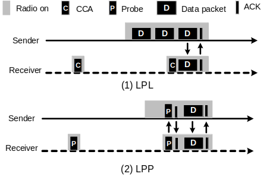
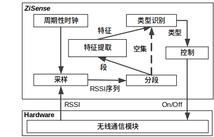
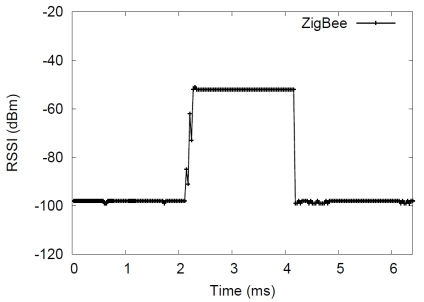
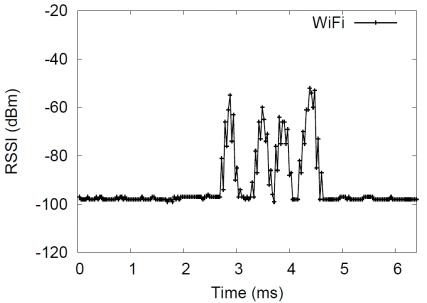
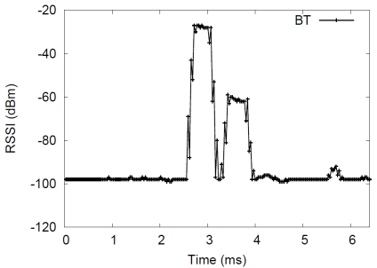
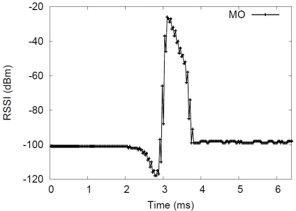
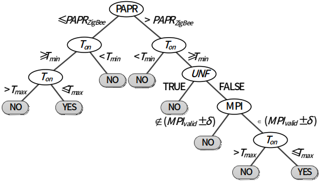

#跨协议识别

为了达到长期运行的目的，无线传感器网络通常运行在低功耗的周期性工作（duty cycling）模式下。所谓周期性工作即节点周期性的醒来进行数据的收发，而在其他时间关闭无线通信模块，从而节省大量能量。低功耗监听（Low Power Listening，LPL）和低功耗探测（Low Power Probing，LPP）是无线传感器网络常用的两种低功耗周期性工作技术。LPL和LPP的工作方式分别如图1（1）和图1（2）所示。

 

 
 

 
图1. LPL和LPP工作模式示意图

 

在LPL中，每个接收节点周期性的醒过来打开无线通信模块去测量信道的能量，如果能量高于一个阈值，则接收节点认为存在数据传输，故保持无线通信模块打开来收取可能的数据包；否则，节点关闭无线通信模块。这个过程就是所谓的空闲信道评估（Clear Channel Assessment，CCA）。使用LPL的发送节点重复发送数据包当做传输前导（preambles）直到接收节点返回一个ACK表示数据包已被收到。

在LPP中，节点使用的是接收节点触发机制，每个接收节点都会周期性醒来发送一个探测包probe告诉周围节点自己的醒来事件，收到接收节点的probe，发送节点会马上发出数据包。在LPP中，发送节点不会主动重复发送传输前导，反而是静默等待接收节点的probe，只有在收到probe时候才进行数据传输。

在无干扰的环境下，这两种方法可以节省很大程度上减少能量消耗。但是，当有其他无线技术运行在同样的频率上时，他们的性能会急剧下降。

而随着现代社会的发展，无线传感器网络大范围的应用到室内系统中，比如空调控制系统，智能家居等应用系统。由于无线传感器网络是遵守IEEE 802.15.4协议规范，它必须运行在2.4GHz的频段上。2.4GHz是工作在ISM频段的一个频段。ISM频段是工业，科学和医用频段。一般来说世界各国均保留了一些无线频段，以用于工业，科学研究，和微波医疗方面的应用。应用这些频段无需许可证，只需要遵守一定的发射功率(一般低于1W)，并且不要对其它频段造成干扰即可。ISM频段在各国的规定并不统一。而2.4GHz为各国共同的ISM频段。

由于2.4GHz是一个免费的频段，所以很多设备应用于在这个频段。在室内环境中，常见的运行在2.4GHz的无线技术包括：

* 无线局域网络WiFi，遵循IEEE 802.11协议规范；

* 蓝牙技术Bluetooth，遵循IEEE 802.15.1协议规范；

* ZigBee，遵循IEEE 802.15.4协议规范；

* 微波炉，微波不是一种通信信号，但是微波炉产生的微波信号的频率却于2.4GHz频段产生了重叠，导致了干扰。

这些干扰会导致低功耗周期性工作产生许多能量浪费。比如，在LPL中，一个节点使用CCA来判断自己是否该保持无线通信模块的打开。如果存在干扰源，发出的信号能量大于阈值时，即使没有ZigBee的数据在传输，CCA也会认为信道是繁忙的，从而打开节点的无线通信模块，造成无谓的能量浪费。这就是所谓的假醒问题，即，节点认为信道存在数据传输而实际信道上没有ZigBee的数据传输。对于LPP，同样存在着类似的问题。如果LPP机制的探测包probe丢失，发送节点等不到probe会导致其一直打开自己的无线通信模块，监听信道，等待可能得probe消息。这会造成发送节点无线通信模块打开过长的时间，导致能量的浪费。

##1. ZiSense

基于上述技术问题，本文介绍一种基于无线信号类型识别的无线传感器网络低功耗工作技术。现有技术工作不够高效的问题是：检测信道能量和解码探测包都极易受到干扰，尤其是非ZigBee的其他无线技术的干扰的影响。因此，本文介绍一个新的技术——ZiSense。ZiSense利用ZigBee信号对于干扰更加有抵抗性的更加有特点的特征来检测可能得数据传输，从而在真正有数据包传输的时候，唤醒节点，根本上消除假醒问题，同时采用传输前导来重复传输数据包，使得传输对干扰更加有抵抗性。本质上来讲，该技术从根本上改变了现有的基于CCA和探测包的低功耗周期性工作模式。

该技术是一种基于无线信号类型识别的无线传感器网络低功耗工作技术，包括如下步骤：

1. 接收节点运行在本发明提出的低功耗工作模式——ZiSense下，周期性的时钟唤醒节点，打开无线通信模块，对信道进行采样评估，获得一定时间长度的接收信号能量（Received Signal Strength Indicator，RSSI）的序列。

2. 对采样后的RSSI序列进行分割切片，提取出有用的RSSI序列片段。

3. 对RSSI序列片段进行特征的提取，提取出该段RSSI序列的突出特征。

4. 使用特征来进行无线信号类型的识别。

5. 识别出无线信号的类型后，即可判断是否存在ZigBee信号，如果存在，则保持无线通信模块打开进行通信；否则，关闭无线通信模块进入睡眠模式，节省能量。
 

 
 

 
图2. 执行步骤概览

 

特别地，在步骤1中的RSSI采样过程需要快速执行，这样才能保证时间效率，从而减少无线通信模块的打开时间。本发明使用了TinyOS提供的无线通信模块驱动程序，提高了总线的时钟频率，从而将RSSI的采样频率提高到了31.25KHz，即，32μs/采样点。本发明的采样窗口大小是90个采样点，需要花费2.9毫秒。

特别地，在步骤2中设计的分段方法如下。分段的目标是从90个采样点组成的RSSI序列提取出RSSI段，每个段对应于一个包的传输。直观上讲，一个包的传输可以被一连串的高RSSI采样序列来识别出来。对于微波炉，一个RSSI段起始于偏离环境噪声。所以本发明使用的分段方法是：当RSSI采样点的值偏离环境噪声超过一定阈值时，本发明认为这是一个有效的RSSI段的开始。相类似的，一个段的结束可以认为是RSSI采样值和环境噪声的差值小于了这个阈值。

定义采样到的RSSI序列为：$X=\{x_1，x_2，……，x_W\}$。这里W是采样窗口大小90。所以在这个RSSI序列里面所有段的开始点S和结束点E可以表示成如下公式：

$$
S=\{s\big | \left| x_{s-1}-Noise \right| < th_d, \left| x_s-Noise \right| \geq th_d \}
$$
$$
E=\{e\big | \left| x_{e}-Noise \right| \geq th_d, \left| x_{e+1}-Noise \right| < th_d \}
$$

将S和E进行升序排列然后放入两个数组和中。为了消除开始和结束点在采样窗口外的问题，我们人为的在采样序列的开始和结束分别加上了一个环境噪声值。因此这里可以保证，这里K是提取出来的段的总数。

比如，如图3的ZigBee采样序列所示，通过上述方法得到：$S=\{2.2ms\}$，$E=\{4.2ms\}$，则RSSI序列在时间范围$[2.2ms,4.2ms]$内构成了一个段（如图中高于噪声的采样点组成），再比如图4的WiFi采样序列，通过上述方法得到：$S=\{2.8ms，3.3ms，3.6ms，4.2ms\}$，$E=\{3.0ms，3.5ms，4.0ms，4.5ms\}$。则我们可以得到4个段：$[2.8ms, 3.0ms],[3.3ms,3.5ms],[3.6ms,4.0ms],[4.2ms,4.5ms]$。

特别地，在步骤3中进行的特征提取如下。首先本发明根据历史数据测量决定要提取哪些特征。根据历史数据，不同的信号源的RSSI序列如图3-图6所示。图3是ZigBee传输时采集的RSSI序列；图4是WiFi信号产生的RSSI序列；图5展示了蓝牙信号的RSSI序列；图6展示了微波炉产生的电磁波的RSSI序列。

 
 
 
 

 
图3. ZigBee信号的RSSI序列

 

 

 
 

 
图4. WiFi信号的RSSI序列

 

 

 
 

 
图5. 蓝牙信号的RSSI序列

 

 

 
 

 
图6. 微波炉信号的RSSI序列

 

根据上面的RSSI采样序列特点，该技术决定了4个特征：

1.    传输时间（On-air Time）。不同的技术的不同的有效传输时间范围是由各自协议规范规定的传输速率和有效包的大小决定的。根据其底层的标准规范，我们可以得知：ZigBee的传输时间为$[608μs, 4256μs]$；WiFi的传输时间根据802.11n的规范是$[194μs, 542μs]$；蓝牙的传输时间是$366μs$；微波炉的传输时间是由微波炉的工作模式决定的，$[2ms, 10ms]$。

    第$k$个段的传输时间的计算公式如下：

    $$
    T_{on}(k)=(I_S(k)-I_E(k))\times T_s
    $$

    其中$T_s$是采样周期。

2.    最小包间隔时间（Minimum Packet Interval, MPI）。MPI定义为两个连续的传输信号直接的最小间隔时间。ZigBee的MPI是由传输层的协议定义规范的，一般取决于ACK的往返时间，根据现在的系统实现，ZigBee的MPI是2.8ms。WiFi的包间隔时间是由802.11协议规范的，两个连续的数据包发送之间至少间隔DIFS时间（DCF Inter-Frame Space）。即WiFI的MPI是28μs。由于蓝牙使用的是伪随机跳频，在同一个频率上的两个连续的包的时间间隔是没有定值的，即蓝牙的MPI不存在。而微波炉的MPI就是微波炉周期性工作的关闭阶段的时间。即，微波炉的MPI是10ms（在电源的频率是50Hz的情况下）。

    MPI的计算公式如下：
    
    $$
    T_{MPI}=min\{(i-j)\big|\ \left|\overline{X_i}-\overline{X_j}\right| \leq th_s,1 \leq j < i \leq K\}
    $$
     
    其中$th_s$是两个段的平均RSSI值的差，$\overline{X_i}$和$\overline{X_j}$是RSSI段$i$和$j$的RSSI的平均值。

3.    峰值-均值能量比（Peak to Average Power Ratio，PAPR）。由于不同的物理层调制方式，不同的无线技术有不同的能量抖动。PAPR就是用于衡量能量的抖动程度的指标。计算方法为：峰值能量÷平均能量。WiFi使用的调制技术是OFDM。如背景介绍中提到的，OFDM是一种多信道的调制方法，接收到的信号时各个正交的子信道的相加。因此，各个子信道上的波动也被相加了，导致OFDM比起单信道的传输，能量波动大很多。所以WiFi的PAPR一般≥1.9。而ZigBee使用的DSSS是单信道的调制模式，所以ZigBee的PAPR一般≤1.3。蓝牙使用的FHSS也是一个单信道的扩频的调制模式，因此其PAPR一般也是≤1.3。微波炉产生的微波是一种电磁波，根据测量，它的波动非常大，原因可能是是微波炉的周期性开关工作模式。微波炉的PAPR一般≥2.9。

    假设RSSI段k的序列为$X_k=\{x_{I_s(k)},x_{I_s(k)+1},……,x_{E_s(k)}\}$，则PAPR的计算公式如下：
    
    $$
    PAPR(K)=\frac{max\{x_l^2|I_S(k) \leq l \leq I_E(k) \}}{\overline{X_k^2}}
    $$

    其中$\overline{X_k^2}$是$X_k$的元素的平方值的平均值。

4.    低于噪声信号（Under Noise Floor，UNF）。这里定义UNF作为一个指示变量：如果RSSI序列存在RSSI值低于噪声10dBm，则UNF为TRUE；否则UNF为FALSE。此指示变量是用于区分微波炉与其他无线技术。因为根据实验观察本发明发现微波炉的工作时，总是以一个低于噪声信号很多的RSSI值起始，如图5，所以UNF可以指明信号是否是由微波炉产生的。除了微波炉的信号的UNF为TRUE，其他无线技术都不会导致这种现象，因此其他无线信号的UNF都是FALSE。

    UNF的判断公式如下：
    
    $$
    UNF(k)=\left\{\begin{matrix}
    TURE, & \exists x_i,i\in[I_S(k),I_E(k)],(Noise-x_i) \geq 10 \\ 
    FALSE, & otherwise 
    \end{matrix}\right.
    $$

特别地，在步骤4中，本发明使用决策树以步骤3生成的特征作为输入，判断该段RSSI序列里面是否包含有ZigBee信号。注意本发明并不要求完全区分每一类干扰源的信号类型，只需要判断是否存在ZigBee信号，即可指导节点正确的醒睡。

该技术使用的决策树如图7所示。将提取出来的特征输入到决策树，如果最后走到“NO”的叶子节点，则不存在ZigBee；如果最后走到“YES”的叶子节点，则存在ZigBee。

* 步骤4-1：首先判断PAPR，若PAPR小于等于ZigBee信号的表征值，则转向步骤4-2；否则转向步骤4-3；

* 步骤4-2：判断数据包的传输时间，若传输时间大于等于最小传输时间，则转往步骤4-4；否则判断不是ZigBee信号。

* 步骤4-3：判断数据包的传输时间，若传输时间大于等于最小传输时间，则转往步骤****D-5****；否则判断不是ZigBee信号。

* 步骤4-4：判断数据包的传输时间，若传输时间小于等于最大传输时间，则可判断是ZigBee信号；否则判断不是ZigBee信号。

* 步骤4-5：判断序列的低于噪声指示变量，若只是变量是FALSE，则转往步骤4-6；否则判断不是ZigBee信号。

* 步骤4-6：判断数据包传输的间隔时间，若间隔时间与ZigBee的标准间隔时间相差小于一定阈值，则转往步骤D-7；否则判断不是ZigBee信号。

* 步骤4-7：判断数据包的传输时间，若传输时间小于等于最大传输时间，则可判断是ZigBee信号；否则判断不是ZigBee信号。  
 

 
 

 
图7. 决策树判断是否存在ZigBee信号

 

特别地，在步骤5中，根据步骤4产生的结果决定是否保持无线通信模块打开。如果存在ZigBee信号，则保持无线通信模块打开；否则，关闭无线通信模块。

通过这样的步骤，节点可以完全避免假醒问题，减少节点无线通信模块的打开时间，达到节省能量的目的。 