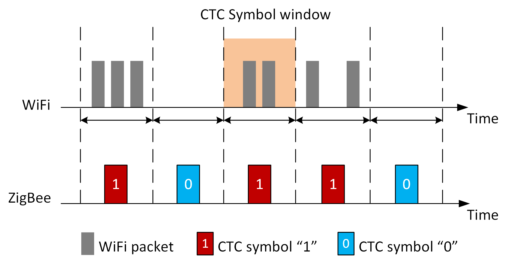
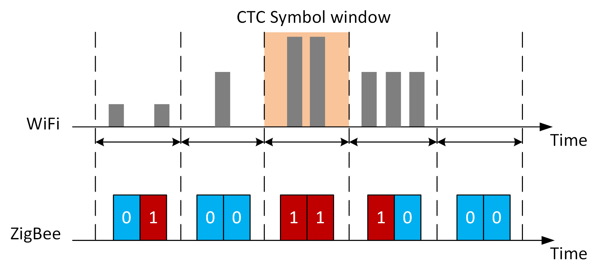
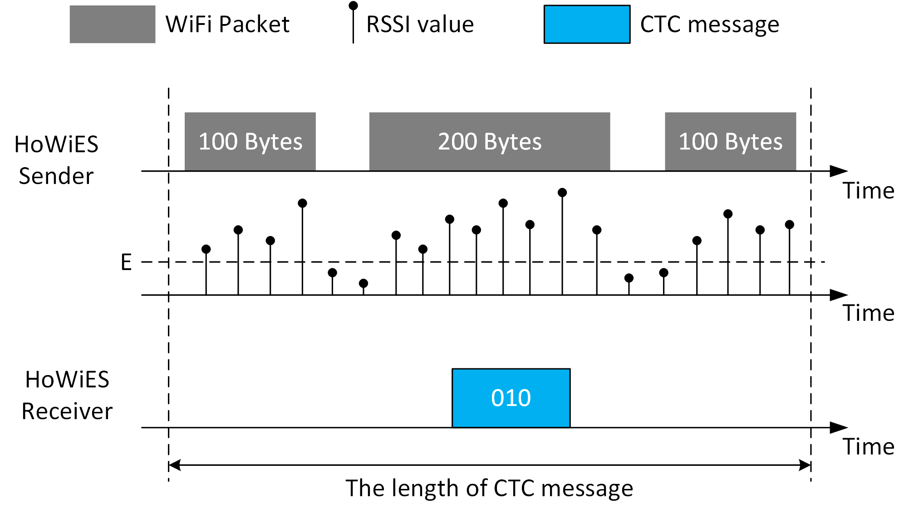
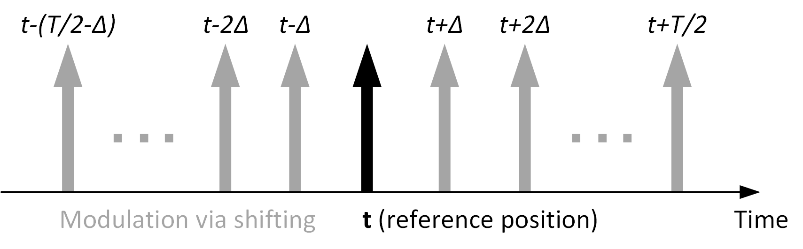
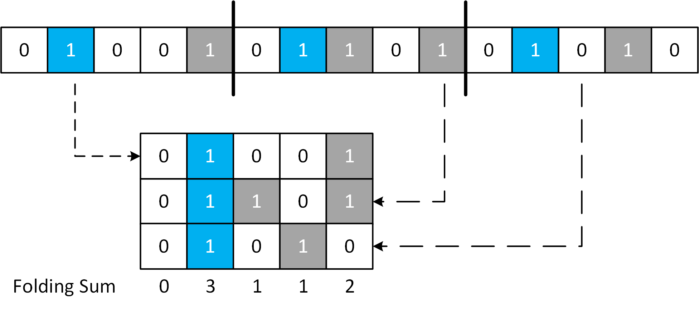
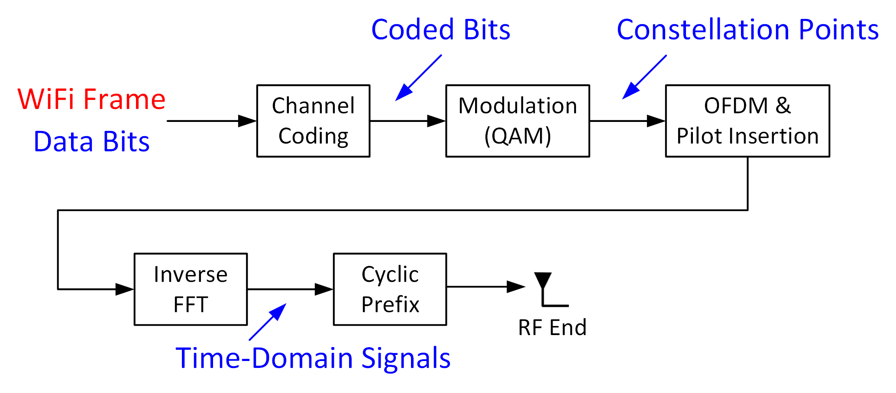
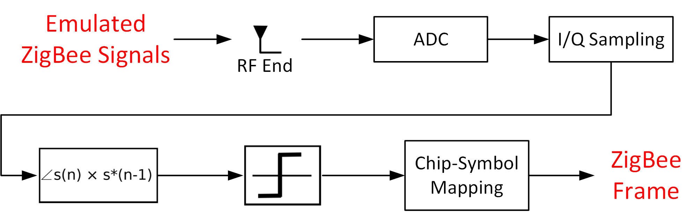
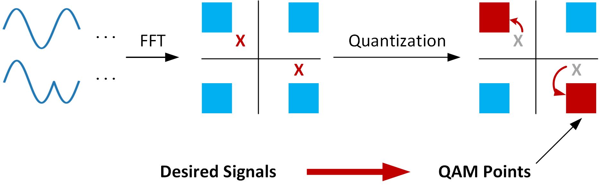

# 跨协议通信

跨协议通信技术（Cross-Technology-Communication, CTC）是指两种不同的通信协议可以相互通信的技术。当前的CTC研究主要集中在Bluetooth、ZigBee、WiFi三种协议之间的互相通信。

​	根据实现方法的不同，跨协议通信技术主要可以分为四类：基于振幅的跨协议通信、基于数据包长度的跨协议通信、基于数据包间隔的跨协议通信和基于物理信号的跨协议通信。

##1. 基于振幅的跨协议通信

​	无线通信协议如ZigBee具有信道监测机制，可以监测信道上的能量强度。当信道中存在WiFi数据包时，信道的能量强度会显著高于信道空闲的状态。因此，通过信道能量强度的大小，可以判断当前信道上是否存在WiFi数据包。基于振幅的跨协议通信[1] [2]利用ZigBee的信道监测机制，实现了从WiFi到ZigBee的通信。基于振幅的跨协议通信的原理如图1所示：

​	在发送端，WiFi设备通过在一个时间片内发送数据包包的方式和ZigBee进行通信。在一个时间片内，如果编码数字‘1’，则WiFi设备会在该时间片内持续发送数据包；如果表示数字‘0’，则不发送数据包。在接收端，ZigBee设备持续监听信道中是否存在WiFi数据包。如在该时间片内监测到了WiFi数据包，则解码为‘1’；否则解码为‘0’。由于信道中存在噪声，当噪声较大时，即使WiFi设备没有发送数据包，信道中的能量强度仍可能会在某些采样点超过能量阈值，导致接收端误认为信道中存在WiFi数据包，将’0‘误解码为’1‘。为了增强系统的鲁棒性，在一个时间片内，系统会对当前信道的RSSI值进行多次采样，当平均RSSI的值大于给定的阈值时，则认为当前窗口内存在WiFi数据包，当前信号解码为‘1’；否则解码为‘0’。另外一种解码方法是将每个RSSI采样和阈值进行比对，该阈值表示WiFi发送数据包的最小能量，如果在一个时间片内，大于该阈值的采样点的比例超过一定的百分比，则解码为‘1’，否则解码为‘0’。完成一个时间片的解码后，系统移动到下一个时间片，直至解码所有的数据包。

 

 

 
图1. 基于振幅的跨协议通信原理

 

​	
​上述方法可以实现最基本的跨协议通信，但是每个时间片内仅能传输1bit长度的数据，传输速率很低。WiZig[2]针对该编码方式进行了改良，在一个时间片内，通过改变信号强度的大小表示不同的数据。这种编码方式的好处是在一个时间片可以编码多个bit，提高通信速率。如图2所示，WiFi设备通过三种不同的信号强度，分别编码‘01’，‘10’和‘11’，无WiFi信号则编码‘00’。通过这种编码方式，可以将传输速率提高一倍。理论上，如果WiFi信号被分为M种不同的能量强度，则每次可以编码log2M位数据，大幅提高了传输速率。

 
 

 

 
图2. WiZig编解码原理：在一个时间片内，通过改变振幅的强弱，可以编码多位数据

 

 
##2. 基于数据包长度的跨协议通信

​除数据包的振幅之外，利用数据包的长度，同样可以对信号进行编码，实现跨协议通信。Esense[3]第一个实现了基于数据包长度的从WiFi到Zigbee的跨协议通信，通过统计WiFi数据包长度，Esense建立了WiFi数据包长度的概率分布，并筛选出出现概率较低的数据包长度用于信号编码。不同的数据包长度可以编码不同的数据，设可用的数据包长度的数量为n，则每次可编码的比特数为$log2(n)$。在接收端，Zigbee节点通过感知数据包的持续时间，可以计算出信号的编码。

HoWiES[4]在Esense的基础上进行了改进，增强了数据的传输速率。本部分以HoWiES为例，详细介绍基于数据包长度的跨协议通信方法。HoWiES的主要技术可以分为两个部分：构建字典、数据调制解调。下面分别对两部分技术进行介绍：

1. 构建传输字典。传输字典A由一组数量为b的数据包长度组成：$A=\{S_1,...,S_i,...,S_b\}$，其中$S_i$表示数据包长度。一个CTC数据包由一系列的WiFi数据包组成，每个数据包的长度由其表示的字符和传输字典决定。为了保证ZigBee可以正确检测到CTC数据包，构成CTC数据包的每个WiFi数据包的长度需要和正常的WiFi数据包进行区分。因此，作者在构建传输字典时，选择用低传输速率传输大字节量的数据包，这样可以使得每个WiFi数据包的时长明显大于正常的数据包，便于ZigBee区分CTC数据包和正常的WiFi数据包。此外，字典中任意两个数据长度的差别应该足够大，这样可以降低CTC的误码率。建立好传输字典后，把该字典分别存储在发送端和接收端，用于数据的调制和解调。

2. 数据调制与解调。发送端进行数据调制时，根据要发送的数据M，在传输字典A中查询到其对应的WiFi数据包长度l，然后发送l长度的WiFi数据包。接收端以固定频率H对信号的RSSI进行采样，如果RSSI的值超过了某个阈值E，则认为检测到了一个CTC采样点。接收端进而根据CTC采样点的多少，计算出CTC数据包的长度，然后根据传输字典进行解码。

​图3是一个基于数据包长度的跨协议通信示例，其中，传输字典为{100，200}，100表示‘0’，200表示‘1’。数据包“010”的调制和解调如图中所示。

 

 

 
图3. 基于数据包长度的跨协议通信原理示意图

 

 
##3. 基于数据包间隔的跨协议通信

​在FreeBee[5]中首次提出了基于数据包间隔的跨协议通信，其核心思想是通过调整周期性beacon包的发送时间，对数据包进行编码。Beacon数据包广泛存在于各种无线通信协议中，利用beacon数据包进行编码，具有更广泛的适用性，而且不会带来额外的通信开销。FreeBee的编码方式如图4所示，假设未经调整的beacon数据包是一个从t时刻开始，周期为T的信号，FreeBee通过将beacon数据包的发送时间在范围(-T/2, T/2]内移动来进行编码。每次移动的幅度均为某个时间Δ的整数倍，因此，可以通过计算beacon数据包的时间偏移，获得编码的数据。在FreeBee中，Δ的值设为1.024ms，而beacon包的发送周期为102.4ms，因此每次传输可以编码6 bits的数据。由于Beacon包的位置检测可能受到噪声影响，因此，FreeBee中每个数据包对应多个重复的Beacon包，重复的次数和信道的噪声有关。此外，为了使接收端能够确定Beacon包的参考位置，发送端会先发送一段未经调制的Beacon包作为前导码，之后再发送调制后的Beacon包。

 

 

 
图4.基于数据包间隔的跨协议通信原理示意图

 

​FreeBee的解码过程如下：接收端持续对信道进行监听，采集信道中的RSSI信息，确定Beacon包的参考位置。然后根据每个数据编码Beacon包的重复次数，和Beacon包的周期，利用folding[6]的方法计算Beacon包的时间偏移。Folding的过程图5所示，接收端根据Beacon数据包的发送周期T，和采样率H，计算出每个周期的RSSI序列长度L，并将采样序列分割为长度为L的子序列。设每个数据包需要P个重复的Beacon包进行调制，则对P组采样序列进行folding，并对folding产生得到的矩阵的每一列进行求和。和最大的列的位置即为Beacon包的真实偏移，根据偏移的位置，可以解码出接收到的数据包。

 

 

 
图5.Folding解码过程示意图

 

##4. 基于物理信号的跨协议通信

​相较于其他跨协议通信方式，基于物理信号的跨协议通信在通信速率上实现了质的飞跃。同前三种跨协议通信方式不同，基于物理信号的跨协议通信无需修改物理层的通信方式，更加便于部署。WEBee [7]是此类跨协议通信技术的代表，下面以WEBee为例，介绍基于物理信号的跨协议通信的原理。

​WEBee实现了从WiFi到ZigBee之间的跨协议通讯。和前文提到的方法不同，WEBee的核心思想是利用WiFi数据包直接模拟ZigBee数据包，ZigBee接收端可以以ZigBee本身的解码方式解码WiFi数据包，无需修改物理层硬件。实现该目标需要使用WiFi模块模拟ZigBee数据包的时域信号，使得模拟的ZigBee信号可以通过ZigBee的前导码检测和OQPSK解码。

​由于WEBee利用WiFi信号模拟ZigBee信号，在介绍WEBee的核心方法之前，我们先介绍WiFi的调制方法和ZigBee的解调方法。

​**WiFi调制**：WiFi信号的编码过程如图6所示，信道编码模块在WiFi数据中插入冗余编码，以提高信号编码的鲁棒性；然后调制模块采用正交振幅调制（QAM），将编码数据转为一系列的星座图；之后，使用正交频分复用技术（OFDM），将星座图调制到48路数据载波上；然后，将得到的频域信号通过逆傅里叶变换（Inverse FFT）转为时域信号；之后，WiFi调制器在时域信号前加入循环前缀；最后，调制得到的WiFi信号通过RF端发送出来。

​为了实现从WiFi到ZigBee的通信，WEBee需要对WiFi的编码过程进行逆向操作。WEBee首先生成理想的ZigBee信号，然后通过逆向操作，计算得到对应的WiFi数据。
​
 

 

 
图6.WiFi信号编码过程

 

​**ZigBee解调**：ZigBee的物理层解码如图7所示。由于WiFi和ZigBee均工作在同样的ISM频段，WiFi信号可以被ZigBee设备捕捉到。当ZigBee接收到信号时，ZigBee的RF端首先将WiFi的通带信号转为基带信号，然后使用模数转换器（ADC）将模拟信号转为物理信号。ZigBee使用偏移四相相移键控调制（OQPSK），通过相邻两个采样点之间的相移来调制信号。在解码时，假设两个相邻的复数采样点分别为s(n)和s(n-1)，则相移可以通过arctan(s(n) x s\*(n-1))计算得到，其中，s\*(n-1)表示s(n-1)的共轭。如果计算得到的相移大于0&deg;，则解码为“1”，否则解码为“0”。每解码出32个采样点的值，ZigBee解码器根据DSSS预定义好的扩频关系，将该32位值映射为4bit位数据。

 

 

 
图7.ZigBee信号解码过程

 

WEBee的核心方法主要包含三个部分：1）QAM模拟；2）信道编码模拟；3）QAM模拟后处理。

* **QAM模拟。**QAM模拟的原理如图8所示，系统首先合成想要发送的理想ZigBee时域信号，然后通过傅里叶变换，计算出对应的QAM星座图。然而，理想ZigBee信号在频域上的成分和WiFi信号的QAM星座图不一定能够完全对应，进而导致QAM数字化误差。帕塞瓦尔定理表明，信号在时域上的能量和在频域上的能量相等，因此，最小化信号在时域上的失真，等同于最小化信号在频域上的偏差。因此，QAM模拟通过选择出n个和ZigBee信号最接近的QAM星座点，使合成的WiFi和理想ZigBee信号的差异最小。
 

 

 
图8.QAM模拟过程示意图

 

* **信道编码模拟。**前文提到，WiFi信道编码在原数据中插入冗余码，增加了WiFi的抗噪性能。信道编码模拟过程，则是信道编码的逆变换，已知插入冗余码之后的数据，求解原数据。该步骤可以通过矩阵求解的方法计算得到。

* **QAM模拟后处理。**该环节用于弥补前两个阶段中由于WiFi和ZigBee协议的差异所带来的问题。第一，ZigBee的symbol长度是WiFi的4倍，因此，在跨协议通信中需要把4个WiFi数据包拼接在一起，而拼接会增加误码率；第二，WiFi数据包中包含循环前缀，而ZigBee数据包中不包含该结构，循环前缀码也会带来额外的误码率。因此，WEBee采用了前向纠错码和重传机制来减少误码率。

 

##5. 参考文献

* [1] S. Yin, Q. Li, and O. Gnawali, “Interconnecting wifi devices with ieee 802.15. 4 devices without using a gateway,” in Proceedings of DCOSS, 2015.

* [2] X. Guo, X. Zheng, and Y. He, “Wizig: Cross-technology energy communication over a noisy channel,” in INFOCOM, IEEE, 2017.

* [3] K. Chebrolu and A. Dhekne, “Esense: communication through energy sensing,” in Proceedings of ACM MobiCom, 2009.

* [4] D. Croce, N. Galioto, D. Garlisi, F. Giuliano, and I. Tinnirello, “An intertechnology communication scheme for wifi/zigbee coexisting networks,” in Proceedings of ACM EWSN, 2017.

* [5] S. M. Kim and T. He, “Freebee: Cross-technology communication via free side-channel,” in Proceedings of ACM MobiCom, 2015.

* [6] D. H. Staelin, “Fast folding algorithm for detection of periodic pulse trains,” Proceedings of the IEEE, vol. 57, no. 4, pp. 724–725, 1969.

* [7] Z. Li and T. He, “Webee: Physical-layer cross-technology communication via emulation,” in MobiCom, ACM, 2017.

##6. 致谢

感谢软件学院博士生郭秀珍，为本章内容提供了大量的材料与帮助。