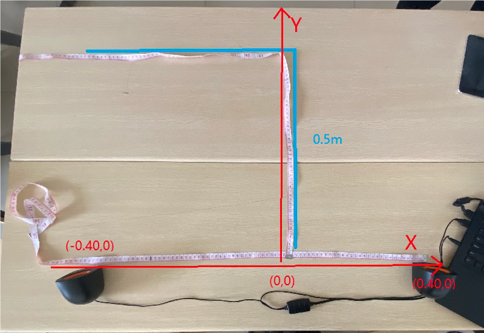
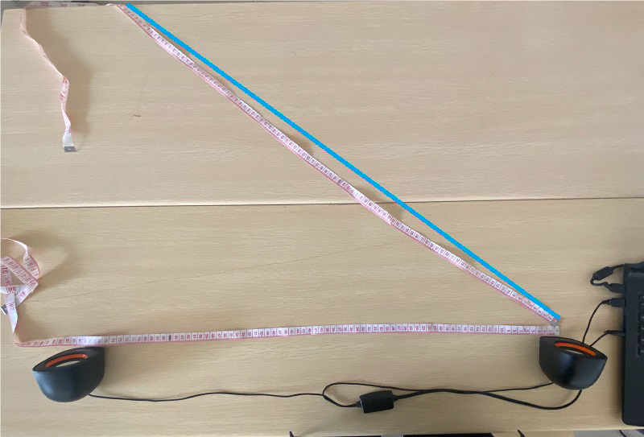
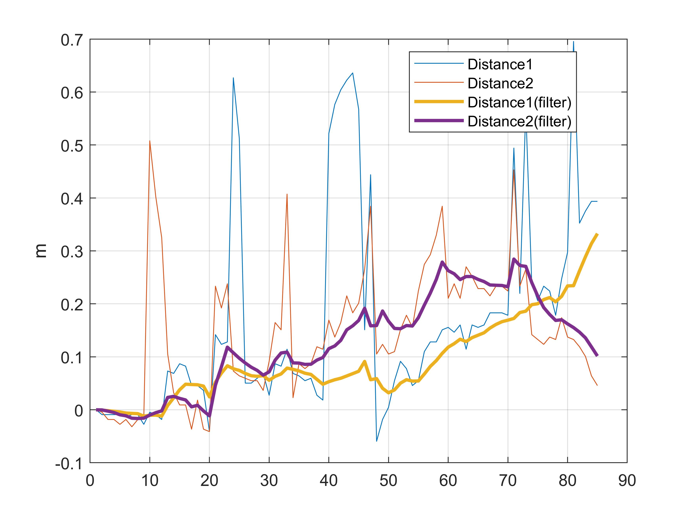
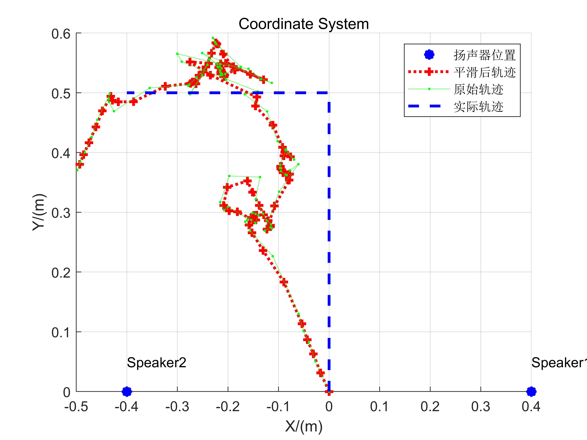
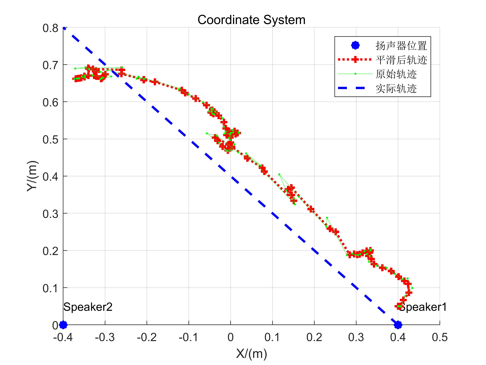

# 基于FMCW的二维追踪方法

本追踪实验是基于FMCW 的测距原理，通过比较发送信号与接收信号的频率在移动中的变化，计算出距离的变化情况，进而通过多组基站对待测目标距离的同时测量，对待测目标进行连续的跟踪定位。

同样地，我们使用智能手机平台以及扬声器开展实验。
## 系统设计

**信号设计**

二维定位至少要求获取麦克风到两个扬声器的距离变化情况。因此我们在硬件和信号设计方面都有着与一维测距不同设计。

在硬件方面，我们仍然使用普通的智能手机作为接收端；而在发送端方面，我们使用了具有两个喇叭的普通USB音响，利用其两个喇叭作为信号的发送装置。

在信号设计方面，我们利用音响支持双通道播放的特性，运用分时策略，避免了处理时的滤波和对齐操作。具体来说我们发送的信号如下:

`用于确定开始点的chirp + 左右两声道的分时chirp`

以100ms为周期的左右两声道的分时chirp 的构成如下：(`$` 代表chirp 信号，空格则代表空白)

~~~
+------------------------------------+
| 40ms       |10ms| 40ms        |10ms| <- duration: 100ms
+------------------------------------+
|$$$$$$$$$$$$|    |             |    | <- right channel
+------------------------------------+
|                 |$$$$$$$$$$$$$|    | <- left channel
+------------------------------------+
~~~

**定位与追踪步骤**
- 获取信号开始点，为了应对一维测距中“先接近后远离”反而实测距离先增大后减小的情况，我们特意将起始点向前调整100-200 个采样点，这样就可以将距离的起始值增大，可以分辨出一开始距离就变小的情况。
- 由于左右两声道信号是同步的，我们可以直接根据一维测距同样的方法利用时间片拆分的左右两声道信号来判断到两个喇叭的距离情况。但我们也注意到一个周期内测量到两个喇叭的距离的时刻实际上具有50ms的时间差，但考虑到我们测量是在低速情况下进行的，这一点系统误差对于二维定位可以忽略。
- 我们使用hampel滤波和卡尔曼滤波的方法对于测量值进行处理，尽量减少测量中异常值的干扰和随机扰动的影响。
- 对所有距离测量值减去初始值(第一个所测值) 后就得到了距离的变化情况，我们在给定初始出发点的情况下使用两圆求交的算法对二维位置进行确定。

## 实验与分析

我们分别在三种场景下进行了二维定位实验，实验场景如下面的图片所展示：

    
     
    
图. 垂直移动实验场景

    
     
    
图. 斜线移动实验场景

   
     
    
图. 水平移动实验场景

| 序号 | 起始位置 | 喇叭位置 | 移动方式 |
| --  | ------    | ---- | --- |
|  1  | (0,0) |(0.40,0) (-0.40,0) | 垂直移动|
|  2 |(0,0) | (0.40,0) (-0.40,0) |垂直移动 |
|  3 | (0.40, 0.05) | (0.40,0) (-0.40,0) |斜线移动|
|  4 | (0.40, 0.05)| (0.40,0) (-0.40,0) |斜线移动|
|  5 | (0.40, 0.42) |(0.40,0) (-0.40,0) |水平移动|

## 实验结果

**距离测量**

    
     
    
图. 实验1距离测量结果

    
     
    
图. 实验2距离测量结果

    
     
    
图. 实验3距离测量结果

   
     
    
图. 实验4距离测量结果

    
     
    
图. 实验5距离测量结果

从这实验3, 实验4, 实验5这三个样例我们可以看出，应用滤波器后测量的距离数据能够较好的被平滑处理，即使有较大的初始误差或者较长的连续偏离片段，结果也能够比较好的纠正回来。

## 定位结果

    
     
    
图. 实验1追踪效果

   
     
    
图. 实验2追踪效果

    
     
    
图. 实验3追踪效果

    
     
    
图. 实验4追踪效果

    
     
    
图. 实验5追踪效果

我们测量的轨迹情况能够大致地反映实际地移动情况，但误差仍然较大。这一方面是使用距离变化量需要较为精确的基准值，一旦初始值有较大偏差就会导致误差积累。另一方面，实验中智能手机的移动需要靠人工控制，人工移动过程中的抖动也导致了许多的偏差。

## 实验代码与数据

**追踪实验代码**

~~~matlab
%% 发送信号生成部分
fs = 44100;
T = 0.04;
chirp_samples = T *fs;
stop06 = 0.06;
stop05 = 0.05;
stop01 = 0.01;
f0 = 16000; % start freq
f1 = 18000;  % end freq

blank06 = zeros(1,stop06*fs);
blank05 = zeros(1,stop05*fs);
blank01 = zeros(1,stop01*fs);
t = (0:1:T*fs-1)/fs;
data = chirp(t, f0, T, f1, 'linear');
output = [];
bf0 = 8000;
bf1 = 9000;
begin = chirp(t, bf0, T, bf1, 'linear');
repeat = 85;
~~~

~~~matlab
%% 接收信号读取、滤波、寻找起始位置及计算频率偏移
filename = '5.wav'; % 在此更改文件名
[mydata,fs] = audioread(filename);

mydata = mydata(:,1);
[c, lags] = xcorr(mydata, begin);
[~, i] = max(abs(c));
idx = lags(i);

hd = design(fdesign.bandpass('N,F3dB1,F3dB2',6,14000,20000,fs),'butter');
mydata=filter(hd,mydata);

%% 生成pseudo-transmitted信号
pseudo_T = [];
for i = 1:repeat
    pseudo_T = [pseudo_T,data,blank01,data,blank01];
end
 
[n,~]=size(mydata);
 
% fmcw信号的起始位置在start处
start = idx+0.1*fs-100; 
pseudo_T = [zeros(1,start),pseudo_T];
[~,m]=size(pseudo_T);
pseudo_T = [pseudo_T,zeros(1,n-m)];
 
s=pseudo_T.*mydata';
 
len = (0.1*fs); % chirp信号及其后空白的长度之和
fftlen = 1024*64; %做快速傅里叶变换时补零的长度。在数据后补零可以使的采样点增多，频率分辨率提高。可以自行尝试不同的补零长度对于计算结果的影响。
f = fs*(0:fftlen -1)/(fftlen); %% 快速傅里叶变换补零之后得到的频率采样点

%% 计算每个chirp信号所对应的频率偏移
deltaf1 = [];
deltaf2 = [];
for i = start:len:start+len*(repeat-1)
   chunk1 = s(i:i+chirp_samples);
   chunk2 = s(i+length(blank05):i+length(blank05)+chirp_samples);
   FFT_out1 = abs(fft(chunk1,fftlen));
   FFT_out2 = abs(fft(chunk2,fftlen));
   [~, index1] = max(FFT_out1);
   [~, index2] = max(FFT_out2);
   deltaf1 = [deltaf1 f(index1)];
   deltaf2 = [deltaf2 f(index2)];
end
 
%% 计算距离变化量
D1 =  deltaf1 * 340 /(f1-f0) * T;
D2 =  deltaf2 * 340 /(f1-f0) * T;
figure
plot(D1)
hold on
plot(D2)
legend('Distance1', 'Distance2' )

start = 1 % 由于前面的采样点的误差会导致累计偏差，在此舍去前面的一些采样点
D1 = D1(start:end);
D2 = D2(start:end);
~~~

~~~matlab
%% 滤波去噪与轨迹图显示
figure;
plot(D1-D1(1));
hold on;
plot(D2-D2(1));
kd1 = kalman(hampel(D1,15), 5e-4, 0.0068);
kd2 = kalman(hampel(D2,15), 5e-4, 0.0068);
kd1 = kd1 - kd1(1);
kd2 = kd2 - kd2(1);
kd1 = hampel(kd1, 7);
kd2 = hampel(kd2, 7);

%% 显示距离变化
plot(kd1, 'LineWidth',2);
plot(kd2, 'LineWidth',2);
grid on
legend('Distance1', 'Distance2','Distance1(filter)', 'Distance2(filter)' )
legend('Location','best')
ylabel('m')

%% 计算二维位置
if strcmp(filename, '1.wav') ||strcmp(filename, '2.wav')
    start = [0, 0];
end
if strcmp(filename, '3.wav') ||strcmp(filename, '4.wav')
   start = [0.40, 0.05];  
end

if  strcmp(filename, '5.wav')
   start = [0.40, 0.42];  
end
speakers = [0.40 0; -0.40 0];
pd1 = pdist([start; speakers(1,:)]);
pd2 = pdist([start; speakers(2,:)]);

kd1 = kd1 + pd1;
kd2 = kd2 + pd2;
xs = zeros(1,length(kd1));
ys = zeros(1,length(kd1));
figure
scatter([0.40 -0.40], [0 0] ,'b*', 'LineWidth',5,'DisplayName','扬声器位置')
xlabel('X/(m)')
grid on

text(0.40,0.05,'Speaker1')
text(-0.40,0.05,'Speaker2')
ylabel('Y/(m)')
title('Coordinate System')
hold on
xs(1) = start(1);
ys(1) = start(2);
for i= 2:length(kd1)
    [xout,yout] = circcirc(speakers(1,1),speakers(1,2),kd1(i),speakers(2,1),speakers(2,2),kd2(i));
    xs(i) = real(xout(2));
    ys(i) = real(yout(2));
    if isnan(xs(i))
       xs(i) = xs(i-1);
       ys(i) = ys(i-1);
    end
    
end
xs_ = kalman(xs,5e-2, 0.05);
ys_ = kalman(ys, 5e-2, 0.05);

plot(xs_,ys_,':r+', 'LineWidth',2, 'DisplayName','平滑后轨迹');
plot(xs,ys,':g.', 'DisplayName','原始轨迹');

if strcmp(filename, '1.wav') ||strcmp(filename, '2.wav')
    plot([0 0 -0.40],[0 0.5 0.5], '--b','LineWidth',2, 'DisplayName','实际轨迹')
end

if strcmp(filename, '3.wav') ||strcmp(filename, '4.wav')
    plot([0.40  -0.40],[0 0.8], '--b','LineWidth',2, 'DisplayName','实际轨迹')
end

if  strcmp(filename, '5.wav')
    plot([0.40 -0.40],[0.42 0.42], '--b','LineWidth',2, 'DisplayName','实际轨迹')
end
legend
~~~

~~~matlab
%% 卡尔曼滤波器
function xhat =  kalman(D, Q, R)
    sz = [1 length(D)];
    xhat = zeros(sz); 
    P= zeros(sz);
    xhatminus = zeros(sz);
    Pminus = zeros(sz);
    K = zeros(sz);
    xhat(1) = D(1); 
    P(1) =0; % 误差方差为1
    
    for k = 2:length(D)
        % 时间更新（预测）
        % 用上一时刻的最优估计值来作为对当前时刻的预测
        xhatminus(k) = xhat(k-1);
        % 预测的方差为上一时刻最优估计值的方差与过程方差之和
        Pminus(k) = P(k-1)+Q;
        % 测量更新（校正）
        % 计算卡尔曼增益
        K(k) = Pminus(k)/( Pminus(k)+R );
        % 结合当前时刻的测量值，对上一时刻的预测进行校正，得到校正后的最优估计。该估计具有最小均方差
        xhat(k) = xhatminus(k)+K(k)*(D(k)-xhatminus(k));
        % 计算最终估计值的方差
        P(k) = (1-K(k))*Pminus(k);
    end
end
~~~

**数据文件**

- [1.wav](./res/1.wav)
- [2.wav](./res/2.wav)
- [3.wav](./res/3.wav)
- [4.wav](./res/4.wav)
- [5.wav](./res/5.wav)