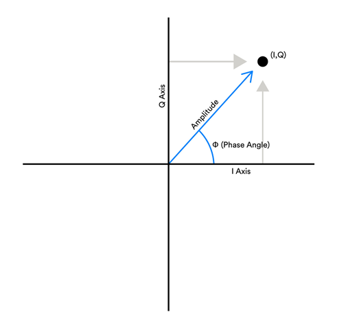
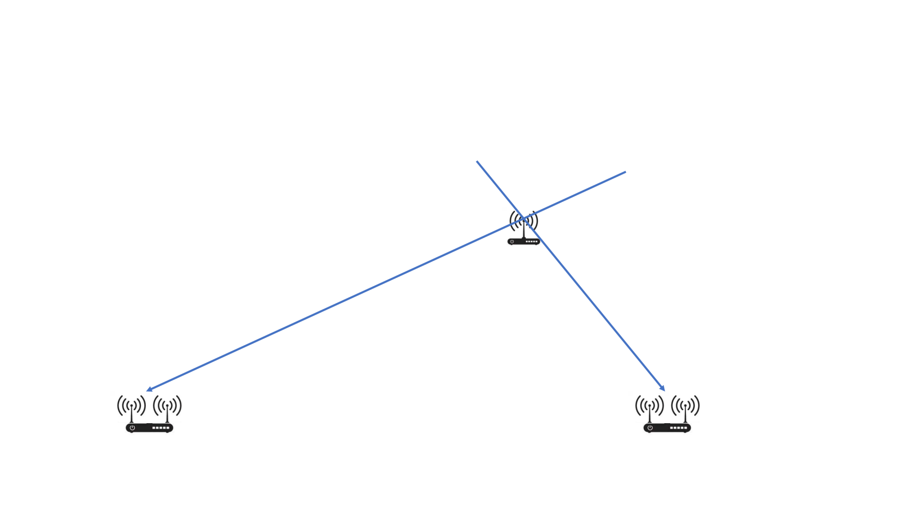
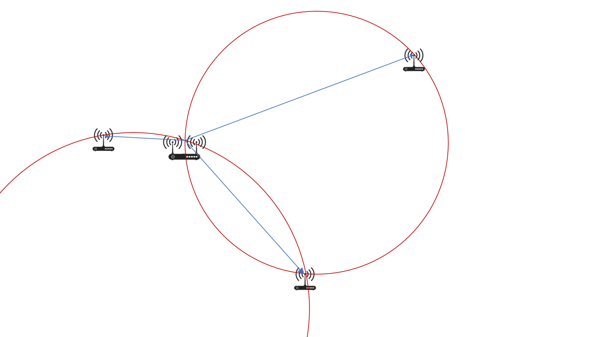
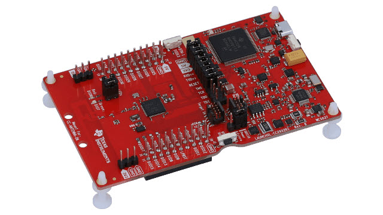

# 蓝牙感知

## 蓝牙发展历史
蓝牙技术开始于 1994 年爱立信提出的一项方案，该方案希望研究出能够在移动电话和其他配件之间进行低功耗、低成本无线通信连接的方法。1997 年，爱立信通过蓝牙这一概念接触了移动设备制造商，得到了制造商的支持。1998 年，爱立信联合英特尔，IBM，诺基亚以及东芝公司成立了蓝牙特别兴趣小组（Special Interest Group, SIG），即蓝牙技术联盟，旨在开发一个低成本、高效益、可以在短距离范围内随意无线连接的蓝牙标准技术。从 1998 年至今，蓝牙经历了从 1.0 到 5.2 多个重要版本的更新。

1999 年，蓝牙技术联盟提出蓝牙 1.0 标准；2001 年，提出蓝牙 1.1 标准；2003 年，提出蓝牙 1.2 标准，1.2 标准增加了抗干扰跳频功能以及匿名方式。上述阶段为第一代蓝牙技术发展阶段，是关于短距离通讯早期的探索。

2004 年，蓝牙 2.0 标准新增 ED（Enhanced Data Rate）技术；2007 年，蓝牙 2.1 标准新增 Sniff Subrating 省电功能。第二代蓝牙进入了发力传输速率的 EDR 时代。

2009 年，蓝牙 3.0 标准增加了可选技术 High Speed。第三代蓝牙传输速率高达 24Mbps，远高于 2.1 标准的 3Mbps 以及 1.2 标准的 1Mbps。

2010 年，蓝牙 4.0 标准提出了低功耗蓝牙、传统蓝牙和高速蓝牙三种模式；2013 年，蓝牙 4.1 标准提升了蓝牙连接速度并且使得蓝牙更加智能化；2014 年，蓝牙 4.2 标准改善了数据传输速度并且提高了隐私保护程度。第四代蓝牙主推低功耗模式，功耗较老版本降低了 90%。

2016 年，蓝牙 5.0 标准提出了功耗更低、覆盖更广、速度更快的蓝牙标准；2019 年初，蓝牙 5.1 标准增加了 direction finding 寻向功能，可以用来检测蓝牙信号的方向，进一步提升蓝牙位置相关服务；2019 年底，蓝牙 5.2 标准针对低功耗蓝牙（BLE）新增 LE 同步信道、增强版 ATT、LE 功率控制等新功能。第五代蓝牙正式开启物联网时代大门。

## 蓝牙寻向基本原理
2019 年初，蓝牙 5.1 标准增加了寻向功能，可以用来检测蓝牙信号的方向，理论上可以进一步提高蓝牙定位的精确的。

蓝牙 5.1 寻向功能依靠天线阵列在空间上的不同位置带来时间上的相位偏差。根据被定位设备的上下行模式的不同，可以将寻向功能分成 AoA 到达角度法（Angle of Arrival）和 AoD 出发角度法（Angle of Departure）。

在 AOA 定位场景中，被定位设备，比如贴在被定为物上的便携蓝牙 tag，用单根天线广播定位用数据包。接收端则拥有一组天线阵列，一齐接收这一个数据包。由于天线阵列中不同天线到发送端的距离不同，这一距离差就会带来相位差，即不同天线在同一时间接收到的信号的相位有一定差异。接收端会快速轮询各个天线，每根天线都会记录若干个采样点的 I/Q 值（见图 2.2)，这些 I/Q 值可以算出当前采样时刻的信号相位，从而根据天线间的相位差即可算出入射角 AOA。

图. AoA/AoD 基本模式

图. I/Q 值和相位的关系

AOD 定位场景与之相反，被定位的物体需要通过天线阵列同时广播定位用数据包，而接收者用单根天线接收。类似地，由于距离不同，接收者在同时接收天线阵列的广播信号时，接收到不同天线的信号相位是不同的。发射者交替使用发射阵列中的各根天线发射，接收者在每次天线切换时就会感知到相位的跳变，据此可算出距离差，从而完成定位。AOA 定位只需要两个固定定位节点，而 AOD 如果不知道阵列的确切朝向，需要 3 个节点才能完成；除此之外，AOD 的劣势在于被定位者需要拥有天线阵列，受到被定位物体的空间和能耗的限制；而优势在于其可以提供 AOA 无法提供的朝向信息，因此往往用于室内定位系统（Indoor Positioning System：IPS），给用户在体育馆，商场等地形复杂的室内环境（这些环境下由于音响，金属物体等干扰，手机指南针都会时常失灵）提供精确便捷的导航。

在蓝牙 5.1 中伴随着 AOA 和 AOD 的引入，还定义了固定频率扩展信号（Constant Tone Extension：CTE），这是在包尾附带的若干个 0 或者 1，在蓝牙协议中，这一串 0 或 1 会被翻译成频率稳定的正弦波发射出来。蓝牙 5.1 标准规定，无论主从，都可以发起一个 LL_CTE_REQ PDU，要求对方发送 CTE；其中的 CTETypeReq 字段也描述了请求的定位模式是 AOA 还是 AOD，以及发送时天线的切换间隔。同时，蓝牙 5.1 也对天线阵列接收/发送的时间表做出了明确的规定，见下图。

图. 蓝牙 5.1 规定的 AOA/AOD 时间表

下面以 AOA 为例介绍蓝牙定位的基本原理。

蓝牙定位中计算 AOA 的具体原理如下：

AOA 定位中，发射端用单根天线发送一段正弦波，接收端用天线阵列接收这一信号，计算信号的入射角。先假设定位时天线阵列能同时接收信号。下图绘制了接收端的情况。

图. AOA 定位原理图

发射天线向接收端天线阵列中，相距位 d 的两根天线阵列接收来自被定位蓝牙设备发出的蓝牙信号，以图中蓝色箭头表示。由于这两根接收天线到发射天线的距离不同，这两根天线收到的信号会出现一个恒定的相位差。而因为发射端到天线的距离远大于 d，发射天线这两个接收天线的路径可以视为平行。在这一假设下，从一根天线向另一根作垂线，截取出的$r$直角边就是路程差。显然，在这个直角三角形中，有：

$$ r = d\sin{\theta} $$

$\theta$表示AoA。另一方面，相位差与路程差的关系为：

$$ \Delta\phi = \frac{2\pi}{\lambda} r $$

其中$\Delta\phi$代表相位差，$\lambda$表示蓝牙波长。根据上述公式，可以推导出AoA：

$$ \theta = arc\sin{\frac{\lambda\Delta\phi}{2\pi d}}$$

在算出方向角后，就可以根据被定位设备到不同定位点的方向角算出其具体位置。

AOA 场景下，只要知道接收天线阵列的位置和朝向，只需要两个点即可完成定位。每个定位点感知到的方向角都会将被定位设备约束在一条直线上，而两条直线的交点即为其确切位置，如下图：

图. AOA 两点定位

而 AOD 场景下，如果不知道发射天线的确切朝向，需要三个接收天线才能锁定其位置。这是因为接收天线的朝向不确定增加了一个自由度，或者说，现在知道的确切信息只有被定位点感知到的接收天线之间的夹角，两个接收天线只能将其定位在一个圆上，而三个接收天线可形成两个夹角，画出两个圆，其交点即为目标位置。

图. AOD 三点定位

三根天线的情形下不止能完成定位，也可以顺带算出当前发射天线的朝向，这是 AOA 做不到的。这在导航系统等应用中至关重要。

不过，在仅有两根接收天线的场景下，可以通过指南针等额外手段获得其朝向，完成定位。由于知道了当前朝向即可推算地球坐标系下接收天线的方位角，这种定位的原理和 AOA 相同。不过，在这种情况下，定位结果对朝向信息较为敏感，在室内定位场景中，指南针往往会有较大的误差，导致在只有两根接收天线时，这种定位方式的误差较大。

以上是蓝牙定位的原理部分介绍。下面介绍用到的硬件和具体的实验流程。

## 定位设备调研和实践

敬请期待。。。
<!-- 对于当前市场上声称可以进行开发并且实现蓝牙 AoA 的部分设备，我们进行了一系列调研和实践，设备和主要的算法效果如下：
### 1. telink AoA 设备
蓝牙 AoA 高精度定位技术白皮书》中介绍到泰凌微（telink）电子（上海）有限公司。该公司成立于 2010 年，是一家以高集成度低功耗物联网系统级芯片为主要研发方向的中美合资芯片设计公司。泰凌微电子目前有 TLSR825x 系列以及 TLSR827x 系列蓝牙芯片支持 AoA/AoD 功能。

我们购买了 TLSR8278 相关开发套件，并且按照 http://wiki.telink-semi.cn/wiki/chip-series/TLSR827x-Series/ 中相关介绍进行操作，以获取 AoA 信息。

但是实验结果表明，在使用过程中，无论被定位物体位置如何变化，该套开发设备获取的 AoA 数据值保持不变，并不能够成功获取 AoA 信息。同时该套开发设备也不能提供蓝牙相位信息，无法进行个人开发。
### 2. 德州仪器
德州仪器进行蓝牙 AoA 定位模块的设备包括 Master, Passive 和 Slave 三种节点，对应其在 BLE 通信中的三种角色。Slave 会在 Master 的命令下广播含有 CTE 的蓝牙数据包，而 Master 和 Passive 带有接收天线阵列，负责接收这些广播包并计算 AoA。这套设备支持一个 Master 对多个 Slave 和多个 Passive，但不支持多个 Master 出现在一个定位场景中，即不支持一个 Slave 连接多个 Master，这是受到了蓝牙协议的限制。

德州仪器的定位原理基于蓝牙 5.1 协议新提出的 Constant Tone Extension (CTE) 机制。通过在数据包末尾发送一连串的 0 或者 1，相当于发送一束频率恒定的正弦波。这样就和其它天线阵列定位手段类似，用天线阵列之间的相位差换算成传输路程差，再结合天线之间的相对位置和距离，就可以算出入射角 AoA 了。

另外，德州仪器提供的天线阵列一组包含三根沿直线分布的天线，因此只能分辨 180°范围内的 AoA，而无法区分信号是从天线阵列的哪一侧传来。并且，实验观察到在这 180°范围内的中间位置定位精度较高，而角度变小和变大时定位精度都有明显降低。因此，使用时建议将这些天线部署在场景四周，并指向被测物最有可能出现的位置，以尽可能提高精度。另一方面，多径对定位精度也会带来很大的影响，因此建议将设备悬空架在三脚架上，能获得比放置在地面或桌面等更高的精度。

德州仪器的 AoA 天线阵列并不是常见的同时采样并计算相位差，而是轮询采样的。每一个数据包到达时，会先用当前天线接收 8ms，然后开始轮询每根天线。每根天线会采样 1~2ms，然后经过 1~2ms 的 switch slot 时间作为过渡，再切换到另一根天线。需要注意的是在这段过渡时间的采样点都会悉数保存下来，因此直接看数据会发现天线之间的相位差是平滑过渡，而非跳跃式的。每根天线会在其采样时间内测量 I/Q 值，可从 I/Q 值计算当前相位值；

德州仪器提供的开发板也会有频繁断开连接的情况。不过，新版 CC26X2R1 设备要比上一代设备稳定一些，支持最新的蓝牙 5.1 协议，也在硬件方面的内存空间和计算力上有所提升。然而，这组开发板只有在无线电纯净的环境中才能保证长时间稳定连接；在周围发送广播的蓝牙设备较多时，设备使用默认的参数配置，可能会在几秒内断开连接，并无法立即重连，影响实验进程，打断定位的实时性。断开连接可能是设备错误解析了某些包导致。分析代码发现 connection_interval_msec 定位间隔毫秒数默认值设置为 100，而文档中提示这个参数的推荐值在 300 到 800 的区间内，定位过于频繁可能是导致连接不稳定的原因。通过设置 connection_interval_msec 参数为 300，可以缓解这一问题，在附近蓝牙设备不十分密集的场所下基本可以保证一两分钟的稳定连接。不过，对应地，AoA 的刷新频率也放慢了 3 倍，降低了实时性。这一参数可以酌情调整。 -->

## 定位算法实现和问题

敬请期待。。。

<!-- ### 1. 德州仪器 SimpleLink CC26X2R 背景
下面介绍德州仪器最新的 AoA 定位模组的硬件部分和软件部分。

AoA 定位模组的硬件部分包括 SimpleLink CC26X2R LaunchPad 开发板和 BOOSTXL-AoA 蓝牙天线模组。前者为一长方形可编程开发板，后者为一三角形电路板，两侧各有三根天线，可焊接在开发板上，用于接收蓝牙信号和计算入射角 AoA。一个完整的蓝牙 AoA 定位场景需要至少三片 SimpleLink CC26X2R LaunchPad 设备和至少两片 BOOSTXL-AoA 模组构成。

图. SimpleLink CC26X2R LaunchPad 开发板

图. BOOSTXL-AoA 蓝牙天线

软件部分包括在电脑中运行的控制代码和烧录到 LaunchPad 开发板中的固件组成。一共有三种固件，烧录后在蓝牙通信中分别扮演 Master，Passive 和 Slave 的角色；每个定位场景需要一个 Master，一个 Slave 和一个以上的 Passive 节点，其中烧录了 Slave 的开发板固定在被定位的物体上，位置未知，Master 和 Passive 位置固定且已知，并通过 usb 和同一台电脑相连。Master 给 Slave 发送控制信号使 Slave 广播定位信息，而后由 Master 和 Passive 接收这些广播，分别计算 AoA，由两个及以上的 AoA 结果即可算出 Slave 的位置。烧录 Master 和 Passive 的开发板需要装有 BOOSTXL-AoA 模组，以计算 AoA；烧录 Slave 的开发板由于只需要收发信号，不需要计算 AoA，可以通过开发板上自带的单根天线完成，不需要装备 BOOSTXL-AoA 模组。
### 2. 实验环境的配置和搭建
(1) 安装 SDK：从这个网址下载安装 SimpleLink CC13X2-26X2 SDK 。在安装目录下包含了需要用到的所有软件，包括电脑运行的控制代码和烧录用的 Master，Passive 和 Slave 三种固件。

电脑端的控制代码在<SimpleLink CC13X2 / CC26X2 SDK> → tools → ble5stack → rtls_agent 文件夹。使用时需要python3环境。在使用前需要按照该文件夹内Readme的指示，在 rtls_agent 目录下执行

        pip.exe install -r requirements.txt 
安装所需要的 python 包，再执行

        package.bat -c -b -u -i 

将 rtls_agent 文件夹下的库文件安装好。注意，package.bat 中硬编码了 python 的路径，使用时需要编辑该文件的前 8 行，将 PYTHON3 和 PIP3 两个变量值设置为正确的 python.exe 和 pip.exe 的路径。

(2) 烧录固件：烧录的固件在<SimpleLink CC13X2 / CC26X2 SDK> → examples → rtos → CC26X2R1_LAUNCHXL → ble5stack 目录下，有名为 rtls_master, rtls_slave, rtls_passive三个文件夹，分别对应master，slave和passive三种角色的固件。这里rtls是real time localization system的缩写。每个固件都是一个CCS项目，烧录时需要安装Code Composer Studio，打开各个目录下的CCS工程文件，对工程进行编译，然后使用CCS的debug功能将代码载入开发板；如果这一过程受阻，也可以将编译好的二进制文件用其他工具烧录入开发板的flash中。

(3) 安装硬件：图 4.1 与图 4.2 为传统开发板与蓝牙天线示意图，每个开发板配有一套天线用于收发数据。根据 AoA 计算原理，需要使用天线阵列接收蓝牙信号。因此需要将 BOOSTXL_AoA 模组与 CC26X2R1 组件连接起来，使用 BOOSTXL_AoA 中的天线阵列。在使用过程中，烧录了 master 和 passive 的开发板上均可安装 BOOSTXL-AoA 模组用来接收蓝牙信号。由于安装过后需要使用外部天线，因此需要对传统 CC26X2R1 开发板进行修改，具体修改步骤可参照 https://dev.ti.com/tirex/explore/node?node=AHYhhuDNTaRXzkOlahOlvA__pTTHBmu__LATEST

### 3. 数据的获取和定位原理
在定位实验中，我们会将 Master 和 Passive 开发板部署在需要定位的环境中，将他们的天线组水平放置在固定位置，并测量这些天线的中心位置和朝向。受限于 AoA 的原理，使用一组直线排布的天线阵列时，只能完成 180°范围内的定位，而无法判断目标位置在天线的哪一侧；为了达到最高精度，应尽可能将天线放置在场景边缘。Master 和 Passive 都需要通过 USB 和同一台电脑相连，用于传回 AoA 数据等。在部署完毕后，即可定位 Slave 所在位置。Slave 只需要向四周发送信号，因此不需要天线阵列；其行为是 Master 通过蓝牙远程控制的，因此也不需要连接电脑，只要有充电宝等便携能源给其 usb 接口供电即可。 

在布置好实验环境后，只要将 Master 和 Passive 接入电脑，并启动控制代码即可。在<SimpleLink CC13X2 / CC26X2 SDK> → tools → ble5stack → rtls_agent → rtls_ui 文件夹下给出了带有图形界面的控制工具，双击 rtls_ui.exe，等待其加载完成即可在浏览器中看到TI设计的可视化页面。待该应用扫描端口，发现连入usb的SimpleLink开发板后，按照提示选中并连接Master和Passive设备，然后点击auto play按钮即可自动完成整个定位流程，并实时地将AoA结果输出到屏幕上。设备可能会出现问题导致断开连接或无示数等情况，这时点击restart，将设备重新初始化，再点击auto play即可。点击configurations按钮可以设置一些参数，其中比较重要的是connect_interval_mSec，其默认值是100，这虽然能达到较高的定位实时性，但会导致连接不稳定，容易断开。将connect_interval_mSec设置为300，以定位频率降低为代价，使连接更稳定，能满足较长时间的定位。

图. rtls_ui 界面示意图

使用图形界面的控制方法使用便捷，在设置里也有少量参数可供调节，也有详尽的 log 文件将一切数据和活动输出，但毕竟缺乏灵活度和可拓展性。TI 还提供了使用 python 代码，通过 rtls_util 库提供的接口进行访问的方法。在<SimpleLink CC13X2 / CC26X2 SDK> → tools → ble5stack → rtls_agent → examples文件夹下有三个python文件，演示了各种通过rtls_util接口进行控制的方法。这些代码都是可以直接运行的，不过代码中硬省去了从usb串口中发现SimpleLink设备的过程，而是直接硬编码了各设备的串口。使用时需要在windows的设备管理器中找到Master和Passive对应的串口名称，并改写python代码再运行。三个python文件分别叫rtls_example_with_rtls_util.py，rtls_aoa_multi_conn_example.py和rtls_aoa_iq_with_rtls_util_export_into_csv.py，顾名思义，rtls_example_with_rtls_util.py提供了最简单最直接的定位示例，rtls_aoa_multi_conn_example.py演示了对多个Slave进行连接从而实现多目标定位的例子，而rtls_aoa_iq_with_rtls_util_export_into_csv.py会创建一个名为rtls_example_with_rtls_util_log的文件夹，并在其中存储.log文件和.csv文件，在csv文件中会写入此次定位各个采样点的I/Q值，方便后续分析。

图. python 代码运行示意图

这里 python 代码和图形界面的控制逻辑和执行流程都完全相同。

1) 通过扫描电脑的 usb 串口或硬编码的方式获得 Master 和 Passive 的串口信息，并用 rtlsUtil.set_devices() 接口保存这些信息；

2) 执行 rtlsUtil.reset_devices()，初始化设备；

3) 调用 rtlsUtil.scan() 通过 Master 设备扫描范围内的 Slave 设备，获取其设备信息；

4) 根据上一步扫描结果，调用 rtlsUtil.ble_connect() ，与 Slave 设备建立 BLE 连接；这里需要设置 connect_interval_mSec，按前述所说，默认值是 100，而设置为 300 时定位频率降低但连接更稳定不易断开；

5) 通过 rtlsUtil.aoa_set_params()，将一些 AoA 定位相关的参数，包括采样频率，切换天线的频率和规则等传给 Master 和 Passive，然后调用 rtlsUtil.aoa_start() ，启动定位流程。此后 Master 将不停地发控制信息给 Slave，命令 Slave 广播带有 CTE 的蓝牙包，而每个 Master 和 Passive 设备对每个蓝牙包都能算出一个 AoA 值，这些值将会源源不断地传回电脑，从而实现实时定位。

在获取了各节点收到的实时的 AoA 数据后，即可使用三角定位的方法，根据预先测得的各节点的位置和朝向算出 Slave 的位置。本实验也可以支持多目标定位。Master 可以和多个 Slave 同时建立连接，而每个 Slave 广播的包都带有其 Mac 地址，借此可以区分不同 Slave 的信息。Master 和 Passive 可以同时聆听多个 Slave 的广播包并分别计算 AoA，因此可以同时对所有 Slave 进行定位。
### 4. 数据处理
在常见的由天线阵列计算 AoA 的场景中，多根天线都是同时接收数据的。在同一时刻两根天线之间的相位差乘以波长即得到信号源到这两者之间的距离差，再用三角函数即可算得入射角。而 TI 提供的 SimpleLink 开发板通过依次轮询的方式使用天线阵列。在使用天线 2 接收信号时，根据天线 1 搜集到的采样点，可以推算出天线 1 此时应当收到的相位。具体操作为：

1) 对所有天线在其没有切换时，计算相邻两个采样点之间的相位差，并取平均

2) 如果每根天线采集 16 个采样点，则可以对整个采样序列计算第(i+16)个点减第 i 个点的相位差。这样间距 16 个采样点的两个点一定在不同两根天线上，这 16 个点中间一定会有一个天线切换过程。

3) 第 i 个点加上 16 倍“相邻点平均相位差”即为同一根天线第 i+16 个点应有的相位，和第 i+16 个点的真实值就形成了同一时刻不同天线的相位差对比

4) 第 i+16 点减第 i 点相位得到的差值，再减去 16 倍相邻点平均相位差，即可得到两根天线在同一时刻的相位差值。

5) 由于在轮询时，是对天线按照 1-2-3-1-2-3 的顺序采样的，因此这一相位差在 1-2 和 2-3 时应当比较接近，而在 3-1 时应当是相反数并且幅度变为 2 倍；因此对上述(i+16)-i 的相位差，再对 3-1 的部分乘以-0.5，然后整体取平均即可。伪代码如下：

        phase_diff =  [phase[i+1]-phase[i] for i in range(length - 1) if i%16 != 0 ] 
        avg_phase_diff = average(phase_diff)
        antenna_diff = [phase[i+16]-phase[i]-avg_phase_diff*16 for i in range(length - 16) ]
        antenna_diff_fixed = [ i if floor(i/16)%3 != 2 else -0.5*i for i in antenna_diff ]
        avg_diff = average(antenna_diff_fixed)
        avg_distance = avg_diff / 2 / pi * wavelength
        angle = arcsin(avg_distance / antenna_distance)

这里注意，相位的范围是-180°到 180°，相位增加到 180°时会循环变为负值，而不是每个采样点依次递增的；如下图，是某次实验某个数据包 512 个采样点的相位情况。红框标识了天线 3-1，1-2 和 2-3 的切换处，采样点增幅增加和放缓的例子。

图. 单蓝牙数据包相位变化情况

上图中可以看到，相位沿各采样点递增，每个变化周期中会有两次增速放缓和一次增速提升，这些就是切换天线的时刻。下面将超过 180°的点进行补偿使之不会到-180°，得到下图，可以更加直观地看到这些递增递减关系。

图. 补偿后单蓝牙数据包相位变化情况

图. 补偿后单蓝牙数据包相位变化情况(局部)

如果不进行 360°的补偿，直接计算相位差，直接减去 16 倍相位差似乎有失偏颇；不过由于天线间距不超过半个波长，天线间相位差不会超过 180°，在算出超过±180°的值时只需直接加减 360°即可。

上述是 TI 提供的，内置在烧录入 Master 和 Passive 的固件中的 AoA 计算算法。TI 的实验模组不仅支持将各采样的相位值通过 usb 反馈给电脑，也可以在芯片上自动计算 AoA。然而这一算法过于简单，仍有改进的空间以提高定位的精确度。下面阐述我们在实验中发现的一些现象和改进点：

(1) 实验中发现，天线切换时相位是连续缓慢变化，而非理想情况下的直接跳变。这是因为天线切换的时间表包含 sample slot 时间片和 switch slot 时间片，前者使用单根天线采集数据，后者留给硬件完成天线切换的过程。在 switch slot 中采集到的相位不再准确。因此，我们可以只取 16 个采样点中比较平稳的中间 8 个，舍弃边缘不准确的 8 个点，避免 sample slot 中的不准确的采样点影响相位差均值。

(2) 另外，我们也把“求相邻点相位的平均值”替换为这 8 个点的直线拟合。我们观察到，在每一根天线采样的 16 个点中，中间 8 个点基本都在同一直线上，而这条直线的斜率却不十分稳定，在每个数据包的 512 个点中有轻微的偏移。这样，如果对 512 个点整体取平均相位差，再施加到每一组 8 个点上就会有失偏颇。我们把计算相邻点相位差这一步，从求 512 个点的平均值，变成了求 8 个点拟合直线的斜率，这样能在每一个局部达到最精确的拟合效果，更直观地推算出在切换天线后，当前天线应有的相位值，便于算相位差。

(3) 我们观察到，第(i+16)减第 i 个点的相位差，按理想情况应当是阶梯状，在每根天线的 16 个点内应为保持不变值。然而实验发现每 16 个点内变化很大，而且在这 16 点区间内变化率为一条直线，说明有某种不断积累的误差，在每根天线的第 1 到 16 个点不断累积。并且每根天线都似乎有自己固有的直线斜率，这一累计误差和各天线相关。如图 4.7。

图. 相邻两根天线相对采样点差值变化情况

由于蓝牙信号是稳定的正弦波，我们认为问题只能出在采样点处，采样点可能因为某种原因没有在应有的时刻采样，即采样率不稳定。我们按照信道和正弦波频率信息，可以推算出不切换天线时应有的相位和时间关系，从而计算出当前的采样率；对采样率进行平滑滤波并代入数据中，可以对误差进行适当的修正。
### 5. 后续工作
后续的进一步研究方向主要有：

(1) 分析出上述 4.4 (3) 提到的的各天线的累计误差的本质和来源，从而找到合适合理的误差消除方法。这种误差具有极强的规律性，或许可以通过在固定环境下重复测量，或者对不同 AOA 角度进行精确测量，将测得的数据和 ground truth 对比，找出累计误差的分布规律。

(2) 调整采样过程中的各种参数，例如，如果能降低天线切换频率，对每根天线采样 128 个采样点的话，依然可以在 512 个采样点的数据包中完成一轮切换，而这种情况下数据点更多，切换天线的时间占比更小，更容易排除切换天线带来的误差。

(3) 对整套 AOA 设备的性能进行测量。在可消除的误差基本排查干净后，对 AOA 设备在各角度下的精确度进行测量，验证或推翻之前观测到的“在正对天线阵列时更加准确”的观点。可根据结论设计进一步的研究方向和应用场景。 -->

## 蓝牙定位的应用场景
敬请期待。。。
<!-- ### 1. 实时定位系统 RTLS
实时定位系统（Real Time Localization Systems: RTLS）常采用 AOA 方法，在工业界用途广泛。基于蓝牙的 RTLS 系统已经能够实现分米级实时定位，用以定位和追踪物体，机器人或人的位置和轨迹。在制造业中，可以追踪流水线上的工件；在物流业中可以追踪货物，或为自动化仓管机器人提供导航；在餐饮业中，可以定位每个用户的位置，方便上菜等服务；监控人流或物流，为流程优化提供数据支持，等等。RTLS 系统的主要特点是：

1) 环境：RTLS 系统往往处于室内环境中，环境较为复杂，常常包含大量障碍物（例如货架或流水线）；另一方面，环境陈设较为固定，允许在环境中事先部署多个定位装置，且对该环境的情况也有一定掌握；

2) 定位精度：要求分米级或厘米级准确度，且不同于导航系统等，RTLS 往往只需知道位置，而无需朝向信息。

3) 实时性：RTLS 系统经常用于人或物的追踪，因此需要提供实时的位置信息；

4) 空间和能耗：RTLS 系统中往往需要在被定位物体上放置无线 tag，这种 tag 的体积不能过大，同时能源供应也来源于自身的微型电池，因此能耗也有限制。不过，有些场景中被定位物为机器人或用户的手机，可以接受更高的能耗。
### 2. 室内导航系统
室内导航系统常用于人的定位，在复杂的室内环境下，用户只需打开手机 app 即可精确导航到其目的地。这与 RTLS 的最大区别在于其要求方向性，因为在复杂的室内环境中，用户很容易失去方向感，地图上的东南西北很难对应到前后左右上去；而且，室内环境中，音响等电磁设施也会干扰指南针的运作。基于蓝牙的室内导航系统采用 AOD 技术，可以为用户提供实时的，带有方向性的指引，用户只要持平手机并朝向屏幕上的箭头方向行走即可。另外，AOD 技术也可以支持海量目标的同时定位，例如帮助体育场的观众找到他们的座位等。
### 3. 寻物系统
寻物系统指在小物件上安装无线 tag，在丢失时，用手机和这些 tag 交互以定位它们的位置。寻物系统最大的特点是场景中只存在两个设备；因此，往往通过信号幅度和飞行时间计算距离，用 AOA 计算方向，实现定位。寻物系统中的 tag 对体积和能耗都有极其严苛的限制，既要求体积小巧，又要求续航时间足够长；另外，寻物系统对精度也有较高的要求。而由于丢失的小物件常常置于十分复杂的室内环境中，这一场景的多径干扰也很严重。基于蓝牙的寻物系统往往只能提供较为精确的方向；关于距离，只能通过信号幅度进行估算，用户可以在环境中移动并观察信号强弱，以判断距离的远近变化。有些寻物系统会结合 UWB 等技术进一步提升精度，或是安装蜂鸣器，需要时可以发出声音，帮助用户手动定位。
### 4. 兴趣点信息场景
兴趣点信息场景（Point of Interest Information Solutions）主要用于博物馆或高端商店等。每个展品或商品都是一个兴趣点，当用户将手机指向某个展品或商品时，手机上或附近的显示屏上就会显示该物品的信息，辅助用户理解。或者，用户可以戴上带有定位模块的耳机，当其看向某个展品时，耳机就会播放相关解说词。这一场景的特点是，如果在每个展品上放置信标的话，只需要计算相对于每个信标的用户朝向即可，而不需要用户的确切位置。这一应用可用蓝牙 AOD 定位技术实现。在万物互联的信息时代，这一场景在成为研究的热点，也为蓝牙定位系统开辟了新的方向。 -->
