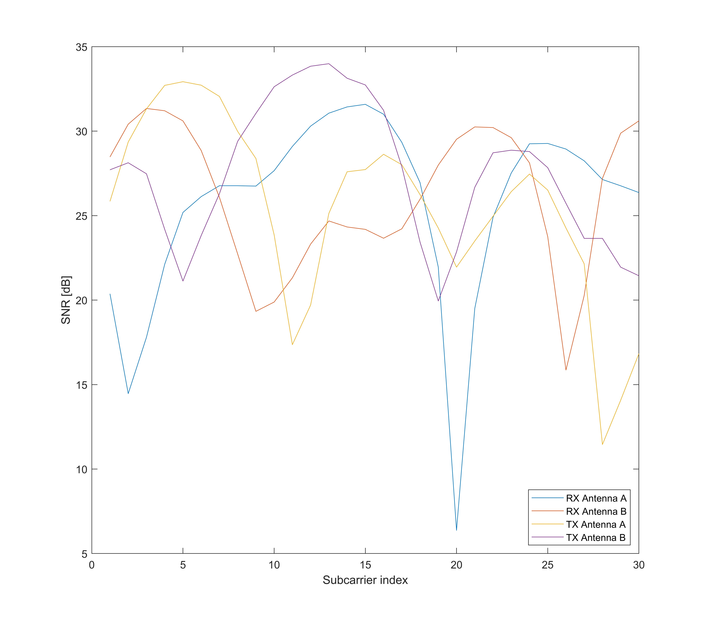

# WIFI感知
利用WIFI信号来对人体，环境进行检测及感知是近期无线感知领域一项较为新颖的技术。在这个研究领域中，相较于信号强度等信息，通过对WIFI信号的CSI信息进行分析，能够达到更高的感知精度。

## 获取CSI信息
目前主流的获取WIFI CSI信息的工具有以下几种

- [Linux 802.11n CSI Tool](https://dhalperi.github.io/linux-80211n-csitool/)
- [ESP32 CSI Toolkit](https://stevenmhernandez.github.io/ESP32-CSI-Tool/)
- [Atheros CSI Tool](https://wands.sg/research/wifi/AtherosCSI/)

这些工具对应的硬件分别是Intel 5300无线网卡、ESP32 Node MCU、部分高通芯片的无线网卡。我们以其中的Linux 802.11n CSI Tool为例说明如何获取WIFI CSI信息:

### 软硬件要求
我们需要使用Intel 5300无线网卡以及装有Linux 4.15内核的操作系统(如Ubuntu 16.04.4)

我们按照https://github.com/spanev/linux-80211n-csitool的安装指南，在较新的内核（4.15）上安装CSI工具。
### 安装过程
1. 安装依赖

~~~bash
sudo apt install build-essential linux-headers-$(uname -r) git-core
~~~

2. 安装更高版本的编译工具链

~~~bash
sudo add-apt-repository ppa:ubuntu-toolchain-r/test
sudo apt update
sudo apt install gcc-8 g++-8
# 替换高版本的编译工具链
sudo rm /usr/bin/gcc
sudo rm /usr/bin/g++
sudo ln -s /usr/bin/gcc-8 /usr/bin/gcc
sudo ln -s /usr/bin/g++-8 /usr/bin/g++
~~~

3. 编译安装修改的无线驱动

~~~bash
git clone https://github.com/spanev/linux-80211n-csitool.git
cd linux-80211n-csitool
CSITOOL_KERNEL_TAG=csitool-$(uname -r | cut -d . -f 1-2)
git checkout ${CSITOOL_KERNEL_TAG}
make -j `nproc` -C /lib/modules/$(uname -r)/build M=$(pwd)/drivers/net/wireless/intel/iwlwifi modules
sudo make -C /lib/modules/$(uname -r)/build M=$(pwd)/drivers/net/wireless/intel/iwlwifi \
INSTALL_MOD_DIR=updates modules_install
sudo depmod
cd ..
~~~

4. 替换修改后的固件
~~~bash
git clone https://github.com/dhalperi/linux-80211n-csitool-supplementary.git
for file in /lib/firmware/iwlwifi-5000-*.ucode; do sudo mv $file $file.orig; done
sudo cp linux-80211n-csitool-supplementary/firmware/iwlwifi-5000-2.ucode.sigcomm2010 /lib/firmware/
sudo ln -s iwlwifi-5000-2.ucode.sigcomm2010 /lib/firmware/iwlwifi-5000-2.ucode
~~~

### 获取及分析CSI信息

按照 https://dhalperi.github.io/linux-80211n-csitool/installation.html 所提供的指导，安装数据记录工具，并使用其提供的matlab函数进行数据获取。我们把数据记录到`csi.dat`文件中，读取并分析数据的样例代码如下：

~~~matlab
csi_trace = read_bf_file('csi.dat');
csi_entry = csi_trace{4};
csi = get_scaled_csi(csi_entry);
% CSI是一个Ntx×Nrx×30 的矩阵，对应了发射天线数x接收天线数x30个子载波的信道信息
figure
plot(db(abs(squeeze(csi(1,:,:)).')))
hold on
plot(db(abs(squeeze(csi(2,:,:)).')))
legend('RX Antenna A', 'RX Antenna B','TX Antenna A', 'TX Antenna B', 'Location', 'SouthEast' );
xlabel('Subcarrier index');
ylabel('SNR [dB]');
~~~

图. CSI数据转化的SNR值

例如上图中就展示了2\*2（nTx\*nRx）组天线的CSI数据转化来的SNR结果，其中横轴为30个不同的子载波，纵轴为SNR值的大小。
