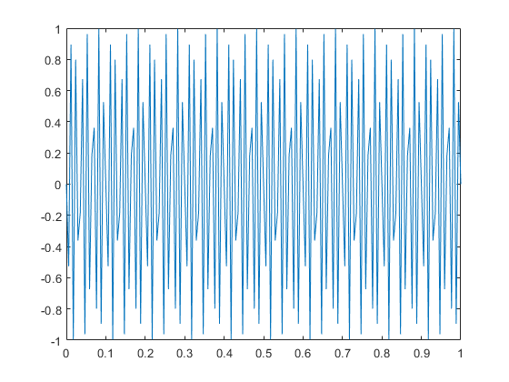
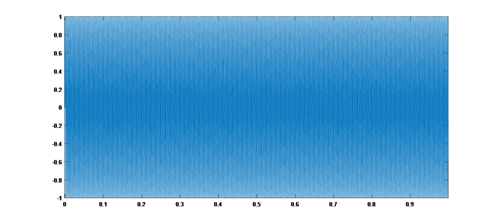

#信号采样与采样定理
​		上面的介绍遗留了两个问题：1. 采样具体是如何来实现的。2. 采样后得到的信号，会不会与原来的信号不一样，换一句话说，我们能不够通过采样后的信号来完全恢复原始信号。

​		我们来看采样具体是怎么实现的。

​		首先通过简单的仿真实验来进行说明，然后再通过实际的信号让大家体会这一过程。假设存在一个正弦的声波信号，频率为$5Hz$，理想情况下这个信号是一个正弦波。我们假设采样率为200Hz，即1秒内有200个采样点，这个正弦波信号的采样点在matlab下可以使用如下的代码生成并画图。

```matlab
%% 信号的产生过程
%% 产生一个频率为5Hz、时长为1s的信号；
t = 0:1/200:1;            % 1s内200个采样点
f = 5;                    % 频率f=5Hz
y = sin(2*pi*f*t);
plot(t, y);
```

<center>

</center>
<center>
<div style="color:orange; border-bottom: 1px solid #d9d9d9; display: inline-block;color: #999;padding: 2px;">图. 5Hz信号时域图</div>
</center>

​		在上图中，我们取的采样点比较密集，因此图像看上去是一条连续的曲线。代码中，**信号频率** 为$5Hz$，而 **采样频率** 为$200Hz$，这种情况下看到的信号很正常，符合正弦信号的特点。

​		我们再尝试另外一组参数组合。当我们将信号频率稍微做一些修改后，信号的时域图像就变成下图所示的样子：

```matlab
%% 信号的产生过程
%% 产生一个频率为100Hz、时长为1s的信号；
t = 0:1/200:1;            % 1s内200个采样点
f = 100;                  % 频率f=100Hz
y = sin(2*pi*f*t);
plot(t, y);
```

<center>

</center>
<center>
<div style="color:orange; border-bottom: 1px solid #d9d9d9; display: inline-block;color: #999;padding: 2px;">图. 100Hz信号时域图</div>
</center>

​		注意，同样是正弦信号，得到的结果从上图看，已经完全不是我们想象中的正弦图像了，大家想想看看这个是什么原因。

​		从上面两幅信号时域图的对比中，我们思考为什么会有这样的不同，同样是每秒200个采样点，频率不同的正弦信号所画出来的图会有完全不一样的结果。

​		我们很自然的有几个更深入的问题：对于一个给定的连续信号，我们能不能够通过采样的方法完整的还原出原始信号？如果可以，我们到底应该要用多大的采样率来采样这个信号？

​		这里牵涉到了信号采样中的一个重要问题，我们将这个问题更加具体、形式化地进行描述。假设信号中的频率为$f$（一个信号可能包含多种频率），那么应该以多大的采样频率$fs$对信号进行采样才合理呢？这里的“合理”是指我们通过采样后的离散信号，可以完全恢复出原本的连续信号（举例来说，从一组数据点中恢复出原始连续信号的一个数学表达式）。显然我们不可能采用无限大的采样频率，这样在计算机上无法处理，不具备实际的可操作性。采样频率的增大会带来额外的开销，实际上也非常不经济，例如会占用大量的存储空间。那么如果信号的频率为$f$，那么最小的采样频率$fs$为多少。

​		**奈奎斯特采样定律** 告诉我们，为了进行合理地采样，保证采样后的数据能够还原出原来的信号，采样后的信号包含原来信号的所有特征。采样频率必须满足$fs\ge 2*f$，$f$是给定连续信号的频率。采样过程所应遵循的规律，又称取样定理、抽样定理。采样定理说明了采样频率与信号频谱之间的关系，是连续信号转换为离散信号的基本依据。

​		如果采样率低于信号最大频率的两倍会怎样呢？我们来看一组更加有意思的例子：

```matlab
%% 信号的产生过程
%% 产生一个频率为401Hz、时长为1s的信号；
t = 0:1/10000:1;    % 1s内10000个采样点
f = 401;            % 频率f=401Hz
y = sin(2*pi*f*t);
plot(t, y);
```

​		这个例子中，信号是$401Hz$的，我们采用远大于$401Hz$两倍的采样率$10KHz$来采样。信号是如下这个样子的：

<center>

</center>
<center>
<div style="color:orange; border-bottom: 1px solid #d9d9d9; display: inline-block;color: #999;padding: 2px;">图. 401Hz信号时域图，采样率10000Hz</div>
</center>

​		由于在一秒内该信号有401个周期，因此上图看上去非常密集，大家可以在matlab画出的图像中使用放大功能来查看时间粒度更细的图像，从而验证每个周期都是理想的正弦波信号。如果我们把采样率换成比$401Hz$稍大一点的$402Hz$，结果如下：

```matlab
%% 信号的产生过程
%% 产生一个频率为401Hz、时长为1s的信号；
t = 0:1/402:1;    % 1s内402个采样点
f = 401;          % 频率f=401Hz
y = sin(2*pi*f*t);
plot(t, y);
```

<center>

</center>
<center>
<div style="color:orange; border-bottom: 1px solid #d9d9d9; display: inline-block;color: #999;padding: 2px;">图. 401Hz信号时域图，采样率402Hz</div>
</center>

​		上图看上去也是一个理想的正弦波信号，但是仔细观察横轴的时间刻度可以发现，这是一个频率为$1Hz$的正弦波。

​		当采样率无法满足采样定律的要求时，就称发生了**混叠现象**。而为什么会导致最后的频率为1Hz，大家也可以再思考一下，跟401$Hz$的信号频率和402$Hz$的采样率有什么联系。用于演示混叠现象的经典例子之一是所谓的“车轮效应”。在影片里当马车越走越快时，马车车轮似乎越走越慢，之后甚至朝反方向旋转，为什么？

> 思考
> 1. 假设要将最大频率为8KHz的歌曲信号转成数字信号，需要的采样率至少是多少？
> 2. 为什么用$402Hz$的采样率去采样$401Hz$的信号，会得到$1Hz$的正弦信号？
> 3. 一般地，如果原始信号频率为$f$，采样频率$fs$满足$f < fs < 2*f$，那么采样后（混叠后）的信号频率将会是多少？这样会对通信产生什么影响？


## 参考资料和文献

1. 《古今数学思想（第三册）》第28章

2. 《信号与系统（第二版）》第3、4、5章

3. 《离散时间信号处理（第三版）》第7章


