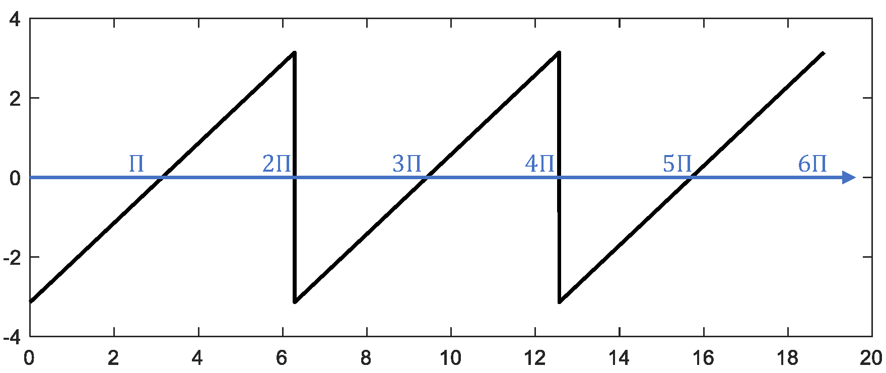
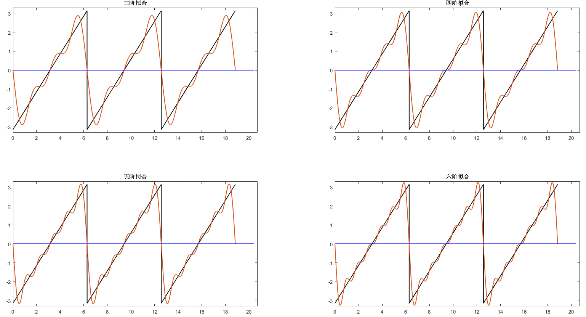
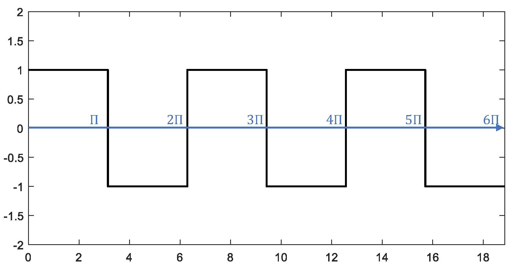
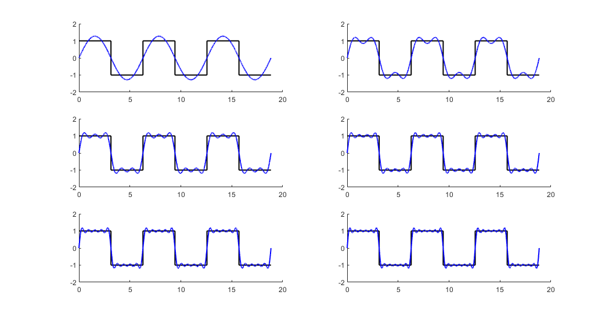

# 傅里叶级数

为了理解傅里叶级数，让我们想象回到两百年前的十九世纪，看看是怎么发现傅里叶级数的。像他同时代的科学家一样，傅里叶从事热流动的研究。作为实际问题，在工业上是为了处理金属，作为科学问题，是企图确定地球内部的温度。在傅里叶的名篇《热的解析理论》中，他首先考虑了一个在均匀和各向同性的物体内的温度$T$，它是一个空间和时间的函数。根据牛顿冷却定律，傅里叶推导出了$T$必须满足的偏微分方程——即著名的热传导方程

$$
\frac{\partial^2T}{\partial x^2} + \frac{\partial^2T}{\partial y^2} + \frac{\partial^2T}{\partial z^2} = k^2\frac{\partial T}{\partial t},
$$

其中$k^2$是一个依赖于物体材料的常数。

傅里叶当时解决了特殊的热传导问题，我们考虑一种典型情况，即一根两端保持在零度，侧面绝热因而热流无法通过的柱轴，温度的分布是一维的$T(x,t)$。在此我们不妨将$k$取为1，所以有

$$
\frac{\partial^2T}{\partial x^2} = \frac{\partial T}{\partial t}.
$$

不妨设杆长为$\pi$（为了让我们的式子更简洁），则边界条件为

$$
T(0,t) = 0, T(\pi,t) = 0, t > 0.
$$

初始时刻杆上有温度分布

$$
T(x, 0) = f(x).
$$

为解上述方程，傅里叶采用了分离变量法，他令

$$
T(x,t) = \phi(x) \psi(t).
$$

代入微分方程后，可以得到

$$
\frac{\phi^{\prime\prime}(x)}{\phi(x)} = \frac{\psi^{\prime}(t)}{\psi(t)}.
$$

左边只与$x$相关而右边只与$t$相关，可设这比值为一常数 $-\lambda$ ，因此有

$$
\begin{aligned}
\phi^{\prime\prime}(x) + \lambda \phi(x) &= 0 \\
\psi^{\prime}(t) + \lambda \psi(t) &= 0.
\end{aligned}
$$

我们很容易知道上述两个常微分方程的通解为

$$
\begin{aligned}
\phi(x) &= a\sin (\sqrt{\lambda}x+c) \\
\psi(t) &= de^{-\lambda t}.
\end{aligned}
$$

边界条件告诉我们 $\phi(0) = 0, \phi(\pi) = 0$。$\phi(0) = 0$意味着$c=0$，$\phi(\pi) = 0$则要求$\lambda = n^2 (n = 1, 2, \cdots)$。于是傅里叶得到$T_{n}(x,t) = a_{n}e^{-n^2t}\sin(n x)$，其中$a_{n}$为常数。因为热传导方程是线性的，这些与$n$相关的解之和仍是原方程的解。故傅里叶断言

$$
T(x,t) = \sum_{n=1}^{+\infty}a_{n}e^{-n^2t}\sin(nx).
$$

为了满足初始条件，当$t=0$时必须有

$$
f(x) = \sum_{n=1}^{+\infty}a_{n}\sin(nx).
$$

于是，傅里叶面临这样的问题，$f(x)$是一个代表温度初始分布的任意的函数，任意的$f(x)$都能表示成三角级数吗？特别是，$a_n$能确定吗？

傅里叶进而回答这些问题，他将上式两边展开成幂级数，比较两边系数，通过解无穷维线性方程组来求解$a_n$，最终他得到了一个包含有无穷乘积及无穷和的一个表达式。傅里叶觉得这个表达式相当无用，经过更为大胆而富于创造性的、虽然往往又是含糊的几步，他得到了与我们现在熟悉的傅里叶系数类似的形式

$$
a_n = \frac{2}{\pi} \int_0^\pi f(s) \sin(ns)ds.
$$

这个结论一定程度上说并不是新的，欧拉等人此前已对怎样把某些函数展开成三角级数做过阐述并得到了类似公式，相比之下，这里得到系数公式的过程还做了很多不必要的假设，方法更复杂且不够严密。
但这时傅里叶作了一些值得注意的观察。他注意到每一个$a_n$可以解释为$x$取值$0$到$\pi$时，曲线$y=\frac{2}{\pi}f(x)\sin(nx)$下方的面积（当时积分号的主流含义是反导数，我们现在熟知的定积分还未被广泛认可）。这样一个面积即使对很随意的函数都是有意义的。这种函数不必是连续的，或者只要从图形上知道就可以了。所以傅里叶下结论说每一个函数都可以展开为傅里叶级数。

傅里叶虽然没有完整地给出傅里叶级数展开的条件，但他在论文中全篇都透露出任何函数皆可用三角函数展开的信念，并举了很多函数的展开例子，我们也举一个锯齿波的例子来看看傅里叶级数的拟合效果。如下所示，对于一个周期为$2\pi$的锯齿形波，我们通过不断叠加具有不同的周期的三角函数，可以使叠加结果逐渐逼近原本的锯齿形波（如何选取拟合用的函数将在之后讲述）。我们用MATLAB仿真来更加直观地理解这一过程：

```matlab
%% 原始信号：周期为2pi的锯齿形波
fs = 1e3;
t = 0:1/fs:6*pi;
y = -pi + mod(t,2*pi);
figure;
plot(t,y,'color','black','linewidth',1.5);
```

<center>

</center>
<center>
<div style="color:orange; border-bottom: 1px solid #d9d9d9;
display: inline-block;
color: #999;
padding: 2px;">图. MATLAB产生周期2π的锯齿波</div>
</center>

```matlab
%% 使用最小周期为2pi的基础正弦波sin(x)拟合锯齿波
z = -2*sin(t);
hold on
plot(t,z,'linewidth',1.5);
plot([0,6.5*pi],[0 0],'color','blue','linewidth',1.5);
xlim([0,6.6*pi]);
ylim([-3.3 3.3]);
box on
```

<center>

</center>
<center>
<div style="color:orange; border-bottom: 1px solid #d9d9d9;
display: inline-block;
color: #999;
padding: 2px;">图. 一阶拟合结果</div>
</center>

```matlab
%% 叠加最小周期为pi的基础正弦波sin(2x)做二阶拟合
z = -2*sin(t) - sin(2*t);
hold on
plot(t,z,'linewidth',1.5);
plot([0,6.5*pi],[0 0],'color','blue','linewidth',1.5);
xlim([0,6.6*pi]);
ylim([-3.3 3.3]);
box on
```

<center>

</center>
<center>
<div style="color:orange; border-bottom: 1px solid #d9d9d9;
display: inline-block;
color: #999;
padding: 2px;">图. 二阶拟合结果</div>
</center>

继续叠加与锯齿波具有相同周期的三角函数，可使拟合的结果不断地逼近初始的锯齿形波：

```matlab
%% 不同阶数三角函数叠加结果示意
figure;
z = -2*sin(t) - sin(2*t) - 2/3*sin(3*t);
subplot(2,2,1);fplot(t,y,z);
title('三阶拟合');

z = -2*sin(t) - sin(2*t) - 2/3*sin(3*t) - 1/2*sin(4*t);
subplot(2,2,2);fplot(t,y,z);
title('四阶拟合');

z = -2*sin(t) - sin(2*t) - 2/3*sin(3*t) - 1/2*sin(4*t) - 2/5*sin(5*t);
subplot(2,2,3);fplot(t,y,z);
title('五阶拟合');

z = -2*sin(t) - sin(2*t) - 2/3*sin(3*t) - 1/2*sin(4*t) - 2/5*sin(5*t) - 1/3*sin(6*t);
subplot(2,2,4);fplot(t,y,z);
title('六阶拟合');

function fplot(t,y,z)
hold on;
plot(t,y,'color','black','linewidth',1.5);
plot(t,z,'linewidth',1.5);
plot([0,6.5*pi],[0 0],'color','b','linewidth',1.5);
xlim([0,6.6*pi]);
ylim([-3.3 3.3]);
box on;
end
```


<center>
<div style="color:orange; border-bottom: 1px solid #d9d9d9;
display: inline-block;
color: #999;
padding: 2px;">图. 锯齿形波三阶到六阶拟合结果</div>
</center>

我们看到拟合的三角函数之和逐渐逼近原始的锯齿波函数。在不连续点（锯齿尖端）处，傅里叶级数最终收敛到跳跃位置的中点，在本例中，即$y=0$处。

以上我们只考虑了区间$[0,\pi]$或者$[0, +\infty)$上的函数表示，我们只使用了正弦函数来做傅里叶展开，因而傅里叶级数表示的函数是一个奇函数。对于那些定义在整个实数域上的偶函数，我们需要在级数展开中使用余弦函数及常数函数。对那些非奇非偶的函数，使用正弦、余弦、常数函数已经足够，因为任意一个函数$f(x)$，都可以被表示为一个奇函数和一个偶函数的和：

$$
f(x) = \frac{f(x)-f(-x)}{2} + \frac{f(x)+f(-x)}{2},
$$

其中$\frac{f(x)-f(-x)}{2}$是奇函数，$\frac{f(x)+f(-x)}{2}$是偶函数。

一个函数能展开为傅里叶级数是有要求的，德国数学家狄利克雷证明了某些情况下的周期函数无法用傅里叶级数表示，并率先给出了周期函数可展开成傅里叶级数的充分不必要条件，即狄利克雷条件：

1. 此函数必须是有界的，即对于任意$x$，$|f(x)|<M$，$M$是一正实数；
2. 在任意区间内，除了有限个不连续点，$f(x)$必须是连续函数；
3. 在任意区间内，$f(x)$必须仅包含有限个极值；
4. 在一周期内，$|f(x)|$的积分必须收敛。

在满足这些条件时，一个周期为$2\pi$的函数$f(x)$可以展开为如下形式

$$
\frac{a_0}{2}+\sum_{n=1}^{\infty}\left(a_{n} \cos \left(n x\right)+b_{n} \sin \left(n x\right)\right), a_i, b_i \in \mathbb{R}.
$$

若$f(x)$周期为$T$，通过简单的变量代换即可转换为周期$2\pi$的函数（$f(\frac{T}{2\pi}x)$周期为$2\pi$）。我们在工程中遇到的信号形式基本都满足狄利克雷条件。

上面我们写下的是实数形式的傅里叶级数公式，通过欧拉公式$e^{j\theta} = \cos\theta + j\sin\theta$可将该公式转换为复数形式，其中$j$表示虚数单位（工程上使用$j$是为了避免与电流符号$i$混淆)。将$\cos \left(n x\right) = \frac{e^{jnx}+e^{-jnx}}{2}, \sin \left(n x\right) = \frac{e^{jnx}-e^{-jnx}}{2j}$代入，我们得到复数形式的傅里叶级数：

$$
\sum_{n=-\infty}^{\infty}c_{n} e^{jnx}, c_i \in \mathbb{C}.
$$

这里，作为初学者会有一个很大的困惑，前面三角函数用得好好的，为什么突然要在傅里叶级数中引入复数？读者在之后的学习中也会发现信号处理中大量采用了复数记号，这是为什么呢？
首先第一：事实上我们得承认，实际的物理量都是实数，也就是测量的所有量都可以认为是实数，如果有过信号处理经验的人应该都接触过复数，在各种场合各种软件里面都使用复数来表示信号，复数是信号的一种方便的表示形式。无论是实数表示还是复数表示，他们的物理含义是一样的，复数不过是一种更方便使用的“记号”。我们选用复数至少有以下两点原因：

首先，在数学上，复数理论通常比实数理论更简单更优美。
例如关于一元二次方程，从实数角度，我们会说，它有两个解、一个解或没有实数解，而从复数角度，我们说它永远有两个复根。犹记得笔者的微积分老师说过，“在我们平常的研究中遇到一个问题，如果最终它跟复数有关系，那理论通常会很漂亮，而如果只能用实数来表达，结果一般就要丑陋许多”。体现在傅里叶级数上，让我们对比一下实数形式和复数形式的公式

$$
\begin{aligned}
实数形式：&\frac{a_0}{2}+\sum_{n=1}^{\infty}\left(a_{n} \cos \left(n x\right)+b_{n} \sin \left(n x\right)\right) \\
复数形式：&\sum_{n=-\infty}^{\infty}c_{n} e^{jnx}
\end{aligned}
$$

作为读者你会选择哪一个公式进行学习呢？恐怕大家会倾向于长度更短也更简洁的复数形式。建议大家自己推导的时候都从三角函数出发，我在课堂上也会从三角函数出发，这样相对更加直观和更好理解。但是如果使用熟练后，会发现使用复数形式在实际中更加方便。事实上，正是因为傅里叶分析的公式里充满了求和号、积分号与众多变量符号，让各种公式都显得庞大繁杂，不免让人望而却步，以致即使学习完也记得零零落落。为了让我们的大脑更好地抓住傅里叶分析的本质，何不记一个复数形式的公式呢？

其次，一个复数同时包含了幅度和相位的信息，这是单纯一个实数无法表示的。而相位信息在信号处理中非常重要，能更容易地表达出相位是复数的一个优势。

因此在后面的讨论中，我们通常使用复数形式，这使我们的表达更清晰简洁。接下来的一个问题是如何确定展开式中的系数$c_n$？不同于傅里叶当时复杂的想法，让我们从另外一个角度思考问题。我们先将思绪脱离傅里叶级数，来做一些别的事。

## 傅里叶级数的另一种理解

回忆一下我们熟知的向量空间。想象一个$N$维欧几里得空间中的向量$\mathbf{v}= (v_1, v_2, \cdots, v_N)$，我们可以把它分解为$N$个基向量的线性组合。比如第一个基向量是$\mathbf{e_1} = (1, 0, \cdots, 0)$，第二个基向量是$\mathbf{e_2} = (0, 1, \cdots, 0)$，……，第$N$个基向量是$\mathbf{e_N} = (0, 0, \cdots, 1)$。那么$\mathbf{v}$可以写为

$$
\sum_{n=1}^N v_n\mathbf{e_n}.
$$

这个式子和傅里叶级数非常相似，我们将类比地把求$v_n$的方法用于求$c_n$。观察我们选的基向量$\mathbf{e_n}$，会发现有两个特点，它们是单位向量且互相之间正交。在此我们需要引入内积的概念以说明这两个特点。我们定义$N$维欧几里得空间中的两个向量$\mathbf{a}= (a_1, a_2, \cdots, a_N)$和$\mathbf{b}= (b_1, b_2, \cdots, b_N)$的内积为

$$
\langle \mathbf{a}, \mathbf{b}\rangle = \sum_{n=1}^N a_n \overline{b_n}.
$$

这样基向量$\mathbf{e_n}$的模长平方$|\mathbf{e_n}|^2 = \langle e_n, e_n\rangle = 1$，因此它是单位向量。当$m\neq n$时，$\langle e_m, e_n\rangle = 0$，代表这些基向量间互相正交。当这些基向量是单位正交基时，我们很容易知道$v_n$是$\mathbf{v}$在$\mathbf{e_n}$上的投影，即

$$v_n = \langle \mathbf{v}, \mathbf{e_n}\rangle.$$

如果把指数形式的三角函数看成基向量，把傅里叶级数看成是空间里的某个向量，然后我们再定义一个内积，让这些基向量是正交单位基向量，那么傅里叶系数就可以写成如下的形式

$$
c_n = \langle f(x), 三角基\rangle.
$$

事实上我们确实可以这么做，从而定义了一个无穷维的希尔伯特空间。

在向量空间$V$上关于数域$\mathbb{F}$定义内积$\langle \cdot, \cdot\rangle$，$\forall x, y \in V, \forall a, b \in \mathbb{F}$，需要满足如下条件：

1. 共轭对称：即交换向量位置后，内积的值变为其共轭，$\langle x, y \rangle = \overline{\langle y, x \rangle }$

2. 对第一个元素线性：$\langle ax + by, z \rangle = a\langle x, z \rangle + b\langle y, z \rangle$

3. 正定：$\forall x \neq 0, \langle x, x\rangle > 0$

设$f(x), g(x)$为周期$2\pi$的函数，我们考虑如下对函数内积的定义：

$$
\langle f(x), g(x) \rangle = \frac{1}{2\pi}\int_0^{2\pi}f(x)\overline{g(x)} dx.
$$

可以验证该定义符合内积的三个条件。选取基向量为$\{1, e^{\pm jx}, e^{\pm j2x}, \cdots \}$，可以验证在我们的内积定义下它们是单位正交基。因而我们有

$$
c_n = \langle f(x), e^{jnx}\rangle = \frac{1}{2\pi}\int_0^{2\pi}f(x)e^{-jnx} dx.
$$

系数$c_n$还可以理解为$f(x)$和基向量之间的相似度，比如定义如下余弦相似度：

$$
\frac{\left|\langle f(x), e^{jnx}\rangle\right|}{\sqrt{\langle f(x), f(x)\rangle \langle e^{jnx}, e^{jnx}\rangle}} = \frac{|c_n|}{\sqrt{\langle f(x), f(x)\rangle}}
$$

显然$|c_n|$越大，说明$f(x)$和基向量越相似，对应的频率分量越强。

接下来，我们用一个例子，带大家更直观地理解傅里叶级数的计算过程。考虑一个周期为$2\pi$的方波

$$
f(x)=\left\{
\begin{aligned}
1, &\quad 0 \leq x < \pi \\
-1, &\quad \pi \leq x < 2\pi \\
f(x\pm2\pi), &\quad 其他.
\end{aligned}
\right.
$$

首先使用MATLAB构造周期为$2\pi$的方波函数：

```matlab
%% 方波的傅里叶级数展开
% 构造周期为2pi的方波
fs = 1e3;
t = 0:1/fs:6*pi;
y = square(t,50);
figure;
plot(t,y,'color','black','linewidth',1.5);
ylim([-2 2]);
```


<center>
<div style="color:orange; border-bottom: 1px solid #d9d9d9;
display: inline-block;
color: #999;
padding: 2px;">图. MATLAB构造周期为2π的矩形波</div>
</center>

现在需要将其展开为三角函数表示的无穷级数形式。根据傅里叶系数公式，我们可以计算每一阶三角函数对应的傅里叶系数：

$$
\begin{aligned}
    c_{n} &= \frac{1}{2\pi} \int_{0}^{2\pi} f(x) \cdot e^{-jnx} d x \\
    &= \frac{1}{2\pi} \int_{0}^{\pi} 1 \cdot e^{-jnx} d x + \frac{1}{2\pi} \int_{\pi}^{2\pi} (-1) \cdot e^{-jnx} dx. \\
    &=\left\{
\begin{aligned}
&\quad\quad 0 &, n = 0 \\
&\frac{1-(-1)^n}{jn\pi} &, 其他.
\end{aligned}
\right.
\end{aligned}
$$

可以看到，$c_n$只在$n$取奇数的时候不为$0$。我们可以使用该结果在MATLAB中用傅里叶级数拟合方波：

```matlab
% 计算傅里叶系数
z = zeros(1,length(y));
for n = 1:2:11
    % exp(jnt)与exp(-jnt)的傅里叶系数
    cn1 = 2/(1j*n*pi);
    cn2 = -2/(1j*n*pi);

    z = z + cn1*exp(1j*n*t) + cn2*exp(-1j*n*t);
    % 绘图
    subplot(3,2,ceil(n/2)); hold on
    plot(t,y,'color','black','linewidth',1.5);
    plot(t,z,'color','b','linewidth',1.5);
    ylim([-2 2]);
end
```


<center>
<div style="color:orange; border-bottom: 1px solid #d9d9d9;
display: inline-block;
color: #999;
padding: 2px;">图. 矩形波傅里叶级数展开</div>
</center>

## 参考文献

1. 莫里斯·克莱因 著，朱学贤等译. 古今数学思想，上海科技出版社，2003，第28章.
