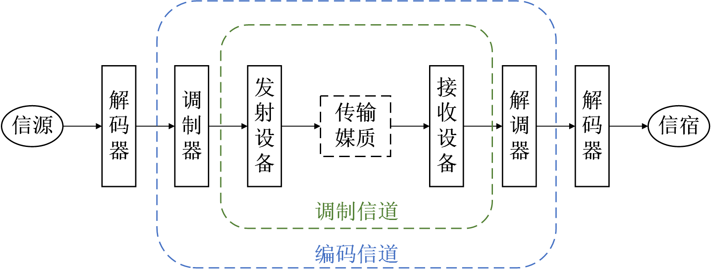
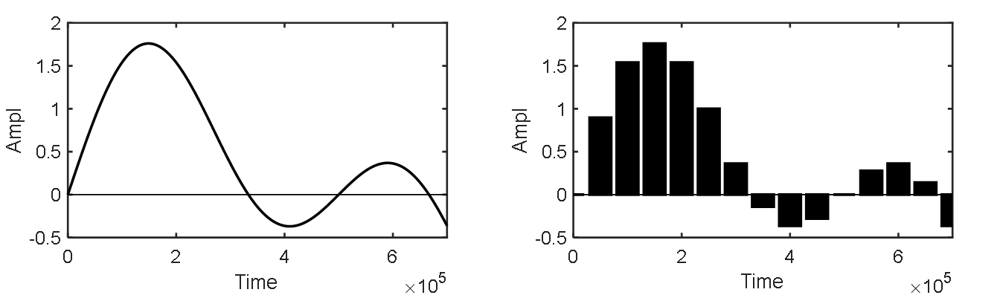
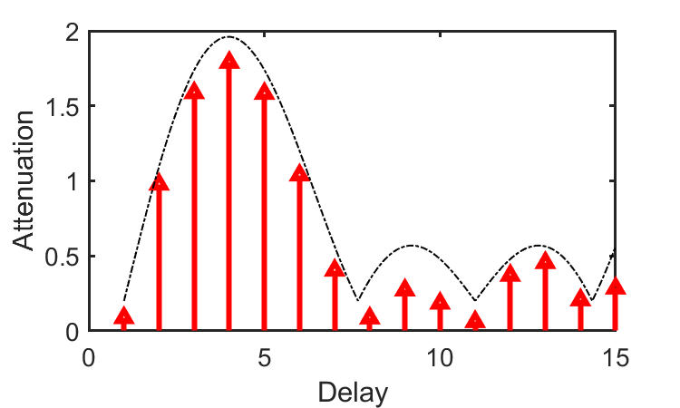
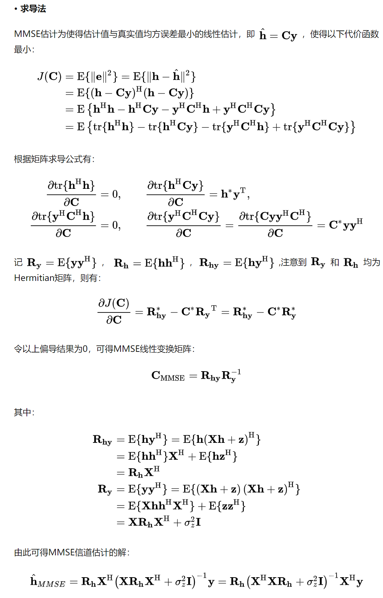

# 无线信道

## 信道定义
就像车辆运输需要道路一样，信号的传输也需要通过信道。根据维基百科的定义，信道又称为通道、频道或者波道，是信号在通信系统中传输的通道，由信号从发射端到接收端所经过的所有传输媒质所构成，广义的信道定义还包括传输信号的相关设备。理解信道是理解数据传输的重要基础，在物联网领域的前沿研究工作——从物联网通信到物联网感知——都是以通信信道为基础的，他们或要解决信道带来的问题，或利用信道带来的特点。

在学习这一部分的过程中，我们始终要围绕着下面的问题：

- 什么是信道？
- 怎样表示信道?

首先我们知道传输目的，就是通过接收到的信号还原出发送的信号。而在这个过程中，我们首先要搞清楚如何表示信号（调制）以及如何表示信道（传输的影响）。假设发送信号为$s$, 那么接收到到的信号为$f(s)$,其中函数$f$就是信道对信号的影响，传输的目的就是基于接收到的$f(s)$计算出$s$。当然最理想的情况下，信道不会对信号产生任何影响，那么接收到的$f(s) = s$。

通俗地来理解信道，一个信号从发送端通过一定的媒介到达接收端。这就是一个典型通信过程，就包括发射端-信道-接收端三个部分。例如你晚上写的作业，第二天交到老师的手上，你就是发送端，作业就是你的数据，作业本以及交的这个过程就是信道，老师就是接收方。
所以要保证老师看到你的作业，首先你写的内容至少要保证没有问题，你会想尽办法保证写的东西是正确的，怕老师看不清会把字写大一些，为了让老师知道是谁的作业会把名字写上，作业里面的重点会标记好，这些都是传输端做的保证发送稳定性的方法。同时你也会尽量保证作业本能够稳定的交到老师手上，这是减少信道的影响，下雨了你会将作业小心的保护起来等，老师收到作业知道才知道你写的内容。确保老师看到作业的时候，知道你当时写了什么内容。

更确切的说，信道可以分为狭义信道和广义信道两类：

**狭义信道：** 按照传输媒质来划分，可以分为有线信道、无线信道和存储信道三类。值得注意的是，磁带、磁盘等数据存储媒质也可以被看作是一种通信信道。将数据写入存储媒质的过程即等效于发射机将信号传输到信道的过程，将数据从存储媒质读出的过程即等效于接收机从信道接收信号的过程。

**广义信道：** 按照信道功能进行划分，可以分为调制信道和编码信道两类。调制信道是指信号从调制器的输出端传输到解调器的输入端经过的部分。对于调制和解调的研究者来说，信号在调制信道上经过的传输媒质和变换设备都对信号做出了某种形式的变换，研究者只关心这些变换的输入和输出的关系，并不关心实现这一系列变换的具体物理过程。这一系列变换的输入与输出之间的关系。编码信道是指数字信号由编码器输出端传输到译码器输入端经过的部分。对于编译码的研究者来说，编码器输出的数字序列经过编码信道上的一系列变换之后，在译码器的输入端成为另一组数字序列，研究者只关心这两组数字序列之间的变换关系，而并不关心这一系列变换发生的具体物理过程，甚至并不关心信号在调制信道上的具体变化。

<center>

</center>

<center>
<div style="color:orange; border-bottom: 1px solid #d9d9d9;
display: inline-block;
color: #999;
padding: 2px;">图. 信道示意</div>
</center>

理解信道是理解通信和感知的重要基础，因为很多通信处理和感知方法都是基于信道来实现的，理解信道的过程首先需要理解信道对信号的基本影响（如衰减、多径效应等），以及这些影响如何来科学的进行表示。这就是这章要讲的全部，理解这些之后，对于通信过程中碰到的大部分问题其实就比较明确和容易理解了，之前我们说过信道的理解也是物联网感知的基础，理解了信道后对于理解物联网无线定位和感知也比较方便了。


## 信道冲击响应（CIR）

<!-- 从单位冲击响应讲起，介绍冲击响应通过信道的变化，然后介绍如何一般化这种影响，介绍信道参数H等。 -->
信道研究的第一步，是要建立对信道的描述，即表示出任意输入信号通过该信道后的响应信号。但可能的输入信号波形有成千上万种，针对某个特定信道，我们不可能在该信道上对每一种波形的响应都进行研究，因此我们必须要找到那个可以用于构造任意波形的“单位1”。

幸运的是，在信道描述方面，单位脉冲信号就是一种非常理想的“单位1”：我们可以将任意信号可以分解成若干不同时延的单位脉冲信号的线性叠加。这样一来，通过研究单位脉冲通过信道后的响应，我们可以计算出任意信号通过信道后的结果。例如，假设发送端不是单位冲击信号，而是两倍高度的冲击信号，那么很自然的接收方的信号也会变成了两倍高度。当然这里我们假设信号是线性的，非线性的信道我们暂时不考虑，在大部分的分析中，线性信道的假设是足够且合理的了，本材料后面的部分也都是基于线性信道进行介绍的。注意大家看到的大部分论文等也都基于线性信道，所以后面材料中除非特别说明，都是假设线性信道。

我们用一个例子来说明如何用单位脉冲信号的信道响应（CIR）来表示任意信号通过信道后的响应输出。为例方便表示，以下说明将使用离散信号形式。离散形式的单位脉冲信号可以表示为：

$$
\delta[n]=\left\{\begin{array}{ll}
1, & n=0 \\
0, & n \neq 0
\end{array}\right.
$$

即只在0时刻输出为“1”，其他时刻输出为“0”。通过采样，任意信号可以表示为离散形式，如下图所示。

<center>

</center>

<center>
<div style="color:orange; border-bottom: 1px solid #d9d9d9;
display: inline-block;
color: #999;
padding: 2px;">图. 通过采样，任意信号可以表示为若干单位脉冲信号的组合</div>
</center>

每一个信号采样点可以看作一个具有特定时延和幅度缩放的单位冲击信号。例如在时刻1幅度为0.9的采样点，可以表示为$0.9\times \delta[n-1]$。类似的，我们可以将整段信号所有$N$个采样点表示为$N$个单位脉冲的和，即：

$$
s[n] = \sum_{k=0}^{N-1} Ampl[k]\times \delta[n-k]
$$

对于线性信道，如果我们知道单位脉冲信号$\delta[n]$通过该信道后的响应$\delta'[n]$，则我们可以直接计算得到任意信号$s[n]$通过该信道后的响应信号：

$$
s'[n]  = \sum_{k=0}^{N-1} Ampl[k]\times \delta'[n-k]
$$


<!-- 我们通常使用信道冲击响应（Channel Impulse Response，CIR）来表示信道的特征。给定一个信道，当输入端输入一个单位脉冲信号，在输出端得到的响应信号即为该信道的CIR。 -->

<!-- 为了研究信道的特点，通常情况我们会考虑一种叫做CIR的指标。信道冲击响应（Channel Impulse Response，CIR），顾名思义，即当输入一个单位脉冲信号时，信道输出端的响应信号。在通信过程中，信道会影响在其上通过的信号，使信号的振幅、频率、相位发生改变。不同的信道对通信信号的作用效果不同，我们可以使用信道冲击响应（CIR）来不同信道的影响分别进行描述。 -->

<!-- 在介绍信道冲击响应之前，我们先来了解一下什么是冲击信号。冲击信号通常指单位脉冲信号，该信号在除时刻零以外的点上都等于零，且在整个时间域上的积分等于1。其函数定义如下：

$$
\delta(t) = 0, t\neq 0 
$$

且满足函数值在从负无穷到正无穷区间内积分为1：

$$
\int_{-\infty}^{\infty}\delta(x)dx = 1
$$

对于离散时间系统来说，单位脉冲信号可以表示为： -->


接下来，我们回到信道冲击响应（CIR），探究单位脉冲信号通过信道后通常会发生怎样的变化。信道对单位脉冲信号的影响通常体现在两方面：一是由于路径损耗和阴影衰落造成脉冲信号的能量发生衰减；二是由于信道中存在多个传播路径导致在接收端先后收到多个不同脉冲信号副本的叠加。

<center>

</center>

<center>
<div style="color:orange; border-bottom: 1px solid #d9d9d9;
display: inline-block;
color: #999;
padding: 2px;">图. 信道响应示意：图中箭头代表了单位冲击信号经过信道后产生了不同的延迟和衰减的信号副本。</div>
</center>

上图直观地展示了信道对单位冲击信号的影响：一个单位冲击信号在通过信道到达接收端的过程中，由于可能经过不同的传播路径，因此在接收端将产生不同传播时延的信号副本。这些时延副本分别具有不同的信号衰减和频率相位变化。在接收端看来，收到的信号（信道冲击响应）就是这些不同延迟的信号副本的叠加。

<!-- 事实上，我们可以把信道看做一个滤波器，这个滤波器的参数（通常用$h$表示）就如上图所示。 -->

<!-- > 思考：假设知道了某信道的单位冲击响应，如果计算任意信号通过该信道后的结果？ -->

<center>

</center>

<center>
<div style="color:orange; border-bottom: 1px solid #d9d9d9;
display: inline-block;
color: #999;
padding: 2px;">图. 不同时延、不同衰减CIR示意。</div>
</center>

<center>

</center>

<center>
<div style="color:orange; border-bottom: 1px solid #d9d9d9;
display: inline-block;
color: #999;
padding: 2px;">图. CIR的线性叠加可表示任意信号的信道响应。</div>
</center>

如上图所示，通过对CIR做不同延时、不同衰减的线性叠加，我们可以表示出任意输入信号$s[n]$的信道响应输出。接下来，让我们思考如何在数学上来表示信道冲击响应（CIR）。

通过前面的介绍，我们知道一个单位脉冲信号通过信道后得到的响应是多个不同延时、不同衰减、不同相位的脉冲信号副本的叠加。我们用$h[n]$代表单位冲击响应通过信道后的结果，$h[n]$中的每一个值表示单位脉冲经过对应延时后的衰减和相位变化，例如$h[1]=0.9e^{j\varphi}$表示单位脉冲通过信道后在时刻1产生一个幅度为0.9、相位变化为$\varphi$的信号副本。

假设脉冲通过一个信道产生的最大延时为$M$，即在$0$时刻发送的信号，通过信道中最长的传播路径后，可以在时刻$M$到达接收端，这个最大时延又被称为 **信道时延拓展** 。因此，接收端在任意时刻收到的信号，实际上是其之前$M$个时刻内发送信号的叠加，即

$$
r[n] = s[n]\times h[0] + s[n-1] \times h[1] + \cdots + s[n-M]\times h[M]
$$

上面这个式子可以写成卷积的形式：

$$
r[n] = \sum_{k=0}^{M}s[n-k]h[k] = s\otimes h
$$

即，如果已知信道的单位脉冲响应$h$和任意输入信号$s$，输出信号可以直接表示为脉冲响应和输入信号的卷积。

<!-- 对于单位脉冲信号$\delta(t)$，在线性时不变的假设下，经过信道后在接收端收到的信号为 

$$ 
y(t)=\int_{-\infty}^{\infty} \delta(\tau) h(t-\tau) d \tau= h(t)
$$

对于任意输入信号$x(t)$，可以用连续域卷积的方法得出所对应的输出$y(t)$

$$
y(t)=\int_{-\infty}^{\infty} x(\tau) h(t-\tau) d \tau=x(t) * h(t)
$$


对于离散时间系统来说，脉冲响应一般用序列$h[n]$来表示，相对应的离散输入信号，也就是单位脉冲函数满足离散狄拉克函数$\delta[n]$的形式，$\delta[n]$的定义函数如下：

$$
\delta[n]=\left\{\begin{array}{ll}
1, & n=0 \\
0, & n \neq 0
\end{array}\right.
$$

在输入为$\delta [n]$时，离散系统的脉冲响应$h[n]$包含了系统的所有信息。所以对于任意输入信号$x[]$，可以用离散域卷积（求和）的方法得出所对应的输出信号$y[]$。
$x[]$可以表示为$x[n] = x[k]\delta[n-k], k = 0, 1, \ldots, +\infty$,由于$\delta[n]$通过信道后的结果为$h[n]$，由于线性信道的特点，$\delta[n-k]$通过信道后的结果为$h[n-k]$，进一步$x[k]\delta[n-k]$通过信道后的结果是$x[k]h[n-k]$。因此，对于信号$x[n]$，通过信道后的结果为

$$
y[n]=\sum_{k=0}^{\infty} x[k] h[n-k]
$$ -->

> 思考：为什么是卷积运算？

实际上，卷积运算也表明了信道的一个特点，即任意时刻在接收端收到的信号，受其之前若干时刻发送信号的影响。用知乎上的一个例子来类比，别人打你一拳是脉冲输入，但你的身体会疼几个小时，不是瞬间疼痛，给你多几拳，即多个脉冲，你的疼痛感再连续叠加，很直观地说明了信道对信号传输的影响。

> **举例1** 
> - 给定一个信道，直接路径和两条反射路径衰减为0.9，0.5和0.8，延迟分别为15$\mu s$和$40\mu s$，相位偏移分别为$35rad$和$70rad$，则信道冲击响应矩阵$h$可以表示为？
> - 在此信道中发送一个正弦信号$x(t)=sin(t)$，则接收到端收到的信号可以表示为？若发送一个任意信号$s(t)$，接收端收到的信号可以表示为？
> - 如果存在噪声$N(t)$，对收到的信号会产生怎样的影响？


在数据传输中，实际上重要的一个过程就是通过接收到的$y$和测量的$h$，计算传输的$x$。这其中带来了另外一个重要的问题就是如何来测量信道冲击响应$h$。


理想情况下，我们可以在发送端发送一个单位冲击信号，然后在接收端接收该信号对应的响应作为信道冲击响应$h$。但实际上，发送一个理想的冲击信号是很困难的，因此在实际操作中，我们一般通过发送其他的已知信号来测量信道冲击相应，比如在无线通信技术中常用的preamble或pilot signal，就可以利用来计算信道冲击响应。

## 信道频率响应（CFR）

信号的多径传播在时域上表现为时延扩展，信道的冲击响应通常就代表了这一信息。信道的这些影响在频域上带来的影响是选择性衰。直观上看这是由于信道中有不同延时的路径，通过不同路径的信号在接收端叠加增强或相消，使不同的频率的信号发生不同的衰减。例如当两路多径信号到达接收端的时间差恰好为某频率的半周期，则对应频率的信号在接收端发生明显衰减；如果正好是整数倍的周期，则对应频率的信号是叠加增强的。

因此，我们通常也用信道的频率响应（Channel Frequency Response，CFR）从幅频特性和相频特性来分别描述信道对信号传播的影响。在带宽无限的条件下，CFR与CIR互为时域和频域的等效参数，也就是通过傅里叶变换和逆变换能够转化这两个结果，下图展示了具有频率选择性衰落特征信道的频率响应。

<center>

</center>

<center>
<div style="color:orange; border-bottom: 1px solid #d9d9d9;
display: inline-block;
color: #999;
padding: 2px;">图. 信道频域响应示意：图中箭头代表了单位信号经过信道后不同频率的影响。</div>
</center>

在实际通信系统中，我们通常将时域上的信道冲击响应变换到频域，通过比较输入信号和输出信号的频域特征，我们就可以计算出相应频域上的冲击响应，进而计算出相应信道的时域参数。实际上，频域的信道响应和和时域响应是等价的，只不过一个是时间域上的表示，一个是频率域上的表示，两者可以互相转化。频域的信道响应也是大量定位和感知工作的信息来源，借助特定信号的信道频率响应，我们可以计算不同多径路径的传播特征。

<!-- 单位脉冲信号通过信道后，仍然是发送信号的衰减和延迟的组合，我们通常把一个单位冲击信号通过信道的结果叫做单位冲击响应，要注意这个单位冲击响应就完全描述了一个信道，换句话说， -->


## 信道状态信息（CSI）

理解了CIR和CFR，就比较好理解信道状态信息（CSI）了。信道状态信息(Channel State Information，CSI)与CFR一样，都从频域描述信道对传输信号的影响，他们的差异在于，CFR作为一般化的参数可以描述任意频率处的信道影响，而CSI通常用于OFDM系统中描述各个子信道的信道属性，即信道增益矩阵$H$（有时也称为信道矩阵，信道衰落矩阵）中每个元素的值。假设发送端装备$M$根天线，接收端装备$N$根天线，通信时使用$K$个子载波，则每次采样得到CSI矩阵的元素数量为$M\times N\times K$，每个元素以复数形式$a_ie^{-j\theta_i}$出现，对应每个子载波的幅度和相位。CSI可以使通信系统适应当前的信道条件，在无线通信系统中为高可靠性高速率的通信提供了保障。CSI可以看作CFR的一种离散采样的形式，采样的频率点为OFDM对应的不同载波频率。

CSI可以分为瞬时CSI（Instantaneous CSI）和统计CSI（Statistical CSI）。瞬时CSI意味着当前信道状态已知，因此可以调整发射信号来优化接收信号以达到空间复用或减少比特错误率。统计CSI表示信道的统计特性，如衰落分布的类型、平均信道增益、空间相关性等，这些信息也能用来进行传输优化。在某些快衰落系统中，信道状态在symbol级别都会发生极速的变化，此时应该使用统计CSI。另一方面，在慢衰落系统中，可以在合理精度内得到瞬时CSI估计，在该估计过时前可被用来进行传输适应。

对于CSI的更多介绍，可以参考：ps.zpj.io。

<!-- 前文我们已经介绍了，信道脉冲响应可以表示为不同延迟的信号副本在时域上的叠加，即原始信号与信号脉冲响应矩阵$h$的卷积：$y(t) = \sum_i s(t-\tau_i)\times A_ie^{j\phi_i}=s(t)\otimes h$。 -->

<!-- 如果把单位冲击响应的每一个时间点信号都看作一个值，对于任意信号，如果我们用$H = [h_1, h_2, \ldots, h_k]$表示信道给单位信号带来的延迟和衰减的话，那么给定任意信号x，通过信道后变成的样子应该为：

如果加上噪声，正常情况下得到的噪声应该为：$y = H*x + noise$。 -->

## 信道状态估计

通过前文介绍，我们知道由于无线环境数复杂多变，信号传播到达接收端时，其幅度、相位和频率都会发生很大的改变。因此，为了尽可能恢复出原始信号，我们需要进行信道估计和信道均衡。一个良好的估计和均衡算法对于接收端的性能来说至关重要，决定了信号最终的解出率。

根据是否借助导频信息，信道估计算法可以分为盲估计、半盲估计和非盲信道估计三种。盲信道估计无需借助导频符号，也不占用频谱资源，只利用接收信号本身固有的特征，来获取信道信息。实际上，在具体使用时，因为盲信道估计计算量复杂，收敛较慢，不适合现实的实时交互通信系统。针对盲信道估计的缺陷，半盲信道估计在发射端的调制信号中插入了少量导频。相较于盲信道估计而言，半盲信道估计可以借鉴少量导频信号的频率响应来进行信道估计，因此，其性能要好于盲信道估计。但半盲估计通常假设参考的导频信号不对数据传输造成额外影响，训练序列长度受限，因此可能出现相位模糊（基于子空间的方法）、误差传播（如判决反馈类方法）、收敛慢或陷入局部极小等问题，这在一定程度上限制了它的实用性。非盲估计则是使用一段特殊设计的导频信号来辅助信道估计，基于导频辅助的非盲信道估计算法可以分为两个部分：一是导频位置处的信道估计算法；二是非导频位置处的插值算法。非盲估计是目前通信系统常用的信道估计方式。

**1. LS算法**

下面介绍一种基于最小二乘（LS）算法的非盲信道估计方法。信道估计的本质，是表示出信道的单位脉冲响应CIR。按照前面的定义，最好最直接的办法当然是直接发送一个单位冲击信号，然后接收方看看收到的信号是什么样子。很显然，实际中我们无法这样子去做，因为我们无法发出这样的信号，也就无法利用这样的信号来测量信道。那真实的情况如何做呢，一般的做法为发送已知内容的信号$x(t)$，看看收到的信号$y(t)$，理论上$y(t) = x(t)*h(t)$。通过这个公式，我们可以算出$h(t)$的值，从而得到信道参数。在真实的数据包发送中，这个$x(t)$可以为数据包中的前导码等，前导码一般内容是固定的，所以对于任何接收者来说都是已知的，这样通过分析接收到的信号和发送信号的变化，计算出$h$。这也是为什么很多材料中说前导码可以起到信道估计的作用。

> 思考：在实际操作中我们如何通过$y(t) = x(t)*h(t)$，在原始信号$x(t)$和接收信号$y(t)$已知的情况下，如何将信道冲击响应$h(t)$还原出来？注意这里$*$是卷积操作。

由于在时域的卷积操作效果等价于在频域做乘积，因此通过傅里叶变换将信号变换到频域后，假设发送端参考信号为X，Y为接收参考信号，信道表示为H，噪声为N，关系表达式为

$$
Y=XH+N
$$

LS算法的基本原理就是使接收信号和无噪声数据之差的平方达到最小：

$$
\begin{aligned}
\widetilde{H} &= argmin|Y-XH|^2\\
&=argmin [(Y-XH)(Y-XH)^T]
\end{aligned}
$$

令$\widetilde{H}$等于其极限值，即当$argmin|Y-XH|^2$等于$0$，可以得到：

$$
[(Y-XH)(Y-XH)^T] = 0
$$

对上式中的$H$求导，得到：

$$
(X^TX)^{-1}X^TY = X^{-1}Y = H + N/X
$$

因此，LS算法的信道响应可以表示为：

$$
\widetilde{H} = \bigg[\frac{Y(0)}{X(0)}\quad\frac{Y(1)}{X(1)}\quad \cdots\quad \frac{Y(N-1)}{X(N-1)}\bigg]^T
$$

由上式可见，LS利用发送端的导频信息，即可以对信道矩阵进行估计，结构简单，计算量小，但它没有考虑接收信号中的噪声、以及子载波间的干扰，所以估计精度有限。在信噪比高的时候，LS算法的效果比较好，当信道噪声较大时，估计性能会大大降低。

下面代码展示了如何使用LS算法估计信道频率响应$H$：

```matlab
%% Rx_data1为收到信号
%% pilot_seq为原始前导码、

%% 提取前导码信号
Rx_data2 = Rx_data1(N_cp+1:end,:);

%% FFT
Rx_pilot=fft(Rx_data2);
pilot_fft = fft(pilot_seq);
    
%% 信道估计
h = Rx_pilot./pilot_fft; 
% 分段线性插值：
%    插值点处函数值由连接其最邻近的两侧点的线性函数预测。
%    对超出已知点集的插值点用指定插值方法计算函数值。
H = interp1(1:numel(h), h, 1:0.1:numel(h),'linear','extrap');
```

**2. LMMSE算法**

如果对估计精度的要求高些，LS 可能就达不到了，所以可以采用这种使线性均方误差最小的方式，在平方和的基础上再进行平均。LMMSE算法是在LS算法的基础上发展的，主要目的是为了消除噪声的影响。但LMMSE算法的缺点是计算量大，特别是矩阵的求逆过程是相当的复杂，这在实际应用中很难实现的。

使用求导法推导MMSE算法的过程如下：

<center>

</center>

**3. 基于 LS 的 DFT 算法**

这种算法不仅利用快速算法将计算过程大为简化，而且还可以人为的消除部分噪声的干扰。我们知道，信号在通过信道的时候对信道的响应通常只有一小段，而实际上，有很多能量小的点我们都可以把它当作是多余的部分，只考虑集中的几个能量大的点。如果我们有选择性的来选取响应点，将其他点的响应当作0来处理，一定程度上就能补偿原本 LS 算法中噪声的影响。

<center>

</center>

<center>
<div style="color:orange; border-bottom: 1px solid #d9d9d9;
display: inline-block;
color: #999;
padding: 2px;">图. DFT算法过程</div>
</center>
## 参考文献

1. Zheng Yang, Zimu Zhou, and Yunhao Liu. 2013. From RSSI to CSI: Indoor localization via channel response. *ACM Comput. Surv.* 46, 2, Article 25 (December 2013), 32 pages. DOI: https://doi.org/10.1145/2543581.2543592
2.  Xie Y, Li Z, Li M. Precise power delay profiling with commodity Wi-Fi[J]. IEEE Transactions on Mobile Computing, 2018, 18(6): 1342-1355.
3. [Wikipedia/Communication_channel](https://zh.wikipedia.org/wiki/Communication_channel)
4. [Wikipedia/Multipath](https://en.wikipedia.org/wiki/Multipath_propagation)
5. [Wikipedia/Fading](https://zh.wikipedia.org/wiki/Fading)
6. [Wikipedia/Channel_state_information](https://en.wikipedia.org/wiki/Channel_state_information)
