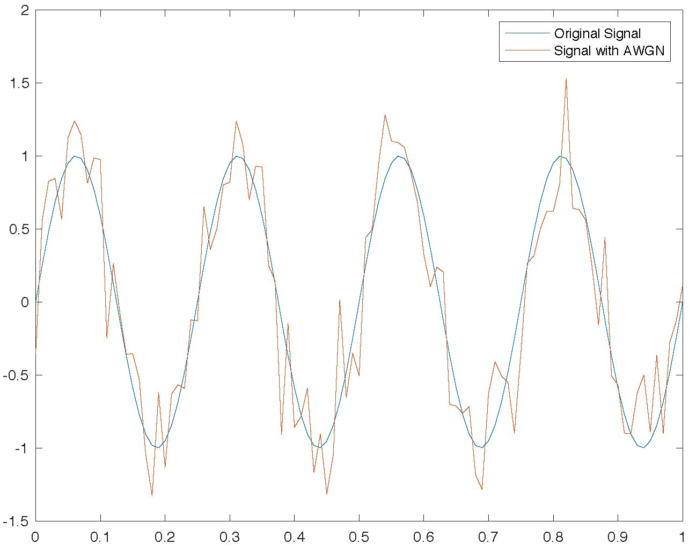

# 路径损耗和阴影衰落

本章介绍由路径损耗（path loss）和阴影（shadowing）效应所引起的接收信号功率随距离变化的规律。路径损耗是由电磁信号在空间中的辐射传播特性造成的，一般认为路径损耗与传播距离直接相关，在相同的传播条件下、信号经过相同的传播距离产生的路径损耗相同。阴影效应是由发射机和接收机之间的障碍物造成的，这些障碍物通过吸收、反射、散射和绕射等方式衰减信号功率，严重时甚至会阻断信号。本章将首先介绍最基础的信号传播模型——自由空间路径损耗模型；然后给出基于大量障碍物的对数正态阴影衰落模型；最后介绍信号质量估计最常用使用的一个指标——信噪比。

<!-- 衰落（Fading）或者说衰减是指由于信道的变化导致接收信号的幅度发生变化的现象，即信号衰落。导致信号衰落的信道被称作衰落信道。 -->

<!-- 衰落可按时间、空间、频率，三个角度来分类。

- [ ] **空间衰落** （首先讲清楚信号强度随着距离和衰落和变化的趋势吧？）

在空间上，分为瑞利衰落和莱斯衰落。瑞利衰落适用于从发射机到接收机不存在直射信号的情况；相反，莱斯衰落适用于发射机到接收机存在直射路径的情况。

- [ ] **时间衰落（？？）**

在时间上，分为慢衰落和快衰落。慢衰落描述的是信号幅度的长期变化，是传播环境在较长时间、较大范围内发生变化的结果，因此又被称为长期衰落、大尺度衰落。快衰落则描述了信号幅度的瞬时变化，与多径传播有关，又被称为短期衰落、小尺度衰落。慢衰落是快衰落的中值。

- [ ] **频率衰落（？？）**

  在频率上，分为平坦性衰落和选择性衰落。相干带宽是描述时延扩展的指标，是表征多径信道特性的一个重要参数。它是指某一特定的频率范围，在该频率范围内的任意两个频率分量都具有很强的幅度相关性，即在相干带宽范围内，多径信道具有恒定的增益和线性相位。通常，相干带宽近似等于最大多径时延的倒数。从频域看，如果相干带宽小于发送信道的带宽，则该信道特性会导致接收信号波形产生频率选择性衰落，即某些频率成分信号的幅值可以增强，而另外一些频率成分信号的幅值会被削弱。当信号带宽远小于相干带宽时，所有的信号频率呈现出一样的强度衰落，称之为平坦性衰落。 -->

## 路径损耗模型

路径损耗，或称传播损耗，指电波在空间传播所产生的损耗，是由发射功率的辐射扩散及信道的传播特性造成的，反映宏观范围内接收信号功率均值的变化。如下图所示，在自由空间中，电磁辐射的强度根据平方反比定律随着距离的增加而减小，因为同样的能量在一个面积上与距离源的距离平方成正比。

图. 电磁波在空间中传播状态

路径损耗具有以下几方面特点：
- 由发射功率的辐射扩散和信道的传播特性造成
- 一般认为对于相同的收发距离，路径损耗相同
- 引起长距离（100m~1000m）上的功率变化

假设信号经过自由空间到达距离$d$处的接收机，发射机和接收机之间没有任何障碍物，信号沿直线传播。这样的信道称为视距(line-of-sight, LOS)信道，相应的接收信号称为LOS信号或互射信号。自由空间路径损耗使接收信号相对于发送信号引入了一个复数因子, 产生接收信号：

$$
r(t) = Re\bigg\{\frac{\lambda \sqrt{G_l}e^{-j2\pi d/\lambda}}{4\pi d}\cdot u(t)e^{j2\pi f_ct}\bigg\}
$$

式中$\sqrt{G_l}$是在视距方向上发射天线和接收天线的增益之积，$e^{-j2\pi d/\lambda}$是由传播距离$d$引起相移。

设发射信号$s(t)$的功率为$P_t$，由接收信号$r(t)$的表达式可得到接收功率和发射功率的比为

$$
\frac{P_r}{P_t} = \bigg(\frac{\sqrt{G_l}\lambda}{4\pi d}\bigg)^2
$$

可见接收功率与收发天线间距离$d$的平方成反比、与信号波长的平方$\lambda^2$成正比。因此，载波频率越高、信号波长越短，则接收功率越小。接收功率与波长$lambda$有关是因为接收天线的有效面积和波长有关。

对应的路径损耗可以表示为：

$$
P_{L} \mathrm{~dB}=10 \log _{10} \frac{P_{t}}{P_{r}}=-10 \log _{10} \frac{G_{l} \lambda^{2}}{(4 \pi d)^{2}}
$$

自由空间传播时，将接收功率表示为dBm的形式：

$$
P_{r} \mathrm{dBm}=P_{t} \mathrm{dBm}+10 \log _{10}\left(G_{l}\right)+20 \log _{10}(\lambda)-20 \log _{10}(4 \pi)-20 \log _{10}(d)
$$

相应的自由空间路径增(free-space path gain)为：

$$
P_{G}=-P_{L}=10 \log _{10} \frac{G_{l} \lambda^{2}}{(4 \pi d)^{2}}
$$

图. 自由空间中电磁波能量随距离衰减曲线

> 思考：有一室内无线局域网，载波频率$f_c= 900MHz$, 小区半径$10m$, 使用全向天线。在自由空间路径损耗模型下，如果要求小区内所有终端的最小接收功率为$10\mu W$, 问接入点的发射功率应该是多大？如果工作频率变成$5GHz$，相应所需的发射功率又为多少？

## 阴影衰落

阴影衰落由发射机和接收机之间的障碍物造成，这些障碍物通过吸收、反射、散射和绕射等方式衰减信号功率，严重时会阻断信号，引起障碍物尺度距离（室外为10m~100m，室内更小）上的功率变化。在移动通信传播环境中，电波在传播路径上遇到起伏的山丘、建筑物、树林等障碍物阻挡，形成电波的阴影区，就会造成信号场强中值的缓慢变化，引起衰落。通常把这种现象称为阴影效应，由此引起的衰落又称为阴影慢衰落。另外，由于气象条件的变化，电波折射系数随时间的平缓变化，使得同一地点接收到的信号场强中值也随时间缓慢地变化。但因为在陆地移动通信中随着时间的慢变化远小于随地形的慢变化，因而常常在工程设计中忽略了随时间的慢变化，而仅考虑随地形的慢变化。它是由于在电波传输路径上受到建筑物或山丘等的阻挡所产生的阴影效应而产生的损耗。它反映了中等范围内数百波长量级接收电平的均值变化而产生的损耗，一般遵从对数正态分布。

阴影衰落造成信号在无线信道传播过程中发生随机变化，传播路径上的反射面和反射体也在随机变化，从而导致给定距距离处接收信号的功率的存在随机性。为了准确地描述信道对信号的影响，我们需要建立一个模型来描述这些因素造成的信号随机衰减。

造成信号随机衰减的因素，一般包括障碍物的位置、障碍物大小、障碍物材料的介电特性、以及反射面和散射体的变化情况。在实际传输场景中，这些因素一般都是未知的，因此只能用统计模型来表征这种随机衰减，最常用的模型是对数正态阴影模型，它已经被实测数据证实，可以精确地建模室外和室内无线传播环境中接收功率的变化。

对数正态阴影模型把发射和接收功率的比值$\psi=P_t/P_r$，假设为一个对数正态分布的随机变量，即

$$
p(\psi)=\frac{\xi}{\sqrt{2 \pi} \sigma_{\psi_{\mathrm{dB}}} \psi} \exp \left[-\frac{\left(10 \log _{10} \psi-\mu_{\psi_{\mathrm{dB}}}\right)^{2}}{2 \sigma_{\psi_{\mathrm{dB}}}^{2}}\right], \quad \psi>0
$$

其中$\xi=10 / \ln 10$，$\mu_{\psi_{d B}}$是以dB为单位的$\psi_{\mathrm{dB}}=10 \log _{10} \psi$的均值，$\sigma_{\psi_{\mathrm{dB}}}$是以dB为单位的$\psi_{dB}$的标准差。上述式子中的均值可以用解析模型或者实测值确定。实测时，由干经验路径损耗的测量已经包括了对阴影衰落的平均，所以$\mu_{\psi_{dB}}$等于路径损耗。对于解析模型，$\mu_{\psi_{dB}}$必须结合考虑障碍物造成的平均衰减和路径损耗（例如从自由空间模型中获得的路径损耗）。也可以把路径损耗从阴影衰落中分离出来单独处理。服从对数正态分布的随机变量称为对数正态随机变量(log-normal random variable）。如果$\psi$为对数正态分布，那么接收功率和接收信噪比也是对数正态分布的，因为这两个量只是$\psi$乘上了一个常系数。对数正态分布的接收信噪比的均值和标准差的单位也是dB,而对数正态接收功率有功率量纲，其均值和标准差的单位是dBm或dBW，而不是dB。路径损耗真值$\psi$的平均值从而可以表示为：

$$
\mu_{\psi}=\mathbf{E}[\psi]=\exp \left[\frac{\mu_{\psi_{\mathrm{dB}}}}{\xi}+\frac{\sigma_{\psi_{\mathrm{dB}}}^{2}}{2 \xi^{2}}\right]
$$

对数正态分布由两个参数$\mu_{\psi_{dB}}$和$\sigma_{\psi_{dB}}$确定， 因为$\psi=P_t/P_r$总大于$1$，故$\mu_{\psi_{dB}}$总大于或等于0。

用实测数据确定阴影衰落模型的均值和标准差时，会遇到这样一个问题，就是应该取真值的平均还是取分贝值的平均。方差的计算也存在同样的问题。实际中常常是对测量值的分贝值取平均，来确定平均路径损耗和方差。原因包括以下几点：首先，对数正态模型的数学分析是建立在分贝测量值之上的；其次，有文献表明分贝平均可以使估计误差更小；其三，功率随距离下降的模型一般是对分贝功率测量值和对数距离的关系进行折线近近似。

大量室外信道测量表明，标准差$\sigma_{\psi_{dB}}$的范围在$4dB~13dB$之间，平均值$\mu_{\psi_{dB}}$取决于路径损耗和所在区域内的建筑物属性。$\mu_{\psi_{dB}}$随距离变化，一是由干路径损耗随距离变化，二是因为距离增加时障碍物的数量会增加，造成平均衰减增加。

当阴影衰落主要由阻挡衰减决定时，分贝平均接收功率的高斯模型可以用下面的哀减模型来分析。信号穿过宽度为d的物休时，其衰减近似为

$$
s(d)=e^{-\alpha d t}
$$

式子中$\alpha$是依赖千陓碍物材料和介电性质的衰减常数。若第$i$个障碍物的衰减常数是$\alpha_i$、障碍物宽度为随机值$d_i$，那么信号穿过该区域时的衰减为

$$
s\left(d_{t}\right)=e^{-\alpha \sum_{i} d_{i}}=e^{-\alpha d_{t}}
$$

如果发射机和接收机之间有多个障碍物物， 那么由中心极限定理，$d_{t}=\sum_{i} d_{i}$可近似为高斯随机变量，即$\log s\left(d_{t}\right)=\alpha d_{t}$是一个均值为$\mu$，方差为$\sigma$的高斯随机变量（$\sigma$的值由传播环境决定）。

## 信噪比

从前文的介绍中我们能够看出来，如果我们能够完美的测量出信道的影响的话，那么我们在接收端能够完全还原出来发送的信号。但是实际通信过程远没有这么美好，首先完美测量出来信道是很难的（大家可以想一下为什么），同时即便是能够完美测量出来，接收端也还是会收到外界噪声的影响。如何衡量噪声的影响，里面有一个很重要的指标是信噪比（Signal-to-noise ratio，SNR or S/N），用于衡量信号强度与噪声强度的关系，定义为信号功率与噪声功率之比。

$$
SNR = \frac{P_{signal}}{P_{noise}} = \frac{A^2_{signal}}{A^2_{noise}}
$$

由于信号强度差别通常都会很大，SNR常使用分贝（dB）作为单位。

$$
SNR(dB) = 10\log_{10} \left(\frac{P_{signal}}{P_{noise}}\right) = 20\log_{10} \left(\frac{A_{signal}}{A_{noise}}\right)
$$

其中，$P_{signal}$为信号功率，$P_{noise}$为噪声功率，$A_{signal}$为信号振幅，$A_{noise}$为噪声振幅。

很显然，SNR越高，信号越强，我们解码起来就越方便，实验中我们经常需要计算不同SNR下性能，或者产生不同SNR下的数据，MATLAB提供了`awgn`函数用于向目标信号按规定的信噪比加入高斯白噪声，调用示例如下：

~~~matlab
fs = 100; % sampling frequency
t = 0:1/fs:1;
x = sin(2*pi*4*t);
% Add white Gaussian noise to signal
% snr = 10dB
y = awgn(x, 10, 'measured');
plot(t, [x, y]);
legend('Original Signal', 'Signal with AWGN');
~~~

图. MATLAB AWGN函数效果示意

> 思考：你知道mean(abs(wgn(1e6, 1, 5, 50, 'dBm', 'complex')))的数学期望是什么吗？
> 答案：$\sqrt{\frac{\pi}{2}\cdot 10^{0.1\cdot (5-30)}\cdot 50\cdot \frac{1}{2}}$ （你可能需要了解所涉及的matlab函数的功能以及瑞利分布）

> **动手试一试** 生成具有不同信噪比的声波信号，从时域、频域分别观察他们的区别。

## 参考文献

1. [Wikipedia/Fading](https://zh.wikipedia.org/wiki/Fading)
2. [Wikipedia/Shadowing](https://zh.wikipedia.org/wiki/Shadowing)
3. Goldsmith, Andrea. Wireless communications. Cambridge university press, 2005.