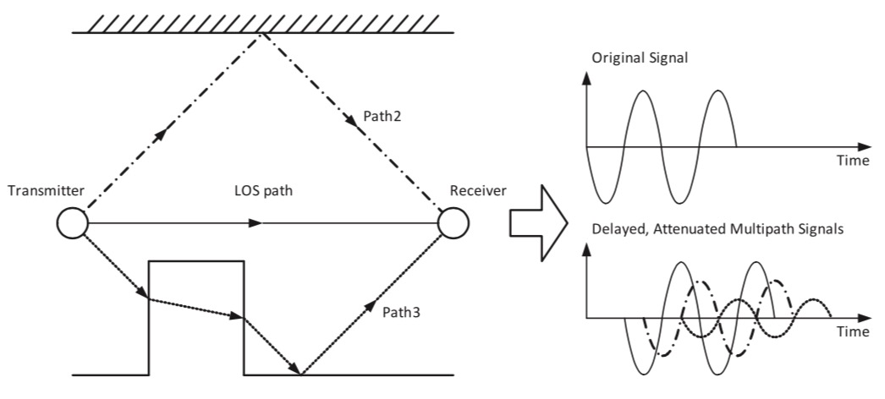
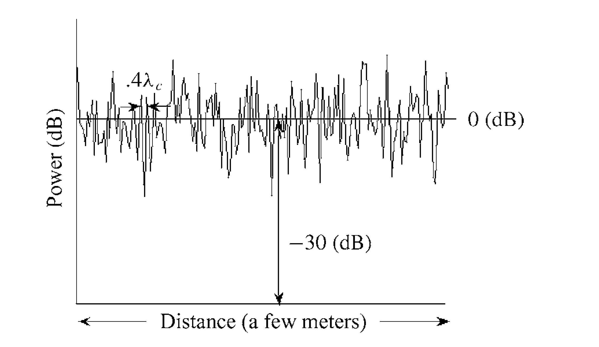
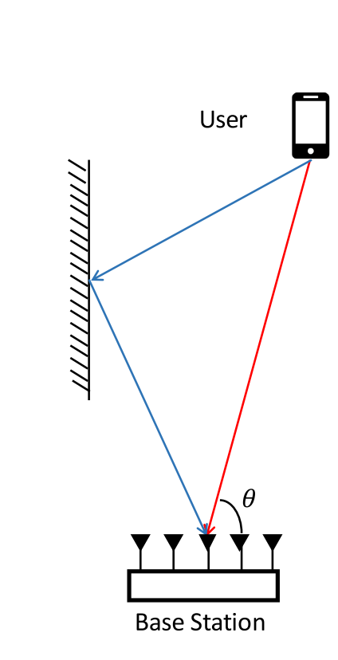
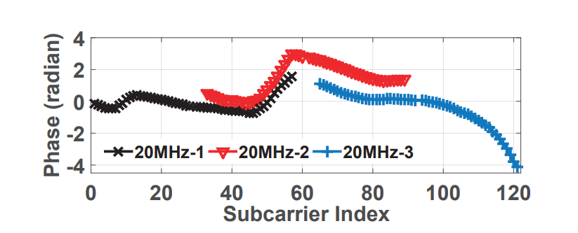
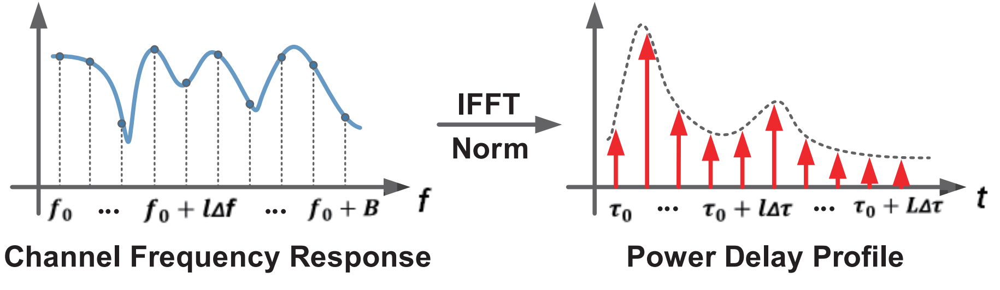

# 多径信道模型

## 多径效应

电磁波在传播过程中可能出现折射、反射、漫射、衍射等现象，因此当通信环境比较复杂时，在接收端可能会收到多路来自不同路径的信号副本。通常来说，这些信号副本的传播路径可以大致分为视距路径（LOS, Line of Sight）和非视距路径（NLOS, Not Line of Sight）两类。如下图所示，由不同传播路径到达的信号副本具有不同的延迟和能量衰减。如果第一个到达的信号和最后一个到达的信号时间之差（多径时延扩展）非常小，相当于所有的信号都是在叠加相长（波峰和波峰叠加，波谷和波谷叠加），则这样的多径叠加对信号的解码影响不大。但是当时多径延扩展比较大时，信号的叠加就有可能是相消的（即波峰和和波谷叠加），这样就会造成信号的失真，使接收机无法解码信号。

图. 多径效应示意

由多径效应带来的信号的衰落在时间尺度上是和信号的周期同一个数量级，在距离尺度上和信号波长为同一数量级，信号的波长尺度相对于人移动的距离来说是很小的，所以多径效应是快衰落，也叫小尺度衰落；与之对应的，阴影效应和路径损耗是慢衰落，也叫大尺度衰落。

<!-- 信道传输过程中，经常要处理的一个重要问题就是如何解决衰减和多径带来的问题，想象一下如果信道传输过程中没有衰减和多径的影响，接收端能够完全没有变化的接收到发送端的信息，那么解码过程应该就要方便很多。下面我们就来看在实际信道中怎么样来表示这样的衰减和多径效应，如何通过参数来唯一的表示一个信道。 -->

下面介绍多径效应的数学表达形式，假设要发送的基带信号为$u(t)$，通过将发送信号与高频载波相乘，并取结果的实部，即为发送端最终发送的信号。乘载波的过程可以表示为：

$$
\begin{aligned}
s(t) &=\operatorname{\Re}\left\{u(t) \mathrm{e}^{\mathrm{j} 2 \pi f_{\mathrm{c}} t}\right\} \\
&=\Re\{(\Re\{u(t)\}-j\Im\{u(t)\}) \times (\cos( 2 \pi f_{\mathrm{c}} t)-j\sin(2\pi f_c t)\}\\
&=\operatorname{\Re}\{u(t)\} \cos \left(2 \pi f_{\mathrm{c}} t\right)+\operatorname{\Im}\{u(t)\} \sin \left(2 \pi f_{c} t\right)
\end{aligned}
$$

该信号的多个副本经过不同传播路径后在接收端叠加，叠加后信号可以表示为：

$$
r(t)=\operatorname{Re}\left\{\sum_{n=0}^{N(t)} \alpha_{n}(t) u\left(t-\tau_{n}(t)\right) \mathrm{e}^{\mathrm{j}\left(2 \pi f_{c}\left(t-\tau_{n}(t)\right)+\phi_{D_{n}}(t)\right)}\right\}
$$

从上面这个表示可以看出来，$a_n(t)$是不同路径信号幅度时变衰减，由路径损耗和阴影衰落确定；$\tau_n(t)$是不同路径的信号路径传输时延$\tau_n(t)=r_n(t)/c$，$\phi_{D_n}(t)$是不同路径的多谱勒相移。从上式可以看出，相比于原始信号，第$i$路多径信号的相位变化量为

$$
\phi_n(t)=2 \pi f_{c} \tau_{n}(t)-\phi_{D_{n}}(t)
$$

将$\phi_n(t)$代入$r(t)$的表达式，有

$$
r(t)=\operatorname{Re}\left\{\left[\sum_{n=0}^{N(t)} \alpha_{n}(t) \mathrm{e}^{-\mathrm{j} \phi_{n}(t)} u\left(t-\tau_{n}(t)\right)\right] \mathrm{e}^{\mathrm{j} 2 \pi f_{c} t}\right\}
$$

上式可以转换成输入信号和信道响应相互卷积的形式：

$$
\begin{aligned}
r(t) &=\operatorname{Re}\left\{\left[\sum_{n=0}^{N(t)} \alpha_{n}(t) \mathrm{e}^{-j \phi_{n}(t)} u\left(t-\tau_{n}(t)\right)\right] \mathrm{e}^{\mathrm{j} 2 \pi f_{\mathrm{c}} t}\right\}\\
&=\operatorname{Re}\left\{\left[\sum_{n=0}^{N(t)} \alpha_{n}(t) \mathrm{e}^{-j \phi_{n}(t)}\left(\int_{-\infty}^{\infty} \delta\left(\tau-\tau_{n}(t)\right) u(t-\tau) \mathrm{d} \tau\right)\right] \mathrm{e}^{j 2 \pi f_{c} t}\right\} \\
&=\operatorname{Re}\left\{\left[\int_{-\infty}^{\infty} \sum_{n=0}^{N(t)} \alpha_{n}(t) \mathrm{e}^{-j \phi_{n}(t)} \delta\left(\tau-\tau_{n}(t)\right) u(t-\tau) \mathrm{d} \tau\right] \mathrm{e}^{\mathrm{j} 2 \pi f_{c} t}\right\} \\
&=\operatorname{Re}\left\{\left[\int_{-\infty}^{\infty} c(\tau, t) u(t-\tau) \mathrm{d} \tau\right] \mathrm{e}^{\mathrm{j} 2 \pi f_{c}(t)}\right\} 
\end{aligned}
$$

直观地来理解一下上面的卷积形式的接收信号：对于任意的发射时刻$(t-\tau)$都有可能对$t$时刻的接收信号产生贡献。但是究竟是哪几个时刻发射信号会产生贡献和产生什么样的贡献呢？$c(\tau,t)$回答了这个问题，通过与$c(\tau,t)$卷积，确定了发射时刻和接受时刻的时间差等于路径传输时延的信号，并赋予了幅度衰减和相位变化。$c(\tau,t)$表示$t-\tau$时刻发出的信号，在时刻$t$收到，此时信号对应的信道系数。$c(\tau,t)$体现了时变信道的两个特点：
1. 通信时间不同（$t$不同），对应信道状态不同
2. 传播延时不同（$\tau$不同），对应信道状态不同

在最简化的情况下，信道响应$c(\tau,t)$不随时间发生变化，这样一来信道响应就只与多径时延有关，即

$$
c(\tau)=\sum_{n=0}^{N} \alpha_{n} \mathrm{e}^{-\mathrm{j} \phi_{n}} \delta\left(\tau-\tau_{n}\right)
$$

## 多径衰落模型

在介绍多径衰落模型之前，我们先回顾一下多径时延扩展的定义：维基百科对多径时延扩展的定义是最长多径路径与最短多径路径之间的传播时间差，即上文使用的第一个到达的信号和最后一个到达的信号时间之差。根据多径时延扩展不同，可以将多径衰落模型分为窄带衰落和宽带衰落。我们用一个示意图形象地展示窄带衰落和宽带衰落的差异，下图中，右上角是窄带衰落，右下角是宽带衰落。

图. 窄带衰落与宽带衰落示意

**窄带衰落**：对于时延扩展远远小于发射信号带宽倒数（$T_m$远小于$\frac{1}{B}$）的信道引起的衰落叫做窄带衰落。简单理解，由于基带的带宽和码元的周期有着千丝万缕的关系（通常码元周期是基带带宽倒数的整数倍），可以认为窄带衰落发生时，信号的时延扩展远远小于一个码元周期。在这种情况下，从不同路径到达的信号可以认为只有相位和振幅的差异，而调制内容包括频率完全相同，即$u(t-\tau_i)\approx u(t)$。对于窄带衰落，接收信号可以表示为：

$$
r(t)=\operatorname{Re}\left\{u(t) \mathrm{e}^{\mathrm{j} 2 \pi f_{c} t}\left(\sum_{n=0}^{N(t)} \alpha_{n}(t) \mathrm{e}^{-j \phi_{n}(t)}\right)\right\}
$$

上式中，$\alpha_n$和路径损耗和阴影效应有关，是一个随机变量，相位$\phi_n$受多谱勒、时延、初相影响，也可以看作一个随机量。假设多径数量$N(t)$足够大，则根据大数定理，系数$\sum_{n=0}^{N(t)} \alpha_{n}(t) \mathrm{e}^{-j \phi_{n}(t)}$可以看作是一个随机过程（前提是直视路径不存在，否则$\alpha_n$随机的假设不成立）。如下图所示，窄带衰落的最终结果，为多径叠加后在时域上服从零均值高斯分布，即与噪声效果类似，当然这里的前提是多径数量足够多或多径系数$\alpha_n$服从瑞利分布。

图. 窄带衰落效果示意

<!-- 两路多径信号是否可以拆分，关键看两路信号到达时间差$\tau$与信号带宽$B$的关系： -->
<!-- - 若$\tau < \frac{1}{B}$，两路多径信号可看作一路（收到的信号能量为两路多径之和）
- 否则，两路多径信号必须分离看待（收到信号的可能发生变形，能量随时间变化）

**通常当多径之间无法分辨（unresolvable），由于每一组叠加的信号分量随时间叠加增强或减弱，通信信道表现为时变信道。**

当时变信道且存在多径时，信道可以表示为：
$$
c(\tau,t) = \sum_{n=0}^{N(t)}\alpha_n(t)e^{-j\Phi_n(t)}\delta(\tau-\tau_n(t))
$$
其中，$\delta(\tau-\tau_n(t))$表示，在时刻$t$，只有延时为$\tau$的多径信号传播到接收端。
时刻$t$收到的信号，只与时刻$t$存在的多径对应——例如$t_1$时刻存在3条多径，对应延时分别是$(\tau_1,\tau_2,\tau_3)$，则$t_1$时刻收到的信号，只与发送端在$t_1-\tau_1,t_1-\tau_2,t_1-\tau_3$三个时刻发出的信号相关，其他任意时刻发出的信号，都不可能在$t_1$时刻收到。

时不变信道的表示要简单得多，因为信道响应只是相当于信号的时移：
$$
c(\tau) = \sum_{n=0}^{N}\alpha_ne^{-j\Phi_n}\delta(\tau-\tau_n)
$$
即任意时刻收到的信号，只与每条多径的时延有关（是发送信号关于时延$\tau$的一个平移），与接收信号的时刻$t_1$还是$t_2$无关。

**多径衰落（Fading）：**
在多径存在的情况下，如果$f_c\tau_n(t)>>1$，则当多径的传播距离发生微小变化，对应多径信号的接收相位将急剧改变，从而使接收端信号收到的多径信号在叠加增强/相消之间切换，使接收信号强度发生波动变化。

定义**信道时延延展**（$T_m$）为最大多径时延$\tau_n$与LOS时延$\tau_0$之差（也有定义为任意多径时延与平均时延的最大差值）。
当$T_m << \frac{1}{B}$（即信道时延扩展足够小、所有多径都不能分离），信号传播信道符号窄带衰落模型。

当某信道符合窄带衰落模型，则认为该信道的一次传输中，不同多径的叠加无法分辨（unresolvable）。
从而可以认为其中传播的多径信号基本具有相同、且可忽略不计的传播时延，即$u(t-\tau_i)\approx u(t),\quad\forall i$。
在这种情况下，接收端收到的信号，仅仅是发送信号$s(t)$乘上一个可变的系数（与发送信号本身无关）。 -->

> **思考：**
> single tone是最常见的窄带信号，假设有一单频信号$s(t)=\Re\{e^{j(2\pi f_c t+\phi_0)}\}=cos(2\pi f_c t+\phi_0)$将在信道中传播，考虑以下问题：信号经信道传播到达接收端，不考虑LoS，其余多径分量的叠加将产生怎样的结果？

接收端多径叠加信号可表示为：$r(t)=\Re\{[\sum_{n=0}^{N}\alpha_n(t)e^{-j\phi_n(t)}]e^{j2\pi f_c t}\}$，由欧拉公式$e^{j\phi}=\cos(\phi)+j\sin(\phi)$得

$$
\begin{aligned}
r(t)&=\Re\big\{\big[\sum_{n=0}^{N}\alpha_n(t)[\cos(\phi_n(t))-j\sin(\phi_n(t))]\big]\times\big[\cos(2\pi f_c t)+j\sin(2\pi f_c t)\big]\big\}\\
&=r_I(t)\cos(2\pi f_c t)+r_Q(t)\sin(2\pi f_c t)
\end{aligned}
$$

这里的$\Phi$与$t$有关，是考虑了多普勒效应。上式中的$r_I(t)$和$r_Q(t)$分别表示多径叠加系数（指不同多径相位和振幅的叠加）的In Phase和Quadrature Phase成分：

$$r_I(t)=\sum_{n=1}^{N(t)}\alpha_n\times \cos(\phi_n(t))$$

$$r_Q(t)=\sum_{n=1}^{N(t)}\alpha_n\times \sin(\phi_n(t))$$

当N趋向于无穷大，根据中心极限定理，$r_I(t)$和$r_Q(t)$分别服从零均值高斯分布（实际上N较小时，只要$\alpha(t)$服从瑞利分布，上述结论仍然成立）。也就是说，多径叠加的结果，在时域上服从零均值高斯分布，即与噪声效果类似，当然这里的前提是多径数量足够多或多径系数$\alpha$服从瑞利分布。

**宽带衰落**：当$T_m$远小于$\frac{1}{B}$这个条件不成立的时候，发射信号会在接收端产生很宽的时延扩展，这样会导致前一时刻的码元的时延扩展侵占后面码元的时间，从而对其他时刻的码元产生干扰，即码间串扰。消除码间串扰的办法有很多，例如OFDM中的循环前缀，感兴趣的读者可以自行了解。

## 多径测量方法

本节介绍如何测量多径信息，即测量多径信道中不同信号副本的到达时间和能量衰减。由于多径效应的存在，同一信号的不同副本在以不同延迟和衰减在接收端混叠。为了准确地提取混叠信号中各信号副本的信息，我们可以令发送端传输一特定格式的信号$s(t)$，然后在接收端使用$s(t)$与收到的多径混叠信号$r(t)$计算相关。通过设计$s(t)$的格式，可以使$s(t)$只在与多径信号副本完全对齐时产生相关性波峰（调频线性波即为满足此要求的一种常用信号）。最后，通过提取$s(t)$与$r(t)$的相关性波峰，即可分离并测量各多径信号分量。

上述多径测量方法奏效的前提，是将收到信号$r(t)$与原始信号$s(t)$计算相关性后，可以准确地分离各相关性波峰。理想情况下，如果对$s(t)$的信号长度不做限制，则当$s(t)$与$r(t)$中信号副本完全对齐时可产生一无限窄的相关性波峰，$r(t)$中任意两个信号副本的相关性波峰互不影响。但实际上，由于$s(t)$的持续时间并非无限长，通过相关性计算后得到的是具有一定宽度的波峰，由此$r(t)$中时间接近的信号副本产生的相关性波峰可能互相重叠，甚至无法区分。

为了解决这一问题，SIGCOMM’16的工作R2F2提出通过测量接收信号中不同多径副本的到达角来区分不同多径信号。如下图所示，信号经过不同传播路径到达接收端通常产生不同的入射角。

图. 多径到达角示意

R2F2提出使用多天线接收端，通过分析不同天线接收信号的差异，准确提取多径信号分量的到达角。R2F2的优势在于，尽管不同多径信号的到达时间差异非常微小，但他们的到达角可能存在明显差别，由此相比于直接对接收信号计算相关分离多径，R2F2可以更好地提取不同多径信号之间的差异。但R2F2在实现过程中仍然面临许多挑战，其中最核心的挑战在于如何在接收端有限的天线数量下，尽可能精确地分离不同多径信号的到达角。R2F2提出了一种基于最优化波峰拟合的方法，迭代地优化各波峰参数，从而尽可能精确地恢复不同到达角方向上的波峰。

图. R2F2提取多径到达角过程示意

<!-- MobiCom'15的工作Splicer则提出通过先提取信道的频域响应特征，然后通过逆傅里叶变换得到信号的多径特征。此方法在理论上的多径分辨率受限于频域带宽。Splicer提出使用商用WiFi网关，通过拼接多个不同WiFi信道的CSI信息，从而获取更高的多径测量精度。 -->

<!-- 

 -->

<!-- 

图. Splicer信道拼接过程示意

 -->

<!-- 通过拼接多个WiFi信道，Splicer可以将多径测量的带宽拓展至数GHz，从而实现ns级的多径分辨精度。Splicer将信道频域响应特征转化为时域时延特征的过程如下图所示。Splicer在实现过程中最大的挑战，是如何修正不同信道信号的相位、载波频率偏移等差异。 -->

<!-- 

 -->

<!-- 

图. Splicer通过IFFT将频域响应特征变换为多径能量时延特征

 -->

<!-- ref：Precious Power Delay Profiling, Chime, .etc. -->