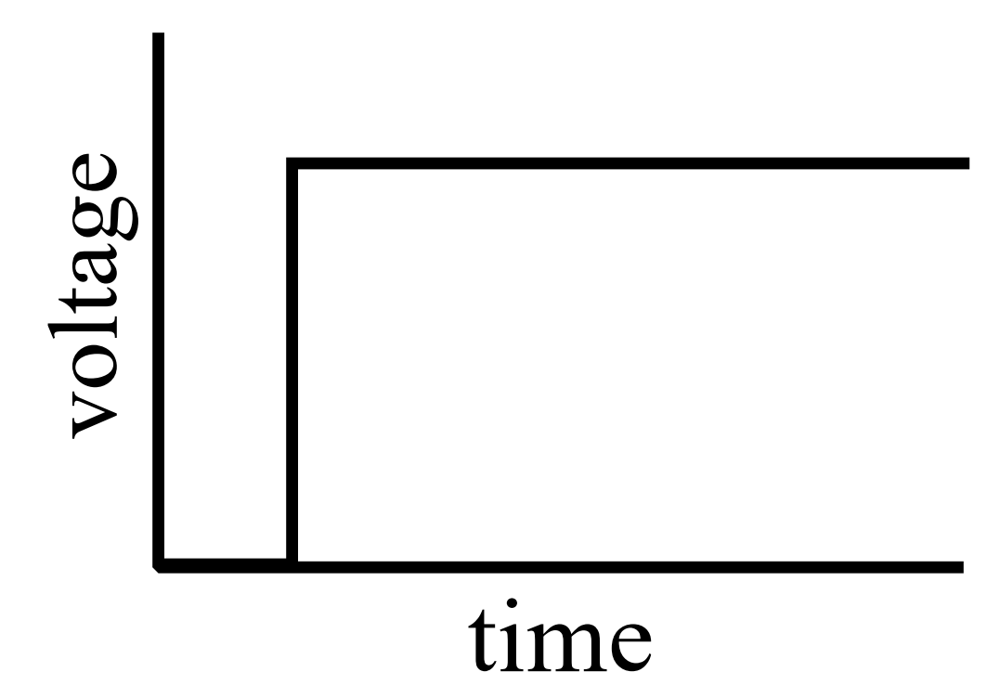
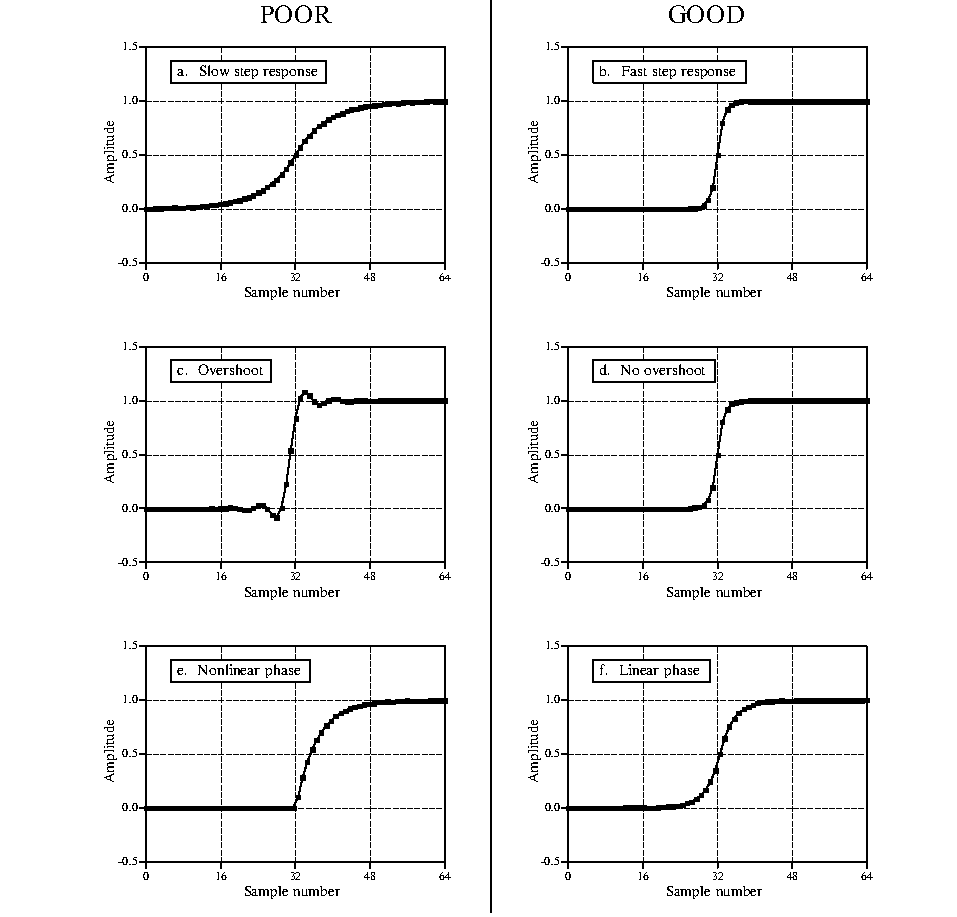
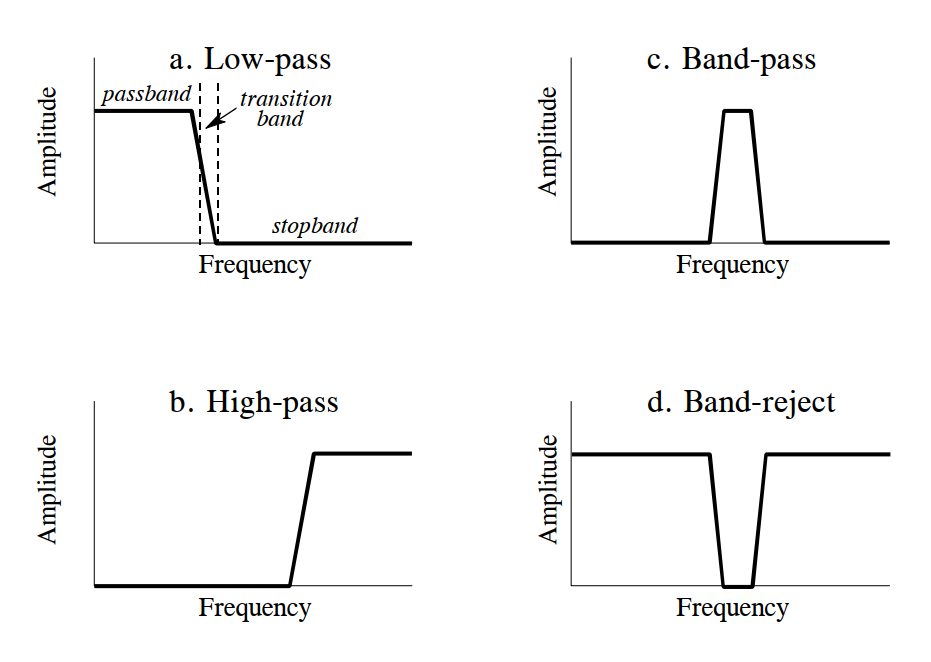
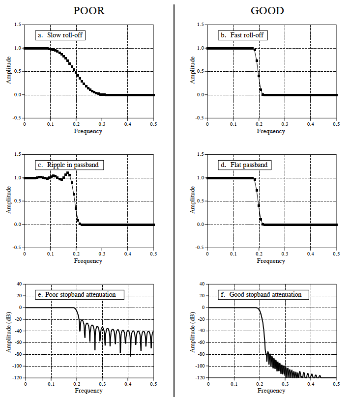
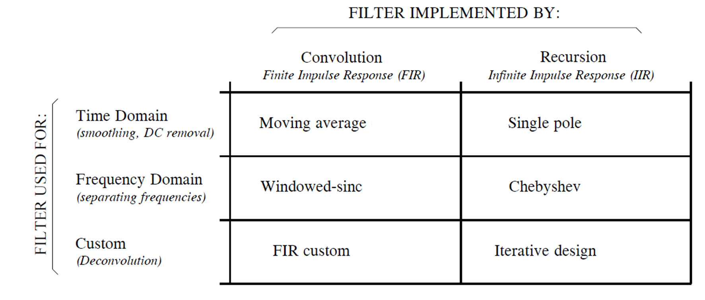

# 数字滤波器简介

## 简介

在数字信号处理领域，“滤波”是最古老、也是最经典的话题之一，滤波器设计与优化也是数字信号处理领域的一个重要课题。滤波器在物联网系统中扮演着非常重要的作用，物联网感知和通信环节中都需要通过滤波以实现特定的功能。本章将向大家介绍滤波器的基本原理和作用，重点在于让大家理解不同类型滤波器的特点和差异，并且能够针对不同的应用需求选择合适的滤波器。

数字滤波器的作用通常可以概括为两方面—— **信号恢复(signal restoration)** 和 **信号分离(signal separation)** 。**信号恢复** 指滤波器能对失真信号进行恢复，一定程度地还原出原始信号的波形特征，例如当处理劣质录音设备采集到的失真音频信号时，数字滤波可以消除失真信号中的噪点或直流干扰，使滤波后信号的波形更接近原始的声音内容。**信号分离** 则指滤波器可以从冲突、干扰、或噪声中分离目标信号，例如检测胎儿心电图时，心电信号同时包括胎儿和母体的心跳特征，使用数字滤波可以将胎儿的心电信号同母体分离开来，实现信号分离。 

数字滤波的两方面作用恰好对应了信号携带信息的两种不同模式—— **时域调制** 和 **频域调制** 。**时域调制**指使用信号的振幅、相位等波形特征表示要携带的信息内容，在这种情况下时域的采样结果可直接用于信息内容的提取，例如天文学家通过采集太阳的光照强度来分析太阳黑子的爆发情况。对于这类时域调制的信号，数字滤波器的信号恢复功能可用于还原信号的时域波形特征，例如通过数字滤波使信号更加平滑（smoothing）或消除时域信号中的直流分量（DC removal）。**频域调制** 不如时域调制那么容易直接理解，其核心是利用周期信号的频率特征区别和表示不同的信息，当从频域调制信号中提取编码内容时，需要先将信号变换至频域，通过分析频域的能量分布确定携带信息内容。数字滤波的信号分离功能可用于在频域分离冲突、干扰或噪声信号，通过信号分离更好地提取目标信号的频域特征。

考虑差异性的信号特征和多样化的应用需求，不存在一个通用的完美滤波器可以“放之四海而皆准”满足所有应用的需求。例如一个简单的滑动平均滤波器可以适用于大部分时域信号恢复场景，但其频域响应响应则不尽如人意，无法有效分离多个不同频率信号。又如切比雪夫滤波器可以在频域分离不同频率的信号，但从时域上看，滤波后信号的相位和振幅都发生了显著变化，失真明显。因此，数字信号处理工程师们为了满足不同的应用需求，设计了多种不同的滤波器。本节剩余部分，我们将介绍一系列的滤波器参数指标，从时域和频域分别对滤波器的特征进行描述。

## 时域参数

我们通常使用 **阶跃响应（Step Response）** 描述滤波器的时域特征。阶跃响应指输入信号为单位准阶跃信号时，滤波器的响应输出（阶跃信号的形式如下图所示）。由于阶跃信号本质上是单位脉冲信号在时间上的积分，所以对于线性系统而言，阶跃响应就是单位脉冲响应在时间上的积分。看到这里，大家可能会感到疑惑：我们为什么要使用阶跃响应描述滤波器的时域特征？答案在于人脑理解和处理信息的方式：在时域分析中，阶跃响应与人类查看信号中包含的信息的方式相匹配。例如，假设给你一个未知来源的信号并要求你对其进行分析，你潜意识做的第一件事通常是将信号分成相似特性的区域——一些区域可能是光滑的、一些可能具有较大的振幅峰值、一些可能含有较高的噪声，然后分别对不同区域中的信号进行处理。这个过程与阶跃函数高度相似——阶跃函数是表示两个不同区域之间划分的最纯净的方式。它可以标记事件何时开始或事件何时结束。它告诉你左侧的内容与右侧的内容有所不同。 这与人脑查看时域信息的方法不谋而合：一组阶跃函数将信息划分为具有相似特征的区域。反过来，阶跃响应也很重要，因为它描述了滤波器如何影响信号段的分界线。

图. 阶跃信号

从滤波效果的角度也可以理解为什么使用阶跃响应描述时域滤波效果。在时域滤波时，我们的主要目的是恢复信号失真，即希望滤波后的信号可以反映原始信号的时域趋势（包括时域振幅、相位等）。例如，当我们要处理一段受噪声影响而严重失真的音频，对于音频中突兀的单个的噪点，我们希望滤波后该噪点可以被抑制或消除，保持相邻信号的前后一致性；而假如音频内容从某个时刻起从钢琴曲变成了演讲录音，显然我们不希望滤波前后这两段不同内容的声音互相影响、甚至混叠在一起，因此我们希望滤波器可以识别信号从一个稳态（钢琴曲）到另一个稳态（演讲录音）的变化。阶跃信号就是上述滤波例子的极端情况，其包含两个稳态（信号幅度等于0或1），两个稳态在一特定时刻发生切换，利用阶跃信号可以最大程度地检验滤波器对输入信号趋势的反映效果。理想的时域滤波器，应该可以分别消除两个稳态上的异常点，且输出中两个稳态之间互相的影响尽可能小。

通过前面的介绍，我们已经知道使用阶跃响应可以描述滤波器对时域信号的影响。那么给定一个滤波器阶跃响应，阶跃响应的哪些参数可以用于描述该滤波器的性能？

图. 滤波器时域性能评估参数。阶跃响应用于测量滤波器在时域内的性能。有三个参数很重要:(1)过渡速度(transition speed)，如(a)和(b)；(2)过冲(Overshoot)，如(c)和(d)所示；(3)相位线性(决定了阶跃响应的上半部和下半部之间是否对称)，如(e)和(f)所示。

1. 过渡速度（transition speed）：我们规定阶跃响应中输出振幅从10％变化到90％振幅所经历的样本数为过渡速度。为了准确区分相邻的稳态信号，阶跃响应中的过渡段应该尽可能短，即过渡速度尽可能快。图（a）和（b）分别展示了两个具有不同过渡速度的阶跃响应的例子，显然前者可以更好地区分两个不同的信号状态。理想滤波器的过渡速度为0，即阶跃响应中稳态可以瞬时改变，但由于实际信号中噪声、有限采样频率、避免信号混叠等考量，理想的过渡速度是不可能达到的。
2. 过冲幅度（overshoot）：过冲指信号通过滤波器后其时域振幅发生波动的现象，这是时域中包含的信息的基本失真。图（c）和（d）显示了阶跃响应中的过冲现象。理想时域滤波器应该尽可能避免过冲，因为它会改变信号中采样的幅度。 
3. 线性相位（linear phase）：通常希望阶跃响应的上半部分与下半部分对称，如(f)所示。这种对称是为了使上升边与下降边看起来相同。这种对称性被称为线性相位，因为当阶跃响应上下对称时，频率响应的相位是一条直线。

## 频域参数

从频域上看，滤波器的作用是允许某些频率的信号无失真地通过，而完全阻塞另一些频率的信号。对理想数字滤波器而言，**通带** 指频率响应等于1的频率范围，此频率范围内的信号可以无失真地通过滤波器；**阻带** 指频率响应等于0的频率范围，此频率范围的信号被完全阻止。在实际的滤波器实现中，通常无法实现对阻带信号的完全抑制，传统模拟滤波器中将截止频率定义为振幅减小到0.707（即-3dB）的地方，数字滤波器中有时也会看到将信号衰减99％，90％，70.7％或50％的幅度水平被定义为截止频率。此外，实际滤波器在通带和阻带频率之间通常还有一个过渡带，过渡带频率内的信号衰减介于通带和阻带之间。根据允许通过信号频率的不同，我们将滤波器分为低通、高通、带通和带阻四种类型，如下图所示。

图. 四类频域滤波器：(a)低通滤波器； (b)带通滤波器； (c)高通滤波器； (d)带阻滤波器

四类滤波器频域幅度特征分别为：
- 低通滤波器：允许信号中的低频或直流分量通过，抑制高频分量或干扰和噪声。
- 高通滤波器：允许信号中的高频分量通过，抑制低频或直流分量。
- 带通滤波器：允许一定频段的信号通过，抑制低于或高于该频段的信号、干扰和噪声。
- 带阻滤波器：抑制一定频段内的信号，允许该频段以外的信号通过。

上述四种滤波器的共同特征是能够在频域分离不同频率的信号分量，在设计和选择滤波器时，我们需要考虑以下三个重要参数：

1. 滚降速度：为了分离间隔很近的频率，滤波器必须具有快速滚降，如下图（a）和（b）所示。
2. 通带波纹：为了使通带频率不改变地通过滤波器，必须尽可能抑制通带纹波，如下图（c）和（d）所示。
3. 阻带衰减：为了充分阻挡阻带频率，必须具有良好的阻带衰减，如下图（e）和（f）所示。

图. 用于评估频域性能的参数。所示的频率响应是针对低通滤波器的。三个重要参数：（a）和（b）所示的过渡带宽度，（c）和（d）所示的通带纹波，以及（e）和（f）所示的阻带衰减。

## 滤波器分类

下表总结了如何根据数字滤波器的用途和实现方式对数字滤波器进行分类。 数字滤波器根据用途不同可以分为三类：时域、频域和自定义。 如前所述，当信息以信号波形的形式编码时，使用时域滤波器。 时域滤波可实现诸如平滑、直流消除、波形整形等操作。相反，当信息包含在正弦波的频率特征中时，应该使用频域滤波器。频域滤波器的目标是将一个频带与另一个频带分开。 当过滤器需要特殊动作时，比如提取特定模式信号、匹配滤波等，使用自定义滤波器，从频域看自定义滤波器比四个基本响应（高通，低通，带通和带阻）要复杂得多。

图. 滤波器分类

数字滤波器可以通过卷积和递归两种方式实现。通过卷积实现的滤波器，由于卷积核长度有限，其冲击响应也具有有限长度，即当前时刻的输出取决于之前的有限输入，且对于脉冲输入信号的响应最终趋向于0，因此基于卷积实现的数字滤波器也称为有限冲激响应滤波器或FIR滤波器。通过递归实现的滤波器，当前时刻的输出不仅取决于之前N个时刻的输入，还受之前M个时刻输出的影响（借助反馈链路），其冲击响应可以达到无限长，因此基于递归实现的滤波器也称为无限冲激响应滤波器或IIR滤波器。与使用递归的IIR过滤器相比，通过卷积执行的FIR过滤器的性能要好得多，可以实现更优的滤波效果，但是缺点是执行速度要慢得多。

