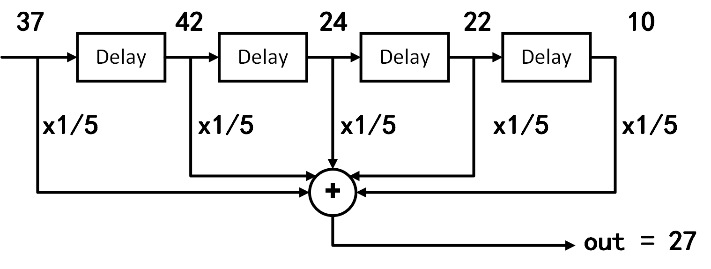
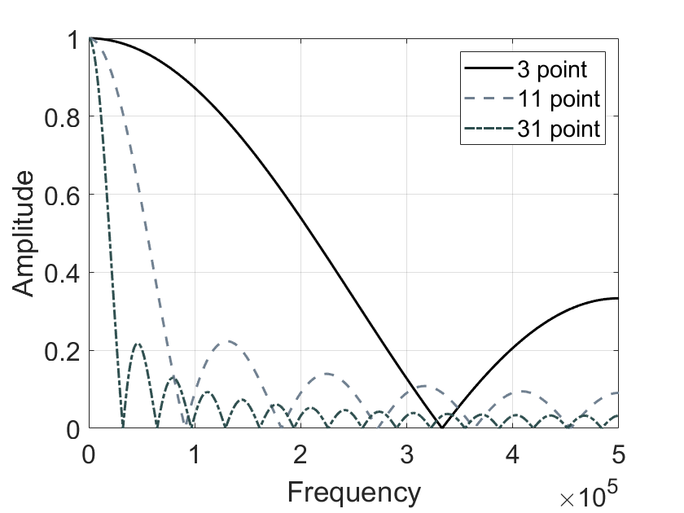

# 滑动平均滤波器

## 简介

移动平均滤波器在数字信号处理中是最常见的滤波器，主要原因是它是最容易理解和使用。滑动平均滤波器非常适合用于减少随机噪声，同时保持清晰的阶跃响应，这使其成为时域编码信号的首选滤波器。但是，从频域看，滑动平均滤波器是对频域编码信号最不友好的滤波器，它几乎没有能力将一个频带与另一个频带分开。由滑动平均滤波器发展来的滤波器还包括高斯滤波，布莱克曼滤波和多次滑动平均滤波，这些改进的滑动平均滤波器在频域中具有稍好的性能，但以增加的计算时间为代价。

## 滑动平均的卷积实现

说起滑动平均，大家应该都很熟悉，这种利用滑动窗口计算数据集中不同子集平均数的数据分析方法，广泛应用在数据分析和财务统计中。例如利用滑动平均分析股票价格、交易量、研究国内生产总值、就业或其他宏观经济时间序列等，滑动平均的主要特点是可以消除短期波动，突出长期趋势或周期。接下来我们将通过一个实际的例子，带领大家回顾滑动平均的实现过程。
<!-- 事实上，通过接下来的介绍，我们会发现滑动平均这种消除短期波动的特点，本质上等同于使用滤波器滤除高频噪声的过程，即滑动平均的效果实际上是对输入数据实施了低通滤波。我们接下来以一个实际的例子，说明滑动平均和低通滤波的关系。 -->

<!-- - [ ] 我们结合着滑动滤波，要思考两个问题：1）为什么滑动平均是滤波，为什么能够滤掉高频。2）滑动平均滤波的性能怎么样，还有没有比滑动平均更好的滤波方法。（这个地方要重点阐释清楚），从滑动滤波出发，以FFT频域时域为基础，解释清楚滤波这个事情，同时介绍好典型的滤波器及其特点。满足大部分需要使用滤波器的人的需求。 -->

考虑一组长度有限的非零输入，滑动平均滤波器首先确定一个长度固定的滑动窗口。以下表中的数据为例，我们使用一个长度为5的滑动窗口，计算某桥梁在五分钟的跨度内，每分钟通过汽车数量的平均值。表格的第二列是每分钟实际通过汽车数，滑动平均操作从第5个数开始，计算这个数与其前4个数的平均值（如下表第三列的27），该平均值就是滑动平均算法的第一个输出。然后移动滑动窗口，计算下一个数与其前4个数的平均值（如下表第三列的第二个输出40.4）。以此类推，直至所有输入的数都参与过平均值计算。

|序号|过去1分钟通过汽车数量|过去5分钟平均通过汽车数量|
|-----|-----|-----|
|1|10|-|
|2|22|-|
|3|24|-|
|4|42|-|
|5|37|27|
|6|77|40.4|
|7|89|53.8|
|8|22|53.4|
|9|63|57.6|
|10|9|52|

我们可以使用MATLAB的`movmean()`函数用于计算滑动平均：
>`M = movmean(A,k)` 返回由局部 `k` 个数据点的均值组成的数组，其中每个均值是基于 `A` 的相邻元素的长度为 `k` 的移动窗口计算得出。当 `k` 为奇数时，窗口以当前位置的元素为中心。当 `k` 为偶数时，窗口以当前元素及其前一个元素为中心。当没有足够的元素填满窗口时，窗口将自动在端点处截断。当窗口被截断时，只根据窗口内的元素计算平均值。`M` 与 `A` 的大小相同。

`movmean()`的第`n`个输出对应的窗口默认以第`n`个输入为中心，当然，我们也可以指定第`n`个窗口在输入序列中的具体位置。例如，`M = movmean(A,[kb kf])` 通过长度为 `kb+kf+1` 的窗口计算均值，其中包括当前位置的元素、后面的 `kb` 个元素和前面的 `kf` 个元素。下面展示的是我们利用`movmean()`函数计算车辆数量滑动平均的代码：

```matlab
% computes a moving average by sliding a window of length len_win.
din = [10 22 24 42 37 77 89 22 63 9 0 0 0 0];
len_win = 5;
dout = movmean(din,len_win);
% the kth output uses the kth input as the center of the window
dout = dout(ceil(len_win/2):end);
disp(dout);
% Display the Result of Slide Average
figure; hold on
plot(len_win + (0:length(dout)-1),dout,'-o','LineWidth',1.5,'Color','k');
plot(1:length(din),din,'-^','LineWidth',1.5);
xlim([1 len_win+length(dout)-1]);
legend('Filtered', 'Original');
set(gcf, 'Position', [800 800 550 300]);
xlabel('Time');
ylabel('Number of Cars');
set(gca, 'FontSize', 16);
box on
```

使用滑动窗口计算平均的结果如下图所示，在输入数据中原本存在许多突变的点，这些点在滑动平均操作后都变得更加平滑了。
<!-- **直观上看，考虑在时间序列中，突变的点对应高频的信号，因此滑动平均操作可以消除输入序列中的高频分量。通过滑动平均操作，我们实现了过滤高频分量、保留低频分量的目标，即实现了一个简单的低通滤波器。** -->

<center>

</center>

<!--  -->
<center>
<div style="color:orange; border-bottom: 1px solid #d9d9d9;
display: inline-block;
color: #999;
padding: 2px;">图. 滑动窗口计算平均的结果</div>
</center>

在上面的这个例子中，直到输入前五个点后，滑动窗口才在**时刻5**输出了第一个滑动平均的结果，即

$$
y_{avg}(5) = \frac{1}{5}[x(1)+x(2)+x(3)+x(4)+x(5)]
$$

对于更一般的情况，**时刻n**的输出$y_{avg}(n)$，我们可以将其表示为：

$$
y_{avg}(n) = \frac{1}{5}[x(n-4)+x(n-3)+x(n-2)+x(n-1)+x(n)]=\frac{1}{5}\sum_{k=n-4}^{n}x(k)
$$

从上式可以看出，每个滑动窗口内的平均计算，可以理解为对窗口内所有输入值求和后再除以窗口长度（如下图所示）。

<center>

</center>

<!--  -->
<center>
<div style="color:orange; border-bottom: 1px solid #d9d9d9;
display: inline-block;
color: #999;
padding: 2px;">图. 求和后平均</div>
</center>

如果我们根据乘法分配律，将乘系数的操作移到求和之前，在滑动窗口内的平均计算就变成了对输入数据的加权求和。只不过在这个例子中，所有输入的权重都是相同的（即$\frac{1}{5}$）。

<center>

</center>

<!--  -->
<center>
<div style="color:orange; border-bottom: 1px solid #d9d9d9;
display: inline-block;
color: #999;
padding: 2px;">图. 加权求和</div>
</center>

显然，上述滑动平均的过程，本质上等同于一个卷积运算，其卷积核为一个简单的矩形脉冲，即$1/5,1/5,1/5,1/5,1/5$。

## 噪声抑制与窗口选择

仅从滑动平均滤波器的实现方法看，很多人也许会质疑它的实际效果，因为它的实现实在是过于简单。但正因为因为滑动平均滤波器实现非常简单，所以它通常是遇到问题时首先要尝试的方法。事实上，滑动平均滤波器不仅对许多应用非常有效，而且对于一些常见问题，它的滤波效果就是最佳的——它可以减少随机白噪声，同时保持最清晰的阶跃响应。

在使用滑动平均滤波器时，最关键的参数是滑动窗口的大小，也就是使用矩形函数作为卷积核时，卷积核的长度。下面用一个实际的MATLAB例子向大家展示使用不同长度的滑动窗口对滑动平均效果的影响。

```matlab
x = randn(1,500)*0.2 + [zeros(1,200), ones(1,100), zeros(1,200)];
figure;
    plot(x,'k','LineWidth',1.5);
    xlabel('Sample number');
    ylabel('Amplitude');
    set(gca, 'FontSize', 16);
    ylim([-1 2]);
    box on
    grid on
    
y1 = movmean(x,11);
figure;
    plot(y1, 'k','LineWidth',1.5);
    xlabel('Sample number');
    ylabel('Amplitude');
    set(gca, 'FontSize', 16);
    ylim([-1 2]);
    box on
    grid on
    
y1 = movmean(x,51);
figure;
    plot(y1, 'k','LineWidth',1.5);
    xlabel('Sample number');
    ylabel('Amplitude');
    set(gca, 'FontSize', 16);
    ylim([-1 2]);
    box on
    grid on
```

原信号及滤波后的信号如下图所示，（a）中的信号是埋在随机噪声中的脉冲，在（b）和（c）中，滑动平均滤波器的平滑作用减小了随机噪声的幅度（优点），但也降低了边缘的清晰度（缺点）。可以看到滑动窗口选择得越长，随机噪声抑制效果越好，但对应的边缘清晰度（阶跃响应的过渡速度）也越差。尽管如此，相比于所有其他可能使用的线性滤波器，当给定最低需要满足的边缘清晰度，滑动平均滤波器对随机噪声的抑制效果是最好的。规定滤波器的降噪量等于平均值中点数的平方根，则一个100点滑动平均滤波器可以将噪声水平降低10倍。

<center>

</center>

<!--  -->
<center>
<div style="color:orange; border-bottom: 1px solid #d9d9d9;
display: inline-block;
color: #999;
padding: 2px;">图. 选择不同滑动窗口时，滑动平均滤波器效果</div>
</center>

要理解为什么滑动平均滤波器是最佳的随机噪声抑制方案，请想象我们要设计一个具有固定边缘清晰度的滤波器。例如，假设我们要求一个滤波器的阶跃响应上升沿不得长于11个采样点，在此要求下，所有基于卷积实现的滤波器（FIR滤波器）的卷积核长度都不得超过11个点。由于可以得到优化问题：如何选择滤波器内核中的11个值，以最小化输出信号上的噪声？对于随机噪声场景而言，每一个采样点的噪声都是随机的，因此，通过在卷积核中为输入点中的任意一个分配较大的系数来对它们中的任何一个进行优先处理是没有用的。 当对所有输入样本同等对待（即滑动平均）时，可获得最佳的噪声抑制效果。

## 频率响应

之前我们说过，滑动平均在时域上可以提供最佳的随机噪声抑制效果，但从频域看，滑动平均滤波器在频带分离任务上表现非常糟糕。我们先用一个MATLAB的仿真实例来观察滑动平均滤波器的频域响应：

```matlab
%% Impaulse Response of moving average filter
% Generating Impaulse
din = zeros(1,1e4);
din(5e3) = 1;

% Impaulse Response of moving average filter
dout = movmean(din,3);
z = fft(dout,100*length(dout));
figure; hold on
    plot(abs(z),'k','LineWidth',1.5);

dout = movmean(din,11);
z = fft(dout,100*length(dout));
    plot(abs(z),'--k','LineWidth', 1.5,'Color','#708090');
    
dout = movmean(din,31);
z = fft(dout,100*length(dout));
    plot(abs(z),'-.k','LineWidth', 1.5,'Color', '#2F4F4F');
    
xlabel('Frequency');
ylabel('Amplitude');
xlim([0 0.5*numel(z)]);
set(gca, 'FontSize', 16);
legend('3 point', '11 point', '31 point');
grid on
box on
```

下图展示了使用不同长度滑动窗口的滑动平均滤波器的频率响应曲线。可以看到，随着滑动窗口长度的增加，通带带宽逐渐变窄，阻带抑制逐渐增强，这与时域上观察到的窗口越长、噪声抑制效果越好相吻合。此外，可以看到无论使用多长的滑动窗口，滑动平均滤波器均具有较长的过渡带，且阻带抑制较差，因此可以判断其在频域是一个表现非常糟糕的低通滤波器。

<center>

</center>

<center>
<div style="color:orange; border-bottom: 1px solid #d9d9d9;
display: inline-block;
color: #999;
padding: 2px;">图. 滑动平均滤波器的频率响应。滑动平均滤波器的过渡带较长，且阻带抑制较差，因此它是一个非常糟糕的低通滤波器。</div>
</center>

事实上，通过计算矩形脉冲的傅里叶变换，我们在数学上描述滑动平均滤波器的频域响应：

$$
H[f] = \frac{sin(\pi fM)}{Msin(\pi f)}
$$

$H[f]$的形式与sinc函数相一致，其特点是过渡带滚降缓慢、阻带抑制不明显。因此，单纯使用移动平均滤波，无法将一个频带与另一个频带分开。请记住，时域的良好性能会导致频域的性能较差，反之亦然。简而言之，移动平均值是一个非常出色的平滑滤波器（时域中的作用），但是却是一个非常糟糕的低通滤波器（频域中的作用）。