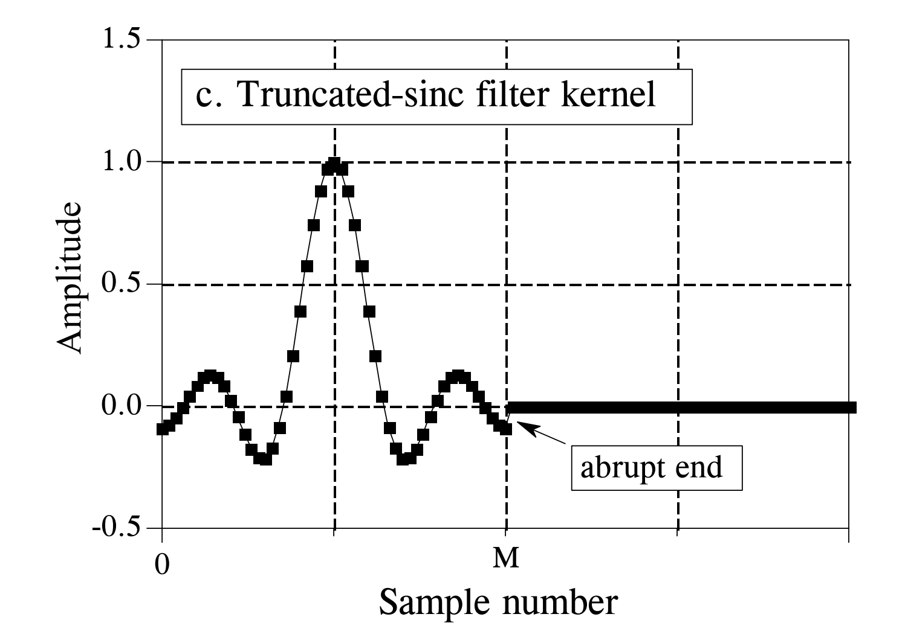
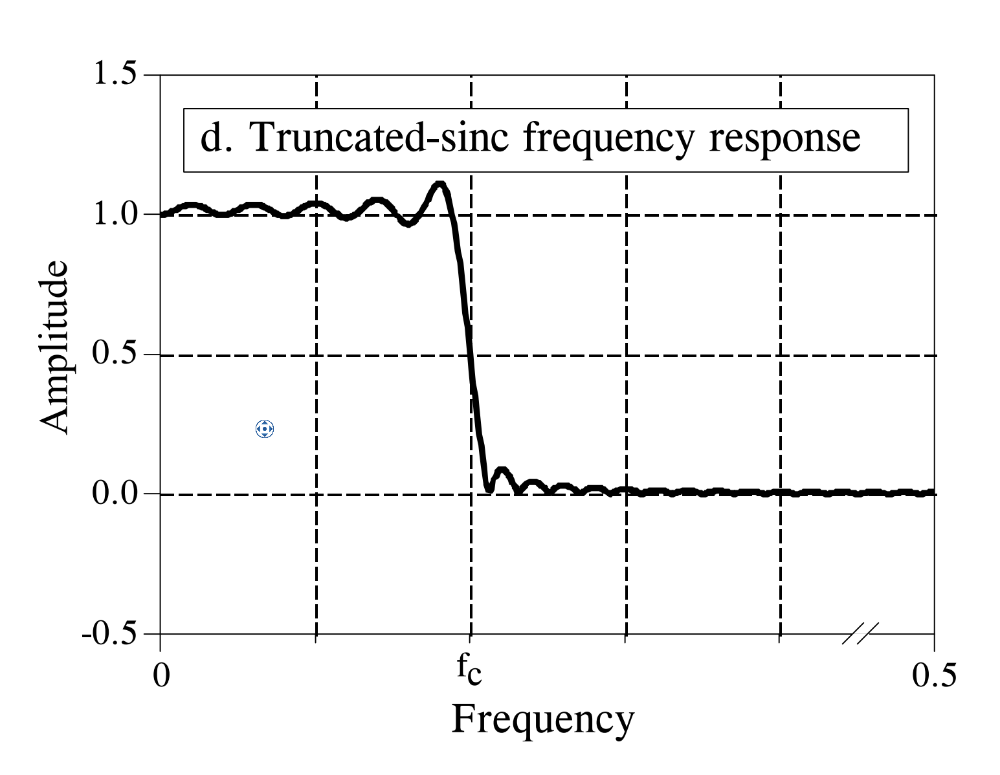
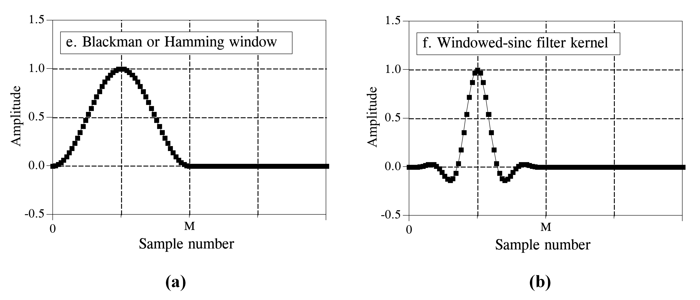
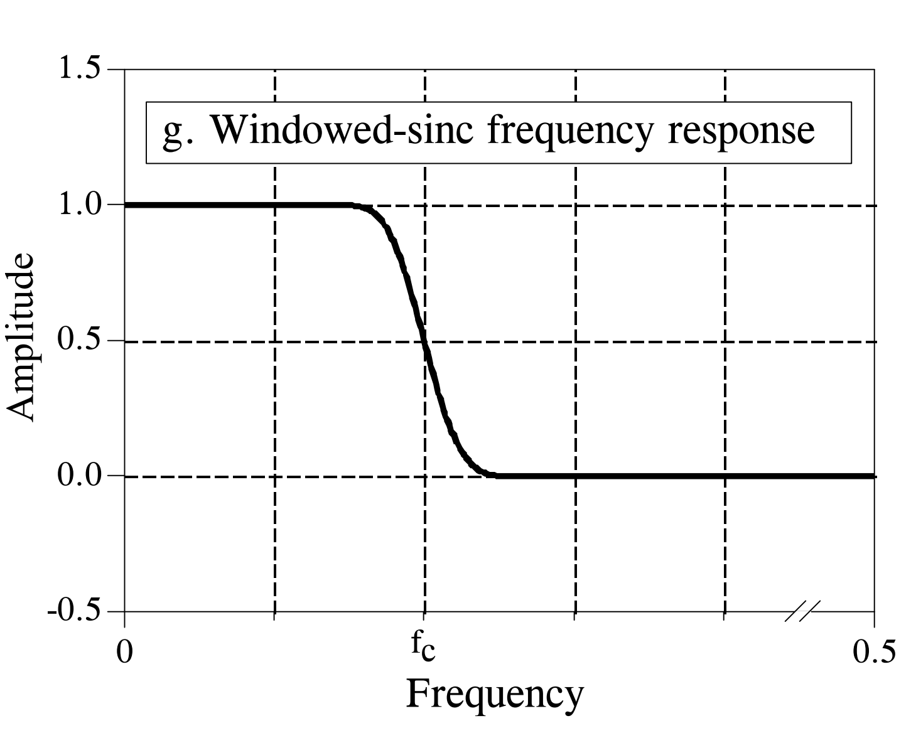

# FIR数字滤波器

## 简介

有限冲激响应（Finite impulse response）滤波器是数字滤波器的一种，简称FIR数字滤波器。这类滤波器对于脉冲输入信号的响应最终趋向于0，即脉冲响应是有限的，因此得名。FIR滤波器使用卷积实现，前文介绍的滑动平均属于一种特殊的FIR滤波器，其卷积核为最简单的矩形脉冲。在上一节的内容中，我们介绍了滑动平均的主要目的是恢复时域信号波形，但受制于其糟糕的频域响应特性，滑动平均滤波器无法实现精准的频域信号分离。本节将介绍FIR滤波器的原理和设计方法，以及如何通过设计合适的FIR滤波器卷积核，实现不同频带信号的分离与恢复。

## FIR滤波器设计策略

FIR滤波器通过卷积实现，因此滤波器设计的核心是如何根据应用需求构造合适的卷积核（Filter kernel）。对于时域滤波，矩形脉冲卷积核（即滑动平均）可以有效恢复时域信号波形，在绝大多数情况下能满足时域滤波需求；而对频域滤波，简单的矩形函数卷积核显然是不够用的，其频域响应无法满足频带分离的要求，因此本节的目标是探索如何根据应用需求，设计可以满足频域滤波需求的FIR卷积核。

假设我们要设计一个低通滤波器，用于分离信号中的低频分量。下图展示了理想低通滤波器的频域响应：对低于通带频率的信号，滤波器可以无失真地通过；而高于通带频率的信号，滤波器可以将其完全抑制，过渡带宽度等于0。

图. 理想低通滤波器。

看到这里，很多同学也许会疑惑，对给定信号做频域滤波，为什么要通过卷积的形式？直接将信号变换到频域，然后将阻带对应的信号分量置为零不是更直接吗？事实上，在一些对处理时间要求不严格的应用场景中，这种做法确实是可行的。考虑在实际应用中我们收集到的信号都是时域信号，我们需要先通过傅里叶变换将信号变换到频域，然后调整频域上不同频率处信号的能量，最后将调整后的信号通过逆傅里叶变换重新恢复到频域。在上述过程中，信号经历了从时域到频域再到时域的多次变换，当信号持续到底需要实时处理时，上述方法很难做到实时支持。由于频域相乘等价于时域卷积，因此我们在实现FIR滤波器时，通常的做法是设计时域的卷积核（滤波器内核），通过卷积的方式对时域信号直接进行滤波。下面介绍如何设计时域卷积核。

对理想滤波器的频率响应进行傅里叶逆变换（IFFT）可产生理想的滤波器内核（即滤波器的时域脉冲响应），如下图所示，理想低通滤波器的时域脉冲响应曲线为一sinc函数，通常形式为：$sin(x)/x$，具体表达式如下：

$$
h[i] = \frac{sin(2\pi f_c i)}{i\pi}
$$

使用该滤波器内核对输入信号进行卷积可提供理想的低通滤波器。但问题是，sinc函数分布范围从负无穷一直到正无穷，不会随着时间增长而下降到零振幅。虽然在数学形式上，这个无限长的滤波器内核没有问题，但它对于计算机来说却是一个巨大的障碍——计算机显然无法处理无限长的信号。

图. 理想低通滤波器的时域脉冲响应。

为了解决这个问题，我们将对上图中的sinc函数做两方面的修改：首先，由于计算机能处理的信号点的数量是有限的，我们将理想低通滤波器的卷积核截断为$M$个点，在截断时围绕主瓣对称选择，其中$M$为偶数。这样的截断等价于将这些$M$点之外的所有卷积核样本点都设置为零。 其次，由于大部分程序设计语言智能支持正索引，我们将整个序列向右移动，使其分布范围为从$0$到$M$，这允许仅使用正索引来表示过滤器内核。经过这样处理之后的滤波器内核如下图所示：

图. 截断sinc函数得到低通滤波器内核。

该内核可以被计算机使用，通过与输入信号卷积实现低通滤波。那这个滤波器内核的滤波效果怎么样呢？下图展示了这个截断后内核的频域响应曲线，可以看到由于在时域上对滤波器内核进行截断，其频域响应曲线与理想低通滤波器发生了显著区别：首先是通带信号的振幅发生明显波动，显著失真；而阻带信号的抑制效果也收到影响，存在能量泄露；最后过渡带的宽度明显增大。

图. 截断sinc函数得到低通滤波器内核对应的频域响应曲线。

上面的例子告诉我们，理想滤波器的很多特性（如通带不失真、阻带全抑制、零过渡带）是我们期望的，但理想和现实总归是存在差距的，在实际情况下我们无法实现理想滤波器，因此只能通过各种手段使实际实现的滤波器性能尽可能与理想滤波器逼近。下面我们将介绍几种滤波器内核优化方法，使我们实现的滤波器可以尽可能逼近理想滤波器的效果。

窗函数可以有效改善FIR滤波器的实际滤波效果。下图(a)展示了Blackman窗函数曲线，通过将截断后滤波器内核与窗函数相乘，可以得到一个新的滤波器内核，如下图(b)所示。

图. 加窗后滤波器内核。

使用窗函数的作用，是窗函数可以被截断的滤波器内核末端的突变，从而改善频率响应。下图显示了窗函数对滤波器频域响应的改进。现在通带是平坦的，阻带衰减是如此之好，以致于无法在该图中看到。

图. 加窗后滤波器频域响应。

事实上，为了优化FIR滤波器的性能，科学家们设计了多种不同的窗函数供用户选择，其中大多数都以上世纪50年代初的开发者的名字命名。不同的窗函数具有不同的特点，例如有的窗函数通带波动小，但过渡带较宽；有的窗函数过渡带极窄，但阻带抑制效果不好。在所有窗函数中，有两个在我们平时信号处理中经常使用，即汉明窗和Blackman窗，它们的表达式分别为：

$$
w[i] = 0.54 - 0.46cos(2\pi i/M)
$$

和

$$
w[i] = 0.42 - 0.5cos(2\pi i/M) + 0.08cos(4\pi i/M)
$$

下图展示了$M=50$时这两个函数的形状。 在实际应用中应该使用这两个窗函数中的哪个，这其实是参数之间的权衡。如下图所示，汉明窗的滚降速度（即过渡带宽度）比Blackman快20％。然而，Blackman具有更好的阻带衰减。确切地说，Blackman的阻带衰减为-74dB，而汉明窗的阻带衰减仅为-53dB。尽管在图中看不明显，但Blackman的通带纹波仅为0.02％，而汉明窗的通带纹波通常为0.2％。因此，在一般情况下，Blackman是我们在信号处理时首先考虑的窗函数，因为与较差的阻带衰减相比，缓慢的滚降是更容易处理的。

图. 窗函数效果对比。

除了窗函数，滤波器内核的长度（即$M$的大小）同样影响滤波器的效果。下图展示了不同长度的滤波器内核对频域滤波效果的影响。滤波器内核截取的采样点越多，其频域响应的过渡带越窄，对应的计算开销也越大。因此如何选择合适的滤波器内核长度是在实际应用中必须权衡的问题。根据工程经验，我们一般讲滤波器内核的长度设置为$M=F_s\times 4/BW$，其中$F_s$是采样频率，$BW$是信号带宽。

图. 滤波器内核长度对滤波器效果影响。

与低通滤波器类似，我们可以使用相同的方法得到高通滤波器、带通滤波器以及带阻滤波器的滤波器内核，并通过选择合适的窗函数以及滤波器内核长度，优化其性能，实现定制化的滤波需求。