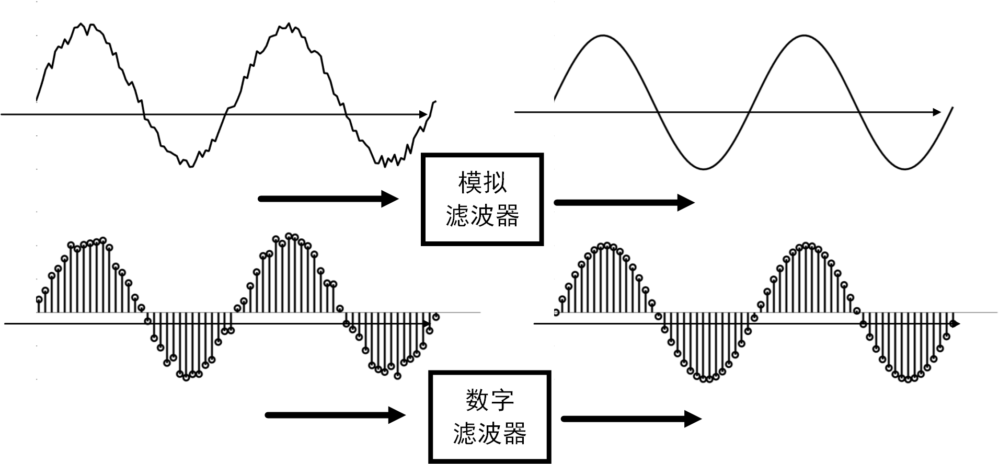
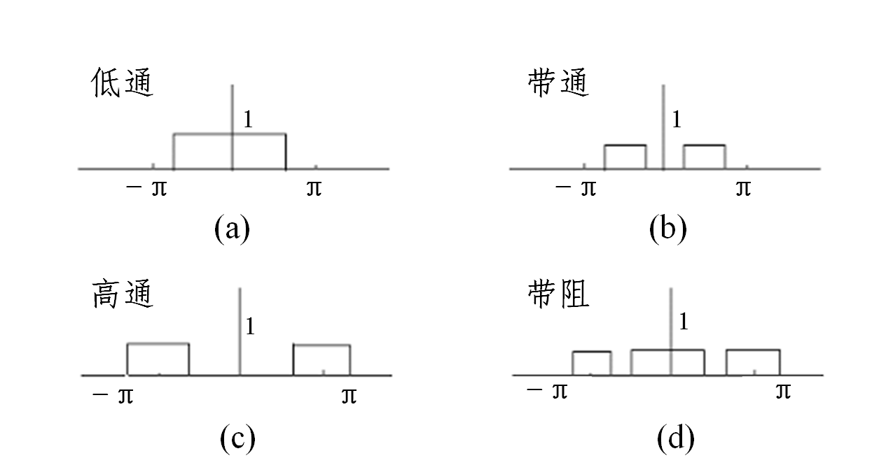
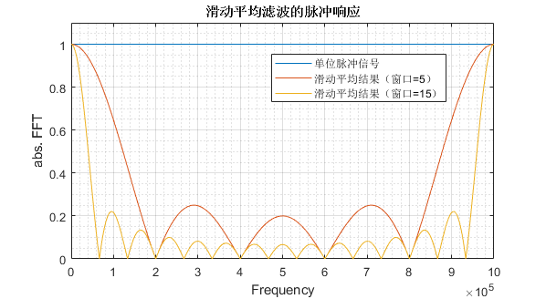

# 滤波器

## 定义

在数字信号处理领域，“滤波”是最古老、也是最经典的话题之一。数字滤波通常有两个目的—— **混叠信号分离** 和 **失真信号恢复** 。滤波器的 **信号分离** 功能使得接收端可以从冲突、干扰、或并发传输中分离并提取目标信号，例如在胎心检测场景中，心电采集设备同时采集到胎儿的心跳和母体的心跳，此时接收端可以根据两者心跳频率的差异，通过数字滤波，从收到信号中分离胎儿和母体的心跳信号；而滤波器的 **信号恢复** 功能则允许接收端一定程度地恢复受噪声影响而发生失真的低质量信号，例如用劣质设备录制的音频可能会发生较大失真、存在高频噪点，通过滤波去噪可以更好地还原实际的声音。**信号恢复** 的另一个常见应用例子是通过滤波消除图片中的噪点和重影。

<!-- “滤波”最早出现在模拟电路系统，电子工程师使用模拟滤波器(Analog Filter)消除信号的异常波动，使信号更加平滑。而在计算机领域，我们讨论更多的是“数字滤波”，即对离散的采样信号进行滤波，达到消除特定频率信号分量的目的。本部分内容中不会对模拟滤波器来具体进行介绍，感兴趣的同学们可以自行查看相关的资料，想一想电容电感的特性，以及怎么利用电容电感电阻来处理信号。 -->

数字滤波器基于模拟滤波器，两者的目标是类似的，都是在信号处理的过程中消除某些频率的信号分量（如低频信号中的高频噪声）。但模拟滤波器的作用对象是连续信号，而数字滤波器处理的是离散的采样点，因此两者在具体实现上有很大的不同。模拟滤波器通常由电容、电感等模拟电子器件组成，主要依仗器件的物理特性实现滤波效果。而数字滤波器则由软件或者数字芯片实现，使用特定的算法对离散采样信号进行处理。在本文中，我们主要讨论数字滤波器的原理及实现方式。大家在以后作业和论文中，主要需要理解和使用的也是数字滤波器。同时我要强调一下，滤波器的范围很广，绝不仅是使用在信号处理的过程中，从广义的程度上来看，大量的对数据的处理过程都可以认为是一种滤波，例如对数据做滑动平均、去除数据中的异常值可以被认为是一种广义的滤波。

<!-- <center>

</center>

<center>
<div style="color:orange; border-bottom: 1px solid #d9d9d9;
display: inline-block;
color: #999;
padding: 2px;">图. 模拟低通滤波器与数字低通滤波器示意</div>
</center> -->

<!-- 上图展示了模拟低通滤波器和数字低通滤波器效果示意，可以看到通过低通滤波处理后，原本因包含噪声而抖动的信号包络变得平滑。 -->
<!-- 如果我们将输入信号看作低频的原始信号与高频噪声的叠加，则通过低通滤波器后，输入信号中的高频噪声被完全过滤了，在输出中只剩下低频的原始信号。 -->
根据之前对傅里叶分析的学习，我们知道任何信号都可以看作多个不同频率信号的叠加（时刻要牢记这一点，这对你理解信号非常重要，不管看到什么信号，你就理解为一系列不同频率的周期信号的叠加）。在此基础上，我们可以更好地理解滤波器的作用：滤波器是指能够容许某些频率的信号分量通过，但减弱（或阻止）另一些频率分量的信号处理模块。理想数字滤波器可以无失真地传输某些频率上的信号分量，该滤波器在这些频率上的频率响应应该等于1；而在另一些频率上的频率响应应该等于0，以完全阻止这些频率上的信号分量。根据允许通过信号频率的不同，我们将滤波器分为低通、高通、带通和带阻四种类型。如下图所示，四类理想滤波器频域幅度特征分别为：

<center>

</center>

<center>
<div style="color:orange; border-bottom: 1px solid #d9d9d9;
display: inline-block;
color: #999;
padding: 2px;">图. 四类理想滤波器：(a)理想低通滤波器； (b)理想带通滤波器； (c)理想高通滤波器； (d)理想带阻滤波器</div>
</center>

- 低通滤波器：允许信号中的低频或直流分量通过，抑制高频分量或干扰和噪声。
- 高通滤波器：允许信号中的高频分量通过，抑制低频或直流分量。
- 带通滤波器：允许一定频段的信号通过，抑制低于或高于该频段的信号、干扰和噪声。
- 带阻滤波器：抑制一定频段内的信号，允许该频段以外的信号通过。

上述四类滤波器的定义中，其实隐含了 **通带** 和 **阻带** 的概念：频率响应等于1的频率范围称为滤波器的 **通带** ， 而频率响应等于0的频率范围称为滤波器的 **阻带** 。在接下来的内容中，我们将以一种特殊的低通滤波器——滑动平均滤波为例，向大家介绍滤波器的原理和作用。在学习以下内容的过程中，大家需要思考下面两个问题：

1. 为什么滑动平均能够滤掉高频信号分量、实现滤波效果？
2. 滑动平均滤波的性能怎么样，还有没有比滑动平均更好的滤波方法？

## 滑动平均滤波器

<!-- 接下来，我们以一个简单的低通滤波器为例，说明滤波器的工作原理。事实上，这个滤波器大家都用过，就是使用滑动窗口对输入的数据计算滑动平均。我们都直观上能够看出来这样的滑动平均滤波器能够滤掉毛刺，使数据更加平滑，看起来是起到了滤波的作用。事实上滑动平均就是一个最简单的低通滤波器。 -->

说起“滑动平均”，大家应该都很熟悉，这种利用滑动窗口计算数据集中不同子集平均数的数据分析方法，被广泛应用在财务分析和经济数据统计中。例如利用滑动平均分析股票价格、交易量、研究国内生产总值、就业或其他宏观经济时间序列等，滑动平均的主要特点是可以消除短期波动，突出长期趋势或周期。事实上，通过接下来的介绍，我们会发现滑动平均这种消除短期波动的特点，本质上等同于使用滤波器滤除高频噪声的过程，即滑动平均的效果实际上是对输入数据实施了低通滤波。我们接下来以一个实际的例子，说明滑动平均和低通滤波的关系。

<!-- - [ ] 我们结合着滑动滤波，要思考两个问题：1）为什么滑动平均是滤波，为什么能够滤掉高频。2）滑动平均滤波的性能怎么样，还有没有比滑动平均更好的滤波方法。（这个地方要重点阐释清楚），从滑动滤波出发，以FFT频域时域为基础，解释清楚滤波这个事情，同时介绍好典型的滤波器及其特点。满足大部分需要使用滤波器的人的需求。 -->

考虑一组长度有限的非零输入，滑动平均滤波器首先确定一个长度固定的滑动窗口。以下表中的数据为例，我们使用一个长度为5的滑动窗口，计算某桥梁在五分钟的跨度内，每分钟通过汽车数量的平均值。表格的第二列是每分钟实际通过汽车数，滑动平均操作从第5个数开始，计算这个数与其前4个数的平均值（如下表第三列的27），该平均值就是滑动平均算法的第一个输出。然后移动滑动窗口，计算下一个数与其前4个数的平均值（如下表第三列的第二个输出40.4）。以此类推，直至所有输入的数都参与过平均值计算。


|序号|过去1分钟通过汽车数量|过去5分钟平均通过汽车数量|
|-----|-----|-----|
|1|10|-|
|2|22|-|
|3|24|-|
|4|42|-|
|5|37|27|
|6|77|40.4|
|7|89|53.8|
|8|22|53.4|
|9|63|57.6|
|10|9|52|

MATLAB提供了`movmean()`函数用于计算滑动平均：
>`M = movmean(A,k)` 返回由局部 `k` 个数据点的均值组成的数组，其中每个均值是基于 `A` 的相邻元素的长度为 `k` 的移动窗口计算得出。当 `k` 为奇数时，窗口以当前位置的元素为中心。当 `k` 为偶数时，窗口以当前元素及其前一个元素为中心。当没有足够的元素填满窗口时，窗口将自动在端点处截断。当窗口被截断时，只根据窗口内的元素计算平均值。`M` 与 `A` 的大小相同。

`movmean()`的第`n`个输出对应的窗口默认以第`n`个输入为中心，我们也可以指定第`n`个窗口在输入序列中的具体位置。`M = movmean(A,[kb kf])` 通过长度为 `kb+kf+1` 的窗口计算均值，其中包括当前位置的元素、后面的 `kb` 个元素和前面的 `kf` 个元素。

```matlab
% computes a moving average by sliding a window of length len_win.
din = [10 22 24 42 37 77 89 22 63 9 0 0 0 0];
len_win = 5;
dout = movmean(din,len_win);
% the kth output uses the kth input as the center of the window
dout = dout(ceil(len_win/2):end);
disp(dout);
% Display the Result of Slide Average
figure; hold on
plot(len_win + (0:length(dout)-1),dout,'-o');
plot(1:length(din),din,'-o');
xlim([1 len_win+length(dout)-1]);
```

使用滑动窗口计算平均的结果如下图所示，在输入数据中原本存在许多突变的点，这些点在滑动平均操作后都变得更加平滑了。**直观上看，考虑在时间序列中，突变的点对应高频的信号，因此滑动平均操作可以消除输入序列中的高频分量。通过滑动平均操作，我们实现了过滤高频分量、保留低频分量的目标，即实现了一个简单的低通滤波器。**

<center>

</center>

<!--  -->
<center>
<div style="color:orange; border-bottom: 1px solid #d9d9d9;
display: inline-block;
color: #999;
padding: 2px;">图. 滑动窗口计算平均的结果</div>
</center>

在上面的这个例子中，直到输入前五个点后，滑动窗口才在**时刻5**输出了第一个滑动平均的结果，即

$$
y_{avg}(5) = \frac{1}{5}[x(1)+x(2)+x(3)+x(4)+x(5)]
$$

对于更一般的情况，**时刻n**的输出$y_{avg}(n)$，我们可以将其表示为：

$$
y_{avg}(n) = \frac{1}{5}[x(n-4)+x(n-3)+x(n-2)+x(n-1)+x(n)]=\frac{1}{5}\sum_{k=n-4}^{n}x(k)
$$

从上式可以看出，每个滑动窗口内的平均计算，可以理解为对窗口内所有输入值求和后再除以窗口长度（如下图所示）。

<center>

</center>

<!--  -->
<center>
<div style="color:orange; border-bottom: 1px solid #d9d9d9;
display: inline-block;
color: #999;
padding: 2px;">图. 求和后平均</div>
</center>

如果我们根据乘法分配律，将乘系数的操作移到求和之前，在滑动窗口内的平均计算就变成了对输入数据的加权求和。只不过在这个例子中，所有输入的权重都是相同的（即$\frac{1}{5}$）。

<center>

</center>

<!--  -->
<center>
<div style="color:orange; border-bottom: 1px solid #d9d9d9;
display: inline-block;
color: #999;
padding: 2px;">图. 加权求和</div>
</center>

## 优化低通滤波
我们可以思考，滑动平均滤波器的滤波效果是不是够好。从直观上看，看起来这个操作是能够将数据进行一定的平滑，且能够去除信号中的毛刺等，这些毛刺就类似高频的信号，因此看起来滑动平均是能够起到低通滤波的效果的。那么其中有几个核心的问题：

1. 如果我们将滑动平均的窗口增大会有什么样的效果，先看看直观上会有什么效果，然后想想理论的原因。
2. 有没有可能提高滑动平均的滤波性能，使其能更好的滤掉高频信号？如何来提高？

在实际的滤波器中，对输入数据加权求和时，每个输入的权重并不一定都要相同，即我们可以为窗口中不同的数据指派不同的权重。如果我们用$h(k)$表示窗口中第k个输入$x(n-k)$的权重，则**时刻n**的输出$y(n)$可以表示为：

$$
y(n)=h(4)x(n-4)+h(3)x(n-3)+h(2)x(n-2)+h(1)x(n-1)+h(0)x(n)=\sum_{k=0}^4h(k)x(n-k)
$$

更一般的，如果我们使用的滑动窗口的长度为$M$，则时刻n的输出为：

$$
y(n)=\sum_{k=0}^{M}h(k)x(n-k)
$$

**我们称上述加权的系数为滤波器系数（Filter Coefficients）。在后面的介绍中我们会了解到，正是滤波器系数$h(k)$和窗口长度$M$共同决定了滤波器的最终工作效果。** 接下来，我们先来看看我们通过滑动平均实现的低通滤波器实际工作效果究竟如何。

> 看到这里大家可能会有点眼熟，这个公司跟信号通过信道后的结果是很像的，事实上信道也就像是一个滤波器，信号通过信道也就类似于信号通过了一个滤波器。

[TODO] 这里没有解释清楚

为了简化后面的计算过程，我们直接观察连续信号滑动平均的结果。设输入信号为$x(t)$，滑动窗口的长度为$T_w$，则对其进行滑动平均后输出$y(t)$可以表示为：

$$
y(t)=\frac{1}{T_{w}} \int_{t-T_{w} / 2}^{t+T_{w} / 2} x(t) d t
$$
我们要看滤波后的信号的效果，就需要看频域的情况，这里我们可以看输入和输出信号的傅里叶变换的结果。
对于初始条件为零的系统，其频率响应函数$H(\omega)$等于输出$y(t)$和输入$x(t)$的傅里叶变换结果$Y(\omega)$,$X(\omega)$之比，即

$$
H(\omega)=\frac{Y(\omega)}{X(\omega)}
$$

设输入函数$x(t) = cos(\omega t) = cos(2\pi ft)$，则$x(t)$傅里叶变换的结果$X(\omega)=FFT(x(t))=1$，而$y(t)$傅里叶变换的结果：

$$
Y(\omega)=\frac{\sin \omega T_{w} / 2}{\omega T_{w} / 2}=\frac{\left|\sin \pi f T_{w}\right|}{\pi f T_{w}}
$$

因此频率响应函数为：

$$
|H(\omega)|=\left|\frac{Y(\omega)}{X(\omega)}\right|=\frac{|Y(\omega)|}{1}=\frac{\left|\sin \omega T_{w} / 2\right|}{\omega T_{w} / 2}
$$

显然$H(\omega)$是一个sinc函数。接下来，我们来看看滑动平均滤波器的截止频率$f_{co}$是多少。

规定滤波器的截止增益为-3db，即衰减倍率为0.707，根据$sinc(x)$特性曲线，求解$sinc(x)=0.707$，可得$x = 1.3917$。代入到$H(w)$中，可得$x=\frac{\omega T_{w}}{2}=\pi f_{c o} T_{w}=1.3917$，即

$$
T_w = \frac{0.443}{f_{co}}
$$

其中$T_w$为平均宽度，采样率已知的情况下，$T_w$的大小取决于窗口中采样点的数量$T_w = \frac{N}{f_s}$。由此，滑动平均滤波的点数与截止频率之间的关系可以表达为：

$$
f_{co} = 0.443\times \frac{f_s}{N}
$$

<!-- MATLAB仿真，观察滑动平均滤波的脉冲响应 -->
我们还可以使用MATLAB仿真，观察滑动平均滤波器的脉冲响应。理想情况下，脉冲信号包含所有频率的谐波分量，因此我们使用滑动平均滤波器对脉冲信号进行滤波，然后对滤波器的输出做傅里叶变换，在频域上观察滤波器的滤波效果：

```matlab
%% 滑动平均滤波的脉冲响应
% 构造单位脉冲信号
din = zeros(1,1e4);
din(5e3) = 1;
figure;plot(din);
% 脉冲信号包含所有频率的谐波分量
z = fft(din,100*length(din));
figure;
    plot(abs(z));
% 使用滑动平均滤波器对脉冲信号滤波
len_win = 5;
dout = movmean(din,len_win);
% 对滤波后结果做傅里叶变换，在频域上观察滤波效果
z = fft(dout,100*length(dout));
hold on
    plot(abs(z));
% 调整滑动窗口的大小
len_win = 15;
dout = movmean(din,len_win);
z = fft(dout,100*length(dout));
    plot(abs(z));
xlabel('Frequency');
ylabel('abs. FFT');
grid on;
grid minor
box on
```

<center>

</center>

<!--  -->
<center>
<div style="color:orange; border-bottom: 1px solid #d9d9d9;
display: inline-block;
color: #999;
padding: 2px;">图. 不同窗口长度下，滑动平均滤波器的脉冲响应</div>
</center>

通过滑动平均滤波，低频信号分量被保留下来，而高频分量得到了有效的抑制。由于滤波保留的低频信号包含正频率和负频率，而绘图时只绘制了$[0,f_s]$部分的频谱，因此波峰在图中被分成了两半。

<!-- **(FIR的脉冲响应就是它的滤波器系数)** -->
另外，更进一步我们也能够从图里面看出来，滑动平均的滤波效果其实是不够好的：1) 低频的分量失真是比较大的; 2) 高频的分量仍然会有很多的残留。这就给滤波器的设计提供了很大的空间。

> **思考**
1. 移动平均计算看似简单，但是却是一个十分耗时的计算，尤其平均点数较多后格外明显。请思考是否有办法提高移动平均计算的效率？
2. 如何在低通滤波器的基础上，实现高通滤波器、带通滤波器、带阻滤波器？

## 4. 参考文献

1. [Wikipedia/Filter](https://en.wikipedia.org/wiki/Filter)
2. [Wikipedia/Filter_(signal_processing)](https://en.wikipedia.org/wiki/Filter_(signal_processing))
3. [百度百科/相干带宽](https://baike.baidu.com/item/相干带宽)
4. [百度百科/滤波器](https://baike.baidu.com/item/滤波器)
5. Understanding Digital Signal Processing, Third Edition, Richard G. Lyons, Pearson Education
6. 滑动平均滤波的截止频率与平均点数计算, https://www.cnblogs.com/pingwen/p/6670675.html