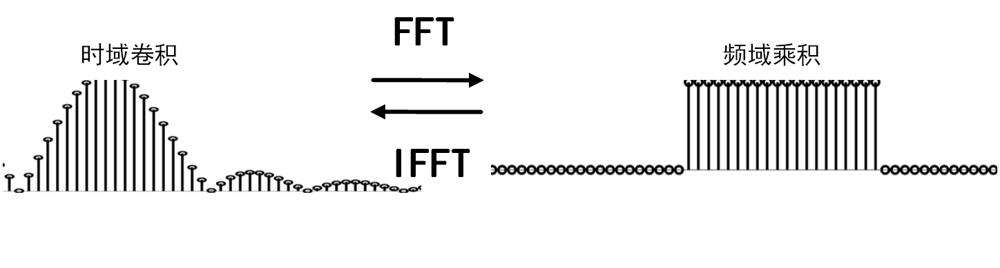
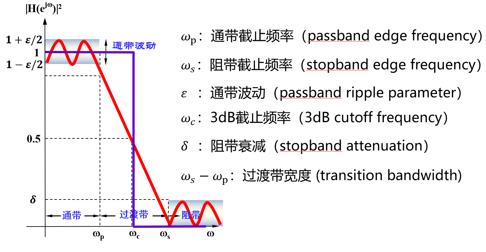
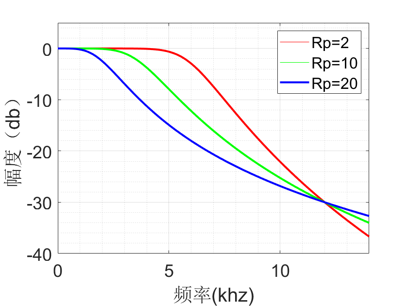
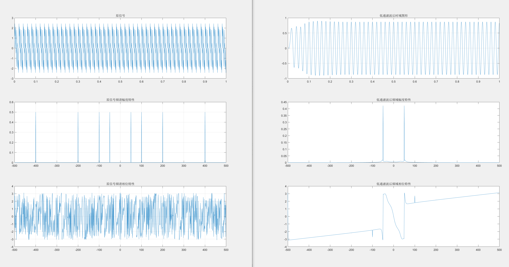

# 滤波器设计

## 滤波器设计

到现在，我们已经知道滤波器的主要设计参数和基本工作方式，即已经知道了滤波器的优化方法和优化目标。现在的问题是，给定滤波要求，对任意一组输入，我们要如何确定窗口长度$M$和滤波器系数$h(k)$？

**仔细观察滑动窗口内加权求和的计算操作，我们可以发现滤波过程实际上是输入向量$x(n)$与系数向量$h(k)$的卷积**， 即：

$$
y(n)=\sum_{k=0}^{M}h(k)x(n-k)=h(k)*x(n)
$$

> 思考为什么这一过程会有滤波的效果？
> 
那为什么这一过程会改变频率起到滤波的效果呢？
我们知道对于傅里叶变换和逆傅里叶变换这一类线性系统，在一个域上的卷积等于变换到另一个域上的点乘，时域上的卷积等价于在频域上的乘积。因此，卷积的结果在频域上我们可以得到

$$
Y(\omega) = H(\omega)\cdot X(\omega)
$$

因此，令时域信号与滤波器系数做卷积，其效果等价于：使用滤波器系数$h(n)$做DFT的结果$H(m)$，在频域上直接与目标信号做点乘滤波。
**简单来说时域卷积效果等价于频域的乘积**，也就是说滤波是在时域上进行卷积，那么看滤波的效果只需要看对应频域的乘积就可以了，时刻记住这一点，对于我们理解滤波器，设计滤波器都非常重要。

基于这个理解，滤波器的设计理想情况下看起来就很简单了。我们只需要将$H(\omega)$在我们希望的频率处值为$1$，而在我们希望过滤掉的频率处值为$0$。例如如果是要设计一个低通滤波器，只保留100 Hz以下的频率而过滤掉100 Hz以上的频率的话，我们可以将$H(\omega)$设置为 

$$
H(\omega)=\left\{
\begin{aligned}
1, &\quad 0 \leq \omega < 2\pi\cdot100 \\
0, &\quad otherwise\\
\end{aligned}
\right.
$$

在图上看起来，这个频域响应函数$H(\omega)$其实就是一个矩形窗。

<!-- [TODO] 加上图，表示频域相乘和时域卷积的关系，频域用矩形窗。 -->

<center>

</center>

<center>
<div style="color:orange; border-bottom: 1px solid #d9d9d9;
display: inline-block;
color: #999;
padding: 2px;">图. 频域相乘和时域卷积的关系示意</div>
</center>


从上面可以看出来，只要能够设计出来一个频域上响应为矩形窗口的滤波器，我们就能够完美的实现低通滤波。当然对于其他的滤波器，我们也改变频域矩形窗口的大小和位置，来实现其他完美的滤波。

> 思考：怎样设计出来频域上是这样理想矩形窗的滤波器？

但是实际上，大家回忆其傅里叶分析那一部分的内容就应该知道，频域为矩形窗的响应函数，对应到时域信号形式为sinc函数。我们要在时域上将输入信号与sinc函数做卷积。这样显然有两个很大的问题：
1. sinc函数为无限长，在实际操作中无法与无限长sinc函数做卷积。
2. sinc函数在时间上的取值范围为$-\infty$到$+\infty$，也就是意味着使用sinc函数卷积的过程中要使用到未来的信号，这在实际上也无法进行操作。

**很显然，通过这样的方法得到完美的滤波器是不可能的。** 

### 滑动平均的效果分析
而实际上，我们来看看之前我们说的滑动平均滤波器实际效果怎么样。
例如考虑使用一个长度为5的滑动窗口，滤波器系数全部设为$\frac{1}{5}$，即$h(k)=[\frac{1}{5} \frac{1}{5} \frac{1}{5} \frac{1}{5} \frac{1}{5}]$。
对这样一个系数向量做DTFT，根据如下的DTFT公式

$$
X[k]=\sum_{n=0}^{N-1} x[n] \, e^{-j n \omega}
$$

我们可以得到 

$$
H(\omega) = \sum_{n=0}^{4}\frac{1}{5}e^{-j n \omega}
$$


显然我们将在频域上得到一个以频率0为中心、由一个主瓣和若干旁瓣共同组成的类sinc波（如下图实线所示）。
因此使用滑动平均的滤波效果就是将这个
这与我们期望的理想滤波器（虚线所示）相差甚远。


<center>

</center>

<!--  -->
<center>
<div style="color:orange; border-bottom: 1px solid #d9d9d9;
display: inline-block;
color: #999;
padding: 2px;">图. 滑动平均在频域上的效果</div>
</center>

这样的低通滤波器，显然无法完全消除所有高于频率阈值的信号分量，同时也会导致低于阈值的有效信号发生变形。

<center>

</center>

<!--  -->
<center>
<div style="color:orange; border-bottom: 1px solid #d9d9d9;
display: inline-block;
color: #999;
padding: 2px;">图. 非完美滤波器效果</div>
</center>

上图可以看到，由于窗口长度和滤波器系数选择的不合理（全部都是$\frac{1}{5}$），简单低通滤波器的滤波效果并不理想。那么，我们要如何确定窗口长度$M$和滤波器系数$h(k)$，使得滤波器的效果尽可能好呢？


<center>

</center>

<!--  -->
<center>
<div style="color:orange; border-bottom: 1px solid #d9d9d9;
display: inline-block;
color: #999;
padding: 2px;">图. 理想低通滤波器要求无限长度的滤波器系数向量</div>
</center>

在继续介绍滤波器实现之前，我们先来明确一组等价的概念：**滤波器长度=滑动窗口长度=滤波抽头长度=滤波器系数向量长度**，这几个看似不同的说法经常出现在各种与滤波器相关的资料中，但他们所表达的含义是一样的。给定一组真实信号输入，显然滤波器的长度是有限的。且考虑长度为$n$的滤波器会抽除输入信号头部$n$个数据点，因此滤波器长度应该要远小于输入信号的长度。

实际滤波时，虽然得到理想的滤波器系数比较困难，一个简单可行的办法是对理想滤波器逆傅里叶变换对应的系数截取一段有限长度的结果，用作滤波器系数。如下图所示，随着滤波器系数长度的增加，其傅里叶变换的结果约接近理想滤波器。同时，我们也发现DFT结果中，接近频率阈值处存在振幅抖动，这就是我们常说的吉布斯效应。为了消除吉布斯效应，并使通频带外信号得到更好的抑制，学者们提出了许多不同的加窗策略，这又是另一个非常有趣的主题，有兴趣的同学可以在课后自行了解。

<center>

</center>

<!--  -->
<center>
<div style="color:orange; border-bottom: 1px solid #d9d9d9;
display: inline-block;
color: #999;
padding: 2px;">图. 不同窗口长度</div>
</center>

## 滤波器设计参数

在上一节，我们介绍了通过调整滑动平均的窗口大小$M$和加权值（即滤波器系数$h(k)$）可以直接影响滤波效果。滤波器设计的核心，就是探索如何通过改变这些参数实现不同的目标。下面介绍几个常用的滤波器设计参数，大家在看相关论文和使用相关代码的时候经常会碰到这些参数：

- 中心频率（Center Frequency）：滤波器通带的频率$f_0$，一般取$f_0=(f_1+f_2)/2$，$f_1$、$f_2$为带通或带阻滤波器左、右相对下降$1dB$或$3dB$边频点。窄带滤波器常以插损最小点为中心频率计算通带带宽。
- 截止频率（Cutoff Frequency）：指低通滤波器的通带右边频点及高通滤波器的通带左边频点。通常以$1dB$或$3dB$相对损耗点来标准定义。相对损耗的参考基准为：低通以DC处插损为基准，高通则以未出现寄生阻带的足够高通带频率处插损为基准。
- 通带带宽：指需要通过的频谱宽度，$BW =(f_2-f_1)$。$f_1$、$f_2$为以中心频率$f_0$处插入损耗为基准。
- 插入损耗（Insertion Loss）：由于滤波器的引入对电路中原有信号带来的衰耗，以中心或截止频率处损耗表征，如要求全带内插损需强调。
- 纹波（Ripple）：指1dB或3dB带宽（截止频率）范围内，插损随频率在损耗均值曲线基础上波动的峰值。
- 带内波动（Passband Ripple）：通带内插入损耗随频率的变化量。1dB带宽内的带内波动是1dB。
- 带内驻波比（VSWR）：衡量滤波器通带内信号是否良好匹配传输的一项重要指标。理想匹配VSWR=1：1，失配时VSWR 大于1。对于一个实际的滤波器而言，满足VSWR小于1.5：1的带宽一般小于通带带宽，其占通带带宽的比例与滤波器阶数和插损相关。
- 回波损耗（Return Loss）：端口信号输入功率与反射功率之比的分贝（dB）数，也等于$20Log10\rho$，$\rho$为电压反射系数。输入功率被端口全部吸收时回波损耗为无穷大。
- 阻带抑制度：衡量滤波器选择性能好坏的重要指标。该指标越高说明对带外干扰信号抑制的越好。通常有两种提法：一种为要求对某一给定带外频率$fs$抑制多少dB，计算方法为$fs$处衰减量；另一种为提出表征滤波器幅频响应与理想矩形接近程度的指标——矩形系数。滤波器阶数越多矩形度越高——即K越接近理想值1，制作难度当然也就越大。
- 延迟（Td）：指信号通过滤波器所需要的时间，数值上为传输相位函数对角频率的导数，即$Td=df/dv$。
- 带内相位线性度：该指标表征滤波器对通带内传输信号引入的相位失真大小。按线性相位响应函数设计的滤波器具有良好的相位线性度。

一句话来进行总结，由于理想的滤波器没法实现，所以为了描述实际的滤波器的性能和效果，我们给一个滤波器滤波的效果定义了这一系列参数。
<center>

</center>

<center>
<div style="color:orange; border-bottom: 1px solid #d9d9d9;
display: inline-block;
color: #999;
padding: 2px;">图. 滤波器设计参数</div>
</center>


## 常见滤波器及其特性

通过前文的介绍，我们可以感受到滤波器的设计实际上是一件复杂且具有挑战性的事。针对不同的应用场景和滤波需求，我们需要设计具有不同性质的滤波器。实际上，我们在实际使用中通常直接采用前人设计好的几个经典的滤波器：如巴特沃斯滤波器、切比雪夫滤波器、椭圆滤波器、贝塞尔滤波器等。这些滤波器分别有各自的特点，例如巴特沃斯滤波器在通带内响应曲线极其平坦，而椭圆滤波器则旨在尽可能压缩过渡带的宽度。下图展示了集中常用滤波器的频域响应特性。

<center>

</center>

<center>
<div style="color:orange; border-bottom: 1px solid #d9d9d9;
display: inline-block;
color: #999;
padding: 2px;">图. 几种不同特点的常用滤波器：巴特沃斯滤波器（左上）、I型切比雪夫滤波器（右上）、II型切比雪夫滤波器（左下）、椭圆函数滤波器（右下）</div>
</center>

**巴特沃斯滤波器**

特点：通频带内的频率响应曲线最大限度平坦，没有起伏，而在阻频带则逐渐下降为零。

一阶巴特沃斯滤波器的衰减率为每倍频6分贝，每十倍频20分贝；二阶巴特沃斯滤波器的衰减率为每倍频12分贝；三阶巴特沃斯滤波器的衰减率为每倍频18分贝，如此类推。巴特沃斯滤波器的振幅对角频率单调下降，并且也是唯一的无论阶数，振幅对角频率曲线都保持同样的形状的滤波器。对巴特沃斯滤波器而言，阶数越高，频率响应在阻频带振幅衰减速度越快，而振幅对角频率曲线的形状保持不变。

在MATLAB的DSP工具包中内置了巴特沃斯滤波器的实现函数，可以直接通过butter函数是求Butterworth数字滤波器的系数。butter函数的调用形式有以下几种：

```matlab
[B,A] = butter(n,wn)
```
n是滤波器的阶数，根据需要选择合适的整数，Wn是自然频率，Wn = 截止频率*2/采样频率，如果要留下小于截至频率的信号，用这种格式。而在有些情况下，我们希望保留在某两个频率之间的信号（即带通滤波），此时可以使用以下这种调用格式：
```matlab
[B,A]=butter(n,[Wn1 Wn2]) %Wn1和Wn2用空格隔开
```

使用上述butter函数求出B和A的值后，用滤波函数filter进行滤波：`y=filter(B,A,x)`，其中x是要进行滤波的信号。

的MATLAB调用示例：

```matlab
wp=2*pi*5000;ws=2*pi*12000;Rp=2;Rs=30;
[N,wc]=buttord(wp,ws,Rp,Rs,'s');% s is the anology filter 
[B,A]=butter(N,wc,'s');
sk=0:511; fk=0:14000/512:14000;wk=2*pi*fk;
Hk=freqs(B,A,wk);
plot(fk/1000,20*log10(abs(Hk)),'r') ;hold on
xlabel('频率(khz)');ylabel('幅度（db）');
axis([0,14,-40,5]);
 
[N,wc]=buttord(wp,ws,10,Rs,'s');% s is the anology filter 
[B,A]=butter(N,wc,'s');
Hk=freqs(B,A,wk);
plot(fk/1000,20*log10(abs(Hk)),'g');
 
[N,wc]=buttord(wp,ws,20,Rs,'s');% s is the anology filter 
[B,A]=butter(N,wc,'s');
Hk=freqs(B,A,wk);
plot(fk/1000,20*log10(abs(Hk)),'b');
 
legend('Rp=2','Rp=10','Rp=20','Location','northeast','Orientation','horizontal')
```

<center>

</center>

<center>
<div style="color:orange; border-bottom: 1px solid #d9d9d9;
display: inline-block;
color: #999;
padding: 2px;">图. 巴特沃斯滤波器频率响应图线</div>
</center>

**切比雪夫滤波器**
  
特点：和理想滤波器的频率响应曲线之间的误差最小，但是在通频带内存在幅度波动。和巴特沃斯滤波器相比，切比雪夫滤波器在过渡带衰减快，但频率响应的幅频特性不如前者平坦。

切比雪夫滤波器是在通带或阻带上频率响应幅度等波纹波动的滤波器，振幅特性在通带内是等波纹。在阻带内是单调的称为切比雪夫I型滤波器；振幅特性在通带内是单调的，在阻带内是等波纹的称为切比雪夫II型滤波器。采用何种形式的切比雪夫滤波器取决于实际用途。

MATLAB工具包中提供了cheby1和cheby2函数分别用于构造切比雪夫I型滤波器和切比雪夫II型滤波器。其调用形式为：

```matlab
[b,a] = cheby1(n,Rp,Wp)
[b,a] = cheby1(n,Rp,Wp,ftype)
```

其中n为阶数，Rp为通带中损失上限，Wp为截止频率（一般通过cheb1ord获得）。函数返回得到滤波器系数矩阵[b,a]。

使用切比雪夫I型滤波器实现信号低通滤波实例：

```matlab
%%%%%%%%%%%%%%%%%%%%%%%%%%%%%%%%%%%%%%%%%%%%%%%
%  Cheby1Filter.m
%  切比雪夫Ⅰ型滤波器的设计
%%%%%%%%%%%%%%%%%%%%%%%%%%%%%%%%%%%%%%%%%%%%%%%
clear;
close all;
clc;

fs = 1000; %Hz 采样频率
Ts = 1/fs;
N  = 1000; %序列长度
t = (0:N-1)*Ts;
delta_f = 1*fs/N;
f1 = 50;
f2 = 100;
f3 = 200;
f4 = 400;
x1 = 2*0.5*sin(2*pi*f1*t);
x2 = 2*0.5*sin(2*pi*f2*t);
x3 = 2*0.5*sin(2*pi*f3*t);
x4 = 2*0.5*sin(2*pi*f4*t);
x = x1 + x2 + x3 + x4; %待处理信号由四个分量组成
 
X = fftshift(abs(fft(x)))/N;
X_angle = fftshift(angle(fft(x)));
f = (-N/2:N/2-1)*delta_f;
 
figure(1);
subplot(3,1,1);
plot(t,x);
title('原信号');
subplot(3,1,2);
plot(f,X);
grid on;
title('原信号频谱幅度特性');
subplot(3,1,3);
plot(f,X_angle);
title('原信号频谱相位特性');
grid on;

%设计一个切比雪夫低通滤波器,要求把50Hz的频率分量保留,其他分量滤掉
wp = 55/(fs/2);  %通带截止频率,取50~100中间的值,并对其归一化
ws = 90/(fs/2);  %阻带截止频率,取50~100中间的值,并对其归一化
alpha_p = 3; %通带允许最大衰减为 db
alpha_s = 40;%阻带允许最小衰减为 db
%获取阶数和截止频率
[ N1 wc1 ] = cheb1ord( wp , ws , alpha_p , alpha_s);
%获得转移函数系数
[ b a ] = cheby1(N1,alpha_p,wc1,'low');
%滤波
filter_lp_s = filter(b,a,x);
X_lp_s = fftshift(abs(fft(filter_lp_s)))/N;
X_lp_s_angle = fftshift(angle(fft(filter_lp_s)));
figure(2);
freqz(b,a); %滤波器频谱特性
figure(3);
subplot(3,1,1);
plot(t,filter_lp_s);
grid on;
title('低通滤波后时域图形');
subplot(3,1,2);
plot(f,X_lp_s);
title('低通滤波后频域幅度特性');
subplot(3,1,3);
plot(f,X_lp_s_angle);
title('低通滤波后频域相位特性');
```

<center>

</center>

<center>
<div style="color:orange; border-bottom: 1px solid #d9d9d9;
display: inline-block;
color: #999;
padding: 2px;">图. 切比雪夫滤波器低通滤波效果示意</div>
</center>
  
**椭圆滤波器**

特点：在通带等纹波（阻带平坦或等纹波），阻带下降最快。

**贝塞尔滤波器**

特点：通带等纹波，阻带下降慢，即幅频特性的选频特性最差。但是，贝塞尔滤波器具有最佳的线性相位特性。

贝赛尔(Bessel)滤波器是具有最大平坦的群延迟（线性相位响应）的线性过滤器。贝赛尔滤波器常用在音频天桥系统中。模拟贝赛尔滤波器描绘为几乎横跨整个通频带的恒定的群延迟，因而在通频带上保持了被过滤的信号波形。贝塞尔(Bessel)滤波器具有最平坦的幅度和相位响应。带通（通常为用户关注区域）的相位响应近乎呈线性。Bessel滤波器可用于减少所有IIR滤波器固有的非线性相位失真。

<!-- （设计介绍、特性、MATLAB调用方法） -->


<!-- 
## 案例
最后，请大家利用MATLAB自带的`filter()`函数，尝试对输入含高频噪声的信号进行低通滤波：

```matlab
fs = 100; % sampling frequency
t = 0:1/fs:1;
x = sin(2*pi*4*t);
y = awgn(x, 10, 'measured'); % snr = 10dB

windowSize = 5;
b = (1/windowSize)*ones(1,windowSize);
a = 1;
z = filter(b,a,y);

plot(t, [y; z]);
legend('Input Data','Filtered Data')
```

<center>

</center>

<center>
<div style="color:orange; border-bottom: 1px solid #d9d9d9;
display: inline-block;
color: #999;
padding: 2px;">图. MATLAB低通滤波效果</div>
</center> -->