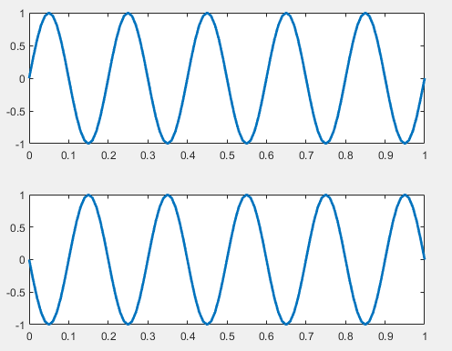
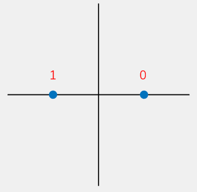
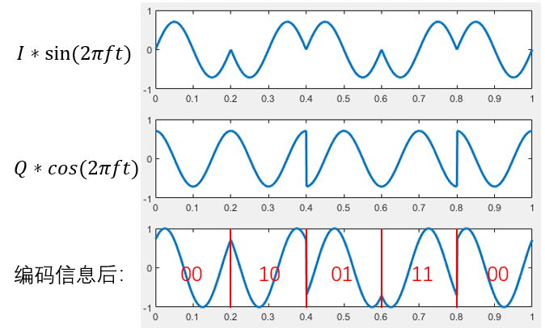
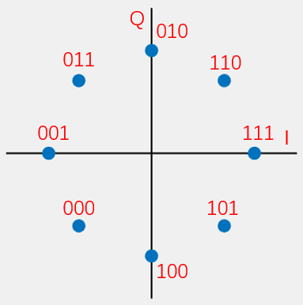

# 相位调制

​		相位调制，简称调相，也就是相位偏移键控(Phase-shift keying , PSK)，使用信号中不同的相位来调制数据。根据使用的相位数量上的区别，相位调制又可分为二相位偏移键控(Binary PSK, BPSK), 四相位偏移键控(Quadrature PSK, QPSK)和八相位偏移键控(8PSK)等。

​		这些调制的方法我相信大家都或多或少的有听说过，但是真是要实现起来，大家可能还是得想一想，这个具体是怎么实现的，就未必很熟悉了。如果将声音作为信号，实现一个基于声音的传输系统，这样可能就更复杂了。本章主要要讲的就是这个事情，希望能够通过这一部分的介绍，大家能够完整的了解一个类似真实系统的过程。

​		在进行信号处理时，或者我们看到很多论文时，经常会听到I和Q路这个概念，这个概念对于初次接触的人可能会比较难懂。很多人即便是经常使用，例如在定位中经常I和Q来计算相位从而计算距离等，但使用过程中可能也未必真正了解其中的含义。

​		我们以PSK为例介绍I和Q的情况。为了生成不同信号的相位，当然我们最直接的方法可以改变单路信号的相位，例如$sin(2\pi f t + \phi)$，其中$\phi$就是信号的相位。我们可以生成一个具备不同相位的正弦波，利用这个正弦波来进行数据传输。

​		为了更加一般化的理解这个过程，目前普遍使用的实现PSK的方法是I/Q正交调制。其原理是使用两路正交的信号分别编码两路数据，每路数据单独调制，并将两路信号直接相加，从而使相加的信号具备不同的相位。正交的两路信号通常选用$sin(2\pi ft)$和$cos(2\pi ft)$，通过改变正弦和余弦函数的幅度来得到相加后不同相位的信号。例如，$\frac{\sqrt{2}}{2}sin(2\pi ft)+\frac{\sqrt{2}}{2}cos(2\pi ft)=sin(2\pi f t + \frac{\pi}{4})$可以代表一个初相位为$\frac{\pi}{4}$的信号，$\frac{\sqrt{2}}{2}sin(2\pi ft)-\frac{\sqrt{2}}{2}cos(2\pi ft)=sin(2\pi f t - \frac{\pi}{4})$可以代表一个初相位为$-\frac{\pi}{4}$的信号。$\frac{\sqrt{2}}{2}$这个系数是为了相加后的信号幅度为$1$。

​		如果我们把$sin(2\pi ft)$的幅度作为横坐标，$cos(2\pi ft)$的幅度作为纵坐标，就可以在一个平面直角坐标系中画出一个点，把一个PSK调制方法中所有的幅度组合都画在图中，则会得到一系列点，这个图叫做该调制方法的**星座映射图**，或简称**星座图**。由于在PSK中，我们通常要求I/Q两路信号相加后的信号幅度为$1$，所以PSK的星座图上所有的点都位于单位圆上。

​		从另外的一种角度来看，我们来理解一下I/Q两路调制。

​		不考虑是相位调制，我们考虑在调制的过程中我们就使用$sin(2\pi f t)$和$cos(2\pi f t)$同时调制信号，为什么可以用这两路呢，因为这两路信号是正交的。我们可以将这两路认为是I路和Q路信号。发送端我们可以在这两路信号上设置成不同的幅度，那么接收端可以分别计算出不同的幅度，从而将数据解码出来。

​		这时的I和Q就对应到由I轴和Q轴组成的星座图上的一个点（这就是星座图的来源），以此来看，我们如果可以使用星座图上的任意I和Q组合（即星座图上的任意点）来编码数据。编码过程中使用的星座图上点的数量跟编码的bit数有直接关系。

- 使用星座图上的2个点，每次编码1个bit，例如BPSK。
- 使用星座图上的4个点，每次编码2个bit，例如QPSK。
- 使用星座图上的8个点，每次编码3个bit，例如8PSK。

​		理论上也可以任意使用星座图上的n个点，每次能编码$\log_2 n$个bit。从理论上来说，这n个点都可以从接收到的信号中解码出来。当然在实际编码中不会任意选取，都会有规律的选取。

​		确定好点的位置后，我们就很容易得到编码的数据。例如

- 在BPSK中，两个点的位置(I Q)分别为(1, 0), (-1, 0)，我们可以用(1, 0)编码bit 1，用(-1, 0)编码bit 0。即编码数据用的是$I*sin(2\pi f t)+ Q*cos(2\pi f t) = 1*sin(2\pi f t)+ 0*cos(2\pi f t)=sin(2\pi f t)$和 $I*sin(2\pi f t)+ Q*cos(2\pi f t) = -1*sin(2\pi f t)+ 0*cos(2\pi f t)=-sin(2\pi f t)$。因此接收端收到的数据只能是$sin(2\pi f t)$和$-sin(2\pi f t)$,基于收到的数据我们解出I和Q，从而对应到1和0。
- 在QPSK中，四个点的位置(I Q)分别为$(\frac{\sqrt{2}}{2}, \frac{\sqrt{2}}{2}), (-\frac{\sqrt{2}}{2}, \frac{\sqrt{2}}{2}), (\frac{\sqrt{2}}{2}, -\frac{\sqrt{2}}{2}), (-\frac{\sqrt{2}}{2}, -\frac{\sqrt{2}}{2})$, 因此我们可以编码2个bit，我们可以用$(\frac{\sqrt{2}}{2}, \frac{\sqrt{2}}{2})$编码bit 00，用$(-\frac{\sqrt{2}}{2}, \frac{\sqrt{2}}{2})$编码bit 10，依此类推。基于收到的数据我们解出I和Q，从而对应的bit。

> 思考：接收端如何从收到的数据出计算出每个点在星座图上的位置，即如何计算I和Q？

## I/Q与相位的关系？

​		上面的整个过程，其实我们都没看到跟相位有关系，那为什么我们把上面的方法都叫做xPSK，为什么称之为相位调制？同时在实际信号处理和很多论文中，都通过I和Q计算信号的相位。例如在很多硬件设备上，都会直接给你解码后的I和Q的值，很多基于相位进行定位、追踪和感知的工作都使用这个I和Q来直接计算相位。

​		我们来看看上述过程I/Q到底和相位有什么关系。

​		调制后的数据为$I*sin(2\pi f t) + Q* cos(2\pi f t)$(不同的资料中表示会稍有不同)，即$\sqrt{I^2 + Q^2}sin(2\pi f t + \arctan \frac{Q}{I})$。大家可以试着自己推导一下。

​		也就是说，星座图上不同的点，实际上就对应到结果里面不同的相位（$\arctan \frac{Q}{I}$），这也是为什么这个方法被称为xPSK。

- BPSK，对应不同相位信号为$sin(2\pi f t)$和$-sin(2\pi f t)$，实际上等价于$sin(2\pi f t)$和$sin(2\pi f t + \pi)$，将数据调制到了0和$\pi$两种不同的相位上。
- QPSK，对应不同相位信号为$sin(2\pi f t + \frac{\pi}{4})$, $sin(2\pi f t + \frac{3\pi}{4})$, $sin(2\pi f t + \frac{5\pi}{4})$, $sin(2\pi f t + \frac{7\pi}{4})$, 将数据调制到了$\frac{\pi}{4}$, $\frac{3\pi}{4}$, $\frac{5\pi}{4}$, $\frac{7\pi}{4}$四种不同相位上。

> 思考：BPSK、QPSK等星座图上的不同点，如何进行解码。

​		如果理解了上述过程，也就比较好理解为什么大家经常看到的传统通信里面都用这样的方法来表示调制的过程。


## BPSK
​		看完了基本原理，实际上主要的实现都可以完成了。

​		我们首先来看最简单的BPSK如何来实现。跟之前介绍的一样，我们使用相位差为$\pi$的两种信号$sin(2\pi f t)$和$sin(2\pi f t + \pi)$：对应不同相位信号为$sin(2\pi f t)$和$-sin(2\pi f t)$，实际上等价于$sin(2\pi f t)$和$sin(2\pi f t + \pi)$，将数据调制到了0和$\pi$两种不同的相位上。

<center>

</center>
<center>
<div style="color:orange; border-bottom: 1px solid #d9d9d9; display: inline-block;color: #999;padding: 2px;">图. 相位为0和相位为pi的信号</div>
</center>

​		有了这两个码元，我们就可以根据输入的待调制的信息来选择不同相位的信号。当输入为0时，我们选择相位为0的信号，当输入为1时，我们选择相位为$\pi$的信号。输入信号和对应的生成的BPSK调制过的信号如下图所示。

<center>

</center>
<center>
<div style="color:orange; border-bottom: 1px solid #d9d9d9; display: inline-block;color: #999;padding: 2px;">图. 调制后的BPSK信号</div>
</center>

​		这样，我们可以将bit 0和1编码到这两种不同的信号上

数据|相位
-----|-----
0 |0
1 | $\pi$

​		从I/Q调制的角度去理解，此时“0”对应的信号为$1*sin(2\pi ft)+0*cos(2\pi ft)$，"1"对应的信号为$-1*sin(2\pi ft)+0*cos(2\pi ft)$，其星座映射图为：

<center>

</center>
<center>
<div style="color:orange; border-bottom: 1px solid #d9d9d9; display: inline-block;color: #999;padding: 2px;">图. BPSK星座图</div>
</center>

## QPSK

​		QPSK使用4种相位的信号来调制信息。对应不同相位信号为$sin(2\pi f t + \frac{\pi}{4})$, $sin(2\pi f t + \frac{3\pi}{4})$, $sin(2\pi f t + \frac{5\pi}{4})$, $sin(2\pi f t + \frac{7\pi}{4})$, 将数据调制到了$\frac{\pi}{4}$, $\frac{3\pi}{4}$, $\frac{5\pi}{4}$, $\frac{7\pi}{4}$四种不同相位上。

​		对应IQ星座图上的四个点为$(\frac{\sqrt{2}}{2}, \frac{\sqrt{2}}{2}), (-\frac{\sqrt{2}}{2}, \frac{\sqrt{2}}{2}), (\frac{\sqrt{2}}{2}, -\frac{\sqrt{2}}{2}), (-\frac{\sqrt{2}}{2}, -\frac{\sqrt{2}}{2})$.

​		用$i$和$q$分别代表两路待调制的数据，使用I/Q调制后的信号为：

$$
s(t) = i*sin(2\pi ft) + q*cos(2\pi ft)
$$

此时数据和相位之间的映射关系是：

数据| i |q|s(t)|相位
------|------|-------|-------|-------
00 |1|1|$sin(2\pi ft) + cos(2\pi ft) = \sqrt{2}sin(2\pi ft+\frac{\pi}{4})$|$\frac{\pi}{4}$
01 |1|-1|$sin(2\pi ft) - cos(2\pi ft) = \sqrt{2}sin(2\pi ft+\frac{7 \pi}{4})$| $\frac{7 \pi}{4}$
10 |-1|1|$-sin(2\pi ft) + cos(2\pi ft) = \sqrt{2}sin(2\pi ft+\frac{3 \pi}{4})$|$\frac{3 \pi}{4}$
11 |-1|-1|$-sin(2\pi ft) - cos(2\pi ft) = \sqrt{2}sin(2\pi ft+\frac{5 \pi}{4})$| $\frac{5 \pi}{4}$

其星座映射图为：

<center>

</center>
<center>
<div style="color:orange; border-bottom: 1px solid #d9d9d9; display: inline-block;color: #999;padding: 2px;">图. QPSK星座图</div>
</center>

为了使输出信号$s(t)$的幅度为$1$，我们需要对I和Q信号除以$\sqrt{2}$，因此，数据和I,Q对应关系应该是如下表所示：

数据| I|Q
-------|-------|-------
00 |$\frac{ \sqrt{2} }{2}$|$\frac{ \sqrt{2} }{2}$
01 |$\frac{ \sqrt{2} }{2}$|-$\frac{ \sqrt{2} }{2}$
10 |-$\frac{ \sqrt{2} }{2}$|$\frac{ \sqrt{2} }{2}$
11 |-$\frac{ \sqrt{2} }{2}$|-$\frac{ \sqrt{2} }{2}$

​		下图展示了I、Q基带信号、分别调制了信息的两路信号以及叠加后的信号。图中对应的I路和Q路数据分别是：$I= \{\frac{ \sqrt{2} }{2},-\frac{ \sqrt{2} }{2},\frac{ \sqrt{2} }{2},-\frac{ \sqrt{2} }{2},\frac{ \sqrt{2} }{2}\}$,$Q = \{ \frac{ \sqrt{2} }{2},\frac{ \sqrt{2} }{2},-\frac{ \sqrt{2} }{2},-\frac{ \sqrt{2} }{2},\frac{ \sqrt{2} }{2}\}$

<center>

</center>
<center>
<div style="color:orange; border-bottom: 1px solid #d9d9d9; display: inline-block;color: #999;padding: 2px;">图. IQ信号和调制后的QPSK信号</div>
</center>

​		在解码时，利用其正交特性，分别对两路信号在一个周期内进行积分运算，得到每路信号中编码的数据。以解码I路信号为例：

$$
\begin{split}
\int_{0}^{\frac{1}{f}}(s(t)* sin(2\pi ft)) &=  \int_{0}^{\frac{1}{f}}((i* sin(2\pi ft) + q* cos(2\pi ft))*sin(2\pi ft)) \\
&=
\int_{0}^{\frac{1}{f}}(i*sin(2\pi ft)^2 +q*cos(2\pi ft)*sin(2\pi ft) \\
&=
\int_{0}^{\frac{1}{f}}(i*\frac{1-cos(4 \pi ft)}{2} +q*sin(4\pi ft)) \\
&=
\int_{0}^{\frac{1}{f}}i*\frac{1}{2} - \int_{0}^{\frac{1}{f}}i*\frac{cos(4 \pi ft)}{2}) +\int_{0}^{\frac{1}{f}}q*sin(4\pi ft)) \\
&=
\frac{i}{2} -0 + 0 \\
&=
\frac{i}{2}\\
\end{split}
$$

​		对Q路信号的解码与之同理，只需要把积分中相乘的正弦信号换成余弦信号即可。

​		在实际传输过程中，由于噪声的影响，我们通过上述公式得到的坐标$(i,q)$可能并不是精确地落在星座图上的4个点之一，而是在一个点附近。因此在代码实现时，我们需要找到离$(i,q)$最近的星座图上的点。由此可知，该调制方式具有一定的抵抗噪声的能力。

## 使用声波信号实现QPSK

调制：

```matlab
function Modulator(codes, fileName, sigSNR)
%输入参数：
%codes: 待调制的数据，0/1数组
%fileName：保存到本地的信号文件
%sigSNR：模拟信道的信噪比
%调用样例：
%Modulator([1,1,0,0,1,0,1,0], 'data')
%调用结果：
%同文件夹下生成一个‘data.wav’音频文件
fs = 48000;
T = 0.025;
f = 1 / T;

%若信号长度不是偶数，则补0（QPSK调制的是长度为偶数的二进制串）
cLen = length(codes);
if mod(cLen, 2) == 1
    codes = [codes, 0];
    cLen = cLen + 1;
end

%生成I信号和Q信号
sigI = sin(2 * pi * f * (0 : 1/fs : T - 1/fs));
sigQ = cos(2 * pi * f * (0 : 1/fs : T - 1/fs));

%生成两路基带信号，并相加
sigL = length(sigI);
sig = zeros(1, sigL * cLen / 2);
for i = 1 : cLen / 2
    fI = (1 - 2 * codes(i * 2 - 1)) * sqrt(2) / 2;
    fQ = (1 - 2 * codes(i * 2)) * sqrt(2) / 2;
    sig((i - 1) * sigL + 1 : i * sigL) = fI * sigI + fQ * sigQ;
end

%模拟信道，添加白噪声
sig = awgn(sig, sigSNR, 'measured');
%将信号幅度恢复为1
sig = sig / max(abs(sig));

audiowrite([fileName, '.wav'], sig, fs);

end
```

解调：

```matlab
function codes = Demodulator(fileName)
%输入参数：
%fileName：调制数据得到的信号文件
%输出：
%codes: 解调结果，0/1数组
%调用样例：(同文件夹内需要有'data.wav'文件)
%Demodulator(‘data’)
%调用结果：
%输出[1,1,0,0,1,0,1,0]
[sig, fs] = audioread([fileName, '.wav']);
sig = sig';
T = 0.025;
f = 1 / T;

%生成I信号和Q信号
sigI = sin(2 * pi * f * (0 : 1/fs : T - 1/fs));
sigQ = cos(2 * pi * f * (0 : 1/fs : T - 1/fs));

%生成星座图上的4个点对应的标准基带信号，保存在一个4行的矩阵中
sigL = length(sigI);
sigMat = sqrt(2) / 2 * (...
    [1; 1; -1; -1] .* repmat(sigI, 4, 1) + ...
    [1; -1; 1; -1] .* repmat(sigQ, 4, 1));

cLen = 2 * length(sig) / sigL;
codes = zeros(1, cLen);

for i = 1 : cLen / 2
    seg = sig((i - 1) * sigL + 1 : i * sigL);
    %通过积分的方式（积分针对的是连续信号，离散信号则是对点积求和），判断当前的这一段信号和哪个标准信号距离最近。积分的结果越大代表两个信号越相似。
    [~, maxI] = max(sigMat * seg');
    codes(2 * i - 1) = maxI > 2;
    codes(2 * i) = mod(maxI, 2) == 0;
end

end
```

​		在解调的代码实现中，为了使代码更加紧凑以及运行效率更高，在生成标准基带信号时采用了矩阵的形式。更加直观但效率稍低的方法是用4个变量分别代表一路标准基带信号，然后在后续的代码中分别进行计算。大家在实现这一部分的代码时可以通过逐步调试的方式，理解每一步骤的目的。

​		注意，上面```Modulator```生成的声音文件，就是数据发送过程中调制出来的信号，我们可以在手机上播放此声音文件，然后在接收端录音，然后对录到的声音用```Demodulator```进行解码。整个过程就跟无线电磁波发送数据（例如WiFi）的过程一样。

## 8PSK

​		理解了BPSK和QPSK，再理解8PSK就相对容易了。当我们把QPSK的星座映射图中的坐标轴上也加上数据点，就可以得到8PSK的星座映射图：

<center>

</center>
<center>
<div style="color:orange; border-bottom: 1px solid #d9d9d9; display: inline-block;color: #999;padding: 2px;">图. 8PSK星座图</div>
</center>

为了使叠加的信号的相位满足星座映射图，数据和IQ之间的映射应该为：

数据| I|Q
------|------|------
000 |$-\frac{ \sqrt{2} }{2}$|$-\frac{ \sqrt{2} }{2}$
001 |-1|0
010 |0|1
011 |-$\frac{ \sqrt{2} }{2}$|$\frac{ \sqrt{2} }{2}$
...|...|...

​		随着星座图上的点越来越多，每个点代表的信息量也相应增加，BPSK的一个点只代表1bit，而8PSK的一个点可以代表3 bit。但与此同时，相邻两个点之间的距离也越来越近，意味着调制方式的抗噪声能力越来越差。在传输速率和抗噪声能力之间存在一个权衡的问题，需要根据实际信道状况来选择合适的调制方式。
