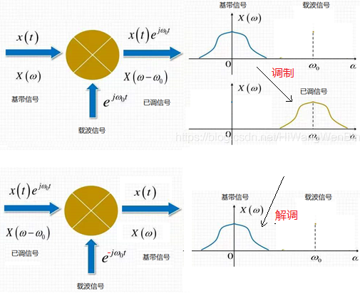

# 基带信号和载波上变频

​		通过前面几节介绍的调制方式，我们可以将数据转化为要发送的信号，通常该信号的频率都较低，称为**基带信号**。虽然我们可以直接发送基带信号来进行通信，但现实中的无线通信一般都采用**载波上变频**的方式，即将基带信号调制到频率较高的**载波信号**上，然后再发送。这样做出于以下几点考虑：

- 把基带信号调制到频率不同的载波信号上可以避免多路信号互相干扰。

- 载波信号的频率较高，因此波长较短。在无线通信中，为了实现较高的信号辐射效率，天线的尺寸需要和发射信号的波长相当，因此短波长、高频率的信号可以缩短天线尺寸。

- 各个国家对电磁波的使用频段进行了规定，有些频段是军用频段，有些频段是商用频段。日常生活中见到的Wi-Fi、蓝牙、无线广播等只能工作在商用频段。例如2.4GHz频段（频率范围2.4GHz~2.5GHz）就是各国通用的商用频段。在其他频段发送信号干扰正常通信属于违法行为。

​		载波信号通常为单频率正弦信号，若载波频率为$f_c$，则载波信号为$A_csin(2\pi f_ct)$，其中$A_c$是载波信号的幅度。在调制过程中，为了将基带信号$B(t)$调制到载波信号上，即将基带信号和载波信号相乘，得到的调制后的信号$M(t)=B(t)A_csin(2\pi f_ct)$，由于基带信号$B(t)$频率较小，因此调制后的信号$M(t)$的频率就在载波频率$f_c$附近。

​		解调时，则需要相反的操作，将接收到的信号**下变频**到基带信号，然后再根据调制方式将发送数据还原出来。

​		下图体现了调制上载波和解调下载波两个频谱搬移的过程。

图. 频谱搬移示意图

​		由于我们采用声波信号模拟无线通信，而商用设备发送的声波信号频率通常较小，因此本章给出的代码示例中，有的采用了载波上变频的方式，有的则没有添加载波上变频而是直接发送基带信号。

