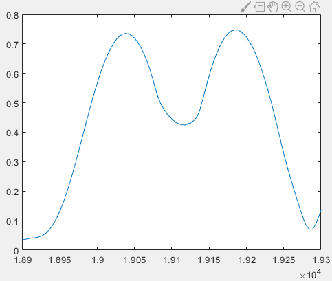
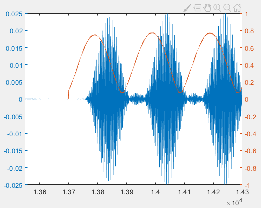
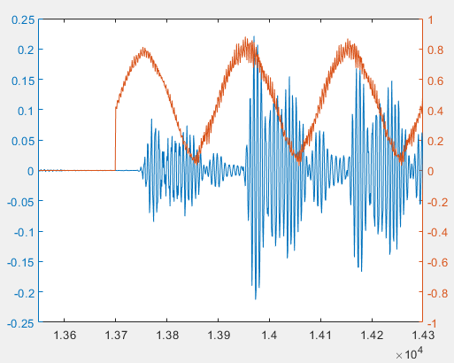

#相对完整的通信系统实现

​		本节以脉冲间隔调制为例，在代码层面实现一个简单的无线通信系统。具体来说，该系统包含一个发送方和一个接收方。发送方的输入是一段文本信息，输出一个音频文件，作为调制好的信号。我们通过手机或者电脑播放该音频文件，然后用另一台设备进行接收。接收方的输入是录制后的音频文件，即接收到的信号，输出是一段文本信息。


​		通过下面代码的实现，大家可以动手体验一下实际环境中的信号传输过程。体会
- 实际传输中的基本步骤
- 实际环境给无线通信带来各种各样的问题，在物联网通信的很多前沿研究工作和论文中，实际上很多时候都是处理各种实际场景里面的问题。
比如
  - 如何检测数据从什么时候开始
  - 如何滤除接收信号中的干扰噪声
  - 如何处理扬声器和麦克风的失真
  - 如何处理发送端设备和接收端设备的频移（这在物联网设备尤其是低成本物联网设备上更加普遍和严重）
  

## 编码
​		我们首先需要把输入的文本信息转换为二进制串，然后才能进行调制。可以按照$ASCII$的编码方式将文本中的每个字符对应到8 bit，按照顺序将它们连接起来。为此我们实现一个名为```string2bin```的函数：

```matlab
function [ binary ] = string2bin( str )
%把字符串转换成二进制串
ascii = abs(str);
L = length(ascii);
binary = zeros(L,8);
for i=1:L
    binary_str = dec2bin(ascii(i));
    binary_str_index = length(binary_str);
    for j = 8:-1:1
        if binary_str_index >0
            binary(i,j) = str2num(binary_str(binary_str_index));
        else
            binary(i,j) = 0;
        end
        binary_str_index = binary_str_index-1;
    end
end
binary = reshape(binary',[L*8,1]);
end
```

​		我们采用声波信号进行通信。采样频率为48 kHz​，由于大多数人听不到17 kHz频率以上的声音，也不会发出超过17 Hz的声音，因此在我们的方法中我们让设备发送18 kHz的声波，这样就可以在发送过程中不干扰其他人，也可以让信号避免被人说话声音干扰。选择脉冲长度为100个采样点，由于采样频率为48 kHz，脉冲的持续时间是$100/48000\approx 2.1ms$。脉冲之间的间隔采样点数与编码的对应规则见下表：

脉冲间隔（单位为采样点）|	编码
------ | ------
50 | 00
100	| 01
150	| 10
200	| 11

## 调制

​		有了编码规则，我们就可以根据输入文本生成信号了。

​		首先是要产生声波信号，在脉冲间隔调制中，我们需要生成固定频率（18 kHz）固定长度（100个采样点）的脉冲信号：

~~~matlab
%%
fs = 48000;                         %设置采样频率
f = 18000;                          %指定声音信号频率
time = 0.0025;                      %指定生成的信号持续时间
t = 0:1/fs:time;                    %设置每个采样点数据对应的时间
t = t(1:100);                       %截取出100个时间上的采样点
impulse = sin(2*pi*f*t);            %生成频率为f的正弦信号
~~~

​		接下来我们生成用于编码的空白部分：

~~~matlab
delta = 50;
pause0 = zeros(1,delta);      %编码00
pause1 = zeros(1,2*delta);    %编码01
pause2 = zeros(1,3*delta);    %编码10
pause3 = zeros(1,4*delta);    %编码11
~~~

​		设置待传输的字符串：

~~~matlab
str = 'Tsinghua University';
~~~

​		调用```string2bin```函数时传入之前设置的待传输字符串，就可以得到待传输的二进制串，将其存储在变量```message```中：

~~~matlab
message = string2bin( str )'; %调用函数把字符串转为二进制串
%因为我们设计的编码是每个码元代表2个bit，这里要把二进制串转为4进制串
[~,m_Length] = size(message);
message4 = [];
for i = 1:m_Length/2
    % 把二进制串中的每两位进行结合，得到四进制串
    message4 = [message4,message(i*2-1)*2+message(i*2)];
end
~~~

​		生成编码数据：

~~~matlab
output = [];
% 根据四进制串中的值，将impulse和对应的空白信号添加到输出信号中
for i = 1:m_Length/2
    if message4(i)==0
        output = [output,impulse,pause0];
    elseif message4(i)==1
        output = [output,impulse,pause1];
    elseif message4(i)==2
        output = [output,impulse,pause2];
    else
        output = [output,impulse,pause3];
    end
end
% 在输出信号前加一段空白，避免播放器在信号刚开始的位置出现失真的情况。
output = [pause3,output,impulse];
% 在figure中画出输出的时域信号
figure(1);
plot(output);
axis([-500 17500 -3 3]);
% 将输出信号写入到音频文件中，需要指明文件名、数据、和采样频率。
audiowrite('message.wav',output,fs);
~~~

​		这里涉及到一个有关扬声器播放声音的问题。有的扬声器在刚打开工作时，其中的电路会经历一个冷启动的过程，因此导致此时播放的声音出现失真的现象。我们可以在音频信号的前面加一段空白信号以跳过这一段冷启动过程。

​		最终生成的输出信号时域信号如图所示，横轴代表采样点的序号，纵轴代表幅度：

<center>

</center>
<center>
<div style="color:orange; border-bottom: 1px solid #d9d9d9; display: inline-block;color: #999;padding: 2px;">图. 编码生成的时域信号</div>
</center>

​		得到调制过信息的声音文件后，我们将文件存储在一个android 手机上，并使用一个声音播放器打开此文件进行播放。同时，我们使用另一个设备将声波信号录制下来存储到录音文件“r.wav”中。因为我们这里展示的是简单的调制方式，单个声道录到的数据就足够解码，因此录制声波时采用的单声道录制。

## 解调

​		以下的解调和解码部分写在```decoding.m```这个脚本中。用matlab读取录音文件“r.wav”,并将读出的数据在图中展示出来：

~~~matlab
%% 读取录音文件中的数据
[data, fs] = audioread('r.wav');
figure(1);
plot(data);
hold on;
~~~

<center>

</center>
<center>
<div style="color:orange; border-bottom: 1px solid #d9d9d9; display: inline-block;color: #999;padding: 2px;">图. 接收到的声音信号</div>
</center>

​		从上图中可见，经历了扬声器播放、空气传播、麦克风接收的声波信号，和未经传输的信号之间有一定的区别，对应了传输过程中引入的各种噪声。

​		在进行解调之前，我们先来回顾一下脉冲间隔调制的原理。由于脉冲间隔调制使用的是脉冲之间的间隔长短来编码数据，所以解调的关键在于得到每两个相邻脉冲之间的间隔，从而将其转换为对应的二进制数据。要得到脉冲之间的间隔，就需要获取每个脉冲的起始和结束时间。因为每个脉冲的长度是固定的，所以我们只需要知道脉冲的起始位置即可。

​		怎样找到脉冲的起始位置呢？在这个例子中我们采用能量强度阈值的方法。

​		借助傅里叶变换，我们可以获取一段时域信号中某个频率信号的强度。通过把时域信号进行分段的傅里叶变换，每段信号中18 kHz信号的强度都可以被计算出来。由于我们设计的脉冲长度是100个采样点，当我们把傅里叶变换的窗口长度设置为100时，只有窗口从脉冲起始点开始截取信号的时候，才能使得整个时域窗口中都充满18 kHz的声音信号。若是窗口起始点不在脉冲起始的位置，那么时域窗口中将不可避免地包含到一部分空白信号（没有声音信号，采样值接近0）。根据傅里叶变换的原理，频域上的能量强度是时域上对应频率能量的叠加。所以当窗口对齐脉冲起始位置时，傅里叶变换得到的18 kHz​处的能量是最高的。我们可以记录下每个时域窗口对应的18 kHz​的能量强度，通过寻找极大值得到每个脉冲信号的起始位置。

<center>

</center>
<center>
<div style="color:orange; border-bottom: 1px solid #d9d9d9; display: inline-block;color: #999;padding: 2px;">图. 脉冲信号和时域窗口</div>
</center>

​		接下来我们进行解调操作。首先对信号进行滤波，去除掉环境中的噪音，只保留信号调制所用到的$18kHz$的声音信号：

~~~matlab
%% 对录音数据进行滤波
%定义一个带通滤波器
hd = design(fdesign.bandpass('N,F3dB1,F3dB2',6,17500,18500,fs),'butter');
%用定义好的带通滤波器对data进行滤波
data = filter(hd,data);
~~~

> 思考：实际上，在脉冲间隔调制中，滤波这一操作不是必须的，你知道是为什么吗？

​		接下来我们对录音信号进行滑动窗口的傅里叶变换，得到每一段数据中18 kHz​信号的强度信息：

~~~matlab
%% 对数据进行带滑动窗口的傅里叶变换。得到每一段数据中18kHz信号的强度信息
f = 18000;                      %目标频率为18kHz
[n,~] = size(data);             %获取数据的长度值
window = 100;                   %设置窗口大小为100个采样点
%定义变量数组impulse_fft，用于存储每个时刻对应的数据段中18kHz信号的强度
impulse_fft = zeros(n,1);	
for i= 1:1:n-window
    %对从当前点开始的window长度的数据进行傅里叶变换
    y = fft(data(i:i+window-1));
    y = abs(y);
    %得到目标频率傅里叶变换结果中对应的index
    index_impulse = round(f/fs*window);
    %考虑到声音通信过程中的频率偏移，我们取以目标频率为中心的5个频率采样点中最大的一个来代表目标频率的强度
    impulse_fft(i)=max(y(index_impulse-2:index_impulse+2));
end
% 在figure中展示每个窗口对应的18kHz信号的强度
figure(2);
plot(impulse_fft);
~~~

​		在下图中展示每个时域窗口的信号对应的18 kHz​信号的强度：

<center>

</center>
<center>
<div style="color:orange; border-bottom: 1px solid #d9d9d9; display: inline-block;color: #999;padding: 2px;">图. 每个时域窗口对应的18 kHz信号的强度</div>
</center>


​		对局部进行放大，我们可以观察到锯齿形的曲线：

<center>

</center>
<center>
<div style="color:orange; border-bottom: 1px solid #d9d9d9; display: inline-block;color: #999;padding: 2px;">图. 时域上的18kHz信号强度的局部放大</div>
</center>

​		我们的目的是通过找极大值准确得到每个脉冲信号的起始位置，然而锯齿形的信号的最大值可能不严格出现在信号峰的中间位置。我们需要通过滑动窗口平均来对impulse_fft进行均值滤波，得到一个平滑的曲线。在这里我们设置一个大小为11的窗口：

~~~matlab
% 滑动平均（均值滤波）
sliding_window = 5;
impulse_fft_tmp = impulse_fft;
for i = 1+sliding_window:1:n-sliding_window
    impulse_fft_tmp(i)=mean(impulse_fft(i-sliding_window:i+sliding_window));
end
impulse_fft = impulse_fft_tmp;
% 在figure中展示平滑后的impulse_fft
figure(2);
plot(impulse_fft);
hold on;
~~~

​		我们可以从下图中看出，均值滤波有效地把锯齿形的信号转化成了相对平滑的信号。对于滑动窗口的大小，可以根据实际需要进行调整。

<center>

</center>
<center>
<div style="color:orange; border-bottom: 1px solid #d9d9d9; display: inline-block;color: #999;padding: 2px;">图. 经过滑动平均的18kHz信号强度的局部放大</div>
</center>

​		由于在实际操作中，我们不能保证经过平滑之后的信号在峰的两侧都是单调的，所以我们用局部最大值来替代极大值来进行判断。通过找到局部最大值得到峰的中间位置，从而得到脉冲信号的起始位置。由于脉冲的长度为100，所以我们再次使用一个长度为100的窗口，这次的窗口是以当前点为窗口的中间，往前后各取半个窗口的长度。当中心点的值是整个窗口中的最大值时，说明左右两侧的点都比中间点的值小，也就是说，当前窗口的中心点是一个峰。为了去除空白数据处的曲线波动对峰值判断的干扰，我们多加了一个对峰的高度的判断，当数据值小于等于$0.3$（阈值）时，无论曲线在此处的走势如何，这里都不会是一个峰。

~~~matlab
% 取出impulse 起始位置（峰的中间位置）
position_impulse=[];    %用于存储峰值的index
half_window = 50;
for i= half_window+1:1:n-half_window
    %进行峰值判断
    if impulse_fft(i)>0.3 && impulse_fft(i)==max(impulse_fft(i-half_window:i+half_window))
        position_impulse=[position_impulse,i];
    end
end
~~~

​		根据我们前面的分析可知，峰值的位置就是脉冲的起始位置。为了验证这个结论，我们把得到的峰值位置在时域信号图中展示出来，并计算相邻两个脉冲之间的间隔：

~~~matlab
%% 在图中表示出脉冲起始位置并计算相邻两个脉冲之间的间隔
[~,N]= size(position_impulse);
%定义变量delta_impulse用于存储相邻两个脉冲之间的间隔
delta_impulse=zeros(1,N-1);
for i = 1:N-1
    %在18kHz信号的强度图中标出脉冲起始位置
    figure(2);
    plot([position_impulse(i),position_impulse(i)],[0,0.8],'m');
    %在时域信号上标出脉冲起始位置
    figure(1);
    plot([position_impulse(i),position_impulse(i)],[0,0.2],'m','linewidth',2);
    %计算两个相邻脉冲之间的间隔。-100是减去脉冲信号长度
    delta_impulse(i) = position_impulse(i+1) -  position_impulse(i) -100;
end
~~~

​		脉冲起始位置在原始时域声音信号上的展示如下图所示。观察发现，代表着我们计算得到的脉冲起始位置的洋红色线条所切割的位置，并不是真正的脉冲信号起始位置。在洋红色线条之前已经有一段的声音信号存在了。

<center>

</center>
<center>
<div style="color:orange; border-bottom: 1px solid #d9d9d9; display: inline-block;color: #999;padding: 2px;">图. 计算得到的脉冲起始在真实时域信号中与脉冲起始不匹配</div>
</center>

​		然而这些洋红色线条在18kHz​强度的时域图中与峰值很好地一一对应，如下图所示。

<center>

</center>
<center>
<div style="color:orange; border-bottom: 1px solid #d9d9d9; display: inline-block;color: #999;padding: 2px;">图. 计算得到的脉冲起始位置和18kHz信号强度峰值整齐对应</div>
</center>

​		也就是说，18 kHz​信号强度的时域图中的峰值并不是出现在脉冲的起始位置。这个结论我们最初的理论分析是不一致的。为了解释这一现象，我们将真实时域信号和分窗口傅里叶变换得到的18 kHz信号强度时域图画在下图中进行观察。我们发现18 kHz信号强度峰值并没有出现在信号起始处，如下图所示：

<center>

</center>
<center>
<div style="color:orange; border-bottom: 1px solid #d9d9d9; display: inline-block;color: #999;padding: 2px;">图. 18kHz信号强度峰值并没有出现在信号起始处</div>
</center>

​		这个现象其实是滤波造成的。如果我们把上图中的原始信号替换成滤波之后的信号，就会发现滤波后的每个脉冲的开头和结尾处的信号比中间的弱。这个滤波器特性导致的现象，再加上多径效应造成的回声现象，使得滑动窗口傅里叶变换得到的最大值并不是出现在脉冲的起始位置。

<center>

</center>
<center>
<div style="color:orange; border-bottom: 1px solid #d9d9d9; display: inline-block;color: #999;padding: 2px;">图. 18kHz信号强度时域图以及滤波之后的声音信号</div>
</center>

​		如果我们不对信号进行滤波，而是直接用原始的声音数据进行滑动窗口傅里叶变换，得到的结果如下图所示。我们可以看到18 kHz信号强度的峰值确实出现在了声音信号的起始位置，但由于没有进行滤波，原始信号中存在的频率更杂乱，使得我们得到的18 kHz信号强度曲线也更加波折。

<center>

</center>
<center>
<div style="color:orange; border-bottom: 1px solid #d9d9d9; display: inline-block;color: #999;padding: 2px;">图. 18kHz信号强度峰值出现在了信号起始处</div>
</center>

​		尽管用滤波前的原始数据和滤波后的数据进行滑动窗口傅里叶变换，得到的峰值位置不一致，事实上，这两种方式都可以成功解码出数据。这是因为我们解码数据依靠的是相邻两个脉冲信号之间的间隔，就算识别出来的脉冲信号的绝对位置有偏差，只要每个脉冲信号位置都偏差大致相似的采样点数，相邻两个脉冲信号之间的间隔就是大致不变的。当我们设计编码时，不同码元使用的间隔之间差异足够大，就可以保证解码的准确性。

## 解码

​		接下来我们使用相邻脉冲之间的间隔进行解码。根据我们设计编码时定义的对应规则把不同长度的间隔映射为不同的编码数据。另外，由于噪声等的影响，我们得到的间隔长度不会严格等于设计值。这时就需要我们在解码时加入一定的鲁棒性。在这个实验中，我们认为只要实际间隔值和设计值之间的误差小于10，就解码出对应的数据，否则解码失败。误差的阈值可以根据信道、信号等的实际情况进行设置。

~~~matlab
%% 解码
%由于每个码元对应2bit，所以先把间隔对应到4进制数
decode_message4 = zeros(1,N-1)-1;
for i = 1:N-1
    if delta_impulse(i) - 50 >-10 &&delta_impulse(i) - 50 <10
        decode_message4(i) = 0;
    elseif delta_impulse(i) - 100 >-10 &&delta_impulse(i) - 100 <10
        decode_message4(i) = 1;
    elseif delta_impulse(i) - 150 >-10 &&delta_impulse(i) - 150 <10
        decode_message4(i) = 2;
    elseif delta_impulse(i) - 200 >-10 &&delta_impulse(i) - 200 <10
        decode_message4(i) = 3;
    end
end
% 把四进制转化为二进制
decode_message = zeros(1,(N-1)*2)-1;
for i = 1:N-1
    if decode_message4(i) == 0
        decode_message(i*2-1)=0;
        decode_message(i*2)=0;
    elseif decode_message4(i) == 1
        decode_message(i*2-1)=0;
        decode_message(i*2)=1;
    elseif decode_message4(i) == 2
        decode_message(i*2-1)=1;
        decode_message(i*2)=0;
    elseif decode_message4(i) == 3
        decode_message(i*2-1)=1;
        decode_message(i*2)=1;
    end
end
~~~

​		现在我们解码出了声音信号中编码的二进制串，要将其转化为可解读的信息还需要将二进制串变成字符串。我们实现一个与```string2bin```函数对应的```bin2string```函数来实现这个功能：

~~~matlab
function [ str ] = bin2string( binary )
% 把二进制串转化为字符串
L = length(binary);
str = [];
binary = reshape(binary',[8,L/8]);
binary = binary';
for i=1:L/8
    s= 0;
    for j = 1:8
        s = s+2^(8-j)*binary(i,j);
    end
    str = [str,char(s)];
end
end
~~~

​		最后，调用```bin2string```函数：

~~~matlab
%把二进制数据根据ascii码值解出对应的字符串
str = bin2string(decode_message)
~~~
​		运行整个脚本可以得到可以解码的数据串:

~~~matlab
>> decoding
str=
    'Tsinghua University'
>>
~~~

​		至此，一个简单的无线传输系统就完成了。

> 思考 
> 1. 能量强度阈值的方法在别的调制方法上是否适用？如果环境中存在较强的干扰，使得能量较强的地方很可能是噪声，应该如何检测信号的起始位置？
> 2. 在脉冲间隔调制中，如果有一个脉冲因噪声没能被检测到，则会导致之后所有的脉冲都错位一个，因此解出的二进制串从这一位后全都没有对齐。如何减少这种情况带来的影响？
> 3. 这里用的是脉冲调制的方法，能不能将调制方法换成前面学过的BPSK，QPSK，8PSK，OQPSK，64QAM，OFDM等？