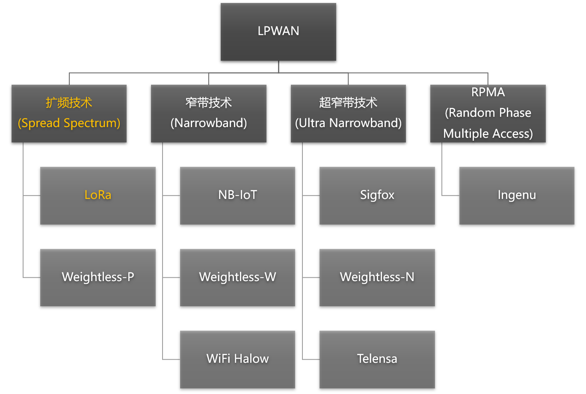
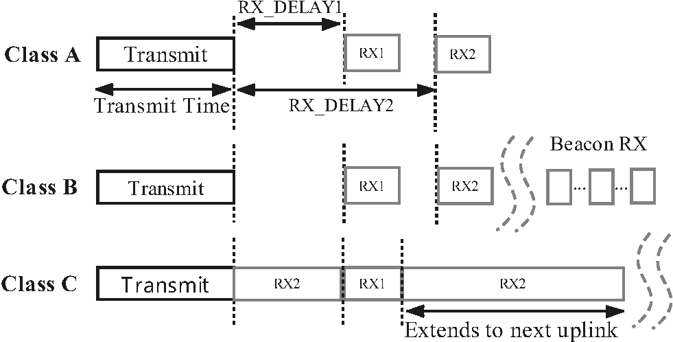

# LoRa 简介

## 低功耗广域网

LPWAN (Low Power Wide Area Network)指的是低功耗广域网，其特点在于极低功耗，长距离以及海量连接，适用于物联网万物互联的场景。LPWAN不只是一种技术，而是代表了一族有着各种形式的低功耗广域网技术，如下图所示。其中LoRa使用的是一种扩频技术，NB-IoT使用的是窄带技术，这是两种有代表性的低功耗广域网技术。

图. LPWAN技术一览

图. 无线技术分类

无线通信技术从数据率和通信范围两个维度的比较如上图，不难看出，LPWAN填补了我们常见通信技术(比如WIFI，Bluetooth，4G/5G等)的一片空白，即通信距离长，通讯速率不高。虽然LPWAN通信速率不高，但是依然能够满大部分物联网通信的需求，同时其超低功耗也是它收到青睐的原因。

近年来，随着物联网技术的蓬勃发展，物联网系统被大量应用在资源管理、生产监控、环境监测等多个方面。
在典型的物联网系统中，节点需要具有环境感知和信息共享的能力。
物联网系统通过信息共享实现有用数据的汇聚，进而达到深度分析和智能决策的目标。

鉴于信息共享在物联网系统中的重要地位，目前有大量学者致力于研究如何为物联网系统提供高效的数据传输方式。
在早期的研究中，主要有三种技术为物联网系统提供数据传输服务。

- 一是短距离无线网，代表技术包括蓝牙、ZigBee、Z-Wave 等。
这类技术通常对功耗要求低，但其传输覆盖范围小、传输速率受限，因此应用范围极其有限。
- 二是传统无线局域网，即 IEEE 802.11 协议族所规定的一系列协议。
这类技术虽然覆盖范围较短距离无线网有所提升，通常情况下可以覆盖几十米到数百米。
但对于像智能牧业、环境监测等动辄数十公里范围的室外应用场景来说，传统无线局域网技术变得不再适用。
并且，传统无线局域网技术作为一种高能耗的传输技术，其在物联网场景中的应用范围也非常有限。
- 三是蜂窝网络，包括 GSM、LTE 等技术。
由于蜂窝网络通信距离远且基站等基础设施完备，因此能够很好地解决物联网系统中通信覆盖范围的问题。
但是蜂窝网络对设备接入有着复杂的规定，不同的移动网络运营商有着不同的接入认证要求，这极大限制了物联网设备接入蜂窝网络的能力。
此外蜂窝网络中，接入设备的能量消耗大、复杂性高、接入模块成本高，因此对于通常由电池进行驱动、且需要大量部署的物联网节点，蜂窝网络接入方式显得不再适合。

图. LPWAN与传统无线网络技术比较

针对上述已有技术在具体物联网应用中存在的不足，学者们提出了一类针对大规模物联网应用场景的连接技术，称为低功耗广域网(Low Power Wide Area Networks， LPWAN)。
LPWAN兼具短距离无线网络低功耗和蜂窝网络超大覆盖范围的优点，覆盖范围广、通信能耗低且吞吐量小。
因此对于分布在大范围区域内的低功耗物联网设备来说，LPWAN是最佳的连接选择。
在 LPWAN 网络中，这些物联网设备可以随意部署或移动，因此 LPWAN 可以满足智能城市中的诸多应用，如智能化计量，家庭自动化，可穿戴电子，物流，环境监测等。这些应用需要交换数据量少，交换的频率也不高。
LPWA 应用场景包括但不限于智能交通、工厂、农业、采矿等领域。
由于 LPWAN 具有传统的蜂窝网络和传统无线技术所不具备的特点（例如相比于蜂窝网络来说功耗更低，相比于传统无线网覆盖更广），因此对 LPWAN 的研究在满足特定物联网应用方面具有非常重要的意义。
自提出以来，LPWAN在工业、农业、交通运输业得到广泛应用。

现有的LPWAN技术，按工作频段不同，主要可以分为授权频段（License Band）和非授权频段（Unlicense Band）两类。

- 采用授权频段技术的为3GPP（3rd Generation Partnership Project）主导的NB-IoT（Narrow Band IoT），其采用现有的3G/4G网路，主要投入为电信营运商及相关设备厂商。
- 至于非授权频段，就呈现了遍地开花的状况，大部分不属于电信领域的ICT厂商，都会选择投入这边，主要的代表技术正是SIGFOX与LoRa。它们都采用了ISM频段（Industrial Scientific Medical Band），这是一种各国开放给工业、科学及医学机构使用的频段。它们无须许可证及费用，只需要遵守一定的发射功率（一般低于1W），不要对其他频段造成干扰即可。

## LoRa是什么？

要想准确地回答这一问题，绝非一件易事。
因为LoRa这个词所指代的并非一件单一的事物，恰恰相反，它包含了至少三层概念：
- LoRa 是 Long Range Communication的简称，狭义上的LoRa指的是一种物理层的信号调制方式，是 Semtech 公司定义的一种基于Chirp扩频技术的物理层调制方式，可达到-148 dBm的接收灵敏度，以偏小的数据速率（0.3-50kbps）换取更高的通讯距离（市内3km，郊区15km）和低功耗（长达10年）。
- 从系统角度看，LoRa也指由终端节点、网关、网络服务器、应用服务器所组成的一种网络系统架构：LoRa定义了不同设备在系统中的分工与作用，规定了数据在系统中流动与汇聚的方式。
- 从应用角度看，LoRa为物联网应用提供了一种低成本、低功耗、远距离的数据传输服务：LoRa在使用10mW射频输出功率的情况下，可以提供超过25km视线传输距离，从而支持大量广域低功耗物联网应用。

为了帮助读者建立对LoRa完整的认识，本节剩余部分将从LoRa应用、LoRa系统架构、LoRa物理层调制技术三个方面，自顶向下地对LoRa进行介绍。

大家也可以看到，现在很多的研究工作甚至论文声称自己使用了LoRa或者就是LoRa，但是只是其中一小部分跟LoRa有一些关系，比如可能仅仅使用了CSS技术，甚至都可能只是使用了频率线性增长的信号，这些都不能称之为完整的LoRa。甚至有一些使用了FMCW技术的工作，也将自己和LoRa联系起来。

## LoRa应用

LoRa作为目前广泛使用的低功耗广域网技术(LPWAN)，为低功耗物联网设备提供了可靠的连接方案。
如下图所示，相比于Wi-Fi、蓝牙、ZigBee等传统无线局域网，LoRa可以实现更远距离的通信，有效扩展了网络的覆盖范围；
而相比于移动蜂窝网络，LoRa具有更低的硬件部署成本和更长的节点使用寿命，单个LoRa节点可以在电池供电的情况下连续工作数年。
LoRa具有低数据率、远距离和低功耗的性质，因此非常适合与室外的传感器及其他物联网设备进行通信或数据交互。

图. LPWAN与其他无线通信技术对比

考虑到LoRa在覆盖距离、部署成本等方面的巨大优势，近年来LoRa在全球范围内进行了大量的应用部署，在水质监测、火灾预警、智慧路灯等众多物联网场景中都可以看到LoRa的身影。例如LoRa通信模块与传统的水质传感器进行连接，从而使用户可以数十公里外远程监控饮用水在输送过程中的水质变化情况。而在荷兰的KPN项目中，工程人员通过广泛部署LoRa网关，实现LoRa网络全覆盖，为智慧运输、智能农业、智慧路灯等具体应用提供了通信支持。

## LoRa架构

LoRa也指一种由节点、网关及服务器所组成的网络系统架构，各部分的关系如下图所示。
LoRa节点与网关之间采用单跳直接连接，这一阶段的物理层使用线性扩频调制，MAC层通常使用LoRaWAN协议。

网关收到数据包后，对数据包信号进行解码，并将解码结果通过蜂窝或有线网络传输给网络服务器，这一阶段使用传统的TCP/IP进行传输，同时网络服务器与网关之间的交互仍然遵守LoRaWAN协议。
网络服务器汇总多个网关的数据，过滤重复的数据包，执行安全检查，并根据内容将数据发送至不同的应用服务器，供用户读取和使用，这一阶段也使用TCP/IP和SSL进行传输和加密。

图. LoRa网络架构

## LoRaWAN

LoRaWAN是由LoRa联盟在LoRa物理层编码技术的基础上提出的MAC层协议，由LoRa联盟负责维护。LoRaWAN规范1.0版本于2015年6月发布。LoRaWAN协议主要规定了节点与网关、网关与服务器之间的连接规范，确定了LoRa网络的星型拓扑结构。受LoRa节点成本和能耗的限制，现有的LoRaWAN协议基本采用纯ALOHA机制，即节点在发送数据前不进行载波侦听，而是随机选择时间进行发送。一方面，LoRaWAN协议的简单性有助于降低节点能耗，延长节点的使用寿命；但另一方面，过于简单的介质访问控制机制也加剧了LoRa网络的信号冲突问题。

LoRaWAN定义了网络的通信协议和系统架构，还负责管理所有设备的通信频率，数据速率和功率。
在LoRaWAN的控制下，网络中的所有设备可以是异步的，并在只有可用数据时进行传输。
针对不同的应用场景，LoRaWAN定义了三种节点运行模式，分别是Class A（ALL）、Class B（Beacon）、Class C（Continuously Listening）：

- Class A模式主要提供低功耗上行连接，处于Class A模式的节点可以在任意时间发起上行传输，并只在传输结束时打开两个下行接收窗口，此时接收来自网关ACK。Class A模式下，网关无法主动连接到节点，当无数据传输时，节点处于休眠状态，因此该模式下节点能耗最低。
- Class B模式提供节点与网关的周期性连接，该模式下网关节点周期性向节点广播信标帧，保持节点与网关的时间同步。
- Class C模式提供节点与网关的持续性连接，该模式下节点始终处于唤醒状态，因此能耗最高。
  三种网络模式中，Class A是所有LoRa网络都必须支持的模式，也是最常用的网络模式。

图. LoRaWAN: Class A, B, C

## 参考文献
1. https://lora-alliance.org/about-lorawan/
