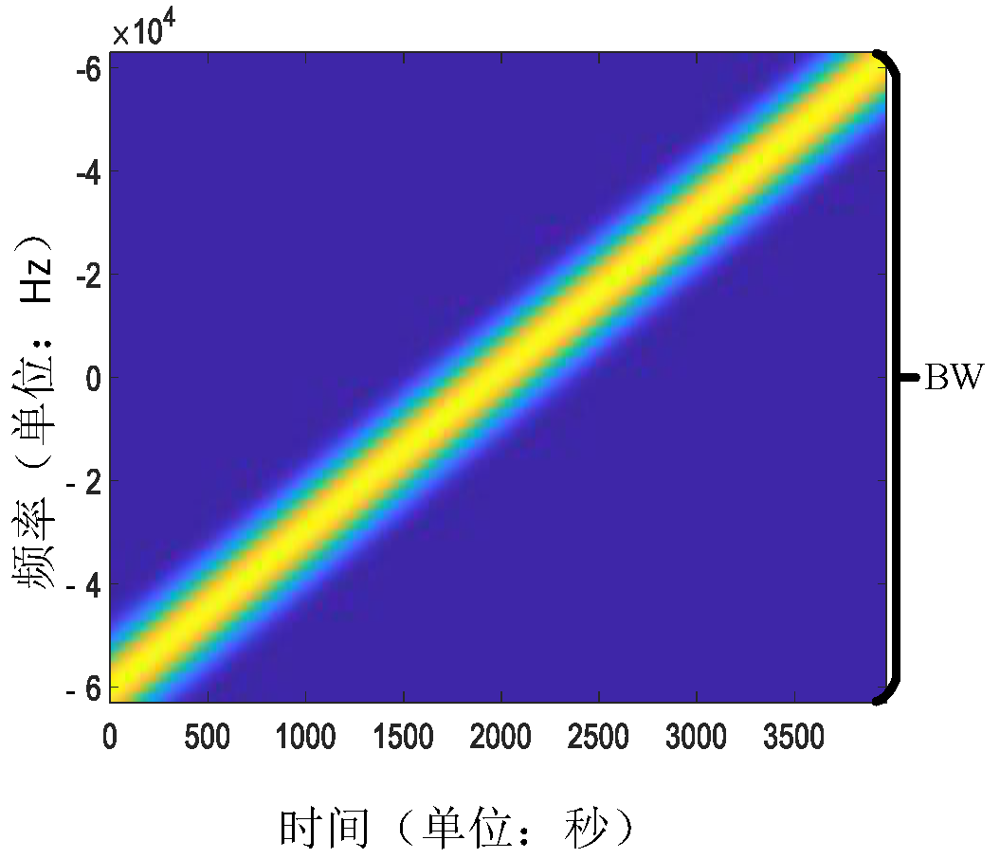
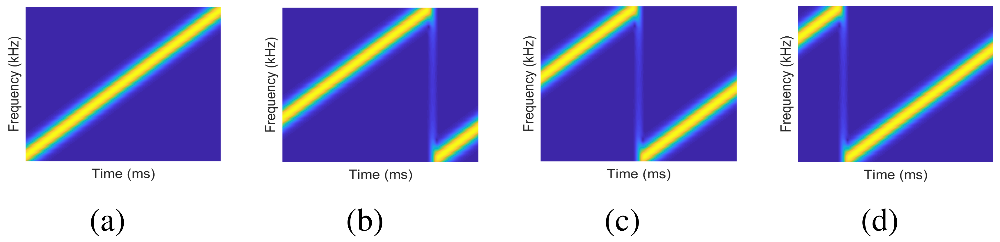

# LoRa 通信

在这一部分，我们来介绍LoRa通信的基本原理，包括调制、解调、编码和解码，着重于物理层协议的分析，最后我们以声波作为传输方式展示如何进行LoRa通信。关于上层协议（如LoRaWAN），有很多其他的资料和开源实现供读者学习[1][2]。下面我们所讨论的LoRa，不加特殊说明的话，指LoRa物理层。

需要说明的是，LoRa物理层是一个商用的私有协议，并没有完整公开的协议说明，因而已有的一些LoRa实现[3][4][5]都是依照Semtech公司的相关专利和文件猜出来的。很多对LoRa的说法只是基于大家的观察和理解，同时很多LoRa代码实现的性能是很差的，包括不少研究论文中使用的LoRa代码，实际性能也存在着很大的问题。为此，我们深入地进行了可验证的LoRa逆向工程并开源了两个完整的代码库。我们的实现可以达到商业LoRa芯片的性能和编解码能力（千米级通信，100%收发包）。

MATLAB版本用于原型验证和离线操作，基于GNURadio平台的C++版本则是一个实时的高性能LoRa实现。希望这两个代码库可以更好地帮助大家学习和研究LoRa。未来我们还将开源FPGA上LoRa编解码的硬件实现。

MATLAB 版本 LoRaPHY: [https://github.com/jkadbear/LoRaPHY](https://github.com/jkadbear/LoRaPHY)

GNURadio 版本 gr-lora：[https://github.com/jkadbear/gr-lora](https://github.com/jkadbear/gr-lora)


下面进行LoRa的一些基本介绍。除去技术指标等，希望大家更加注意体会LoRa是通过什么样的设计来支撑远距离、低功耗的传输特性的。

## LoRa 调制与解调

在这节我们介绍LoRa的调制与解调，也即如何在物理波形和比特数据之间进行转换。

LoRa 使用 CSS （Chirp Spread Spectrum）线性扩频调制，频率线性扫过整个带宽，因此抗干扰极强，对多径和多普勒效应的抵抗也很强。LoRa的基本通信单元是linear chirp，也即频率随时间线性增加（或减小）的信号。我们将频率随着时间线性增加的chirp符号叫做upchirp，将频率随着时间线性减小的chirp符号叫做downchirp。如下两图分别从时域波形和时频域展示了一个upchirp的图像：

<center>

</center>
<center>
<div style="color:orange; border-bottom: 1px solid #d9d9d9;
display: inline-block;
color: #999;
padding: 2px;">图. Chirp时域图。横坐标为时间，纵坐标为信号幅度。</div>
</center>

<!-- <center>

</center>
<center>
<div style="color:orange; border-bottom: 1px solid #d9d9d9;
display: inline-block;
color: #999;
padding: 2px;">图. Chirp时频图。横坐标为时间，纵坐标为频率。</div>
</center> -->

<center>

</center>
<center>
<div style="color:orange; border-bottom: 1px solid #d9d9d9;
display: inline-block;
color: #999;
padding: 2px;">图. upchirp的时频图。横坐标为时间，纵坐标为频率</div>
</center>

一个chirp怎么编码数据呢？LoRa的做法是通过循环平移chirp进行数据的编码，依不同的起始频率代表不同的数据。如下图所示，在带宽B内四等分标定四个起始频率，我们可以得到4种类型的符号，分别表示00，01，10，11。我们将图(a)所示从最低频率扫频到最高频率的chirp符号称为basic upchirp。

<center>

</center>
<center>
<div style="color:orange; border-bottom: 1px solid #d9d9d9;
display: inline-block;
color: #999;
padding: 2px;">图. LoRa循环频移编码。当SF=2时，分别编码了00，01，10，11的四种符号。</div>
</center>

LoRa规定了一个参数SF（Spreading Factor，扩频因子），其定义为

$$
2^{SF} = B \cdot T.
$$

SF用于调节传输速率和接收灵敏度，越大的SF速率越小但支持更远的通讯距离。因此上面的起始频率数目也取决于SF，如果没有启用低速率优化，一般来说起始频率的数目是 $2^{SF}$。

当我们使用软件无线电设备（Software-defined radio, SDR）接收一段LoRa设备发出的信号，并用[inspectrum](https://github.com/miek/inspectrum)这个软件（其他可画时频图的软件或代码也可以）把信号的时频图画出来，那么它大概会是如下样子：

<center>

</center>
<center>
<div style="color:orange; border-bottom: 1px solid #d9d9d9;
display: inline-block;
color: #999;
padding: 2px;">图. LoRa数据包时频图</div>
</center>

一个完整的LoRa数据包结构包含三个部分：前导码（Preamble）、SFD（Start Frame Delimiter）和数据部分（Data）。 前导码包含6~65535个basic upchirp和两个标识网络号的其他chirp符号。接着是2.25个basic downchirp，作为SFD标识数据段的开始。后面的数据段则包含着若干编码了数据的data chirp。

LoRa解调过程，实质就是求出chirp符号的起始频率，其做法通常是这样的：首先将收到的基带upchirp信号与downchirp点乘，化为单频信号，这一操作叫做dechirp（解扩频）。Dechirp能够将chirp信号能量集中到单一频率，是LoRa的抗噪及传输远距离的原因之一。

Dechirp之后，对得到的信号进一步做FFT(快速傅里叶变换)，即可在频域获得一个峰值，这个峰值位置对应的频率即是起始频率，我们因此得到对应的$SF$个比特。对于非basic upchirp而言，如果采样率高于带宽的话，会得到两个峰，我们可以将这两个峰进行叠加来增强峰的高度，进而求出对应的位置。下面两图分别对应basic upchirp和非basic upchirp的解调过程。

<center>

</center>
<center>
<div style="color:orange; border-bottom: 1px solid #d9d9d9;
display: inline-block;
color: #999;
padding: 2px;">图. 解调basic upchirp</div>
</center>

<center>

</center>
<center>
<div style="color:orange; border-bottom: 1px solid #d9d9d9;
display: inline-block;
color: #999;
padding: 2px;">图. 解调非basic upchirp</div>
</center>

我们再以数学式子的形式将上面的过程更细致地梳理一遍。

upchirp从最低频率开始，随时间增加逐渐上升至最高频率。而downchirp则与之相反，从最高频率逐渐下降至最低频率。最高频率和最低频率之间的差值为LoRa的带宽$B$。设basic upchirp的最低频率为$f_0=-\frac{B}{2}$，最高频率为$f_1=\frac{B}{2}$，chirp长度为$T$。因此其频率可以表示为$f(t)=f_0+kt$，其中$k=\frac{BW}{T}$表示扫频速度。线性变化的频率对时间做积分可以得到二次形式的相位$\phi(t) = 2\pi (f_0 t + \frac{1}{2}kt^2)$。由此，basic upchirp可以表示为：

$$
C(t)=e^{j2\pi(f_0+\frac{1}{2}kt) t}
$$

> 思考：这里频率为什么会有负的，意义是什么？

当嵌入数据时，LoRa首先令basic upchirp乘上一个固定频率的偏移分量，偏移后的信号可以表示为$C(t)e^{j2\pi \Delta ft}$。随后，LoRa将所有频率高于$f_1$的信号段循环频移至$f_0$频率处，频移后的信号如下图(e)所示。如果定义了 $2^{SF}$ 种不同的偏移频率，最多可以表示 $SF$ 比特的数据。

在解调部分，我们要进行dechirp和FFT。对于一个收到的数据包，LoRa首先令数据包中每个数据upchirp与basic downchirp相乘。与upchirp类似，basic downchirp可以表示为：

$$
C^*(t)=e^{j2\pi(f_1-kt) t}
$$

当$f_0 = -f_1$时，$C^*(t)$是$C(t)$的共轭，因此这个相乘的结果是一个单频信号，其频率等于编码chirp的频率偏移量：

$$
C^*(t)\cdot C(t)e^{j2\pi \Delta ft}=e^{j2\pi \Delta ft}
$$

对$e^{j2\pi \Delta ft}$做FFT将时域信号转化为频域波峰，波峰的下标即对应信号编码的数据。

整个LoRa解码流程如下图所示，对应两种信号的解码，左为basic upchirp，右为非basic upchirp。第一行为信号的时间-频率图，第二行为信号的时间-幅度图，第三行为信号乘downchirp后的时间-幅度图，第四行为傅里叶变换结果，注意左边在0的位置有峰。

<center>

</center>
<center>
<div style="color:orange; border-bottom: 1px solid #d9d9d9;
display: inline-block;
color: #999;
padding: 2px;">图. LoRa解调流程</div>
</center>

> 需要特别指出的是：
> 1. 上述解调过程只是其中的一种方法，也有很多其他的方法，比如有一些研究工作就利用时域上观察频率变化规律来解码（大家可以想想这个有什么根本问题）。
> 2. 上述解调过程中其实还有很多细节，例如如何达到最好的解调效果、如何精准地找到频率等。这些目前都没有完全展开，请读者参考论文[6]和代码实现[LoRaPHY](https://github.com/jkadbear/LoRaPHY)仔细思考。


接下来我们介绍CFO（Carrier Frequency Offset，载波频偏）和TO（Time Offset，时间偏移）的影响。 假设我们发送的chirp信号扫频范围在 470MHz ~ 470.5MHz，到了接受端，收到的信号扫频范围可能会变成 470MHz+$\delta$ ~ 470.5MHz+$\delta$ ，这个频偏是由于收发端时钟不一致造成的，我们称之为CFO。 当我们解码的时候，截取信号的窗口可能没有和chirp符号完全对齐，这样也会带来一个频率偏移，我们称之为TO。 下图展示了有无CFO、窗口是否对齐的四种解调结果。

<center>

</center>
<center>
<div style="color:orange; border-bottom: 1px solid #d9d9d9;
display: inline-block;
color: #999;
padding: 2px;">图. 利用up-down对齐进行CFO消去[6]</div>
</center>

> 请大家基于上图思考如何在TO和CFO都存在的情况下，准确地计算出TO和CFO。如果还不太熟悉的话建议去看一下我们的论文[6]，在我们早期的几个关于LoRa论文中都有介绍。

## LoRa 编码与解码

在这节我们介绍LoRa的编码与解码，也即如何在起始频率的自然二进制表示和数据包中的数据之间进行转换。这是个纯粹的比特到比特的变换，因而只考虑其中一个方向读者就能全部理解了。

考虑解码过程，如何从波峰的下标转化为真正的编码数据？在LoRa中需要经过以下几个步骤：
1. 格雷码编码（Gray coding）
2. 对角交织（Interleaving）
3. 海明解码（Hamming decoding）
4. 数据白化（Whitening）
5. 包头解析（Header Decoding）
6. CRC校验（CRC checksum）

下面我们用MATLAB代码来演示如何生成一个符合LoRa规范的信号，其中需要使用[LoRaPHY](https://github.com/jkadbear/LoRaPHY)：

```matlab
rf_freq = 470e6;    % 载波频率，主要用于纠正采样频偏（SFO），在仿真中可忽略
sf = 9;             % 扩频因子
bw = 125e3;         % 带宽 125kHz
fs = 1e6;           % 采样率 1MHz

phy = LoRaPHY(rf_freq, sf, bw, fs);
phy.has_header = 1;         % explicit header 模式
phy.cr = 1;                 % code rate = 4/8 (1:4/5 2:4/6 3:4/7 4:4/8)
phy.crc = 1;                % 允许 payload CRC
phy.preamble_len = 8;       % 前导码： 8 basic upchirps

% 编码4个bytes [1 2 3 4]
symbols = phy.encode((1:4)');
fprintf("[encode] symbols:\n");
disp(symbols);

% 基带调制
sig = phy.modulate(symbols);

% 画出时频图
LoRaPHY.spec(sig, fs, bw, sf);
```

<center>

</center>
<center>
<div style="color:orange; border-bottom: 1px solid #d9d9d9;
display: inline-block;
color: #999;
padding: 2px;">图. 生成的LoRa数据包</div>
</center>

我们再用MATLAB代码来演示如何解码这个我们生成的LoRa信号：

```matlab
% 解调
[symbols_d, cfo] = phy.demodulate(sig);
fprintf("[demodulate] symbols:\n");
disp(symbols_d);

% 解码
[data, checksum] = phy.decode(symbols_d);
fprintf("[decode] data:\n");
disp(data);
fprintf("[decode] checksum:\n");
disp(checksum);
```

输出结果为：
> [demodulate] symbols: 481 177 417 33 97 73 249 401 181 91 299 379 9 2 1 1 1 64
> [decode] data: 1 2 3 4 119 16
> [decode] checksum: 119 16

## 基于声波的LoRa通信

在这一节，我们来实现基于声波的LoRa通信。采用Matlab生成声音，然后通过手机去播放(发射)，使用另一台手机去录音(接收)。最后再将这段信号传到电脑端进行最后的解码。

首先我们需要了解LoRa通信的过程，这同时也是大多数射频信号通信的过程。注意这里是一个很简化的版本，想要详细了解，可以自己进一步学习。

在发射端，原始数据首先进行调制得到一个基带信号，基带信号是频率很低的信号，传输距离受限，要达到预期的通信距离，对天线要求就很苛刻了。所以通常的做法是将这个基带信号调制到高频信号上，这一过程叫做上变频。之后，就是将信号传输出去，通过一个信道(比如空气、水等介质)，被接收者接收。

接收端的操作基本与发射端“相反”。首先是下变频得到低频率的基带信号，之后进行对应的解调和解码得到原始数据。

射频信号通常需要对应的收发机进行发射和接收，这里我们通过声音去模拟这一通信的过程。之所以选择用声音去模拟实现，是因为声音可以用手机播放和录取，易于实践。

<center>

</center>
<center>
<div style="color:orange; border-bottom: 1px solid #d9d9d9;
display: inline-block;
color: #999;
padding: 2px;">图. 通信流程</div>
</center>


**发射端**

由于手机采样率限制，信号频率带宽不能很高，这里设置信号带宽2kHz，采样率48kHz，编码SF=7个比特，也就是可编码符号数目为 $2^{SF}=128$，
接下来生成Chirp和基带LoRa信号，这里编码了3个6，之前加了一段0信号，是为了使信号长一点，编码录音的时候错过有效信号。对于编码数据，在实现上可以不同。

```matlab
fc = 16e3;           % 载波频率，主要用于纠正采样频偏（SFO），在发射端可忽略
sf = 7;              % 扩频因子
bw = 2e3;            % 带宽 2kHz
fs = 48e6;           % 采样率 48kHz
Nchirp = 2^sf/bw*fs; %一个Chirp的采样点数

phy = LoRaPHY(fc, sf, bw, fs);
phy.has_header = 1;         % explicit header 模式
phy.cr = 1;                 % code rate = 4/8 (1:4/5 2:4/6 3:4/7 4:4/8)
phy.crc = 1;                % 允许 payload CRC
phy.preamble_len = 8;       % 前导码： 8 basic upchirps

% 编码3个6
symbols = phy.encode([6, 6, 6]);
sig = phy.modulate(symbols);

zs = zeros(1, Nchirp*5);
chirp_sound = cat(2, zs, sig);      % 基带信号
```

之后上变频：将基带信号的实部乘上一个余弦高频信号，基带信号的虚部乘上一个正弦高频信号（有负号），最后将它们加起来作为真实发送的信号。这里设置的高频信号为 $f_c = 16$ kHz。

```matlab
t = (0:length(chirp_sound)-1)/fs;
car_chirp_sound = real(chirp_sound).*cos(2*pi*fc*t)+imag(chirp_sound).*sin(-2*pi*fc*t);
```

注意，这里模拟射频信号，故使用了I/Q两路信号，并将其转成了复数形式，但是实际信道传输的信号是实数信号，故最终取实部发送。思考一下为什么？

最后将生成的信号存成声音文件，这里是.wav格式，接下来进行播放即可。当然电磁波数据发送的时候不会有保存成.wav的这一步，只是由于我们声波通信实现方便，我们先保存成.wav，也方便大家直接查看发送的数据。同学们可以打开这个文件来直观地听一下发送的数据。

```matlab
audiowrite('chirpSound.wav', car_chirp_sound, fs, 'BitsPerSample', 16);
```

**接收端**

使用手机录音，收到数据(也是.wav格式)之后，需要对这个数据进行解码。利用`audioread`读入数据，得到数据点和采样率，wav文件通常是双声道的，我们只需要取其中一个声道的数据即可。

```matlab
[recv_sound, fs] = audioread('chirpSound_recv.wav');
recv_sound = recv_sound(:,1);
```

第一步是滤波去噪，去除不是想要频段的噪声。不熟悉的可以去看看滤波那一章。

```matlab
recv_sound_bf = BPassFilter(recv_sound, 18e3, 4e3, fs)
```

第二步即下变频，并通过低通滤波，提取基带信号。还不熟悉滤波的可以再去看看滤波那一章。

```matlab
%% 下变频  从高频信息提取低频信号(基带信号)
real_chirp_sound = recv_sound_bf.*cos(2*pi*fc*t);
imag_chirp_sound = recv_sound_bf.*sin(-2*pi*fc*t));
%% 低通滤波
real_cs = BPassFilter(real_chirp_sound, 3e3, 2e3, fs);
imag_cs = BPassFilter(imag_chirp_sound, 3e3, 2e3, fs);
rec_chirp_sound = real_cs + 1j*imag_cs;
```

其中，BPassFilter 函数代码如下：

```matlab
% 本函数利用窗函数法设计带通滤波器，主要用来滤出单一频率，即中心频率
% data是输入的数据, centerFre是带通的中心频率, offsetFre是频偏,最终带通为centerFre +- offsetFre/2
% ,sampFre是采样率
function y = BPassFilter(data, centerFre, offsetFre, sampFre)
    % 设计I型带通滤波器
    M = 0 ;    % 滤波器阶数（必须是偶数）
    Ap = 0.82; % 通带衰减
    As = 45;   % 阻带衰减
    Wp1 = 2*pi*(centerFre - offsetFre)/sampFre;  % 算出下边频
    Wp2 = 2*pi*(centerFre + offsetFre)/sampFre;  % 算出上边频

    % 矩形窗
    N = ceil(3.6*sampFre/offsetFre); % 计算滤波器阶数,采用矩形窗，3dB截频在中心频率到上下边频的中点
    M = N - 1;
    M = mod(M,2) + M ; % 使滤波器为I型(偶数)

    % 单位脉冲响应的下脚标
    h = zeros(1,M+1);  % 单位冲击响应变量赋初值
    for k = 1:(M+1)
        if (( k -1 - 0.5*M)==0)
            h(k) = Wp2/pi - Wp1/pi;
        else
            h(k) = Wp2*sin(Wp2.*(k - 1 - 0.5*M))/(pi*(Wp2*(k -1 - 0.5*M))) - Wp1*sin(Wp1*(k - 1 - 0.5*M))/(pi*(Wp1*(k -1 - 0.5*M)));
        end
    end
    y = filter(h,1,data);
end
```

第三步是解码，这一步首先要对齐信号，我们根据信号能量找到大致信号所在的区间（由于前导码的存在，这一步并非必要的）。通过滑动窗口平均，可以过滤部分能量突变的情况。

```matlab
A = movmean(abs(rec_chirp_sound), mwin);
thresh = (max(A) - min(A))/3 + min(A);
inds = find(A > thresh);  % 找信号高于thresh的下标位置
cut_rec_cs = rec_chirp_sound(inds(1):(inds(end)+Nchirp));  % 截取信号

% 解调
[symbols_d, cfo] = phy.demodulate(cut_rec_cs);
fprintf("[demodulate] symbols:\n");
disp(symbols_d);

% 解码
[data, checksum] = phy.decode(symbols_d);
fprintf("[decode] data:\n");
disp(data);
fprintf("[decode] checksum:\n");
disp(checksum);
```

<!-- ### 4.1 预热实验

**实验内容：**

本部分实验，请同学们运行提供的代码和程序体验LoRa编解码和通信。

**实验步骤：**

- 解压缩课程资料。可以看到下面的目录


<center>
<div style="color:orange; border-bottom: 1px solid #d9d9d9;
display: inline-block;
color: #999;
padding: 2px;">图. 课程资料</div>
</center>

其中code里面含有生成和解析声音的代码(genSound.m和anaSound.m)，接收app里面含有我们用Android写的app--music.apk，可以发送和接收声音。接收的数据存放了两个我们之前用手机接收的声音数据(m.wav和o.wav)。PPT是本次讲解用的，可以课后查看。Readme也提供了简单的课程资料介绍。

- 生成声音信号。用Matlab打开code文件夹，运行genSound.m，不出意外的话，在同级目录下会出现chirpSound.wav文件，.wav是一种声音存储格式，这就是用LoRa chirp生成的声音文件。

- 安装music.apk并开始录音。这里是基于Android平台的，只有ios的同学可以询问助教借用实验的Android机。下面是music.apk界面。


<center>
<div style="color:orange; border-bottom: 1px solid #d9d9d9;
display: inline-block;
color: #999;
padding: 2px;">图. 应用程序界面</div>
</center>

点击开始录音即会录，点击停止录音即停止当前的录音，并将生成的文件存到对应的位置，按钮下面标明了存储的路径。

- 发射声音。用手机或者电脑等可以播放声音的设备播放chirpSound.wav文件，提供的music.apk点击选择音频也可以进行播放，但是通常用自带的播放器就行了。

chirp信号中文翻译名为啁啾，因为它像鸟的叫声，大家实验一下，看是否是这样。

- 解码声音。找到录取的声音，将其传到电脑上面，然后再次使用Matlab运行anaSound.m，就可以对声音进行解析，并且输出最后的数据。不出意外的话，就可以看到编码的数据666了。


<center>
<div style="color:orange; border-bottom: 1px solid #d9d9d9;
display: inline-block;
color: #999;
padding: 2px;">图. 解码结果</div>
</center>

注意更改声音文件的路径，之前提供了两个声音文件，即使你没有发射接收操作，你也可以直接运行进行解码，当然最好是体验一整套通信流程。 -->


<!--  - (1) 尝试使用MATLAB编码chirp信号，并绘制时域和频域图像，分析构造信号的正确性。

提示：可以使用MATLAB自带的Chirp函数或者直接用Chirp的数学表达式2*pi*f*t+k*pi*t^2。-->
<!-- 至于画时域图和频域图，可以自己学习参考课程资料给的代码。 -->

<!--  - (2) 尝试使用生成的chirp信号编码数据，设计对应的解码器并验证其功能。

提示：编码策略可以参考LoRa循环偏移的编码策略，也设计自己的编码方法。-->
<!-- 解码的代码也可以参考提供的课程资料里的代码。 -->

> 思考
> 1. 比较发射正弦波和LoRa chirp两种声音信号通信距离，能量强度等等。
> 2. 如何让LoRa chirp信号传得更远？有哪些优化方法？可以自己动手试试。

## 参考文献
1. https://github.com/Lora-net/LoRaMac-node
2. https://github.com/brocaar/chirpstack-network-server
3. https://github.com/rpp0/gr-lora
4. https://github.com/BastilleResearch/gr-lora
5. https://www.epfl.ch/labs/tcl/resources-and-sw/lora-phy
6. Zhenqiang Xu, Shuai Tong, Pengjin Xie, Jiliang Wang. FlipLoRa: Resolving Collisions with Up-Down Quasi-Orthogonality. Proceedings of IEEE SECON. 2020.
