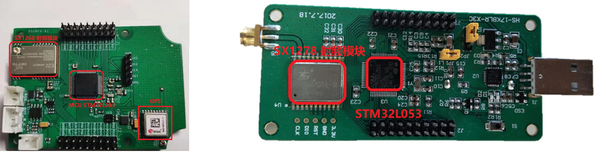
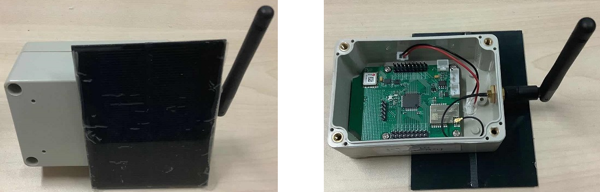
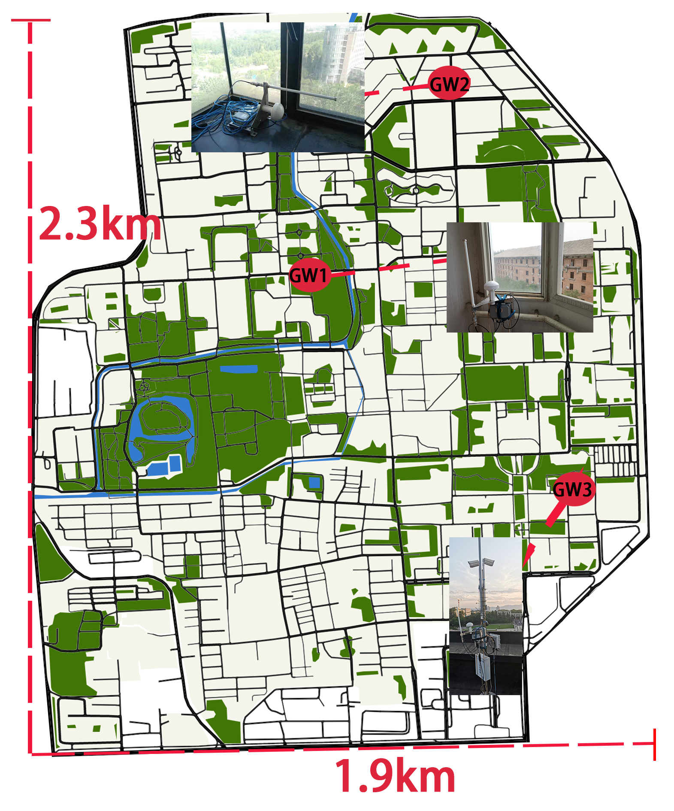
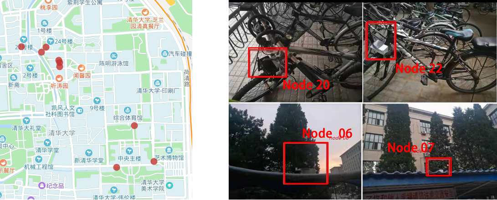
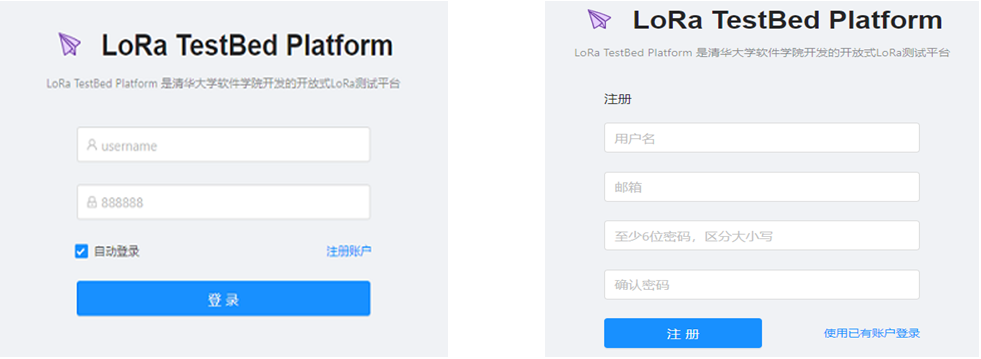

# LoRa测试床概述和功能

## 测试床的必要性
物联网研究中，一个重要的要求是搭建合适的测试体系。我们在之前的无线传感网研究中，就深刻的体会到了这一点。如果没有一个合理的测试体系，开发起来将会特别麻烦。
在低功耗广域网LoRa的研究中，更是如此。目前这一问题被大多数人忽略，所以大多数实验包括研究前沿和论文里面的实验都很难做到高效全面，也很不方便，所以大部分实验规模都相对较小。

同时，我们知道在研究中许多性能和指标的测量需要大量重复的实验和大规模的部署，而这些机械可重复的操作虽然简单，但是却造成了大量人工成本的消耗和浪费。
因此，一个可以对科学理论、计算工具和新技术进行严格、透明和可复制测试的平台就显得尤为重要，这个就是测试床。
搭建了测试床，我们只需要一个简单的指令就可以控制和操作大量的设备，极大的提高了开发和研究效率。

在互联网研究领域，学者们就开发出了许多经典的测试床系统，比如用于WSN(wireless sensor network)的[MoteLab](https://syrah.eecs.harvard.edu/files/syrah/files/motelab-spots05.pdf)[2]，[FlockLab](https://gitlab.ethz.ch/tec/public/flocklab/wikis/home)[17]和[INDRIYA2](https://web.archive.org/web/20070912105942/http://pdos.csail.mit.edu:80/roofnet/doku.php)[4], 用于802.11b/g的[Roofnet](https://web.archive.org/web/20070912105942/http://pdos.csail.mit.edu:80/roofnet/doku.php)[3]等等。

## LoRa测试床
LoRa测试床搭建的初衷是方便快捷的对LoRa设备进行操作和实验。考虑到LoRa长距离通信的特点，我们没有让测试床限制在某一个地方，而是通过设计让其具有了广域通信的能力。因此我们设计了使用树莓派控制LoRa节点的方案，这样的系统具有可移动的特性，可以方便的移动到任何有网络的地方进行实验。
同时，现有的LoRa网络具有非常低的数据速率，并且不能支持无线重新编程。而为了测试LoRa节点的不同协议，我们需要经常更新这些节点的程序。
我们首先采用了带外控制的方案，即采用WiFi、4G等其他信号作为控制信息的载体，来控制LoRa测试床。但是这个方案的不足在于需要提供重组的电力和网络，而室外环境却通常不具备这样的条件。
因此，我们还开发了一套LoRa自主更新的系统，即利用其本身的信号进行控制更新，从而到达实现远程更新的目的，进一步摆脱了电力和网络的限制。

与我们这套测试床系统类似的系统包括[OpenChirp](https://users.ece.cmu.edu/~agr/resources/publications/openchirp-smart-edge-17.pdf)以及阿里的AliOS Things里的[lora平台](https://lora.aliosthings.io)。

**实现功能**

* 烧录新程序
* 打开，关闭，重启LoRa节点
* 批量进行上述的操作
* LoRa节点的远程重编程
* 实时采集数据
* 数据可视化
* 数据导出下载

下面我们着重介绍LoRa测试床的架构设计，部署情况以及使用指南。

## LoRa测试床架构设计

LoRa测试床的总结架构设计如下图所示

图. 测试床设计架构

容易看出，测试床平台由三部分组成：

- LoRa组件搭建的LoRa服务，包括节点，网关和服务器，运行的协议为LoRa相关的协议。

   蓝色的箭头表示通信流程。不同的LoRa节点部署在校园的不同位置。我们还在校园内部署了几个网关。因此，那些LoRa节点可以形成LoRa网络，因此我们可以在网络上进行实验。同时，每个LoRa节点连接到基于树莓派的边缘节点。所有Raspberry Pi边缘节点都通过带外通信（如蜂窝网络）连接到中央服务器。因此，中央服务器可以向基于树莓派的边缘节点发送命令以控制每个节点。中央服务器还可以从边缘节点收集数据。应该注意的是，控制和数据收集与LoRa网络性能本身分离。因此，即使LoRa网络遇到一些问题，我们仍然可以控制网络并收集数据进行诊断。

- 控制平台，这里设计了两套控制方案，分别应对不同的应用场景。

    首先由架构图可以看到第一套方案是我们设计的控制网络，位于图中的左下方，中心服务器接收来自Web服务器的指令，然后将指令传给树莓派系统。由于树莓派系统与LoRa节点是用USB接口连接，故而树莓派系统可以将命令进一步传给LoRa的节点，这样就达到了控制节点的目的。值得一提的是在实际实现中，控制命令是通过内网进行操控，从而更加安全可靠。这种方案需要给树莓派系统供电供网，通常用于室内。

    由于LoRa的通信是双向的，故而也可以采取一套自主更新系统，即使用自身的LoRa信号进行程序的更新。这种更新系统不受电力，网络的外在条件限制，通常用于室外。

- 客户系统

   不同的客户机通过网络连接到Web服务器进行操作，我们提供了方便操作的UI。我们通过共享数据库来实现Web服务器与LoRa服务器之间的数据共享。

这三台服务器是相互独立的，在实际实现里，可以实现在同一台物理机也可以实现在不同的物理机。下面我们将从这三个方面展开进行详细的叙述。

### LoRa组件

为了实现LoRa测试床系统，第一步是将LoRa的一套服务调试完成。这里主要介绍我们使用的LoRa组件，具体实现见LoRa测试床的技术实现部分。

- 服务器

    我们采用的是实验室的一台服务器，Linux系统，LoRa服务对服务器并没有特别的要求，故略去不表。

- 网关

    我们主要使用两种LoRa网关，如下图[网关1](http://risinghf.com/#/product-details?product_id=18&lang=zh)和[网关2](http://risinghf.com/#/product-details?product_id=2&lang=zh)(图片来自[这里](http://risinghf.com))：

    

    
    

    

    
图. 网关设备

    

    它们的主控芯片为ARM Cortex-A53平台，主频1.2GHz。不同之处在于包装和附加功能，比如网关2可以电池供电，提供了更多的接口等。目前测试床有3个网关1和2个网关2。

- 节点

    我们同样拥有两种节点，主要区别在于MCU，射频芯片以及其他传感器件。同时在封装上也有区别，分别适用于室内和室外的部署。

    

    
    

    

    
图. 室外节点和室内节点

    

    节点1的射频芯片为SX1268，MCU为STM32L083，并且含有GPS，温湿度以及动力传感器。节点2则使用SX1278的射频芯片，STM32L53的MCU以及含有串口。

    我们对节点1进一步的封装，使其能够防水防潮，并且装上太阳能板，使其能够在室外长期的工作，效果图如下：

    

    
    

    

    
图. 封装的室外节点

    

    对于节点2，我们让其与树莓派进行串口连接，从而赋予其可移动控制的特性，通常用于室内，效果图如下：

    

    
    

    

    
图. 封装的室内测试床节点

    

### 控制平台

正如前面介绍的，我们设计了两套控制系统，分别是树莓派管控系统和自主更新系统。

* 树莓派管控系统

    **对LoRa节点的控制** 对LoRa节点的控制基于树莓派和节点间的串口连接，这只要将LoRa节点与树莓派串口连接就可以实现。但是要实现LoRa节点对命令的响应，比如烧写，打开，停止这些控制命令，就需要给节点实现Bootloader的服务。

    **树莓派与中心服务器的连接问题** 对于有连接Wifi的条件，我们采用路由器进行网络的分配和管控，同时由于在学校内部，我们一般使用内网进行连接和控制。对于没有连接WiFi的条件，我们则给树莓派+LoRa节点配置了手机SD卡以及穿透服务连接到我们的内网。同时为了便于时时控制和收集运行日志，我们实现了树莓派与服务器间一对一的socket连接进行数据的传输。

* 自主更新系统

    我们使用增量式更新的方式来对LoRa节点的程序内容进行更新。更新生成程序通过对比分析新旧版本的ELF文件生成更新文件，然后LoRa服务器通过网关将更新文件发送到需要更新的节点。节点验证更新文件的正确性后跳转进入IAP程序进行更新，更新完成后程序将跳转回用户程序。

    > 大家可以思考一下如何在LoRa这样的低功耗设备上利用那么小的带宽进行远程重编程，在技术上其实也是有不小的挑战的。后续章节中我们会展开介绍这一部分的技术。

**两种系统的比较**。这两种系统毫无疑问是各有优劣的，树莓派管控系统对于资源要求比较苛刻，比如需要联网，需要长时间不间断供电等等，但是其好在运行稳定，实现相对容易和快捷。自主更新系统则比较自由，对环境条件依赖度很小，但是其实现代价比较高昂，考虑到LoRa本身通信速度的局限性，整套系统的稳定性也有待考量。

### 客户系统

客户端方面我们提供了简单易用的界面以供操作。[点击这里](http://59.110.157.63)进入客户系统。LoRa测试床使用指南详见后续章节。

## LoRa测试床部署情况

**网关**

初期我们部署了3个网关，均为网关1类型，如下图中的网关部署情况。

图. 网关部署情况

从上往下，依次为网关2，网关1和网关3，离地高度分别为36米， 18米和 12米。

这些网关都运行在CN470频段，两个网关都是由运行最新版本的Raspberry PI 3 Model B的Raspbian操作系统，2个网关都配有增益为3db的天线。

**节点**

所有终端收发器的输出功率设置为23 dBm。
由于某些测试位置位于信号较差的区域。 SF一般设为7或者12，7拥有最大的速率，12则拥有最大的距离，带宽设置为125KHz信道。

节点的部署情况分为室外和室内两种，我们分别叫做室外测试床和室内测试床。

* 室外测试床。初期部署50个节点左右，包括静止的节点和移动的节点，对于移动的节点，我们采取的方法是将其绑在自行车上，室外测试床系统目前正在测试和部署中。
下图中显示了9个静止的节点的位置信息以及部署实物图。

    

    
    

    

    
图. 室外节点部署情况

    

* 室内测试床。室内测试床包含50个节点，实物图如下。

    

    
    

    

    
图. 室内测试床

    

每个节点与一个树莓派连接，树莓派连接网线，然后由交换机进行IP分配从而上网。

## LoRa测试床使用指南

点击进入测试床[首页](http://thulpwan.top)。

1. 注册

    

    
    

    

    
图. 注册页面

    

    然后需要等待邮箱回复账号，密码才可登录。

2. 登录

    

    
    

    

    
图. 登录和操作页面

    

    使用获得到的账号，密码登录，进入首页。

3. 操作
    进一步的操作见首页的侧边栏目 **使用说明**。

## 参考文献

[1] https://en.wikipedia.org/wiki/Testbed

[2] Werner-Allen, Geoffrey, Patrick Swieskowski, and Matt Welsh. "Motelab: A wireless sensor network testbed." Proceedings of the 4th international symposium on Information processing in sensor networks. IEEE Press, 2005.

[3] Aguayo, Daniel, et al. "Link-level measurements from an 802.11 b mesh network." ACM SIGCOMM Computer Communication Review. Vol. 34. No. 4. ACM, 2004.

[4] Doddavenkatappa, Manjunath, Mun Choon Chan, and Akkihebbal L. Ananda. "Indriya: A low-cost, 3D wireless sensor network testbed." International conference on testbeds and research infrastructures. Springer, Berlin, Heidelberg, 2011.

[5] Yousuf, Asif M., Edward M. Rochester, and Majid Ghaderi. "A low-cost LoRaWAN testbed for IoT: Implementation and measurements." 2018 IEEE 4th World Forum on Internet of Things (WF-IoT). IEEE, 2018.

[6] Navarro-Ortiz, Jorge, et al. "A LoRaWAN testbed design for supporting critical situations: prototype and evaluation." Wireless Communications and Mobile Computing 2019 (2019).

[7] Trüb, Roman, et al. "Demo Abstract: A Testbed for Long-Range LoRa Communication." 2019 18th ACM/IEEE International Conference on Information Processing in Sensor Networks (IPSN). IEEE, 2019.

[8] Marais, Jaco M., Reza Malekian, and Adnan M. Abu-Mahfouz. "LoRa and LoRaWAN testbeds: A review." 2017 Ieee Africon. IEEE, 2017.

[9] Bankov, Dmitry, Evgeny Khorov, and Andrey Lyakhov. "On the limits of LoRaWAN channel access." 2016 International Conference on Engineering and Telecommunication (EnT). IEEE, 2016.

[10] Petajajarvi, Juha, et al. "On the coverage of LPWANs: range evaluation and channel attenuation model for LoRa technology." 2015 14th International Conference on ITS Telecommunications (ITST). IEEE, 2015.

[11] Cenedese, Angelo, et al. "Padova smart city: An urban internet of things experimentation." Proceeding of IEEE International Symposium on a World of Wireless, Mobile and Multimedia Networks 2014. IEEE, 2014.

[12] Wendt, Thomas, Franziska Volk, and Elke Mackensen. "A benchmark survey of long range (LoRaTM) spread-spectrum-communication at 2.45 GHz for safety applications." 2015 IEEE 16th Annual Wireless and Microwave Technology Conference (WAMICON). IEEE, 2015.

[13] Radcliffe, Peter J., et al. "Usability of LoRaWAN technology in a central business district." 2017 IEEE 85th Vehicular Technology Conference (VTC Spring). IEEE, 2017.

[14] P. Neumann, J. Montavont, , and T. Nol, “Indoor deployment of lowpower
wide area networks (LPWAN): A LoRaWAN case study,” in Proc.
IEEE Wireless and Mobile Computing, Networking and Communications,2016.

[15] Q. Zhou, K. Zheng, L. Hou, J. Xing, and R. Xu, “X-LoRa: An Open Source LPWA Network,” http://arxiv.org/abs/1812.09012, 2019.

[16] HELPER: Heterogeneous Efficient Low Power Radio for Enabling Ad Hoc Emergency Public Safety Networks.

[17] Roman Lim, Federico Ferrari, Marco Zimmerling, Christoph Walser, Philipp
Sommer, and Jan Beutel. 2013. FlockLab: a testbed for distributed, synchronized
tracing and profiling of wireless embedded systems. In Proceedings of the 12th
international conference on Information processing in sensor networks. ACM, 153–166.

[18] Anne-Sophie Tonneau, Nathalie Mitton, and Julien Vandaele. 2014. A survey
on (mobile) wireless sensor network experimentation testbeds. In International
Conference on Distributed Computing in Sensor Systems (DCOSS). IEEE, 263–268.

[19] Fargas, Bernat Carbonés, and Martin Nordal Petersen. "GPS-free geolocation using LoRa in low-power WANs." 2017 global internet of things summit (Giots). IEEE, 2017.
