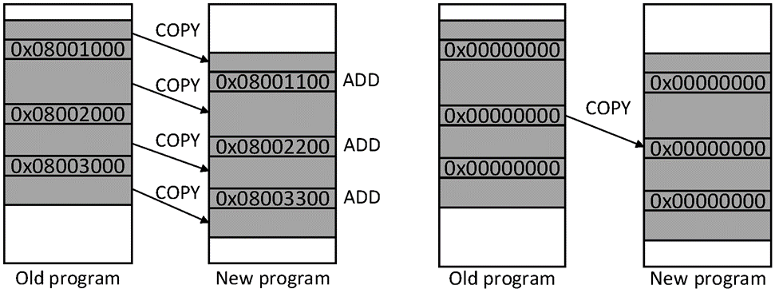

# LoRa设备远程更新

基于LoRa通信远的特点，我们通常会将LoRa设备部署在大范围的室外环境。
此时若对这些设备进行程序更新维护将变得十分困难。
若是依靠人工收集网络中的设备并进行一一重新烧录，将耗费大量人力和时间成本。
由此可见，对设备进行远程更新是物联网中的一个重要功能。我们这里就实现了基于LoRa的远程更新系统，主要分为三个步骤：生成更新包，通过网络传输更新包，应用更新包进行程序更新。


## 更新生成

敬请期待。。。
## 内容更新

敬请期待。。。
## 更新传输

敬请期待。。。
## 自动更新

敬请期待。。。

<!-- LoRa网络的传输速率很低，并且设备常常是由电池供电，对能耗的要求极高。因此，必须设法降低传输的数据总量，减少对网络资源的消耗，不能使得更新过程消耗太多的资源。 使用增量更新是最为常见的方式。增量更新通过寻找新版程序与旧版程序间的相同部分来减少不必要的数据传输。通常情况下，增量更新使用差分算法来计算两个二进制文件间的差异，生成一个编辑脚本来指示在何处拷贝旧程序段和在何处增添新程序段。但是，除了程序代码的增删外，函数和数据的地址变化同样导致了二进制程序文件间的较大差异，仅仅使用差分算法进行计算并不能够得到很好的效果。因此，许多工作都设法消除函数和数据的地址偏移来进一步减少更新体积。

我们设计并实现了完整了面向低功耗广域网的在线更新系统。


**差分算法**

差分算法用于计算两个二进制序列间的差异，并生成表示这些差异的数据。通常情况下，差分算法生成一个编辑脚本以指示终端如何进行更新。编辑脚本一般由如下指令构成：

* `COPY <n> <old address> <new address>` - 从旧版本程序`old address`处复制`n`个字节到新版本程序的`new address`位置。
* `ADD <n> <new address> <data>` - 复制`data`到新版本程序`new address`位置，`n`为`data`的长度。

此外，也有其他指令用于进一步缩减对编辑脚本的大小，如：

* `INSERT <new address> <byte>` – 在`new_address`处插入单个字节。
* `PAD <new address> <value> <n>` – 在`new_address`处用相同的值`value`填充`n`个字节。

但`COPY`和`ADD`指令是最为基础和常用的指令。根据所用指令的不同，有多种相对应的差分算法。

当只使用`COPY`和`ADD`指令并且这些指令按序排布时，由于可以通过之前指令所复制或增添的长度计算出前面已生成新版本程序段的长度，因此可以省略指令中的`<new address>`，把`COPY`指令变为`COPY <n> <old address>`，`ADD`指令变为`ADD <n> <data>`。
考虑到通常程序的长度在64KB至16Mb之间，可以使用3字节表示`<n>`和指令类型，3字节表示`<n>`和指令类型，3字节表示`<old address>`。一条`COPY`指令长度为6，一条`ADD`指令长度为n+3。在这样的条件下，可以用如下算法计算编辑脚本：

* 记oldPro和newPro分别为新旧版本的程序，记cost[i]为构建新程序前i个字节(newPro[0:i])所需指令的最小长度，script[i]为构建新程序前i个字节所需的最后一条指令。
显然我们有cost[i]<=cost[i+1]。当i=1时，使用一条`ADD`指令为最优，此时cost=4。

假设已经求出了i<=k时的cost和script，当i=k+1时，考虑script[i]的两种情况:

* 当script[i]为`ADD`指令时，若script[i-1]同样为`ADD`指令，则只要将script[i-1]中的n改为n+1，此时cost[i]=cost[i-1]+1。若script[i-1]为`COPY`指令，则需要在script[i-1]后新增一条`ADD`指令，此时cost[i]=cost[i-1]+4。

* 当script[i]为`COPY`指令时，在oldPro和newPro中寻找最长的公共子序列，使其满足oldPro[r:r+p]=newPro[i-p:i],r,p为任意数。此时script[i]为`COPY p r`, cost[i]=cost[i-p]+6。

比较上述两种情况，并取其中cost的最小值。经过如上递推，可求出构建新程序所需编辑脚本的长度和最后一条指令的内容，然后根据当script进行反向查找即可获得编辑脚本的全部指令。

算法的伪代码如下：
```
function generateEditScript(old,new){
    cost <- []
    script <- []
    script[0] <- (ADD, 1, 0, new[0:1])
}
``` -->


<!-- **增加代码相似度**

在不同的程序版本中，相同的函数和数据会由于前后代码的增删而产生地址的变动，称为**地址偏移**。这会导致差分算法在对比字节序列时无法将原本相同的代码段匹配起来，因而增大了更新的体积。因此，处理地址偏移对于减少更新体积十分重要。

一种处理地址偏移的方式是：将程序中所有对函数或数据地址的引用从程序中分离出来，将原本的程序分离为**重定位表**和**可重定位代码**两部分，然后分别对这两部分进行处理。其中重定位表记录了所有对函数或数据地址引用的值和在程序中的位置，其格式为：

``` C
typedef struct {
    uint32_t offset; //此引用在程序中的位置
    uint32_t addr; //所引用的地址
} rel_t;
```

一般考虑到程序的长度即offset的范围有限，可将其压缩至2字节。
可重定位代码则由将原本程序中所有对函数或数据地址引用的值修改为0得来。相比于直接对原程序进行差分计算，对可重定位代码进行差分计算得到的结果会大大缩减，并且所减少的大小一般大于重定位表的大小。其原理可以用下图说明：


<center>

</center>

<center>
<div style="color:orange; border-bottom: 1px solid #d9d9d9;
display: inline-block;
color: #999;
padding: 2px;">图. 重定位示例</div>
</center>


假设在新旧程序中有一段相同的代码段，其中有`m(=3)`个对函数或数据的地址引用发生了改变。直接对原程序进行差分计算，结果中包含`m+1(=4)`个`COPY`指令和`m(=3)`个`ADD`指令。每个`COPY`指令花费6字节，每个`ADD`指令花费7字节，共花费`13m+6(=45)`字节。而对可重定位代码进行差分计算，结果只包含1个`COPY`指令，花费6字节，此外还需在重定位表中记录`m(=3)`条地址，花费`6m(=18)`字节，总花费为`6m+6(=24)`字节。使用重定位表将更新大小缩减了`7m(=21)`字节。

为了进一步减少传输消耗，考虑在终端中保存旧版本的重定位表，并对重定位表进行差分计算，传输前后版本的差异而非整个重定位表。与程序不同，重定位表中的数据`offset`和`addr`在前后版本中的值不相同，不能通过对值的匹配进行差分计算。
为了对重定位表进行匹配，我们需要根据可重定位代码的差分结果，计算offset在匹配代码段的相对位置，并检查所引用的函数或数据的符号名称，如果在前后版本都相同，则这两条引用大概率是相同的引用。通过这种方法，我们对重定位表进行匹配并将新版本重定位表分为匹配部分和未匹配部分。对于重定位表的匹配部分，我们计算其`offset`和`addr`的差值，并记录在旧版本重定位表中的位置，得到三元组`(index, d_offset, d_addr)`,然后将相同的`d_offset`和`d_addr`整理在一起，形成如下格式：

```
<d_offset> <n_addr>
    <d_addr> <n_index>
        <index, n>...<index, n>
        ...
    <d_addr> <n_index>
        <index, n>...<index, n>
        ...
    ...
<d_offset> <n_addr>
    ...
```

下面举一个例子来说明：

<center>

</center>

<center>
<div style="color:orange; border-bottom: 1px solid #d9d9d9;
display: inline-block;
color: #999;
padding: 2px;">图. 差分示例</div>
</center>


结果为：

```
    <40> <2>
        <200> <2>
            <101 3> <105 1>
        <400> <2>
            <100 1> <104 1>
```

最终的更新包内容包含如上的整理后的结果，重定位表的未匹配部分，和编辑脚本。终端设备利用重定位表的差分结果完成对重定位表的更新，然后再使用编辑脚本和新版的重定位表对程序部分进行更新。


## 更新传输

当更新包生成之后,需要把更新包传输到所有需要更新的设备中。在无线传感网中，常使用Deluge，trickle等多跳协议来进行传输，但LoRa网络结构一般为星型网络，终端设备直接和网关进行通信，LoRaWAN协议也不支持终端之间的通信，因此多跳协议不适用于LoRa网络。对于网络中只有单个网关，即广播的情况，可以使用rateless code，或其它使用重传的广播协议。而在网络中有多个网关时，网关之间的信号可能存在冲突，最直接的方法是将网络中的终端设备进行分组，每组使用一个网关在不同的信道进行传输，以此避免信号冲突。


## 设备更新

当终端设备接收到更新包并校验无误后，其中的程序跳转到更新程序以执行对原程序的更新。当设备flash比较充足时，一个比较方便的做法是寻找一块可用的空间，首先根据Rdiff和旧的重定位表生成新的重定位表，然后根据编辑脚本生成新的可重定位代码，再由重定位表将可重定位代码中所有函数和数据的地址更改为正确的值，最后将得到的新版本程序复制到旧版本程序的位置并跳转执行即可完成更新。

但是，当设备flash比较有限，不足以存储两份程序和重定位表时，上述方式将不能够正常完成更新。此时，需要在原程序的位置上进行更新。这面临的问题是，当更新程序生成新版本的程序片段并将其写入flash时，这些程序片段会覆盖旧版本的程序片段，而在接下来的更新过程中，这些旧版本的程序片段可能需要被复制到其他位置。因此，必须设法调整生成新程序片段的顺序，使得后生成的新程序片段不依赖于已经被覆盖旧程序片段的数据。

大多数flash的擦写需要以页面为单位进行，因此可以以页面为单位建立起页面间的数据依赖关系，如下图所示：

<center>

</center>

<center>
<div style="color:orange; border-bottom: 1px solid #d9d9d9;
display: inline-block;
color: #999;
padding: 2px;">图. 页面示例</div>
</center>


如果一个`COPY`指令需要从页面j拷贝数据到页面i，页面i依赖于页面j。根据编辑脚本，我们可以构建出一个有向图$G =(V,E)$，其中V代表flash中的页面，边$(u,v)$则表示页面v依赖页面u。如果一个页面u的出度为0，则它不被任何页面依赖，因此可以直接更新页面u而不用担心数据覆盖问题。当页面u更新完成后，可从图中移除点u及和其相接的边，并递推寻找出度为0的点进行更新。当图G中不含有环路时，必定可以找到出度为0的点，因此可以在不覆盖有用数据的条件下完成整个更新。

当图G中含有环路时，页面间存在循环依赖，此时需要保存其中一个页面中的数据至其他位置以打破环路。即寻找一个点u，添加对应点u'，并将所有以u为起点的边变更为以u'为起点，之后便可以对页面u进行更新。由于设备的flash空间有限，我们希望需要保存页面的数量尽可能少，因此问题为，如何在图G中寻找最少数量的点，使得去除这些点及相邻的边后图G不存在环路。

通过深度优先搜索，我们可以找到图G中的所有环路$P=\{C_1,C_2,...C_n\}$，记$S_i=\{C_{i1},C_{i2},...,C_{ik}\}$为通过顶点i的所有环路的集合，$S_i \subseteq P$。为了保证所有的环路都被破坏，我们需要从$\{S_1,S_2,...,S_m\}$中选出最少数量的集合，使得它们的并集能够覆盖集合P。此时问题转化为集合覆盖问题，这是一个NP困难问题，求出最优解的复杂度很高，无法在终端设备上进行计算。可以预先在服务器端使用一些近似算法求近似解，并将结果作为更新包的一部分发送给终端，也可在终端使用复杂度较低的贪心算法以略高的flash占用直接进行更新。当所有页面都完成更新后，更新程序跳转进入新版本程序即可完成整个更新过程。 -->

<!-- [TODO] 自动更新也重新放一章。

* 自主更新系统

  1. **更新文件生成**
  更新文件生成的方法以R2为基础改进而来，利用重定位表来减少不同程序版本间数据和函数地址移位的影响。通过修改链接器参数（如在MDK5进行编译时，添加参数--emit_relocs），我们可以得到含有重定位信息的ELF文件，进而得到所有发生了重定位的位置和重定位的结果地址，我么称其为为重定位表。根据重定位表，我们在bin文件中将所有发生了重定位的位置处的地址修改为0，然后使用算法对修改后的bin文件进行差异计算，得到最短的编辑脚本。我们使用了经过修改的RMTD算法，其编辑脚本中包含如下两种指令：
  `ADD <n> <byte 1...byte n>` :添加n个字节，内容为byte1 ... byte n；
  `COPY <n> <addr>` : 从旧程序的addr处复制n个字节到新程序。
  我们不必在指令中包含新程序的地址，因为这些指令是连续的，写入新程序的地址可以由之前的所有指令计算得来。
  在对bin文件进行修改后，算法计算出的编辑脚本的长度显著减少，但是我们还需要将重定位表包含到更新文件中以供节点还原地址。为了尽可能减少更新文件的大小，我们不是包含完整的重定位表，而是计算新程序重定位表与旧程序重定位表的差异，将其包含到更新文件内。由于地址由链接器按规则分配，在新旧程序对应的重定位表中会有许多项的差值保存一致，利用这一特点，我们寻找所有对应的重定位项并计算差值，根据差值将多个重定位项合在一起包含进更新文件。对于没有对应的重定位项，则直接添加到更新文件中。
  最后，我们计算更新文件的CRC校验码并将其添加到文件尾以供节点进行正确性校验。

  2. **更新文件传输**
  服务器与节点使用一个固定的FPort来进行更新文件的传输。服务器接收上传的更新文件并将文件分成多个包加入下行消息队列。当节点接受到该Fort的消息时进入CLASS C模式以持续接收来自服务器的数据包。若出现丢包，则节点发送消息通知服务器调整消息队列以进行重传。节点接收到全部数据后进行CRC校验，校验通过后则程序跳转进行更新。

  3. **节点程序更新**
  节点内程序的更新分为两部分：重定位表的更新和用户程序更新。
  对重定位表进行更新时，根据差值和旧重定位表项计算出新的表项，并与直接添加的重定位表项进行归并后得到新的重定位表。
  对用户程序进行更新则依据编辑脚本进行，根据ADD或COPY指令从旧程序或更新文件处拷贝数据，并根据重定位表修改部分位置的地址生成新的程序。
  当flash空间充足时，我们可以在不覆盖旧程序的情况下合成出新程序，但当flash空间比较有限时，必须注意不能够覆盖掉需要在之后拷贝的数据。同时，由于flash具有按页擦除的机制，我们希望找到一个程序页面的更新顺序，当按照这个顺序进行更新时不会覆盖需要被拷贝的数据。为此，我们分析编辑脚本中的所有COPY指令并构建出一个表示页面间数据依赖的有向图。当该图无环时，我们必定可以找到期望的页面序列，而当该图有环时，我们保存环路上的一个页面到内存或闪存中以打破环路。在具体实现的算法中，我们每次寻找被拷贝数最少的页面并进行更新。如果该页面被其他页面拷贝了数据，则在更新前保存该页面。在该页面更新后，删除图中对应的边并进行下一轮搜索。
  使用这样乱序对页面进行更新的方式，我们便不需要同时在闪存中储存两个程序，对于闪存空间的需求大大减少；同时因为不必再将新程序在移动到原来的位置，闪存擦写的次数和能量消耗也得到减少。 -->
