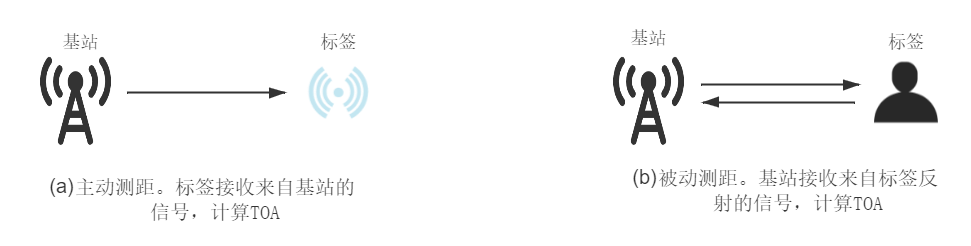
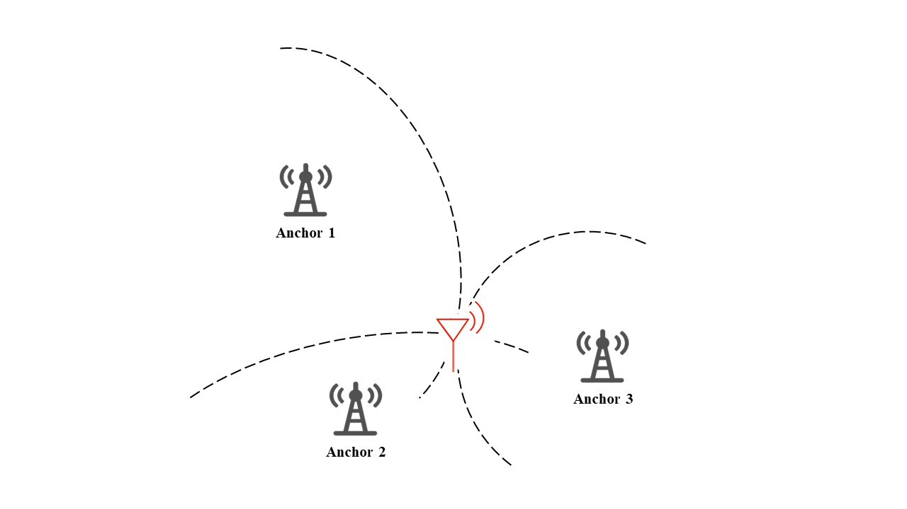

<!-- [TODO] 明确这一章讲的都是定位，而不是测距。 -->
# Time of Arrival (TOA)定位
前面我们介绍了基于传播时间（ToF，ToA）的测距方法，这里我们将在测距的基础上讲述如何进行定位。即使明白了ToA的测距原理，不同的测距方法得到的测距精度也是不一样的。因此在定位之前，我们先介绍两个最简单的测距协议。
<!-- ## 基本原理
基于到达时间 (Time of Arrival)是定位6最基本方法之一。这个方法利用测量得到无线信号在介质中传播的时间$t$，将它乘上相应的传播速度$v$，即可求出无线信号在这段时间传播的距离$d$，接下来利用三边定位的方法可以求解出目标的位置。下面我们将详细的介绍TOA在测距和定位上的应用。

在介绍之前，我们先规范一下使用的名词称呼。我们将待测目标称为标签($Tag$)，将位置已知的节点和设备统称为基站($Anchor$)。 -->

## 测距协议
<!-- 测距即是测量标签到基站的距离。通常情况下，我们将测距分为主动测距和被动测距。如下图所示：

<center>

</center>

<center>
<div style="color:orange; border-bottom: 1px solid #d9d9d9;
display: inline-block;
color: #999;
padding: 2px;">图. 主动和被动测距</div>
</center>

主动测距通常依靠基站和标签的一次或多次应答接收来计算两者直接的距离$d$，而在被动测距里面，标签通常并不具备信号接收的能力。这时候，基站会接收来自标签反射的信号来进行TOA的计算。 -->


直观上，基站和标签通信次数越多，测距的结果倾向于越准确(当然有界限限制)。这里我们介绍两种常见的基于时间戳的测距方法，他们现在已经成为了IEEE 802.15.4 [1]标准的一部分。

**单边双向测距(Single-Sided Two-Way Ranging)**

单边双向测距，顾名思义，即是单边发起的来回通信。为了便于叙述，我们假定两个设备$A，B$。单边双向测距流程的时序简图及其数据包形式如下图所示：

<center>

</center>

<center>
<div style="color:orange; border-bottom: 1px solid #d9d9d9;
display: inline-block;
color: #999;
padding: 2px;">图. 单边单向测距示意</div>
</center>

如图所示，通信由设备$A$发起。在$t_1$时刻，$A$发送$Poll$包给$B$，$B$在$t_2$时刻收到$Poll$包，然后在$t_3$时刻发送$Resp$包给$A$，最后$A$在$t_4$时刻收到$Resp$数据包。
这个方法计算$TOA$就很直观，也很容易理解：

$$T_f = \frac{(t_4-t_1)-(t_3-t_2)}{2} \tag{1}$$

**误差分析**。我们假设误差来自于硬件的时钟漂移，因此我们对设备$A，B$的时钟如下建模[2]：

$$\hat{t}_a=(1+e_a)t_a  {\quad} (a=1,4) \tag{2}$$

$$\hat{t}_b=(1+e_b)t_b  {\quad} (b=2,3) \tag{3}$$

其中$e_a,e_b$分别为设备$A，B$的时钟误差。我们将式子(2)(3)代入(1)，得到考虑时钟偏移后的结果

$$\hat{T}_f = \frac{(\hat{t}_4-\hat{t}_1)-(\hat{t}_3-\hat{t}_2)}{2}$$

因此误差为：

$$
\begin{aligned}
err &= \hat{T}_f - T_f \\
     &= e_aT_f + \frac{t_3-t_2}{2}(e_a-e_b)
\end{aligned}
$$

不妨假设$T_f= 100 ns$, 如果我们使用的是Decawave发布的DW1000芯片，则$t_3-t_2 \approx 1 ms$，设备的时钟漂移为$20ppm$，那么我们可以计算得到误差约为$20 ns$，对应$6m$的测距误差。从上面分析，我们可以知道单边双向测距方法的主要误差来自于两个设备时钟的漂移。所以我们如果在此基础上采用一些常见的同步方法，可以有效的消除误差。而接下来要介绍的双边双向测距的方法，就是一种基于单边双向测距的可行的同步策略。

**双边双向测距(Double--Sided Two-way Ranging)**

双边双向测距，在单边双向测距的基础上额外增加了一次数据传输。这里我们同样使用两个设备$A，B$来说明。双边双向测距过程的时序简图及其数据包形式如下图所示：

<center>

</center>

<center>
<div style="color:orange; border-bottom: 1px solid #d9d9d9;
display: inline-block;
color: #999;
padding: 2px;">图. 双边双向测距示意</div>
</center>

如图所示，设备$A$在$t_1$时刻想设备$B$发送$Poll$数据包，设备$B$在$t_2$时刻接收到，然后在$t_3$时刻返回$Resp$包，设备$A$在时刻$t_4$收到，目前的过程完成了一次单边双向测距流程，不同的是，此后设备$A$再次在$t_5$时刻发送$Final$数据包给$B$，而设备$B$在$t_6$时刻收到$Final$数据。至此，双边双向测距流程结束。
同理，我们可以用如下的公式计算$TOA$：

$$T_f=\frac{((t_4-t_1)-(t_3-t_2))+((t_6-t_3)-(t_5-t_4))}{4} \tag{4}$$

**误差分析**。同样我们假设误差来自于硬件的时钟漂移，我们对设备$A，B$的时钟如下建模[2]：

$$\hat{t}_a=(1+e_a)t_a  {\quad} (a=1,4,5) \tag{5}$$

$$\hat{t}_b=(1+e_b)t_b  {\quad} (b=2,3,6) \tag{6}$$

其中$e_a,e_b$分别为设备$A，B$的时钟误差。我们将式子(5)(6)代入(4)，得到考虑时钟偏移后的结果

$$\hat{T}_f=\frac{((\hat{t}_4-\hat{t}_1)-(\hat{t}_3-\hat{t}_2))+((\hat{t}_6-\hat{t}_3)-(\hat{t}_5-\hat{t}_4))}{4} \tag{7}$$

因此误差可以计算得到

$$
\begin{aligned}
err &= \hat{T}_f - T_f \\
     &= \frac{1}{2}T_f(e_a + e_b) + \frac{1}{4}(e_a-e_b)((t_3-t_2)-(t_5-t_4))
\end{aligned}
$$

不妨假设$T_f= 100 ns$, 如果我们使用的是Decawave发布的DW1000芯片，那么$((t_3-t_2)-(t_5-t_4)) \in (0ns,8ns)$，这里我们取最坏的情况$8ns$，设备的时钟漂移为$20ppm$，那么我们可以计算得到误差约为$2 ps$，对应$0.6mm$的测距误差。可以看到，双边双向测距在理论上的精度远优于单边双向测距的方法。

另外，上面的计算方法依然受两个设备的时钟漂移影响，其实我们可以使用更加优化的算法，消去其中一个设备的时钟影响，这也是为什么我们说双边双向测距相当于在单边双向测距基础上做了时间同步。进一步阅读见[2]。

**其他一些测距方法**

除了上面两种方法外，还有基于它们的各种变种以及其他新颖的测距方法，比如WiFi的FTM(Fine Time Measurement)协议[3]，就是采用多次单边双向测距消去误差，以及UWB的相关研究surepoint[4]，它利用多天线，多信道来减小单边双向测距误差，等等。

## 定位
测距之后，我们就知道了标签到基站的距离。为了求解标签的位置，通常的做法就是利用标签到多基站的距离，然后采用三边定位算法来求解标签的位置。

**三边定位原理**

<center>

</center>

<center>
<div style="color:orange; border-bottom: 1px solid #d9d9d9;
display: inline-block;
color: #999;
padding: 2px;">图. 三边定位</div>
</center>

当测量得到标签到基站的距离$d$之后，我们可以推算出标签在以基站位置为圆心，$d$为半径的圆上，因此如果有多个基站，我们就可以通过求解圆交点的方法求出标签的位置。如上图所示，已知基站1，2，3的坐标，以及标签到基站的距离，我们可以通过三圆求交的方法求出标签的位置。
如果是三维定位，则用圆球去建模，以此类推。

即时知道了三边定位的基本原理，在算法上去实现依然面临各种困难和挑战。比如如何去均衡测距误差的问题，以及在多基站的前提下如何优化选择等等。在科研上，为了摆脱这些算法实现上的考量，通常采用最优化二乘法的方法去求解。

不妨假设已知的基站坐标为$P_{ai} \ (i=1,2,3...N)$，$N$为基站数量。待求解的目标标签坐标为$P_t$。那么我们可以计算理论上标签到各个基站的距离$d_i$

$$d_i = \|P_t-P_{ai}\|$$

同时我们知道测量得到的标签到各个基站的距离$\hat{d}_{i}$，这样我们就把理论值和测量值最接近的位置$P$作为最后的结果

$$P_t = \underset{p}{argmin} \sum_{i=1}^N (d_i-\hat{d}_i)^2$$

**一种解法示例**

理论上，标签位置$(x, y)$在基站位置$(x_i,y_i)$的定位圆的交点上。测量对应的距离分别为$d_i$。我们可以得到下面方程组(一共n个基站)

$$
\begin{cases}
    (x-x_1)^2+(y-y_1)^2=d_1^2\\
    \vdots\\
    (x-x_n)^2+(y-y_n)^2=d_n^2
\end{cases}
\tag{8}
$$

由于测量误差的存在，基于基站的定位圆并不会刚好交于一点。因此，在计算时，我们需要对其进行近似求解。常见方法有加权法、最小二乘法、质心法等。这里我们使用最小二乘法进行计算，在式(8)的基础上，我们将前n-1个方程减去第n个方程，得到线性化方程：$AX=b$。其中：

$$
A=\left[
    \begin{matrix}
        2(x_1-x_n) & 2(y_1-y_n)\\
        2(x_{n-1}-x_n) & 2(y-{n-1}-y_n)
    \end{matrix}
\right],
$$

$$
b=\left[
    \begin{matrix}
        x_1^2-x_n^2+y_1^2-y_n^2+d_n^2-d_1^2\\
        x_{n-1}^2-x_n^2+y_{n-1}^2-y_n^2+d_n^2-d_{n-1}^2
    \end{matrix}
\right]
$$

则，利用最小二乘法可以解得：

$$
X=(A^TA)^{-1}A^Tb \tag{9}
$$

相关代码如下

```matlab
nodeNumber = 3;   %定位信标的数量
nodeList = [0, 0; 2, 0; 1, 1.732];   %三个定位信标的坐标
disList = [1.155, 1.155, 1.155];    %定位目标点到三个定位信标的距离

A = [];
B = [];
xn = nodeList(nodeNumber, 1);
yn = nodeList(nodeNumber, 2);
dn = disList(nodeNumber);
for i=1:nodeNumber-1
    xi = nodeList(i, 1);
    yi = nodeList(i, 2);
    di = disList(i);
    A = [A; 2 * (xi - xn), 2 * (yi - yn)];
    B = [B; xi * xi + yi *yi - xn * xn - yn * yn + dn * dn - di * di];
end    %计算线性方程组的参数A和B

X = inv(A'*A)*A'*B   %根据最小二乘法公式计算结果X
```

代码中，nodeList表示基站的位置坐标，nodeNumber表示基站的数量，disList表示标签到各基站的距离。分别求得A和B以后，根据式(9)即可求得定位点的坐标X。

在实际应用中，我们需要根据实际情况选择更合适的方法，代替最小二乘法实现位置的近似计算，实现更高的定位精度。对于某些近似方法，可能无法实现对方程的直接求解，或是直接求解方程很困难，此时可以使用数值方法进行近似求解，常见的方法有梯度下降法等。

（延伸阅读：https://github.com/megagao/IndoorPos）

## 参考文献

[1] IEEE 802 Working Group et al. 2011. Ieee standard for local and metropolitan
area networks—Part 15.4: Low-rate wireless personal area networks (lr-wpans).
IEEE Std 802 (2011), 4–2011.

[2] Dries Neirynck, Eric Luk, and Michael McLaughlin. 2016. An alternative doublesided
two-way ranging method. In 2016 13th workshop on positioning, navigation
and communications (WPNC). IEEE, 1–4.

[3] "IEEE Standard for Information technology–Telecommunications and information
exchange between systems Local and metropolitan area networks–Specific
requirements - Part 11: Wireless LAN Medium Access Control (MAC) and Physical
Layer (PHY) Specifications". "IEEE Std 802.11-2016 (Revision of IEEE Std
802.11-2012)", pages 1–3534, Dec 2016.

[4] Benjamin Kempke, Pat Pannuto, Bradford Campbell, and Prabal Dutta. 2016. Surepoint:
Exploiting ultra wideband flooding and diversity to provide robust, scalable,
high-fidelity indoor localization. In Proceedings of the 14th ACM Conference on
Embedded Network Sensor Systems CD-ROM. 137–149.
