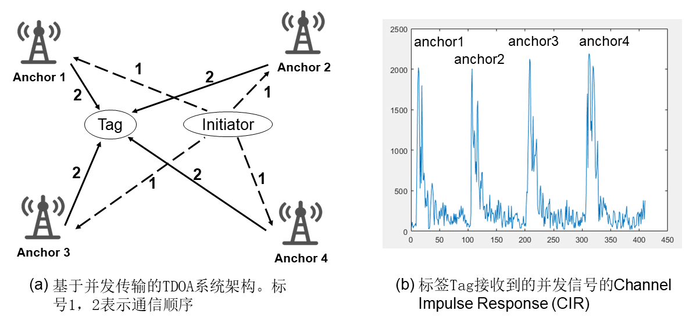

# Time Difference of Arrival (TDOA)定位

## 基本原理
到达时间差(TDOA)，顾名思义，就是利用无线信号到达的时间差$\Delta t$，乘上信号传输的速度$v$，从而可以求出无线信号的路程差$\Delta d$。然后我们就可以利用几何知识(即双曲线)求解出目标的位置。

在进一步介绍之前，我们先规范一下使用的名词称呼。我们将待测距、定位的目标称为标签($Tag$)，将位置已知的节点、设备统称为基站($Anchor$)。

## 定位方法
利用TDOA来定位的方法主要可以分为两种情况：

<center>

</center>

<center>
<div style="color:orange; border-bottom: 1px solid #d9d9d9;
display: inline-block;
color: #999;
padding: 2px;">图. TDOA定位方法原理</div>
</center>

- **第一种情况**，由标签向基站发送数据，基站在收到数据后，打上相应的时间戳。这样标签到各个基站的路程差就对应时间差。
- **第二种情况**，所有基站同时向标签发送数据，标签记录信号到达时间差。可以看到，要实现这样的TDOA系统，基站间的时间同步是必须的。同时，在支持定位的设备数量上面，第二种方法比第一种明显更多，但它涉及基站调度问题，实现上更加复杂。

TDOA的系统在研究和实际中均有很广泛的用途。由此衍生的各种定位方法和系统也层出不穷。下面我们介绍一种前沿的基于并发传输来实现TDOA的研究方法。

## 基于并发传输的TDOA方法
通过上面的分析，我们知道TDOA依赖时间同步来同步基站，从而实现基站的同时接收或者同时发送数据。但在实际系统部署中，实现严格的时间同步很难，而且需要额外的部署开销。因此，寻求新方法打破这一限制就很必要。而基于并发传输的TDOA方法就是这样一种方法[1][2]。

<center>

</center>

<center>
<div style="color:orange; border-bottom: 1px solid #d9d9d9;
display: inline-block;
color: #999;
padding: 2px;">图. 并发TDOA</div>
</center>

如上图所示，图(a)为系统架构，这里引入了一个名叫发起节点(initiator)的角色，其位置也是已知的。发起节点主动发起一次通信给四个基站，四个基站收到这个消息之后，分别延时一段很小的时间(纳秒级别)，因此可以将他们近似等同于同时发送信息。当标签收到来自基站的信息后，由于基站的消息间隔极小，一般情况下是解析不了这些消息的。但是却不妨碍标签生成相应的信道响应信息(Channel Impulse Response， CIR) (大家可以自行去信道这一章节回顾响应信息)。上图(b)显示了标签测量得到的CIR信息，其中四个峰值分别对应四个基站。每个CIR对应的时间间隔是已知且固定的($\tau$)，这样两个基站到标签的时间差($\Delta t$)可以通过计算CIR上两个基站对应的间隔($inter\_cir$)，然后采用$\Delta t = inter\_cir \times \tau$求出。

值得注意的是，并非所有的通信信号及设备具备纳米级分辨率。而超宽带(Ultra-wideband, UWB)正是这样一种射频信号。UWB信号指的是带宽至少为$500 MHz$的无线信号。也正得益于这样的超宽带，UWB具有纳秒级的时间分辨率，因此具有极高的测距定位精度。而上面基于并行传输的TDOA方法也正是在UWB设备上实现的。

> 思考： 虽然并发传输的TDOA方法可以支持无数标签，因此极大的提高了定位系统的容量。但是并发传输是基于设备的CIR评测，而CIR评测受环境影响很大，而且目前UWB设备的CIR分辨度为1ns，对应30cm的距离，限制了方法的精度。同时，并发传输依然可能存在信号冲突问题等等。那么有没有更加优雅的TDOA方法，这样的方法即简单，鲁棒又能保持很高的精度呢？目前我们实验组正在研究这样一种方法，会在之后逐步公开。

## TDOA算法示例
我们这里以TDOA算法为例，即假设我们使用UWB测量得到了TDOA的信息，然后使用经典的Chan算法来求解标签的位置。下面为简单的Chan算法实现：

```matlab
clc;
clear;

% 基站数目
BSN = 4;
% 各个基站的位置，2*BSN的矩阵存储，每一列是一个坐标
BS = [0 , sqrt(3) , 0.5*sqrt(3) , -0.5*sqrt(3);
      0 ,       0 ,         1.5 ,         1.5];
% MS的实际距离,为待测量值
MS = [2 3];
% R0为无噪声情况下各个BS与MS的距离
for i = 1:BSN
    R0(i) = sqrt((BS(1,i)-MS(1))^2 + (BS(2,i)-MS(2))^2);
end
% R(i)是BSi与BS1到MS的距离差，实际中因由TDOA*c计算
for i = 1:BSN-1
    R(i) = R0(i+1) - R0(1);
end

% 第一次加权最小二乘估计
for i = 1:BSN
    k(i) = BS(1,i)^2 + BS(2,i)^2;
end
for i = 1:BSN-1
    h(i) = 0.5*(R(i)^2 - k(i+1) + k(1));
end
for i = 1:BSN-1
    Ga(i,1) = -BS(1,i+1);
    Ga(i,2) = -BS(2,i+1);
    Ga(i,3) = -R(i);
end
Za = inv(Ga' * Ga) * Ga' * h';
X(1,1) = abs(Za(1,1));
X(2,1) = abs(Za(2,1));

% 第二次加权最小二乘估计
X1 = BS(1,1);
Y1 = BS(2,1);
h2 = [(Za(1,1) - X1)^2;	(Za(2,1) - Y1)^2; Za(3,1)^2];
Ga2 = [1,0;   0,1;   1,1];
B2 = [Za(1,1)-X1,  0,           0;
      0,           Za(2,1)-Y1,  0;
      0,           0,           Za(3,1)];
Za2 = inv(Ga2' * inv(B2) * Ga' * Ga * inv(B2) * Ga2) * (Ga2' * inv(B2) * Ga' * Ga * inv(B2)) * h2;

X(1,1) = abs(Za2(1,1))^0.5 + X1;
X(2,1) = abs(Za2(2,1))^0.5 + Y1;
disp(X)
```

注意这里我们直接使用标签$MS$的位置来计算TDOA的信息(实际上应由UWB测量得到)，因此最后求出的结果X，应该完全与$MS$结果一样。

## 参考文献

[1] Pablo Corbalán, Gian Pietro Picco, and Sameera Palipana. 2019. Chorus: UWB
concurrent transmissions for GPS-like passive localization of countless targets. In
2019 18th ACM/IEEE International Conference on Information Processing in Sensor
Networks (IPSN). IEEE, 133–144.

[2] Bernhard Gro𝛽windhager, Michael Stocker, Michael Rath, Carlo Alberto Boano,
and Kay Römer. 2019. SnapLoc: An ultra-fast UWB-based indoor localization
system for an unlimited number of tags. In 2019 18th ACM/IEEE International
Conference on Information Processing in Sensor Networks (IPSN). IEEE, 61–72.
